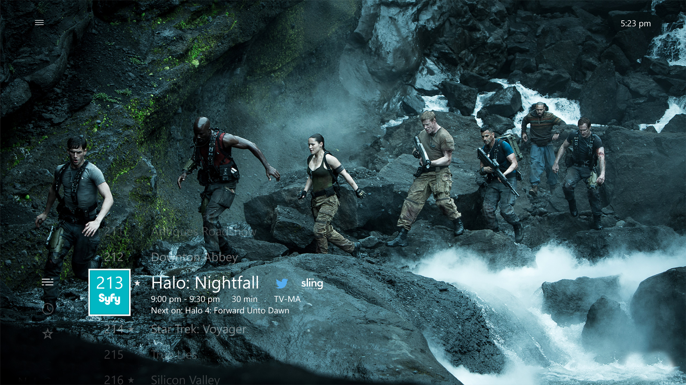
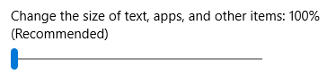
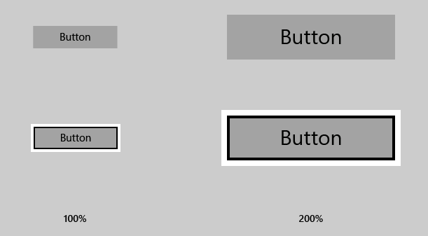
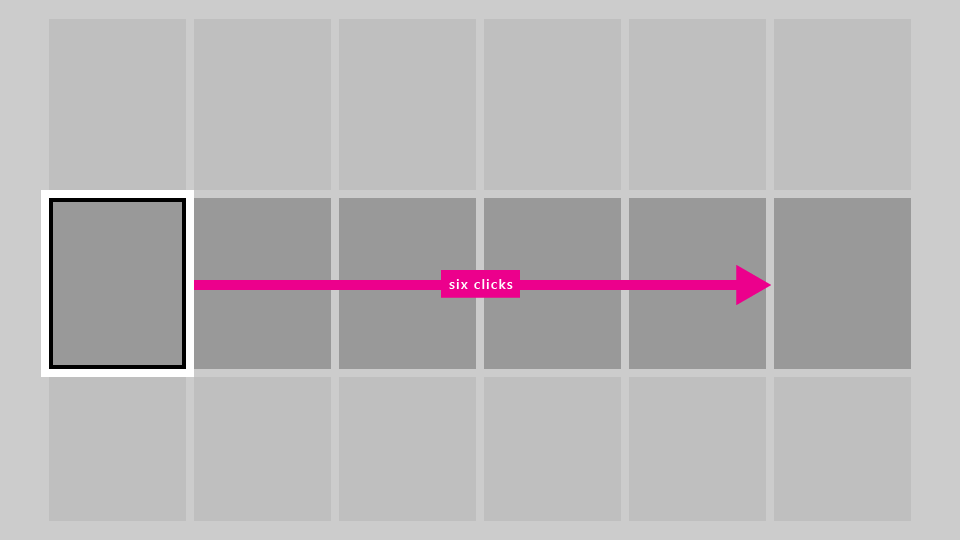
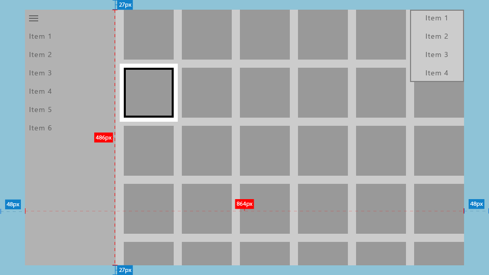
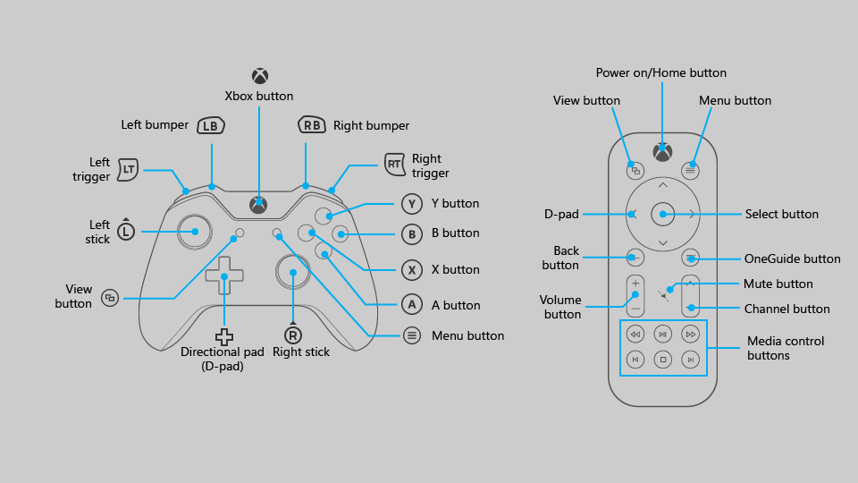
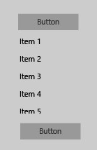
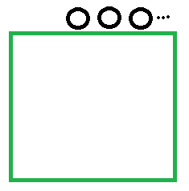

<!--Note to Eliot from Linda: see my comments by searching on v-lcap; after your review, I recommend removing all commented out text unless you think you may need it later; it just gets in the way of an already long doc-->

> \[Este artigo descreve um recurso que ainda não está disponível. Este recurso pode ser modificado substancialmente antes de sua versão comercial. A Microsoft não faz nenhuma garantia, expressa ou implícita, com relação às informações fornecidas aqui.\]

# Projetando para TV e Xbox

Projete seu aplicativo UWP (Universal Windows Platform) para que ele tenha uma boa aparência e funcione bem no Xbox One e em telas de televisão.

## Visão geral

A Plataforma Universal do Windows permite que você crie experiências agradáveis em diversos dispositivos com o Windows 10. 
A maior parte da funcionalidade fornecida pela estrutura UWP permite que os aplicativos usem a mesma interface de usuário (UI) entre esses dispositivos, sem nenhum trabalho adicional. 
No entanto, adaptar e otimizar seu aplicativo para funcionar perfeitamente em telas de TV e no Xbox One requer considerações especiais.

A experiência de sentar em seu sofá na sala, usando um gamepad ou um controle remoto para interagir com sua TV, é chamada de **experiência de 3 metros**. 
Ela é chamada assim porque o usuário em geral está sentado a aproximadamente 3 metros de distância da tela. 
Isso proporciona desafios únicos que não estão presentes na, digamos, experiência de *meio metro* ou na interação com um computador. 
Se você estiver desenvolvendo um aplicativo para Xbox One ou qualquer outro dispositivo que é mostrado na tela da TV e usa um controlador para entrada, você sempre deve ter isso em mente.

Nem todas as etapas deste artigo são necessárias para fazer com que seu aplicativo funcione bem em experiências de 3 metros, mas compreendê-las e tomar as decisões apropriadas para seu aplicativo resultará em uma experiência de 3 metros melhor adaptada às necessidades específicas do seu aplicativo. 
À medida que você dá vida ao seu aplicativo no ambiente de 3 metros, considere os princípios de design seguintes.

### Simples

Projetar para o ambiente de 3 metros apresenta um conjunto único de desafios. A resolução e a distância de exibição podem tornar difícil para as pessoas processar muitas informações. 
Tente manter seu design limpo, reduzido aos componentes mais simples possíveis. A quantidade de informações exibidas em uma TV deve ser semelhante ao que você veria em um celular, e não em uma área de trabalho.



### Coerente

Os aplicativos UWP no ambiente de 3 metros devem ser intuitivos e fácil de usar. Torne o foco claro e inconfundível. 
Organize o conteúdo para que o movimento no espaço seja consistente e previsível. Ofereça às pessoas o caminho mais curto para o que elas desejam fazer.


_**Todos os filmes mostrados na captura de tela estão disponíveis no Microsoft Movies e TV.**_  

### Atraentes

As experiências cinematográficas mais imersivas ocorrem na tela grande. Cenário de ponta a ponta, movimento elegante e uso vibrante de cor e tipografia levam seus aplicativos para o próximo nível. Seja ousado e belo.


### Otimizações para a experiência de 3 metros

Agora que você conhece os princípios de design de aplicativo UWP adequados para a experiência de 3 metros, leia a seguinte visão geral sobre maneiras específicas em que você pode otimizar seu aplicativo e proporcionar uma excelente experiência do usuário.
<!--[v-lcap] I recommend shortening the descriptions to the bare minimum, and focusing on the rest in the actual sections. I also rearranged the order of this table to map to the order you have in the document.-->


| Recurso        | Descrição           |
| -------------------------------------------------------------- |--------------------------------|
| [Dimensionamento de elemento de interface do usuário](#ui-element-sizing)  | A Plataforma Universal do Windows usa [dimensionamento e pixels eficazes](..\layout\design-and-ui-intro.md#effective-pixels-and-scaling) para dimensionar a interface do usuário de acordo com a distância de exibição. Quando um aplicativo UWP é executado no Xbox One, ele usa um fator de escala padrão apropriado para criar todos os elementos de interface do usuário, como texto e controles comuns, facilmente visíveis no sofá da sala. Compreender o dimensionamento e aplicá-lo em sua interface do usuário ajudará você a otimizar seu aplicativo para o ambiente de 3 metros.  |
|  [Área segura para a TV](#tv-safe-area) | Nem todas as TVs exibem conteúdo até a borda da tela por motivos históricos e tecnológicos. A UWP evitará automaticamente exibir qualquer interface do usuário em áreas não seguras (áreas perto das bordas da tela) por padrão. No entanto, isso cria um efeito de "box-in" em que a interface do usuário parece estar em letterbox. Para que seu aplicativo seja realmente imersivo na TV, você deve modificá-lo para que ele se estenda para as bordas da tela em TVs compatíveis com esse recurso. |
| [Cores](#colors)  |  A UWP é compatível com temas de cores e um aplicativo que respeita o tema do sistema será padonizado como **escuro** no Xbox One. Se o seu aplicativo tiver um tema de cor específico, você deve considerar que algumas cores não funcionam bem na TV e devem ser evitadas. Para obter melhores resultados possíveis, considere a criação de uma paleta de cores específicas de TV para seu aplicativo. |
| [Gamepad e controle remoto](#gamepad-and-remote-control)      | Certificar-se de que seu aplicativo funciona bem com gamepad e controle remoto é a etapa mais importante na otimização para experiências de 3 metros. Dar suporte corretamente à interação e à navegação de teclado ajuda a fazer a entrada de gamepad e de controle remoto funcionar relativamente bem. No entanto, existem melhorias específicas no gamepad e no controle remoto que você pode fazer para otimizar a experiência de interação do usuário em um dispositivo em que suas ações são relativamente limitadas. |
| [Modo de mouse](#mouse-mode)|Em algumas interfaces do usuário, como mapas e superfícies de desenho, não é possível ou prático usar navegação de foco do plano XY. Para essas interfaces, a UWP fornece o **modo de mouse** para permitir que o gamepad/controle remoto navegue livremente, como um mouse em um computador desktop.|
| [Foco visual](#focus-visual)  | O foco visual é a borda em torno do elemento de interface do usuário que tem o foco no momento. Isso ajuda a orientar o usuário para que ele possa navegar facilmente em sua interface do usuário sem se perder. Enquanto o foco visual funciona em vários dispositivos Windows 10, convém se certificar de que ele seja fácil de ver na TV e que ele por padrão apareça em um local com o qual o usuário interagirá com frequência. Se o foco não estiver claramente visível, o usuário pode se perder em sua interface do usuário e não ter uma boa experiência. Além disso, tire proveito da [sobreposição com light dismiss](#light-dismiss-overlay) para chamar a atenção para a interface do usuário com a qual um usuário está interagindo no momento.  |
| [Interação e navegação de foco do plano XY](#xy-focus-navigation-and-interaction) | A UWP oferece **navegação de foco do plano XY** que permite que o usuário navegue pela interface do usuário do seu aplicativo. No entanto, isso limita o usuário a navegar para cima, para baixo, para a esquerda e direita. Recomendações para lidar com isso e outras considerações são descritas nesta seção. Talvez você precise utilizar [envolvimento de foco](#focus-engagement) (pressionando o botão **Enter/Selecionar** para interagir com um elemento da interface do usuário) para usar determinados controles, como controles deslizantes. Isso reduz o número de cliques necessários para ir de um lado da tela para o outro. | 
| [Diretrizes de controles da interface do usuário](#guidelines-for-ui-controls)  |  Há determinadas melhorias que você pode fazer em seu aplicativo que façam sentido para todos os dispositivos Windows 10, não apenas Xbox One ou outras experiências de 3 metros. Em vez de apenas aprimorar a experiência de três metros, considere a aplicação destas práticas recomendadas em todos os dispositivos compatíveis com a UWP, que são particularmente úteis para TV.  |

<!--[v-lcap] "Focus engagement" is an H2 section that precedes "XY focus"; I recommend either putting it in its own row in the table ahead of XY focus, or changing it to an H3 section under "XY focus," whichever makes more sense; just as long as the overview table  matches what you do-->

<!--| [Sound](../style/sound.md)  |  Sounds play a key role in the 10-foot experience, helping to immerse and give feedback to the user. The UWP provides functionality that automatically turns on sounds for common controls when the app is running on Xbox One. Find out more about the sound support built into the UWP and learn how to take advantage of it. |-->


<!--[v-lcap] I had to put this table into markdown because the links weren't rendering in HTML.
<table>
    <tr>
        <td> [Gamepad and remote control](#gamepad-and-remote-control)</td>
        <td>Making sure that your app works well with gamepad and remote is the most important step in optimizing for 10-foot experiences. Properly supporting keyboard interaction and navigation helps get gamepad and remote control input working relatively well. However, there are gamepad and remote-specific improvements that you can make to optimize the user interaction experience on a device where their actions are somewhat limited.
        </td>
    </tr>
    <tr>
        <td>[XY focus navigation and interaction](#xy-focus-navigation-and-interaction)</td>
        <td>The UWP provides **XY focus navigation** that allows the user to navigate around your app's UI. However, this limits the user to navigating up, down, left, and right. Recommendations for dealing with this and other considerations are outlined in this section. You may also need to utilize [focus engagement](#focus-engagement) (by pressing the **Enter/Select** button to interact with a UI element) to use certain controls, such as sliders. This cuts down on the number of clicks required to get from one side of the screen to the other.
        </td>
    </tr>
    <tr>
        <td>[Mouse mode](#mouse-mode)</td>
        <td>In some user interfaces, such as maps and drawing surfaces, it is not possible or practical to use XY focus navigation. For these interfaces, the UWP provides **mouse mode** to let the gamepad/remote navigate freely, like a mouse on a desktop computer.
        </td>
    </tr>
    <tr>
        <td>[Focus visual](#focus-visual)</td>
        <td>The focus visual is the border around the UI element that currently has focus. This helps orient the user so that they can easily navigate your UI without getting lost. While focus visual works across multiple Windows 10 devices, you will want to make sure that it is easy to see on TV and that it defaults to a location that the user will interact with often. If the focus is not clearly visible, the user could get lost in your UI and not have a great experience. Also, take advantage of [Light dismiss overlay](#light-dismiss-overlay) to call attention to UI that a user is currently interacting with.
        </td>
    </tr>
    <tr>
        <td>[UI element sizing](#ui-element-sizing)</td>
        <td>
            The Universal Windows Platform uses [scaling and effective pixels](..\layout\design-and-ui-intro.md#effective-pixels-and-scaling) to scale the UI according to the viewing distance. 
            When a UWP app is running on Xbox One, it uses an appropriate default scale factor in order to make all the UI elements, such as text and common controls, easily visible from your couch across the room. 
            Understanding sizing and applying it across your UI will help optimize your app for the 10-foot environment.
        </td>
    </tr>
    <tr>
        <td>[TV-safe area](#tv-safe-area)</td>
        <td>
            Not all TVs display content all the way to the edge of the screen due to historical as well as technological reasons. 
            The UWP will automatically avoid displaying any UI in unsafe areas (areas close to the edges of the screen) by default. However, this creates a "boxed-in" effect in which the UI looks letterboxed. 
            For your app to be truly immersive on TV, you will want to modify it so that it extends to the edges of the screen on TVs that support it.
        </td>
    </tr>
    <tr>
        <td>[Colors](#colors)</td>
        <td>
            The UWP supports color themes, and an app that respects the system theme will default to **dark** on Xbox One. 
            If your app has a specific color theme, you should consider that some colors don't work well for TV and should be avoided. 
            For the best possible results, consider creating a TV-specific color palette for your app.
        </td>
    </tr>
    <tr>
        <td>[Sound](../style/sound.md)</td>
        <td>
            Sounds play a key role in the 10-foot experience, helping to immerse and give feedback to the user. The UWP provides functionality that automatically turns on sounds for common controls when the app is running on Xbox One. Find out more about the sound support built into the UWP and learn how to take advantage of it.
        </td>
    </tr>
    <tr>
        <td>[Guidelines for UI controls](#guidelines-for-ui-controls)</td>
        <td>
            There are certain improvements you can make to your app that make sense for all Windows 10 devices, not just Xbox One or other 10-foot experiences. 
            Rather than only improving the 10-foot experience, consider applying these best practices across all devices supported by the UWP, which are particularly beneficial for TV.
        </td>
    </tr>
</table>-->

<!--### Gamepad and remote interaction

Users of your TV app won't be interacting with the UI with a high-precision input device such as a mouse, and this needs to be taken into account when designing your app's interface. Visibility of the **focus visual** (the border highlighting the UI element that the user is currently navigated to) is also key to making sure that the user doesn't get lost.

#### [Gamepad and remote control](#gamepad-and-remote-control)

Making sure that your app works well with gamepad and remote is the most important step in optimizing for TV. As mentioned in [Running UWP apps on Xbox One](#running-uwp-apps-on-xbox-one), properly supporting keyboard interaction and navigation helps get gamepad and remote control input working relatively well. However, there are gamepad- and remote-specific improvements that you can make to optimize the user interaction experience on a device where their actions are somewhat limited.

#### [Focus visual](#focus-visual)

While focus visual works across multiple Windows 10 devices, you will want to make sure that it is easy to see on TV and that it defaults to a location that the user will interact with often. If the focus is not clearly visible, the user could get lost in your UI and not have a great experience.

#### [2D focus navigation and interaction](#2d-focus-navigation-and-interaction)

UWP provides 2D navigation that allows the user to navigate around your app's UI. However, this limits the user to navigating up, down, left, and right. Recommendations for dealing with this and other considerations are outlined in [2D navigation best practices](#2d-navigation-best-practices). You may also need to utilize [focus engagement](#focus-engagement) (pressing the **Enter/Accept** button to interact with a UI element) to use certain controls, such as sliders. This cuts down on the number of clicks required to get from one side of the screen to the other.

#### [Mouse mode](#mouse-mode)

In some user interfaces, such as maps and drawing surfaces, it is not possible or practical to use 2D navigation. For these interfaces, UWP provides **mouse mode** to let the gamepad/remote navigate freely, like a mouse on a desktop computer.

### Layout and content density

Unlike with desktop apps, in which the user is close to the screen, a user interacting with your app on TV will likely be sitting in a couch across the room. Because of this, reducing content density is important so that the user can easily navigate your app. Remember: simplicity is key.

#### [UI element sizing](#ui-element-sizing)

The Universal Windows Platform uses [scaling and effective pixels](../layout/grid.md) to scale the UI according to the viewing distance. When a UWP app is running on Xbox One, it uses an appropriate default scale factor in order to make all the UI elements, such as text and common controls, easily visible from your couch across the room. Understanding sizing and applying it across your UI will help optimize your app for TV.

#### [TV-safe area](#tv-safe-area)

Not all TVs display content all the way to the edge of the screen due to historical as well as technological reasons. UWP will automatically avoid displaying any UI in unsafe areas (areas close to the edges of the screen) by default. However, this creates a "boxed-in" effect in which the UI looks letterboxed. For your app to be truly immersive on TV, you will want to modify it so that it extends to the edges of the screen on TVs that support it.

### Styles for TV

When designing for TV, there are special considerations in regards to color and sound. The styles you use may work great for other devices, but might need some optimizing to make them shine on TV.

#### [Colors](#colors)

UWP supports color themes, and an app that respects the system theme will default to **dark** on Xbox One. If your app has a specific color theme, you should consider that some colors don't work well for TV and should be avoided. For the best possible results, consider creating a TV-specific color palette for your app.

#### [Sound](../style/sound.md)

Sounds play a key role in TV apps, helping immerse the user in the interactive experience. Find out more about the sound support built into UWP and learn how to take advantage of it.

### [Improvements for all platforms](#improvements-for-all-platforms)

There are certain improvements you can make to your app that make sense for all Windows 10 platforms, not just Xbox One or other TV experiences. Rather than only improving the TV experience, consider applying these best practices that apply across all platforms UWP supports, and are particularly beneficial for TV.
-->

<!--## Running UWP apps on Xbox One

Some features for UWP in the 10-foot environment are built-in, and you will get these without any additional work once you properly port to Xbox One. However, there are other optimizations you may want to consider making so that your app performs as well as it can on Xbox. Learn about these features in the following sections.

### Gamepad and remote control support

Arrow key and tab stop behavior (pressing **Tab** to get to the next UI element) on keyboard informs how 2D navigation moves focus through the **D-pad** on a game controller or remote. The **Enter** and **Space** keys are also automatically mapped to the **Enter/Accept** key (see [Gamepad and remote control](#gamepad-and-remote-control)).

The quality of gamepad and remote behavior that you get out of the box depends on how well keyboard is supported in your app, and thus may vary greatly from app to app. A good way to ensure that your app will work well with gamepad/remote is to make sure that it works well with keyboard on PC, and then test with gamepad/remote to find weak spots in your UI.

### TV-safe area

Using the [VisibleBounds](https://msdn.microsoft.com/en-us/library/windows/apps/windows.ui.viewmanagement.applicationview.visiblebounds.aspx) functionality of UWP (for more information, see [TV-safe area](#tv-safe-area)), the following will be done automatically for your app:

* All UI elements are drawn inside the TV-safe area
* The page's background colors are drawn all the way to the edges of the TV


### UI scaling

UWP supports proper scaling of UI based on the settings of the system on which the app is currently running. On desktop, this setting can be found in **Settings > System > Display** as a sliding value. This same setting exists on phone as well if the device supports it.



On Xbox One there is no such system setting, however in order for UWP UI elements to be sized appropriately for TV, they are scaled at a default of **200%**. As long as UI elements are appropriately sized for other platforms, they will be appropriately sized for TV as well. For more information, see [UI element sizing](#ui-element-sizing).


### Focus visual

The same focus visual can be used for keyboard as well as game controller input, and will always be highly visible on any platform that supports focus visual, including Xbox One and the 10-foot experience. For more information, see [Focus visual](#focus-visual).

### Sound

UWP provides functionality that automatically turns on sounds for common controls when the app is running on Xbox One. This helps provide feedback to the user that they have interacted with the app in some way. For more information, see [Sound](../style/sound.md).

### Accent color and high contrast colors

As long as your app uses a brush resource such as **SystemControlForegroundAccentBrush**, or a color resource (**SystemAccentColor**), or instead calls accent colors directly through the [UIColorType.Accent*](https://msdn.microsoft.com/en-us/library/windows/apps/windows.ui.viewmanagement.uicolortype.aspx) API, those colors are replaced with accent colors appropriate for TV. High contrast brush colors are also pulled in from the system the same way as on PC and phone, but with TV-appropriate colors.

### Light dismiss overlay

In order to call the user's attention to the UI elements that the user is currently manipulating with the game controller or remote control, UWP automatically adds a "smoke" layer that covers areas outside of the popup UI when the app is running on Xbox One. This requires no extra work, but is something to keep in mind when designing your UI.
-->

## Dimensionamento de elemento de interface do usuário

Como o usuário de um aplicativo no ambiente de 3 metros está usando um controle remoto ou gamepad e está sentado a vários metros da tela, há algumas considerações de interface do usuário que precisam ser fatoradas em seu design. 
Certifique-se de que a interface do usuário tenha uma densidade de conteúdo adequada e não está desorganizada demais para que o usuário possa navegar e selecionar elementos facilmente. Lembre-se: simplicidade é a chave.

### Fator de escala e layout adaptável

**Fator de escala**: ajuda a garantir que os elementos de interface do usuário sejam exibidos com o dimensionamento correto para o dispositivo no qual o aplicativo é executado. 
Na área de trabalho, essa configuração pode ser encontrada em **Configurações > Sistema > Exibição** como um valor de deslizamento. 
Essa mesma configuração existe no telefone se o dispositivo for compatível com ela.

 

No Xbox One, não há tal configuração do sistema; no entanto, para que os elementos de interface do usuário da UWP sejam dimensionados adequadamente para TV, eles são dimensionados em um padrão de **200%**. 
Desde que os elementos de interface do usuário sejam dimensionados adequadamente para outros dispositivos, ele serão dimensionados adequadamente para TV. 
O Xbox One renderiza seu aplicativo em 1080p (1920 x 1080 pixels). Portanto, ao trazer um aplicativo de outros dispositivos, como PC, 
certifique-se de que a interface do usuário tenha boa aparência em 960 x 540 px em escala de 100% utilizando [técnicas adaptáveis](https://msdn.microsoft.com/en-us/windows/uwp/layout/screen-sizes-and-breakpoints-for-responsive-design).

Projetar para Xbox é um pouco diferente de projetar para PC porque você só precisa se preocupar com uma resolução, 1920 x 1080. 
Não importa se o usuário tem uma TV com melhor resolução; os aplicativos UWP sempre serão dimensionado para 1080p.

Tamanhos de ativo corretos do conjunto de 200% também serão obtidos em seu aplicativo quando executado no Xbox One, independentemente da resolução da TV.

### Densidade de conteúdo

Ao projetar seu aplicativo, lembre-se de que o usuário estará visualizando a interface do usuário de uma distância e interagindo com ela usando um controlador de jogo ou controle remoto, o que leva mais tempo para navegar do que usando o mouse ou entrada por toque.

#### Tamanhos dos controles de interface do usuário

Elementos de interface do usuário interativos devem ser dimensionados em uma altura mínima de 32 epx (pixels efetivos). Este é o padrão para controles UWP comuns e, quando usado em escala de 200%, garante que os elementos de interface do usuário ficam visíveis a uma distância e ajuda a reduzir a densidade do conteúdo. 

<!--For more information about effective pixels, see [Effective pixels](../layout/grid.md#effective-pixels).-->



#### Número de cliques

Quando o usuário está navegando de uma borda da tela da TV para a outra, isso deve levar não mais do que **seis cliques** para simplificar a sua interface do usuário. Novamente, o princípio de **simplicidade** aplica-se aqui. Para obter mais detalhes, veja [Caminho de menos cliques](#path-of-least-clicks).



### Tamanhos do texto

Para tornar sua interface do usuário visível à distância, use as seguintes regras gerais:

* Texto principal e conteúdo de leitura: 15 epx no mínimo
* Texto não crítico e conteúdo complementar: 12 epx no mínimo

Ao usar texto maior na sua interface do usuário, escolha um tamanho que não limita demais o estado real da tela, ocupando espaço que outros tipos de conteúdo poderiam potencialmente preencher.

### Recusando o fator de escala

Recomendamos que seu aplicativo tire proveito do suporte ao fator de escala, o que o ajudará a ser executado adequadamente em todos os dispositivos, dimensionando para cada tipo de dispositivo. 
No entanto, é possível recusar esse comportamento e projetar toda a sua interface do usuário em escala de 100%. Observe que você não pode alterar o fator de escala para algo diferente de 100%.

Você pode recusar o fator de escala usando o seguinte trecho de código:

```csharp
bool result = Windows.UI.ViewManagement.ApplicationViewScaling.TrySetDisableLayoutScaling(true);
```

`result` informará se você recusou com êxito.

Certifique-se de calcular os tamanhos dos elementos de interface do usuário apropriados, dobrando os valores de pixel *efetivo* mencionados neste tópico para valores de pixel *real*.

## Área segura para a TV

Nem todas as TVs exibem conteúdo até as bordas da tela por motivos históricos e tecnológicos. Por padrão, a UWP evitará exibir qualquer conteúdo de interface do usuário em áreas inseguras para TV e, em vez disso, apenas desenhar o plano de fundo da página.

A área insegura para TV é representada pela área azul na imagem a seguir.



Você pode definir o plano de fundo para uma cor estática ou temática, ou uma imagem, como os trechos de código a seguir demonstram.

### Cor do tema

```xml
<Page x:Class="Sample.MainPage"
      Background="{ThemeResource ApplicationPageBackgroundThemeBrush}"/>
```

### Imagem

```xml
<Page x:Class="Sample.MainPage"
      Background="\Assets\Background.png"/>
```

Esta é a aparência de seu aplicativo sem nenhum trabalho adicional.


Isso não é ideal porque dá ao aplicativo um efeito "box-in", com partes da interface do usuário, como o painel de navegação e a grade, aparentemente cortadas. No entanto, você pode fazer otimizações para estender partes da interface do usuário para as bordas da tela a fim de dar ao aplicativo um efeito mais cinematográfico.

### Desenhando a interface do usuário para a borda

Recomendamos que você use determinados elementos da interface do usuário para estender para as bordas da tela a fim de fornecer mais imersão para o usuário. Isso inclui [ScrollViewers](https://msdn.microsoft.com/en-us/library/windows/apps/windows.ui.xaml.controls.scrollviewer.aspx), [painéis de navegação](https://msdn.microsoft.com/en-us/windows/uwp/controls-and-patterns/nav-pane), e [CommandBars](https://msdn.microsoft.com/en-us/library/windows/apps/windows.ui.xaml.controls.commandbar.aspx).

Por outro lado, também é importante que o texto e os elementos interativos sempre evitem as bordas da tela para garantir que eles não sejam cortados em algumas TVs. Recomendamos que você desenhe apenas efeitos visuais não essenciais dentro de 5% das bordas da tela. Como mencionado em [dimensionamento de elemento de interface do usuário](#ui-element-sizing), um aplicativo UWP seguindo o fator de escala padrão do console do Xbox One de 200% utilizará uma área de 960 x 540 epx, portanto, na interface do usuário do seu aplicativo, você deve evitar colocar elementos essenciais da interface do usuário nas seguintes áreas:

- 27 epx da parte superior e inferior
- 48 epx dos lados esquerdo e direito

Há duas maneiras de fazer com que a interface do usuário se estenda para as bordas da tela: *limites da janela principal* e *margens negativas*.

### Limites da janela principal

Para aplicativos UWP destinados apenas à experiência de 3 metros, usar os limites da janela principal é uma opção mais simples.

No método `OnLaunched` de `App.xaml.cs`, adicione o seguinte código:

```csharp
Windows.UI.ViewManagement.ApplicationView.GetForCurrentView().SetDesiredBoundsMode
    (Windows.UI.ViewManagement.ApplicationViewBoundsMode.UseCoreWindow);
```

Com essa linha de código, a janela do aplicativo se estenderá para as bordas da tela, portanto, você precisará mover todos os elementos interativos e essenciais da interface do usuário para a área de segurança para TV descrita anteriormente. A interface de usuário transitória, como menus de contexto e [caixas de combinação abertas](https://msdn.microsoft.com/en-us/library/windows/apps/windows.ui.xaml.controls.combobox.aspx), permanecerá automaticamente dentro da área de segurança para TV.


### Margens negativas

Para aplicativos UWP destinados a uma variedade de dispositivos como celulares, desktop e Xbox One, as margens negativas podem ser um método mais intuitivo para adequar layouts adaptáveis. 
Recomendamos que você crie um [gatilho personalizado](#custom-visual-state-trigger-for-xbox-one) e modifique as margens para layouts de TV.

#### Planos de fundo do painel 

<!--[v-lcap] Do you mean "panel" or "pane" in this title and paragraph? 03-29-16 - updated to "pane" per Chigusa-->

Painéis de navegação normalmente são desenhados perto da borda da tela, para que o plano de fundo se estenda para a área insegura para TV, de forma a não introduzir lacunas inadequadas. 
Você pode fazer isso com margens negativas no controle [SplitView](https://msdn.microsoft.com/en-us/library/windows/apps/windows.ui.xaml.controls.splitview.aspx), 
que normalmente é usado como um bloco de construção do painel de navegação, e margens positivas no conteúdo do `SplitView` para mantê-lo dentro da área de segurança para TV.


Aqui, o plano de fundo do painel de navegação foi estendido para as bordas da tela, enquanto os itens de navegação são mantidos na área de segurança para TV. 
O conteúdo do `SplitView` (neste caso, uma grade de itens) foi estendido para a parte inferior da tela para parecer que ele continua e não é cortado, enquanto a parte superior da grade ainda está dentro da área de segurança para TV. Posteriormente nesta seção, você aprenderá como manter o item focalizado na área de segurança para TV.

O trecho de código seguinte tem este efeito:

```xml
<SplitView x:Name="RootSplitView"
           Margin="-48, -27">
            <SplitView.Pane>
                 <ListView x:Name="NavMenuList"
                           Margin="0,75,0,27"
                           ContainerContentChanging=
                                "NavMenuItemContainerContentChanging"
                           ItemContainerStyle="{StaticResource 
                                NavMenuItemContainerStyle}"
                           ItemTemplate="{StaticResource NavMenuItemTemplate}"
                           ItemInvoked="NavMenuList_ItemInvoked"/>
            </SplitView.Pane>
            <Frame x:Name="frame"
                   Margin="0,27,48,27"
                   Navigating="OnNavigatingToPage"
                   Navigated="OnNavigatedToPage"/>
    </SplitView>
```

[CommandBar](https://msdn.microsoft.com/en-us/library/windows/apps/windows.ui.xaml.controls.commandbar.aspx) é outro exemplo de um painel que é normalmente posicionado perto de uma ou mais bordas do aplicativo e, como tal, na TV seu plano de fundo deve se estender para as bordas da tela. Ele geralmente também contém um botão **Mais**, representado por "…" no lado direito, que deve permanecer na área de segurança para TV. A seguir estão algumas estratégias diferentes para obter as interações e os efeitos visuais desejados.

**Opção 1**: altere a cor do plano de fundo de `CommandBar` para transparente ou a mesma cor do plano de fundo da página:

```xml
<CommandBar x:Name="topbar" 
            Background="{ThemeResource SystemControlBackgroundAltHighBrush}">
            ...
</CommandBar>
```

Fazer isso fará com que o painel `CommandBar` pareça estar sobre o mesmo plano de fundo que o resto da página, portanto, o plano de fundo flui perfeitamente para a borda da tela.

**Opção 2**: adicione um retângulo em segundo plano cujo preenchimento tenha a mesma cor que o `CommandBar` em segundo plano e estenda-o para as bordas da tela com margens negativas:

```xml
<Rectangle VerticalAlignment="Top" 
            HorizontalAlignment="Stretch" 
            Margin="0,-27,-48,0"      
            Fill="{ThemeResource SystemControlBackgroundChromeMediumBrush}"/>
<CommandBar x:Name="topbar" 
            VerticalAlignment="Top" 
            HorizontalContentAlignment="Stretch">
            ...
</CommandBar>
```

> **Observação**& nbsp;&nbsp;Se você estiver usando essa abordagem, esteja ciente de que o botão **Mais** altera a altura do `CommandBar` aberto, se necessário, para mostrar os rótulos do `AppBarButton` abaixo de seus ícones. Recomendamos que você mova os rótulos para a *direita* de seus ícones para evitar esse redimensionamento.

#### Elementos de imagens e mídia em segundo plano

A maioria das imagens e outros elementos de mídia não contêm informações essenciais nas suas bordas, portanto, é seguro desenhar esses elementos de interface do usuário até as bordas da tela para proporcionar uma experiência imersiva. O trecho de código a seguir mostra um exemplo de desenho de uma imagem até as bordas da tela:

```xml
<Image Source="\Assets\HeaderBackground.png" 
       Stretch="Uniform" 
       Height="227" 
       VerticalAlignment="Top" 
       Margin="-48,-27,-48,0"/>
```

É claro que você pode fazer a mesma coisa para mídias, como vídeos.

#### Rolando fins de lista e grades

É comum que listas e grades contenham mais itens dos que podem caber na tela ao mesmo tempo. Se esse for o caso, recomendamos que você estenda a lista ou a grade até a borda da tela. As listas e grades de rolagem horizontal devem se estender até a borda direita e as de rolagem vertical devem se estender até a parte inferior.


Embora uma lista ou grade seja estendida dessa forma, é importante manter o foco visual e seu item associado dentro da área de segurança para TV.


A UWP tem uma funcionalidade que mantém o foco visual dentro do [VisibleBounds](https://msdn.microsoft.com/en-us/library/windows/apps/windows.ui.viewmanagement.applicationview.visiblebounds.aspx), mas você precisa adicionar preenchimento para garantir que os itens de lista/grade possam rolar para a exibição da área de segurança. Especificamente, você adiciona uma margem positiva ao [ListView](https://msdn.microsoft.com/en-us/library/windows/apps/windows.ui.xaml.controls.listview.aspx) ou [GridView](https://msdn.microsoft.com/en-us/library/windows/apps/windows.ui.xaml.controls.gridview.aspx) do [ItemsPresenter](https://msdn.microsoft.com/en-us/library/windows/apps/windows.ui.xaml.controls.itemspresenter.aspx), como no trecho de código a seguir:

```xml
<Style x:Key="TitleSafeListViewStyle" 
       TargetType="ListView">
    <Setter Property="Margin" 
            Value="0,0,0,-27"/>
        <Setter Property="Template">
            <Setter.Value>
                <ControlTemplate TargetType="ListView">
                    <Border BorderBrush="{TemplateBinding BorderBrush}" 
                            Background="{TemplateBinding Background}" 
                            BorderThickness="{TemplateBinding BorderThickness}">
                        <ScrollViewer x:Name="ScrollViewer"
                                      TabNavigation="{TemplateBinding TabNavigation}"
                                      HorizontalScrollMode="{TemplateBinding ScrollViewer.HorizontalScrollMode}"
                                      HorizontalScrollBarVisibility="{TemplateBinding ScrollViewer.HorizontalScrollBarVisibility}"
                                      IsHorizontalScrollChainingEnabled="{TemplateBinding ScrollViewer.IsHorizontalScrollChainingEnabled}"
                                      VerticalScrollMode="{TemplateBinding ScrollViewer.VerticalScrollMode}"
                                      VerticalScrollBarVisibility="{TemplateBinding ScrollViewer.VerticalScrollBarVisibility}"
                                      IsVerticalScrollChainingEnabled="{TemplateBinding ScrollViewer.IsVerticalScrollChainingEnabled}"
                                      IsHorizontalRailEnabled="{TemplateBinding ScrollViewer.IsHorizontalRailEnabled}"
                                      IsVerticalRailEnabled="{TemplateBinding ScrollViewer.IsVerticalRailEnabled}"
                                      ZoomMode="{TemplateBinding ScrollViewer.ZoomMode}"
                                      IsDeferredScrollingEnabled="{TemplateBinding ScrollViewer.IsDeferredScrollingEnabled}"
                                      BringIntoViewOnFocusChange="{TemplateBinding ScrollViewer.BringIntoViewOnFocusChange}"
                                      AutomationProperties.AccessibilityView="Raw">
                            <ItemsPresenter Header="{TemplateBinding Header}"
                                            HeaderTemplate="{TemplateBinding HeaderTemplate}"
                                            HeaderTransitions="{TemplateBinding HeaderTransitions}"
                                            Footer="{TemplateBinding Footer}"
                                            FooterTemplate="{TemplateBinding FooterTemplate}"
                                            FooterTransitions="{TemplateBinding FooterTransitions}"
                                            Padding="{TemplateBinding Padding}" 
                                            Margin="0,27,0,27"/>
                    </ScrollViewer>
                </Border>
            </ControlTemplate>
        </Setter.Value>
    </Setter>
</Style>
```

Você poderia colocar o trecho de código anterior nos recursos da página ou do aplicativo e acessá-lo, em seguida, da seguinte maneira:

```xml
<Page>
    <Grid>
        <ListView Style="{StaticResource TitleSafeListViewStyle}"
                  ... />
```

> **Observação**&nbsp;&nbsp;Este trecho de código é especificamente para `ListView`s; para um estilo de `GridView`, defina o atributo [TargetType](https://msdn.microsoft.com/en-us/library/windows/apps/windows.ui.xaml.controls.controltemplate.targettype.aspx) do [ControlTemplate](https://msdn.microsoft.com/en-us/library/windows/apps/windows.ui.xaml.controls.controltemplate.aspx) e do [Style](https://msdn.microsoft.com/en-us/library/windows/apps/windows.ui.xaml.style.aspx) como `GridView`.


### Gatilho de estado visual personalizado para Xbox One <a name="custom-visual-state-trigger-for-xbox-one"></a>

Para adaptar seu aplicativo UWP para a experiência de 3 metros, recomendamos que você faça alterações de layout quando o aplicativo detectar que foi iniciado em um console do Xbox. Isso pode ser feito usando um gatilho de estado visual personalizado, como no seguinte trecho de código:

```xml
<VisualStateManager.VisualStateGroups>
    <VisualStateGroup>
        <VisualState>
            <VisualState.StateTriggers>
                <triggers:DeviceFamilyTrigger DeviceFamily="Windows.Xbox"/>
            </VisualState.StateTriggers>
            <VisualState.Setters>
                <Setter Target="RootSplitView.Margin" 
                        Value="-48,-27"/>
                <Setter Target="RootSplitView.OpenPaneLength" 
                        Value="368"/>
                <Setter Target="RootSplitView.CompactPaneLength" 
                        Value="96"/>
                <Setter Target="NavMenuList.Margin" 
                        Value="0,75,0,27"/>
                <Setter Target="Frame.Margin" 
                        Value="0,27,48,27"/>
                <Setter Target="NavMenuList.ItemContainerStyle" 
                        Value="{StaticResource NavMenuItemContainerXboxStyle}"/>
            </VisualState.Setters>
        </VisualState>
    </VisualStateGroup>
</VisualStateManager.VisualStateGroups>
```

Para criar o gatilho, adicione a classe seguinte ao seu aplicativo. Esta é a classe que é referenciada pelo código XAML anterior:

```csharp
class DeviceFamilyTrigger : StateTriggerBase
{
    private string _currentDeviceFamily, _queriedDeviceFamily;

    public string DeviceFamily
    {
        get
        {
            return _queriedDeviceFamily;
        }
        
        set
        {
            _queriedDeviceFamily = value;
            _currentDeviceFamily = AnalyticsInfo.VersionInfo.DeviceFamily;
            SetActive(_queriedDeviceFamily == _currentDeviceFamily);
        }
    }
}
```

Depois que você tiver adicionando seu gatilho personalizado, seu aplicativo fará automaticamente as modificações de layout especificadas no código XAML sempre que ele detectar que está sendo executado em um console do Xbox One.

## Cores

Por padrão, a Plataforma Universal do Windows não faz nada para alterar as cores do seu aplicativo. Dito isso, há melhorias que você pode fazer no conjunto de cores que seu aplicativo usa para melhorar a experiência visual na TV.

### Tema de aplicativo

Você pode escolher um **Tema de aplicativo** (escuro ou claro) de acordo com o que é adequado para o seu aplicativo ou você pode recusar o tema. Leia mais sobre recomendações gerais para temas em [Temas de cores](../style/color.md#color-themes).

A UWP também permite que os aplicativos definam o tema de forma dinâmica com base nas configurações do sistema fornecidas pelos dispositivos nos quais eles são executados. 
Embora a UWP sempre respeite as configurações de tema especificadas pelo usuário, cada dispositivo também fornece um tema padrão adequado. 
Devido à natureza do Xbox One, que tem mais experiências de *mídia* que de *produtividade*, o tema padrão do sistema é escuro. 
Se o tema do seu aplicativo é baseado nas configurações do sistema, espere que ele seja escuro por padrão no Xbox One.

### Cor de destaque

A UWP oferece uma maneira conveniente de expor a **cor de destaque** que o usuário selecionou nas configurações de sistema.

No Xbox One, o usuário é capaz de selecionar uma cor de usuário, assim como ele pode selecionar uma cor de destaque em um computador. 
Desde que o aplicativo chame essas cores de destaque por meio de pincéis ou recursos de cor, a cor que o usuário selecionou nas configurações do sistema será usada. Observe que as cores de destaque no Xbox One são por usuário, não por sistema.

Observe também que o conjunto de cores de usuário no Xbox One não é o mesmo em computadores, telefones e outros dispositivos. 
Isso é parcialmente devido ao fato de que essas cores sejam selecionadas manualmente para a melhor experiência de 3 metros no Xbox One, seguindo as mesmas metodologias e estratégias explicadas neste artigo.

Desde que seu aplicativo use um recurso de pincel, como **SystemControlForegroundAccentBrush**, ou um recurso de cor (**SystemAccentColor**), ou em vez disso, chame as cores de destaque diretamente por meio da API [UIColorType.Accent*](https://msdn.microsoft.com/en-us/library/windows/apps/windows.ui.viewmanagement.uicolortype.aspx), essas cores são substituídas por cores de destaque apropriadas para TV. Cores de pincel de alto contraste também são obtidas do sistema da mesma maneira que em um computador e um telefone, mas com cores apropriadas para TV.

Para saber mais sobre cores de destaque em geral, veja [Cor de destaque](../style/color.md#accent-color).

### Variação de cores entre TVs

Ao projetar para TV, observe que as cores são exibidas de forma bem diferente, dependendo da TV em que elas são renderizadas. Não pressuponha que as cores ficarão exatamente como aparecem no monitor. Se o seu aplicativo depende de diferenças sutis de cor para diferenciar partes da interface do usuário, as cores poderiam se misturar e os usuários ficariam confusos. Tente usar cores que sejam diferentes o suficiente para que os usuários possam claramente diferenciá-las, independentemente da TV que estiverem usando.

### Cores seguras para a TV

Os valores RGB de uma cor representam intensidades de vermelho, verde e azul. As TVs não manipulam intensidades extremas muito bem; portanto, você deve evitar usar essas cores ao projetar para a experiência de 3 metros. Elas podem produzir um efeito de faixa estranho ou aparecerem desbotadas em determinadas TVs. Além disso, as cores de alta intensidade podem causar floração (pixels próximos começam a desenhar as mesmas cores). 

Embora existam diferentes escolas de pensamento em relação às cores consideradas seguras para a TV, as cores dentro dos valores RGB de 16-235 (ou 10-EB em hexadecimal) são geralmente seguras para uso em TV.


### Corrigindo cores inseguras para TV

Corrigir cores inseguras para TV individualmente, ajustando os valores RGB para que estejam dentro do intervalo de segurança para TV é geralmente chamado de **fixação de cores**. Esse método pode ser apropriado para um aplicativo que não usa uma paleta de cores avançada. No entanto, corrigir cores dessa maneira pode fazer com que as cores colidam umas com as outras, o que não proporciona a melhor experiência de 3 metros.

Em vez disso, recomendamos que você use a **colocação em escala** após ter garantido que as cores sejam seguras para TV, usando um método como a fixação de cores para otimizar sua paleta de cores para TV. 

<!--[v-lcap] This seems to contradict what you just said in the previous sentence-->

Isso envolve a colocação em escala de todos os valores RGB de suas cores por um determinado fator para colocá-las dentro do intervalo de segurança para TV. 
A colocação em escala de todas as cores do seu aplicativo impede a colisão de cores e proporciona uma melhor experiência de 3 metros.


### Ativos

Ao fazer alterações nas cores, certifique-se de atualizar também os ativos. Se o seu aplicativo usa uma cor em XAML que deveria ter a mesma aparência de uma cor de ativo, mas você atualiza apenas o código XAML, seus ativos ficarão fora do padrão.

### Amostra de cor UWP

[Temas de cores UWP](../style/color.md#color-themes) são criados em relação ao plano de fundo do aplicativo, seja **preto** para o tema escuro ou **branco** para o tema claro. Como nem preto nem branco são seguros para TV, essas cores precisavam ser corrigidas por meio de *fixação*. Depois que elas foram corrigidas, todas as outras cores precisavam ser ajustadas por meio de *colocação em escala* a fim de manter o contraste necessário.

<!--[v-lcap to eliot]why is the above paragraph in the past tense?-->

O exemplo de código a seguir fornece um tema de cores que foi otimizado para uso em TV:

```xml
<Application.Resources>
    <ResourceDictionary>
        <ResourceDictionary.ThemeDictionaries>
            <ResourceDictionary x:Key="Default">
                <SolidColorBrush x:Key="ApplicationPageBackgroundThemeBrush" 
                                 Color="#FF101010"/>
                <Color x:Key="SystemAltHighColor">#FF101010</Color>
                <Color x:Key="SystemAltLowColor">#33101010</Color>
                <Color x:Key="SystemAltMediumColor">#99101010</Color>
                <Color x:Key="SystemAltMediumHighColor">#CC101010</Color>
                <Color x:Key="SystemAltMediumLowColor">#66101010</Color>
                <Color x:Key="SystemBaseHighColor">#FFEBEBEB</Color>
                <Color x:Key="SystemBaseLowColor">#33EBEBEB</Color>
                <Color x:Key="SystemBaseMediumColor">#99EBEBEB</Color>
                <Color x:Key="SystemBaseMediumHighColor">#CCEBEBEB</Color>
                <Color x:Key="SystemBaseMediumLowColor">#66EBEBEB</Color>
                <Color x:Key="SystemChromeAltLowColor">#FFDDDDDD</Color>
                <Color x:Key="SystemChromeBlackHighColor">#FF101010</Color>
                <Color x:Key="SystemChromeBlackLowColor">#33101010</Color>
                <Color x:Key="SystemChromeBlackMediumLowColor">#66101010</Color>
                <Color x:Key="SystemChromeBlackMediumColor">#CC101010</Color>
                <Color x:Key="SystemChromeDisabledHighColor">#FF333333</Color>
                <Color x:Key="SystemChromeDisabledLowColor">#FF858585</Color>
                <Color x:Key="SystemChromeHighColor">#FF767676</Color>
                <Color x:Key="SystemChromeLowColor">#FF1F1F1F</Color>
                <Color x:Key="SystemChromeMediumColor">#FF262626</Color>
                <Color x:Key="SystemChromeMediumLowColor">#FF2B2B2B</Color>
                <Color x:Key="SystemChromeWhiteColor">#FFEBEBEB</Color>
                <Color x:Key="SystemListLowColor">#19EBEBEB</Color>
                <Color x:Key="SystemListMediumColor">#33EBEBEB</Color>
            </ResourceDictionary>
            <ResourceDictionary x:Key="Light">
                <SolidColorBrush x:Key="ApplicationPageBackgroundThemeBrush" 
                                 Color="#FFEBEBEB" /> 
                <Color x:Key="SystemAltHighColor">#FFEBEBEB</Color>
                <Color x:Key="SystemAltLowColor">#33EBEBEB</Color>
                <Color x:Key="SystemAltMediumColor">#99EBEBEB</Color>
                <Color x:Key="SystemAltMediumHighColor">#CCEBEBEB</Color>
                <Color x:Key="SystemAltMediumLowColor">#66EBEBEB</Color>
                <Color x:Key="SystemBaseHighColor">#FF101010</Color>
                <Color x:Key="SystemBaseLowColor">#33101010</Color>
                <Color x:Key="SystemBaseMediumColor">#99101010</Color>
                <Color x:Key="SystemBaseMediumHighColor">#CC101010</Color>
                <Color x:Key="SystemBaseMediumLowColor">#66101010</Color>
                <Color x:Key="SystemChromeAltLowColor">#FF1F1F1F</Color>
                <Color x:Key="SystemChromeBlackHighColor">#FF101010</Color>
                <Color x:Key="SystemChromeBlackLowColor">#33101010</Color>
                <Color x:Key="SystemChromeBlackMediumLowColor">#66101010</Color>
                <Color x:Key="SystemChromeBlackMediumColor">#CC101010</Color>
                <Color x:Key="SystemChromeDisabledHighColor">#FFCCCCCC</Color>
                <Color x:Key="SystemChromeDisabledLowColor">#FF7A7A7A</Color>
                <Color x:Key="SystemChromeHighColor">#FFB2B2B2</Color>
                <Color x:Key="SystemChromeLowColor">#FFDDDDDD</Color>
                <Color x:Key="SystemChromeMediumColor">#FFCCCCCC</Color>
                <Color x:Key="SystemChromeMediumLowColor">#FFDDDDDD</Color>
                <Color x:Key="SystemChromeWhiteColor">#FFEBEBEB</Color>
                <Color x:Key="SystemListLowColor">#19101010</Color>
                <Color x:Key="SystemListMediumColor">#33101010</Color>
            </ResourceDictionary> 
        </ResourceDictionary.ThemeDictionaries>
    </ResourceDictionary>
</Application.Resources>
```

> **Observação**&nbsp;&nbsp;Os temas claros **SystemChromeMediumLowColor** e **SystemChromeMediumLowColor** têm a mesma cor de propósito e não por causa de uma fixação. 

<!--[v-lcap] Double check that you didn't mean to say something else in the sentence above-->

> **Observação**&nbsp;& nbsp;As cores hexadecimais são especificadas em **ARGB** (alfa, vermelho, verde, azul).

Não recomendamos usar cores seguras para TV em um monitor capaz de exibir a gama completa sem fixação porque as cores ficarão desbotadas. Em vez disso, carregue o dicionário de recursos (exemplo anterior) quando seu aplicativo estiver em execução no Xbox, mas *não* em outras plataformas. No método `OnLaunched` de `App.xaml.cs`, adicione a seguinte verificação:

```csharp
if (Windows.System.Profile.AnalyticsInfo.VersionInfo.DeviceFamily == "Windows.Xbox")
{ 
    this.Resources.MergedDictionaries.Add(new ResourceDictionary 
    { 
        Source = new Uri("ms-appx:///TenFootStylesheet.xaml") 
    }); 
}
```

Isso garante que as cores corretas sejam exibidas em qualquer dispositivo em que o aplicativo é executado, fornecendo ao usuário uma experiência melhor, esteticamente mais atraente.

<!--### Light dismiss overlay

In order to call the user's attention to the UI elements that the user is currently manipulating with the game controller or remote control, UWP automatically adds a "smoke" layer that covers areas outside of the popup UI when the app is running on Xbox One. This requires no extra work, but is something to keep in mind when designing your UI.
-->

## Gamepad e controle remoto

Assim como o teclado e o mouse são para o computador, e o toque é para o telefone e o tablet, o gamepad e o controle remoto são os dispositivos de entrada principais para a experiência de 3 metros. 
Esta seção apresenta os botões de hardware e o que eles fazem. 
Em [Interação e navegação de foco do plano XY](#xy-focus-navigation-and-interaction) e [Modo de mouse](#mouse-mode), você aprenderá como otimizar seu aplicativo ao usar esses dispositivos de entrada.

A qualidade do comportamento do gamepad e do controle remoto que você obtém de imediato depende do nível de suporte ao teclado em seu aplicativo. Uma boa maneira de garantir que seu aplicativo funcione bem com gamepad/controle remoto é se certificar de que ele funcione bem com o teclado no computador e, seguida, testá-lo com gamepad/controle remoto para encontrar pontos fracos na sua interface do usuário.

### Botões de hardware

Neste documento, os botões serão chamada pelos nomes fornecidos no diagrama a seguir.



Como você pode ver no diagrama, há alguns botões que são compatíveis com o gamepad mas não com o controle remoto, e vice-versa. Embora você possa usar botões compatíveis apenas com um dispositivo de entrada para tornar a navegação da interface do usuário mais rápida, lembre-se de que usá-los para interações críticas pode criar uma situação em que o usuário não consegue interagir com determinadas partes da interface do usuário.

A tabela a seguir lista todos os botões de hardware compatíveis com aplicativos UWP e qual dispositivo de entrada que é compatível com eles.

| Botão                    | Gamepad   | Controle remoto    |
|---------------------------|-----------|-------------------|
| Botão A/Selecionar           | Sim       | Sim               |
| Botão B/Voltar             | Sim       | Sim               |
| Direcional (D-pad)   | Sim       | Sim               |
| Botão Menu               | Sim       | Sim               |
| Botão Exibir               | Sim       | Sim               |
| Botões X e Y           | Sim       | Não                |
| Joystick esquerdo                | Sim       | Não                |
| Joystick direito               | Sim       | Não                |
| Gatilhos para esquerda e direita   | Sim       | Não                |
| Complementos para esquerda e direita    | Sim       | Não                |
| Botão OneGuide           | Não        | Sim               |
| Botão de volume             | Não        | Sim               |
| Botão Canal            | Não        | Sim               |
| Botões de controle de mídia     | Não        | Sim               |
| Botão Mudo               | Não        | Sim               |

### Suporte interno para botões

A UWP mapeia automaticamente o comportamento existente de entrada do teclado para a entrada do gamepad e do controle remoto. A tabela a seguir lista esses mapeamentos internos.

| Teclado              | Gamepad/controle remoto                        |
|-----------------------|---------------------------------------|
| Teclas de direção            | D-pad (também joystick esquerdo no gamepad)    |
| Barra de espaço              | Botão A/Selecionar                       |
| Tecla Enter                 | Botão A/Selecionar                       |
| Escape                | Botão B/Voltar*                        |

\*Quando nem os eventos [KeyDown](https://msdn.microsoft.com/library/windows/apps/br208941) nem [KeyUp](https://msdn.microsoft.com/en-us/library/windows/apps/windows.ui.xaml.uielement.keyup.aspx) do botão B são manipulados pelo aplicativo, o evento [SystemNavigationManager.BackRequested](https://msdn.microsoft.com/en-us/library/windows/apps/windows.ui.core.systemnavigationmanager.backrequested.aspx) será acionado, o que resultará na navegação regressiva no aplicativo.

### Suporte a acelerador

Botões aceleradores são aqueles que podem ser usados para acelerar a navegação por meio de uma interface do usuário. No entanto, esses botões podem ser exclusivos para um determinado dispositivo de entrada, sendo assim, tenha em mente que nem todos os usuários poderão usar essas funções. Na verdade, o gamepad é atualmente o único dispositivo de entrada que dá suporte a funções de acelerador para aplicativos UWP no Xbox One.

A tabela a seguir lista o suporte a acelerador incorporado à UWP, bem como o que você pode implementar por conta própria. Utilize esses comportamentos em sua interface do usuário personalizada para oferecer uma experiência de usuário consistente e amigável.

| Interação   | Teclado   | Gamepad      | Incorporado em:  | Recomendado para: |
|---------------|------------|--------------|----------------|------------------|
| Movimento panorâmico       | Nenhuma       | Joystick direito  | Nenhuma           |      [ScrollViewer](https://msdn.microsoft.com/en-us/library/windows/apps/windows.ui.xaml.controls.scrollviewer.aspx) |
| Page up/Page down  | Page up/Page down | Gatilhos para esquerda/direita | Nenhuma | `ScrollViewer` e lista/grade
| Página esquerda/direita | Nenhuma | Complementos para a esquerda/direita | [Pivô](https://msdn.microsoft.com/en-us/library/windows/apps/windows.ui.xaml.controls.pivot.aspx) | `ScrollViewer`
| Ampliar/reduzir        | Ctrl +/- | Gatilhos para esquerda/direita | `ScrollViewer` | Modos de exibição compatíveis com ampliação e redução

<!--[v-lcap] Had to move this table into markdown to get the links to work
<table>
    <tr>
        <th>Interaction</th>
        <th>Keyboard</th>
        <th>Gamepad</th>
        <th>Built-in for:</th>
        <th>Recommended for:</th>
    </tr>
    <tr>
        <td>Panning</td>
        <td>None</td>
        <td>Right stick</td>
        <td>None</td>
        <td>[ScrollViewer](https://msdn.microsoft.com/en-us/library/windows/apps/windows.ui.xaml.controls.scrollviewer.aspx)</td>
    </tr>
    <tr>
        <td>Page up/down</td>
        <td>Page up/down</td>
        <td>Left/right triggers</td>
        <td>None</td>
        <td>`ScrollViewer` and list/grid</td>
    </tr>
    <tr>
        <td>Page left/right</td>
        <td>None</td>
        <td>Left/right bumpers</td>
        <td>[Pivot](https://msdn.microsoft.com/en-us/library/windows/apps/windows.ui.xaml.controls.pivot.aspx).</td>
        <td>`ScrollViewer`</td>
    </tr>
    <tr>
        <td>Zoom in/out</td>
        <td>Ctrl +/-</td>
        <td>Left/right triggers</td>
        <td>`ScrollViewer`</td>
        <td>Views that support zooming in and out
    </tr>
</table>-->

## Modo de mouse

Conforme descrito em [Interação e navegação de foco do plano XY](#xy-focus-navigation-and-interaction), o foco no Xbox One é movido por meio de um sistema de navegação do plano XY, permitindo que o usuário mude o foco de controle para controle movendo-se para cima, para baixo, para a esquerda e para a direita. 
No entanto, alguns controles, como [WebView](https://msdn.microsoft.com/en-us/library/windows/apps/windows.ui.xaml.controls.webview.aspx) e 
[MapControl](https://msdn.microsoft.com/en-us/library/windows/apps/windows.ui.xaml.controls.maps.mapcontrol.aspx), 
exigem uma interação do tipo mouse, na qual os usuários podem mover livremente o ponteiro dentro dos limites do controle. 
Há também alguns aplicativos nos quais faz sentido para o usuário poder mover o ponteiro em toda a página, ter uma experiência com gamepad/controle remoto semelhante ao que os usuários podem encontrar em um computador com o mouse.

Para esses cenários, você deve solicitar um ponteiro (modo de mouse) para a página inteira ou em um controle dentro de uma página. 
Por exemplo, seu aplicativo pode ter uma página que tem um controle `WebView` que usa o modo de mouse somente enquanto está dentro do controle, e navegação de foco do plano XY em todos os outros locais. 
Para solicitar um ponteiro, você pode especificar que o deseja **quando uma página ou controle está envolvido** ou **quando uma página tem o foco**.

> **Observação**&nbsp;&nbsp;Não há suporte para a solicitação de um ponteiro quando um controle o recebe foco.

O diagrama a seguir mostra os mapeamentos de botão para gamepad/controle remoto no modo de mouse.


> **Observação**&nbsp;&nbsp;O modo de mouse só tem suporte no Xbox One com gamepad/controle remoto. Em outras famílias de dispositivos e tipos de entrada ele é silenciosamente ignorado.

Use a propriedade `RequiresPointer` em um controle ou página para ativar o modo de mouse nele. `RequiresPointer` tem três valores possíveis: `Never` (o valor padrão), `WhenEngaged` e `WhenFocused`.

> **Observação**&nbsp;&nbsp;`RequiresPointer` é uma nova API e ainda não foi documentada. 

<!--TODO: Link to doc-->

### Ativando o modo de mouse em um controle

Quando o usuário vincula um controle a `RequiresPointer="WhenEngaged"`, o modo de mouse é ativado no controle até o usuário desvinculá-lo. O trecho de código a seguir demonstra um `MapControl` simples que ativa o modo de mouse quando vinculado:

```xml
<Page>
    <Grid>
        <MapControl IsEngagementRequired="true" 
                    RequiresPointer="WhenEngaged"/>
    </Grid>
</Page> 
```

> **Observação**&nbsp;&nbsp;Se um controle ativa o modo de mouse quando vinculado, ele também deve exigir a interação com `IsEngagementRequired="true"`; caso contrário, o modo de mouse nunca será ativado.

Quando um controle está no modo de mouse, seus controles aninhados estarão no modo de mouse também. O modo solicitado de seus filhos será ignorado; é impossível que um pai esteja no modo de mouse, mas um filho não esteja.

Além disso, o modo solicitado de um controle é inspecionado apenas quando ele recebe o foco, para que o modo não mude dinamicamente enquanto ele tem foco.

### Ativando o modo de mouse em uma página

Quando uma página tem a propriedade `RequiresPointer="WhenFocused"`, o modo de mouse será ativado para a página inteira quando ela receber foco. O trecho de código a seguir mostra como dar essa propriedade a uma página:

```xml
<Page RequiresPointer="WhenFocused">
    ...
</Page> 
```

> **Observação**&nbsp;&nbsp;O valor `WhenFocused` só é compatível com objetos [Page](https://msdn.microsoft.com/en-us/library/windows/apps/windows.ui.xaml.controls.page.aspx). Se você tentar definir esse valor em um controle, uma exceção será lançada.

## Foco visual

O foco visual é a borda em torno do elemento de interface do usuário que tem o foco no momento. Isso ajuda a orientar o usuário para que ele possa navegar facilmente em sua interface do usuário sem se perder.

Com uma atualização visual e várias opções de personalização adicionadas ao foco visual, os desenvolvedores podem confiar que um único foco visual funcionará bem em computadores e no Xbox One, bem como em quaisquer outros dispositivos Windows 10 que dão suporte a teclado e/ou gamepad/controle remoto.

Embora o mesmo foco visual possa ser usado em diferentes plataformas, o contexto em que o usuário se encontra é ligeiramente diferente para a experiência de 3 metros. Você deve presumir que o usuário não está prestando atenção total à toda a tela da TV e, portanto, é importante que o elemento focalizado no momento esteja claramente visível para o usuário em todos os momentos para evitar a frustração de procurar o foco visual.

Também é importante ter em mente que o foco visual é exibido por padrão, ao usar um gamepad ou controle remoto, mas *não* um teclado. Portanto, mesmo se você não implementá-lo, ele será exibido quando você executar seu aplicativo no Xbox One.

### Posicionamento visual do foco inicial

Ao iniciar um aplicativo ou navegar para uma página, coloque o foco em um elemento de interface do usuário que faça sentido como o primeiro elemento no qual o usuário pode executar uma ação. Por exemplo, um aplicativo de fotos pode colocar o foco no primeiro item da galeria e um aplicativo de música navegado até um modo de exibição detalhado de uma música pode colocar o foco no botão Reproduzir para facilitar a reprodução da música.

Tente colocar o foco inicial na região superior esquerda do seu aplicativo (ou o canto superior direito para um fluxo da direita para a esquerda). A maioria dos usuários tende a se concentrar no que canto primeiro porque é onde o fluxo de conteúdo do aplicativo geralmente começa.

### Tornando o foco claramente visível

Um foco visual sempre deve ficar visível na tela para que o usuário possa recomeçar de onde parou sem procurar o foco. Da mesma forma, deve haver um item focalizável na tela o tempo todo; por exemplo, não use pop-ups apenas com texto e sem elementos focalizáveis.

### Sobreposição light dismiss

Para chamar a atenção do usuário para os elementos de interface do usuário que ele está manipulando no momento com o controlador de jogo ou o controle remoto, a UWP adiciona automaticamente uma camada de "fumaça" que abrange as áreas externas à interface do usuário pop-up quando o aplicativo é executado no Xbox One. Isso não requer qualquer trabalho extra, mas é algo que você deve ter em mente ao projetar sua interface do usuário.

## Envolvimento de foco

O envolvimento de foco destina-se a facilitar o uso de um gamepad ou controle remoto para interagir com um aplicativo. 

> **Observação**&nbsp;&nbsp;Definir o envolvimento do foco não afeta o teclado ou os outros dispositivos de entrada.

Quando a propriedade `IsFocusEngagementEnabled` em um objeto [FrameworkElement](https://msdn.microsoft.com/en-us/library/windows/apps/windows.ui.xaml.frameworkelement.aspx) é definida como `True`, ela marca o controle para exigir o envolvimento de foco. Isso significa que o usuário deve pressionar o botão **A/Selecionar** para "envolver" o controle e interagir com ele. Ao terminar, ele poderá pressionar o botão **B/Voltar** para desvincular o controle e navegar por ele.

> **Observação**&nbsp;&nbsp;`IsFocusEngagementEnabled` é uma nova API e ainda não foi documentada.

### Ajuste de registro de foco

O ajuste de registro de foco é o que acontece quando um usuário tenta navegar a interface do usuário de em aplicativo, mas fica "preso" dentro de um controle, dificultando ou tornando impossível se mover para fora do controle.

O exemplo a seguir mostra a interface do usuário que cria o ajuste de registro de foco.


Se o usuário deseja navegar do botão esquerdo para o botão direito, seria lógico pressupor que basta pressionar direita duas vezes D-pad/no joystick esquerdo. 
No entanto, se o [Slider](https://msdn.microsoft.com/en-us/library/windows/apps/windows.ui.xaml.controls.slider.aspx) não exigisse envolvimento, o comportamento a seguir ocorreria: quando o usuário pressionasse direta pela primeira vez, o foco poderia alternar para o `Slider`, e quando ele pressionasse direita novamente, o `Slider`do identificador se moveria para a direita. O usuário poderia continuar movendo o identificador para a direita e não seria capaz de acessar o botão.

Há várias abordagens para contornar esse problema. Uma é criar um layout diferente, semelhante ao exemplo de aplicativo de imóveis em [Interação e navegação de foco do plano XY](#xy-focus-navigation-and-interaction), onde podemos realocar os botões **Anterior** e **Próximo** acima de `ListView`. Empilhar os controles verticalmente em vez de horizontalmente como na imagem a seguir pode resolver o problema.


Agora, o usuário pode navegar para cada um dos controles, pressionando a tecla para cima e para baixo no D-pad/joystick esquerdo e quando o `Slider` tem o foco, ele poderá pressionar a tecla para esquerda e para direita a fim de mover o identificador do `Slider`, conforme o esperado.

Outra abordagem para solucionar esse problema é exigir envolvimento no `Slider`. Se você definir `IsFocusEngagementEnabled="True"`, isso resultará no comportamento a seguir.


Quando o `Slider` exige envolvimento de foco, o usuário pode acessar o botão à direita pressionando diretamente no D-pad/joystick esquerdo duas vezes. Essa solução é excelente porque não requer nenhum ajuste de interface do usuário e produz o comportamento esperado.

### Controles de itens

Além do controle [Slider](https://msdn.microsoft.com/en-us/library/windows/apps/windows.ui.xaml.controls.slider.aspx), há outros controles para os quais você talvez possa exigir envolvimento, tais como:

- [ListBox](https://msdn.microsoft.com/en-us/library/windows/apps/windows.ui.xaml.controls.listbox.aspx)
- [ListView](https://msdn.microsoft.com/en-us/library/windows/apps/windows.ui.xaml.controls.listview.aspx)
- [GridView](https://msdn.microsoft.com/en-us/library/windows/apps/windows.ui.xaml.controls.gridview.aspx)
- [FlipView](https://msdn.microsoft.com/en-us/library/windows/apps/xaml/windows.ui.xaml.controls.flipview)

Ao contrário do controle `Slider`, esses controles não aprisionam o foco dentro deles mesmos; no entanto, eles podem causar problemas de usabilidade quando contêm grandes quantidades de dados. A seguir está um exemplo de um `ListView` que contém uma grande quantidade de dados.



Semelhante ao exemplo do `Slider`, vamos tentar navegar do botão na parte superior para o botão na parte inferior com um gamepad/controle remoto. 
Começando com foco no botão superior, pressionar para baixo no D-pad/joystick colocará o foco no primeiro item no `ListView` ("Item 1"). 
Quando o usuário pressiona para baixo novamente, o próximo item na lista obtém o foco, não o botão na parte inferior. 
Para acessar o botão, o usuário deve navegar por cada item no `ListView` primeiro. 
Se o `ListView` contiver uma grande quantidade de dados, isso pode ser inconveniente e não uma experiência de usuário ideal.

Para solucionar esse problema, defina a propriedade `IsFocusEngagementEnabled="True"` no `ListView` para exigir envolvimento. 
Isso permitirá que o usuário ignore rapidamente o `ListView` simplesmente pressionando para baixo. No entanto, 
Eles não poderão rolar a lista ou escolher um item nela a menos que a vinculem, pressionando o botão **A/Selecionar** quando ela tem o foco e, em seguida, pressionando o botão **B/Voltar** para desvincular.


#### ScrollViewer

Um controle um pouco diferente desses é o [ScrollViewer](https://msdn.microsoft.com/en-us/library/windows/apps/windows.ui.xaml.controls.scrollviewer.aspx), 
que tem seus próprio quirks a serem considerados. Se você tiver um `ScrollViewer` com conteúdo focalizável, por padrão, navegar para o `ScrollViewer` permitirá que você se mova através de seus elementos focalizáveis. Como em um `ListView`, você deve rolar por cada item para navegar fora do `ScrollViewer`. 

Se o `ScrollViewer` *não* tiver conteúdo focalizável; por exemplo, se ele contiver apenas texto; você pode definir `IsFocusEngagementEnabled="True"` para que o usuário possa vincular o `ScrollViewer`, usando o botão **A/Selecionar**. Depois de vinculados, os usuários podem rolar pelo texto usando o **D-pad/joystick esquerdo** e, em seguida, pressionar o botão **B/Voltar** para desvincular quando terminarem.

Outra abordagem poderia ser definir `IsTabStop="True"` no `ScrollViewer` para que o usuário não tenha que vincular o controle; ele pode simplesmente colocar 
o foco nele e, em seguida, rolar a tela usando o **D-pad/joystick esquerdo** quando não houver elementos focalizáveis dentro do `ScrollViewer`.

### Padrões de envolvimento de foco

Alguns controles tornam o ajuste de registro de foco comum o suficiente para garantir que as configurações padrão exijam o envolvimento de foco, enquanto outros têm o envolvimento de foco desativado por padrão, mas podem se beneficiar ao ativá-lo. A tabela a seguir lista esses controles e seus comportamentos de envolvimento de foco padrão.

| Controle               | Padrão de envolvimento de foco  |
|-----------------------|---------------------------|
| CalendarDatePicker    | Ativado                        |
| FlipView              | Desativado                       |
| GridView              | Desativado                       |
| ListBox               | Desativado                       |
| ListView              | Desativado                       |
| ScrollViewer          | Desativado                       |
| SemanticZoom          | Desativado                       |
| Slider                | Ativado                        |

Todos os outros controles da UWP não resultarão em mudanças comportamentais ou visuais `IsFocusEngagementEnabled="True"`.

## Interação e navegação de foco do plano XY

Se o seu aplicativo dá suporte à navegação de foco adequada para teclado, isso será convertido corretamente para o gamepad e o controle remoto. 
A navegação com as teclas de direção é mapeada para o **D-pad** (bem como o **joystick esquerdo** no gamepad), e a interação com os elementos de interface do usuário é mapeada para a tecla **Enter/Selecionar** 
(veja [Gamepad e controle remoto](#gamepad-and-remote-control)). Para obter as diretrizes de design de teclado, veja [Interações de teclado](keyboard-interactions.md).

Se o suporte ao teclado for implementado corretamente, seu aplicativo funcionará razoavelmente bem; no entanto, pode haver algum trabalho extra necessário para dar suporte a cada cenário. Pense em necessidades específicas do seu aplicativo para fornecer a melhor experiência possível ao usuário.

<!--### Focus placement

The focus visual should be initially placed on the UI element that makes sense as the first element on which the user would take action. For more information, see [Focus visual](#focus-visual).
-->

### Interface do usuário inacessível

Como a navegação de foco do plano XY limita o usuário a se mover para cima, para baixo, para a esquerda e para a direita, você pode se deparar com cenários onde partes da interface do usuário são inacessíveis. 
O diagrama a seguir ilustra um exemplo do tipo de layout de interface do usuário que não dá suporte à navegação de foco do plano XY. 
Observe que o elemento do meio não é acessível com o uso do gamepad/controle remoto porque a navegação vertical e horizontal será priorizada e o elemento do meio nunca terá prioridade alta o suficiente para receber o foco.


Se por algum motivo a reorganização da interface do usuário não for possível, use uma das técnicas discutidas na próxima seção para substituir o comportamento de foco padrão.

### Substituindo a navegação padrão <a name="overriding-the-default-navigation"></a>

Embora a UWP tente garantir que a navegação com D-pad/joystick esquerdo faça sentido para o usuário, ela não pode garantir que o comportamento seja otimizado para a finalidade do seu aplicativo. 
A melhor maneira de garantir que a navegação seja otimizada para o seu aplicativo é testá-lo com um gamepad e confirmar se cada elemento da interface do usuário pode ser acessado pelo usuário de forma que faça sentido nos cenários do seu aplicativo. Caso os cenários do seu aplicativo necessitem de um comportamento não conseguido através da navegação de foco do plano XY fornecida, considere seguir as recomendações das seções a seguir e/ou substituir o comportamento para colocar o foco em um item lógico.

O trecho de código a seguir mostra como você pode substituir o comportamento de navegação de foco do plano XY:

```xml
<StackPanel>
    <Button x:Name="MyBtnLeft" 
            Content="Search" />
    <Button x:Name="MyBtnRight" 
            Content="Delete"/>
    <Button x:Name="MyBtnTop" 
            Content="Update" />
    <Button x:Name="MyBtnDown" 
            Content="Undo" />
    <Button Content="Home"  
            XYFocusLeft="{x:Bind MyBtnLeft}" 
            XYFocusRight="{x:Bind MyBtnRight}"
            XYFocusDown="{x:Bind MyBtnDown}"
            XYFocusUp="{x:Bind MyBtnTop}" />
</StackPanel>
```

Neste caso, quando o foco estiver no botão `Home` e o usuário navegar para a esquerda, o foco se moverá para o botão `MyBtnLeft`; se o usuário navegar para a direita, o foco se moverá para o botão `MyBtnRight` botão; e assim por diante.

Para impedir que o foco se mova de um controle em uma determinada direção, use a propriedade `XYFocus*` para apontá-lo para o mesmo controle:

```xml
<Button Name="HomeButton"  
        Content="Home"  
        XYFocusLeft ="{x:Bind HomeButton}" />
```

### Caminho de menos cliques <a name="path-of-least-clicks"></a>

Tente permitir que o usuário execute as tarefas mais comuns com o menor número de cliques. No exemplo a seguir, o [TextBlock](https://msdn.microsoft.com/en-us/library/windows/apps/windows.ui.xaml.controls.textblock.aspx) é colocado entre o botão **Reproduzir** (que inicialmente recebe o foco) e um elemento comumente usado, sendo assim, um elemento desnecessário seja colocado entre as tarefas prioritárias.


No exemplo a seguir, o [TextBlock](https://msdn.microsoft.com/en-us/library/windows/apps/windows.ui.xaml.controls.textblock.aspx) é colocado acima do botão **Reproduzir** em vez disso. 
Simplesmente reorganizar a interface do usuário para que elementos desnecessários não sejam colocados entre tarefas prioritárias melhorará consideravelmente a usabilidade do seu aplicativo.


<!--### Nested UI elements

When UI elements are nested inside other UI elements, the default behavior is that the user will not be able to access the nested UI elements.

One of the main scenarios is when there is UI that displays when the user hovers over a nested UI element with the mouse, but does not display otherwise.


The recommended way to handle this scenario for gamepad/remote input is to place these UI elements in a `ContextFlyout` that displays when the user presses the **Menu** button.
-->
<!--#### UI elements that always display

The second scenario is when there is UI that always displays. **TODO: Fill in this section when I get more info**
-->

### CommandBar e ContextFlyout

Ao usar um [CommandBar](https://msdn.microsoft.com/en-us/library/windows/apps/windows.ui.xaml.controls.commandbar.aspx), tenha em mente o problema de rolagem em uma lista, como mencionado em [Problema: elementos de interface do usuário localizados após uma lista/grade de rolagem longa](#problem-ui-elements-located-after-long-scrolling-list-grid). A imagem a seguir mostra um layout de interface do usuário com o `CommandBar` na parte inferior de uma lista/grade. O usuário precisa rolar até o final da lista/grade para acessar o elemento `CommandBar`.


E se você colocar o elemento `CommandBar` *acima* da lista/grade? Embora o usuário que rolou a lista/grade para baixo tenha que rolar de volta para cima para acessar o `CommandBar`, haverá um pouco menos de navegação do que na configuração anterior. Observe que isso pressupõe que o foco inicial do seu aplicativo seja colocado ao lado ou acima do `CommandBar`; Essa abordagem não funcionará bem se o foco inicial está abaixo da lista/grade. Se esses itens `CommandBar` forem itens de ação global que não tenham que ser acessados com frequência (tal como um botão **Sincronizar**), talvez seja aceitável tê-los acima da lista/grade.

Se o seu aplicativo tiver um `CommandBar` cujos itens precisam ser prontamente acessados pelos usuários, considere colocar esses itens dentro de um `ContextFlyout` e remova-os do `CommandBar`. 

<!--The `ContextFlyout` can be accessed by pressing the **Menu** button, providing a very convenient way for the user to access these actions quickly.-->

Embora você não possa empilhar itens de um `CommandBar`verticalmente, colocá-los contra a direção de rolagem (por exemplo, para a esquerda ou direita de uma lista de rolagem vertical, ou para cima ou para baixo de uma lista de rolagem horizontal) é outra opção que você pode considerar se ela funcionar bem no layout de sua interface do usuário.

<!--### Navigation pane
A navigation pane (also known as a *hamburger menu*) is a navigation control commonly used in UWP apps. Typically it is a pane with several options to choose from in a list-style menu that will take the user to different pages. Generally this pane starts out collapsed to save space, and the user can open it by clicking on a button.
While nav panes are very accessible with mouse and touch, gamepad/remote makes them less accessible since the user has to navigate to a button to open the pane. Therefore, a good practice is to have the **Menu** button open the nav pane, as well as allow the user to open it by navigating all the way to the left of the page. This will provide the user with very easy access to the contents of the pane. See [Nav panes](https://msdn.microsoft.com/en-us/windows/uwp/controls-and-patterns/nav-pane). TO DO: Is this the right link?--> 
<!--TODO: Image of nav pane-->

### Desafios de layout de interface do usuário

Alguns layouts de interface do usuário são mais desafiadores devido à natureza da navegação de foco do plano XY e devem ser avaliados caso a caso. Embora não haja uma única maneira "correta", e a solução que você escolher depende das necessidades específicas do seu aplicativo, existem algumas técnicas que você pode utilizar para criar uma ótima experiência de TV.

Para entender isso melhor, vamos examinar um aplicativo imaginário que ilustra alguns desses problemas e técnicas para superá-los.

> **Observação**&nbsp;&nbsp;Este aplicativo fictício serve para ilustrar problemas de interface do usuário e as possíveis soluções para eles, e não se destina a mostrar a melhor experiência de usuário para seu aplicativo específico.

A seguir há um aplicativo de imóveis imaginário que mostra uma lista de imóveis disponíveis para venda, um mapa, uma descrição de uma propriedade e outras informações. Esse aplicativo apresenta três desafios que você pode solucionar usando as seguintes técnicas:

- [Reorganização da interface de usuário](#ui-rearrange)
- [Envolvimento de foco](#engagement)
- [Modo de mouse](#mouse-mode)


#### Problema: elementos de interface do usuário localizados após uma lista/grade de rolagem longa <a name="problem-ui-elements-located-after-long-scrolling-list-grid"></a>

O [ListView](https://msdn.microsoft.com/en-us/library/windows/apps/windows.ui.xaml.controls.listview.aspx) de propriedades mostradas na imagem a seguir é uma lista de rolagem muito longa. Se o [envolvimento](#focus-engagement) *não* for necessária no `ListView`, quando o usuário navegar para a lista, o foco será colocado no primeiro item da lista. Para o usuário acessar o botão **Anterior** ou **Próximo**, ele deve passar por todos os itens da lista. Em casos assim, nos quais exigir que o usuário percorra a lista inteira é trabalhoso, ou seja, quando a lista não é curta o suficiente para essa experiência ser aceitável, talvez você queira considerar outras opções.


#### Soluções

##### Reorganização da interface de usuário <a name="ui-rearrange"></a>

A menos que o foco inicial seja colocado na parte inferior da página, os elementos de interface do usuário colocados acima de uma lista de rolagem longa são normalmente mais acessíveis que se forem colocados abaixo. 
Se esse novo layout funciona para outros dispositivos, alterar o layout para todas as famílias de dispositivos em vez de fazer alterações especiais na interface do usuário apenas para o Xbox One pode ser uma abordagem mais barata. 
Além disso, colocar os elementos de interface do usuário contra a direção de rolagem (ou seja, na horizontal em uma lista de rolagem vertical, ou na vertical em uma lista de rolagem horizontal) tornará a acessibilidade ainda melhor.


##### Envolvimento de foco <a name="engagement"></a>

Quando o envolvimento é *necessário*, todo o `ListView` se torna um destino de foco único. O usuário poderá ignorar o conteúdo da lista para acessar o próximo elemento focalizável. Leia mais sobre quais controles oferecem suporte a envolvimento e como usá-los em [Envolvimento de foco](#focus-engagement).


#### Problema: ScrollViewer sem elementos focalizáveis

Como a navegação de foco do plano XY depende de navegar para um elemento de interface do usuário focalizável ao mesmo tempo, 
um [ScrollViewer](https://msdn.microsoft.com/en-us/library/windows/apps/windows.ui.xaml.controls.scrollviewer.aspx) que não contém os elementos focalizáveis (como um apenas com texto, como neste exemplo) pode causar um cenário em que o usuário não é capaz de exibir todo o conteúdo do `ScrollViewer`. 
Para obter soluções para esse e outros cenários relacionados, veja [Envolvimento de foco](#focus-engagement).


#### Problema: interface de usuário de rolagem livre

Quando seu aplicativo requer uma interface de usuário de rolagem livre, como uma superfície de desenho ou, neste exemplo, um mapa, a navegação de foco do plano XY simplesmente não funciona. 
Nesses casos, você pode ativar o [modo de mouse](#mouse-mode) para permitir que o usuário navegue livremente dentro de um elemento de interface do usuário.


<!--## 2D navigation best practices

Since 2D navigation only lets the user navigate up, down, left, and right, but not diagonally, certain UI layouts work better than others. This section describes some common issues related to navigation and their recommended solutions. Please note that there is no single "right" way to solve these problems, and always think about how to solve them for your app's specific scenarios.

### UI layouts to avoid

The following diagram illustrates an example of the kind of UI layout that 2D navigation doesn't support. Note that the element in the middle is not accessible using gamepad/remote because the vertical and horizontal navigation will be prioritized and the middle element will never be high enough priority to get focus.


If for some reason rearranging the UI is not possible, use one of the techniques discussed in [Overriding the default navigation](#overriding-the-default-navigation) to override the default focus behavior.

### CommandBar and ContextFlyout

When using a [CommandBar](https://msdn.microsoft.com/en-us/library/windows/apps/windows.ui.xaml.controls.commandbar.aspx), keep in mind the issue of scrolling through a list as mentioned in [Problem: UI elements located after long scrolling list/grid](#problem-ui-elements-located-after-long-scrolling-list-grid). The following image shows a UI layout with the `CommandBar` on the bottom of a list/grid. The user would need to scroll all the way down through the list/grid to reach the `CommandBar`.


Now compare this to the following configuration, which puts the `CommandBar` *above* the list/grid. While a user who scrolled down the list/grid would have to scroll back up to reach the `CommandBar`, it is slightly less navigation than the previous configuration. Note that this is assuming that your app's initial focus is placed next to or above the `CommandBar`; this approach won't work as well if the initial focus is below the list/grid. If these `CommandBar` items are global action items that don't have to be accessed very often (such as a **Sync** button), it may be acceptable to have them above the list/grid as in this example.



If your app has a `CommandBar` whose items need to be readily accessible by users, you may want to consider placing these items inside a `ContextFlyout` and removing them from the `CommandBar`. The `ContextFlyout` can be accessed by pressing the **Menu** button, providing a very convenient way for the user to access these actions quickly.

While you can't stack a `CommandBar`'s items vertically, placing them against the scroll direction (for example, to the left or right of a vertically scrolling list, or the top or bottom of a horizontally scrolling list) is another option you may want to consider if it works well for your UI layout.

### Path of least clicks <a name="path-of-least-clicks"></a>

Try to allow the user to perform the most common tasks in the least number of clicks. In the following example, there is a [TextBlock](https://msdn.microsoft.com/en-us/library/windows/apps/windows.ui.xaml.controls.textblock.aspx) between the **Play** button and a commonly used element, adding an extra click to get from the initially focused element to the commonly used element.


Simply rearranging the UI so that unnecessary elements are not placed in between priority tasks will greatly improve your app's usability.


### Nested UI elements

When UI elements are nested inside other UI elements, the default behavior is that the user will not be able to access the nested UI elements. There are two main scenarios involving nested UI, and the solutions for them are slightly different.

#### UI elements that display on mouse hover

The first scenario is when there is UI that displays when the user hovers over an element with the mouse, but does not display otherwise.


The recommended way to handle this scenario for gamepad/remote input is to place these UI elements in a `ContextFlyout` that displays when the user presses the **Menu** button.

#### UI elements that always display

The second scenario is when there is UI that always displays. **TODO: Fill in this section when I get more info**

### Navigation pane

A navigation pane (also known as a *hamburger menu*) is a navigation control commonly used in UWP apps. Typically it is a pane with several options to choose from in a list-style menu that will take the user to different pages. Generally this pane starts out collapsed to save space, and the user can open it by clicking on a button.

While nav panes are very accessible with mouse and touch, gamepad/remote makes them less accessible since the user has to navigate to a button to open the pane. Therefore, a good practice is to have the **Menu** button open the nav pane, as well as allow the user to open it by navigating all the way to the left of the page. This will provide the user with very easy access to the contents of the pane. See [Nav panes](https://msdn.microsoft.com/en-us/windows/uwp/controls-and-patterns/nav-pane) TODO: Is this the right link? for more information.

TODO: Image of nav pane
-->

## Diretrizes de controles da interface do usuário

A Plataforma Universal do Windows fornece muitas funcionalidades que melhoram a experiência do usuário em todos os dispositivos, alguns dos quais se beneficiam especificamente da experiência de 3 metros. A lista a seguir descreve os exemplos de tais melhorias que você pode fazer na interface de usuário do seu aplicativo.

### Controle Pivot

O controle [Pivot](https://msdn.microsoft.com/en-us/library/windows/apps/windows.ui.xaml.controls.pivot.aspx) tem propriedades que você pode definir de forma que os cabeçalhos não fiquem ao redor da tela como fazem no telefone e no tablet. Essa é uma experiência melhor para exibições em tela grande, como a TV, pois o encapsulamento de cabeçalho pode distrair aos usuários. Para saber mais, veja [Guias e pivôs](https://msdn.microsoft.com/windows/uwp/controls-and-patterns/tabs-pivot).

### Painel de navegação

A UWP proporciona uma aparência consistente em todos os dispositivos. Para obter mais informações sobre como os painéis de navegação se comportam em tamanhos de tela diferentes, assim como melhores práticas para a navegação com gamepad/controle remoto, veja [Painéis de navegação](https://msdn.microsoft.com/windows/uwp/controls-and-patterns/nav-pane).

### Rótulos de CommandBar

O controle [CommandBar](https://msdn.microsoft.com/en-us/library/windows/apps/windows.ui.xaml.controls.commandbar.aspx) tem uma propriedade que faz com que os rótulos ao lado de ícones sempre sejam exibidos. Isso funciona bem na experiência de 3 metros porque minimiza o número de cliques para o usuário ver o que os botões fazem. Esse também é um modelo excelente para outros tipos de dispositivos seguirem.

### Dica de ferramenta

O controle [Tooltip](https://msdn.microsoft.com/en-us/library/windows/apps/windows.ui.xaml.controls.tooltip.aspx) que foi introduzido como uma maneira de fornecer mais informações na interface do usuário quando o usuário passar o mouse ou tocar e segurar um elemento. Para gamepad e controle remoto, `Tooltip` é exibido após um breve momento quando o elemento recebe o foco, permanece na tela por um período curto de tempo e, em seguida, desaparece. Esse comportamento pode causar distração se muitos `Tooltip`s forem usados. Tente evitar o uso de Tooltip ao projetar para TV.

### Estilos de botão

Embora os botões padrão da UWP funcionem bem na TV, alguns estilos visuais de botões chamam mais a atenção para a interface do usuário, o que você pode considerar para todas as plataformas, especialmente na experiência de 3 metros, que se beneficia de comunicar claramente onde o foco está localizado. Para ler mais sobre esses estilos, veja [Botões](https://msdn.microsoft.com/windows/uwp/controls-and-patterns/buttons).

<!--### Sort and filter lists and grids

The visual style for sorting and filtering list and grid items on UWP has been updated for 10-foot scenarios. Read more about how to use this UI functionality [here](TODO: Add link).
-->

### Elementos de interface do usuário aninhados

Quando os elementos de interface do usuário são aninhados dentro de outros elementos de interface do usuário, o comportamento padrão é que o usuário não será capaz de acessar os elementos de interface do usuário aninhados.

Um dos principais cenários é quando há interface do usuário que é exibida quando o usuário passa o mouse sobre um elemento de interface do usuário aninhado, mas ela não é exibida de outra forma.


A maneira recomendada de manipular esse cenário para entrada de gamepad/controle remoto é colocar esses elementos de interface do usuário em um `ContextFlyout`.

<!--[v-lcap] This doc just ends abruptly. I recommended adding a short summary as well as links to related topics, or at least to the parent topic in this set or the next level up-->

<!--### Drag and drop

TODO: Are we including this?
-->


<!--HONumber=Mar16_HO5-->


