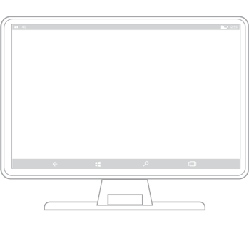
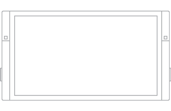
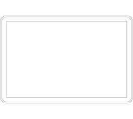

#  Cartilha de dispositivos para aplicativos UWP (Plataforma Universal do Windows)

\[ Atualizado para aplicativos UWP no Windows 10. Para ler artigos do Windows 8.x, consulte o [arquivo morto](http://go.microsoft.com/fwlink/p/?linkid=619132) \]

Conhecer os dispositivos que dão suporte a aplicativos UWP (Plataforma Universal do Windows) o ajudará a oferecer a melhor experiência de usuário para cada fator forma. Ao projetar para um dispositivo específico, as principais considerações incluem como o aplicativo aparecerá no dispositivo, onde, quando e como o aplicativo será usado nesse dispositivo, e como o usuário vai interagir com esse dispositivo.

## Telefones e phablets

O mais usado de todos os dispositivos de computação, o telefone pode fazer muito com o tamanho da tela limitado e entradas básicas. Os telefones estão disponíveis em uma variedade de tamanhos; telefones maiores são chamados de phablets. As experiências de aplicativo nos phablets são semelhantes às dos telefones, mas o espaço maior da tela dos phablets permite algumas mudanças importantes no consumo de conteúdo.

Com o Continuum para Telefones, uma nova experiência para dispositivos móveis compatíveis com o Windows 10, os usuários podem conectar seus telefones a um monitor e até mesmo usar um mouse e um teclado para fazer seus telefones funcionarem como um notebook. (Para saber mais, veja o artigo [Continuum para telefone](http://go.microsoft.com/fwlink/p/?LinkID=699431).)

Tamanhos de tela
-   De 4 a 5 polegadas para telefone
-   De 5,5 a 7 polegadas para phablet

Uso típico
-   Usado principalmente na orientação retrato, principalmente devido à facilidade de segurar o telefone com uma mão e poder interagir totalmente com ele dessa forma, mas há algumas experiências que funcionam bem em paisagem, como exibir fotos e vídeo, ler um livro e escrever texto.
-   Usados principalmente por apenas uma pessoa, o proprietário do dispositivo.
-   Sempre ao alcance, geralmente guardado em um bolso ou bolsa.
-   Usado por breves períodos.
-   Os usuários costumam fazer várias tarefas ao utilizarem o telefone.
-   O texto é inserido em ciclos rápidos.

Considerações sobre a interface do usuário
-   O tamanho pequeno da tela do telefone permite que somente um quadro por vez seja exibido nas orientações retrato e paisagem. Todos os padrões de navegação hierárquica em um telefone usam o modelo "detalhado", com o usuário navegando pelas camadas de interface do usuário de quadro único.

-   Semelhantes aos telefones, os phablets no modo retrato podem exibir apenas um quadro por vez. Mas, com o maior espaço da tela disponível em um phablet, os usuários têm a capacidade de girar para a orientação paisagem e permanecer nela, de modo que dois quadros de aplicativo podem estar visíveis por vez.

-   Nas orientações retrato e paisagem, verifique se há espaço na tela suficiente para a barra de aplicativos quando o teclado virtual está ativado.

Entradas
-   Toque
-   Voz

Recursos típicos do dispositivo
-   Microfone
-   Câmera
-   Sensores de movimento
-   Sensores de localização

 

## Tablets

Computadores tablet ultraportáteis são equipados com telas sensíveis ao toque, câmeras, microfones e acelerômetros. O tamanho da tela do tablet geralmente varia de 7" a 13,3".

Tamanhos de tela
-   7 a 13,3 polegadas

Uso típico
-   Cerca de 80% do uso do tablet é feito pelo proprietário, com outros 20% de uso sendo compartilhados.
-   Ele geralmente é usado em casa como um dispositivo complementar ao assistir TV.
-   Ele é usado por períodos mais longos que os telefones e phablets.
-   O texto é inserido em ciclos rápidos.

Considerações sobre a interface do usuário
-   Nas orientações retrato e paisagem, os tablets permitem dois quadros de cada vez.
-   O recurso Voltar do sistema está localizado na barra de navegação.

Entradas
-   Toque
-   Caneta digitalizadora
-   Teclado externo (ocasionalmente)
-   Mouse (ocasionalmente)
-   Voz (ocasionalmente)

Recursos típicos do dispositivo
-   Câmera
-   Microfone
-   Sensores de movimento
-   Sensores de localização

 

## Computadores e notebooks

Os computadores e notebooks Windows incluem uma ampla gama de dispositivos e tamanhos de tela. Em geral, notebooks e computadores podem exibir mais informações que o telefone ou tablets.

Tamanhos de tela
-   13" e maior

Uso típico
-   Os aplicativos em desktops e notebooks permitem o uso compartilhado, mas de um usuário de cada vez e geralmente por períodos maiores.

Considerações sobre a interface do usuário
-   Os aplicativos podem ter um modo de exibição em janelas. O tamanho delas é determinado pelo usuário. Dependendo do tamanho da janela, pode haver entre um e três quadros. Em monitores maiores, o aplicativo pode ter mais de três quadros.

-   Ao usar um aplicativo em um desktop ou notebook, o usuário tem controle sobre arquivos de aplicativo. Como designer de aplicativos, forneça os mecanismos para gerenciar o conteúdo do seu aplicativo. Considere a inclusão de comandos e recursos, como "Salvar como, "Arquivos recentes" e assim por diante.

-   A volta ao sistema é opcional. Quando um desenvolvedor de aplicativos opta por exibi-la, ela aparece na barra de título do aplicativo.

Entradas
-   Mouse
-   Teclado
-   Touch em laptops e em desktops tudo em um.
-   Consoles, por exemplo, o controlador do Xbox, algumas vezes são usados.

Recursos típicos do dispositivo
-   Câmera
-   Microfone

 

## Dispositivos Surface Hub

O Microsoft Surface Hub é um dispositivo de colaboração em equipe de tela grande projetado para uso simultâneo por vários usuários.

Tamanhos de tela
-   55 e 84 polegadas

Uso típico
-   Os aplicativos no Surface Hub veem o uso compartilhado por períodos curtos, como em reuniões.

-   Dispositivos Surface Hub são principalmente estáticos e raramente movidos.

Considerações sobre a interface do usuário
-   Os aplicativos no Surface Hub podem aparecer em um destes quatro estados: inteiro (modo de exibição padrão em tela inteira), segundo plano (exibição oculta, embora o aplicativo ainda esteja em execução em segundo plano, disponível no alternador de tarefas), preenchido (um modo de exibição fixo que ocupa a área de cenário disponível) e encaixado (um modo de exibição variável que ocupa o lado direito ou esquerdo do cenário).
-   Nos modos encaixado ou preenchido, o sistema exibe a barra lateral do Skype e reduz o aplicativo horizontalmente.
-   A volta ao sistema é opcional. Quando um desenvolvedor de aplicativos optar por exibi-lo, ele aparecerá na barra de título do aplicativo.

Entradas
-   Toque
-   Caneta
-   Voz
-   Teclado (na tela/remoto)
-   Touchpad (remoto)

Recursos típicos do dispositivo
-   Câmera
-   Microfone

 

## Dispositivos Windows IoT

Os dispositivos Windows IoT são uma classe emergente de dispositivos voltada para incorporação de eletrônicos pequenos, sensores e conectividade em objetos físicos. Geralmente, esses dispositivos são conectados por meio de uma rede ou da Internet para registrar dados reais detectados e, em alguns casos, agir com base neles. Os dispositivos podem ter nenhuma tela (também conhecidos como dispositivos "sem periféricos") ou são conectados a uma tela pequena (conhecidos como dispositivos "periféricos") com um tamanho de tela geralmente de 3,5" ou menos.

Tamanhos de tela
-   3,5" ou menor
-   Alguns dispositivos não têm tela

Uso típico
-   Geralmente conectado por meio de uma rede ou da Internet para registrar dados reais detectados e, em alguns casos, agir com base neles.
-   Esses dispositivos podem executar somente um aplicativo de cada vez, diferente de telefones ou outros dispositivos maiores.
-   Não é algo que interage o tempo todo, mas está disponível quando você precisa, fora do caminho quando você não precisa.
-   O aplicativo não tem uma funcionalidade voltar dedicada, que é a responsabilidade de desenvolvedores.

Considerações sobre a interface do usuário
-   Os dispositivos "sem periféricos" não têm nenhuma tela.
-   A exibição em dispositivos "periféricos" é mínima, mostrando apenas o que é necessário devido a funcionalidade e estado real da tela limitados.
-   A orientação é bloqueada na maioria das vezes, de modo que seu aplicativo só precisa considerar uma direção de exibição.

Entradas
-   Variável, dependendo do dispositivo

Recursos típicos do dispositivo
-   Variável, dependendo do dispositivo

 

\[Este artigo contém informações que são específicas a aplicativos UWP e ao Windows 10. Para obter as diretrizes do Windows 8.1, baixe o [PDF de diretrizes do Windows 8.1](https://go.microsoft.com/fwlink/p/?linkid=258743).\]

 

 

<!--HONumber=Mar16_HO4-->

