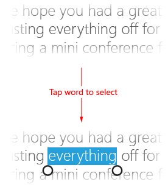

# Selecionando texto e imagens

Este artigo descreve a seleção e a manipulação de texto, imagens e controles e fornece diretrizes da experiência do usuário que devem ser consideradas ao usar esses mecanismos em seus aplicativos.

**APIs importantes**

-   [**Windows.UI.Xaml.Input**](https://msdn.microsoft.com/library/windows/apps/br227994)
-   [**Windows.UI.Input**](https://msdn.microsoft.com/library/windows/apps/br242084)

## O que fazer e o que não fazer

-   Use glifos de fonte ao implementar sua interface do usuário de garra. A garra é uma combinação das duas fontes Segoe da interface do usuário disponíveis em todo o sistema. O uso de recursos de fonte simplifica problemas de renderização em diferentes dpis e funciona bem com os vários níveis de escala da interface do usuário. Ao implementar suas próprias garras, elas devem compartilhar as seguintes características da interface do usuário:

    -   Forma circular
    -   Visível em qualquer tela de fundo
    -   Tamanho uniforme
-   Forneça uma margem ao redor do conteúdo selecionável para acomodar a interface do usuário da garra. Se o aplicativo permitir a seleção de texto em uma região que não ofereça movimento panorâmico/rolagem, deixe uma margem de 1/2 garra nos lados esquerdo e direito da área de texto e uma altura de 1 garra nos lados superior e inferior da área de texto (como mostram as imagens a seguir). Isso garante que toda a interface do usuário da garra seja exposta ao usuário e minimiza interações não pretendidas com outras partes de interface do usuário baseadas em borda.

    

-   Oculte a interface do usuário das garras durante a interação. Elimina a obstrução causada pelas garras durante a interação. Isso é útil quando uma garra não está totalmente oculta pelo dedo ou há várias garras de seleção de texto. Isso elimina artefatos visuais ao exibir janelas filho.

-   Não permita a seleção de elementos da interface do usuário como controles, rótulos, imagens, conteúdo proprietário e assim por diante. Normalmente, os aplicativos do Windows permitem a seleção somente dentro de controles específicos. Controles, como botões, rótulos e logotipos não são selecionáveis. Avalie se a seleção é um problema para o seu aplicativo e, se for, identifique as áreas da interface do usuário onde a seleção deve ser proibida. 

## Diretrizes de uso adicional

A seleção e a manipulação de texto são particularmente suscetíveis aos desafios da experiência do usuário introduzidos pelas interações por toque. A entrada por mouse, caneta/stylus e teclado são altamente granulares: um clique do mouse ou contato da caneta/stylus é mapeado normalmente para um único pixel e uma tecla é ou não é pressionada. A entrada de toque não é granular; é difícil mapear toda a superfície da ponta de um dedo para especificar a localização x-y na tela para colocar o sinal de interpolação de texto de forma precisa.

**Considerações e recomendações**

Use os controles internos expostos por meio das estruturas de idioma no Windows para criar aplicativos que proporcionam a experiência de interação do usuário em plataforma inteira, incluindo comportamentos de seleção e manipulação. Você achará a funcionalidade de interação dos controles incorporados suficiente para a maioria dos aplicativos UWP.

Ao usar controles de texto da UWP padrão, os comportamentos de seleção e os recursos visuais descritos neste tópico não podem ser personalizados.

**Seleção de texto**

Se o aplicativo exigir uma interface do usuário personalizada com suporte à seleção de texto, recomendamos seguir os comportamentos de seleção do Windows descritos aqui.

**Conteúdo editável e não editável**

Com o toque, as interações de seleção são realizadas principalmente pelos gestos, como um toque para definir um cursor de inserção ou selecionar uma palavra e um movimento de deslizar para modificar a seleção. Assim como em outras interações por toque do Windows, as interações com tempo limite são limitadas ao gesto de pressionar e manter pressionado para exibir uma interface do usuário informativa. Para obter mais informações, consulte [Diretrizes de resposta visual](guidelines-for-visualfeedback.md).

O Windows reconhece dois possíveis estados para interações de seleção, editável e não editável, e ajusta a interface de seleção, a resposta e a funcionalidade adequadamente.

**Conteúdo editável**

Tocar na metade esquerda de uma palavra desloca o cursor para a esquerda imediata da palavra, enquanto tocar na metade direita desloca o cursor para a direita imediata da palavra.

A imagem a seguir demonstra como colocar um cursor de inserção inicial com uma garra ao tocar próximo ao início ou ao final de uma palavra.

A imagem a seguir demonstra como ajustar uma seleção ao arrastar a garra.

As imagens a seguir demonstram como invocar o menu de contexto tocando na seleção ou em uma garra (a ação de pressionar e segurar também pode ser usada).

**Observação**  Essas interações podem variar no caso de uma palavra com erro de ortografia. Tocar uma palavra que está marcada com a ortografia errada ressaltará toda a palavra e invocará o menu de contexto com a sugestão ortográfica.

 

**Conteúdo não editável**

A imagem a seguir demonstra como selecionar uma palavra tocando na palavra (espaços não são incluídos na seleção inicial).

Siga os mesmos procedimentos para textos editáveis para ajustar a seleção e exibir o menu de contexto.

**Manipulação de objetos**

Sempre que possível, use os mesmos recursos de garra (ou semelhantes) da seleção de texto ao implementar manipulação personalizada de objetos em um aplicativo UWP. Isso ajuda a proporcionar uma experiência de interação consistente na plataforma.

Por exemplo, as garras também podem ser usadas em aplicativos de processamento de imagens que dão suporte a redimensionamento e corte ou aplicativos de media player que fornecem barras de progresso ajustáveis, conforme mostram as imagens a seguir.

*Media player com garra de progresso ajustável.*

*Editor de imagens com garras de corte.*

## Artigos relacionados

**Para desenvolvedores**
* [Interações personalizadas do usuário](https://msdn.microsoft.com/library/windows/apps/mt185599)

**Exemplos**
* [Amostra de entrada básica](http://go.microsoft.com/fwlink/p/?LinkID=620302)
* [Amostra de entrada de baixa latência](http://go.microsoft.com/fwlink/p/?LinkID=620304)
* [Exemplo do modo de interação do usuário](http://go.microsoft.com/fwlink/p/?LinkID=619894)
* [Amostra de elementos visuais do foco](http://go.microsoft.com/fwlink/p/?LinkID=619895)

**Exemplos de arquivo-morto**
* [Entrada: amostra de eventos de entrada do usuário XAML](http://go.microsoft.com/fwlink/p/?linkid=226855)
* [Entrada: exemplo de funcionalidades do dispositivo](http://go.microsoft.com/fwlink/p/?linkid=231530)
* [Entrada: amostra de teste de toque](http://go.microsoft.com/fwlink/p/?linkid=231590)
* [Amostra de rolagem, movimento panorâmico e aplicação de zoom em XAML](http://go.microsoft.com/fwlink/p/?linkid=251717)
* [Entrada: amostra de tinta simplificada](http://go.microsoft.com/fwlink/p/?linkid=246570)
* [Entrada: amostra de gestos no Windows 8](http://go.microsoft.com/fwlink/p/?LinkId=264995)
* [Entrada: amostra de manipulações e gestos (C++)](http://go.microsoft.com/fwlink/p/?linkid=231605)
* [Amostra de entrada por toque do DirectX](http://go.microsoft.com/fwlink/p/?LinkID=231627)
 

 

<!--HONumber=May16_HO2-->

