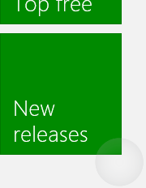
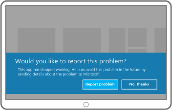

# Diretrizes de feedback visual

Use os comentários visuais para mostrar aos usuários quando suas interações são detectadas, interpretadas e manipuladas. O feedback visual poderá ajudar os usuários incentivando a interação. Ele indica o sucesso da interação, o que oferece ao usuário uma sensação de controle. Além de retransmitir o status do sistema, também reduz os erros.

**APIs importantes**

-   [**Windows.Devices.Input**](https://msdn.microsoft.com/library/windows/apps/br225648)
-   [**Windows.UI.Input**](https://msdn.microsoft.com/library/windows/apps/br242084)
-   [**Windows.UI.Core**](https://msdn.microsoft.com/library/windows/apps/br208383)

## O que fazer e o que não fazer

-   Fornecer feedback visual mesmo quando o contato é muito breve. Isso ajuda o usuário a:
    -   Confirmar se a tela sensível ao toque está funcionando.
    -   Identificar se o destino é habilitado por toque ou responsivo.
    -   Identificar se o usuário errou o destino pretendido.
-   Exibir comentários imediatamente para todos os eventos de interação.
-   Fornecer comentários que consistem em indicações sutis e intuitivas que não distraiam os usuários.
-   Assegurar que os destinos de toque sejam tocados pela ponta dos dedos durante toda as a manipulações.
-   Habilitar a seleção de itens com o gesto de passar o dedo quando o movimento panorâmico está restrito a uma única direção.
-   Não usar visualizações de toque em situações em que possam interferir com o uso do aplicativo. Para obter mais informações, consulte [**ShowGestureFeedback**](https://msdn.microsoft.com/library/windows/apps/br241969).
-   Não exiba comentários a menos que seja absolutamente necessário. Manter a interface do usuário clara e organizada sem mostrar os comentários visuais, a menos que você esteja agregando valor que não esteja disponível em nenhum outro lugar. Nunca exibir as dicas de ferramentas, se elas repetirem o texto que já está visível. As dicas de ferramentas devem ser reservadas para ocasiões específicas, como texto truncado (texto com reticências) que não é exibido quando o item é selecionado ou onde as informações adicionais são necessárias para a compreensão ou use seu próprio aplicativo.
-   Não use o gesto pressionar e segurar, a não ser para a interface do usuário informativa.  
    **Importante**  Gestos de pressionar e segurar podem ser usados para seleção em casos em que o movimento panorâmico horizontal e vertical está habilitado.    
-   Não personalize os comportamentos do feedback visual dos gestos internos do Windows 8, porque isso pode criar uma experiência inconsistente e confusa para o usuário.
-   Não mostre comentários visuais durante o movimento panorâmico ou de arrastar; o movimento real do objeto na tela é suficiente. Entretanto, se a área de conteúdo não permitir movimento panorâmico ou rolagem, use visualizações para indicar as condições de limite. Para obter mais informações, consulte [Diretrizes de movimento panorâmico](guidelines-for-panning.md).
-   Não exibir comentários para um controle que não seja identificado como o destino. O comentário visual é importante quando recorre à entrada por toque em atividades que exijam exatidão e precisão com base no local. A exibição de comentários sempre que você detectar a entrada por toque ajuda o usuário a entender a heurística de direcionamento personalizada definida pelo seu aplicativo e seus controles.
-   Não use o comportamento de comentário destinado a um tipo de entrada com outro tipo. Por exemplo, um retângulo de foco do teclado deve ser usado somente com o teclado, e não com toque.

## Diretrizes de uso adicional

As visualizações por contato são especialmente críticas para as interações por toque que exigem exatidão e precisão. Por exemplo, seu aplicativo deve indicar claramente o local de um toque para permitir que um usuário saiba se errou o seu destino, o quanto errou e quais ajustes deve fazer.

Use os controles da plataforma apresentados pelas estruturas de linguagem dos aplicativos da Windows Store (aplicativos da Windows Store que usam JavaScript e aplicativos da Windows Store que usam C++, C\# ou Visual Basic) para acessar as visualizações do Windows 8 gratuitamente. Se o seu aplicativo permitir interações personalizadas que exijam feedbacks personalizados, você deverá garantir que o feedback seja adequado, que ele se propague em dispositivos de entrada e que não distraia o usuário da tarefa. Isso pode ser um problema específico em aplicativos de jogos ou de desenho, em que o feedback visual pode entrar em conflito ou até mesmo obscurecer uma interface do usuário essencial.

[!IMPORTANT] Não recomendamos mudar o comportamento da interação dos gestos internos. 

### Interface do usuário de comentários

A interface de feedback do usuário geralmente depende do dispositivo de entrada (toque, touchpad, mouse, caneta, teclado, etc.). Por exemplo, o feedback interno de um mouse geralmente envolve movimentar e mudar o cursor, enquanto o toque e a caneta exigem visualizações de contato e entrada de teclado e a navegação usa retângulos de foco e destaque.

Use [**ShowGestureFeedback**](https://msdn.microsoft.com/library/windows/apps/br241969) para configurar o comportamento de feedback para gestos da plataforma.

Se você estiver personalizando a interface do usuário de feedback, lembre-se de fornecer feedback que dê suporte e seja adequado a todos os modos de entrada.

Estes são alguns exemplos de visualizações internas de contato do Windows.

|  |  |  |  | 
| --- | --- | --- | --- |
| Visualização por toque | Visualização por mouse/touchpad | Visualização por caneta | Visualização por teclado |

### Interface do usuário informativa (pop-ups)

Um dos principais formulários de feedback visual é a interface do usuário informativa (ou interface do usuário de desambiguação). A interface do usuário informativa identifica e exibe informações sobre um objeto, descreve a funcionalidade e a forma de acessá-la e fornece orientações, quando necessário.

Aqui estão os diferentes tipos de interface do usuário informativa compatíveis com aplicativos da Windows Store.

-   Dicas de ferramentas
-   Dicas de ferramentas avançadas
-   Menus:
-   Caixas de diálogo de mensagem
-   Submenus

A interface do usuário informativa é especialmente útil para superar a oclusão (obstrução) da ponta do dedo e melhorar as interações por toque com o seu aplicativo. Ela ainda tem um gesto interno dedicado a ele: pressionar e segurar.

Pressionar e segurar é uma interação com tempo limite, que normalmente não é incentivada no Windows 8. Uma interação de tempo limite é aceitável nesse caso, visto que ela é usada como uma ferramenta para aprender e explorar. A duração recomendada depende do tipo de interface do usuário informativa. Veja os limites de tempo recomendados.

| Tipo IU informacional | Tempo | Ativação | Utilização |
| --- | --- | --- | --- |
| Dica de ferramenta de oclusão (para depuração e destinos menores) | 0 ms | Sim | Para rápidos esclarecimentos de ações. Geralmente usado para comandos. |
| Dica de ferramenta de oclusão (para ações) | 200 ms | Sim | |
| Dica de ferramenta avançada | ~2000 ms | Não | Para aprendizagem e para explorações lentas e mais decisivas. Geralmente usado com itens de coleção. |
| Interação por revelação | ~2000 ms | Não | |
| Menu de contexto | ~2000 ms | Não | Expõe um conjunto limitado de comandos relacionados ao objeto selecionado. |
| Submenus | ~2000 ms | Não | Expõe um conjunto limitado de comandos relacionados ao objeto selecionado. |

Para obter mais informações sobre como fornecer a interface do usuário informativa, consulte [Criando o layout da interface do usuário](https://msdn.microsoft.com/library/windows/apps/hh465304) e [Exibindo pop-ups](https://msdn.microsoft.com/library/windows/apps/hh738362).

### Dicas de ferramentas

Use as dicas de ferramentas para revelar mais informações sobre um controle antes de pedir ao usuário para executar uma ação.

As dicas de ferramentas ([**Dica de ferramenta**](https://msdn.microsoft.com/library/windows/apps/br229763)) aparecem automaticamente quando o usuário executa um gesto de pressionar e segurar (ou quando um evento de focalização é detectado) em um controle ou objeto. A dica de ferramenta desaparece quando o contato ou o cursor sai do controle ou objeto. Uma dica de ferramenta pode incluir texto e imagens, mas não é interativa.

### Dicas de ferramenta de oclusão para destinos menores

As dicas de ferramentas de oclusão descrevem o destino ocluso. Elas são mais úteis para o direcionamento e ativação de itens menores do que o tamanho padrão do destino por toque, como por exemplo, hiperlinks em uma página da Web.

Você pode substituir essas dicas de ferramentas por um pop-up informativo após um determinado limite de tempo. Por exemplo, use uma dica de ferramenta de oclusão para mostrar o texto obstruído do hiperlink e substitua a dica da ferramenta por um pop-up contendo a URL.

### Dicas de ferramenta para ações e comandos

Essas dicas de ferramentas descrevem a ação ou o comando que ocorre quando um usuário levanta o dedo de um elemento. Elas são úteis ao direcionar e ativar um botão ou controle semelhante.

Uma dica de ferramenta de destino menor pode ser seguida por uma dica de ferramenta de ação após um determinado limite de tempo. Nesse caso, a dica de ferramenta de destino menor deve ser expandida para incluir a informação adicional na dica de ferramenta de ação.

### Dica de ferramenta avançada

Essas dicas de ferramentas revelam informações secundárias sobre um elemento. Por exemplo, uma dica de ferramenta avançada pode ser uma descrição textual de uma imagem, o texto completo de um título truncado ou outra informação relevante ao destino.

As dicas de ferramentas avançadas normalmente contêm informações que não precisam estar disponíveis imediatamente e, em alguns casos, podem causar distração se apresentadas muito rapidamente. Um limite de tempo maior contribui para melhorar a decisão dos usuários sobre a obtenção de informações.

Após a exibição de uma dica de ferramenta avançada, o objeto não é mais ativado quando o usuário levanta o dedo. Isso ocorre porque a informação obtida gradualmente da dica de ferramenta pode influenciar o usuário a não ativar o item.

Recomendamos que o design visual e as informações na dica de ferramenta avançada sejam distintos e mais substanciais do que a dica de ferramenta padrão.

### Menu de contexto

O menu de contexto ([**PopupMenu**](https://msdn.microsoft.com/library/windows/apps/br208693)) é um menu leve que permite aos usuários acesso imediato às ações (como, comandos da área de transferência) em texto ou objetos da interface do usuário em aplicativos da Windows Store.

O menu de contexto otimizado para toque consiste em duas partes. Uma indicação visual, a sugestão, é exibida como resultado de uma interação do ato segurar. Em seguida, o menu de contexto é exibido após a sugestão desaparecer e o usuário levantar o dedo.

As imagens a seguir demonstram como invocar o menu de contexto padrão para o texto tocando em uma seleção ou em uma garra (a ação de pressionar e segurar também pode ser usada).

Consulte [Adicionando menus de contexto](https://msdn.microsoft.com/library/windows/apps/hh465300).

### Caixa de diálogo de mensagem

Use caixas de diálogo de mensagem ([**MessageDialog**](https://msdn.microsoft.com/library/windows/apps/br208674)) para solicitar uma resposta dos usuários, com base na ação do usuário ou no estado do aplicativo, antes de continuar. A interação explícita do usuário é exigida, e a entrada no aplicativo ficará bloqueada até que o usuário responda.

Aqui estão alguns dos motivos típicos da exibição de uma caixa de diálogo de mensagem.

-   Apresentar informação urgente
-   Fazer uma pergunta antes de dar continuidade à execução
-   Exibir mensagens de erro

Consulte [Adicionando caixas de diálogo de mensagem](https://msdn.microsoft.com/library/windows/apps/hh738361).

### Submenu

Um submenu ([**Submenu**](https://msdn.microsoft.com/library/windows/apps/br211726)) é um painel leve da interface do usuário, que é exibido via ativação por toque, clique ou outra interação, e que é usado para apresentar ao usuário informações, perguntas ou um menu de opções relacionado à atividade atual. Ele pode ser dispensado (desaparece quando o usuário toca ou clica fora do painel de submenu ou pressiona ESC). Ou seja, um submenu pode ser ignorado.

Diferentemente das dicas de ferramentas, os submenus podem aceitar entradas. Diferentemente das caixas de diálogo de mensagem, o aplicativo ainda está ativo e aceitando entradas.

Consulte [Adicionando submenus e menus](https://msdn.microsoft.com/library/windows/apps/hh465325)

## Artigos relacionados

**Para designers**
* [Diretrizes de movimento panorâmico](guidelines-for-panning.md)

**Para desenvolvedores**
* [Interações personalizadas do usuário](https://msdn.microsoft.com/library/windows/apps/mt185599)

**Exemplos**
* [Amostra de entrada básica](http://go.microsoft.com/fwlink/p/?LinkID=620302)
* [Amostra de entrada de baixa latência](http://go.microsoft.com/fwlink/p/?LinkID=620304)
* [Exemplo do modo de interação do usuário](http://go.microsoft.com/fwlink/p/?LinkID=619894)
* [Amostra de elementos visuais do foco](http://go.microsoft.com/fwlink/p/?LinkID=619895)

**Exemplos de arquivo-morto**
* [Entrada: amostra de eventos de entrada do usuário XAML](http://go.microsoft.com/fwlink/p/?linkid=226855)
* [Entrada: exemplo de funcionalidades do dispositivo](http://go.microsoft.com/fwlink/p/?linkid=231530)
* [Entrada: amostra de teste de toque](http://go.microsoft.com/fwlink/p/?linkid=231590)
* [Amostra de rolagem, movimento panorâmico e aplicação de zoom em XAML](http://go.microsoft.com/fwlink/p/?linkid=251717)
* [Entrada: amostra de tinta simplificada](http://go.microsoft.com/fwlink/p/?linkid=246570)
* [Entrada: amostra de gestos no Windows 8](http://go.microsoft.com/fwlink/p/?LinkId=264995)
* [Entrada: amostra de manipulações e gestos (C++)](http://go.microsoft.com/fwlink/p/?linkid=231605)
* [Amostra de entrada por toque do DirectX](http://go.microsoft.com/fwlink/p/?LinkID=231627)
 

 

<!--HONumber=Jun16_HO3-->

