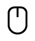
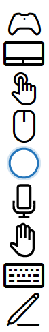

# Cartilha de interação

As interações do usuário na Plataforma Universal do Windows (UWP) são uma combinação de fontes de entrada e saída (como mouse, teclado, caneta, toque, touchpad, controle por voz, **Cortana**, controlador, gesto, olhar, etc.), juntamente com vários modos, ou modificadores que permitem experiências estendidas (incluindo os botões e a roda do mouse, a borracha e os botões da caneta, o teclado virtual e os serviços de aplicativo em segundo plano). 

A UWP usa um sistema de interação contextual "inteligente" que, na maioria dos casos, elimina a necessidade de manipular individualmente os tipos de entrada exclusivos recebidos pelo seu aplicativo. Isso inclui manipular a entrada por touch, touchpad, mouse e caneta como um tipo de ponteiro genérico para dar suporte a gestos estáticos, como tocar ou pressionar e segurar, para gestos de manipulação como deslizar para movimento panorâmico ou para renderizar tinta digital.

Familiarize-se com cada tipo de dispositivo de entrada e seus comportamentos, recursos e limitações quando combinados com determinados fatores forma. Isso pode ajudar você a decidir se os controles e as funcionalidades da plataforma são suficientes para seu aplicativo, ou exigem que você forneça experiências de interação personalizadas.

## Cortana

No Windows 10, a extensibilidade da **Cortana** permite lidar com comandos de voz de um usuário e iniciar um aplicativo para executar uma única ação.

Suporte a dispositivos
-   Telefones e phablets
-   Tablet
-   Computadores e notebooks
-   Surface Hub
-   IoT
-   Xbox
-   HoloLens

Uso típico Comando de voz é uma fala única, definida em um arquivo VCD (Definição de Comando de Voz), direcionada a um aplicativo instalado por meio da **Cortana**. O aplicativo pode ser iniciado em primeiro ou segundo plano, dependendo do nível e da complexidade da interação. Por exemplo, comandos de voz que exigem contexto adicional ou a entrada do usuário são mais bem manipulados em primeiro plano, enquanto os comandos básicos podem ser manipulados em segundo plano.

A integração da funcionalidade básica do seu aplicativo e o fornecimento de um ponto de entrada central para o usuário realizar a maioria das tarefas sem abrir o aplicativo diretamente permitem que a **Cortana** se torne uma ligação entre seu aplicativo e o usuário. Em muitos casos, isso pode economizar muito tempo e esforço do usuário. Para saber mais, consulte [Diretrizes de design da Cortana](https://msdn.microsoft.com/library/windows/apps/dn974233).

Mais informações [Diretrizes de design da Cortana](https://msdn.microsoft.com/library/windows/apps/dn974233).
 

## Controle por voz

O controle por voz é uma forma eficiente e natural para as pessoas interagirem com aplicativos. É uma maneira fácil e precisa de se comunicar com aplicativos, e permite que as pessoas sejam produtivas e se mantenham informadas em diversas situações.

O controle por voz pode complementar ou, em muitos casos, ser o tipo de entrada principal, dependendo do dispositivo do usuário. Por exemplo, dispositivos como HoloLens e Xbox não dão suporte a tipos de entrada tradicionais (além de um teclado de software em situações específicas). Em vez disso, eles dependem da entrada e saída de voz (geralmente em combinação com outros tipos de entrada não tradicionais, como olhar e gesto) para a maioria das interações do usuário.

A conversão de texto em fala (também conhecida como TTS ou sintetização de voz) é usada para informar ou direcionar o usuário.

Suporte a dispositivos
-   Telefones e phablets
-   Tablet
-   Computadores e notebooks
-   Surface Hub
-   IoT
-   Xbox
-   HoloLens

Uso típico

Há três modos de interação de fala:

Linguagem natural  
A linguagem natural é como interagimos verbalmente com as pessoas em geral. Nossa fala varia de acordo com a pessoa e a situação, e é geralmente entendida. Quando não é, geralmente usamos palavras e uma ordem de palavras diferentes para comunicar a mesma ideia.

As interações em linguagem natural com um aplicativo são semelhantes: falamos com o aplicativo através de nosso dispositivo como se ele fosse uma pessoa e esperamos que ele entenda e reaja adequadamente.

A linguagem natural é o modo mais avançado de interação de fala, e pode ser implementada e exposta pela **Cortana**.

Comando e controle  
Comando e controle é o uso de comandos verbais para ativar controles e funcionalidades, como clicar em um botão ou selecionar um item de menu.

Como o comando e controle é essencial para uma experiência de usuário bem-sucedida, um único tipo de entrada geralmente não é recomendado. O controle por voz geralmente é uma das várias opções de entrada para um usuário com base em suas preferências ou recursos de hardware.

Ditado  
O método de entrada de fala mais básico. Cada expressão é convertida em texto.

O ditado normalmente é usado quando um aplicativo não precisa compreender o significado ou a intenção.

Mais informações [Diretrizes de design do Controle por voz](https://msdn.microsoft.com/library/windows/apps/dn596121)
 

## Caneta

Uma caneta pode servir como um dispositivo apontador com precisão de pixel, como um mouse, e é o dispositivo ideal para entrada de tinta digital.

**Observação**  Existem dois tipos de dispositivos de caneta: ativo e passivo.
-   As canetas passivas não são eletrônicas, e emulam efetivamente a entrada touch de um dedo. Elas exigem uma exibição básica do dispositivo, que reconhece a entrada com base na pressão do contato. Como os usuários geralmente repousam a mão enquanto escrevem na superfície de entrada, os dados de entrada podem ficar poluídos devido a rejeição da palma da mão bem-sucedida.
-   As canetas ativas são eletrônicas e podem funcionar com telas de dispositivos complexas para fornecer dados de entrada muito mais extensos (incluindo passagem do mouse ou dados de proximidade) ao sistema e seu aplicativo. A rejeição da palma da mão é muito mais robusta.

 

Quando nos referimos a dispositivos de caneta aqui, estamos fazendo referência a canetas ativas que fornecem dados de entrada avançados e são usados principalmente para interações precisas de tinta e apontamento.

Suporte a dispositivos
-   Telefones e phablets
-   Tablet
-   Computadores e notebooks
-   Surface Hub
-   IoT

Uso típico A plataforma de tinta do Windows, juntamente com uma caneta, oferece uma maneira natural de criar anotações manuscritas, desenhos e anotações. A plataforma dá suporte a captura de dados de tinta por entrada da digitalizador, geração de dados de tinta, renderização desses dados como traços de tinta no dispositivo de saída, gerenciamento dos dados de tinta e reconhecimento de manuscrito. Além de capturar os movimentos espaciais da caneta enquanto o usuário escreve ou desenha, seu aplicativo também pode coletar informações como pressão, forma, cor e opacidade, para oferecer experiências ao usuário que se aproximam bastante do ato de desenhar em papel com caneta esferográfica, lápis ou pincel.

A caneta e o touch apresentam divergências quando o assunto é a capacidade do touch de emular a manipulação direta de elementos da interface do usuário na tela usando gestos físicos executados nesses objetos (por exemplo, passar o dedo, deslizar o dedo, arrastar, girar etc.).

Você deve fornecer comandos de interface do usuário específicos à caneta, ou funcionalidades, para dar suporte a essas interações. Por exemplo, use os botões anterior e próximo (ou + e -) para permitir que os usuários percorram as páginas de conteúdo ou girem, redimensionem e ampliem objetos.

Mais informações [Diretrizes de design de caneta](https://msdn.microsoft.com/library/windows/apps/dn456352)
 

## Touch

Com o touch, os gestos físicos de um ou mais dedos podem ser usados para emular a manipulação direta de elementos da interface do usuário (por exemplo, movimento panorâmico, girar, redimensionar ou mover), como um método alternativo de entrada (semelhante ao mouse ou à caneta), ou como um método de entrada complementar (para modificar aspectos da outra entrada, como borrar um traço de tinta desenhado com uma caneta). Experiências táteis como essa podem proporcionar sensações mais naturais do mundo real aos usuários conforme eles interagem com elementos em uma tela.

Suporte a dispositivos
-   Telefones e phablets
-   Tablet
-   Computadores e notebooks
-   Surface Hub
-   IoT

Uso típico O suporte para entrada por toque pode variar significativamente, dependendo do dispositivo.

Alguns dispositivos não dão suporte de nenhum tipo ao touch, alguns dispositivos dão suporte a um único contato touch, enquanto outros dão suporte a multi-touch (dois ou mais contatos).

A maioria dos dispositivos que dão suporte à entrada multi-touch normalmente reconhecem dez contatos simultâneos exclusivos.

Os dispositivos Surface Hub reconhecem 100 contatos touch simultâneos exclusivos.

Em geral, o touch é:

-   Usuário único, a menos que esteja sendo usado com um dispositivo de equipe da Microsoft, como o Surface Hub, onde a colaboração é enfatizada.
-   Não restrito à orientação do dispositivo.
-   Usado para todas as interações, incluindo entrada de texto (teclado virtual) e tinta (configurado pelo aplicativo).

Mais informações [Diretrizes de design de toque](https://msdn.microsoft.com/library/windows/apps/hh465370)
 

## Touchpad

Um touchpad combina a entrada multi-touch indireta com a entrada de precisão de um dispositivo apontador, como um mouse. Essa combinação torna o touchpad adequado para uma interface do usuário otimizada para touch e destinos menores de aplicativos de produtividade.

Suporte a dispositivos
-   Computadores e notebooks
-   IoT

Uso típico Os touchpads normalmente dão suporte a um conjunto de gestos de toque que oferecem suporte semelhante ao toque para manipulação direta de objetos e da interface do usuário.

Devido a essa convergência de experiências de interação compatíveis com touchpads, recomendamos também que você forneça comandos ou funcionalidades de interface do usuário estilo mouse em vez de depender somente do suporte interno para entrada por toque. Forneça comandos de interface do usuário, ou funcionalidades, específicos ao touchpad para dar suporte a essas interações.

Você deve fornecer comandos de interface do usuário, ou funcionalidades, específicos ao mouse para dar suporte a essas interações. Por exemplo, use os botões anterior e próximo (ou + e -) para permitir que os usuários percorram as páginas de conteúdo ou girem, redimensionem e ampliem objetos.

Mais informações [Diretrizes de design de touchpad](https://msdn.microsoft.com/library/windows/apps/dn456353)
 

## Teclado

Um teclado é o dispositivo principal de inserção de texto, e geralmente é indispensável para pessoas portadoras de determinadas deficiências ou usuários que o consideram um método mais rápido e mais eficiente de interagir com um aplicativo.

Com o [Continuum para telefone](http://go.microsoft.com/fwlink/p/?LinkID=699431), uma nova experiência para dispositivos móveis compatíveis com o Windows 10, os usuários podem conectar seus telefones a um mouse e um teclado para fazê-los funcionar como um notebook.

Suporte a dispositivos
-   Telefones e phablets
-   Tablet
-   Computadores e notebooks
-   Surface Hub
-   IoT
-   Xbox
-   HoloLens

Uso típico Os usuários podem interagir com aplicativos Universais do Windows por meio de um teclado de hardware e dois teclados de software: o OSK (teclado virtual) e o teclado virtual.

O OSK é um teclado de software visual que você pode usar em vez do teclado físico para digitar e inserir dados usando toque, mouse, caneta ou outro dispositivo apontador (uma tela sensível ao toque não é necessária). O OSK é fornecido para sistemas que não têm um teclado físico ou para usuários cujos problemas de mobilidade impedem o uso de dispositivos de entrada físicos tradicionais. O OSK emula a maior parte, se não toda a funcionalidade de um teclado de hardware.

O teclado virtual é um teclado de software visual usado para entrada de texto por toque. O teclado virtual não é uma substituição ao OSK, pois é usado apenas para entrada de texto (ele não emula o teclado de hardware) e só aparece quando um campo de texto ou outro controle de texto editável é focalizado. O teclado virtual não oferece suporte a comandos de aplicativo ou do sistema.

**Observação**  O OSK tem prioridade sobre o teclado virtual, que não será mostrado se o OSK estiver presente.

 

Em geral, um teclado é:

-   Usuário único.
-   Não restrito à orientação do dispositivo.
-   Usado para entrada de texto, navegação, jogabilidade e acessibilidade.
-   Sempre disponível, de forma proativa ou reativa.

Mais informações [Diretrizes de design de teclado](https://msdn.microsoft.com/library/windows/apps/hh972345)
 

## Mouse

Um mouse é mais adequado para aplicativos de produtividade e interfaces do usuário de alta densidade, em que as interações dos usuários exigem precisão de pixel para direcionamentos e comandos.

Suporte a dispositivos
-   Telefones e phablets
-   Tablet
-   Computadores e notebooks
-   Surface Hub
-   IoT

Uso típico A entrada do mouse pode ser modificada com a adição de várias teclas de teclado (Ctrl, Shift, Alt, etc.). Essas teclas podem ser combinadas com o botão esquerdo do mouse, o botão direito do mouse, o botão de rolagem e os botões X para um conjunto de comandos expandido otimizado para o mouse. (Alguns dispositivos de mouse da Microsoft tem dois botões adicionais, conhecidos como botões X. Geralmente são usados para navegar para a frente e para trás em navegadores da Web).

Assim como a caneta, o mouse e o touch apresentam divergências quando o assunto é a capacidade do touch de emular a manipulação direta de elementos da interface do usuário na tela usando gestos físicos executados nesses objetos (por exemplo, passar o dedo, deslizar o dedo, arrastar, girar etc.).

Você deve fornecer comandos de interface do usuário, ou funcionalidades, específicos ao mouse para dar suporte a essas interações. Por exemplo, use os botões anterior e próximo (ou + e -) para permitir que os usuários percorram as páginas de conteúdo ou girem, redimensionem e ampliem objetos.

Mais informações [Diretrizes de design do mouse](https://msdn.microsoft.com/library/windows/apps/dn456351)
 

## Gesto

Um gesto é qualquer forma de movimento do usuário que é reconhecida como entrada para controlar ou interagir com um aplicativo. Os gestos assumem várias formas, de simplesmente usar uma mão para indicar algo na tela a padrões específicos aprendidos de movimento e longas extensões de movimento contínuo em todo o corpo. Tome cuidado ao projetar gestos personalizados porque seu significado pode variar dependendo da cultura e da localidade.

Suporte a dispositivos
-   Computadores e notebooks
-   IoT
-   Xbox
-   HoloLens

Uso típico Os touchpads normalmente dão suporte a um conjunto de gestos de toque que oferecem suporte semelhante ao toque para manipulação direta de objetos e da interface do usuário.

Devido a essa convergência de experiências de interação compatíveis com touchpads, recomendamos também que você forneça comandos ou funcionalidades de interface do usuário estilo mouse em vez de depender somente do suporte interno para entrada por toque. Forneça comandos de interface do usuário, ou funcionalidades, específicos ao touchpad para dar suporte a essas interações.

Você deve fornecer comandos de interface do usuário, ou funcionalidades, específicos ao mouse para dar suporte a essas interações. Por exemplo, use os botões anterior e próximo (ou + e -) para permitir que os usuários percorram as páginas de conteúdo ou girem, redimensionem e ampliem objetos.

 

## Gamepad/controlador

O gamepad/controlador é um dispositivo altamente especializado geralmente exclusivo para jogar. No entanto, ele também é usado para emular a entrada do teclado básico e fornece uma experiência de navegação da interface do usuário muito parecida com o teclado.

Suporte a dispositivos
-   Computadores e notebooks
-   IoT
-   Xbox

Uso típico Os touchpads normalmente dão suporte a um conjunto de gestos de toque que oferecem suporte semelhante ao toque para manipulação direta de objetos e da interface do usuário.

Devido a essa convergência de experiências de interação compatíveis com touchpads, recomendamos também que você forneça comandos ou funcionalidades de interface do usuário estilo mouse em vez de depender somente do suporte interno para entrada por toque. Forneça comandos de interface do usuário, ou funcionalidades, específicos ao touchpad para dar suporte a essas interações.

Você deve fornecer comandos de interface do usuário, ou funcionalidades, específicos ao mouse para dar suporte a essas interações. Por exemplo, use os botões anterior e próximo (ou + e -) para permitir que os usuários percorram as páginas de conteúdo ou girem, redimensionem e ampliem objetos.

 

## Várias entradas

Acomodar o máximo possível de usuários e dispositivos e projetar seus aplicativos para funcionar com o máximo possível de tipos de entrada (gesto, controle por voz, touch, touchpad, mouse e teclado) maximiza a flexibilidade, a usabilidade e a acessibilidade.

Suporte a dispositivos
-   Telefones e phablets
-   Tablet
-   Computadores e notebooks
-   Surface Hub
-   IoT
-   Xbox
-   HoloLens

Uso típico Assim como as pessoas usam uma combinação de voz e gestos ao se comunicar uns com os outros, vários tipos e modos de entrada também podem ser úteis ao interagir com um aplicativo. No entanto, essas interações combinadas precisam ser o mais naturais e intuitivas possível porque também podem criar uma experiência confusa.

 

 

<!--HONumber=Jun16_HO3-->

