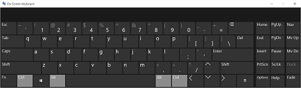

# <a name="keyboard-interactions"></a>Interações por teclado
<link rel="stylesheet" href="https://az835927.vo.msecnd.net/sites/uwp/Resources/css/custom.css">

A entrada por teclado é uma parte importante da experiência geral da interação do usuário com apps. O teclado é indispensável para pessoas portadoras de determinadas deficiências ou usuários que simplesmente o consideram um método mais eficiente de interagir com um app. Por exemplo, os usuários devem ser capazes de navegar pelo seu app usando as teclas Tab e de direção, de ativar elementos da interface do usuário ao usar as teclas Barra de Espaços e Enter, e acessar comandos ao usar atalhos de teclado.  


<div class="important-apis" >
<b>APIs importantes</b><br/>
<ul>
<li>[**KeyDown**](https://msdn.microsoft.com/library/windows/apps/br208941)</li>
<li>[**KeyUp**](https://msdn.microsoft.com/library/windows/apps/br208942)</li>
<li>[**KeyRoutedEventArgs**](https://msdn.microsoft.com/library/windows/apps/hh943072)</li>
</ul>
</div>
 


Uma interface de usuário do teclado bem projetada é um aspecto importante da acessibilidade do software. Ela permite que os usuários com deficiência visual ou que possuam determinadas deficiências motoras naveguem em um app e interajam com seus recursos. Esses usuários talvez não consigam usar um mouse e, em vez disso, usem diversas tecnologias assistenciais, como ferramentas avançadas de teclado, teclados virtuais, ampliadores de tela, leitores de tela e utilitários de entrada de voz.

Os usuários podem interagir com apps universais por meio de teclado de hardware e dois teclados de software: o teclado virtual (OSK) e o teclado touch.

Teclado virtual  
O teclado virtual é um teclado de software visual, que você pode usar no lugar do teclado físico para digitar e inserir dados usando touch, mouse, caneta ou outro dispositivo apontador (uma tela touch não é necessária). O teclado virtual é fornecido para sistemas que não têm um teclado físico ou para usuários cujos problemas de mobilidade impedem o uso de dispositivos de entrada físicos tradicionais. O teclado virtual emula a maior parte, se não toda a funcionalidades de um teclado de hardware.

O teclado virtual pode ser ativado na página Teclado em Configurações &gt; Facilidade de acesso.

**Observação**  O teclado virtual tem prioridade sobre o teclado virtual, que não será mostrado se o Teclado Virtual estiver presente.

 



<sup>Teclado virtual</sup>

Teclado virtual  
O teclado virtual é um teclado de software visual usado para entrada de texto por touch. Ele não é substitui o teclado virtual, pois é usado somente para entrada de texto (ele não emula o teclado de hardware).

Dependendo do dispositivo, o teclado virtual aparece quando um campo de texto ou outro controle de texto editável é focalizado ou quando o usuário o ativa manualmente por meio do **Centro de Notificações**:


**Observação**  O usuário talvez precise ir para a tela **Modo Tablet** em Configurações &gt; Sistema e ativar "O Windows fica mais fácil de usar com toque quando você usa o dispositivo como tablet" para habilitar a exibição automática do teclado virtual.

 

Se o seu app define o foco por meio de programação para um controle de entrada de texto, o teclado virtual não é invocado. Isso elimina comportamentos inesperados não instigados diretamente pelo usuário. No entanto, o teclado é ocultado automaticamente quando o foco é movido por meio de programação para um controle de entrada que não é de texto.

Normalmente, o teclado virtual permanece visível enquanto o usuário navega entre controles em um formulário. Esse comportamento pode variar com base nos outros tipos de controle no formulário.

A seguir há uma lista de controles que não são de edição que podem receber o foco durante uma sessão de entrada de texto por meio do teclado virtual sem descartar o teclado. Ao invés de mover desnecessariamente a interface do usuário e possivelmente desorientar o usuário, o teclado virtual permanece à vista, pois pode ser que o usuário alterne entre esses controles e a entrada de texto com o teclado virtual.

-   Caixa de seleção
-   Caixa de combinação
-   Botão de opção
-   Barra de rolagem
-   Árvore
-   Item de árvore
-   Menu
-   Barra de menu
-   Item de menu
-   Barra de ferramentas
-   Lista
-   Item de lista

Veja aqui exemplos de modos diferentes do teclado virtual. A primeira imagem ilustra o layout padrão; a segunda, o layout em miniatura (que pode não estar disponível em todos os idiomas).

Consulte aqui exemplos de modos diferentes do teclado virtual. A primeira imagem ilustra o layout padrão; a segunda, o layout em miniatura (que pode não estar disponível em todos os idiomas).
<table>
<tr>
    <td>**O teclado virtual no modo de layout padrão:  **</td>
    <td></td>
</tr>
<tr>
    <td>**O teclado virtual no modo de layout expandido:  **</td>
    <td></td>
</tr>
<tr>
    <td>**O teclado virtual no modo de layout em miniatura padrão:  **</td>
    <td></td>
</tr>
<tr>
    <td>**O teclado virtual no modo de layout em miniatura numérico:  **</td>
    <td></td>
</tr>
</table>


Interações de teclado bem-sucedidas permitem que os usuários utilizem cenários básicos de apps apenas com o teclado, ou seja, os usuários podem acessar todos os elementos interativos da interface do usuário e ativar a funcionalidade padrão. Diversos fatores podem afetar o grau de sucesso, incluindo a navegação por teclado, as teclas de acesso para acessibilidade e as teclas de aceleração (atalho) para usuários avançados.

**Observações**  O teclado virtual não dá suporte à alternância e a maioria dos comandos do sistema (consulte [Padrões](#keyboard_command_patterns)).

## <a name="navigation"></a>Navegação


Para usar um controle (incluindo os elementos de navegação) com o teclado, o controle precisa ter foco. Uma maneira de um controle receber o foco do teclado é torná-lo acessível via navegação por tabulação. Um modelo de navegação de teclado bem projetado oferece uma ordem de tabulação previsível e lógica que permite que um usuário explore e use seu app de forma rápida e eficiente.

Todos os controles interativos devem ter paradas de tabulação (a menos que estejam em um grupo), enquanto os controles não interativos, como rótulos, não devem.

Um conjunto de controles relacionados pode ser incluído em um grupo de controles e ter atribuída uma única parada de tabulação. Grupos de controle são usados para conjuntos de controles que se comportam como um único controle, como botões de opção. Eles também podem ser usados quando há muitos controles para navegar de forma eficiente somente com a tecla Tab. As teclas de seta, Home, End, Page Up e Page Down movem o foco de entrada entre os controles dentro de um grupo (não é possível navegar para fora de um grupo de controles usando essas teclas).

Você deve definir o foco de teclado inicial no elemento com o qual os usuários intuitivamente (ou mais provavelmente) vão interagir primeiro quando seu app for iniciado. Frequentemente, esse é o modo de exibição de conteúdo principal do app para que um usuário possa iniciar usando as teclas de seta para rolar o conteúdo do app.

Não defina o foco inicial do teclado em um elemento com resultados potencialmente negativos ou até mesmo desastrosos. Isso pode impedir a perda de dados ou o acesso ao sistema.

Experimente classificar e apresentar os comandos, os controles e os conteúdos mais importantes primeiro na ordem de tabulação e na ordem de exibição (ou hierarquia visual). Entretanto, a posição de exibição real pode depender do contêiner de layout pai e de certas propriedades dos elementos filho que influenciam o layout. Em particular, layouts que usam uma metáfora de grade ou uma metáfora de tabela podem ter uma ordem de leitura bem diferente da ordem de tabulação. Isso não é sempre um problema, mas você deve testar a funcionalidade do app, como uma interface do usuário com touch e uma interface do usuário acessível por teclado.

A ordem de tabulação deve seguir a ordem de leitura, sempre que possível. Isso pode reduzir a confusão e depende da localidade e do idioma.

Associe botões de teclado à interface do usuário adequada (botões Voltar e Avançar) no seu app.

Tente tornar a navegação de volta para a tela inicial de seu app e entre o conteúdo principal tão fácil e simples quanto possível.

Use as teclas de seta como atalhos de teclado para permitir uma navegação interna adequada entre elementos filho de elementos compostos. Se os nós de exibição de árvore tiverem elementos filho separados para lidar com expansão e recolhimento e ativação de nós, use as teclas de seta para esquerda e direita para obter a funcionalidade de expansão e recolhimento. Isso é consistente com os controles da plataforma.

Devido ao fato de o teclado virtual obstruir uma grande parte da tela, a UWP (Plataforma Universal do Windows) garante que o campo de entrada com foco role para a exibição à medida que um usuário navegar pelos controles no formulário, incluindo os controles que não estiverem em exibição no momento. Controles personalizados devem emular esse comportamento.


Em alguns casos, há elementos da interface do usuário que devem ficar na tela o tempo todo. Projete a interface do usuário de forma que os controles do formulário fiquem em uma região de movimento panorâmico e os elementos importantes da interface fiquem estáticos. Por exemplo:


## <a name="activation"></a>Ativação


Um controle poderá ser ativado de diversas formas diferentes, se ele tiver foco no momento ou não.

Barra de espaços, Enter e Esc  
A barra de espaços deve ativar o controle com foco de entrada. A tecla Enter deve ativar o controle com foco de entrada ou um controle padrão. Um controle padrão é o controle com foco inicial ou que responde exclusivamente à tecla Enter (geralmente ele é alterado com foco de entrada). Além disso, a tecla Esc deve fechar ou sair da interface do usuário transitória, como menus e caixas de diálogo.

O app Calculadora mostrado aqui usa a barra de espaços para ativar o botão com foco, bloqueia a tecla Enter para o botão "=" e bloqueia a tecla Esc para o botão "C".


Modificadores de teclado  
Os modificadores de teclado se enquadram nas seguintes categorias:


| Categoria | Descrição |
|----------|-------------|
| Tecla de atalho | Execute uma ação comum sem interface do usuário, como"Ctrl-S" para **Salvar**. Implemente os atalhos de teclado para a funcionalidade principal do app. Nem todo comando tem ou exige um atalho. |   
| Tecla de acesso | Atribuída a cada controle visível, de nível superior, como "Alt-F" para o menu **Arquivo**. Uma tecla de acesso não invoca ou ativa um comando. |
| Tecla aceleradora | Execute comandos definidos pelo app ou sistema padrão, como "Alt-PrtScrn" para captura de tela, "Alt-Tab" para alternar entre apps ou "F1" para obter ajuda. Um comando associado a uma tecla aceleradora não precisa ser um item de menu. |
| Tecla do app/Tecla do menu | Mostre o menu de contexto. |
| Tecla de janela/Tecla de comando | Ative comandos do sistema, como **Menu do sistema**, **Tela de bloqueio** ou **Mostrar área de trabalho**. |

As teclas de acesso e as teclas aceleradoras dão suporte à interação com controles diretamente em vez do uso da tecla Tab.
> Embora alguns controles tenham rótulos intrínsecos, como botões de comando, caixas de seleção e botões de opção, outros controles têm rótulos externos, como modos de exibição de lista. Para controles com rótulos externos, a tecla de acesso é atribuída ao rótulo, que, quando invocado, define o foco para um elemento ou valor dentro do controle associado.


O exemplo aqui mostra as teclas de acesso da guia **Layout da Página** no **Word**.


Aqui, o valor do campo de texto Recuo à esquerda está realçado após a inserção da tecla de acesso identificada no rótulo associado.


## <a name="usability-and-accessibility"></a>Usabilidade e acessibilidade


Uma experiência de interação do teclado bem projetada é um aspecto importante da acessibilidade do software. Ela permite que os usuários com deficiência visual ou que possuam determinadas deficiências motoras naveguem em um app e interajam com seus recursos. Esses usuários talvez não consigam usar um mouse e devem, em vez disso, contar com diversas tecnologias assistenciais que incluem ferramentas avançadas de teclado e teclados virtuais (junto com ampliadores de tela, leitores de tela e utilitários de entrada de voz). Para esses usuários, a capacidade de abrangência é mais importante do que consistência.

Os usuários experientes muitas vezes têm uma forte preferência por usar o teclado, pois os comandos de teclado podem ser inseridos mais rapidamente e não exigem remover as mãos do teclado. Para esses usuários, eficiência e consistência são cruciais; capacidade de abrangência é importante apenas para os comandos usados com mais frequência.

Há distinções sutis ao projetar para usabilidade e acessibilidade, por isso, há suporte para dois mecanismos de acesso de teclado diferentes.

Teclas de acesso têm as seguintes características:

-   Uma tecla de acesso é um atalho para um elemento da interface do usuário em seu app.
-   Elas usam a tecla Alt mais uma tecla alfanumérica.
-   Elas são principalmente para acessibilidade.
-   Elas são atribuídas a todos os menus e a maioria dos controles de caixa de diálogo.
-   Elas não devem ser memorizadas, portanto, estão documentadas diretamente na interface do usuário, com o caractere de rótulo de controle correspondente sublinhado.
-   Elas têm efeito somente na janela atual e navegam até o item de menu ou controle correspondente.
-   Elas não são atribuídas consistentemente porque nem sempre podem. No entanto, as teclas de acesso devem ser atribuídas consistentemente a comandos usados comumente, em especial os botões de confirmação.
-   Elas são localizadas.

Como as teclas de acesso não precisam ser memorizadas, a elas são atribuídos um caractere que está no início do rótulo para torná-las fáceis de encontrar, mesmo se houver uma palavra-chave que apareça posteriormente no rótulo.

Em compensação, as teclas aceleradoras têm as seguintes características:

-   Uma tecla aceleradora é um atalho para um comando do app.
-   Elas usam principalmente as sequências de tecla Ctrl e Função (teclas de atalho de sistema do Windows também usam teclas Alt + teclas não alfanuméricas e o logotipo do Windows).
-   Elas são principalmente para eficiência de usuários avançados.
-   Elas são atribuídas apenas a comandos usados mais comumente.
-   Elas devem ser memorizadas e estão documentadas apenas em menus, dicas de ferramentas e na Ajuda.
-   Elas têm efeito em todo o programa, mas não têm nenhum efeito caso não se apliquem.
-   Elas devem ser atribuídas consistentemente porque são memorizadas e não diretamente documentadas.
-   Elas não são localizadas.

Como as teclas aceleradoras destinam-se a ser memorizadas, idealmente, as teclas aceleradoras usadas com mais frequência usam letras dos primeiros caracteres ou dos caracteres mais memorizáveis nas palavras-chave do comando, como Ctrl + C para Copiar e Ctrl + Q para Solicitar.

Os usuários devem conseguir realizar todas as tarefas com suporte em seu app usando somente o teclado de hardware ou o Teclado Virtual.

Você deve oferecer aos usuários que dependem de leitores de tela e outras tecnologias auxiliares uma maneira fácil de descobrir as teclas aceleradoras em seu app. Comunique as teclas aceleradoras usando dicas de ferramentas, nomes acessíveis, descrições acessíveis ou alguma outra forma de comunicação na tela. No mínimo, as teclas de acesso e aceleradoras devem ser bem documentadas no conteúdo da Ajuda do seu app.

Não atribua teclas aceleradoras conhecidas ou padrão à outra funcionalidade. Por exemplo, Ctrl + F normalmente é usado para localizar ou pesquisar.

Não se preocupe tentando atribuir as teclas de acesso a todos os controles interativos em uma interface do usuário densa. Basta garantir que os mais importantes e mais usados tenham teclas de acesso, ou use os grupos de controle e atribua uma tecla de acesso ao rótulo do grupo de controle.

Não altere comandos usando modificadores de teclado. Isso não pode ser descoberto e pode causar confusão.

Não desabilite um controle enquanto ele tem foco de entrada. Isso pode interferir na entrada do teclado.

Para garantir experiências de interação do teclado bem-sucedidas, é fundamental testar seu app completamente e exclusivamente com o teclado.

## <a name="text-input"></a>Entrada de texto


Sempre consulte as funcionalidades do dispositivo ao contar com a entrada do teclado. Em alguns dispositivos (como um telefone), o teclado virtual só pode ser usado para entrada de texto, já que ele não fornece muitos teclas aceleradoras ou de comando encontradas em um teclado de hardware, (como a tecla Alt, as teclas de função ou a tecla do logotipo do Windows).

Não faça com que os usuários tenham de navegar o app usando o teclado virtual. Dependendo do controle que tem o foco, o teclado virtual pode ser ignorado.

Tente exibir o teclado virtual durante toda a interação com seu formulário. Isso elimina a variação de interface do usuário que pode confundir o usuário no meio de um fluxo de entrada de texto ou de formulário.

Verifique se os usuários sempre podem ver o campo de entrada no qual estão digitando. O teclado virtual fecha metade da tela, para que o campo de entrada com foco role para a exibição conforme o usuário percorrer o formulário.

Um teclado de hardware padrão ou teclado virtual consiste em sete tipos de teclas, cada uma com funcionalidade única:

-   Tecla de caractere: envia um caractere literal para a janela com o foco de entrada.
-   Tecla modificadora: altera a função de uma tecla primária quando pressionada simultaneamente, como Ctrl, Alt, Shift e a tecla de logotipo do Windows.
-   Tecla de navegação: move o foco de entrada ou de localização da entrada do texto, como Tab, Home, End, Page Up, Page Down e as teclas de seta direcional.
-   Tecla de edição: manipula texto, como as teclas Shift, Tab, Enter, Insert, Backspace e Delete.
-   Tecla de função: desempenha uma função especial, como as teclas F1 a F12.
-   Tecla de alternância: coloca o sistema em um modo, como as teclas Caps Lock, ScrLk e Num Lock.
-   Tecla de comando: executa uma tarefa ou um comando de ativação do sistema, como as teclas Barra de espaços, Enter, Esc, Pause/Break e Print Screen.

Além dessas categorias, existe uma classe de secundária de teclas e combinações de teclas que pode ser usada como atalhos para a funcionalidade do app:

-   Tecla de acesso: expõe controles ou itens de menu, quando pressionada a tecla Alt com uma tecla de caractere, indicada pelo sublinhado da atribuição de caractere da tecla de acesso em um menu, ou pela exibição do(s) caractere(s) de tecla de acesso em uma sobreposição.
-   Tecla aceleradora: expõe comandos do app, pressionando uma tecla de função ou a tecla Ctrl com uma tecla de caractere. Seu app pode ou não ter uma interface do usuário que corresponde exatamente ao comando.

Outra classe de combinações de teclas, conhecida como sequência segura (SAS), não pode ser interceptada por um app. Esse é um recurso de segurança destinado a proteger o sistema do usuário durante o logon e inclui Ctrl-Alt-Del e Win-L.

O app Bloco de notas é mostrado aqui com menu Arquivo expandido que inclui as teclas de acesso e as teclas aceleradoras.


## <a name="keyboard-commands"></a>Comandos de teclado


A seguir há uma lista abrangente das interações de teclado fornecidas em vários dispositivos que dão suporte à entrada de teclado. Alguns dispositivos e plataformas exigem interações e pressionamentos de teclas nativos; eles são indicados.

Ao projetar interações e controles personalizados, use este idioma do teclado consistentemente para tornar seu app familiar, confiável e fácil de aprender.

Não redefina os atalhos de teclado padrão.

As tabelas seguintes listam os comandos de teclado usados ​​com frequência. Para ver uma lista completa de comandos de teclado, consulte [Teclas de atalho de teclado do Windows](http://go.microsoft.com/fwlink/p/?linkid=325424).

**Comandos de navegação**

| Ação                               | Comando de tecla                                      |
|--------------------------------------|--------------------------------------------------|
| Voltar                                 | Alt+À esquerda ou o botão Voltar em teclados especiais |
| Avançar                              | Alt+À direita                                        |
| Para cima                                   | Alt+Acima                                           |
| Cancelar ou sair do modo atual   | Esc                                              |
| Percorrer itens em uma lista         | Tecla de cursor (à esquerda, à direita, acima, abaixo)                |
| Saltar para a próxima lista de itens           | CTRL+À esquerda                                        |
| Zoom semântico                        | Ctrl++ ou Ctrl+-                                 |
| Ir para um item nomeado em uma coleção | Começar a digitar o nome do item                           |
| Próxima página                            | Page Up, Page Down ou Barra de Espaço                   |
| Guia Próximo                             | Ctrl+Tab                                         |
| Guia Anterior                         | Ctrl+Shift+Tab                                   |
| Abrir barra de apps                         | Windows+Z                                        |
| Ativar ou navegar em um item    | Tecla Enter                                            |
| Selecionar                               | Barra de espaço                                         |
| Selecionar continuamente                  | Shift+Tecla de cursor                                  |
| Selecionar tudo                           | Ctrl+A                                           |

 

**Comandos comuns**

| Ação                                                 | Comando de tecla     |
|--------------------------------------------------------|-----------------|
| Fixar um item                                            | Ctrl+Shift+1    |
| Salvar                                                   | Ctrl+S          |
| Localizar                                                   | Ctrl+F          |
| Impressão                                                  | Ctrl+P          |
| Copiar                                                   | Ctrl+C          |
| Recortar                                                    | Ctrl+X          |
| Novo item                                               | Ctrl+N          |
| Colar                                                  | Ctrl+V          |
| Abrir                                                   | Ctrl+O          |
| Abrir um endereço (por exemplo, uma URL no Internet Explorer) | Ctrl+L ou Alt+D |

 

**Comandos de navegação de mídia**

| Ação       | Comando de tecla |
|--------------|-------------|
| Reproduzir/Pausar   | Ctrl+P      |
| Próximo item    | Ctrl+F      |
| Visualizar item | Ctrl+B      |

 

Observação: os comandos de tecla de navegação de mídia para Reproduzir/Pausar e Próximo item são iguais aos comandos de tecla para Imprimir e Localizar, respectivamente. Comandos comuns devem ter prioridade sobre comandos de navegação de mídia. Por exemplo, se um app der suporte para reprodução de mídia e impressão, o comando de tecla Ctrl+P deverá imprimir.
## <a name="visual-feedback"></a>Comentários visuais


Use retângulos de foco somente com interações de teclado. Se o usuário iniciar uma interação touch, faça com que a interface do usuário de teclado desapareça gradualmente. Dessa forma, a interface do usuário fica mais organizada.

Não exiba comentários visuais quando um elemento não permite interação (como texto estático). Novamente, isso mantém a interface do usuário mais organizada.

Tente exibir comentários visuais simultaneamente para todos os elementos que representam o mesmo destino de entrada.

Tente fornecer botões virtuais (por exemplo, + e -) como dicas para emulação de manipulações baseadas em touch, ou seja, movimento panorâmico, rotação, zoom etc.

Para obter diretrizes mais gerais sobre comentários visuais, consulte [Diretrizes de comentários visuais](guidelines-for-visualfeedback.md).


## <a name="keyboard-events-and-focus"></a>Foco e eventos do teclado


Os seguintes eventos podem ocorrer para teclados físicos e virtuais.

| Evento                                      | Descrição                    |
|--------------------------------------------|--------------------------------|
| [**KeyDown**](https://msdn.microsoft.com/library/windows/apps/br208941) | Ocorre quando uma tecla é pressionada.  |
| [**KeyUp**](https://msdn.microsoft.com/library/windows/apps/br208942)     | Ocorre quando uma tecla é solta. |


**Importante**  
Alguns controles do Windows Runtime manipulam eventos de entrada internamente. Nestes casos, pode parecer que não ocorre um evento de entrada, porque o ouvinte de evento não chama o manipulador associado. Geralmente, este subconjunto de teclas é processado pelo manipulador de classe para proporcionar suporte interno de acessibilidade de teclado básico. Por exemplo, a classe [**Button**](https://msdn.microsoft.com/library/windows/apps/br209265) sobrepõe os eventos [**OnKeyDown**](https://msdn.microsoft.com/library/windows/apps/hh967982) para a tecla Enter ou a barra de espaço (bem como [**OnPointerPressed**](https://msdn.microsoft.com/library/windows/apps/hh967989)) e os encaminha para o evento [**Click**](https://msdn.microsoft.com/library/windows/apps/br227737) do controle. Quando uma tecla é manipulada pela classe de controle, os eventos [**KeyDown**](https://msdn.microsoft.com/library/windows/apps/br208941) e [**KeyUp**](https://msdn.microsoft.com/library/windows/apps/br208942) não são acionados.

Isso fornece um teclado integrado equivalente para invocar o botão, semelhante a tocar com um dedo ou clicar com o mouse. Outras teclas, além da tecla Enter e da barra de espaço, ainda acionam os eventos [**KeyDown**](https://msdn.microsoft.com/library/windows/apps/br208941) e [**KeyUp**](https://msdn.microsoft.com/library/windows/apps/br208942). Para obter mais informações sobre como a manipulação baseada em classes de eventos funciona (especificamente, a seção "Manipuladores de evento de entrada em controles), consulte [Visão geral de eventos e eventos roteados](https://msdn.microsoft.com/library/windows/apps/mt185584).


Os controles em sua interface do usuário geram eventos de teclado apenas quando possuem foco de entrada. Um controle individual ganha foco quando o usuário clica ou toca diretamente nesse controle no layout, ou utiliza a tecla Tab para avançar na sequência de tabulação dentro da área de conteúdo.

Você também pode chamar um método [**Focus**](https://msdn.microsoft.com/library/windows/apps/hh702161) do controle para forçar o foco. Isso é necessário quando você implementa teclas de atalho porque o foco do teclado não está definido por padrão quando a interface do usuário é carregada. Para obter mais informações, consulte [Exemplos de tecla de atalho](#shortcut_keys_example) posteriormente neste tópico.

Para um controle receber o foco de entrada, ele deve estar habilitado, visível e apresentar valores de propriedade [**IsTabStop**](https://msdn.microsoft.com/library/windows/apps/br209422) e [**HitTestVisible**](https://msdn.microsoft.com/library/windows/apps/br208933) como **true**. Esse é o estado padrão da maioria dos controles. Quando um controle tem um foco de entrada, ele pode acionar e responder a eventos de entrada de teclado conforme descrito posteriormente neste tópico. Você também pode responder a um controle que recebe ou perde foco manipulando os eventos [**GotFocus**](https://msdn.microsoft.com/library/windows/apps/br208927) e [**LostFocus**](https://msdn.microsoft.com/library/windows/apps/br208943).

Por padrão, a sequência de tabulação de controles está na ordem que aparece na Extensible Application Markup Language (XAML). No entanto, é possível modificar essa ordem usando a propriedade [**TabIndex**](https://msdn.microsoft.com/library/windows/apps/br209461). Para saber mais, consulte [Implementando a acessibilidade de teclado](https://msdn.microsoft.com/library/windows/apps/hh868161).

## <a name="keyboard-event-handlers"></a>Manipuladores de eventos do teclado


Um manipulador de eventos de entrada implementa um delegado que fornece as seguintes informações:

-   O remetente do evento. O remetente relata o objeto ao qual o manipulador de eventos está anexado.
-   Dados do evento. Para eventos do teclado, esses dados serão uma instância de [**KeyRoutedEventArgs**](https://msdn.microsoft.com/library/windows/apps/hh943072). O delegado para manipuladores é [**KeyEventHandler**](https://msdn.microsoft.com/library/windows/apps/br227904). As propriedades mais relevantes de **KeyRoutedEventArgs** para a maioria dos cenários de manipulação são [**Key**](https://msdn.microsoft.com/library/windows/apps/hh943074) e possivelmente [**KeyStatus**](https://msdn.microsoft.com/library/windows/apps/hh943075).
-   [**OriginalSource**](https://msdn.microsoft.com/library/windows/apps/br208810). Como eventos do teclado são eventos roteados, os dados dos eventos fornecem **OriginalSource**. Se você deliberadamente permite que eventos subam a árvore de um objeto, **OriginalSource** é, por vezes, o objeto em questão em vez do remetente. No entanto, isso depende do seu design. Para saber mais sobre como você pode usar **OriginalSource** em vez do remetente, consulte a seção "Eventos roteados do teclado" deste tópico, ou [Visão geral de eventos e eventos roteados](https://msdn.microsoft.com/library/windows/apps/mt185584).

### <a name="attaching-a-keyboard-event-handler"></a>Anexando um manipulador de eventos do teclado

Você pode anexar funções de manipulação de eventos do teclado a qualquer objeto que inclua o evento como um membro. Isso inclui qualquer classe derivada de [**UIElement**](https://msdn.microsoft.com/library/windows/apps/br208911). O exemplo de XAML a seguir mostra como anexar manipuladores ao evento [**KeyUp**](https://msdn.microsoft.com/library/windows/apps/br208942) de um [**Grid**](https://msdn.microsoft.com/library/windows/apps/br242704).

```xaml
<Grid KeyUp="Grid_KeyUp">
  ...
</Grid>
```

Você também pode anexar um manipulador de eventos em código. Para obter mais informações, consulte [Visão geral de eventos e eventos roteados](https://msdn.microsoft.com/library/windows/apps/mt185584).

### <a name="defining-a-keyboard-event-handler"></a>Definindo um manipulador de eventos do teclado

O exemplo a seguir mostra a definição do manipulador de eventos incompleta para o manipulador de eventos [**KeyUp**](https://msdn.microsoft.com/library/windows/apps/br208942) que foi anexado no exemplo anterior.

```csharp
void Grid_KeyUp(object sender, KeyRoutedEventArgs e)
{
    //handling code here
}
```

```vb
Private Sub Grid_KeyUp(ByVal sender As Object, ByVal e As KeyRoutedEventArgs)
    ' handling code here
End Sub
```

```c++
void MyProject::MainPage::Grid_KeyUp(
  Platform::Object^ sender,
  Windows::UI::Xaml::Input::KeyRoutedEventArgs^ e)
  {
      //handling code here
  }
```

### <a name="using-keyroutedeventargs"></a>Usando KeyRoutedEventArgs

Todos os eventos do teclado usam [**KeyRoutedEventArgs**](https://msdn.microsoft.com/library/windows/apps/hh943072) para dados de eventos, e **KeyRoutedEventArg** contém as seguintes propriedades:

-   [**Key**](https://msdn.microsoft.com/library/windows/apps/hh943074)
-   [**KeyStatus**](https://msdn.microsoft.com/library/windows/apps/hh943075)
-   [**Handled**](https://msdn.microsoft.com/library/windows/apps/hh943073)
-   [**OriginalSource**](https://msdn.microsoft.com/library/windows/apps/br208810) herdado de [**RoutedEventArgs**](https://msdn.microsoft.com/library/windows/apps/br208809))

### <a name="key"></a>Key

O evento [**KeyDown**](https://msdn.microsoft.com/library/windows/apps/br208941) será acionado se a tecla for pressionada. Da mesma forma, [**KeyUp**](https://msdn.microsoft.com/library/windows/apps/br208942) será acionado se a tecla for liberada. Normalmente, você escuta eventos para processar um valor de tecla específico. Para determinar qual tecla é pressionada ou liberada, verifique o valor de [**Key**](https://msdn.microsoft.com/library/windows/apps/hh943074) nos dados do evento. **Key** retorna um valor [**VirtualKey**](https://msdn.microsoft.com/library/windows/apps/br241812). A enumeração **VirtualKey** inclui todas as teclas com suporte.

### <a name="modifier-keys"></a>Teclas modificadoras

As teclas modificadoras são teclas como Ctrl ou Shift que os usuários normalmente pressionam em combinação com outras teclas. Seu app pode usar essas combinações como atalhos de teclado para chamar comandos do app.

É possível detectar combinações de teclas de atalho usando os manipuladores de evento [**KeyDown**](https://msdn.microsoft.com/library/windows/apps/br208941) e [**KeyUp**](https://msdn.microsoft.com/library/windows/apps/br208942). Você pode controlar o estado pressionado das teclas modificadoras em que tem interesse. Quando ocorre um evento de teclado para uma tecla não modificadora, é possível verificar se uma tecla modificadora está no estado pressionado ao mesmo tempo.

> [!NOTE]
> A tecla Alt é representada pelo valor **VirtualKey.Menu**.

 

### <a name="shortcut-keys-example"></a>Amostra de teclas de atalho


O exemplo a seguir mostra como implementar as teclas de atalho. Neste exemplo, os usuários podem controlar a reprodução de mídia usando os botões Play, Pause e Stop, ou os atalhos de teclado Ctrl+P, Ctrl+A e Ctrl+S. O botão XAML mostra os atalhos usando dicas de ferramentas e propriedades [**AutomationProperties**](https://msdn.microsoft.com/library/windows/apps/br209081) nos rótulos dos botões. Esta autodocumentação é importante para aumentar a usabilidade e acessibilidade de seu app. Para obter mais informações, consulte [Acessibilidade do teclado](https://msdn.microsoft.com/library/windows/apps/mt244347).

Observe também que a página define o foco de entrada para si própria quando é carregada. Sem essa etapa, nenhum controle terá foco de entrada inicial e o app não acionará eventos de entrada até que o usuário defina o foco de entrada manualmente (por exemplo, pressionando TAB ou clicando em um controle).

```xaml
<Grid KeyDown="Grid_KeyDown">

  <Grid.RowDefinitions>
    <RowDefinition Height="Auto" />
    <RowDefinition Height="Auto" />
  </Grid.RowDefinitions>

  <MediaElement x:Name="DemoMovie" Source="xbox.wmv"
    Width="500" Height="500" Margin="20" HorizontalAlignment="Center" />

  <StackPanel Grid.Row="1" Margin="10"
    Orientation="Horizontal" HorizontalAlignment="Center">

    <Button x:Name="PlayButton" Click="MediaButton_Click"
      ToolTipService.ToolTip="Shortcut key: Ctrl+P"
      AutomationProperties.AcceleratorKey="Control P">
      <TextBlock>Play</TextBlock>
    </Button>

    <Button x:Name="PauseButton" Click="MediaButton_Click"
      ToolTipService.ToolTip="Shortcut key: Ctrl+A"
      AutomationProperties.AcceleratorKey="Control A">
      <TextBlock>Pause</TextBlock>
    </Button>

    <Button x:Name="StopButton" Click="MediaButton_Click"
      ToolTipService.ToolTip="Shortcut key: Ctrl+S"
      AutomationProperties.AcceleratorKey="Control S">
      <TextBlock>Stop</TextBlock>
    </Button>

  </StackPanel>

</Grid>
```

```c++
//showing implementations but not header definitions
void MainPage::OnNavigatedTo(NavigationEventArgs^ e)
{
    (void) e;    // Unused parameter
    this->Loaded+=ref new RoutedEventHandler(this,&amp;MainPage::ProgrammaticFocus);
}
void MainPage::ProgrammaticFocus(Object^ sender, RoutedEventArgs^ e) {
    this->Focus(Windows::UI::Xaml::FocusState::Programmatic);
}

void KeyboardSupport::MainPage::MediaButton_Click(Platform::Object^ sender, Windows::UI::Xaml::RoutedEventArgs^ e)
{
    FrameworkElement^ fe = safe_cast<FrameworkElement^>(sender);
    if (fe->Name == "PlayButton") {DemoMovie->Play();}
    if (fe->Name == "PauseButton") {DemoMovie->Pause();}
    if (fe->Name == "StopButton") {DemoMovie->Stop();}
}


void KeyboardSupport::MainPage::Grid_KeyDown(Platform::Object^ sender, Windows::UI::Xaml::Input::KeyRoutedEventArgs^ e)
{
    if (e->Key == VirtualKey::Control) isCtrlKeyPressed = true;
}


void KeyboardSupport::MainPage::Grid_KeyUp(Platform::Object^ sender, Windows::UI::Xaml::Input::KeyRoutedEventArgs^ e)
{
    if (e->Key == VirtualKey::Control) isCtrlKeyPressed = false;
    else if (isCtrlKeyPressed) {
        if (e->Key==VirtualKey::P) {
            DemoMovie->Play();
        }
        if (e->Key==VirtualKey::A) {DemoMovie->Pause();}
        if (e->Key==VirtualKey::S) {DemoMovie->Stop();}
    }
}
```

```csharp
protected override void OnNavigatedTo(NavigationEventArgs e)
{
    // Set the input focus to ensure that keyboard events are raised.
    this.Loaded += delegate { this.Focus(FocusState.Programmatic); };
}

private void MediaButton_Click(object sender, RoutedEventArgs e)
{
    switch ((sender as Button).Name)
    {
        case "PlayButton": DemoMovie.Play(); break;
        case "PauseButton": DemoMovie.Pause(); break;
        case "StopButton": DemoMovie.Stop(); break;
    }
}

private void Grid_KeyUp(object sender, KeyRoutedEventArgs e)
{
    if (e.Key == VirtualKey.Control) isCtrlKeyPressed = false;
}

private void Grid_KeyDown(object sender, KeyRoutedEventArgs e)
{
    if (e.Key == VirtualKey.Control) isCtrlKeyPressed = true;
    else if (isCtrlKeyPressed)
    {
        switch (e.Key)
        {
            case VirtualKey.P: DemoMovie.Play(); break;
            case VirtualKey.A: DemoMovie.Pause(); break;
            case VirtualKey.S: DemoMovie.Stop(); break;
        }
    }
}
```

```VisualBasic
Private isCtrlKeyPressed As Boolean
Protected Overrides Sub OnNavigatedTo(e As Navigation.NavigationEventArgs)

End Sub

Private Sub Grid_KeyUp(sender As Object, e As KeyRoutedEventArgs)
    If e.Key = Windows.System.VirtualKey.Control Then
        isCtrlKeyPressed = False
    End If
End Sub

Private Sub Grid_KeyDown(sender As Object, e As KeyRoutedEventArgs)
    If e.Key = Windows.System.VirtualKey.Control Then isCtrlKeyPressed = True
    If isCtrlKeyPressed Then
        Select Case e.Key
            Case Windows.System.VirtualKey.P
                DemoMovie.Play()
            Case Windows.System.VirtualKey.A
                DemoMovie.Pause()
            Case Windows.System.VirtualKey.S
                DemoMovie.Stop()
        End Select
    End If
End Sub

Private Sub MediaButton_Click(sender As Object, e As RoutedEventArgs)
    Dim fe As FrameworkElement = CType(sender, FrameworkElement)
    Select Case fe.Name
        Case "PlayButton"
            DemoMovie.Play()
        Case "PauseButton"
            DemoMovie.Pause()
        Case "StopButton"
            DemoMovie.Stop()
    End Select
End Sub
```

> [!NOTE]
> A configuração de [**AutomationProperties.AcceleratorKey**](https://msdn.microsoft.com/library/windows/apps/hh759762) ou [**AutomationProperties.AccessKey**](https://msdn.microsoft.com/library/windows/apps/hh759763) no XAML oferece informações sobre cadeia de caracteres, que documentam a tecla de atalho para chamar a ação em particular. As .informações são capturadas por clientes de Automação da Interface do Usuário da Microsoft como o Narrador e são tipicamente fornecidas diretamente ao usuário.
>
> A configuração de **AutomationProperties.AcceleratorKey** ou de **AutomationProperties.AccessKey** não tem qualquer ação por conta própria. Você ainda precisa anexar manipuladores para eventos [**KeyDown**](https://msdn.microsoft.com/library/windows/apps/br208941) ou [**KeyUp**](https://msdn.microsoft.com/library/windows/apps/br208942) para realmente implementar o comportamento de atalho de teclado em seu app. Além disso, a decoração de texto sublinhado para uma tecla de acesso não é fornecida automaticamente. Você deve sublinhar explicitamente o texto para a tecla específica em seu mnemônico como formatação [**Underline**](https://msdn.microsoft.com/library/windows/apps/br209982) embutida se desejar mostrar texto sublinhado na interface do usuário.

 

## <a name="keyboard-routed-events"></a>Eventos de teclado roteados


Alguns eventos são eventos roteados, inclusive [**KeyDown**](https://msdn.microsoft.com/library/windows/apps/br208941) e [**KeyUp**](https://msdn.microsoft.com/library/windows/apps/br208942). Eventos roteados usam a estratégia de roteamento por propagação. A estratégia de roteamento por propagação indica que um evento se origina de um objeto filho e então é encaminhado para sucessivos objetos pai na árvore de objetos. Isso apresenta outra oportunidade para manipular o mesmo evento e interagir com os mesmos dados de eventos.

Considere o exemplo em XAML a seguir, que manipula eventos [**KeyUp**](https://msdn.microsoft.com/library/windows/apps/br208942) para um objeto [**Canvas**](https://msdn.microsoft.com/library/windows/apps/br209267) e dois objetos [**Button**](https://msdn.microsoft.com/library/windows/apps/br209265). Neste caso, se você soltar uma tecla enquanto o foco é mantido por cada objeto **Button**, ele aciona o evento **KeyUp**. O evento é, então, propagado para o **Canvas** pai.

```xaml
<StackPanel KeyUp="StackPanel_KeyUp">
  <Button Name="ButtonA" Content="Button A"/>
  <Button Name="ButtonB" Content="Button B"/>
  <TextBlock Name="statusTextBlock"/>
</StackPanel>
```

O exemplo a seguir mostra como implementar o manipulador de eventos [**KeyUp**](https://msdn.microsoft.com/library/windows/apps/br208942) no conteúdo XAML correspondente do exemplo anterior.

```csharp
void StackPanel_KeyUp(object sender, KeyRoutedEventArgs e)
{
    statusTextBlock.Text = String.Format(
        "The key {0} was pressed while focus was on {1}",
        e.Key.ToString(), (e.OriginalSource as FrameworkElement).Name);
}
```

Observe o uso da propriedade [**OriginalSource**](https://msdn.microsoft.com/library/windows/apps/br208810) no manipulador anterior. Aqui, **OriginalSource** relata o objeto que acionou o evento. O objeto não poderia ser o [**StackPanel**](https://msdn.microsoft.com/library/windows/apps/br209635), pois o **StackPanel** não é um controle e não pode ter foco. Apenas um dos dois botões dentro de **StackPanel** poderiam ter possivelmente acionado o evento, mas qual deles? Você usa **OriginalSource** para distinguir o objeto de origem do evento real se estiver manipulando o evento em um objeto pai.

### <a name="the-handled-property-in-event-data"></a>A propriedade Handled nos dados do evento

Dependendo da sua estratégia de manipulação de eventos, você pode querer que apenas um manipulador de eventos reaja a um evento propagado. Por exemplo, se você tiver um manipulador [**KeyUp**](https://msdn.microsoft.com/library/windows/apps/br208942) específico anexado a um dos controles [**Button**](https://msdn.microsoft.com/library/windows/apps/br209265), ele terá a mesma oportunidade de manipular o evento. Nesse caso, talvez você não queira que o painel pai manipule também o evento. Nesse cenário, use a propriedade [**Handled**](https://msdn.microsoft.com/library/windows/apps/hh943073) nos dados do evento.

O objetivo da propriedade [**Handled**](https://msdn.microsoft.com/library/windows/apps/hh943073) em uma classe de dados de eventos roteados é informar que outro manipulador registrado por você anteriormente na rota do evento já atuou. Isso influencia o comportamento do sistema de eventos roteados. Quando você define **Handled** como **true** em um manipulador de eventos, o roteamento desse evento para, e ele não é enviado para os elementos pais sucessivos.

### <a name="addhandler-and-already-handled-keyboard-events"></a>AddHandler e eventos do teclado já manipulados

Você pode usar uma técnica especial para anexar manipuladores que podem atuar em eventos que já estão marcados como manipulados. Essa técnica usa o método [**AddHandler**](https://msdn.microsoft.com/library/windows/apps/hh702399) para registrar um manipulador, em vez de usar atributos XAML ou sintaxe específica de linguagem para adicionar manipuladores, como += em C\#. 

Uma limitação geral dessa técnica é que a API **AddHandler** obtém um parâmetro do tipo [**RoutedEvent**](https://msdn.microsoft.com/library/windows/apps/br208808), que identifica o evento roteado em questão. Nem todos os eventos roteados fornecem um identificador **RoutedEvent**, e essa consideração afeta os eventos roteados que podem ainda ser manipulados no caso [**Handled**](https://msdn.microsoft.com/library/windows/apps/hh943073). Os eventos [**KeyDown**](https://msdn.microsoft.com/library/windows/apps/br208941) e [**KeyUp**](https://msdn.microsoft.com/library/windows/apps/br208942) possuem identificadores de eventos roteados ([**KeyDownEvent**](https://msdn.microsoft.com/library/windows/apps/hh702416) e [**KeyUpEvent**](https://msdn.microsoft.com/library/windows/apps/hh702418)) em [**UIElement**](https://msdn.microsoft.com/library/windows/apps/br208911). Contudo, outros eventos, como [**TextBox.TextChanged**](https://msdn.microsoft.com/library/windows/apps/br209706), não possuem identificadores de eventos roteados e, portanto, não podem ser usados com a técnica **AddHandler**.

### <a name="overriding-keyboard-events-and-behavior"></a>Substituindo eventos do teclado e o comportamento

Você pode substituir eventos-chave para controles específicos (como [**GridView**](https://msdn.microsoft.com/library/windows/apps/Windows.UI.Xaml.Controls.GridView)) para fornecer navegação de foco consistente para vários dispositivos de entrada, incluindo teclado e gamepad.

No exemplo a seguir, subdividimos o controle e substituímos o comportamento de KeyDown para mover o foco para o conteúdo de GridView quando qualquer tecla de seta é pressionada.

```csharp
public class CustomGridView : GridView
  {
    protected override void OnKeyDown(KeyRoutedEventArgs e)
    {
      // Override arrow key behaviors.
      if (e.Key != Windows.System.VirtualKey.Left && e.Key !=
        Windows.System.VirtualKey.Right && e.Key != 
          Windows.System.VirtualKey.Down && e.Key != 
            Windows.System.VirtualKey.Up)
              base.OnKeyDown(e);
      else
        FocusManager.TryMoveFocus(FocusNavigationDirection.Down);
    }
  }
```

> [!NOTE]
> Se usar um GridView apenas para layout, considere usar outros controles, como [**ItemsControl**](https://msdn.microsoft.com/library/windows/apps/Windows.UI.Xaml.Controls.ItemsControl) com [**ItemsWrapGrid**](https://msdn.microsoft.com/library/windows/apps/Windows.UI.Xaml.Controls.ItemsWrapGrid).

## <a name="commanding"></a>Execução de comandos

Um pequeno número de elementos da interface do usuário fornece suporte interno para comandos. Comandos usam eventos roteados relacionados à entrada na sua implementação subjacente. Eles permitem o processamento de entrada relacionada da interface do usuário, como uma determinada ação do ponteiro ou uma tecla de aceleração específica, invocando um único manipulador de comandos.

Se comandos estiverem disponíveis para um elemento da interface do usuário, considere usar as respectivas APIs de comando em vez de qualquer evento de entrada à parte. Para obter mais informações, consulte [**ButtonBase.Command**](https://msdn.microsoft.com/library/windows/apps/br227740).

Também é possível implementar [**ICommand**](https://msdn.microsoft.com/library/windows/apps/br227885) para encapsular a funcionalidade do comando que você invoca de manipuladores de eventos comuns. Isso permite usar comandos mesmo quando não há nenhuma propriedade **Command** disponível.

## <a name="text-input-and-controls"></a>Entrada de texto e controles

Certos controles reagem a eventos do teclado com a sua própria manipulação. Por exemplo, [**TextBox**](https://msdn.microsoft.com/library/windows/apps/br209683) é um controle projetado para capturar e depois representar visualmente o texto que foi inserido com o uso de um teclado. Ele usa [**KeyUp**](https://msdn.microsoft.com/library/windows/apps/br208942) e [**KeyDown**](https://msdn.microsoft.com/library/windows/apps/br208941) na sua própria lógica, para capturar toques de tecla, depois ativa também seu próprio evento [**TextChanged**](https://msdn.microsoft.com/library/windows/apps/br209706) caso o texto seja realmente alterado.

Geralmente, você ainda pode adicionar manipuladores para [**KeyUp**](https://msdn.microsoft.com/library/windows/apps/br208942) e [**KeyDown**](https://msdn.microsoft.com/library/windows/apps/br208941) a uma [**TextBox**](https://msdn.microsoft.com/library/windows/apps/br209683), ou a qualquer controle relacionado feito para processar entrada de texto. Contudo, de acordo com o seu design, um controle pode não responder a todos os valores de teclas a ele direcionados por eventos de teclas. Cada controle tem um comportamento específico.

Como exemplo, [**ButtonBase**](https://msdn.microsoft.com/library/windows/apps/br227736) (a classe base para [**Button**](https://msdn.microsoft.com/library/windows/apps/br209265)) processa [**KeyUp**](https://msdn.microsoft.com/library/windows/apps/br208942) para que possa verificar a barra de espaço ou a tecla Enter. **ButtonBase** considera **KeyUp** equivalente a um botão esquerdo do mouse apertado para emitir um evento [**Click**](https://msdn.microsoft.com/library/windows/apps/br227737). Esse processamento do evento é realizado quando **ButtonBase** substitui o método virtual [**OnKeyUp**](https://msdn.microsoft.com/library/windows/apps/hh967983). Em sua implementação, ele define [**Handled**](https://msdn.microsoft.com/library/windows/apps/hh943073) como **true**. O resultado é que qualquer pai de um botão que estiver ouvindo um evento de tecla, no caso de uma barra de espaço, não receberá o evento já manipulado pelos próprios manipuladores.

Outro exemplo é [**TextBox**](https://msdn.microsoft.com/library/windows/apps/br209683). Algumas teclas, como as teclas de SETA, não são consideradas texto por **TextBox** e são, em vez disso, consideradas específicas do comportamento da interface do usuário do controle. **TextBox** marca esses casos de evento como manipulados.

Controles personalizados podem implementar o próprio comportamento de substituição para eventos de teclas substituindo [**OnKeyDown**](https://msdn.microsoft.com/library/windows/apps/hh967982) / [**OnKeyUp**](https://msdn.microsoft.com/library/windows/apps/hh967983). Se o seu controle personalizado processa teclas aceleradoras específicas ou tem um comportamento de controle ou foco semelhante ao cenário descrito para [**TextBox**](https://msdn.microsoft.com/library/windows/apps/br209683), você deve colocar essa lógica nas próprias substituições de **OnKeyDown** / **OnKeyUp**.

## <a name="the-touch-keyboard"></a>O teclado virtual

Os controles de entrada de texto oferecem suporte automático para o teclado virtual. Quando o usuário define o foco de entrada como um controle de texto usando a entrada por toque, o teclado virtual aparece automaticamente. Quando o foco de entrada não está em um controle de texto, o teclado virtual é ocultado.

Quando o teclado virtual aparece, ele reposiciona automaticamente sua interface de usuário para garantir que elemento focado permaneça visível. Isso pode fazer com que outras áreas importantes de sua interface de usuário se movam para fora da tela. No entanto, você pode desabilitar o comportamento padrão e fazer seus próprios ajustes de interface de usuário quando o teclado virtual aparece. Para obter mais informações, consulte [Respondendo ao aparecimento da amostra de teclado na tela](http://go.microsoft.com/fwlink/p/?linkid=231633).

Se você criar um controle personalizado que exige entrada de texto, mas não deriva de um controle de entrada de texto padrão, será possível adicionar suporte de teclado virtual implementando os padrões corretos de controle de Automação da Interface do Usuário. Para obter mais informações, consulte [Responder à presença do teclado virtual](respond-to-the-presence-of-the-touch-keyboard.md) e o [Amostra de teclado virtual](http://go.microsoft.com/fwlink/p/?linkid=246019).

O pressionamento das teclas no teclado virtual aciona os eventos [**KeyDown**](https://msdn.microsoft.com/library/windows/apps/br208941) e [**KeyUp**](https://msdn.microsoft.com/library/windows/apps/br208942) assim como o pressionamento das teclas no teclado físico. No entanto, o teclado virtual não acionará eventos de entrada para Ctrl+A, Ctrl+Z, Ctrl+X, Ctrl+C e Ctrl+V, os quais são reservados para a manipulação de texto no controle de entrada.

Você pode tornar a entrada de dados muito mais rápida e fácil para os usuários em seu app definindo o escopo de entrada do controle de texto para corresponder ao tipo de dados que o usuário deve inserir. O escopo de entrada oferece uma dica sobre o tipo de entrada de texto esperado pelo controle, para que o sistema possa fornecer um layout de teclado virtual especializado para o tipo de entrada. Por exemplo, se uma caixa de texto for usada somente para a inserção de um PIN de 4 dígitos, defina a propriedade [**InputScope**](https://msdn.microsoft.com/library/windows/apps/hh702632) como [**Number**](https://msdn.microsoft.com/library/windows/apps/hh702028). Isso informa ao sistema para mostrar o layout do teclado numérico, facilitando a inserção do PIN. Para obter mais detalhes, consulte [Usar o escopo de entrada para alterar o teclado virtual](https://msdn.microsoft.com/library/windows/apps/mt280229).


## <a name="additional-articles-in-this-section"></a>Artigos adicionais nesta seção

<table>
<colgroup>
<col width="50%" />
<col width="50%" />
</colgroup>
<thead>
<tr class="header">
<th align="left">Tópico</th>
<th align="left">Descrição</th>
</tr>
</thead>
<tbody>
<tr class="odd">
<td align="left"><p>[Responder à presença do teclado virtual](respond-to-the-presence-of-the-touch-keyboard.md)</p></td>
<td align="left"><p>Saiba como adaptar a interface do usuário do seu app ao mostrar ou ocultar o teclado virtual.</p></td>
</tr>
</tbody>
</table>

## <a name="related-articles"></a>Artigos relacionados

**Desenvolvedores**
* [Identificar dispositivos de entrada](identify-input-devices.md)
* [Responder à presença do teclado virtual](respond-to-the-presence-of-the-touch-keyboard.md)

**Designers**
* [Diretrizes de design do teclado](https://msdn.microsoft.com/library/windows/apps/hh972345)

**Exemplos**
* [Amostra de entrada básica](http://go.microsoft.com/fwlink/p/?LinkID=620302)
* [Amostra de entrada de baixa latência](http://go.microsoft.com/fwlink/p/?LinkID=620304)
* [Amostra de elementos visuais do foco](http://go.microsoft.com/fwlink/p/?LinkID=619895)

**Exemplos de arquivo**
* [Amostra de entrada](http://go.microsoft.com/fwlink/p/?linkid=226855)
* [Entrada: amostra de recursos de dispositivo](http://go.microsoft.com/fwlink/p/?linkid=231530)
* [Entrada: amostra de teclado virtual](http://go.microsoft.com/fwlink/p/?linkid=246019)
* [Respondendo ao aparecimento da amostra de teclado na tela](http://go.microsoft.com/fwlink/p/?linkid=231633)
* [Amostra de edição de texto XAML](http://go.microsoft.com/fwlink/p/?LinkID=251417)
 

 

