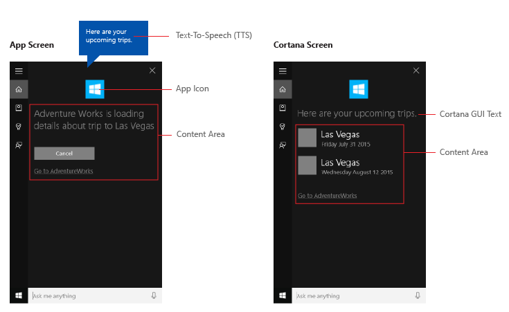

# Ativar um aplicativo em segundo plano com comandos de voz por meio da Cortana

Além de usar comandos de voz na **Cortana** para acessar os recursos do sistema, você também pode estender a **Cortana** com recursos e funcionalidade de seu aplicativo (como uma tarefa em segundo plano usando comandos de voz que especificam uma ação ou comando para execução. Quando um aplicativo manipula um comando de voz em segundo plano, ele não tem foco. Em vez disso, ele retorna todos os comentários e resultados por meio da tela da **Cortana** e da voz da **Cortana**.

**APIs importantes**

-   [**Windows.ApplicationModel.VoiceCommands**](https://msdn.microsoft.com/library/windows/apps/dn706594)
-   [**Elementos e atributos VCD v1.2**](https://msdn.microsoft.com/library/windows/apps/dn706593)


Aplicativos podem ser ativados para o primeiro plano (o aplicativo recebe o foco) ou em segundo plano (a **Cortana** retém o foco), dependendo da complexidade da interação. Por exemplo, comandos de voz que exigem contexto adicional ou entrada do usuário (como enviar uma mensagem a um contato específico) são manipulados mais facilmente em um aplicativo em primeiro plano, enquanto comandos básicos (como listagem de futuras viagens) podem ser manipulados na **Cortana** por meio de um aplicativo em segundo plano.

Se você quiser ativar um aplicativo para o primeiro plano com comandos de voz, consulte [Ativar um aplicativo em primeiro plano com comandos de voz por meio da Cortana](launch-a-foreground-app-with-voice-commands-in-cortana.md).

> **Observação**  
> Um comando de voz é uma expressão única com um propósito específico, definido em um arquivo VCD (Definição de Comando de Voz), direcionado para um aplicativo instalado por meio da **Cortana**.

> Um arquivo VCD define um ou mais comandos de voz, cada um com um propósito exclusivo.

> A definição de um comando de voz pode variar em complexidade. Ela pode dar suporte a tudo, de uma única expressão restrita a uma coleção de expressões mais flexíveis, expressões de linguagem natural, todas indicando o mesmo propósito.

Para demonstrar recursos de aplicativos de segundo plano, usaremos um aplicativo de planejamento e gerenciamento de viagens chamado **Adventure Works** do [Amostra de comando de voz da Cortana](http://go.microsoft.com/fwlink/p/?LinkID=619899).

Esta é uma visão geral do aplicativo **Adventure Works** integrado à tela da **Cortana**.



Para exibir uma viagem do **Adventure Works** sem a **Cortana**, o usuário deve iniciar o aplicativo e navegar até a página **Viagens futuras**.

Usando comandos de voz por meio da **Cortana** para iniciar seu aplicativo em segundo plano, o usuário pode apenas dizer: "Adventure Works, quando será minha viagem para Las Vegas?" O aplicativo manipula o comando, e a **Cortana** exibe os resultados juntamente com o ícone e outras informações do aplicativo, se fornecidas. Este é um exemplo de uma consulta básica de viagem e a tela de resultados da **Cortana** que mostra e fala: "Sua próxima viagem para Las Vegas será sexta-feira, 31 de julho de 2015".


Estas são as etapas básicas para adicionar a funcionalidade de comando de voz e estender a **Cortana** com a funcionalidade de segundo plano de seu aplicativo usando entrada de controle por voz ou de teclado:

1.  Crie um serviço de aplicativo (consulte [**Windows.ApplicationModel.AppService**](https://msdn.microsoft.com/library/windows/apps/dn921731)) que a **Cortana** invoca em segundo plano.
2.  Crie um arquivo VCD. Esse é um documento XML que define todos os comandos falados que o usuário pode dizer para iniciar ações ou invocar comandos ao ativar seu aplicativo. Consulte [**Elementos e atributos VCD v1.2**](https://msdn.microsoft.com/library/windows/apps/dn706593).
3.  Registre os conjuntos de comandos no arquivo VCD quando o aplicativo for iniciado.
4.  Manipule a ativação em segundo plano do serviço de aplicativo e a execução do comando de voz.
5.  Exiba e fale o comentário apropriado para o comando de voz na **Cortana**.

**Pré-requisitos:  **

Se você for iniciante no desenvolvimento de aplicativos da Plataforma Universal do Windows (UWP), consulte estes tópicos para familiarizar-se com as tecnologias abordadas aqui.

-   [Criar seu primeiro aplicativo](https://msdn.microsoft.com/library/windows/apps/bg124288)
-   Saiba mais sobre eventos com [Visão geral de eventos e eventos roteados](https://msdn.microsoft.com/library/windows/apps/mt185584)

**Diretrizes de experiência do usuário:  **

Consulte as [Diretrizes de design da Cortana](https://msdn.microsoft.com/library/windows/apps/dn974233), para obter informações sobre como integrar seu aplicativo à **Cortana** e as [Diretrizes de design de controle por voz](https://msdn.microsoft.com/library/windows/apps/dn596121) para obter dicas úteis para criar um aplicativo interessante e prático, habilitado para controle por voz.

## <span id="Create_a_new_solution_with_a_primary_project_in_Visual_Studio"></span><span id="create_a_new_solution_with_a_primary_project_in_visual_studio"></span><span id="CREATE_A_NEW_SOLUTION_WITH_A_PRIMARY_PROJECT_IN_VISUAL_STUDIO"></span>Criar uma nova solução com um projeto principal no Visual Studio


1.  Inicie o Microsoft Visual Studio 2015.

    A página inicial do Visual Studio 2015 é exibida.

2.  No menu **Arquivo**, selecione **Novo** > **Projeto**.

    A caixa de diálogo **Novo Projeto** será exibida. O painel esquerdo da caixa de diálogo permite que você selecione o tipo de modelos a exibir.

3.  No painel esquerdo, expanda **Instalado > Modelos > Visual C\# > Windows** e escolha o grupo de modelos **Universal**. O painel central da caixa de diálogo exibe uma lista de modelos de projetos para aplicativos UWP (Plataforma Universal do Windows).
4.  No painel central, selecione o modelo **Aplicativo em Branco (Universal do Windows)**.

    O modelo **Aplicativo em Branco** cria um aplicativo UWP básico que é compilado e executado, mas não contém controles de interface do usuário ou dados. Você adicionará controles ao aplicativo durante este tutorial.

5.  Na caixa de texto **Nome**, digite o nome do seu projeto. Para este exemplo, usamos "AdventureWorks".
6.  Clique em **OK** para criar o projeto.

    O Microsoft Visual Studio criará seu projeto e o exibirá no **Gerenciador de Soluções**.


## <span id="Add_image_assets_to_primary_project_and_specify_them_in_the_app_manifest"></span><span id="add_image_assets_to_primary_project_and_specify_them_in_the_app_manifest"></span><span id="ADD_IMAGE_ASSETS_TO_PRIMARY_PROJECT_AND_SPECIFY_THEM_IN_THE_APP_MANIFEST"></span>Adicionar ativos de imagem ao projeto principal e especificá-los no manifesto do aplicativo
      
Os aplicativos UWP (Plataforma Universal do Windows) podem selecionar automaticamente imagens adequadas com base em configurações específicas e recursos do dispositivo (alto contraste, pixels efetivos, localidade etc.) Tudo o que você precisa fazer é fornecer as imagens e se certificar de usar a convenção de nomenclatura apropriada e a organização de pasta dentro do projeto do aplicativo para as versões de recursos diferentes. Se você não fornecer as versões de recurso recomendadas, a acessibilidade, a localização e a qualidade da imagem poderão sofrer, dependendo das preferências do usuário, habilidades, tipo de dispositivo e local.

Para obter mais detalhes sobre os recursos de imagem dos fatores de escala e de alto contraste, consulte [Diretrizes de ativos de bloco e ícone](https://msdn.microsoft.com/windows/uwp/controls-and-patterns/tiles-and-notifications-app-assets).

Você nomeia recursos usando qualificadores. Os qualificadores de recursos são modificadores de pasta e nome de arquivo que identificam o contexto em que uma determinada versão de um recurso deve ser usada.

A convenção de nomenclatura padrão é `foldername/qualifiername-value[_qualifiername-value]/filename.qualifiername-value[_qualifiername-value].ext`. Por exemplo, `images/en-US/logo.scale-100_contrast-white.png`, que pode ser referenciado no código usando apenas a pasta raiz e o nome do arquivo: `images/logo.png`. Consulte [Como nomear recursos usando qualificadores](https://msdn.microsoft.com/library/windows/apps/xaml/hh965324.aspx).

Recomendamos marcar o idioma padrão nos arquivos de recursos de cadeia de caracteres (como `en-US\resources.resw`) e o fator de escala padrão em imagens (como `logo.scale-100.png`), mesmo que você não pretenda fornecer recursos localizados ou de várias resoluções no momento. No entanto, é recomendável, no mínimo, que você forneça ativos para os fatores de escala 100, 200 e 400.

> *Importante

> O ícone do aplicativo usado na área de título da tela da **Cortana** é o ícone Square44x44Logo especificado no arquivo "Package.appxmanifest". 

> Você também pode especificar um ícone para cada entrada na área de conteúdo da tela da **Cortana**. Tamanhos de imagem válidos para os ícones de resultados são:

> - 68 l x 68 a 
> - 68 l x 92 a 
> - 280 l x 140 a 

O bloco de conteúdo não será validado até que um [**VoiceCommandResponse**](https://msdn.microsoft.com/library/windows/apps/dn974182) seja passado para [**VoiceCommandServiceConnection**](https://msdn.microsoft.com/library/windows/apps/dn974204). Se você passar um objeto **VoiceCommandResponse** para a **Cortana** contendo um bloco de conteúdo com uma imagem que não respeite essas proporções de tamanho, poderá ocorrer uma exceção. 

Neste exemplo do aplicativo **Adventure Works** (VoiceCommandService\\AdventureWorksVoiceCommandService.cs), especificamos um quadrado cinza simples ("GreyTile.png") no [**VoiceCommandContentTile**](https://msdn.microsoft.com/library/windows/apps/dn974168) usando o modelo de bloco [**TitleWith68x68IconAndText**](https://msdn.microsoft.com/library/windows/apps/dn974169). As variantes de logotipo estão localizadas em VoiceCommandService\\Images e são recuperadas usando o método [**GetFileFromApplicationUriAsync**](https://msdn.microsoft.com/library/windows/apps/hh701741).

```CSharp
var destinationTile = new VoiceCommandContentTile();

destinationTile.ContentTileType = 
  VoiceCommandContentTileType.TitleWith68x68IconAndText;
destinationTile.Image = 
  await StorageFile.GetFileFromApplicationUriAsync(
    new Uri("ms-appx:///AdventureWorks.VoiceCommands/Images/GreyTile.png"));
```

## <span id="Create_an_app_service_project"></span><span id="create_an_app_service_project"></span><span id="CREATE_AN_APP_SERVICE_PROJECT"></span>Criar um projeto de serviço de aplicativo

<ol>
    <li>
Clique com botão direito do mouse no nome da solução, selecione **Novo > Projeto**.
    </li>
    <li>
Em **instalado > Modelos > Visual C# > Windows > Universal**, selecione **Componente do Tempo de Execução do Windows**. Este é o componente que implementa o serviço de aplicativo (consulte **[Windows.ApplicationModel.AppService](https://msdn.microsoft.com/library/windows/apps/dn921731)**).
    </li>
    <li>
Digite um nome para o projeto (por exemplo, "VoiceCommandService") e clique em **OK**.
    </li>
    <li>
No **Gerenciador de Soluções**, selecione o projeto "VoiceCommandService" e renomeie o arquivo "Class1.cs" gerado pelo Visual Studio. Para o exemplo **Adventure Works**, usamos "AdventureWorksVoiceCommandService.cs".
    </li>
    <li>
Clique em **Sim** quando perguntado se deseja renomear todas as ocorrências de "Class1". 
    </li>
    <li>
No arquivo "AdventureWorksVoiceCommandService.cs": <ol type="i">
 <li>
Adicione a seguinte diretiva de uso:  
 ```using Windows.ApplicationModel.Background;```
 </li>
 <li>
Quando você cria um novo projeto, o nome do projeto é usado como o namespace de raiz padrão em todos os arquivos. Renomeie o namespace para aninhar o código de serviço do aplicativo sob o projeto principal. Por exemplo, `namespace AdventureWorks.VoiceCommands`. 
 </li>
 <li>
Clique com o botão direito do mouse no nome do projeto de serviço do aplicativo no Gerenciador de Soluções e selecione **Propriedades**. 
 </li>
 <li>
Na guia **Biblioteca**, atualize o campo **Namespace padrão** com esse mesmo valor (por exemplo, "AdventureWorks.VoiceCommands"). 
 </li>
 <li>
Crie uma nova classe que implemente a interface [**IBackgroundTask**](https://msdn.microsoft.com/library/windows/apps/br224794). Essa classe requer um método [**Run**](https://msdn.microsoft.com/library/windows/apps/br224811) que é o ponto de entrada quando a Cortana reconhece o comando de voz. 
 </li>
        </ol>
    </li>
</ol>

Esta á uma classe de tarefa em segundo plano básica do aplicativo **Adventure Works**. Preencheremos mais detalhes posteriormente.
> **Observação**    
> A classe da tarefa em segundo plano em si e todas as outras classes no projeto da tarefa em segundo plano precisam ser de classes públicas seladas.
 
``` csharp
namespace AdventureWorks.VoiceCommands
{
    ...
    
    /// <summary>
    /// The VoiceCommandService implements the entry point for all voice commands.
    /// The individual commands supported are described in the VCD xml file. 
    /// The service entry point is defined in the appxmanifest.
    /// </summary>
    public sealed class AdventureWorksVoiceCommandService : IBackgroundTask
    {
        ...
        
        /// <summary>
        /// The background task entrypoint. 
        /// 
        /// Background tasks must respond to activation by Cortana within 0.5 seconds, and must 
        /// report progress to Cortana every 5 seconds (unless Cortana is waiting for user
        /// input). There is no execution time limit on the background task managed by Cortana,
        /// but developers should use plmdebug (https://msdn.microsoft.com/library/windows/hardware/jj680085%28v=vs.85%29.aspx)
        /// on the Cortana app package in order to prevent Cortana timing out the task during
        /// debugging.
        /// 
        /// The Cortana UI is dismissed if Cortana loses focus. 
        /// The background task is also dismissed even if being debugged. 
        /// Use of Remote Debugging is recommended in order to debug background task behaviors. 
        /// Open the project properties for the app package (not the background task project), 
        /// and enable Debug -> "Do not launch, but debug my code when it starts". 
        /// Alternatively, add a long initial progress screen, and attach to the background task process while it executes.
        /// </summary>
        /// <param name="taskInstance">Connection to the hosting background service process.</param>
        public void Run(IBackgroundTaskInstance taskInstance)
        {
        
          //
          // TODO: Insert code 
          //
          //
        
    }        
  }
}
```

<ol start="7">
    <li>
Declare sua tarefa em segundo como um **AppService** no manifesto do aplicativo.
    <ol type="i">
        <li>
No **Gerenciador de Soluções**, clique com o botão direito do mouse no arquivo "Package.appxmanifest" e selecione **Exibir Código**. 
        </li>
        <li>
Localize o elemento [**Application**](https://msdn.microsoft.com/library/windows/apps/dn934738).
        </li>
        <li>
Adicione um elemento [**Extensions**](https://msdn.microsoft.com/library/windows/apps/dn934720) ao elemento [**Application**](https://msdn.microsoft.com/library/windows/apps/dn934738).
        </li>
        <li>
Adicione um elemento [**uap:Extension**](https://msdn.microsoft.com/library/windows/apps/dn986788) ao elemento [**Extensions**](https://msdn.microsoft.com/library/windows/apps/dn934720).
        </li>
        <li>Adicione um atributo **Category** ao elemento **uap:Extension** e defina o valor do atributo **Category** como "windows.appService".
        </li>
        <li>
Adicione um atributo **EntryPoint** ao elemento **uap:Extension** e defina o valor do atributo **EntryPoint** ao nome da classe que implementa [**IBackgroundTask**](https://msdn.microsoft.com/library/windows/apps/br224794), nesse caso, "AdventureWorks.VoiceCommands.AdventureWorksVoiceCommandService".
        </li>
        <li>
Adicione um elemento [**uap:AppService**](https://msdn.microsoft.com/library/windows/apps/dn934779) ao elemento **uap:Extension**.
        </li>
        <li>
Adicione um atributo **Name** ao elemento [**uap:AppService**](https://msdn.microsoft.com/library/windows/apps/dn934779) e defina o valor do atributo **Name** como o nome do serviço de aplicativo, neste caso "AdventureWorksVoiceCommandService".
        </li>
        <li>
Adicione um segundo elemento [**uap:Extension**](https://msdn.microsoft.com/library/windows/apps/dn986788) a [**Extensions**](https://msdn.microsoft.com/library/windows/apps/dn934720).
        </li>
        <li>
Adicione um atributo **Category** a esse elemento [**uap:Extension**](https://msdn.microsoft.com/library/windows/apps/dn986788) e defina o valor do atributo **Category** a "windows.personalAssistantLaunch".
        </li>
    </li> 
    </ol>
    </li>    
</ol>  

Este é o manifesto do aplicativo Adventure Works:
```xml
<Package>
  <Applications>
    <Application>

      <Extensions>
        <uap:Extension Category="windows.appService" 
          EntryPoint="CortanaBack1.VoiceCommands.CortanaBack1VoiceCommandService">
          <uap:AppService Name="CortanaBack1VoiceCommandService"/>
        </uap:Extension>
        <uap:Extension Category="windows.personalAssistantLaunch"/>
      </Extensions>

    <Application>
  <Applications>
</Package>
```

<ol start="8">
    <li>
Adicione esse projeto de serviço do aplicativo como uma referência no projeto principal. 
    <ol type="i">
        <li>
Clique com botão direito em **Referências**. 
        </li>
        <li>
Selecione **Adicionar Referência...** 
        </li>
        <li>
Na caixa de diálogo **Gerenciador de Referências**, expanda **Projetos** e selecione o projeto de serviço do aplicativo. 
        </li>
        <li>
Clique em OK. 
        </li>
    </ol>
    </li>
</ol>

## <span id="Create_a_VCD_file"></span><span id="create_a_vcd_file"></span><span id="CREATE_A_VCD_FILE"></span>Criar um arquivo VCD


1. No Visual Studio, clique com o botão direito do mouse no nome do projeto principal e selecione **Adicionar > Novo Item**. Adicione um **Arquivo XML**.
2. Digite um nome para o arquivo [**VCD**](https://msdn.microsoft.com/library/windows/apps/dn706593) (por exemplo, "AdventureWorksCommands.xml") e clique em Adicionar. 
3. No **Gerenciador de Soluções**, selecione o arquivo [**VCD**](https://msdn.microsoft.com/library/windows/apps/dn706593).
4.  Na janela **Propriedades**, defina **Ação de compilação** como **Conteúdo** e defina **Copiar para diretório de saída** como **Copiar se mais recente**.

## <span id="Edit_the_VCD_file"></span><span id="edit_the_vcd_file"></span><span id="EDIT_THE_VCD_FILE"></span>Editar arquivo VCD

1. Adicione um elemento **VoiceCommands** com um atributo **xmlns** apontando para `http://schemas.microsoft.com/voicecommands/1.2`.

2. Para cada idioma compatível com seu aplicativo, crie um elemento [**CommandSet**](https://msdn.microsoft.com/library/windows/apps/dn722331) que contenha os comandos de voz suportados por seu aplicativo.

  Você pode declarar vários elementos [**CommandSet**](https://msdn.microsoft.com/library/windows/apps/dn722331), cada um com um atributo [**xml:lang**](https://msdn.microsoft.com/library/windows/apps/dn722331) diferente para que seu aplicativo seja usado em diferentes mercados. Por exemplo, um aplicativo para os Estados Unidos poderá ter um [**CommandSet**](https://msdn.microsoft.com/library/windows/apps/dn722331) para inglês e um [**CommandSet**](https://msdn.microsoft.com/library/windows/apps/dn722331) para espanhol.

  >  **Cuidado**  
  Para ativar um aplicativo e iniciar uma ação usando um comando de voz, o aplicativo deve registrar um arquivo VCD que contenha um [**CommandSet**](https://msdn.microsoft.com/library/windows/apps/dn722331) com um idioma correspondente ao idioma do controle por voz selecionado pelo usuário para seu dispositivo. O idioma de controle por voz está localizado em **Configurações > Sistema > Controle por Voz >Idioma do Controle por Voz**.

3. Adicione um elemento **Command** para cada comando ao qual você deseja dar suporte.

  Cada **Command** declarado em um arquivo [**VCD**](https://msdn.microsoft.com/library/windows/apps/dn706593) deve incluir estas informações:

  - Um atributo **Name** que seu aplicativo usa para identificar o comando de voz em tempo de execução. 
  - Um elemento **Example** que contém uma frase que descreve como um usuário pode invocar o comando. **A Cortana** mostra este exemplo quando o usuário diz "O que posso dizer?", "Ajuda" ou quando toca em **Ver mais**.    
  -   Um elemento **ListenFor** que contém as palavras ou frases que o aplicativo reconhece como um comando. Cada elemento **ListenFor** pode conter referências a um ou mais elementos **PhraseList** que contenham palavras específicas relevantes para o comando.
  > **Observação**  
Os elementos  **ListenFor** não podem ser modificados programaticamente. No entanto, os elementos **PhraseList** que estão associados aos elementos **ListenFor** podem ser modificados programaticamente. Os aplicativos devem modificar o conteúdo de **PhraseList** no tempo de execução com base no conjunto de dados gerado conforme o usuário usa o aplicativo. Consulte [Modificar dinamicamente listas de frases de VCD (Definição de Comando de Voz)](dynamically-modify-voice-command-definition--vcd--phrase-lists.md).

  -   Um elemento **Feedback** que contém o texto para a **Cortana** exibir e falar quando o aplicativo é iniciado.

Um elemento **Navigate** indica que o comando de voz ativa o aplicativo no primeiro plano. Neste exemplo, o comando ```showTripToDestination``` é uma tarefa em primeiro plano.

O elemento **VoiceCommandService** indica que o comando de voz ativa o aplicativo em segundo plano. O valor do atributo **Target** deste elemento deve corresponder ao valor do atributo **Name** do elemento [**uap:AppService**](https://msdn.microsoft.com/library/windows/apps/dn934779) no arquivo package.appxmanifest. Neste exemplo, os comandos ```whenIsTripToDestination``` e ```cancelTripToDestination``` são tarefas em segundo plano que especificam o nome do serviço de aplicativo, como "AdventureWorksVoiceCommandService".

Para obter mais detalhes, consulte a referência [**Elementos e atributos VCD v1.2**](https://msdn.microsoft.com/library/windows/apps/dn706593).

Esta é uma parte do arquivo [**VCD**](https://msdn.microsoft.com/library/windows/apps/dn706593) que define os comandos de voz em en-us para o aplicativo **Adventure Works**.

```xml
<?xml version="1.0" encoding="utf-8" ?>
<VoiceCommands xmlns="http://schemas.microsoft.com/voicecommands/1.2">
  <CommandSet xml:lang="en-us" Name="AdventureWorksCommandSet_en-us">
    <AppName> Adventure Works </AppName>
    <Example> Show trip to London </Example>

    <Command Name="showTripToDestination">
      <Example> Show trip to London </Example>
      <ListenFor RequireAppName="BeforeOrAfterPhrase"> show [my] trip to {destination} </ListenFor>
      <ListenFor RequireAppName="ExplicitlySpecified"> show [my] {builtin:AppName} trip to {destination} </ListenFor>
      <Feedback> Showing trip to {destination} </Feedback>
      <Navigate />
    </Command>

    <Command Name="whenIsTripToDestination">
      <Example> When is my trip to Las Vegas?</Example>
      <ListenFor RequireAppName="BeforeOrAfterPhrase"> when is [my] trip to {destination}</ListenFor>
      <ListenFor RequireAppName="ExplicitlySpecified"> when is [my] {builtin:AppName} trip to {destination} </ListenFor>
      <Feedback> Looking for trip to {destination}</Feedback>
      <VoiceCommandService Target="AdventureWorksVoiceCommandService"/>
    </Command>
    
    <Command Name="cancelTripToDestination">
      <Example> Cancel my trip to Las Vegas </Example>
      <ListenFor RequireAppName="BeforeOrAfterPhrase"> cancel [my] trip to {destination}</ListenFor>
      <ListenFor RequireAppName="ExplicitlySpecified"> cancel [my] {builtin:AppName} trip to {destination} </ListenFor>
      <Feedback> Cancelling trip to {destination}</Feedback>
      <VoiceCommandService Target="AdventureWorksVoiceCommandService"/>
    </Command>

    <PhraseList Label="destination">
      <Item>London</Item>
      <Item>Las Vegas</Item>
      <Item>Melbourne</Item>
      <Item>Yosemite National Park</Item>
    </PhraseList>
  </CommandSet>
```

## <span id="Install_the_VCD_commands"></span><span id="install_the_vcd_commands"></span><span id="INSTALL_THE_VCD_COMMANDS"></span>Instalar os comandos VCD

Seu aplicativo deve ser executado uma vez para instalar o VCD. 

>  **Observação**  
Dados de comandos de voz não são preservados entre instalações do aplicativo. Para garantir que os dados de comandos de voz de seu aplicativo permaneçam intactos, considere inicializar o arquivo VCD a cada vez que seu aplicativo for iniciado ou ativado ou manter uma configuração que indique se o VCD está instalado no momento.

No arquivo "app.xaml.cs":

1. Adicione a seguinte diretiva de uso:  
```csharp
using Windows.Storage;
```
2. Marque o método "OnLaunched" com o modificador async.  
```csharp
protected async override void OnLaunched(LaunchActivatedEventArgs e)
```
3. Chame [**InstallCommandDefinitionsFromStorageFileAsync**](https://msdn.microsoft.com/library/windows/apps/dn708205) no manipulador [**OnLaunched**](https://msdn.microsoft.com/library/windows/apps/br242335) para registrar os comandos de voz que o sistema deve reconhecer.

  Na amostra do Adventure Works, primeiro definimos um objeto [**StorageFile**](https://msdn.microsoft.com/library/windows/apps/br227171). 

  Em seguida, chamamos [**GetFileAsync**](https://msdn.microsoft.com/library/windows/apps/br227272) para inicializá-lo com nosso arquivo "AdventureWorksCommands.xml".

  Esse objeto [**StorageFile**](https://msdn.microsoft.com/library/windows/apps/br227171) é então passado para [**InstallCommandDefinitionsFromStorageFileAsync**](https://msdn.microsoft.com/library/windows/apps/dn708205).    
```CSharp
try
{
  // Install the main VCD. 
  StorageFile vcdStorageFile = 
    await Package.Current.InstalledLocation.GetFileAsync(
      @"AdventureWorksCommands.xml");

  await Windows.ApplicationModel.VoiceCommands.VoiceCommandDefinitionManager.
    InstallCommandDefinitionsFromStorageFileAsync(vcdStorageFile);

  // Update phrase list.
  ViewModel.ViewModelLocator locator = App.Current.Resources["ViewModelLocator"] as ViewModel.ViewModelLocator;
  if(locator != null)
  {
     await locator.TripViewModel.UpdateDestinationPhraseList();
  }
}
catch (Exception ex)
{
  System.Diagnostics.Debug.WriteLine("Installing Voice Commands Failed: " + ex.ToString());
}
```

## <span id="Handle_activation_and_execute_voice_commands"></span><span id="handle_activation_and_execute_voice_commands"></span><span id="HANDLE_ACTIVATION_AND_EXECUTE_VOICE_COMMANDS"></span>Manipular a ativação

Especifique como seu aplicativo responderá às ativações por comando de voz subsequentes (após ele ser iniciado e os conjuntos de comandos de voz serem instalados).

1.  Confirmar que o aplicativo foi ativado por comando por voz.

    Substitua o evento [**Application.OnActivated**](https://msdn.microsoft.com/library/windows/apps/br242330) e verifique se [**IActivatedEventArgs**](https://msdn.microsoft.com/library/windows/apps/br224727).[**Kind**](https://msdn.microsoft.com/library/windows/apps/br224728) é [**VoiceCommand**](https://msdn.microsoft.com/library/windows/apps/br224693).

2.  Determine o nome do comando e o que foi falado.

    Obtenha uma referência a um objeto [**VoiceCommandActivatedEventArgs**](https://msdn.microsoft.com/library/windows/apps/dn609755) de [**IActivatedEventArgs**](https://msdn.microsoft.com/library/windows/apps/br224727) e consulte a propriedade [**Result**](https://msdn.microsoft.com/library/windows/apps/dn609758) de um objeto [**SpeechRecognitionResult**](https://msdn.microsoft.com/library/windows/apps/dn631432).

    Para determinar o que o usuário disse, verifique o valor de [**Text**](https://msdn.microsoft.com/library/windows/apps/dn631441) ou das propriedades semânticas da frase reconhecida no dicionário [**SpeechRecognitionSemanticInterpretation**](https://msdn.microsoft.com/library/windows/apps/dn631443).

3.  Execute a ação apropriada no aplicativo, por exemplo, navegando até a página desejada.

Para este exemplo, nos referimos ao VCD na Etapa 3: editar o arquivo VCD.

Ao termos o resultado do reconhecimento por voz para o comando por voz, temos o nome do comando do primeiro valor na matriz [**RulePath**](https://msdn.microsoft.com/library/windows/apps/dn631438). Como o arquivo VCD definiu mais de um comando de voz possível, precisamos comparar o valor em relação os nomes dos comando no VCD e executar a ação apropriada.

A ação mais comum do aplicativo é navegar até uma página com conteúdo relevante ao contexto do comando de voz. Neste exemplo, navegamos para uma página **TripPage** e transmitimos o valor do comando de voz, como o comando foi inserido e a frase de "destino" reconhecida (se aplicável). Como opção, o aplicativo pode enviar um parâmetro de navegação para [**SpeechRecognitionResult**](https://msdn.microsoft.com/library/windows/apps/dn631432) ao navegar até a página.

Você pode descobrir se o comando de voz inicializado pelo aplicativo foi realmente falado ou digitado como texto, a partir do dicionário [**SpeechRecognitionSemanticInterpretation.Properties**](https://msdn.microsoft.com/library/windows/apps/dn631445) usando a chave **commandMode**. O valor dessa tecla será "voz" ou "texto". Se o valor da chave for "voz", considere o uso de sintetização de voz ([**Windows.Media.SpeechSynthesis**](https://msdn.microsoft.com/library/windows/apps/dn278951)) em seu aplicativo para dar feedback falado ao usuário.

Use [**SpeechRecognitionSemanticInterpretation.Properties**](https://msdn.microsoft.com/library/windows/apps/dn631445) para descobrir o conteúdo falado nas restrições **PhraseList** ou **PhraseTopic** de um elemento **ListenFor**. A chave de dicionário é o valor do atributo **Label** do elemento **PhraseList** ou **PhraseTopic**. Aqui, mostramos como acessar o valor da frase **{destination}**.

``` csharp
/// <summary>
/// Entry point for an application activated by some means other than normal launching. 
/// This includes voice commands, URI, share target from another app, and so on. 
/// 
/// NOTE:
/// A previous version of the VCD file might remain in place 
/// if you modify it and update the app through the store. 
/// Activations might include commands from older versions of your VCD. 
/// Try to handle these commands gracefully.
/// </summary>
/// <param name="args">Details about the activation method.</param>
protected override void OnActivated(IActivatedEventArgs args)
{
    base.OnActivated(args);

    Type navigationToPageType;
    ViewModel.TripVoiceCommand? navigationCommand = null;

    // Voice command activation.
    if (args.Kind == ActivationKind.VoiceCommand)
    {
        // Event args can represent many different activation types. 
        // Cast it so we can get the parameters we care about out.
        var commandArgs = args as VoiceCommandActivatedEventArgs;

        Windows.Media.SpeechRecognition.SpeechRecognitionResult speechRecognitionResult = commandArgs.Result;

        // Get the name of the voice command and the text spoken. 
        // See VoiceCommands.xml for supported voice commands.
        string voiceCommandName = speechRecognitionResult.RulePath[0];
        string textSpoken = speechRecognitionResult.Text;

        // commandMode indicates whether the command was entered using speech or text.
        // Apps should respect text mode by providing silent (text) feedback.
        string commandMode = this.SemanticInterpretation("commandMode", speechRecognitionResult);
        
        switch (voiceCommandName)
        {
            case "showTripToDestination":
                // Access the value of {destination} in the voice command.
                string destination = this.SemanticInterpretation("destination", speechRecognitionResult);

                // Create a navigation command object to pass to the page. 
                navigationCommand = new ViewModel.TripVoiceCommand(
                    voiceCommandName,
                    commandMode,
                    textSpoken,
                    destination);

                // Set the page to navigate to for this voice command.
                navigationToPageType = typeof(View.TripDetails);
                break;
            default:
                // If we can't determine what page to launch, go to the default entry point.
                navigationToPageType = typeof(View.TripListView);
                break;
        }
    }
    // Protocol activation occurs when a card is clicked within Cortana (using a background task).
    else if (args.Kind == ActivationKind.Protocol)
    {
        // Extract the launch context. In this case, we're just using the destination from the phrase set (passed
        // along in the background task inside Cortana), which makes no attempt to be unique. A unique id or 
        // identifier is ideal for more complex scenarios. We let the destination page check if the 
        // destination trip still exists, and navigate back to the trip list if it doesn't.
        var commandArgs = args as ProtocolActivatedEventArgs;
        Windows.Foundation.WwwFormUrlDecoder decoder = new Windows.Foundation.WwwFormUrlDecoder(commandArgs.Uri.Query);
        var destination = decoder.GetFirstValueByName("LaunchContext");

        navigationCommand = new ViewModel.TripVoiceCommand(
                                "protocolLaunch",
                                "text",
                                "destination",
                                destination);

        navigationToPageType = typeof(View.TripDetails);
    }
    else
    {
        // If we were launched via any other mechanism, fall back to the main page view.
        // Otherwise, we'll hang at a splash screen.
        navigationToPageType = typeof(View.TripListView);
    }

    // Repeat the same basic initialization as OnLaunched() above, taking into account whether
    // or not the app is already active.
    Frame rootFrame = Window.Current.Content as Frame;

    // Do not repeat app initialization when the Window already has content,
    // just ensure that the window is active.
    if (rootFrame == null)
    {
        // Create a frame to act as the navigation context and navigate to the first page.
        rootFrame = new Frame();
        App.NavigationService = new NavigationService(rootFrame);

        rootFrame.NavigationFailed += OnNavigationFailed;

        // Place the frame in the current window.
        Window.Current.Content = rootFrame;
    }

    // Since we're expecting to always show a details page, navigate even if 
    // a content frame is in place (unlike OnLaunched).
    // Navigate to either the main trip list page, or if a valid voice command
    // was provided, to the details page for that trip.
    rootFrame.Navigate(navigationToPageType, navigationCommand);

    // Ensure the current window is active
    Window.Current.Activate();
}

/// <summary>
/// Returns the semantic interpretation of a speech result. 
/// Returns null if there is no interpretation for that key.
/// </summary>
/// <param name="interpretationKey">The interpretation key.</param>
/// <param name="speechRecognitionResult">The speech recognition result to get the semantic interpretation from.</param>
/// <returns></returns>
private string SemanticInterpretation(string interpretationKey, SpeechRecognitionResult speechRecognitionResult)
{
  return speechRecognitionResult.SemanticInterpretation.Properties[interpretationKey].FirstOrDefault();
}
```

## <span id="Handle_the_voice_command_in_the_app_service"></span><span id="handle_the_voice_command_in_the_app_service"></span><span id="HANDLE_THE_VOICE_COMMAND_IN_THE_APP_SERVICE"></span>Manipule o comando de voz no serviço de aplicativo


Processe o comando de voz no serviço de aplicativo.


1.  Adicione o seguinte usando diretivas para seu arquivo de serviço de comando de voz, "AdventureWorksVoiceCommandService.cs" para este exemplo.
```csharp
using Windows.ApplicationModel.VoiceCommands;
using Windows.ApplicationModel.Resources.Core;
using Windows.ApplicationModel.AppService;
```

2.  Obtenha o adiamento de serviço para que o serviço de seu aplicativo não seja encerrado ao manipular o comando de voz.
3.  Confirme se a tarefa em segundo plano está sendo executada como um serviço de aplicativo ativado por um comando de voz.

    1.  Converta [**IBackgroundTaskInstance.TriggerDetails**](https://msdn.microsoft.com/library/windows/apps/br224802) em [**Windows.ApplicationModel.AppService.AppServiceTriggerDetails**](https://msdn.microsoft.com/library/windows/apps/dn921727).
    2.  Verifique se [**IBackgroundTaskInstance.TriggerDetails.Name**](https://msdn.microsoft.com/library/windows/apps/br224807) é o nome do serviço de aplicativo no arquivo "Package.appxmanifest".

4.  Use [**IBackgroundTaskInstance.TriggerDetails**](https://msdn.microsoft.com/library/windows/apps/br224802) para criar um [**VoiceCommandServiceConnection**](https://msdn.microsoft.com/library/windows/apps/dn974204) para que a **Cortana** recupere o comando de voz.
5.  Registre um manipulador de eventos para [**VoiceCommandServiceConnection**](https://msdn.microsoft.com/library/windows/apps/dn974204).[**VoiceCommandCompleted**](https://msdn.microsoft.com/library/windows/apps/dn706584) para receber notificação quando o serviço de aplicativo for encerrado devido a um cancelamento do usuário.
6.  Registre um manipulador de eventos para [**IBackgroundTaskInstance.Canceled**](https://msdn.microsoft.com/library/windows/apps/br224798) para receber notificação quando o serviço de aplicativo for encerrado devido a uma falha inesperada.
7.  Determine o nome do comando e o que foi falado.

    1.  Use a propriedade [**VoiceCommand**](https://msdn.microsoft.com/library/windows/apps/dn974162).[**CommandName**](https://msdn.microsoft.com/library/windows/apps/dn706589) para determinar o nome do comando de voz.
    2.  Para determinar o que o usuário disse, verifique o valor de [**Text**](https://msdn.microsoft.com/library/windows/apps/dn631441) ou das propriedades semânticas da frase reconhecida no dicionário [**SpeechRecognitionSemanticInterpretation**](https://msdn.microsoft.com/library/windows/apps/dn631443).

7.  Execute a ação apropriada no serviço de aplicativo.
8.  Exiba e fale o comentário para o comando de voz com a **Cortana**.

    1.  Determine as cadeias de caracteres que você quer que a **Cortana** exiba e fale para o usuário em resposta ao comando de voz e crie um objeto [**VoiceCommandResponse**](https://msdn.microsoft.com/library/windows/apps/dn974182). Para obter orientações sobre como selecionar cadeias de caracteres de comentários que a **Cortana** mostra e fala, consulte [Diretrizes de design da Cortana](https://msdn.microsoft.com/library/windows/apps/dn974233).
    2.  Use a instância [**VoiceCommandServiceConnection**](https://msdn.microsoft.com/library/windows/apps/dn974204) para relatar o progresso ou a conclusão para a **Cortana** chamando [**ReportProgressAsync**](https://msdn.microsoft.com/library/windows/apps/dn706579) ou [**ReportSuccessAsync**](https://msdn.microsoft.com/library/windows/apps/dn706580) com o objeto **VoiceCommandServiceConnection**.

    Para este exemplo, nos referimos ao VCD na Etapa 3: editar o arquivo VCD.

```csharp
public sealed class VoiceCommandService : IBackgroundTask
    {
      private BackgroundTaskDeferral serviceDeferral;
      VoiceCommandServiceConnection voiceServiceConnection;

      public async void Run(IBackgroundTaskInstance taskInstance)
      {
      //Take a service deferral so the service isn&#39;t terminated.
        this.serviceDeferral = taskInstance.GetDeferral();

        taskInstance.Canceled += OnTaskCanceled;

        var triggerDetails = 
          taskInstance.TriggerDetails as AppServiceTriggerDetails;

        if (triggerDetails != null &amp;&amp; 
          triggerDetails.Name == "AdventureWorksVoiceServiceEndpoint")
        {
          try
          {
 voiceServiceConnection = 
   VoiceCommandServiceConnection.FromAppServiceTriggerDetails(
     triggerDetails);

 voiceServiceConnection.VoiceCommandCompleted += 
   VoiceCommandCompleted;

 VoiceCommand voiceCommand = await
 voiceServiceConnection.GetVoiceCommandAsync();

 switch (voiceCommand.CommandName)
 {
   case "whenIsTripToDestination":
   {
     var destination = 
       voiceCommand.Properties["destination"][0];
     SendCompletionMessageForDestination(destination);
     break;
   }

   // As a last resort, launch the app in the foreground.
   default:
     LaunchAppInForeground();
     break;
 }
          }
          finally
          {
 if (this.serviceDeferral != null)
 {
   // Complete the service deferral.
   this.serviceDeferral.Complete();
 }
          }
        }
      }

      private void VoiceCommandCompleted(
        VoiceCommandServiceConnection sender, 
        VoiceCommandCompletedEventArgs args)
      {
        if (this.serviceDeferral != null)
        {
          // Insert your code here.
          // Complete the service deferral.
          this.serviceDeferral.Complete();
        }
      }

      private async void SendCompletionMessageForDestination(
        string destination)
      {
        // Take action and determine when the next trip to destination
        // Insert code here.
        
        // Replace the hardcoded strings used here with strings 
        // appropriate for your application.

        // First, create the VoiceCommandUserMessage with the strings 
        // that Cortana will show and speak.
        var userMessage = new VoiceCommandUserMessage();
        userMessage.DisplayMessage = "Here’s your trip.";
        userMessage.SpokenMessage = "Your trip to Vegas is on August 3rd.";

        // Optionally, present visual information about the answer.
        // For this example, create a VoiceCommandContentTile with an 
        // icon and a string.
        var destinationsContentTiles = new List<VoiceCommandContentTile>();

        var destinationTile = new VoiceCommandContentTile();
        destinationTile.ContentTileType = 
          VoiceCommandContentTileType.TitleWith68x68IconAndText;
        // The user can tap on the visual content to launch the app. 
        // Pass in a launch argument to enable the app to deep link to a 
        // page relevant to the item displayed on the content tile.
        destinationTile.AppLaunchArgument = 
          string.Format("destination={0}”, “Las Vegas");
        destinationTile.Title = "Las Vegas";
        destinationTile.TextLine1 = "August 3rd 2015";
        destinationsContentTiles.Add(destinationTile);

        // Create the VoiceCommandResponse from the userMessage and list    
        // of content tiles.
        var response = 
          VoiceCommandResponse.CreateResponse(
 userMessage, destinationsContentTiles);

        // Cortana will present a “Go to app_name” link that the user 
        // can tap to launch the app. 
        // Pass in a launch to enable the app to deep link to a page 
        // relevant to the voice command.
        response.AppLaunchArgument = 
          string.Format("destination={0}”, “Las Vegas");
        
        // Ask Cortana to display the user message and content tile and 
        // also speak the user message.
        await voiceServiceConnection.ReportSuccessAsync(response);
      }

      private async void LaunchAppInForeground()
      {
        var userMessage = new VoiceCommandUserMessage();
        userMessage.SpokenMessage = "Launching Adventure Works";

        var response = VoiceCommandResponse.CreateResponse(userMessage);

        // When launching the app in the foreground, pass an app 
        // specific launch parameter to indicate what page to show.
        response.AppLaunchArgument = "showAllTrips=true";

        await voiceServiceConnection.RequestAppLaunchAsync(response);
      }
    }
```

Depois de ativado, o serviço de aplicativo tem 0,5 segundo para chamar [**ReportSuccessAsync**](https://msdn.microsoft.com/library/windows/apps/dn706580). **A Cortana** usa os dados fornecidos pelo aplicativo para mostrar e falar o comentário especificado no arquivo VCD. Se o aplicativo levar mais de 0,5 segundo para fazer a chamada, a **Cortana** inserirá uma tela de entrega, conforme mostrado aqui. **A Cortana** exibe a tela de entrega até que o aplicativo chame **ReportSuccessAsync** ou por 5 segundos no máximo. Se o serviço de aplicativo não chamar **ReportSuccessAsync** ou qualquer um dos métodos [**VoiceCommandServiceConnection**](https://msdn.microsoft.com/library/windows/apps/dn974204) que fornecem informações à **Cortana**, o usuário receberá uma mensagem de erro, e o serviço de aplicativo será cancelado.


## <span id="related_topics"></span>Artigos relacionados


**Desenvolvedores**
* [Interações da Cortana](cortana-interactions.md)
* [Definir restrições de reconhecimento personalizadas](define-custom-recognition-constraints.md)
* [Interagir com um aplicativo em segundo plano na Cortana](interact-with-a-background-app-in-cortana.md)
* [**Elementos e atributos VCD v1.2**](https://msdn.microsoft.com/library/windows/apps/dn706593)
* [Início rápido: usando recursos de arquivo ou imagem](https://msdn.microsoft.com/library/windows/apps/xaml/hh965325)
* [Como nomear recursos usando qualificadores](https://msdn.microsoft.com/library/windows/apps/xaml/hh965324)

**Designers**
* [Diretrizes de design da Cortana](https://msdn.microsoft.com/library/windows/apps/dn974233)
* [Diretrizes de design de controle por voz](https://msdn.microsoft.com/library/windows/apps/dn596121)
* [Design responsivo 101 para aplicativos UWP](https://msdn.microsoft.com/library/windows/apps/dn958435)
* [Diretrizes de ativos de bloco e ícone](https://msdn.microsoft.com/library/windows/apps/mt412102)

**Exemplos**
* [Amostra de comando de voz da Cortana](http://go.microsoft.com/fwlink/p/?LinkID=619899)
 

 


<!--HONumber=Jun16_HO3-->


