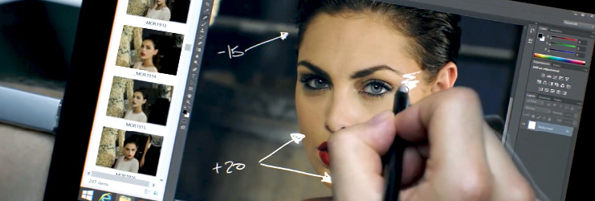
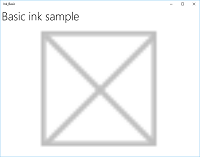
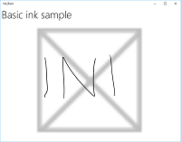
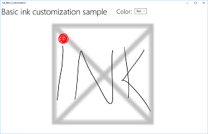
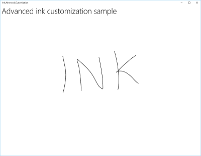
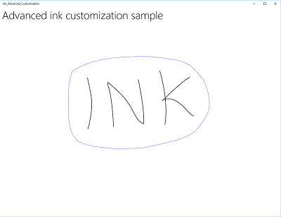

# Interações com caneta em aplicativos UWP

Otimize seu aplicativo da Plataforma Universal do Windows (UWP) para entrada de caneta para fornecer o recurso padrão [**dispositivo de ponteiro**](https://msdn.microsoft.com/library/windows/apps/br225633) e a melhor experiência com o Windows Ink para seus usuários.

> Observação: este tópico se concentra na plataforma Windows Ink. Consulte [Identificar entrada do ponteiro](handle-pointer-input.md) para manipulação de entrada de ponteiro geral (semelhante ao mouse, toque e touchpad).



**APIs importantes**

-   [**Windows.Devices.Input**](https://msdn.microsoft.com/library/windows/apps/br225648)
-   [**Windows.UI.Input.Inking**](https://msdn.microsoft.com/library/windows/apps/br208524)
-   [**Windows.UI.Input.Inking.Core**](https://msdn.microsoft.com/library/windows/apps/dn958452)

A plataforma Windows Ink, juntamente com um dispositivo de caneta, oferece uma maneira natural de criar anotações manuscritas digitais, desenhos e anotações. A plataforma dá suporte à captura de dados de tinta por entrada de digitalizador, gerenciamento e geração de dados de tinta, renderização desses dados como traços de tinta no dispositivo de saída e conversão de tinta em texto por meio do reconhecimento de manuscrito.

Além de capturar os movimentos e posições básicos da caneta enquanto o usuário escreve ou desenha, seu aplicativo também pode rastrear e coletar os diferentes valores de pressão usados em um traço. Essas informações, juntamente com configurações de formato da ponta da caneta, tamanho, rotação, cor da tinta, rotação e função (tinta simples, apagar, destacar e selecionar), permitem que você ofereça experiências ao usuário que se aproximam do ato de escrever ou desenhar em papel com caneta, lápis ou pincel.

**Observação**  Seu aplicativo também podem dar suporte à entrada de tinta de outros dispositivos com base em ponteiro, incluindo digitalizadores touch e mouses. 

A plataforma de tinta é muito flexível. Ele é projetado para dar suporte a vários níveis de funcionalidade, dependendo dos seus requisitos.

Há três componentes para a plataforma de tinta:

-   [
              **InkCanvas**
            ](https://msdn.microsoft.com/library/windows/apps/dn858535) - Controle de plataforma de interface do usuário XAML que, por padrão, recebe e exibe todas as entradas de uma caneta como traço de tinta ou de apagar.

-   [
              **InkPresenter**
            ](https://msdn.microsoft.com/library/windows/apps/dn922011) - Objeto de código-behind, instanciado juntamente com um controle [**InkCanvas**](https://msdn.microsoft.com/library/windows/apps/dn858535) (exposto através da propriedade [**InkCanvas.InkPresenter**](https://msdn.microsoft.com/library/windows/apps/dn899081)). Esse objeto fornece todas as funcionalidades de escrita à tinta expostas pelo **InkCanvas**, juntamente com um conjunto que compreende APIs de customização e personalização adicional.

-   [
              **IInkD2DRenderer**
            ](https://msdn.microsoft.com/library/mt147263) - Permite a renderização de traços de tinta para o contexto de dispositivo Direct2D designado de um aplicativo Universal do Windows, em vez do controle padrão [**InkCanvas**](https://msdn.microsoft.com/library/windows/apps/dn858535). Isso permite a personalização completa da experiência de escrita à tinta.

## <span id="inkcanvas"></span><span id="INKCANVAS"></span>Escrita à tinta básica com InkCanvas


Para funcionalidade básica de escrita à tinta, posicione um [**InkCanvas**](https://msdn.microsoft.com/library/windows/apps/dn858535) em qualquer lugar da página.

O [**InkCanvas**](https://msdn.microsoft.com/library/windows/apps/dn858535) dá suporte à entrada de tinta apenas de canetas. A entrada é renderizada como um traço de tinta usando configurações padrão de cor e espessura ou tratada como um traço de apagar (quando a entrada é da ponta de uma borracha ou da ponta da caneta modificada por um botão de apagar).

Neste exemplo, um [**InkCanvas**](https://msdn.microsoft.com/library/windows/apps/dn858535) sobrepõe uma imagem em segundo plano.

```XAML
<Grid Background="{ThemeResource ApplicationPageBackgroundThemeBrush}">
    <Grid.RowDefinitions>
        <RowDefinition Height="Auto"/>
        <RowDefinition Height="*"/>
    </Grid.RowDefinitions>
    <StackPanel x:Name="HeaderPanel" Orientation="Horizontal" Grid.Row="0">
        <TextBlock x:Name="Header" 
                   Text="Basic ink sample" 
                   Style="{ThemeResource HeaderTextBlockStyle}" 
                   Margin="10,0,0,0" />            
    </StackPanel>
    <Grid Grid.Row="1">
        <Image Source="Assets\StoreLogo.png" />
        <InkCanvas x:Name="inkCanvas" />
    </Grid>
</Grid>
```

Essa série de imagens mostra como entrada de caneta é renderizada por este controle [**InkCanvas**](https://msdn.microsoft.com/library/windows/apps/dn858535).

|  |  |  |
| --- | --- | ---|
| [
            **InkCanvas**](https://msdn.microsoft.com/library/windows/apps/dn858535) em branco com uma imagem de plano de fundo. | [
            **InkCanvas**](https://msdn.microsoft.com/library/windows/apps/dn858535) com traços de tinta. | O [ **InkCanvas** ](https://msdn.microsoft.com/library/windows/apps/dn858535) com um traço apagado (observe como apagar funciona em um traço inteiro, não uma parte). |

A funcionalidade de escrita à tinta com suporte do controle [**InkCanvas**](https://msdn.microsoft.com/library/windows/apps/dn858535) é fornecida por um objeto de código-behind chamado [**InkPresenter**](https://msdn.microsoft.com/library/windows/apps/dn922011).

Para escrita à tinta básica, você não precisa se preocupar com o [**InkPresenter**](https://msdn.microsoft.com/library/windows/apps/dn922011). Entretanto, para personalizar e configurar o comportamento de escrita à mão no [**InkCanvas**](https://msdn.microsoft.com/library/windows/apps/dn858535), você deve acessar o seu objeto correspondente **InkPresenter**.

## <span id="inkpresenter"></span><span id="INKPRESENTER"></span>Personalização básica com InkPresenter


Um objeto [**InkPresenter**](https://msdn.microsoft.com/library/windows/apps/dn922011) é instanciado com cada controle [**InkCanvas**](https://msdn.microsoft.com/library/windows/apps/dn858535).

Além de fornecer todos os comportamentos padrão de escrita à tinta do seu controle [**InkCanvas**](https://msdn.microsoft.com/library/windows/apps/dn858535) correspondente, o [**InkPresenter**](https://msdn.microsoft.com/library/windows/apps/dn922011) fornece um conjunto que compreende APIs para personalização adicional de traços. Isso inclui propriedades de traços, tipos de dispositivos de entrada com suporte e se a entrada é processada pelo objeto ou passada para o aplicativo.

**Observação**  
O [**InkPresenter**](https://msdn.microsoft.com/library/windows/apps/dn922011) não pode ser instanciado diretamente. Em vez disso, ele é acessado pela propriedade [**InkPresenter**](https://msdn.microsoft.com/library/windows/apps/dn899081) do [**InkCanvas**](https://msdn.microsoft.com/library/windows/apps/dn858535).

 

Aqui, configuramos o [**InkPresenter**](https://msdn.microsoft.com/library/windows/apps/dn899081) para interpretar dados de entrada da caneta e do mouse como traços de tinta. Também definimos alguns atributos iniciais de traço de tinta usados para renderizar traços para o [**InkCanvas**](https://msdn.microsoft.com/library/windows/apps/dn858535).

```CSharp
public MainPage()
{
    this.InitializeComponent();

    // Set supported inking device types.
    inkCanvas.InkPresenter.InputDeviceTypes = 
        Windows.UI.Core.CoreInputDeviceTypes.Mouse | 
        Windows.UI.Core.CoreInputDeviceTypes.Pen;

    // Set initial ink stroke attributes.
    InkDrawingAttributes drawingAttributes = new InkDrawingAttributes();
    drawingAttributes.Color = Windows.UI.Colors.Black;
    drawingAttributes.IgnorePressure = false;
    drawingAttributes.FitToCurve = true;
    inkCanvas.InkPresenter.UpdateDefaultDrawingAttributes(drawingAttributes);
}
```

Atributos de traço de tinta podem ser definidos dinamicamente para acomodar as preferências do usuário ou requisitos do aplicativo.

Aqui, permitimos que um usuário escolha suas preferências em uma lista de cores de tinta.

```XAML
<Grid Background="{ThemeResource ApplicationPageBackgroundThemeBrush}">
    <Grid.RowDefinitions>
        <RowDefinition Height="Auto"/>
        <RowDefinition Height="*"/>
    </Grid.RowDefinitions>
    <StackPanel x:Name="HeaderPanel" Orientation="Horizontal" Grid.Row="0">
        <TextBlock x:Name="Header" 
                   Text="Basic ink customization sample" 
                   VerticalAlignment="Center"
                   Style="{ThemeResource HeaderTextBlockStyle}" 
                   Margin="10,0,0,0" />
        <TextBlock Text="Color:"
                   Style="{StaticResource SubheaderTextBlockStyle}"
                   VerticalAlignment="Center"
                   Margin="50,0,10,0"/>
        <ComboBox x:Name="PenColor"
                  VerticalAlignment="Center"
                  SelectedIndex="0"
                  SelectionChanged="OnPenColorChanged">
            <ComboBoxItem Content="Black"/>
            <ComboBoxItem Content="Red"/>
        </ComboBox>
    </StackPanel>
    <Grid Grid.Row="1">
        <Image Source="Assets\StoreLogo.png" />
        <InkCanvas x:Name="inkCanvas" />
    </Grid>
</Grid>
```

Em seguida, manipulamos as alterações feitas na cor selecionada e atualizamos os atributos de traço de tinta de acordo.

```CSharp
// Update ink stroke color for new strokes.
private void OnPenColorChanged(object sender, SelectionChangedEventArgs e)
{
    if (inkCanvas != null)
    {
        InkDrawingAttributes drawingAttributes = 
            inkCanvas.InkPresenter.CopyDefaultDrawingAttributes();

        string value = ((ComboBoxItem)PenColor.SelectedItem).Content.ToString();

        switch (value)
        {
            case "Black":
                drawingAttributes.Color = Windows.UI.Colors.Black;
                break;
            case "Red":
                drawingAttributes.Color = Windows.UI.Colors.Red;
                break;
            default:
                drawingAttributes.Color = Windows.UI.Colors.Black;
                break;
        };

        inkCanvas.InkPresenter.UpdateDefaultDrawingAttributes(drawingAttributes);
    }
}
```

Estas imagens mostram como a entrada de caneta é processada e personalizada pelo [**InkPresenter**](https://msdn.microsoft.com/library/windows/apps/dn899081).

|  |  |
| --- | -- |
| O [**InkCanvas**](https://msdn.microsoft.com/library/windows/apps/dn858535) com traços de tinta preta padrão. | O [**InkCanvas**](https://msdn.microsoft.com/library/windows/apps/dn858535) com traços de tinta vermelha selecionados pelo usuário. |

 

Para oferecer funcionalidades além de escrever à tinta e apagar, como seleção de traço, seu aplicativo deve identificar entrada específica para o [**InkPresenter**](https://msdn.microsoft.com/library/windows/apps/dn899081) passar por não processado por manipular pelo seu aplicativo.

## <span id="passthrough"></span><span id="PASSTHROUGH"></span>Entrada de passagem para processamento avançado


Por padrão, o [**InkPresenter**](https://msdn.microsoft.com/library/windows/apps/dn899081) processa todas as entradas como traço de tinta ou de apagar. Isso inclui entrada modificada por funcionalidade secundária de hardware, como botão de caneta, botão direito do mouse e afins.

Ao usar essas funcionalidades secundárias, os usuários normalmente esperam algumas funcionalidades adicionais ou um comportamento modificado.

Em alguns casos, talvez seja necessário expor a funcionalidade básica de tinta para canetas sem funcionalidades secundárias (funcionalidade geralmente não associada à ponta da caneta), outros tipos de dispositivos de entrada, ou funcionalidade adicional de entrada, ou comportamento modificado, com base na seleção de um usuário na interface do usuário do seu aplicativo.

Para dar suporte a isso, [**InkPresenter**](https://msdn.microsoft.com/library/windows/apps/dn899081) pode ser configurado para deixar uma entrada específica não processada. Essa entrada não processada é, então, passada pelo seu aplicativo para processamento.

As etapas de exemplo de código a seguir mostram como habilitar a seleção de traço quando a entrada é modificada com um botão de caneta (ou o botão direito do mouse).

Para este exemplo, usamos os arquivos MainPage.xaml e MainPage.xaml.cs para hospedar todo o código.

1.  Primeiro, definimos a interface do usuário em MainPage.xaml.

    Aqui, adicionados uma tela (abaixo do [**InkCanvas**](https://msdn.microsoft.com/library/windows/apps/dn858535)) para desenhar o traço de seleção. Usar uma camada separada para desenhar o traço de seleção deixa o **InkCanvas** e seu conteúdo intocado.

    
```    XAML
<Grid Background="{ThemeResource ApplicationPageBackgroundThemeBrush}">
        <Grid.RowDefinitions>
            <RowDefinition Height="Auto"/>
            <RowDefinition Height="*"/>
        </Grid.RowDefinitions>
        <StackPanel x:Name="HeaderPanel" Orientation="Horizontal" Grid.Row="0">
            <TextBlock x:Name="Header" 
                       Text="Advanced ink customization sample" 
                       VerticalAlignment="Center"
                       Style="{ThemeResource HeaderTextBlockStyle}" 
                       Margin="10,0,0,0" />
        </StackPanel>
        <Grid Grid.Row="1">
            <!-- Canvas for displaying selection UI. -->
            <Canvas x:Name="selectionCanvas"/>
            <!-- Inking area -->
            <InkCanvas x:Name="inkCanvas"/>
        </Grid>
    </Grid>
```

2.  Em MainPage.xaml.cs, declaramos algumas variáveis globais para manter como referência em aspectos da seleção da IU. Especificamente, a seleção de traço de Laço e o retângulo delimitador que destaca os traços selecionados.
```    CSharp
// Stroke selection tool.
    private Polyline lasso;
    // Stroke selection area.
    private Rect boundingRect;
```

3.  Em seguida, configuramos o [**InkPresenter**](https://msdn.microsoft.com/library/windows/apps/dn899081) para interpretar dados de entrada tanto da caneta quanto do mouse como traços de tinta, e definimos alguns atributos iniciais de traço de tinta usados para renderizar traços para o [**InkCanvas**](https://msdn.microsoft.com/library/windows/apps/dn858535).

    E, o mais importante, usamos a propriedade [**InputProcessingConfiguration**](https://msdn.microsoft.com/library/windows/apps/dn948764) do [**InkPresenter**](https://msdn.microsoft.com/library/windows/apps/dn899081) para indicar que qualquer entrada modificada deve ser processada pelo aplicativo. A entrada modificada é especificada atribuindo a **InputProcessingConfiguration.RightDragAction** um valor de [**InkInputRightDragAction.LeaveUnprocessed**](https://msdn.microsoft.com/library/windows/apps/dn948760).

    Então, atribuímos ouvintes para os eventos [**PointerPressed**](https://msdn.microsoft.com/library/windows/apps/dn914712), [**PointerMoved**](https://msdn.microsoft.com/library/windows/apps/dn914711) e [**PointerReleased**](https://msdn.microsoft.com/library/windows/apps/dn914713) não processados passados pelo [**InkPresenter**](https://msdn.microsoft.com/library/windows/apps/dn899081). Todas as funcionalidades de seleção são implementadas nos manipuladores para esses eventos.

    Por fim, atribuímos ouvintes para os eventos [**StrokeStarted**](https://msdn.microsoft.com/library/windows/apps/dn914702) e [**StrokesErased**](https://msdn.microsoft.com/library/windows/apps/dn948767) do [**InkPresenter**](https://msdn.microsoft.com/library/windows/apps/dn899081). Usamos os manipuladores para esses limparem a seleção da interface do usuário se um novo traço for iniciado ou um traço existente for apagado.

    
```    CSharp
public MainPage()
    {
        this.InitializeComponent();

        // Set supported inking device types.
        inkCanvas.InkPresenter.InputDeviceTypes =
            Windows.UI.Core.CoreInputDeviceTypes.Mouse |
            Windows.UI.Core.CoreInputDeviceTypes.Pen;

        // Set initial ink stroke attributes.
        InkDrawingAttributes drawingAttributes = new InkDrawingAttributes();
        drawingAttributes.Color = Windows.UI.Colors.Black;
        drawingAttributes.IgnorePressure = false;
        drawingAttributes.FitToCurve = true;
        inkCanvas.InkPresenter.UpdateDefaultDrawingAttributes(drawingAttributes);

        // By default, the InkPresenter processes input modified by 
        // a secondary affordance (pen barrel button, right mouse 
        // button, or similar) as ink.
        // To pass through modified input to the app for custom processing 
        // on the app UI thread instead of the background ink thread, set 
        // InputProcessingConfiguration.RightDragAction to LeaveUnprocessed.
        inkCanvas.InkPresenter.InputProcessingConfiguration.RightDragAction = 
            InkInputRightDragAction.LeaveUnprocessed;

        // Listen for unprocessed pointer events from modified input.
        // The input is used to provide selection functionality.
        inkCanvas.InkPresenter.UnprocessedInput.PointerPressed += 
            UnprocessedInput_PointerPressed;
        inkCanvas.InkPresenter.UnprocessedInput.PointerMoved += 
            UnprocessedInput_PointerMoved;
        inkCanvas.InkPresenter.UnprocessedInput.PointerReleased += 
            UnprocessedInput_PointerReleased;

        // Listen for new ink or erase strokes to clean up selection UI.
        inkCanvas.InkPresenter.StrokeInput.StrokeStarted += 
            StrokeInput_StrokeStarted;
        inkCanvas.InkPresenter.StrokesErased += 
            InkPresenter_StrokesErased;
    }
```

4.  Então, definimos manipuladores para os eventos [**PointerPressed**](https://msdn.microsoft.com/library/windows/apps/dn914712), [**PointerMoved**](https://msdn.microsoft.com/library/windows/apps/dn914711) e [**PointerReleased**](https://msdn.microsoft.com/library/windows/apps/dn914713) não processados passados pelo [**InkPresenter**](https://msdn.microsoft.com/library/windows/apps/dn899081).

    Todas as funcionalidades de seleção são implementadas nesses manipuladores, incluindo o traço de Laço e o retângulo delimitador.

    
```    CSharp
// Handle unprocessed pointer events from modifed input.
    // The input is used to provide selection functionality.
    // Selection UI is drawn on a canvas under the InkCanvas.
    private void UnprocessedInput_PointerPressed(
        InkUnprocessedInput sender, PointerEventArgs args)
    {
        // Initialize a selection lasso.
        lasso = new Polyline()
        {
            Stroke = new SolidColorBrush(Windows.UI.Colors.Blue),
            StrokeThickness = 1,
            StrokeDashArray = new DoubleCollection() { 5, 2 },
        };

        lasso.Points.Add(args.CurrentPoint.RawPosition);

        selectionCanvas.Children.Add(lasso);
    }

    private void UnprocessedInput_PointerMoved(
        InkUnprocessedInput sender, PointerEventArgs args)
    {
        // Add a point to the lasso Polyline object.
        lasso.Points.Add(args.CurrentPoint.RawPosition);
    }

    private void UnprocessedInput_PointerReleased(
        InkUnprocessedInput sender, PointerEventArgs args)
    {
        // Add the final point to the Polyline object and 
        // select strokes within the lasso area.
        // Draw a bounding box on the selection canvas 
        // around the selected ink strokes.
        lasso.Points.Add(args.CurrentPoint.RawPosition);

        boundingRect = 
            inkCanvas.InkPresenter.StrokeContainer.SelectWithPolyLine(
                lasso.Points);

        DrawBoundingRect();
    }
```

5.  Para concluir o manipulador de eventos PointerReleased, podemos limpar a camada de seleção de todo o conteúdo (o traço de Laço) e desenhar um retângulo delimitador único ao redor dos traços de tinta circundados pela área de Laço.

    
```    CSharp
// Draw a bounding rectangle, on the selection canvas, encompassing 
    // all ink strokes within the lasso area.
    private void DrawBoundingRect()
    {
        // Clear all existing content from the selection canvas.
        selectionCanvas.Children.Clear();

        // Draw a bounding rectangle only if there are ink strokes 
        // within the lasso area.
        if (!((boundingRect.Width == 0) || 
            (boundingRect.Height == 0) || 
            boundingRect.IsEmpty))
        {
            var rectangle = new Rectangle()
            {
                Stroke = new SolidColorBrush(Windows.UI.Colors.Blue),
                StrokeThickness = 1,
                StrokeDashArray = new DoubleCollection() { 5, 2 },
                Width = boundingRect.Width,
                Height = boundingRect.Height
            };

            Canvas.SetLeft(rectangle, boundingRect.X);
            Canvas.SetTop(rectangle, boundingRect.Y);

            selectionCanvas.Children.Add(rectangle);
        }
    }
```

6.  Por fim, definimos manipuladores para os eventos [**StrokeStarted**](https://msdn.microsoft.com/library/windows/apps/dn914702) e [**StrokesErased**](https://msdn.microsoft.com/library/windows/apps/dn948767) do InkPresenter.

    Esses dois chamam a mesma função de limpeza para limpar a seleção atual sempre que um novo traço é detectado.
```    CSharp
// Handle new ink or erase strokes to clean up selection UI.
    private void StrokeInput_StrokeStarted(
        InkStrokeInput sender, Windows.UI.Core.PointerEventArgs args)
    {
        ClearSelection();
    }

    private void InkPresenter_StrokesErased(
        InkPresenter sender, InkStrokesErasedEventArgs args)
    {
        ClearSelection();
    }
```

7.  Consulte a função para remover toda a interface do usuário de seleção da tela de seleção quando um novo traço for iniciado ou um traço existente for apagado.
```    CSharp
// Clean up selection UI.
    private void ClearSelection()
    {
        var strokes = inkCanvas.InkPresenter.StrokeContainer.GetStrokes();
        foreach (var stroke in strokes)
        {
            stroke.Selected = false;
        }
        ClearDrawnBoundingRect();
    }

    private void ClearDrawnBoundingRect()
    {
        if (selectionCanvas.Children.Any())
        {
            selectionCanvas.Children.Clear();
            boundingRect = Rect.Empty;
        }
    }
```

## <span id="iinkd2drenderer"></span><span id="IINKD2DRENDERER"></span>Renderização de tinta personalizada


Por padrão, a entrada de tinta é processada em um thread em segundo plano e renderizada como "molhada" conforme é desenhada. Quando o traço está concluído (caneta ou dedo param de pressionar ou botão do mouse é liberado), o traço é processado do thread de interface do usuário e renderizado como "seco" na camada [**InkCanvas**](https://msdn.microsoft.com/library/windows/apps/dn858535) (acima do conteúdo do aplicativo e substituindo a tinta molhada).

A plataforma de tinta permite substituir esse comportamento e personalizar completamente a experiência de escrita à tinta secando de forma personalizada a entrada de tinta.

Secar de forma personalizada exige que um objeto [**IInkD2DRenderer**](https://msdn.microsoft.com/library/mt147263) gerencie a entrada de tinta e a renderize para o contexto de dispositivo Direct2D do seu aplicativo Universal do Windows, em vez de o controle padrão [**InkCanvas**](https://msdn.microsoft.com/library/windows/apps/dn858535).

Chamar [**ActivateCustomDrying**](https://msdn.microsoft.com/library/windows/apps/dn922012) (antes de o [**InkCanvas**](https://msdn.microsoft.com/library/windows/apps/dn858535) ser carregado) faz com que um aplicativo crie um objeto [**InkSynchronizer**](https://msdn.microsoft.com/library/windows/apps/dn903979) para personalizar como um traço de tinta é renderizado como seco para um [**SurfaceImageSource**](https://msdn.microsoft.com/library/windows/apps/hh702041) ou [**VirtualSurfaceImageSource**](https://msdn.microsoft.com/library/windows/apps/hh702050). Por exemplo, um traço de tinta poderia ser rasterizado e integrado no conteúdo de um aplicativo em vez de uma camada **InkCanvas** separada.

Para ver um exemplo completo dessa funcionalidade, consulte [Amostra de tinta complexa](http://go.microsoft.com/fwlink/p/?LinkID=620314).


## Outros artigos nesta seção 
<table>
<colgroup>
<col width="50%" />
<col width="50%" />
</colgroup>
<thead>
<tr class="header">
<th align="left">Tópico</th>
<th align="left">Descrição</th>
</tr>
</thead>
<tbody>
<tr class="odd">
<td align="left"><p>[Reconhecer traços de tinta](convert-ink-to-text.md)</p></td>
<td align="left"><p>Converta traços de tinta em texto usando o reconhecimento de manuscrito, ou em formas usando o reconhecimento personalizado.</p></td>
</tr>
<tr class="even">
<td align="left"><p>[Armazenar e recuperar traços de tinta](save-and-load-ink.md)</p></td>
<td align="left"><p>Armazene dados de traço de tinta em um arquivo Graphics Interchange Format (GIF) usando metadados incorporados Ink Serialized Format (ISF).</p></td>
</tr>
</tbody>
</table>

 


## <span id="related_topics"></span>Artigos relacionados


* [Manipular entrada do ponteiro](handle-pointer-input.md)
* [Identificar dispositivos de entrada](identify-input-devices.md)

**Exemplos**
* [Amostra de tinta](http://go.microsoft.com/fwlink/p/?LinkID=620308)
* [Amostra de tinta simples](http://go.microsoft.com/fwlink/p/?LinkID=620312)
* [Amostra de tinta complexa](http://go.microsoft.com/fwlink/p/?LinkID=620314)
* [Amostra de entrada básica](http://go.microsoft.com/fwlink/p/?LinkID=620302)
* [Amostra de entrada de baixa latência](http://go.microsoft.com/fwlink/p/?LinkID=620304)
* [Amostra do modo de interação do usuário](http://go.microsoft.com/fwlink/p/?LinkID=619894)
* [Amostra de elementos visuais do foco](http://go.microsoft.com/fwlink/p/?LinkID=619895)

**Exemplos de arquivo morto**
* [Entrada: amostra de funcionalidades do dispositivo](http://go.microsoft.com/fwlink/p/?linkid=231530)
* [Entrada: amostra de eventos de entrada do usuário XAML](http://go.microsoft.com/fwlink/p/?linkid=226855)
* [Amostra de rolagem, movimento panorâmico e aplicação de zoom em XAML](http://go.microsoft.com/fwlink/p/?linkid=251717)
* [Entrada: gestos e interações com o GestureRecognizer](http://go.microsoft.com/fwlink/p/?LinkID=231605)
 

 


<!--HONumber=Jun16_HO3-->


