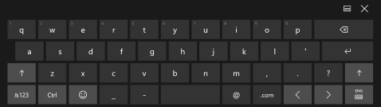
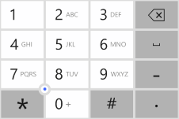
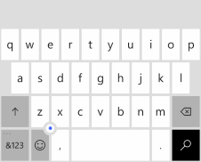
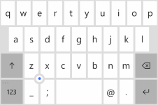

# Usar o escopo de entrada para alterar o teclado virtual

Para ajudar os usuários a inserir dados usando o teclado virtual ou SIP (Soft Input Panel), você pode configurar o escopo de entrada do controle de texto para corresponder ao tipo de dado que se espera que o usuário insira.

**APIs importantes**

-   [**InputScope**](https://msdn.microsoft.com/library/windows/apps/hh702632)
-   [**InputScopeNameValue**](https://msdn.microsoft.com/library/windows/apps/hh702028)


O teclado virtual pode ser usado para entrada de texto, quando o aplicativo é executado em um dispositivo com tela sensível ao toque. O teclado virtual é invocado quando o usuário toca em um campo de entrada editável, como um [**TextBox**](https://msdn.microsoft.com/library/windows/apps/br209683) ou um [**RichEditBox**](https://msdn.microsoft.com/library/windows/apps/br227548). Você pode tornar a entrada de dados muito mais rápida e fácil para os usuários em seu aplicativo definindo o *escopo de entrada* do controle de texto para corresponder ao tipo de dados que o usuário deve inserir. O escopo de entrada oferece uma dica para o sistema sobre o tipo de entrada de texto esperado pelo controle, para que o sistema possa fornecer um layout de teclado virtual especializado para o tipo de entrada.

Por exemplo, se uma caixa de texto for usada somente para a inserção de um PIN de 4 dígitos, defina a propriedade [**InputScope**](https://msdn.microsoft.com/library/windows/apps/hh702632) como **Number**. Isso informa o sistema para mostrar o layout do teclado numérico, facilitando a inserção do PIN.

> **Importante**&nbsp;&nbsp;
- Essas informações se aplicam somente ao SIP. Elas não se aplicam a teclados de hardware nem ao Teclado Virtual disponível nas opções de Facilidade de Acesso do Windows.
- O escopo de entrada não faz com que qualquer validação de entrada seja executada, e não impede que o usuário forneça qualquer entrada por meio de um teclado de hardware ou de outro dispositivo de entrada. Você ainda é o responsável pela validação da entrada em seu código, conforme necessário.

## Alterando o escopo de entrada de um controle de texto

Os escopos de entrada disponíveis para seu aplicativo são membros da enumeração [**InputScopeNameValue**](https://msdn.microsoft.com/library/windows/apps/hh702028). Você pode definir a propriedade **InputScope** de uma [**TextBox**](https://msdn.microsoft.com/library/windows/apps/br209683) ou [**RichEditBox**](https://msdn.microsoft.com/library/windows/apps/br227548) para um desses valores.

> **Importante**&nbsp;&nbsp;A propriedade [**InputScope**](https://msdn.microsoft.com/library/windows/apps/dn996570) em [**PasswordBox**](https://msdn.microsoft.com/library/windows/apps/br227519) dá suporte apenas aos valores **Password** e **NumericPin**. Qualquer outro valor é ignorado.

Aqui, você altera o escopo de entrada de várias caixas de texto para corresponder aos dados esperados para cada caixa de texto.

**Para alterar o escopo de entrada em XAML**

1.  No arquivo XAML para sua página, localize a marca para o controle de texto que você deseja alterar.
2.  Adicione o atributo [**InputScope**](https://msdn.microsoft.com/library/windows/apps/hh702632) ao sinalizador e especifique o valor [**InputScopeNameValue**](https://msdn.microsoft.com/library/windows/apps/hh702028) que corresponde à entrada esperada.

    Aqui estão algumas caixas de texto que podem aparecer em um formulário comum de contato com o cliente. Com o [**InputScope**](https://msdn.microsoft.com/library/windows/apps/hh702632) definido, um teclado de toque com um layout adequado para os dados aparece para cada caixa de texto.

    ```xaml
    <StackPanel Width="300">
        <TextBox Header="Name" InputScope="Default"/>
        <TextBox Header="Email Address" InputScope="EmailSmtpAddress"/>
        <TextBox Header="Telephone Number" InputScope="TelephoneNumber"/>
        <TextBox Header="Web site" InputScope="Url"/>
    </StackPanel>
    ```

**Para alterar o escopo de entrada no código**

1.  No arquivo XAML para sua página, localize a marca para o controle de texto que você deseja alterar. Se não estiver definido, defina o [atributo x:Name](https://msdn.microsoft.com/library/windows/apps/mt204788) para poder referenciar o controle no seu código.

    ```csharp
    <TextBox Header="Telephone Number" x:Name="phoneNumberTextBox"/>
    ```

2.  Instancie um novo objeto [**InputScope**](https://msdn.microsoft.com/library/windows/apps/hh702025).

    ```csharp
    InputScope scope = new InputScope();
    ```

3.  Crie uma instância de um novo objeto [**InputScopeName**](https://msdn.microsoft.com/library/windows/apps/hh702027).
    
    ```csharp
    InputScopeName scopeName = new InputScopeName();
    ```

4.  Defina a propriedade [**NameValue**](https://msdn.microsoft.com/library/windows/apps/hh702032) do objeto [**InputScopeName**](https://msdn.microsoft.com/library/windows/apps/hh702027) como um valor da enumeração [**InputScopeNameValue**](https://msdn.microsoft.com/library/windows/apps/hh702028).

    ```csharp
    scopeName.NameValue = InputScopeNameValue.TelephoneNumber;
    ```

5.  Adicione o objeto [**InputScopeName**](https://msdn.microsoft.com/library/windows/apps/hh702027) à coleção [**Names**](https://msdn.microsoft.com/library/windows/apps/hh702034) do objeto [**InputScope**](https://msdn.microsoft.com/library/windows/apps/hh702025).

    ```csharp
    scope.Names.Add(scopeName);
    ```

6.  Defina o objeto [**InputScope**](https://msdn.microsoft.com/library/windows/apps/hh702025) como o valor da propriedade [**InputScope**](https://msdn.microsoft.com/library/windows/apps/hh702632) do controle de texto.

    ```csharp
    phoneNumberTextBox.InputScope = scope;
    ```

Aqui está o código completo.

```CSharp
InputScope scope = new InputScope();
InputScopeName scopeName = new InputScopeName();
scopeName.NameValue = InputScopeNameValue.TelephoneNumber;
scope.Names.Add(scopeName);
phoneNumberTextBox.InputScope = scope;
```

As mesmas etapas podem ser condensadas neste código resumido.

```CSharp
phoneNumberTextBox.InputScope = new InputScope() 
{
    Names = {new InputScopeName(InputScopeNameValue.TelephoneNumber)}
};
```

## Previsão de texto, verificação ortográfica e correção automática

Os controles [**TextBox**](https://msdn.microsoft.com/library/windows/apps/br209683) e [**RichEditBox**](https://msdn.microsoft.com/library/windows/apps/br227548) têm várias propriedades que influenciam o comportamento do SIP. Para fornecer a melhor experiência para seus usuários, é importante entender como essas propriedades afetam a entrada de texto usando toque.

-   [**IsSpellCheckEnabled**](https://msdn.microsoft.com/library/windows/apps/br209688)— Quando a verificação ortográfica está habilitada para um controle de texto, o controle interage com o mecanismo de verificação ortográfica do sistema para marcar palavras não reconhecidas. Você pode tocar em uma palavra para ver uma lista de correções sugeridas. A verificação ortográfica é habilitada por padrão.

    Para o escopo de entrada **Default**, essa propriedade também habilita o uso automático de maiúsculas da primeira palavra em uma frase e a correção automática das palavras conforme você digita. Esses recursos de correção automática podem estar desabilitados em outros escopos de entrada. Para saber mais, consulte as tabelas mais adiante neste tópico.

-   [**IsTextPredictionEnabled**](https://msdn.microsoft.com/library/windows/apps/br209690) — Quando a previsão de texto está habilitada para um controle de texto, o sistema mostra uma lista de palavras que você pode estar começando a digitar. Você pode selecionar na lista para não precisar digitar a palavra inteira. A previsão de texto é habilitada por padrão.

    A previsão de texto poderá estar desabilitada se o escopo de entrada for diferente de **Default**, mesmo se a propriedade [**IsTextPredictionEnabled**](https://msdn.microsoft.com/library/windows/apps/br209690) for **true**. Para saber mais, consulte as tabelas mais adiante neste tópico.

    **Observação**&nbsp;&nbsp;Na família de dispositivos móveis, as previsões de texto e as correções ortográficas são mostradas no SIP na área acima do teclado. Se [**IsTextPredictionEnabled**](https://msdn.microsoft.com/library/windows/apps/br209690) for definido como **false**, essa parte do SIP ficará oculta e a correção automática estará desabilitada, mesmo se [**IsSpellCheckEnabled**](https://msdn.microsoft.com/library/windows/apps/br209688) for **true**.

-   [**PreventKeyboardDisplayOnProgrammaticFocus**](https://msdn.microsoft.com/library/windows/apps/dn299273) — Quando essa propriedade for **true**, impedirá que o sistema mostre o SIP quando o foco for definido programaticamente em um controle de texto. Em vez disso, o teclado só será mostrado quando o usuário interagir com o controle.

## Índice de teclado virtual para o Windows e o Windows Phone

Estas tabelas mostram os layouts do SIP (Soft Input Panel) em dispositivos móveis e desktops para valores de escopo de entrada comuns. O efeito do escopo de entrada sobre os recursos habilitados pelas propriedades **IsSpellCheckEnabled** e **IsTextPredictionEnabled** é listado para cada escopo de entrada. Esta não é uma lista abrangente de escopos de entrada disponíveis.

> **Observação**&nbsp;&nbsp;O tamanho menor do SIP em dispositivos móveis faz com que seja particularmente importante para os aplicativos móveis que você defina o escopo de entrada correto. Como mostramos aqui, o Windows Phone fornece uma variedade maior de layouts de teclado especializados. Um campo de texto que não precisa ter seu escopo de entrada definido em um aplicativo da Windows Store pode se beneficiar de tê-lo definido em um aplicativo da Loja do Windows Phone.

> **Dica**&nbsp;&nbsp;Você pode alternar a maioria dos teclados virtuais entre um layout alfabético e um layout de números e símbolos. No Windows, alterne a tecla **&123**. No Windows Phone, pressione a tecla **&123** para mudar para o layout de números e símbolos e pressione a tecla **abcd** para mudar para o layout alfabético.

### Padrão

`<TextBox InputScope="Default"/>`

O teclado padrão.

| Windows                                                    | Windows Phone                                                    |
|------------------------------------------------------------|------------------------------------------------------------------|
|  |  |

Disponibilidade de recursos:

-   Verificação ortográfica: habilitada se **IsSpellCheckEnabled** = **true**, desabilitada se **IsSpellCheckEnabled** = **false**
-   Correção automática: habilitada se **IsSpellCheckEnabled** = **true**, desabilitada se **IsSpellCheckEnabled** = **false**
-   Uso automático de maiúsculas: habilitado se **IsSpellCheckEnabled** = **true**, desabilitado se **IsSpellCheckEnabled** = **false**
-   Previsão de texto: habilitada se **IsTextPredictionEnabled** = **true**, desabilitada se **IsTextPredictionEnabled** = **false**

### CurrencyAmountAndSymbol

`<TextBox InputScope="CurrencyAmountAndSymbol"/>`

O layout de teclado padrão de números e símbolos.

| Windows                                                    | Windows Phone                                                    |
|------------------------------------------------------------|------------------------------------------------------------------|
| <br>Também inclui as teclas esquerda/direita da página para mostrar mais símbolos.|  |
|Disponibilidade de recursos:<ul><li>Verificação ortográfica: ativada por padrão, pode ser desabilitada</li><li>Correção automática: sempre desabilitada</li><li>Uso automático de maiúsculas: sempre desabilitada</li><li>Previsão de texto: sempre desabilitada</li></ul>Mesmo que **Number** e **TelephoneNumber**. | Disponibilidade de recursos:<ul><li>Verificação ortográfica: ativada por padrão, pode ser desabilitada</li><li>Correção automática: ativada por padrão, pode ser desabilitada</li><li>Uso automático de maiúsculas: sempre desabilitada</li><li>Previsão de texto: ativada por padrão, pode ser desabilitada</li>| 

### Url

`<TextBox InputScope="Url"/>`

Inclui as teclas **.com** e  (Ir). Pressione e segure a tecla **.com** para exibir opções adicionais (**. org**, **.net** e sufixos específicos à região).

| Windows                                                    | Windows Phone                                                    |
|------------------------------------------------------------|------------------------------------------------------------------|
| <br>Também inclui as teclas **:**, **-** e **/**.| <br>Pressione e segure a tecla de ponto para exibir opções adicionais ( - + &quot; / &amp; : , ). |
|Disponibilidade de recursos:<ul><li>Verificação ortográfica: ativada por padrão, pode ser desabilitada</li><li>Correção automática: ativada por padrão, pode ser desabilitada</li><li>Uso automático de maiúsculas: sempre desabilitada</li><li>Previsão de texto: sempre desabilitada</li></ul> | Disponibilidade de recursos:<ul><li>Verificação ortográfica: desativada por padrão, pode ser habilitada</li><li>Correção automática: desativada por padrão, pode ser habilitada</li><li>Capitalização automática: desativada por padrão, pode ser habilitada</li><li>Previsão de texto: desativada por padrão, pode ser habilitada</li></ul> |

### EmailSmtpAddress

`<TextBox InputScope="EmailSmtpAddress"/>`

Inclui as teclas **@** e **.com**. Pressione e segure a tecla **.com** para exibir opções adicionais (**. org**, **.net** e sufixos específicos à região).

| Windows                                                    | Windows Phone                                                    |
|------------------------------------------------------------|------------------------------------------------------------------|
| <br>Também inclui as teclas **_** e **-**.| <br>Pressione e segure a tecla de ponto para exibir opções adicionais ( - _ , ; ). |
|Disponibilidade de recursos:<ul><li>Verificação ortográfica: ativada por padrão, pode ser desabilitada</li><li>Correção automática: ativada por padrão, pode ser desabilitada</li><li>Uso automático de maiúsculas: sempre desabilitada</li><li>Previsão de texto: sempre desabilitada</li></ul> | Disponibilidade de recursos:<ul><li>Verificação ortográfica: desativada por padrão, pode ser habilitada</li><li>Correção automática: desativada por padrão, pode ser habilitada</li><li>Capitalização automática: desativada por padrão, pode ser habilitada</li><li>Previsão de texto: desativada por padrão, pode ser habilitada</li></ul> |

### Número

`<TextBox InputScope="Number"/>`

| Windows                                                    | Windows Phone                                                    |
|------------------------------------------------------------|------------------------------------------------------------------|
| | <br>O teclado contém números e um ponto decimal. Pressione e segure a tecla de ponto decimal para exibir opções adicionais ( , - ). |
|Mesmo que **CurrencyAmountAndSymbol** e **TelephoneNumber**. | Disponibilidade de recursos:<ul><li>Verificação ortográfica: sempre desabilitada</li><li>Correção automática: sempre desabilitada</li><li>Capitalização automática: sempre desabilitada</li><li>Previsão de texto: sempre desabilitada</li></ul> |

### TelephoneNumber

`<TextBox InputScope="TelephoneNumber"/>`

| Windows                                                    | Windows Phone                                                    |
|------------------------------------------------------------|------------------------------------------------------------------|
| | <br>O teclado imita o teclado do telefone. Pressione e segure a tecla de ponto para exibir opções adicionais ( , ( ) X. ). Pressione e segure a tecla 0 para inserir +. |
|Mesmo que **CurrencyAmountAndSymbol** e **TelephoneNumber**. | Disponibilidade de recursos:<ul><li>Verificação ortográfica: sempre desabilitada</li><li>Correção automática: sempre desabilitada</li><li>Capitalização automática: sempre desabilitada</li><li>Previsão de texto: sempre desabilitada</li></ul> |

### Pesquisar

`<TextBox InputScope="Search"/>`

Inclui a tecla **Pesquisa**, em vez da tecla **Enter**.

| Windows                                                    | Windows Phone                                                    |
|------------------------------------------------------------|------------------------------------------------------------------|
| | |
|Disponibilidade de recursos:<ul><li>Verificação ortográfica: ativada por padrão, pode ser desabilitada</li><li>Correção automática: sempre desabilitada</li><li>Uso automático de maiúsculas: sempre desabilitada</li><li>Previsão de texto: ativada por padrão, pode ser desabilitada</li></ul> | Disponibilidade de recursos:<ul><li>Verificação ortográfica: ativada por padrão, pode ser desabilitada</li><li>Correção automática: ativada por padrão, pode ser desabilitada</li><li>Capitalização automática: sempre desabilitada</li><li>Previsão de texto: ativada por padrão, pode ser desabilitada</li></ul> |

### SearchIncremental

`<TextBox InputScope="SearchIncremental"/>`

| Windows                                                    | Windows Phone                                                    |
|------------------------------------------------------------|------------------------------------------------------------------|
| <br>Layout igual a **Padrão**.| |
|Disponibilidade de recursos:<ul><li>Verificação ortográfica: desativada por padrão, pode ser habilitada</li><li>Correção automática: sempre desabilitada</li><li>Uso automático de maiúsculas: sempre desabilitada</li><li>Previsão de texto: sempre desabilitada</li></ul> | Mesmo que **Padrão**. |

### Fórmula

`<TextBox InputScope="Formula"/>`

Inclui a tecla **=**.

| Windows                                                    | Windows Phone                                                    |
|------------------------------------------------------------|------------------------------------------------------------------|
| <br>Também inclui as teclas **%**, **$** e **+**.| <br>Pressione e segure a tecla de ponto para exibir opções adicionais ( - ! ? , ). Pressione e segure a tecla **=** para exibir opções adicionais ( ( ) : &lt; &gt; ). |
|Disponibilidade de recursos:<ul><li>Verificação ortográfica: desativada por padrão, pode ser habilitada</li><li>Correção automática: sempre desabilitada</li><li>Uso automático de maiúsculas: sempre desabilitada</li><li>Previsão de texto: sempre desabilitada</li></ul> | Disponibilidade de recursos:<ul><li>Verificação ortográfica: ativada por padrão, pode ser desabilitada</li><li>Correção automática: ativada por padrão, pode ser desabilitada</li><li>Capitalização automática: sempre desabilitada</li><li>Previsão de texto: ativada por padrão, pode ser desabilitada</li></ul> |

### Chat

`<TextBox InputScope="Chat"/>`

| Windows                                                    | Windows Phone                                                    |
|------------------------------------------------------------|------------------------------------------------------------------|
| <br>Layout igual a **Padrão**.| <br>Layout igual a **Padrão**.|
|Disponibilidade de recursos:<ul><li>Verificação ortográfica: desativada por padrão, pode ser habilitada</li><li>Correção automática: sempre desabilitada</li><li>Uso automático de maiúsculas: sempre desabilitada</li><li>Previsão de texto: sempre desabilitada</li></ul> | Disponibilidade de recursos:<ul><li>Verificação ortográfica: ativada por padrão, pode ser desabilitada</li><li>Correção automática: ativada por padrão, pode ser desabilitada</li><li>Capitalização automática: ativada por padrão, pode ser desabilitada</li><li>Previsão de texto: ativada por padrão, pode ser desabilitada</li></ul> |

### NameOrPhoneNumber

`<TextBox InputScope="NameOrPhoneNumber"/>`

| Windows                                                    | Windows Phone                                                    |
|------------------------------------------------------------|------------------------------------------------------------------|
| <br>Layout igual a **Padrão**.| <br>Inclui as teclas **;** e **@**. A tecla **&amp;123** é substituída pela tecla **123**, que abre o teclado do telefone (consulte **TelephoneNumber**).|
|Disponibilidade de recursos:<ul><li>Verificação ortográfica: ativada por padrão, pode ser desabilitada</li><li>Correção automática: sempre desabilitada</li><li>Uso automático de maiúsculas: sempre habilitada</li><li>Previsão de texto: sempre desabilitada</li></ul> | Disponibilidade de recursos:<ul><li>Verificação ortográfica: desativada por padrão, pode ser habilitada</li><li>Correção automática: desativada por padrão, pode ser habilitada</li><li>Capitalização automática: desativada por padrão, pode ser habilitada. A primeira letra de cada palavra é capitalizada.</li><li>Previsão de texto: desativada por padrão, pode ser habilitada</li></ul> |


<!--HONumber=Aug16_HO3-->


