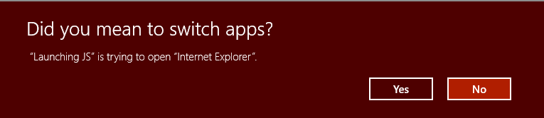

# <a name="launch-the-default-app-for-a-uri"></a>Iniciar o app padrão de um URI


**APIs Importantes**

- [**LaunchUriAsync**](https://msdn.microsoft.com/library/windows/apps/hh701476)
- [**PreferredApplicationPackageFamilyName**](https://msdn.microsoft.com/library/windows/apps/hh965482)
- [**DesiredRemainingView**](https://msdn.microsoft.com/library/windows/apps/dn298314)

Saiba como iniciar o aplicativo padrão para um URI (Uniform Resource Identifier). Os URIs permitem iniciar outro aplicativo para realizar uma tarefa específica. Este tópico também apresenta uma visão geral dos muitos esquemas de URI compilados no Windows. Você também pode iniciar URIs personalizados. Para obter mais informações sobre como registrar um esquema de URI personalizado e identificar a ativação de URI, consulte [Identificar ativação de URI](handle-uri-activation.md).

Os esquemas de URI permitem que você abra aplicativos clicando em hiperlinks. Assim como você pode iniciar um novo email usando **mailto:**, também é possível abrir o navegador da Web padrão usando **http:**

Este tópico descreve os seguintes esquemas de URI integrados ao Windows:

| Esquema de URI | Inicia |
| ----------:|----------|
|[bingmaps:, ms-drive-to: e ms-walk-to: ](#maps-app-uri-schemes) | Aplicativo Mapas |
|[http:](#http-uri-scheme) | Navegador da Web padrão |
|[mailto:](#email-uri-scheme) | Aplicativo de email padrão |
|[ms-call:](#call-app-uri-scheme) |  Aplicativo de chamada |
|[ms-chat:](#messaging-app-uri-scheme) | Aplicativo de mensagens |
|[ms-people:](#people-app-uri-scheme) | Aplicativo Pessoas |
|[ms-photos:](#photos-app-uri-scheme) | App Fotos |
|[ms-settings:](#settings-app-uri-scheme) | Aplicativo Configurações |
|[ms-store:](#store-app-uri-scheme)  | Aplicativo da Loja |
|[ms-tonepicker:](#tone-picker-uri-scheme) | Seletor de tom |
|[ms-yellowpage:](#nearby-numbers-app-uri-scheme) | Aplicativo Números nas Proximidades |
|[msnweather:](#weather-app-uri-scheme) | Aplicativo de clima |

<br>
Por exemplo, o URI a seguir abre o navegador padrão e exibe o site do Bing.

`http://bing.com`

Você também pode iniciar esquemas de URI personalizados. Se não houver app instalado para manipular esse URI, você poderá recomendar um app para o usuário instalar. Para obter mais informações, consulte [Recomendar um app se nenhum estiver disponível para manipular o URI](#recommend-an-app-if-one-is-not-available-to-handle-the-uri).

Em geral, seu app não pode selecionar o app que foi iniciado. O usuário determina o aplicativo que é iniciado. Mais de um aplicativo pode registrar para manipular o mesmo esquema de URI. A exceção a isso é para esquemas de URI reservados. Os registros de esquemas de URI reservados são ignorados. Para obter a lista completa de esquemas de URI reservados, consulte [Manipular a ativação do URI](handle-uri-activation.md). Em casos onde mais de um aplicativo pode ter registrado o mesmo esquema de URI, seu aplicativo pode recomendar um aplicativo específico para ser iniciado. Para obter mais informações, consulte [Recomendar um app se nenhum estiver disponível para manipular o URI](#recommend-an-app-if-one-is-not-available-to-handle-the-uri).

### <a name="call-launchuriasync-to-launch-a-uri"></a>Chamar LaunchUriAsync para iniciar um URI

Use o método [**LaunchUriAsync**](https://msdn.microsoft.com/library/windows/apps/hh701476) para iniciar um URI. Ao chamar esse método, seu aplicativo precisa estar em primeiro plano, ou seja, visível para o usuário. Essa exigência ajuda a garantir que o usuário permaneça no controle. Para que essa exigência seja atendida, você deve vincular todas as inicializações de URI diretamente à interface do usuário do seu aplicativo. O usuário sempre deve executar alguma ação para iniciar uma inicialização de URI. Se você tentar iniciar um URI e seu aplicativo não estiver em primeiro plano, a inicialização falhará e o retorno de chamada de erro será invocado.

Primeiro, crie um objeto [**System.Uri**](https://msdn.microsoft.com/library/windows/apps/system.uri.aspx) para representar o URI e passe-o para o método [**LaunchUriAsync**](https://msdn.microsoft.com/library/windows/apps/hh701476). Use o resultado de retorno para ver se a chamada foi bem-sucedida, conforme mostrado no exemplo a seguir.

```cs
private async void launchURI_Click(object sender, RoutedEventArgs e)
{
   // The URI to launch
   var uriBing = new Uri(@"http://www.bing.com");

   // Launch the URI
   var success = await Windows.System.Launcher.LaunchUriAsync(uriBing);

   if (success)
   {
      // URI launched
   }
   else
   {
      // URI launch failed
   }
}
```

Em alguns casos, o sistema operacional perguntará ao usuário se ele realmente deseja alternar entre aplicativos.



Se você quiser que esse aviso sempre apareça, use a propriedade [**Windows.System.LauncherOptions.TreatAsUntrusted**](https://msdn.microsoft.com/library/windows/apps/hh701442) para informar o sistema operacional de que deseja exibi-lo.

```cs
// The URI to launch
var uriBing = new Uri(@"http://www.bing.com");

// Set the option to show a warning
var promptOptions = new Windows.System.LauncherOptions();
promptOptions.TreatAsUntrusted = true;

// Launch the URI
var success = await Windows.System.Launcher.LaunchUriAsync(uriBing, promptOptions);
```

### <a name="recommend-an-app-if-one-is-not-available-to-handle-the-uri"></a>Recomendar um aplicativo se nenhum estiver disponível para manipular o URI

Em alguns casos, pode ser que o usuário não tenha um aplicativo instalado para manipular o URI que você está iniciando. Por padrão, nesses casos, o sistema operacional oferece ao usuário um link para pesquisar o aplicativo apropriado na loja. Se você quiser dar ao usuário uma recomendação específica sobre qual aplicativo deve ser adquirido nesse cenário, pode transmitir tal recomendação junto com o URI que você está iniciando.

Recomendações também são úteis quando mais de um aplicativo é registrado para manipular um esquema de URI. Ao recomendar um aplicativo específico, o Windows abrirá esse aplicativo se ele já estiver instalado.

Para fazer uma recomendação, chame o método [**Windows.System.Launcher.LaunchUriAsync(Uri, LauncherOptions)**](https://msdn.microsoft.com/library/windows/apps/hh701484) com [**LauncherOptions.preferredApplicationPackageFamilyName**](https://msdn.microsoft.com/library/windows/apps/hh965482) definido como o nome da família do pacote do aplicativo na loja que você quer recomendar. O sistema operacional usará essas informações para substituir a opção geral de pesquisar um aplicativo na loja por uma opção específica para adquirir o aplicativo recomendado na loja.

```cs
// Set the recommended app
var options = new Windows.System.LauncherOptions();
options.PreferredApplicationPackageFamilyName = "Contoso.URIApp_8wknc82po1e";
options.PreferredApplicationDisplayName = "Contoso URI Ap";

// Launch the URI and pass in the recommended app
// in case the user has no apps installed to handle the URI
var success = await Windows.System.Launcher.LaunchUriAsync(uriContoso, options);
```

### <a name="set-remaining-view-preference"></a>Definir a preferência de exibição restante

Os aplicativos de origem que chamam [**LaunchUriAsync**](https://msdn.microsoft.com/library/windows/apps/hh701476) podem solicitar que eles permaneçam na tela após a inicialização de um arquivo. Por padrão, o Windows tenta compartilhar todo o espaço disponível igualmente entre o aplicativo de origem e o aplicativo de destino que manipula o URI. Aplicativos de origem podem usar a propriedade [**DesiredRemainingView**](https://msdn.microsoft.com/library/windows/apps/dn298314) para indicar ao sistema operacional que eles preferem que sua janela de aplicativo ocupe mais ou menos espaço disponível. O **DesiredRemainingView** também pode ser usado para indicar que o aplicativo de origem não precisa permanecer na tela depois da inicialização do URI e pode ser completamente substituído pelo aplicativo de destino. Esta propriedade especifica somente o tamanho da janela preferido do aplicativo de chamada. Ele não especifica o comportamento de outros aplicativos que podem acontecer de também estar na tela ao mesmo tempo.

**Observação**Windows leva em conta vários fatores diferentes ao determinar tamanho da janela final do aplicativo de origem, por exemplo, a preferência do aplicativo de origem, o número de aplicativos na tela, a orientação de tela e assim por diante. Definindo [**DesiredRemainingView**](https://msdn.microsoft.com/library/windows/apps/dn298314), você não garante um comportamento de janelas específico para o aplicativo de origem.

```cs
// Set the desired remaining view.
var options = new Windows.System.LauncherOptions();
options.DesiredRemainingView = Windows.UI.ViewManagement.ViewSizePreference.UseLess;

// Launch the URI
var success = await Windows.System.Launcher.LaunchUriAsync(uriContoso, options);
```

## <a name="uri-schemes"></a>Esquemas de URI ##

Os diversos esquemas de URI descritos abaixo.

### <a name="call-app-uri-scheme"></a>Esquema do URI do aplicativo de Chamada

Use o aplicativo o esquema de URI **ms-call:** para iniciar o aplicativo de Chamada.

| Esquema de URI       | Resultado                   |
|------------------|--------------------------|
| ms-call:settings | Página de configurações do aplicativo de chamada. |

### <a name="email-uri-scheme"></a>Esquema do URI de email

Use o esquema de URI **mailto:** para iniciar o aplicativo de email padrão.

| Esquema de URI |Resultados                          |
|------------|---------------------------------|
| mailto:    | Inicia o aplicativo de email padrão. |
| mailto:\[endereço de email\] | Inicia o aplicativo de email e cria uma nova mensagem com o endereço de email especificado na linha Para. Observe que o email não é enviado até que o usuário toque em Enviar. |

### <a name="http-uri-scheme"></a>Esquema de URI HTTP

Use o esquema de URI **http:** para iniciar o navegador da Web padrão.

| Esquema de URI | Resultados                           |
|------------|-----------------------------------|
| http:      | Inicia o navegador da Web padrão. |

### <a name="maps-app-uri-schemes"></a>Esquemas de URI do aplicativo Mapas

Use os esquemas de URI **bingmaps:**, **ms-drive-to:** e **ms-walk-to:** para [iniciar o aplicativo Mapas do Windows](launch-maps-app.md) para especificar mapas, trajetos e resultados de pesquisa específicos. Por exemplo, o URI a seguir abre o aplicativo Mapas do Windows e exibe um mapa centralizado na cidade de Nova York.

`bingmaps:?cp=40.726966~-74.006076`


Para obter mais informações, consulte [Iniciar o aplicativo Mapas do Windows](launch-maps-app.md). Para usar o controle de mapa em seu próprio aplicativo, consulte [Exibir mapas em modos de exibição 2D, 3D e Streetside](https://msdn.microsoft.com/library/windows/apps/mt219695).

### <a name="messaging-app-uri-scheme"></a>Esquema de URI do aplicativo de mensagens

Use o esquema de URI **ms-chat:** para iniciar o aplicativo Mensagens do Windows.

| Esquema de URI |Resultados |
|------------|--------|
| ms-chat:   | Inicia o aplicativo Mensagens. |
| ms-chat:?ContactID={contacted}  |  Permite que o aplicativo de mensagens seja iniciado com informações de um contato específico.   |
| ms-chat:?Body={body} | Permite que o aplicativo de mensagens seja iniciado com uma cadeia de caracteres para usar como o conteúdo da mensagem.|
| ms-chat:?Addresses={address}&Body={body} | Permite que o aplicativo de mensagens seja iniciado com informações de um determinado endereço e com uma cadeia de caracteres para usar como o conteúdo da mensagem. Observação: os endereços podem ser concatenados. |
| ms-chat:?TransportId={transportId}  | Permite que o aplicativo de mensagens seja iniciado com uma ID de transporte específica. |

### <a name="tone-picker-uri-scheme"></a>Esquema de URI de seletor de tom

Use o esquema de URI **ms-tonepicker:** para escolher toques, alarmes e tons de sistema. Você também pode salvar novos toques e obter o nome de exibição de um tom.

| Esquema de URI | Resultados |
|------------|---------|
| ms-tonepicker: | Escolha toques, alarmes e tons de sistema. |

Os parâmetros são transmitidos por meio de um [ValueSet](https://msdn.microsoft.com/library/windows/apps/windows.foundation.collections.valueset.aspx) para a API LaunchURI. Consulte [Escolher e salvar tons usando o esquema de URI ms-tonepicker](launch-ringtone-picker.md) para obter detalhes.

### <a name="nearby-numbers-app-uri-scheme"></a>Esquema de URI do aplicativo Números nas Proximidades

Use o esquema de URI **ms-yellowpage:** para iniciar o aplicativo Números nas Proximidades.

| Esquema de URI | Resultados |
|------------|---------|
| ms-yellowpage:?input=\[keyword\]&method=\[String or T9\] | Inicia o aplicativo Números nas Proximidades.<br>`input` Refere-se à palavra-chave que você deseja pesquisar.<br>`method` Refere-se ao tipo de pesquisa (cadeia de caracteres ou pesquisa T9).<br>Se `method` for `T9` (um tipo de teclado), `keyword` deverá ser uma cadeia de caracteres numérica que mapeia para as letras de teclado T9 a serem pesquisadas.<br>Se `method` for `String`, `keyword` será a palavra-chave a ser pesquisada. |

### <a name="people-app-uri-scheme"></a>Esquema de URI do aplicativo Pessoas

Use o aplicativo o esquema de URI **ms-people:** para iniciar o aplicativo Pessoas.
Para obter mais informações, consulte [Iniciar o aplicativo Pessoas](launch-people-apps.md).

### <a name="photos-app-uri-scheme"></a>Esquema de URI do aplicativo Fotos

Use o **ms-photos:** esquema de URI para iniciar o aplicativo Fotos para exibir uma imagem ou editar um vídeo. Por exemplo:  
Para exibir uma imagem: `ms-photos:viewer?fileName=c:\users\userName\Pictures\image.jpg`  
Ou para editar um vídeo: `ms-photos:videoedit?InputToken=123abc&Action=Trim&StartTime=01:02:03`  

> [!NOTE]
> Os URIs para editar um vídeo ou exibir uma imagem só estão disponíveis na área de trabalho.

| Esquema de URI |Resultados |
|------------|--------|
| ms-photos:viewer?fileName={filename} | Inicia o aplicativo Fotos para exibir a imagem especificada onde {filename} é um nome de caminho totalmente qualificado. Por exemplo: `c:\users\userName\Pictures\ImageToView.jpg` |
| ms-photos:videoedit?InputToken={input token} | Inicia o aplicativo Fotos no modo de edição de vídeo para o arquivo representado pelo token de arquivo. **InputToken** é necessária. Use o [SharedStorageAccessManager](https://docs.microsoft.com/uwp/api/Windows.ApplicationModel.DataTransfer.SharedStorageAccessManager) para obter um token para um arquivo. |
| ms-photos:videoedit?Action={action} | Um parâmetro opcional que abre o aplicativo Fotos no modo de edição de vídeo especificado onde {action} pode ser: **SlowMotion**, **FrameExtraction**, **Trim**, **View**, **Ink**. Se não especificado, usa o padrão **View** |
| ms-photos:videoedit?StartTime={timespan} | Um parâmetro opcional que especifica o local iniciar a reprodução do vídeo. `{timespan}` Deve estar no formato `"hh:mm:ss.ffff"`. Se não especificado, usa o padrão `00:00:00.0000` |

### <a name="settings-app-uri-scheme"></a>Esquema de URI do aplicativo Configurações

Use o esquema de URI **ms-settings:** para [iniciar o aplicativo Configurações do Windows](launch-settings-app.md). A inicialização do aplicativo Configurações é uma parte importante da escrita de um aplicativo com reconhecimento de privacidade. Se seu aplicativo não pode acessar um recurso confidencial, é recomendável fornecer ao usuário um link conveniente para as configurações de privacidade desse recurso. Por exemplo, o URI a seguir abre o aplicativo Configurações e exibe as configurações de privacidade da câmera.

`ms-settings:privacy-webcam`


Para obter mais informações, consulte [Iniciar o aplicativo Configurações do Windows](launch-settings-app.md) e [Diretrizes de aplicativos com reconhecimento de privacidade](https://msdn.microsoft.com/library/windows/apps/hh768223).

### <a name="store-app-uri-scheme"></a>Esquema de URI do aplicativo da Store

Use o esquema de URI **ms-windows-store:** para [Iniciar o app UWP](launch-store-app.md). Abra páginas de detalhes do produto, páginas de análise do produto, páginas de pesquisa etc. Por exemplo, o URI a seguir abre o aplicativo UWP e inicia a página inicial da Store.

`ms-windows-store://home/`

Para mais informações, consulte [Iniciar o app UWP](launch-store-app.md).

### <a name="weather-app-uri-scheme"></a>Esquema de URI de aplicativo de clima

Use o **msnweather:** esquema de URI para iniciar o aplicativo de previsão do tempo.

| Esquema de URI | Resultados |
|------------|---------|
| msnweather://Forecast?la= \[latitude\] & lo = \ [longitude\] | Inicia o aplicativo de previsão do tempo na página de previsão com base em um coordenadas da localização geográfica.<br>`latitude` refere-se para o latitude da localização.<br> `longitude` refere-se à longitude do local.<br> |
