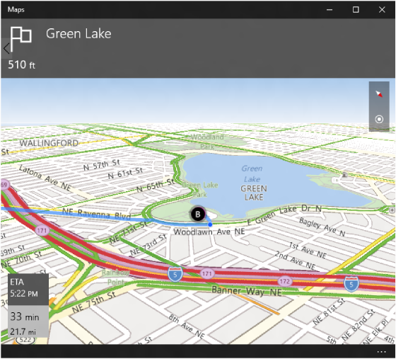

# Iniciar o aplicativo Mapas do Windows


\[ Atualizado para aplicativos UWP no Windows 10. Para ler artigos sobre o Windows 8.x, consulte o [arquivo morto](http://go.microsoft.com/fwlink/p/?linkid=619132) \]


Saiba como iniciar o aplicativo Mapas do Windows a partir de seu aplicativo. Este tópico descreve os esquemas de URI (Uniform Resource Identifier) **bingmaps:**, **ms-drive-to:**, **ms-walk-to:** e *ms-settings:*. Use esses esquemas de URI para iniciar o aplicativo Mapas do Windows para ver mapas, trajetos e resultados de pesquisa específicos ou para baixar mapas offline de Mapas do Windows no aplicativo Configurações.

**Dica** Para saber mais sobre como iniciar o aplicativo Mapas do Windows a partir de seu aplicativo, baixe a [amostra de mapas da Plataforma Universal do Windows (UWP)](http://go.microsoft.com/fwlink/p/?LinkId=619977) do [repositório de amostras universais do Windows](http://go.microsoft.com/fwlink/p/?LinkId=619979) no GitHub.

## Apresentando URIs

Os esquemas de URI permitem que você abra aplicativos clicando em hiperlinks (ou programaticamente, em seu aplicativo). Assim como você pode iniciar um novo email usando **mailto:** ou abrir um navegador da Web usando **http:**, é possível abrir o aplicativo Mapas do Windows usando **bingmaps:**, **ms-drive-to:** e **ms-walk-to:**.

-   O URI **bingmaps:** fornece mapas de locais, resultados de pesquisa, trajetos e tráfego.
-   O URI **ms-drive-to:** fornece o trajeto de carro, curva a curva, a partir de sua localização atual.
-   O URI **ms-walk-to:** fornece o trajeto a pé, curva a curva, a partir de sua localização atual.

Por exemplo, o URI a seguir abre o aplicativo Mapas do Windows e exibe um mapa centralizado na cidade de Nova York.

```xml
<bingmaps:?cp=40.726966~-74.006076>
```


Esta é uma descrição do esquema de URI:

**bingmaps:?query**

Neste esquema de URI, *query* é uma série de pares de parâmetro nome/valor:

**&param1=value1&param2=value2 …**

Para obter uma lista completa dos parâmetros disponíveis, consulte a referência de parâmetro [bingmaps:](#bingmaps), [ms-drive-to:](#msdriveto)e [ms-walk-to:](#mswalkto). Também há exemplos mais adiante neste tópico.

## Iniciar um URI a partir de seu aplicativo


Para iniciar o aplicativo Mapas do Windows de seu aplicativo, chame o método [**LaunchUriAsync**](https://msdn.microsoft.com/library/windows/apps/hh701476) com um URI **bingmaps:**, **ms-drive-to:** ou **ms-walk-to:**. O exemplo a seguir inicia o mesmo URI do exemplo anterior. Para saber mais sobre como iniciar aplicativos via URI, consulte [Iniciar o aplicativo padrão para um URI](launch-default-app.md).

```cs
// Center on New York City
var uriNewYork = new Uri(@"bingmaps:?cp=40.726966~-74.006076");

// Launch the Windows Maps app
var launcherOptions = new Windows.System.LauncherOptions();
launcherOptions.TargetApplicationPackageFamilyName = "Microsoft.WindowsMaps_8wekyb3d8bbwe";
var success = await Windows.System.Launcher.LaunchUriAsync(uriNewYork, launcherOptions);
```

Neste exemplo, a classe [**LauncherOptions**](https://msdn.microsoft.com/library/windows/apps/hh701435) é usada para ajudar a garantir que o aplicativo Mapas do Windows seja iniciado.

## Exibir locais conhecidos


Há várias maneiras de controlar o ponto central do mapa e o nível de zoom. Usar os parâmetros *cp* (ponto central) e *lvl* (nível de zoom) é o método mais simples e produz resultados previsíveis. Usar o parâmetro *bb* (especifica uma área delimitada por valores de latitude e longitude) é menos previsível porque ele leva em conta a resolução da tela e determina o ponto central do mapa e o nível de zoom com base nas coordenadas fornecidas. O parâmetro *bb* é ignorado quando todos os três parâmetros (*bb*, *cp* e *lvl*) estão presentes.

Para controlar o tipo de exibição, use os parâmetros *ss* (Streetside) e *sty* (estilo). O parâmetro *ss* coloca o mapa em um modo de exibição Streetside. O parâmetro *sty* permite que você alterne entre os modos de exibição de estrada, vista aérea e 3D. Ao usar o estilo 3D, os parâmetros *hdg*, *pit* e *rad* podem ser usados para especificar o modo de exibição 3D. *hdg* especifica o título do modo de exibição, *pit* especifica a rotação sobre o eixo x do modo de exibição, e *rad* especifica a distância entre o ponto central para mostrar na exibição. Para obter mais informações sobre esses e outros parâmetros, consulte a [referência de parâmetro bingmaps:](#bingmaps).

| URI de Exemplo                                                                 | Resultados                                                                                                                                                                                                   |
|----------------------------------------------------------------------------|-----------------------------------------------------------------------------------------------------------------------------------------------------------------------------------------------------------|
| bingmaps:?                                                                 | Abre o aplicativo Mapas.                                                                                                                                                                                       |
| bingmaps:?cp=40.726966~-74.006076                                          | Exibe um mapa centralizado na cidade de Nova York.                                                                                                                                                               |
| bingmaps:?cp=40.726966~-74.006076&lvl=10                                   | Exibe um mapa centralizado na cidade de Nova York com um nível de zoom 10.                                                                                                                                       |
| bingmaps:?bb=39.719\_-74.52~41.71\_-73.5                                   | Exibe um mapa da cidade de Nova York com o tamanho da tela como a caixa delimitadora.                                                                                                                          |
| bingmaps:?bb=39.719\_-74.52~41.71\_-73.5&cp=47~-122                        | Exibe um mapa da cidade de Nova York, que é a área especifica no argumento de caixa delimitadora. O ponto central de Seattle especificado no argumento **cp** é ignorado.                                      |
| bingmaps:?bb=39.719\_-74.52~41.71\_-73.5&cp=47~-122&lvl=8                  | Exibe um mapa da cidade de Nova York, que é a área especifica no argumento **bb**. O argumento **cp**, que especifica Seattle, é ignorado porque **cp** e **lvl** são ignorados quando **bb** é especificado. |
| bingmaps:?collection=point.36.116584\_-115.176753\_Caesars%20Palace&lvl=16 | Exibe um mapa com um ponto denominado Caesars Palace (em Las Vegas) e define o nível de zoom para 16.                                                                                                            |
| bingmaps:?collection=point.40.726966\_-74.006076\_Some%255FBusiness        | Exibe um mapa com um ponto denominado Some\_Business (em Las Vegas).                                                                                                                                          |
| bingmaps:?cp=40.726966~-74.006076&trfc=1&sty=a                             | Exibe um mapa da cidade de Nova York com o estilo de mapa do tráfego e vista aérea.                                                                                                                                               |
| bingmaps:?cp=47.6204~-122.3491&sty=3d                                      | Mostra a exibição 3D do Space Needle.                                                                                                                                                                   |
| bingmaps:?cp=47.6204~-122.3491&sty=3d&rad=200&pit=75&hdg=165               | Mostra uma exibição 3D do Space Needle com um raio de 200 m, uma rotação sobre o eixo x ou 75 graus e um título de 165 graus.                                                                                        |
| bingmaps:?cp=47.6204~-122.3491&ss=1                                        | Mostra a exibição Streetside do Space Needle.                                                                                                                                                           |

 

## Exibir resultados de pesquisa


Ao realizar uma pesquisa de empresa usando o parâmetro *q*, recomendamos que especifique os termos o máximo possível e use-os em conjunto com o parâmetro *cp* ou *where* para especificar um local. Se o usuário não der permissão ao aplicativo Mapas para usar sua localização e você não especificar um local para uma pesquisa de empresa, a pesquisa poderá ser realizada no âmbito do país/região e não retornar resultados significativos. Os resultados da pesquisa são exibidos no modo de exibição de mapa mais apropriado; portanto, a menos que haja uma necessidade de definir o *lvl* (nível de zoom), é recomendável permitir que o aplicativo Mapas decida. Para obter mais informações sobre esses e outros parâmetros, consulte a [referência de parâmetro bingmaps:](#bingmaps).

| URI de Exemplo                                                    | Resultados                                                                                                                                         |
|---------------------------------------------------------------|-------------------------------------------------------------------------------------------------------------------------------------------------|
| bingmaps:?where=1600%20Pennsylvania%20Ave,%20Washington,%20DC | Exibe um mapa e pesquisa o endereço da Casa Branca em Washington, D.C.                                                              |
| bingmaps:?cp=40.726966~-74.006076&lvl=10&where=New%20York     | Pesquisa por Nova York perto do ponto central especificado, exibe os resultados em um mapa, e define o zoom nível 10.                            |
| bingmaps:?lvl=10&where=New%20York                             | Pesquisa por Nova York e mostra o resultado no nível de zoom 10.                                                                                    |
| bingmaps:?cp=40.726966~-74.006076&lvl=14.5&q=pizza            | Pesquisa por pizza perto do ponto central especificado (ou seja, na cidade de Nova York), exibe os resultados em um mapa, e define o zoom nível 14,5. |
| bingmaps:?q=coffee&where=Seattle                              | Pesquisa por café em Seattle.                                                                                                                 |

 

## Exibir vários pontos


Use o parâmetro *collection* para mostrar um conjunto personalizado de pontos no mapa. Se houver mais de um ponto, será exibida uma lista de pontos. Pode haver até 25 pontos em uma coleção, e eles são listados na ordem fornecida. A coleção tem precedência sobre solicitações de pesquisa e trajetos. Para obter mais informações sobre esse e outros parâmetros, consulte a [referência de parâmetro bingmaps:](#bingmaps).

| URI de Exemplo                                                                                                                                                         | Resultados                                                                                                                   |
|--------------------------------------------------------------------------------------------------------------------------------------------------------------------|---------------------------------------------------------------------------------------------------------------------------|
| bingmaps:?collection=point.36.116584\_-115.176753\_Caesars%20Palace                                                                                                | Pesquisa por Caesar's Palace em Las Vegas e exibe os resultados em um mapa na melhor exibição de mapa.                         |
| bingmaps:?collection=point.36.116584\_-115.176753\_Caesars%20Palace&lvl=16                                                                                         | Exibe um pino denominado Caesars Palace em Las Vegas e define o zoom para nível 16.                                               |
| bingmaps:?collection=point.36.116584\_-115.176753\_Caesars%20Palace~point.36.113126\_-115.175188\_The%20Bellagio&lvl=16&cp=36.114902~-115.176669                   | Exibe um pino denominado Caesars Palace e um pino denominado The Bellagio em Las Vegas e define o zoom para nível 16.              |
| bingmaps:?collection=point.40.726966\_-74.006076\_Fake%255FBusiness%255Fwith%255FUnderscore                                                                        | Exibe a cidade de Nova York com um pino denominado Fake\_Business\_with\_Underscore.                                                  |
| bingmaps:?collection=name.Hotel%20List~point.36.116584\_-115.176753\_Caesars%20Palace~point.36.113126\_-115.175188\_The%20Bellagio&lvl=16&cp=36.114902~-115.176669 | Exibe uma lista denominada Lista de Hotéis e dois pinos para Caesars Palace e The Bellagio em Las Vegas, e define o zoom para nível 16. |

 

## Exibir trajeto e tráfego


Você pode exibir o trajeto entre dois pontos usando o parâmetro *rtp*; esses pontos podem ser um endereço ou coordenadas de latitude e longitude. Use o parâmetro *trfc* para mostrar informações do tráfego. Para especificar o tipo de trajeto: de carro, a pé ou trânsito, use o parâmetro *mode*. Se *mode* não for especificado, o trajeto será fornecido usando o modo de preferência de transporte do usuário. Para obter mais informações sobre esses e outros parâmetros, consulte a [referência de parâmetro bingmaps:](#bingmaps).


| URI de Exemplo                                                                                                              | Resultados                                                                                                                                                         |
|-------------------------------------------------------------------------------------------------------------------------|-----------------------------------------------------------------------------------------------------------------------------------------------------------------|
| bingmaps:?rtp=pos.44.9160\_-110.4158~pos.45.0475\_-109.4187                                                             | Exibe um mapa com trajeto ponto a ponto. Como *mode* não é especificado, o trajeto será fornecido usando o modo de preferência de transporte do usuário. |
| bingmaps:?cp=43.0332~-87.9167&trfc=1                                                                                    | Exibe um mapa centralizado na cidade de Milwaukee, WI, com tráfego.                                                                                                        |
| bingmaps:?rtp=adr.One Microsoft Way, Redmond, WA 98052~pos.39.0731\_-108.7238                                           | Exibe um mapa com o trajeto do endereço especificado para o local especificado.                                                                            |
| bingmaps:?rtp=adr.1%20Microsoft%20Way,%20Redmond,%20WA,%2098052~pos.36.1223\_-111.9495\_Grand%20Canyon%20northern%20rim | Exibe o trajeto de 1 Microsoft Way, Redmond, WA, 98052 até a borda norte do Grand Canyon.                                                                |
| bingmaps:?rtp=adr.Davenport, CA~adr.Yosemite Village                                                                    | Exibe um mapa com trajetos para dirigir com endereço especificado para o ponto de referência especificado.                                                                   |
| bingmaps:?rtp=adr.Mountain%20View,%20CA~adr.San%20Francisco%20International%20Airport,%20CA&mode=d                      | Exibe com trajetos de carro de Mountain View, CA para o San Francisco International Airport, CA.                                                                  |
| bingmaps:?rtp=adr.Mountain%20View,%20CA~adr.San%20Francisco%20International%20Airport,%20CA&mode=w                      | Exibe trajetos a pé de Mountain View, CA para o San Francisco International Airport, CA.                                                                  |
| bingmaps:?rtp=adr.Mountain%20View,%20CA~adr.San%20Francisco%20International%20Airport,%20CA&mode=t                      | Exibe o trajeto de transporte público de Mountain View, CA para o San Francisco International Airport, CA.                                                                  |

 

## Exibir trajeto curva a curva


Os esquemas de URI **ms-drive-to:** e **ms-walk-to:** permitem que você inicie diretamente em um modo de exibição de curva a curva de uma rota. Esses esquemas de URI só podem fornecer o trajeto da localização atual do usuário. Se você tiver de fornecer o trajeto entre pontos que não incluem a localização atual do usuário, use o esquema de URI **bingmaps:** conforme descrito na seção anterior. Para saber mais sobre esses esquemas de URI, consulte as referências de parâmetro [ms-drive-to:](#msdriveto) e [ms-walk-to:](#mswalkto).

> **Importante**  Quando os esquemas de URI **ms-drive-to:** ou **ms-walk-to:** são iniciados, o aplicativo Mapas verifica se o dispositivo passou por uma correção de localização do GPS. Em caso afirmativo, o aplicativo Mapas continuará com o trajeto curva a curva. Caso contrário, o aplicativo exibirá a visão geral da rota, conforme descrito em [Exibir trajeto e tráfego](#directions).

 



| URI de Exemplo                                                                                                | Resultados                                                                                       |
|-----------------------------------------------------------------------------------------------------------|-----------------------------------------------------------------------------------------------|
| ms-drive-to:?destination.latitude=47.680504&destination.longitude=-122.328262&destination.name=Green Lake | Exibe um mapa com um trajeto de carro curva a curva para o Green Lake a partir de sua localização atual. |
| ms-walk-to:?destination.latitude=47.680504&destination.longitude=-122.328262&destination.name=Green Lake  | Exibe um mapa com um trajeto a pé curva a curva para o Green Lake a partir de sua localização atual. |


## Baixar mapas offline


O esquema de URI **ms-settings:** permite que você inicie diretamente em uma página específica no aplicativo Configurações. Embora o esquema de URI **ms-settings:** não inicie o aplicativo Mapas, ele permite que você acesse diretamente a página Mapas Offline no aplicativo Configurações e exibe uma caixa de diálogo de confirmação para baixar os mapas offline usados pelo aplicativo Mapas. O esquema de URI aceita um ponto especificado por uma latitude e longitude e determina automaticamente se há mapas offline disponíveis para uma região que contém esse ponto.  Se a latitude e longitude informadas estiverem em várias regiões de download, a caixa de diálogo de confirmação permitirá que o usuário escolha qual essas regiões baixar. Se mapas offline não estiverem disponíveis para uma região que contém esse ponto, a página Mapas offline no aplicativo Configurações será exibida com uma caixa de diálogo de erro.

| URI de Exemplo                                                                                                | Resultados                                                                                       |
|-----------------------------------------------------------------------------------------------------------|-----------------------------------------------------------------------------------------------|
| ms-settings:maps-downloadmaps?latlong=47.6,-122.3 | Abre o aplicativo Configurações na página Mapas Offline com uma caixa de diálogo de confirmação exibida para baixar mapas para a região que contém o ponto de latitude e longitude especificado. |
 

## Referência de parâmetro bingmaps:


A sintaxe de cada parâmetro nesta tabela é mostrada com a metalinguagem Augmented Backus–Naur Form (ABNF).

<table>
<colgroup>
<col width="25%" />
<col width="25%" />
<col width="25%" />
<col width="25%" />
</colgroup>
<thead>
<tr class="header">
<th align="left">Parâmetro</th>
<th align="left">Definição</th>
<th align="left">Exemplo e definição ABNF</th>
<th align="left">Detalhes</th>
</tr>
</thead>
<tbody>
<tr class="odd">
<td align="left"><p>**cp**</p></td>
<td align="left"><p>Ponto central</p></td>
<td align="left"><p>cp = "cp=" cpval</p>
<p>cpval = degreeslat "~" degreeslon</p>
<p>degreeslat = ["-"] 1*3DIGIT ["." 1*7DIGIT]</p>
<p>degreeslon = ["-"] 1*2DIGIT ["." 1*7DIGIT]</p>
<p>Exemplo:</p>
<p>cp=40.726966~-74.006076</p></td>
<td align="left"><p>Os dois valores devem ser expressos em graus decimais e separados por um til (**~**).</p>
<p>Os valores válidos de longitude estão entre -180 e +180, inclusive.</p>
<p>Os valores válidos de latitude estão entre -90 e +90, inclusive.</p></td>
</tr>
<tr class="even">
<td align="left"><p>**bb**</p></td>
<td align="left"><p>Caixa delimitadora</p></td>
<td align="left"><p>bb = "bb=" southlatitude "_" westlongitude "~" northlatitude "_" eastlongitude</p>
<p>southlatitude = degreeslat</p>
<p>northlatitude = degreeslat</p>
<p>westlongitude = degreeslon</p>
<p>eastlongitude = degreeslon</p>
<p>degreeslat = ["-"] 13DIGIT ["." 17DIGIT]</p>
<p>degreeslon = ["-"] 12DIGIT ["." 17DIGIT]</p>
<p>Exemplo:</p>
<p>bb=39.719_-74.52~41.71_-73.5</p></td>
<td align="left"><p>Uma área retangular que especifica a caixa delimitadora expressa em graus decimais, usando um til (**~**) para separar o canto inferior esquerdo do canto superior direito. A latitude e a longitude para cada um são separadas por um sublinhado (**_**).</p>
<p>Os valores válidos de longitude estão entre -180 e +180, inclusive.</p>
<p>Os valores válidos de latitude estão entre -90 e +90, inclusive.</p><p>Os parâmetros cp e lvl são ignorados quando uma caixa delimitadora é fornecida.</p></td>
</tr>
<tr class="odd">
<td align="left"><p>**where**</p></td>
<td align="left"><p>Localização</p></td>
<td align="left"><p>where = "where=" whereval</p>
<p>whereval = 1*( ALPHA / DIGIT / "-" / "." / "_" / pct-encoded / "!" / "$" / "'" / "(" / ")" / "*" / "+" / "," / ";" / ":" / "@" / "/" / "?")</p>
<p>Exemplo:</p>
<p>where=1600%20Pennsylvania%20Ave,%20Washington,%20DC</p></td>
<td align="left"><p>Termo de pesquisa de um local, ponto de referência ou lugar específico.</p></td>
</tr>
<tr class="even">
<td align="left"><p>**q**</p></td>
<td align="left"><p>Termo da consulta</p></td>
<td align="left"><p>q = "q="</p>
<p>whereval</p>
<p>Exemplo:</p>
<p>q=mexican%20restaurants</p></td>
<td align="left"><p>Termo de pesquisa para a categoria de empresas ou negócios locais.</p></td>
</tr>
<tr class="odd">
<td align="left"><p>**lvl**</p></td>
<td align="left"><p>Nível de zoom</p></td>
<td align="left"><p>lvl = "lvl=" 1*2DIGIT ["." 1*2DIGIT]</p>
<p>Exemplo:</p>
<p>lvl=10.50</p></td>
<td align="left"><p>Define o nível de zoom do modo de exibição de mapa. Os valores válidos são de 1 a 20, onde 1 é totalmente sem zoom.</p></td>
</tr>
<tr class="even">
<td align="left"><p>**sty**</p></td>
<td align="left"><p>Estilo</p></td>
<td align="left"><p>sty = "sty=" ("a" / "r"/"3d")</p>
<p>Exemplo:</p>
<p>sty=a</p></td>
<td align="left"><p>Define o estilo de mapa. Os valores válidos para esse parâmetro incluem:</p>
<ul>
<li>**a**: exibe uma vista aérea do mapa.</li>
<li>**r**: exibe uma vista das ruas do mapa.</li>
<li>**3d**: exibe uma vista em 3D do mapa. Use em conjunto com o parâmetro **cp** e, opcionalmente, com o parâmetro **rad**.</li>
</ul>
<p>No Windows 10, os estilos de vista aérea e exibição 3D são os mesmos.</p>
<div class="alert">
**Observação**  Omitir o parâmetro **sty** produz os mesmos resultados que sty=r.
</div>
<div>
 
</div></td>
</tr>
<tr class="odd">
<td align="left"><p>**rad**</p></td>
<td align="left"><p>Radius</p></td>
<td align="left"><p>rad = "rad=" 1*8DIGIT</p>
<p>Exemplo:</p>
<p>rad=1000</p></td>
<td align="left"><p>Uma área circular que especifica o modo de exibição de mapa desejado. O valor do raio é medido em metros.</p></td>
</tr>
<tr class="even">
<td align="left"><p>**pit**</p></td>
<td align="left"><p>Rotação sobre o eixo x</p></td>
<td align="left"><p>pit = "pit=" pitch</p>
<p>Exemplo:</p>
<p>pit=60</p></td>
<td align="left"><p>Indica o ângulo no qual o mapa é exibido, onde 90 está voltado para o horizonte (máximo) e 0 está voltado diretamente para baixo (mínimo).</p><p>Os valores válidos de rotação sobre o eixo x estão entre 0 e 90, inclusive.</td>
</tr>
<tr class="odd">
<td align="left"><p>**hdg**</p></td>
<td align="left"><p>Direcionamento</p></td>
<td align="left"><p>hdg = "hdg=" heading</p>
<p>Exemplo:</p>
<p>hdg=180</p></td>
<td align="left"><p>Indica a direção que o mapa está tomando em graus, onde 0 ou 360 = Norte, 90 = Leste, 180 = Sul e 270 = Oeste.</p></td>
</tr>
<tr class="even">
<td align="left"><p>**ss**</p></td>
<td align="left"><p>Streetside</p></td>
<td align="left"><p>ss = "ss=" BIT</p>
<p>Exemplo:</p>
<p>ss=1</p></td>
<td align="left"><p>Indica as imagens em nível de rua que serão mostradas quando <code>ss=1</code>. Omitir o parâmetro **ss** produz os mesmos resultados que <code>ss=0</code>. Use em conjunto com o parâmetro **cp** para especificar o local do modo de exibição em nível de rua.</p>
<div class="alert">
> **Observação**  As imagens em nível de rua não estão disponíveis em todas as regiões.
</div>
<div>
 
</div></td>
</tr>
<tr class="odd">
<td align="left"><p>**trfc**</p></td>
<td align="left"><p>Trânsito</p></td>
<td align="left"><p>trfc = "trfc=" BIT</p>
<p>Exemplo:</p>
<p>trfc=1</p></td>
<td align="left"><p>Especifica se as informações de trânsito estão incluídas no mapa. Omitir o parâmetro trfc produz os mesmos resultados que <code>trfc=0</code>.</p>
<div class="alert">
> **Observação**  Observe que os dados sobre o trânsito não estão disponíveis em todas as regiões.
</div>
<div>
 
</div></td>
</tr>
<tr class="even">
<td align="left"><p>**rtp**</p></td>
<td align="left"><p>Rota</p></td>
<td align="left"><p>rtp = "rtp=" (waypoint "~" [waypoint]) / ("~" waypoint)</p>
<p>waypoint = ("pos." point ) / ("adr." whereval)</p>
<p>point = "point." pointval ["_" title]</p>
<p>pointval = degreeslat "" degreeslon</p>
<p>degreeslat = ["-"] 13DIGIT ["." 17DIGIT]</p>
<p>degreeslon = ["-"] 12DIGIT ["." 17DIGIT]</p>
<p>title = whereval</p>
<p>whereval = 1( ALPHA / DIGIT / "-" / "." / "_" / pct-encoded / "!" / "$" / "'" / "(" / ")" / "" / "+" / "," / ";" / ":" / "@" / "/" / "?")</p>


<p>Exemplos:</p>
<p>rtp=adr.Mountain%20View,%20CA~adr.SFO</p>
<p>rtp=adr.One%20Microsoft%20Way,%20Redmond,%20WA~pos.45.23423_-122.1232 _My%20Picnic%20Spot</p></td>
<td align="left"><p>Define o início e o fim de uma rota a ser desenhada no mapa, separados por um til (**~**). Cada um dos pontos intermediários é definido por uma posição usando-se a latitude, a longitude e um título opcional ou um identificador de endereço.</p>
<p>Uma rota completa contém exatamente dois pontos intermediários. Por exemplo, uma rota com dois pontos intermediários é definida por <code>rtp="A"~"B"</code>.</p>
<p>Também é aceitável especificar uma rota incompleta. Por exemplo, você pode definir apenas o início de uma rota com <code>rtp="A"~</code>. Nesse caso, a entrada de trajeto é exibida com o ponto intermediário fornecido no campo **De** e o campo **Para** tem foco.</p>
<p>Se apenas o final de uma rota for especificado, como com <code>rtp=~"B"</code>, o painel do trajeto é exibido com o ponto intermediário fornecido no campo **Para**. Se uma localização atual precisa estiver disponível, a localização atual será previamente preenchida no campo **De** com foco.</p>
<p>Nenhuma linha de rota é desenhada quando uma rota incompleta é determinada.</p>
<p>Use em conjunto com o parâmetro **mode** para especificar o modo de transporte (de carro, transporte público ou a pé). Se **mode** não for especificado, o trajeto será fornecido usando o modo de preferência de transporte do usuário.</p>
<div class="alert">
**Observação**  Um título pode ser usado para um local se o local for especificado pelo valor do parâmetro **pos**. Em vez de mostrar a latitude e a longitude, o título será exibido.
</div>
<div>
 
</div></td>
</tr>
<tr class="odd">
<td align="left"><p>**mode**</p></td>
<td align="left"><p>Modo de transporte</p></td>
<td align="left"><p>mode = "mode=" ("d" / "t" / "w")</p>
<p>Exemplo:</p>
<p>mode=d</p></td>
<td align="left"><p>Define o modo de transporte. Os valores válidos para esse parâmetro incluem:</p>
<ul>
<li>**d**: exibe a visão geral dos trajetos por automóvel</li>
<li>**t**: exibe a visão geral dos trajetos</li>
<li>**w**: exibe a visão geral dos trajetos a pé</li>
</ul>
<p>Use em conjunto com o parâmetro **rtp** para o trajeto de transporte. Se **mode** não for especificado, o trajeto será fornecido usando o modo de preferência de transporte do usuário. Um **modo** pode ser fornecido sem nenhum parâmetro de rota para inserir entradas de trajeto para o modo em questão do local atual.</p></td>
</tr>

<tr class="even">
<td align="left"><p>**collection**</p></td>
<td align="left"><p>Coleção</p></td>
<td align="left"><p>collection = "collection="(name"~"/)point["~"point]</p>
<p>name = "name." whereval </p>
<p>whereval = 1( ALPHA / DIGIT / "-" / "." / "_" / pct-encoded / "!" / "$" / "'" / "(" / ")" / "" / "+" / "," / ";" / ":" / "@" / "/" / "?") </p>
<p>point = "point." pointval ["_" title] </p>
<p>pointval = degreeslat "" degreeslon </p>
<p>degreeslat = ["-"] 13DIGIT ["." 17DIGIT] </p>
<p>degreeslon = ["-"] 12DIGIT ["." 17DIGIT] </p>
<p>title = whereval</p>


<p>Exemplo:</p>
<p>collection=name.My%20Trip%20Stops~point.36.116584_-115.176753_Las%20Vegas~point.37.8268_-122.4798_Golden%20Gate%20Bridge</p></td>
<td align="left"><p>Coleção de pontos a ser adicionada ao mapa e à lista. A coleção de pontos pode ser nomeada usando o parâmetro name. Um ponto é especificado usando latitude, longitude e título opcional.</p>
<p>Separe o nome e vários pontos com tils (**~**).</p>
<p>Se o item que você especificar contiver um til, verifique se o til está codificado como <code>%7E</code>. Se não estiver acompanhada dos parâmetros de Ponto central e de Nível de zoom, a coleção fornecerá o melhor modo de exibição de mapa.</p>

<p>**Importante** Se o item que você especificar contiver um sublinhado, verifique se o sublinhado está codificado duplamente como %255F.</p>

<p>Se o item que você especificar contiver um sublinhado, verifique se o sublinhado está codificado duplamente como %255F.</p></td>
</tr>
</tbody>
</table>

 

## Referência de parâmetro ms-drive-to:


O URI para iniciar uma solicitação de trajetos de automóvel curva a curva não precisa ser codificado e tem o seguinte formato.

> **Observação**  Você não especifica o ponto de partida nesse esquema de URI. O ponto de partida é sempre presumido como sendo a localização atual. Se você precisa especificar um ponto de partida que não seja a localização atual, consulte [Exibir trajeto e tráfego](#directions).

 

| Parâmetro | Definição | Exemplo | Detalhes |
|------------|-----------|---------|---------|
| **destination.latitude** | Latitude do destino | Exemplo: destination.latitude=47.6451413797194 | A latitude do destino. Os valores válidos de latitude estão entre -90 e +90, inclusive. |
| **destination.longitude** | Longitude do destino | Exemplo: destination.longitude=-122.141964733601 | A longitude do destino. Os valores válidos de longitude estão entre -180 e +180, inclusive. |
| **destination.name** | Nome do destino | Exemplo: destination.name=Redmond, WA | O nome do destino. Você não precisa codificar o valor de **destination.name**. |

 

## Referência de parâmetro ms-walk-to:


O URI para iniciar uma solicitação de trajetos a pé curva a curva não precisa ser codificado e tem o seguinte formato.

> **Observação**  Você não especifica o ponto de partida nesse esquema de URI. O ponto de partida é sempre presumido como sendo a localização atual. Se você precisa especificar um ponto de partida que não seja a localização atual, consulte [Exibir trajeto e tráfego](#directions).

 

| Parâmetro | Definição | Exemplo | Detalhes |
|-----------|------------|---------|----------|
| **destination.latitude** | Latitude do destino | Exemplo: destination.latitude=47.6451413797194 | A latitude do destino. Os valores válidos de latitude estão entre -90 e +90, inclusive. |
| **destination.longitude** | Longitude do destino | Exemplo: destination.longitude=-122.141964733601 | A longitude do destino. Os valores válidos de longitude estão entre -180 e +180, inclusive. |
| **destination.name** | Nome do destino | Exemplo: destination.name=Redmond, WA | O nome do destino. Você não precisa codificar o valor de **destination.name**. |

 
## Referência de parâmetro ms-settings:


A sintaxe para parâmetros específicos do aplicativo Mapas para o esquema de URI **ms-settings:** é definida abaixo. **mapas downloadmaps** é especificado junto com a URI **ms-settings:** na forma de **ms-configurações: mapas-downloadmaps? ** para indicar a página de configurações de mapas offline.

 

| Parâmetro | Definição | Exemplo | Detalhes |
|-----------|------------|---------|----------|
| **latlong** | Ponto que define a região de mapa offline. | Exemplo: latlong=47.6,-122.3 | O geopoint é especificado por latitude e longitude separadas por vírgula. Os valores válidos de latitude estão entre -90 e +90, inclusive. Os valores válidos de longitude estão entre -180 e +180, inclusive. |
 

 


<!--HONumber=Jun16_HO4-->


