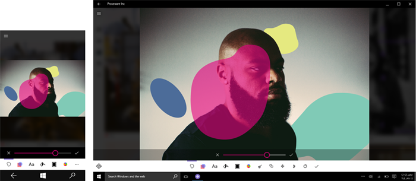
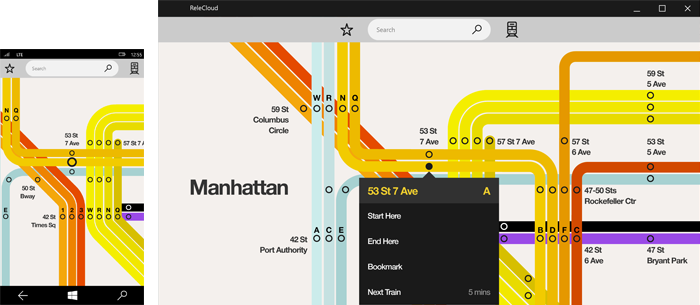

# Padrão de layout de tela ativa

Uma tela ativa é um padrão com uma área de conteúdo e uma área de comando. É para apps de modo de exibição único ou experiências modais, como visualizadores/editores de fotos, visualizadores de documentos, mapas, pinturas ou outros apps que fazem uso de um modo de exibição de rolagem livre. Para executar ações, uma tela ativa pode ser combinada com uma barra de comandos ou botões apenas, dependendo do número e dos tipos de ações necessárias.

## Exemplos

Esse design de um app de edição de fotos apresenta um padrão de tela ativo, com um exemplo móvel à esquerda e um exemplo da área de trabalho à direita. A superfície de edição de imagens é uma tela, e a barra de comandos na parte inferior contém todas as ações contextuais para o app.

Esse design de um app de mapa do metrô usa uma tela ativa com uma faixa de interface do usuário simples na parte superior com apenas duas ações e uma caixa de pesquisa. Ações contextuais são mostradas no menu de contexto, como visto na imagem à direita.

## Implementando este padrão

O padrão de tela ativa consiste em uma área de conteúdo e uma área de comando.

**Área de conteúdo**  A área de conteúdo costuma ser uma tela de rolagem livre. Várias áreas de conteúdo podem existir dentro de um app.

**Área de comando.**  Se você estiver posicionando muitos comandos, a barra de comandos, que responde de acordo com o tamanho da tela, deve ser a solução a se seguir. Se você não está posicionando muitos comandos e não se preocupa tanto com uma interface de usuário ágil na resposta, botões que economizam espaço funcionam bem.

## Artigos relacionados

-   [**Barra de aplicativos e barra de comandos**](../controls-and-patterns/app-bars.md)

