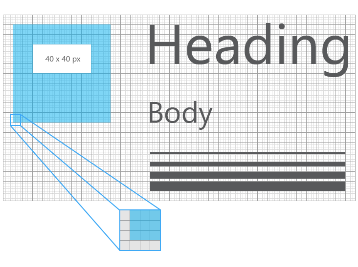
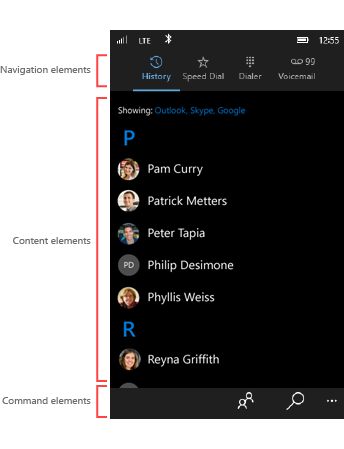
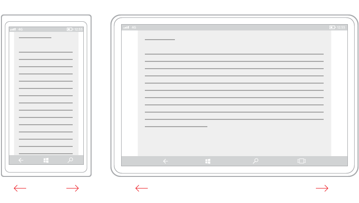
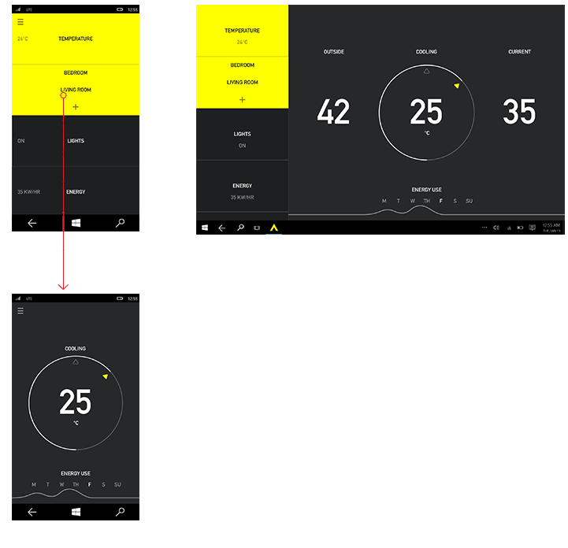

#  Introdução ao design de aplicativos UWP 

Um aplicativo UWP (Plataforma Universal do Windows) pode ser executado em qualquer dispositivo baseado no Windows, como um telefone, tablet ou computador.

Projetar um aplicativo que tenha boa aparência em uma variedade tão grande de dispositivos pode ser um grande desafio. Então, o que você diria de criar um aplicativo que ofereça uma ótima experiência de usuário em dispositivos com tamanhos de tela e métodos de entrada extremamente diferentes? Felizmente, a UWP (Plataforma Universal do Windows) fornece um conjunto de recursos internos e blocos de construção universais que o ajudam a fazer exatamente isso. 

Este artigo descreve os recursos de interface do usuário e os benefícios dos aplicativos UWP e fornece algumas diretrizes de design de alto nível para criar seu primeiro aplicativo UWP. Vamos começar analisando alguns recursos disponíveis ao criar um aplicativo UWP. 

## Recursos de aplicativo UWP

### Dimensionamento e pixels eficazes

Os aplicativos UWP ajustam automaticamente o tamanho de controles, fontes e outros elementos da interface do usuário para que eles sejam legíveis em todos os dispositivos.

Quando seu aplicativo é executado em um dispositivo da plataforma Windows, o sistema usa um algoritmo para normalizar a forma como os os elementos da interface do usuário são exibidos na tela. Esse algoritmo de dimensionamento leva em conta a distância de visualização e a densidade da tela (pixels por polegada) para otimizar o tamanho percebido (em vez do tamanho físico). O algoritmo de dimensionamento garante que uma fonte de 24 px no Surface Hub a 3 m de distância seja tão legível para o usuário quanto uma fonte de 24 px no telefone de 5' a alguns centímetros de distância.

Devido ao modo como o sistema de dimensionamento funciona, ao criar seu aplicativo UWP, você está criando em *pixels efetivos*, não pixels físicos reais. Portanto, como isso impacta a forma em que você projeta o seu aplicativo?

-   Você pode ignorar a densidade de pixels e a resolução de tela real ao projetar. Em vez disso, projete para a resolução efetiva (a resolução em pixels efetivos) de uma classe de tamanho (definimos classes de tamanho [mais adiante neste artigo](#sizeclasses)).

-   Quando o sistema escalona sua interface do usuário, ele faz isso em múltiplos de 4. Para garantir uma aparência nítida, ajuste seu design para uma grade de pixel 4x4: torne as margens, tamanhos e posições dos elementos da interface do usuário, e a posição (mas não o tamanho: o texto pode ser de qualquer tamanho) do texto um múltiplo de 4 pixels efetivos.

Esta ilustração mostra os elementos de design mapeados para a grade de pixels 4 x 4. O elemento de design sempre terá bordas nítidas e ajustadas.

A próxima ilustração mostra os elementos de design que não são mapeados para a grade de 4 x 4. Esses elementos de design terão bordas desfocadas, suaves, em alguns dispositivos.

            **Dica**   Ao criar modelos de tela em programas de edição de imagens, defina o DPI para 72 e defina as dimensões da imagem para a resolução efetiva da classe de tamanho pretendida. (Para obter uma lista de classes de tamanho e resoluções efetivas, consulte a seção [Recomendações para classes de tamanho específico](#sizeclasses) deste artigo.)

### Entrada universal e interações inteligentes

Outro recurso interno da UWP é a entrada universal habilitada por meio de interações inteligentes. Embora você possa criar seus aplicativos para dispositivos e modos de entrada específicos, isso não é obrigatório. Isso ocorre porque, por padrão, os aplicativos Universais do Windows dependem de interações inteligentes. Isso significa que você pode criar uma interação de clique sem precisar saber nem definir se o clique vem de um clique do mouse real ou do toque de um dedo.

### Controles e estilos universais

A UWP também fornece alguns blocos de construção úteis que facilitam a criação de aplicativos para várias famílias de dispositivos.

-   **Controles universais**

    A UWP fornece um conjunto de controles universais que têm garantia de funcionar bem em todos os dispositivos com Windows. Este conjunto de controles universais inclui tudo, desde os controles de formulário comuns, como botão de opção e caixa de texto, até controles sofisticados como o modo de exibição de grade e o modo de exibição de lista, que podem gerar listas de itens com base em um fluxo de dados e um modelo. Esses controles têm reconhecimento de entrada e são implantados com o conjunto adequado de opções de entrada, estados de eventos e a funcionalidade geral da família de cada dispositivo.

    Para obter uma lista completa desses controles e os padrões que você pode criar com base neles, consulte a seção [Controles e padrões](https://dev.windows.com/design/controls-patterns).

-   **Estilos universais**

    Seu UWP app obtém automaticamente um conjunto de estilos padrão que oferece estes recursos:

    -   Um conjunto de estilos que automaticamente proporciona ao seu aplicativo um tema claro ou escuro (sua escolha) e pode incorporar a preferência de cor de destaque do usuário.

        

    -   Uma rampa de tipos baseada em Segoe que garante que o texto do aplicativo tenha aparência nítida em todos os dispositivos.
    -   Animações padrão para interações.
    -   Suporte automático para modos de alto contraste. Os nossos estilos foram criados com alto contraste em mente para que, quando executados em um dispositivo em modo de alto contraste, o seu aplicativo seja exibido corretamente.
    -   Suporte automático para outros idiomas. Nossos estilos padrão selecionam automaticamente a fonte correta para cada idioma que tem suporte no Windows. Você pode até mesmo usar vários idiomas no mesmo aplicativo, e eles serão exibidos corretamente.
    -   Suporte interno para a ordem de leitura da direita para a esquerda.

    Você pode personalizar esses estilos padrão para dar um toque pessoal ao seu aplicativo, ou pode substituí-los completamente por seus próprios estilos para criar uma experiência visual única. Por exemplo, aqui está um design de um aplicativo de previsão de tempo com um estilo visual único:

    

Agora que descrevemos os blocos de construção de aplicativos UWP, vamos ver como reuni-los para criar uma interface do usuário. 
    
## A anatomia de um aplicativo UWP típico

Uma interface do usuário moderna é uma coisa complexa, composta de texto, formas, cores e animações que, em última análise, são compostas de pixels individuais da tela do dispositivo que você está usando. Quando você começa a criar uma interface do usuário, o grande número de opções pode ser complicado.

Para simplificar, vamos definir a anatomia de um aplicativo de uma perspectiva de design. Digamos que um aplicativo é composto de páginas e telas. Cada página tem uma interface do usuário, formada por três tipos de elementos de interface do usuário: elementos de navegação, comando e conteúdo.

<table>
<colgroup>
<col width="50%" />
<col width="50%" />
</colgroup>
<tbody>
<tr class="odd">
<td align="left">

</td>
<td align="left"><strong>Elementos de navegação</strong>

Os elementos de navegação ajudam os usuários a escolher o conteúdo que desejam exibir. Exemplos de elementos de navegação incluem [guias e pivôs](../controls-and-patterns/tabs-pivot.md), [hiperlinks](../controls-and-patterns/hyperlinks.md) e [painéis de navegação](../controls-and-patterns/nav-pane.md).

Os elementos de navegação são abordados em detalhes no artigo [Noções básicas de design de navegação](navigation-basics.md).

<strong>Elementos de comando</strong>

Os elementos de comando iniciam ações, como manipulação, gravação ou compartilhamento de conteúdo. Exemplos de elementos de comando incluem [botão](../controls-and-patterns/buttons.md) e a [barra de comandos](../controls-and-patterns/app-bars.md). Os elementos de comando também podem incluir atalhos do teclado que não ficam realmente visíveis na tela.

Elementos de comando são abordados em detalhes no artigo [Noções básicas de design de comando](commanding-basics.md).

<strong>Elementos de conteúdo</strong>

Os elementos de conteúdo exibem o conteúdo do aplicativo. Para um aplicativo de pintura, o conteúdo pode ser um desenho; para um aplicativo de notícias, o conteúdo pode ser um artigo de notícias.

Os elementos de conteúdo são abordados em detalhes no artigo [Noções básicas de design do conteúdo](content-basics.md).
</td>
</tr>
</tbody>
</table>

 

No mínimo, um aplicativo tem uma tela inicial e uma página inicial que define a interface do usuário. Um aplicativo típico tem várias páginas e telas, e os elementos de navegação, comando e conteúdo podem mudar de uma página para outra.

Ao decidir sobre os elementos da interface do usuário corretos para seu aplicativo, você também pode considerar os dispositivos e os tamanhos de tela em que o aplicativo será executado.

## Adaptar seu aplicativo para dispositivos e tamanhos de tela específicos.

Os aplicativos UWP usam pixels efetivos para garantir que seus elementos de design serão legíveis e utilizáveis em todos os dispositivos do Windows. Sendo assim, por que você desejaria personalizar a interface do usuário do seu aplicativo para uma família de dispositivos específica?

**Observação**  
Antes de prosseguirmos, o Windows não oferece uma forma de o seu aplicativo detectar o dispositivo específico em que o está sendo executado. Ele pode informar a família de dispositivos (móvel, área de trabalho etc) em que o aplicativo está sendo executado, a resolução efetiva e a quantidade de espaço na tela disponível para o aplicativo (o tamanho da janela do aplicativo).

 

-   **Para tornar o uso do espaço mais eficiente e reduzir a necessidade de navegar**

    Se você criar um aplicativo para ter uma boa aparência em um dispositivo que tenha uma tela pequena, como um telefone, o aplicativo poderá ser utilizado em um PC com uma tela muito maior, mas provavelmente haverá algum desperdício de espaço. Você pode personalizar o aplicativo para exibir mais conteúdo quando a tela tiver acima de um determinado tamanho. Por exemplo, um aplicativo de compras pode exibir uma categoria de mercadoria de cada vez em um telefone, mas mostrar várias categorias e produtos simultaneamente em um PC ou laptop.

    Ao colocar mais conteúdo na tela, você reduz a quantidade de navegação que o usuário precisa executar.

-   **Para tirar proveito dos recursos dos dispositivos**

    Certos dispositivos têm mais probabilidade de ter determinados recursos de dispositivo. Por exemplo, telefones têm probabilidade de ter um sensor de localização e uma câmera, enquanto um computador pode não ter nenhum dos dois. Seu aplicativo pode detectar quais recursos estão disponíveis e habilitar recursos que os utilizam.

-   **Otimizar para entrada**

    A biblioteca de controles universais funciona com todos os tipos de entrada (toque, caneta, teclado, mouse), mas você ainda pode otimizar para certos tipos de entrada reorganizando seus elementos de interface do usuário. Por exemplo, se você colocar elementos de navegação na parte inferior da tela, será mais fácil para os usuários de telefone acessá-los, mas a maioria dos usuários de computador espera ver os elementos de navegação na parte superior da tela.

## Técnicas de design responsivo

Quando você otimiza a interface do usuário de seu aplicativo para larguras de tela específicas, dizemos que você está criando um design responsivo. Aqui estão as seis técnicas de design responsivo que você pode usar para personalizar a interface do usuário do seu aplicativo.

### Reposicionar

Você pode alterar o local e a posição dos elementos de interface do usuário do aplicativo para obter o máximo de cada dispositivo. Neste exemplo, o modo de exibição retrato no telefone ou phablet necessita de uma interface do usuário de rolagem, pois somente um quadro completo é visível por vez. Quando o aplicativo é convertido em um dispositivo que permite dois quadros completos na tela, seja na orientação retrato ou paisagem, o quadro B pode ocupar um espaço dedicado. Se você estiver usando uma grade para posicionamento, poderá manter a mesma grade quando os elementos da interface do usuário forem reposicionados.

Neste design de exemplo para um aplicativo de fotos, o aplicativo de fotos reposiciona seu conteúdo em telas maiores.

### Redimensionar

Você pode otimizar o tamanho de quadro, ajustando as margens e o tamanho dos elementos da interface do usuário. Isso poderia permitir que você, como o exemplo aqui mostra, aumentasse a experiência de leitura em uma tela maior, simplesmente aumentando o quadro de conteúdo.

### Refluxo

Alterando o fluxo de elementos da interface do usuário com base no dispositivo e na orientação, seu aplicativo pode oferecer uma exibição ideal do conteúdo. Por exemplo, ao passar para uma tela maior, talvez faça sentido alternar contêineres maiores, adicionar colunas e gerar itens de lista de maneira diferente.

Este exemplo mostra como uma única coluna de conteúdo de rolagem vertical no telefone ou phablet pode refluir em uma tela maior para exibir duas colunas de texto.

###  Revelação

Você pode revelar a interface do usuário com base no estado real da tela, ou quando o dispositivo dá suporte a funcionalidades adicionais, situações específicas ou orientações de tela preferenciais.

Neste exemplo com guias, a guia do meio com o ícone de câmera pode ser específica ao aplicativo no telefone ou phablet e não ser aplicável a dispositivos maiores; é por isso que ela é revelada no dispositivo à direita. Outro exemplo comum de revelar ou ocultar a interface do usuário se aplica aos controles do media player, onde o conjunto de botões é reduzido em dispositivos menores e expandido em dispositivos maiores. O media player no computador, por exemplo, pode lidar com muito mais funcionalidades na tela do que em um telefone.

Parte da técnica de revelar ou ocultar inclui escolher quando exibir mais metadados. Quando o estado real é fundamental, como em um telefone ou phablet, é melhor mostrar uma quantidade mínima de metadados. Em um notebook ou computador desktop, uma quantidade significativa de metadados pode ser mostrada. Alguns exemplos de mostrar ou ocultar metadados incluem:

-   Em um aplicativo de email, você pode exibir o avatar do usuário.
-   Em um aplicativo de música, você pode exibir mais informações sobre um álbum ou artista.
-   Em um aplicativo de vídeo, você pode exibir mais informações sobre um filme ou um programa, como mostrar detalhes do elenco e da equipe.
-   Em qualquer aplicativo, você pode separar colunas e revelar mais detalhes.
-   Em qualquer aplicativo, você pode pegar algo que esteja empilhado verticalmente e dispor horizontalmente. Ao passar do telefone ou phablet para dispositivos maiores, os itens de lista empilhados podem mudar para revelar as linhas de itens de lista e colunas de metadados.

### Substituir

Esta técnica permite que você alterne a interface do usuário de uma classe de tamanho de dispositivo ou orientação específica. Neste exemplo, o painel de navegação e sua interface de usuário compacta, transitória, funciona bem em um dispositivo menor, mas em um dispositivo maior, guias podem ser uma melhor opção.

###  Rearquitetura

Você pode recolher ou bifurcar a arquitetura do seu aplicativo para melhor direcionar dispositivos específicos. Neste exemplo, ir do dispositivo à esquerda para o dispositivo à direita demonstra a junção de páginas.

Veja um exemplo dessa técnica aplicada ao design para um aplicativo inicial inteligente.

## Artigos relacionados

- [O que é um aplicativo UWP?](https://msdn.microsoft.com/library/windows/apps/dn726767.aspx)

 

<!--HONumber=Jun16_HO4-->

