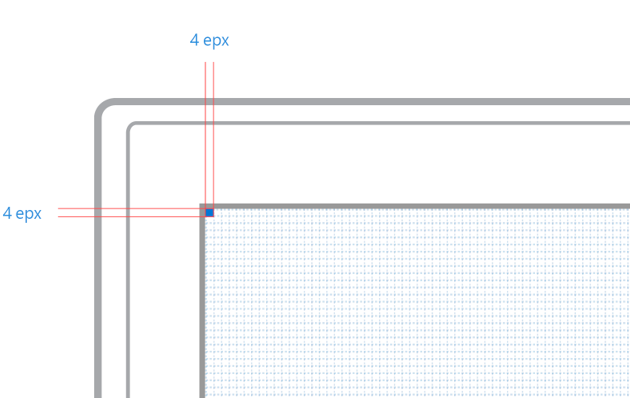

# Unidade base

A grade do Windows é construída a partir de unidades de 4 × 4px. Esses são **pixels efetivos**, não pixels físicos. Os elementos dentro de layouts sempre devem ser dimensionados em incrementos de 4px. Isso cria um ritmo familiar que fornece equilíbrio e coesão.

# Pixels efetivos

O pixel efetivo é uma unidade virtual de medição. Ele é usado para expressar dimensões e espaçamento do layout, independente da densidade de pixels da tela (também conhecida como pontos por polegada ou DPI). Os pixels efetivos permitem que você se concentre no tamanho percebido real dos elementos da interface do usuário sem precisar se preocupar com a densidade de pixels do dispositivo em que ele está sendo executado.

Na maioria dos casos, podemos simplesmente abreviar pixels efetivos como px uma vez que nunca fazemos o layout com pixels físicos.

<video class="video-responsive" controls>
    <source src="assets/grid/epx.mp4" type="video/mp4" />
    Oops! Your browser doesn't seem to support this video. Sorry about that.
</video>

<aside class="aside-dev">
    

        Developer Notes
    

    

            Although XAML doesn't specify units for its widths, heights, margins, and padding, they are all implicitly measured in effective pixels.
    

</aside>

# Destinos de toque

48 × 48px é o tamanho ideal para um elemento que precisa ser tocado. No entanto, esse tamanho pode ser reduzido adicionalmente para 44 × 44px quando em restrições de tamanho e talvez quando interagido com menos frequência. Se uma altura menor for necessária, 32 × 120px é outra opção que só deve ser usada na área de trabalho e em computadores 2 em 1.

<!--HONumber=Mar16_HO4-->

