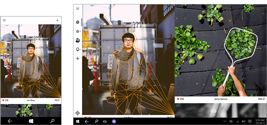

# Layout para aplicativos UWP
<link rel="stylesheet" href="https://az835927.vo.msecnd.net/sites/uwp/Resources/css/custom.css"> 

A estrutura, o layout de página e a navegação do aplicativo são a base da experiência do usuário de seu aplicativo. Os artigos nesta seção ajudarão você a criar um aplicativo que seja fácil de navegar e tenha um visual espetacular em uma variedade de dispositivos e tamanhos de tela.

## Introdução

  

  
<b>[Introdução ao design da interface do usuário de aplicativos](design-and-ui-intro.md)</b> 
Ao desenvolver um aplicativo UWP, você cria uma interface do usuário adequada a vários dispositivos com tamanhos de tela diferentes. Este artigo fornece uma visão geral dos recursos relacionados à interface do usuário e dos benefícios dos aplicativos UWP e algumas dicas e truques para projetar uma interface do usuário responsiva. 

  

  

    
  

## Estrutura e layout do aplicativo
Confira essas recomendações para estruturar seu aplicativo e usar os três tipos de elementos de interface do usuário: navegação, comandos e conteúdo.

  

<b>[Noções básicas de navegação](navigation-basics.md)</b> 
A navegação em aplicativos UWP se baseia em um modelo flexível de estruturas de navegação, elementos de navegação e recursos de nível do sistema. Este artigo apresenta esses componentes e mostra como usá-los juntos para proporcionar uma boa experiência de navegação.

<b>[Noções básicas de conteúdo](content-basics.md)</b> 
O objetivo principal de qualquer aplicativo é fornecer acesso ao conteúdo: em um aplicativo de edição de fotos, a foto é o conteúdo; em um aplicativo de viagens, mapas e informações sobre destinos de viagem são o conteúdo; e assim por diante. Este artigo fornece recomendações de design de conteúdo para os três cenários de conteúdo: consumo, criação e interação.

 
  

  

<b>[Noções básicas de comandos](commanding-basics.md)</b>  
Elementos de comando são os elementos interativos da interface do usuário que permitem ao usuário executar ações, como enviar um email, excluir um item ou enviar um formulário. Este artigo descreve os elementos de comando, como botões e caixas de seleção, as interações a que eles dão suporte e as superfícies de comando (por exemplo, barras de comandos e menus de contexto) para hospedá-los.

  

## Layout de página 
Estes artigos ajudarão você a criar uma interface do usuário flexível que tenha um visual espetacular em diferentes tamanhos de tela, tamanhos de janela, resoluções e orientações. 

  

   
<b>[Tamanhos de tela e pontos de interrupção](screen-sizes-and-breakpoints-for-responsive-design.md)</b> 
O número de destinos de dispositivo e tamanhos de tela do ecossistema do Windows 10 é muito grande para você se preocupar com a otimização de sua interface do usuário em cada um deles. Em vez disso, recomendamos projetar para algumas larguras principais (também chamadas de "pontos de interrupção"): 360, 640, 1024 e 1366 epx.

  

  

 
<b>[Definir layouts com XAML](layouts-with-xaml.md)</b>  
Como usar painéis de layout e propriedades XAML para deixar seu aplicativo dinâmico e adaptável.

  

  

   
<b>[Painéis de layout](layout-panels.md)</b>  
Saiba mais sobre cada tipo de layout de cada painel e veja como usá-los para criar o layout de elementos de interface do usuário em XAML.

  

  

 
<b>[Alinhamento, margens e preenchimento](alignment-margin-padding.md)</b>  
Além das propriedades de dimensão (largura, altura e restrições), os elementos também podem ter as propriedades de alinhamento, margem e preenchimento que influenciam o comportamento do layout quando um elemento passa por um cálculo de layout e é renderizado em uma interface do usuário.
 
  

<!--HONumber=Dec16_HO2-->

