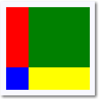
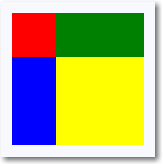

# Painéis de layout

Você usa os painéis de layout para organizar e agrupar elementos de interface do usuário em seu aplicativo. Os painéis de layout XAML internos incluem [**RelativePanel**](https://msdn.microsoft.com/library/windows/apps/xaml/windows.ui.xaml.controls.relativepanel.aspx), [**StackPanel**](https://msdn.microsoft.com/library/windows/apps/xaml/windows.ui.xaml.controls.stackpanel.aspx), [**Grid**](https://msdn.microsoft.com/library/windows/apps/xaml/windows.ui.xaml.controls.grid.aspx), [**VariableSizedWrapGrid**](https://msdn.microsoft.com/library/windows/apps/xaml/windows.ui.xaml.controls.variablesizedwrapgrid.aspx) e [**Canvas**](https://msdn.microsoft.com/library/windows/apps/xaml/windows.ui.xaml.controls.canvas.aspx). Descrevemos aqui cada painel e mostramos como usá-lo no layout dos elementos de interface do usuário XAML.

Há várias coisas a serem consideradas ao se escolher um painel de layout:
- Como o painel posiciona seus elementos filho.
- Como o painel dimensiona seus elementos filho.
- Como elementos filho sobrepostos são colocados uns sobre os outros (ordem z).
- O número e a complexidade dos elementos de painel aninhado necessários para criar o layout desejado.


**Propriedades anexadas do painel**

A maioria dos painéis de layout XAML usa propriedades anexadas para permitir que seus elementos filho informem ao painel pai como eles devem ser posicionados na interface do usuário. As propriedades anexadas usam a sintaxe *AttachedPropertyProvider.PropertyName*. Se você tiver painéis aninhados dentro de outros painéis, as propriedades anexadas em elementos de interface do usuário que especificam características de layout a um pai só serão interpretadas pelo painel pai mais imediato.

Aqui está um exemplo de como você pode definir a propriedade anexada [**Canvas.Left**](https://msdn.microsoft.com/library/windows/apps/xaml/windows.ui.xaml.controls.canvas.left.aspx) em um controle Button em XAML. Isso informa ao Canvas pai que o Button deve ser posicionado a 50 pixels efetivos em relação à borda esquerda do Canvas.

```xaml
<Canvas>
  <Button Canvas.Left="50">Hello</Button>
</Canvas>
```

Para obter mais informações sobre propriedades anexadas, consulte [Visão geral das propriedades anexadas](../xaml-platform/attached-properties-overview.md).

> **Observação**
            &nbsp;&nbsp;Uma propriedade anexada é um conceito XAML que exige uma sintaxe especial para obtenção ou definição com base no código. Para usar propriedades anexadas no código, consulte a seção *Propriedades anexadas no código* do artigo *Visão geral das propriedades anexadas*.

**Bordas do painel**

Os painéis RelativePanel, StackPanel e Grid definem as propriedades da borda que permitem que você desenhe uma borda ao redor do painel sem encapsulá-los em um elemento Border adicional. As propriedades de borda são **BorderBrush**, **BorderThickness**, **CornerRadius** e **Padding**.

Aqui está um exemplo de como definir propriedades da borda em um Grid.

```xaml
<Grid BorderBrush="Blue" BorderThickness="12" CornerRadius="12" Padding="12">
    <TextBlock Text="Hello World!"/>
</Grid>
```


O uso das propriedades de borda internas reduz a contagem de elementos XAML, o que pode melhorar o desempenho da interface do usuário do seu aplicativo. Para obter mais informações sobre painéis de layout e desempenho de interface do usuário, consulte [Otimizar seu layout XAML](https://msdn.microsoft.com/en-us/library/windows/apps/mt404609.aspx).

## RelativePanel

[
              **RelativePanel**
            ](https://msdn.microsoft.com/library/windows/apps/xaml/windows.ui.xaml.controls.relativepanel.aspx) permite definir o layout dos elementos de interface do usuário de layout especificando onde eles devem ficar em relação a outros elementos e em relação ao painel. Por padrão, um elemento é posicionado no canto superior esquerdo do painel. Você pode usar RelativePanel com um [**VisualStateManager**](https://msdn.microsoft.com/library/windows/apps/xaml/windows.ui.xaml.visualstatemanager.aspx) e [**AdaptiveTrigger**](https://msdn.microsoft.com/library/windows/apps/xaml/windows.ui.xaml.adaptivetrigger.aspx)s a fim de reorganizar a interface do usuário para diferentes tamanhos de janela.

Esta tabela mostra as propriedades anexadas que você pode usar para alinhar um elemento com a borda ou com o centro do painel, além de alinhar e posicioná-lo em relação a outros elementos.

Alinhamento do painel | Alinhamento do irmão | Posição do irmão
----------------|-------------------|-----------------
[**AlignTopWithPanel**](https://msdn.microsoft.com/library/windows/apps/xaml/windows.ui.xaml.controls.relativepanel.aligntopwithpanel.aspx) | [**AlignTopWith**](https://msdn.microsoft.com/library/windows/apps/xaml/windows.ui.xaml.controls.relativepanel.aligntopwith.aspx) | [**Above**](https://msdn.microsoft.com/library/windows/apps/xaml/windows.ui.xaml.controls.relativepanel.above.aspx)  
[**AlignBottomWithPanel**](https://msdn.microsoft.com/library/windows/apps/xaml/windows.ui.xaml.controls.relativepanel.alignbottomwithpanel.aspx) | [**AlignBottomWith**](https://msdn.microsoft.com/library/windows/apps/xaml/windows.ui.xaml.controls.relativepanel.alignbottomwith.aspx) | [**Below**](https://msdn.microsoft.com/library/windows/apps/xaml/windows.ui.xaml.controls.relativepanel.below.aspx)  
[**AlignLeftWithPanel**](https://msdn.microsoft.com/library/windows/apps/xaml/windows.ui.xaml.controls.relativepanel.alignleftwithpanel.aspx) | [**AlignLeftWith**](https://msdn.microsoft.com/library/windows/apps/xaml/windows.ui.xaml.controls.relativepanel.alignleftwith.aspx) | [**LeftOf**](https://msdn.microsoft.com/library/windows/apps/xaml/windows.ui.xaml.controls.relativepanel.leftof.aspx)  
[**AlignRightWithPanel**](https://msdn.microsoft.com/library/windows/apps/xaml/windows.ui.xaml.controls.relativepanel.alignrightwithpanel.aspx) | [**AlignRightWith**](https://msdn.microsoft.com/library/windows/apps/xaml/windows.ui.xaml.controls.relativepanel.alignrightwith.aspx) | [**RightOf**](https://msdn.microsoft.com/library/windows/apps/xaml/windows.ui.xaml.controls.relativepanel.rightof.aspx)  
[**AlignHorizontalCenterWithPanel**](https://msdn.microsoft.com/library/windows/apps/xaml/windows.ui.xaml.controls.relativepanel.alignhorizontalcenterwithpanel.aspx) | [**AlignHorizontalCenterWith**](https://msdn.microsoft.com/library/windows/apps/xaml/windows.ui.xaml.controls.relativepanel.alignhorizontalcenterwith.aspx) | &nbsp;   
[**AlignVerticalCenterWithPanel**](https://msdn.microsoft.com/library/windows/apps/xaml/windows.ui.xaml.controls.relativepanel.alignverticalcenterwithpanel.aspx) | [**AlignVerticalCenterWith**](https://msdn.microsoft.com/library/windows/apps/xaml/windows.ui.xaml.controls.relativepanel.alignverticalcenterwith.aspx) | &nbsp;   

 
Este XAML mostra como organizar os elementos em um RelativePanel.

```xaml
<RelativePanel BorderBrush="Gray" BorderThickness="1">
    <Rectangle x:Name="RedRect" Fill="Red" Height="44" Width="44"/>
    <Rectangle x:Name="BlueRect" Fill="Blue"
               Height="44" Width="88"
               RelativePanel.RightOf="RedRect" />

    <Rectangle x:Name="GreenRect" Fill="Green" 
               Height="44"
               RelativePanel.Below="RedRect" 
               RelativePanel.AlignLeftWith="RedRect" 
               RelativePanel.AlignRightWith="BlueRect"/>
    <Rectangle Fill="Yellow"
               RelativePanel.Below="GreenRect" 
               RelativePanel.AlignLeftWith="BlueRect" 
               RelativePanel.AlignRightWithPanel="True"
               RelativePanel.AlignBottomWithPanel="True"/>
</RelativePanel>
```

O resultado tem a seguinte aparência. 


Aqui estão algumas coisas a serem observadas sobre o dimensionamento dos retângulos.
- O retângulo vermelho recebe um tamanho explícito de 44 x 44. Ele é colocado no canto superior esquerdo do painel, que é a posição padrão.
- O retângulo verde recebe uma altura explícita de 44. Seu lado esquerdo é alinhado com o retângulo vermelho, e o lado direito é alinhado com o retângulo azul, o que determina a largura.
- O retângulo amarelo não recebe um tamanho explícito. Seu lado esquerdo é alinhado com o retângulo azul. As bordas direita e inferior são alinhadas com a borda do painel. Seu tamanho é determinado por esses alinhamentos e será redimensionado à medida que o painel for redimensionado.

## StackPanel

[
              **StackPanel**
            ](https://msdn.microsoft.com/library/windows/apps/xaml/windows.ui.xaml.controls.stackpanel.aspx) é um painel de layout simples que organiza seus elementos filho em uma única linha que pode ser orientada horizontal ou verticalmente. Os controles StackPanel normalmente são usados em cenários em que você quer organizar uma pequena subseção da interface do usuário em sua página.

Você pode usar a propriedade [**Orientation**](https://msdn.microsoft.com/library/windows/apps/xaml/windows.ui.xaml.controls.stackpanel.orientation.aspx) para especificar a direção dos elementos filho. A orientação padrão é [**Vertical**](https://msdn.microsoft.com/library/windows/apps/xaml/windows.ui.xaml.controls.orientation.aspx).

O XAML a seguir mostra como criar um StackPanel vertical dos itens.

```xaml
<StackPanel>
    <Rectangle Fill="Red" Height="44"/>
    <Rectangle Fill="Blue" Height="44"/>
    <Rectangle Fill="Green" Height="44"/>
    <Rectangle Fill="Yellow" Height="44"/>
</StackPanel>
```


O resultado tem a seguinte aparência.


Em um StackPanel, se o tamanho de um elemento filho não for definido explicitamente, ele se ampliará para preencher a largura disponível (ou a altura, se Orientation for **Horizontal**). Neste exemplo, a largura dos retângulos não está definida. Os retângulos se expandem para preencher toda a largura do StackPanel.

## Grade

O painel [**Grid**](https://msdn.microsoft.com/library/windows/apps/xaml/windows.ui.xaml.controls.grid.aspx) dá suporte à organização de controles em layouts com várias linhas e várias colunas. Você pode especificar linhas e colunas de um painel Grid usando as propriedades [**RowDefinitions**](https://msdn.microsoft.com/library/windows/apps/xaml/windows.ui.xaml.controls.grid.rowdefinitions.aspx) e [**ColumnDefinitions**](https://msdn.microsoft.com/library/windows/apps/xaml/windows.ui.xaml.controls.grid.columndefinitions.aspx). Em XAML, use a sintaxe do elemento de propriedade para declarar as linhas e as colunas dentro do elemento Grid. Você pode distribuir o espaço em uma coluna ou linha usando o dimensionamento **Auto** ou em estrela.

Você posiciona os objetos em células específicas do Grid usando as propriedades anexadas [**Grid.Column**](https://msdn.microsoft.com/library/windows/apps/xaml/windows.ui.xaml.controls.grid.column.aspx) e [**Grid.Row**](https://msdn.microsoft.com/library/windows/apps/xaml/windows.ui.xaml.controls.grid.row.aspx).

Você pode fazer o conteúdo abranger várias linhas e colunas usando as propriedades anexadas [**Grid.RowSpan**](https://msdn.microsoft.com/library/windows/apps/xaml/windows.ui.xaml.controls.grid.rowspan.aspx) e [**Grid.ColumnSpan**](https://msdn.microsoft.com/library/windows/apps/xaml/windows.ui.xaml.controls.grid.columnspan.aspx).

Este exemplo de XAML a seguir mostra como criar um Grid com três linhas e duas colunas. A altura da primeira e terceira linhas é grande o suficiente para conter o texto. A altura da segunda linha usa o resto da altura disponível. A largura das colunas é dividida igualmente dentro da largura do contêiner disponível.

```xaml
<Grid>
    <Grid.RowDefinitions>
        <RowDefinition/>
        <RowDefinition Height="44"/>
    </Grid.RowDefinitions>
    <Grid.ColumnDefinitions>
        <ColumnDefinition Width="Auto"/>
        <ColumnDefinition/>
    </Grid.ColumnDefinitions>
    <Rectangle Fill="Red" Width="44"/>
    <Rectangle Fill="Blue" Grid.Row="1"/>
    <Rectangle Fill="Green" Grid.Column="1"/>
    <Rectangle Fill="Yellow" Grid.Row="1" Grid.Column="1"/>
</Grid>
```


O resultado tem a seguinte aparência.



Neste exemplo, o dimensionamento funciona da maneira a seguir: 
- A segunda linha tem uma altura explícita de 44 pixels efetivos. Por padrão, a altura da primeira linha preenche o espaço deixado.
- A largura da primeira coluna é definida como **Auto**, de maneira que ele seja largo o suficiente para seus filhos. Nesse caso, são 44 pixels efetivos de largura para acomodar a largura do retângulo vermelho.
- Como não há outra restrição de tamanho em relação aos retângulos, cada um se amplia para preencher a célula da grade em que está.

## VariableSizedWrapGrid

[
              **VariableSizedWrapGrid**
            ](https://msdn.microsoft.com/library/windows/apps/xaml/windows.ui.xaml.controls.variablesizedwrapgrid.aspx) oferece um painel de layout do estilo grade em que os elementos são organizados em linhas ou colunas que se encapsulam automaticamente em uma nova linha ou coluna quando o valor [**MaximumRowsOrColumns**](https://msdn.microsoft.com/library/windows/apps/xaml/windows.ui.xaml.controls.variablesizedwrapgrid.maximumrowsorcolumns.aspx) é alcançado. 

A propriedade [**Orientation**](https://msdn.microsoft.com/library/windows/apps/xaml/windows.ui.xaml.controls.variablesizedwrapgrid.orientation.aspx) especifica se a grade adiciona seus itens em linhas ou colunas antes do encapsulamento. A orientação padrão é **Vertical**, o que significa que a grade adiciona itens de cima para baixo até que uma coluna esteja cheia e, em seguida, encapsula em uma nova coluna. Quando o valor é **Horizontal**, a grade adiciona itens da esquerda para a direita e, em seguida, encapsula em uma nova linha.

As dimensões da célula são especificadas por [**ItemHeight**](https://msdn.microsoft.com/library/windows/apps/xaml/windows.ui.xaml.controls.variablesizedwrapgrid.itemheight.aspx) e [**ItemWidth**](https://msdn.microsoft.com/library/windows/apps/xaml/windows.ui.xaml.controls.variablesizedwrapgrid.itemwidth.aspx). Cada célula tem o mesmo tamanho. Caso ItemHeight ou ItemWidth não seja especificado, o tamanho da primeira célula se ajusta a seu conteúdo, e todas as demais células mantêm o tamanho da primeira célula.

Você pode usar as propriedades anexadas [**VariableSizedWrapGrid.ColumnSpan**](https://msdn.microsoft.com/library/windows/apps/xaml/windows.ui.xaml.controls.variablesizedwrapgrid.columnspan.aspx) e [**VariableSizedWrapGrid.RowSpan**](https://msdn.microsoft.com/library/windows/apps/xaml/windows.ui.xaml.controls.variablesizedwrapgrid.rowspan.aspx) para especificar quantas células adjacentes um elemento filho deve preencher.

Aqui está como usar um VariableSizedWrapGrid em XAML.

```xaml
<VariableSizedWrapGrid MaximumRowsOrColumns="3" ItemHeight="44" ItemWidth="44">
    <Rectangle Fill="Red"/>
    <Rectangle Fill="Blue" 
               VariableSizedWrapGrid.RowSpan="2"/>
    <Rectangle Fill="Green" 
               VariableSizedWrapGrid.ColumnSpan="2"/>
    <Rectangle Fill="Yellow" 
               VariableSizedWrapGrid.RowSpan="2" 
               VariableSizedWrapGrid.ColumnSpan="2"/>
</VariableSizedWrapGrid>
```


O resultado tem a seguinte aparência.



Neste exemplo, o número máximo de linhas em cada coluna é três. A primeira coluna contém apenas dois itens (os retângulos vermelho e azul) porque o retângulo azul abrange duas linhas. O retângulo verde encapsula na parte superior da coluna seguinte.

## Canvas

O painel [**Canvas**](https://msdn.microsoft.com/library/windows/apps/xaml/windows.ui.xaml.controls.canvas.aspx) posiciona seus elementos filho usando pontos de coordenada fixos. Especifique os pontos nos elementos filho individuais definindo as propriedades anexadas [**Canvas.Left**](https://msdn.microsoft.com/library/windows/apps/xaml/windows.ui.xaml.controls.canvas.left.aspx) e [**Canvas.Top**](https://msdn.microsoft.com/library/windows/apps/xaml/windows.ui.xaml.controls.canvas.top.aspx) em cada elemento. Durante o layout, o Canvas pai lê esses valores de propriedades anexadas de seus filhos e usa esses valores durante o cálculo do layout [Arrange](https://msdn.microsoft.com/library/windows/apps/xaml/windows.ui.xaml.uielement.arrange.aspx).

Objetos em um Canvas podem se sobrepor, quando um objeto é desenhado um sobre o outro. Por padrão, o Canvas renderiza os objetos filho na ordem em que estão declarados, logo, o último filho é renderizado na parte superior (cada elemento tem um padrão z-index igual a 0). Ele é o mesmo de outros painéis internos. No entanto, Canvas também dá suporte à propriedade anexada [**Canvas.ZIndex**](https://msdn.microsoft.com/library/windows/apps/xaml/windows.ui.xaml.controls.canvas.zindex.aspx) que você pode definir em cada um dos elementos filho. Você pode definir essa propriedade no código para alterar a ordem de desenho dos elementos durante o tempo de execução. O elemento com o maior valor Canvas.ZIndex é desenhado por último e por isso é desenhado sobre quaisquer outros elementos que compartilhem o mesmo espaço ou se sobreponham de alguma maneira. Observe que o valor alfa (transparência) é respeitado, por isso mesmo se os elementos ficarem sobrepostos, o conteúdo mostrado em áreas sobrepostas poderá ser mesclado se o superior tiver um valor alfa que não seja máximo.

O Canvas não faz nenhum dimensionamento dos seus filhos. Cada elemento deve especificar seu tamanho.

Aqui está um exemplo de um Canvas em XAML.

```xaml
<Canvas Width="120" Height="120">
    <Rectangle Fill="Red" Height="44" Width="44"/>
    <Rectangle Fill="Blue" Height="44" Width="44" Canvas.Left="20" Canvas.Top="20"/>
    <Rectangle Fill="Green" Height="44" Width="44" Canvas.Left="40" Canvas.Top="40"/>
    <Rectangle Fill="Yellow" Height="44" Width="44" Canvas.Left="60" Canvas.Top="60"/>
</Canvas>
```


O resultado tem a seguinte aparência.


Use o painel Canvas com cautela. Apesar de ser conveniente poder controlar com precisão as posições dos elementos da interface do usuário para alguns cenários, um painel de layout com posição fixa faz com que a área da interface do usuário seja menos adaptável a mudanças gerais no tamanho das janelas do aplicativo. O redimensionamento de janelas do aplicativo pode ser proveniente de mudanças na orientação do dispositivo, janelas de aplicativo dividido, mudança de monitores e inúmeros outros cenários dos usuários.

## Painéis para ItemsControl

Existem vários painéis de finalidade especial que podem ser usados apenas como um [**ItemsPanel**](https://msdn.microsoft.com/library/windows/apps/xaml/windows.ui.xaml.controls.itemscontrol.itemspanel.aspx) para exibir itens em um [**ItemsControl**](https://msdn.microsoft.com/library/windows/apps/xaml/windows.ui.xaml.controls.itemscontrol.aspx). Eles são [**ItemsStackPanel**](https://msdn.microsoft.com/library/windows/apps/xaml/windows.ui.xaml.controls.itemsstackpanel.aspx), [**ItemsWrapGrid**](https://msdn.microsoft.com/library/windows/apps/xaml/windows.ui.xaml.controls.itemswrapgrid.aspx), [**VirtualizingStackPanel**](https://msdn.microsoft.com/library/windows/apps/xaml/windows.ui.xaml.controls.virtualizingstackpanel.aspx) e [**WrapGrid**](https://msdn.microsoft.com/library/windows/apps/xaml/windows.ui.xaml.controls.wrapgrid.aspx). Você não pode usar esses painéis no layout de interface do usuário geral.


<!--HONumber=May16_HO2-->


