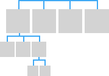
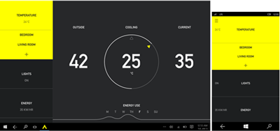
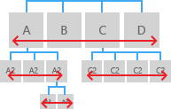

#  Noções básicas de design de navegação para aplicativos UWP

A navegação em aplicativos da Plataforma Universal do Windows (UWP) é baseada em um modelo flexível de estruturas de navegação, elementos de navegação e recursos no nível do sistema. Juntos, eles permitem diversas experiências de usuário ao se mover entre aplicativos, páginas e conteúdos.

Em alguns casos, você poderá ajustar todo o conteúdo e funcionalidade em uma única página do seu aplicativo sem exigir que o usuário faça nada mais do que movimento panorâmico para navegar pelo conteúdo. No entanto, a maioria dos aplicativos normalmente tem várias páginas de conteúdo e funcionalidades para explorar, se envolver e interagir. Quando um aplicativo tem mais de uma página, você precisa oferecer a experiência de navegação certa.

Para serem bem-sucedidas e fazerem sentido para os usuários, as experiências de navegação de várias páginas em aplicativos UWP incluem (os detalhes são descritos posteriormente):

-   **A estrutura de navegação correta**

    Criar uma estrutura de navegação que faça sentido para o usuário é fundamental para criar uma experiência de navegação intuitiva.

-   
            **Elementos de navegação compatíveis** que deem suporte à estrutura escolhida.

    Elementos de navegação podem ajudar o usuário a acessar o conteúdo desejado e também permitem que os usuários saibam onde eles estão dentro do aplicativo. No entanto, eles também ocupam um espaço que poderia ser usado para elementos de conteúdo ou comandos, logo, é importante usar os elementos de navegação certos para a estrutura do seu aplicativo.

-   **Respostas apropriadas para recursos de navegação no nível do sistema (como Voltar)**

    Para oferecer uma experiência consistente que pareça intuitiva, responda a recursos de navegação no nível do sistema de maneiras previsíveis.

## Criar a estrutura de navegação correta

Vamos olhar para um aplicativo como uma coleção de grupos de páginas, na qual cada página contém um conjunto exclusivo de conteúdos ou funcionalidades. Por exemplo, um aplicativo de fotos pode ter uma página para tirar fotos, uma página para edição de imagens e outra página para o gerenciamento de sua biblioteca de imagens. A maneira em que você organiza essas páginas em grupos define a estrutura de navegação do aplicativo. Há duas maneiras comuns de organizar um grupo de páginas:

<table>
<colgroup>
<col width="50%" />
<col width="50%" />
</colgroup>
<thead>
<tr class="header">
<th align="left">Em uma hierarquia</th>
<th align="left">Como pares</th>
</tr>
</thead>
<tbody>
<tr class="odd">
<td align="left">

</td>
<td align="left">

</td>
</tr>
<tr class="even">
<td align="left">
As páginas são organizadas em uma estrutura de árvore. Cada página filho tem apenas um pai, mas um pai pode ter uma ou mais páginas filho. Para acessar uma página filho, você passa pela página pai.
</td>
<td align="left">
As páginas existem lado a lado. Você pode ir de uma página para outra em qualquer ordem.
</td>
</tr>
</tbody>
</table>

 

Um aplicativo típico usará as duas organizações, com algumas partes sendo organizados como pares e outras em hierarquias.

Então, quando você deve organizar as páginas em hierarquias e quando deve organizá-las como pares? Para responder a essa pergunta, devemos considerar o número de páginas no grupo, se as páginas devem ser percorridas em uma ordem específica e o relacionamento entre as páginas. Em geral, estruturas mescladas são mais fáceis de entender e mais rápidas de navegar, mas às vezes é apropriado ter uma hierarquia profunda.

<table>
<colgroup>
<col width="50%" />
<col width="50%" />
</colgroup>
<tbody>
<tr class="odd">
<td align="left">
Recomendamos usar uma relação hierárquica quando

<ul>
<li>
Você espera que o usuário percorra as páginas em uma ordem específica. Organize a hierarquia para impor essa ordem.
</li>
<li>
Há uma relação de pai-filho clara entre uma das páginas e as outras páginas do grupo.
</li>
<li>
Se houver mais de 7 páginas no grupo.

Quando há mais de 7 páginas no grupo, talvez seja difícil para os usuários compreender como as páginas são únicas ou entender sua localização atual dentro do grupo. Se você não achar que isso é um problema para seu aplicativo, vá em frente e torne as páginas pares. Caso contrário, considere a possibilidade de usar uma estrutura hierárquica para quebrar as páginas em dois ou mais grupos menores. (Um controle hub pode ajudá-lo a agrupar as páginas em categorias).
</li>
</ul></td>
<td align="left">
Recomendamos usar uma relação de pares quando

<ul>
<li>As páginas podem ser vistas em qualquer ordem.</li>
<li>As páginas são claramente distintas umas das outros e não têm uma relação pai/filho óbvia.</li>
<li>
Há menos de 8 páginas no grupo.

Quando há mais de 7 páginas no grupo, talvez seja difícil para os usuários compreender como as páginas são únicas ou entender sua localização atual dentro do grupo. Se você não achar que isso é um problema para seu aplicativo, vá em frente e torne as páginas pares. Caso contrário, considere a possibilidade de usar uma estrutura hierárquica para quebrar as páginas em dois ou mais grupos menores. (Um controle hub pode ajudá-lo a agrupar as páginas em categorias).
</li>
</ul></td>
</tr>
</tbody>
</table>

 

## Use os elementos de navegação para a direita

Elementos de navegação podem fornecer dois serviços: eles ajudam o usuário a acessar o conteúdo desejado e alguns elementos também permitem que os usuários saibam onde eles estão dentro do aplicativo. No entanto, eles também ocupam espaço que o aplicativo poderia usar para elementos de conteúdo ou comandos, portanto, é importante usar os elementos de navegação que sejam ideais para a estrutura do seu aplicativo.

### Elementos de navegação ponto a ponto

Os elementos de navegação ponto a ponto permitem a navegação entre páginas no mesmo nível da mesma subárvore.

Para a navegação ponto a ponto, recomendamos o uso de guias ou de um painel de navegação.

<table>
<colgroup>
<col width="50%" />
<col width="50%" />
</colgroup>
<thead>
<tr class="header">
<th align="left">Elemento de navegação</th>
<th align="left">Descrição</th>
</tr>
</thead>
<tbody>
<tr class="odd">
<td align="left">
[Guias e pivôs](../controls-and-patterns/tabs-pivot.md)

</td>
<td align="left">Exibe uma lista persistente de links para páginas no mesmo nível.

Use guias/pivôs quando:

<ul>
<li>
Existem de 2 a 5 páginas.

(Você pode usar guias/pivôs quando houver mais de cinco páginas, mas pode ser difícil ajustar todas as guias/pivôs na tela.)
</li>
<li>Você espera que os usuários alternem entre as páginas com frequência.</li>
</ul>

Este design para um aplicativo de localização de restaurantes usa guias/pivôs:

</td>
</tr>
<tr class="even">
<td align="left">
[Painel de navegação](../controls-and-patterns/nav-pane.md)

</td>
<td align="left">Exibe uma lista de links para páginas de nível superior.

Use um painel de navegação quando:

<ul>
<li>Você não espera que os usuários alternem entre as páginas com frequência.</li>
<li>Você quer economizar espaço à custa de diminuir a velocidade das operações de navegação.</li>
<li>As páginas existirem no nível superior.</li>
</ul>

Esse design para um aplicativo de casa inteligente apresenta um painel de navegação:

</td>
</tr>
</tbody>
</table>

 

Se a sua estrutura de navegação tiver vários níveis, recomendamos que elementos de navegação ponto a ponto sejam vinculados apenas aos pares em sua subárvore atual. Considere a ilustração a seguir, que mostra uma estrutura de navegação que tem três níveis:

-   Para o nível 1, o elemento de navegação ponto a ponto deve fornecer acesso às páginas A, B, C e D.
-   No nível 2, os elementos de navegação ponto a ponto para as páginas A2 só devem vincular a outras páginas A2. Eles não devem vincular a páginas do nível 2 páginas na subárvore C.

### Elementos de navegação hierárquica

Os elementos de navegação hierárquica fornecem navegação entre uma página pai e suas páginas filho.

<table>
<colgroup>
<col width="50%" />
<col width="50%" />
</colgroup>
<thead>
<tr class="header">
<th align="left">Elemento de navegação</th>
<th align="left">Descrição</th>
</tr>
</thead>
<tbody>
<tr class="odd">
<td align="left">
[Hub](../controls-and-patterns/hub.md)

</td>
<td align="left">Hub é um tipo especial de controle de navegação que fornece visualizações/resumos de suas páginas filho. Ao contrário do painel de navegação ou guias, ele fornece navegação para essas páginas filho por meio de links e cabeçalhos de seção inseridos na própria página.

Use um hub quando:

<ul>
<li>Você espera que os usuários desejem visualizar parte do conteúdo das páginas filho sem ter que navegar até cada uma delas.</li>
</ul>

Os hubs promovem a descoberta e a exploração, o que faz com que eles sejam adequados para aplicativos de mídia, leitores de notícias e aplicativos de compras.

</td>
</tr>
<tr class="even">
<td align="left">
[Mestre/detalhes](../controls-and-patterns/master-details.md)

</td>
<td align="left">Exibe uma lista (exibição mestre) de resumos de item. Selecionar um item exibe a página de itens correspondente na seção de detalhes.

Use o elemento mestre/detalhes quando:

<ul>
<li>Você espera que os usuários alternem entre os itens filho com frequência.</li>
<li>Você quer permitir que o usuário execute operações de alto nível, como excluir ou classificar, em itens individuais ou grupos de itens, e também deseja permitir que o usuário exiba ou atualize os detalhes de cada item.</li>
</ul>

Elementos mestre/detalhes são adequados para caixas de entrada de email, listas de contatos e entrada de dados.

Esse design para um aplicativo de controle de ações faz uso de um padrão de mestre/detalhes:

</td>
</tr>
</tbody>
</table>

 

### Elementos de navegação histórica

<table>
<colgroup>
<col width="50%" />
<col width="50%" />
</colgroup>
<thead>
<tr class="header">
<th align="left">Elemento de navegação</th>
<th align="left">Descrição</th>
</tr>
</thead>
<tbody>
<tr class="odd">
<td align="left">Voltar</td>
<td align="left">
Façamos o usuário percorrer o histórico de navegação dentro de um aplicativo e, dependendo do dispositivo, de aplicativo para aplicativo. Para obter mais informações, consulte a seção [Faça seu aplicativo funcionar bem com recursos de navegação de nível do sistema](#backnavigation) a ser exibido posteriormente neste artigo.
</td>
</tr>
</tbody>
</table>

 

### Elementos de navegação de conteúdo inseridos

<table>
<colgroup>
<col width="50%" />
<col width="50%" />
</colgroup>
<thead>
<tr class="header">
<th align="left">Elemento de navegação</th>
<th align="left">Descrição</th>
</tr>
</thead>
<tbody>
<tr class="odd">
<td align="left">Hiperlinks e botões</td>
<td align="left">
Elementos de navegação de conteúdo inserido aparecem no conteúdo de uma página. Ao contrário de outros elementos de navegação, que devem ser consistentes no grupo ou na subárvore da página, os elementos de navegação de conteúdo inserido são exclusivos de uma página para outra.
</td>
</tr>
</tbody>
</table>

 

### Combinando elementos de navegação

Você pode combinar elementos de navegação para criar uma experiência de navegação que seja ideal para seu aplicativo. Por exemplo, seu aplicativo pode usar um painel de navegação para fornecer acesso a páginas de nível superior e guias para fornecer acesso às páginas de segundo nível.

 

<!--HONumber=Jun16_HO4-->

