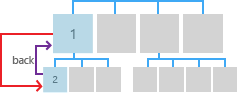
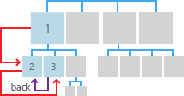

#  <a name="navigation-history-and-backwards-navigation-for-uwp-apps"></a>Histórico de navegação e navegação retroativa para apps UWP

<link rel="stylesheet" href="https://az835927.vo.msecnd.net/sites/uwp/Resources/css/custom.css">

Na Web, os sites individuais fornecem seus próprios sistemas de navegação, como índices analíticos, botões, menus, listas simples de links e outros. A experiência de navegação pode variar muito de um site para outro. No entanto, há uma experiência de navegação consistente: voltar. A maioria dos navegadores oferece um botão Voltar que se comporta da mesma maneira, independentemente do site.

> **APIs importantes**: [SystemNavigationManager class](https://docs.microsoft.com/en-us/uwp/api/Windows.UI.Core.SystemNavigationManager), [BackRequested event](https://docs.microsoft.com/en-us/uwp/api/Windows.UI.Core.SystemNavigationManager#Windows_UI_Core_SystemNavigationManager_BackRequested), [OnNavigatedTo](https://msdn.microsoft.com/library/windows/apps/br227508)

Por motivos semelhantes, a Plataforma Universal do Windows (UWP) oferece um sistema de navegação regressiva consistente a fim de percorrer o histórico de navegação do usuário dentro de um aplicativo e, dependendo do dispositivo, de aplicativo para aplicativo.

A interface do usuário do botão Voltar do sistema é otimizada para cada tipo de dispositivo de entrada e fator forma, mas a experiência de navegação é global e consistente entre dispositivos e aplicativos UWP.

Estes são os principais fatores forma com o botão Voltar da interface do usuário:


<table>
    <tr>
        <td colspan="2">Dispositivos</td>
        <td style="vertical-align:top;">Comportamento do botão Voltar</td>
     </tr>
    <tr>
        <td style="vertical-align:top;">Telefone</td>
        <td style="vertical-align:top;"></td>
        <td style="vertical-align:top;">
        <ul>
<li>Sempre presente.</li>
<li>Um botão de hardware ou software na parte inferior do dispositivo.</li>
<li>Navegação regressiva global no aplicativo e entre aplicativos.</li>
</ul>
</td>
     </tr>
     <tr>
        <td style="vertical-align:top;">Tablet</td>
        <td style="vertical-align:top;"></td>
        <td style="vertical-align:top;">
<ul>
<li>Sempre presente no modo Tablet. Não está disponível no modo de área de trabalho. Em vez disso, o botão Voltar da barra de título pode ser habilitado. Consulte [Computador, laptop, tablet](#PC).
Usuários podem alterar a execução entre modo Tablet e modo Área de trabalho indo para **Configurações &gt; Sistema &gt; modo Tablet** e definindo **Deixar o Windows mais fácil para o toque ao usar o seu dispositivo como tablet**.</li>
<li> Um botão de software na barra de navegação na parte inferior do dispositivo.</li>
<li>Navegação regressiva global no aplicativo e entre aplicativos.</li></ul>        
        </td>
     </tr>
    <tr>
        <td style="vertical-align:top;">PC, laptop, tablet</td>
        <td style="vertical-align:top;"></td>
        <td style="vertical-align:top;">
<ul>
<li>Opcional no modo Área de trabalho. Não está disponível no modo Tablet. Consulte [Tablet](#Tablet). Desabilitado por padrão. Deve aceitar para habilitá-lo.
Usuários podem alterar a execução entre modo Tablet e modo Área de trabalho indo para **Configurações &gt; Sistema &gt; modo Tablet** e definindo **Deixar o Windows mais fácil para o toque ao usar o seu dispositivo como tablet**.</li>
<li>Um botão de software na barra de título do aplicativo.</li>
<li>Navegação regressiva dentro do aplicativo apenas. Não dá suporte à navegação de aplicativo para aplicativo.</li></ul>        
        </td>
     </tr>
    <tr>
        <td style="vertical-align:top;">Surface Hub</td>
        <td style="vertical-align:top;"></td>
        <td style="vertical-align:top;">
<ul>
<li>Opcional.</li>
<li>Desabilitado por padrão. Deve aceitar para habilitá-lo.</li>
<li>Um botão de software na barra de título do aplicativo.</li>
<li>Navegação regressiva dentro do aplicativo apenas. Não dá suporte à navegação de aplicativo para aplicativo.</li></ul>        
        </td>
     </tr>     
<table>


Estes são alguns tipos de entrada alternativos que não dependem de um botão Voltar da interface do usuário, mas fornecem exatamente a mesma funcionalidade.


<table>
<tr><td colspan="3">Dispositivos de entrada</td></tr>
<tr><td style="vertical-align:top;">Teclado</td><td style="vertical-align:top;"></td><td style="vertical-align:top;">Tecla Windows + Backspace</td></tr>
<tr><td style="vertical-align:top;">Cortana</td><td style="vertical-align:top;"></td><td style="vertical-align:top;">Diga, "Ei Cortana, voltar".</td></tr>
</table>
 

Quando seu aplicativo é executado em um telefone, tablet, ou em um PC ou notebook que tenha o Voltar do sistema habilitado, o sistema notifica o aplicativo quando o botão Voltar é pressionado. O usuário espera que o botão Voltar navegue para o local anterior no histórico de navegação do aplicativo. Cabe a você decidir quais ações de navegação serão adicionadas ao histórico de navegação e como responder ao pressionar botão Voltar.


## <a name="how-to-enable-system-back-navigation-support"></a>Como habilitar o suporte a navegação regressiva do sistema


Os aplicativos devem habilitar a navegação regressiva para todos os botões Voltar do sistema de todos os hardwares e softwares. Faça isso registrando um ouvinte para o evento [**BackRequested**](https://msdn.microsoft.com/library/windows/apps/dn893596) e definindo um manipulador correspondente.

Aqui, nós registramos um ouvinte global para evento [**BackRequested**](https://msdn.microsoft.com/library/windows/apps/dn893596) no arquivo de code-behind App.xaml. É possível se registrar para esse evento em cada página se você quiser excluir páginas específicas da navegação regressiva ou quiser executar código no nível da página antes de exibi-la.

> [!div class="tabbedCodeSnippets"]
```csharp
Windows.UI.Core.SystemNavigationManager.GetForCurrentView().BackRequested += 
    App_BackRequested;
```
```cpp
Windows::UI::Core::SystemNavigationManager::GetForCurrentView()->
    BackRequested += ref new Windows::Foundation::EventHandler<
    Windows::UI::Core::BackRequestedEventArgs^>(
        this, &App::App_BackRequested);
```

Este é o manipulador de eventos [**BackRequested**](https://msdn.microsoft.com/library/windows/apps/dn893596) correspondente que chama [**GoBack**](https://msdn.microsoft.com/library/windows/apps/dn996568) no quadro raiz do aplicativo.

Esse manipulador é invocado em um evento Voltar global. Se a pilha Voltar dentro do aplicativo estiver vazia, o sistema pode navegar para o aplicativo anterior na pilha de aplicativos ou para a tela inicial. Não há pilha Voltar de aplicativos no modo Área de Trabalho e o usuário fica no aplicativo mesmo quando a pilha Voltar no aplicativo é descarregada.

> [!div class="tabbedCodeSnippets"]
```csharp
>private void App_BackRequested(object sender, 
>    Windows.UI.Core.BackRequestedEventArgs e)
>{
>    Frame rootFrame = Window.Current.Content as Frame;
>    if (rootFrame == null)
>        return;
>
>    // Navigate back if possible, and if the event has not 
>    // already been handled .
>    if (rootFrame.CanGoBack && e.Handled == false)
>    {
>        e.Handled = true;
>        rootFrame.GoBack();
>    }
>}
```
```cpp
>void App::App_BackRequested(
>    Platform::Object^ sender, 
>    Windows::UI::Core::BackRequestedEventArgs^ e)
>{
>    Frame^ rootFrame = dynamic_cast<Frame^>(Window::Current->Content);
>    if (rootFrame == nullptr)
>        return;
>
>    // Navigate back if possible, and if the event has not
>    // already been handled.
>    if (rootFrame->CanGoBack && e->Handled == false)
>    {
>        e->Handled = true;
>        rootFrame->GoBack();
>    }
>}
```

## <a name="how-to-enable-the-title-bar-back-button"></a>Como habilitar o botão Voltar da barra de título


Os dispositivos que têm suporte ao modo de Área de Trabalho (geralmente PCs e notebooks, mas também alguns tablets) e têm a configuração habilitada (**Configurações &gt; Sistema &gt; Modo tablet**) não oferecem uma barra de navegação global com o botão Voltar do sistema.

No modo de área de trabalho, cada aplicativo é executado em uma janela com uma barra de título. Você pode fornecer um botão Voltar alternativo para seu aplicativo que é exibido nessa barra de título.

O botão Voltar da barra de título está disponível somente em aplicativos que sejam executados em dispositivos no modo Área de Trabalho, e oferece suporte apenas a histórico de navegação no aplicativo. Ele não oferece suporte a histórico de navegação de aplicativo para aplicativo.

**Importante**  O botão Voltar da barra de título não é exibido por padrão. Você deve aceitar.

 

|                                                             |                                                        |
|-------------------------------------------------------------|--------------------------------------------------------|
|  |  |
| Modo Área de Trabalho, sem navegação regressiva.                           | Modo Área de Trabalho, navegação regressiva habilitada.                 |

 

Substitua o evento [**OnNavigatedTo**](https://msdn.microsoft.com/library/windows/apps/br227508) e defina [**AppViewBackButtonVisibility**](https://msdn.microsoft.com/library/windows/apps/dn986448) como [**Visible**](https://msdn.microsoft.com/library/windows/apps/dn986276) no arquivo de code-behind para cada página na qual você deseja habilitar o botão Voltar na barra de título.

Para esse exemplo, listamos cada página na pilha Voltar e habilitamos o botão Voltar se a propriedade [**CanGoBack**](https://msdn.microsoft.com/library/windows/apps/br242685) do quadro tiver o valor **true**.

> [!div class="tabbedCodeSnippets"]
>```csharp
>protected override void OnNavigatedTo(NavigationEventArgs e)
>{
>    Frame rootFrame = Window.Current.Content as Frame;
>
>    string myPages = "";
>    foreach (PageStackEntry page in rootFrame.BackStack)
>    {
>        myPages += page.SourcePageType.ToString() + "\n";
>    }
>    stackCount.Text = myPages;
>
>    if (rootFrame.CanGoBack)
>    {
>        // Show UI in title bar if opted-in and in-app backstack is not empty.
>        SystemNavigationManager.GetForCurrentView().AppViewBackButtonVisibility = 
>            AppViewBackButtonVisibility.Visible;
>    }
>    else
>    {
>        // Remove the UI from the title bar if in-app back stack is empty.
>        SystemNavigationManager.GetForCurrentView().AppViewBackButtonVisibility = 
>            AppViewBackButtonVisibility.Collapsed;
>    }
>}
>```
>```cpp
>void StartPage::OnNavigatedTo(NavigationEventArgs^ e)
>{
>    auto rootFrame = dynamic_cast<Windows::UI::Xaml::Controls::Frame^>(Window::Current->Content);
>
>    Platform::String^ myPages = "";
>
>    if (rootFrame == nullptr)
>        return;
>
>    for each (PageStackEntry^ page in rootFrame->BackStack)
>    {
>        myPages += page->SourcePageType.ToString() + "\n";
>    }
>    stackCount->Text = myPages;
>
>    if (rootFrame->CanGoBack)
>    {
>        // If we have pages in our in-app backstack and have opted in to showing back, do so
>        Windows::UI::Core::SystemNavigationManager::GetForCurrentView()->AppViewBackButtonVisibility =
>            Windows::UI::Core::AppViewBackButtonVisibility::Visible;
>    }
>    else
>    {
>        // Remove the UI from the title bar if there are no pages in our in-app back stack
>        Windows::UI::Core::SystemNavigationManager::GetForCurrentView()->AppViewBackButtonVisibility =
>            Windows::UI::Core::AppViewBackButtonVisibility::Collapsed;
>    }
>}
>```


### <a name="guidelines-for-custom-back-navigation-behavior"></a>Diretrizes para o comportamento da navegação regressiva personalizada

Se você optar por fornecer sua própria pilha Voltar de navegação, a experiência deve ser consistente com outros aplicativos. Recomendamos que você siga os seguintes padrões de ações de navegação:

<table>
<thead>
<tr class="header">
<th align="left">Ação de navegação</th>
<th align="left">Adicionar ao histórico de navegação?</th>
</tr>
</thead>
<tbody>
<tr class="odd">
<td style="vertical-align:top;"><strong>Página para página, grupos de pares diferentes</strong></td>
<td style="vertical-align:top;"><strong>Sim</strong>
<p>Nesta ilustração, o usuário navega do nível 1 do aplicativo ao nível 2, cruzando grupos de par, de maneira que a navegação é adicionada ao histórico de navegação.</p>
<p></p>
<p>Na próxima ilustração, o usuário navega entre dois grupos de par no mesmo nível, novamente cruzando grupos de par, de maneira que a navegação é adicionada ao histórico de navegação.</p>
<p></p></td>
</tr>
<tr class="even">
<td style="vertical-align:top;"><strong>Página a página, mesmo grupo de par, sem elemento de navegação na tela</strong>
<p>O usuário navega de uma página para outra com o mesmo grupo de pares. Não há qualquer elemento de navegação que seja sempre presente (como guias/pivôs ou um painel de navegação encaixado) que ofereça navegação direta para as duas páginas.</p></td>
<td style="vertical-align:top;"><strong>Sim</strong>
<p>Na ilustração a seguir, o usuário navega entre duas páginas no mesmo grupo de pares. As páginas não usam guias ou um painel de navegação encaixado, então a navegação é adicionada ao histórico de navegação.</p>
<p></p></td>
</tr>
<tr class="odd">
<td style="vertical-align:top;"><strong>Página a página, mesmo grupo de par, com elemento de navegação na tela</strong>
<p>O usuário navega de uma página para outra no mesmo grupo de pares. Ambas as páginas são mostradas no mesmo elemento de navegação. Por exemplo, as duas páginas usam o mesmo elemento guias/pivôs ou ambas as páginas aparecem em um painel de navegação encaixado.</p></td>
<td style="vertical-align:top;"><strong>Não</strong>
<p>Quando o usuário pressiona Voltar, ele volta para a última página visitada antes que o usuário navegasse para o grupo de par atual.</p>
<p></p></td>
</tr>
<tr class="even">
<td style="vertical-align:top;"><strong>Exibir uma interface do usuário transitória</strong>
<p>O aplicativo exibe uma janela pop-up ou filho, como uma caixa de diálogo, tela inicial, ou teclado virtual, ou o aplicativo entra em um modo especial, como o modo de seleção múltipla.</p></td>
<td style="vertical-align:top;"><strong>Não</strong>
<p>Quando o usuário pressionar o botão Voltar, descarte a interface do usuário transitória (ocultar o teclado virtual, cancelar a caixa de diálogo, etc) e retorne à página que gerou a interface do usuário transitória.</p>
<p></p></td>
</tr>
<tr class="odd">
<td style="vertical-align:top;"><strong>Enumerar os itens</strong>
<p>O aplicativo exibe o conteúdo para um item virtual, como os detalhes de um item selecionado na lista mestre/de detalhes.</p></td>
<td style="vertical-align:top;"><strong>Não</strong>
<p>A enumeração de itens é semelhante à navegação dentro de um grupo de pares. Quando o usuário pressionar Voltar, navegue até a página anterior à página atual com a enumeração de item.</p>
</td>
</tr>
</tbody>
</table>


### <a name="resuming"></a>Retomando

Quando o usuário alternar para outro aplicativo e retornar ao seu aplicativo, recomendamos retornar para a última página no histórico de navegação.


## <a name="get-the-samples"></a>Obter os exemplos
*   [Exemplo do botão Voltar](https://github.com/Microsoft/Windows-universal-samples/blob/master/Samples/BackButton)<br/>
    Mostra como configurar um manipulador de eventos para o evento do botão Voltar e como habilitar o botão Voltar da barra de títulos quando o aplicativo está em modo de janela de área de trabalho na janela.

## <a name="related-articles"></a>Artigos relacionados
* [Noções básicas de navegação](navigation-basics.md)

 


