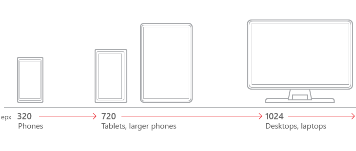

#  Tamanhos de tela e pontos de interrupção para um design responsivo

<link rel="stylesheet" href="https://az835927.vo.msecnd.net/sites/uwp/Resources/css/custom.css">

O número de destinos de dispositivo e tamanhos de tela do ecossistema do Windows 10 é muito grande para você se preocupar com a otimização de sua interface do usuário em cada um deles. Em vez disso, recomendamos projetar para algumas larguras principais (também chamadas de "pontos de interrupção"): 360, 640, 1024 e 1366 epx.

> [!TIP]
> Ao projetar para pontos de interrupção específicos, projete pela quantidade de espaço de tela disponível para seu aplicativo (a janela do aplicativo). Quando o aplicativo é executado em tela inteira, a janela do aplicativo é do mesmo tamanho da tela, mas em outros casos, ela é menor.
 

Esta tabela descreve as classes de tamanho diferentes e fornece recomendações gerais para se adequar a essas classes de tamanho.

<table>
<colgroup>
<col width="25%" />
<col width="25%" />
<col width="25%" />
<col width="25%" />
</colgroup>
<thead>
<tr class="header">
<th align="left">Classe Size</th>
<th align="left">pequeno</th>
<th align="left">médio</th>
<th align="left">grande</th>
</tr>
</thead>
<tbody>
<tr class="odd">
<td style="vertical-align:top;">Tamanho da tela típico (diagonal)</td>
<td style="vertical-align:top;">4&quot; a 6&quot;</td>
<td style="vertical-align:top;">7&quot; a 12&quot; ou TVs</td>
<td style="vertical-align:top;">13&quot; e maior</td>
</tr>
<tr class="even">
<td style="vertical-align:top;">Dispositivos comuns</td>
<td style="vertical-align:top;">Telefones</td>
<td style="vertical-align:top;">Phablets, tablets, TVs</td>
<td style="vertical-align:top;">Computadores, laptops, Surface Hubs</td>
</tr>
<tr class="odd">
<td style="vertical-align:top;">Tamanhos de janela comuns em pixels efetivos</td>
<td style="vertical-align:top;">320x569, 360x640, 480x854</td>
<td style="vertical-align:top;">960x540, 1024x640</td>
<td style="vertical-align:top;">1366x768, 1920x1080</td>
</tr>
<tr class="even">
<td style="vertical-align:top;">Pontos de interrupção de largura de janela em pixels efetivos</td>
<td style="vertical-align:top;">640px ou menos</td>
<td style="vertical-align:top;">641px a 1007px</td>
<td style="vertical-align:top;">1008px ou mais</td>
</tr>
<tr class="odd">
<td style="vertical-align:top;">Recomendações gerais</td>
<td style="vertical-align:top;"><ul>
<li>Centralize elementos de guia.</li>
<li>Defina as margens esquerda e direita de janela para 12px para criar uma separação visual entre as margens esquerda e direita da janela do aplicativo.</li>
<li>Encaixe [barras de aplicativo](../controls-and-patterns/app-bars.md) na parte inferior da janela para melhorar a acessibilidade</li>
<li>Usar uma coluna/região de cada vez</li>
<li>Use um ícone para representar a pesquisa (não mostre uma caixa de pesquisa).</li>
<li>Coloque o [painel de navegação](../controls-and-patterns/navigationview.md) no modo de sobreposição para conservar espaço na tela.</li>
<li>Se você estiver usando o [padrão de detalhes mestre](../controls-and-patterns/master-details.md), use o modo de apresentação empilhada para economizar espaço na tela.</li>
</ul></td>
<td style="vertical-align:top;"><ul>
<li>Crie elementos de guia alinhados à esquerda.</li>
<li>Defina as margens esquerda e direita de janela para 24px para criar uma separação visual entre as margens esquerda e direita da janela do aplicativo.</li>
<li>Coloque elementos de comando, como [barras de aplicativo](../controls-and-patterns/app-bars.md), na parte superior da janela do aplicativo.</li>
<li>Até duas colunas/regiões</li>
<li>Mostre a caixa de pesquisa.</li>
<li>Coloque o [painel de navegação](../controls-and-patterns/navigationview.md) no modo de fragmento de forma que uma faixa estreita de ícones sempre seja exibida.</li>
<li>Considere fazer mais adaptações para [experiências de TV](http://go.microsoft.com/fwlink/?LinkId=760736).</li>
</ul></td>
<td style="vertical-align:top;"><ul>
<li>Crie elementos de guia alinhados à esquerda.</li>
<li>Defina as margens esquerda e direita de janela para 24px para criar uma separação visual entre as margens esquerda e direita da janela do aplicativo.</li>
<li>Coloque elementos de comando, como [barras de aplicativo](../controls-and-patterns/app-bars.md), na parte superior da janela do aplicativo.</li>
<li>Até três colunas/regiões</li>
<li>Mostre a caixa de pesquisa.</li>
<li>Coloque o [painel de navegação](../controls-and-patterns/navigationview.md) no modo encaixado para que ele sempre apareça.</li>
</ul></td>
</tr>
</tbody>
</table>

Com o [**Continuum para Telefones**](http://go.microsoft.com/fwlink/p/?LinkID=699431), uma nova experiência para dispositivos móveis compatíveis com o Windows 10, os usuários podem conectar seus telefones a um mouse e um teclado para fazê-los funcionar como laptops. Mantenha essa nova funcionalidade em mente ao criar designs para pontos de interrupção específicos - um telefone móvel não permanecerá sempre na classe de tamanho pequeno.
 
