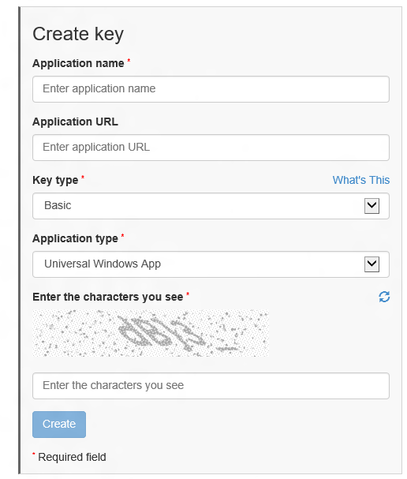

# <a name="request-a-maps-authentication-key"></a>Solicitar uma chave de autenticação de mapas

> [!WARNING]
> Os serviços de mapas online podem não estar disponíveis em versões mais antigas do Windows 10. Nas versões a seguir, MapControl pode deixar de exibir mapas e APIs no namespace Windows. Services. Maps pode não retornar resultados:
> - Windows 10, versão 1607 e versões anteriores: os serviços de mapa ficarão indisponíveis em todo o mundo, a partir de outubro de 2020
> - Windows 10, versão 1703 e versões anteriores: os serviços de mapa não estão disponíveis em [alguns dispositivos vendidos na China](https://docs.microsoft.com/windows-hardware/customize/desktop/unattend/microsoft-windows-mapcontrol-desktop-chinavariantwin10)

Seu [aplicativo universal do Windows](https://docs.microsoft.com/windows/uwp/get-started/universal-application-platform-guide) deve ser autenticado antes de poder usar os serviços [**MapControl**](https://docs.microsoft.com/uwp/api/Windows.UI.Xaml.Controls.Maps.MapControl) e MAP no namespace [**Windows. Services. Maps**](https://docs.microsoft.com/uwp/api/Windows.Services.Maps) . Para autenticar o aplicativo, você precisa especificar uma chave de autenticação de mapas. Este tópico descreve como solicitar uma chave de autenticação de mapas a partir da [Central de Desenvolvimento do Bing Mapas](https://www.bingmapsportal.com/) e adicioná-la ao aplicativo.

**Dica** Para saber mais sobre o uso de mapas em seu aplicativo, baixe a amostra a seguir do [repositório Windows-universal-samples](https://github.com/Microsoft/Windows-universal-samples) no GitHub:

-   [Amostra de mapa da UWP (Plataforma Universal do Windows)](https://github.com/Microsoft/Windows-universal-samples/tree/master/Samples/MapControl)

## <a name="get-a-key"></a>Obter uma chave


Crie e gerencie chaves de autenticação de mapa para aplicativos Universal do Windows usando a [Central de Desenvolvimento do Bing Mapas](https://www.bingmapsportal.com/).

Para criar uma nova chave

1.  No navegador, navegue até o centro de desenvolvedores do Bing Maps ( [https://www.bingmapsportal.com](https://www.bingmapsportal.com/) ).

2.  Caso você precise fazer logon, insira a conta da Microsoft e clique em **Entrar**.

3.  Escolha a conta para associar à sua conta do Bing Mapas. Caso queira usar a conta da Microsoft, clique em **Sim**. Do contrário, clique em **Sign in with another account**.

4.  Caso você ainda não tenha uma conta do Bing Maps, crie uma nova conta do Bing Maps. Insira **Nome da Conta**, **Nome de Contato**, **Nome da Empresa**, **Endereço de Email** e **Telefone**. Depois de aceitar os termos de uso, clique em **Criar**.

5.  No menu **Minha conta**, clique em **Minhas Chaves**.

6.  Se você tiver criado uma chave anteriormente, clique no link para criar uma nova chave. Caso contrário, vá para o formulário Criar Chave.

7.  Preencha o formulário **Criar Chave** e clique em **Criar**.

    -   **Nome do aplicativo:** o nome do aplicativo.
    -   **URL do aplicativo (opcional):** a URL do aplicativo.
    -   **Tipo de chave:** selecione **Básico** ou **Empresa**.
    -   **Tipo de aplicativo:** Selecione o **aplicativo do Windows** para uso em seu aplicativo universal do Windows.

    Este é um exemplo da aparência do formulário.

    

8.  Depois de você clicar em **Criar**, a nova chave aparece abaixo do formulário **Criar Chave**. Copie-a para um local seguro ou adicione-a imediatamente ao aplicativo, conforme descrito na próxima etapa.

## <a name="add-the-key-to-your-app"></a>Adicionar a chave ao aplicativo


A chave de autenticação de mapa é obrigada a usar o [**MapControl**](https://docs.microsoft.com/uwp/api/Windows.UI.Xaml.Controls.Maps.MapControl) e os serviços de mapa ([**Windows.Services.Maps**](https://docs.microsoft.com/uwp/api/Windows.Services.Maps)) no aplicativo Universal do Windows. Adicione-o ao controle de mapa e mapeie objetos de serviço, conforme aplicável.

### <a name="to-add-the-key-to-a-map-control"></a>Para adicionar a chave a um controle de mapa

Para autenticar o [**MapControl**](https://docs.microsoft.com/uwp/api/Windows.UI.Xaml.Controls.Maps.MapControl), defina a propriedade [**MapServiceToken**](https://docs.microsoft.com/uwp/api/windows.ui.xaml.controls.maps.mapcontrol.mapservicetoken) como o valor da chave de autenticação. Você pode definir essa propriedade no código ou na marcação XAML, dependendo das suas preferências. Para obter mais informações sobre o uso de **MapControl**, consulte [Exibir mapas com modos de exibição 2D, 3D e Streetside](display-maps.md).

-   Este exemplo define **MapServiceToken** como o valor da chave de autenticação no código.

    ```cs
    MapControl1.MapServiceToken = "abcdef-abcdefghijklmno";
    ```

-   Este exemplo define **MapServiceToken** como o valor da chave de autenticação na marcação XAML.

    ```xml
    <Maps:MapControl x:Name="MapControl1" MapServiceToken="abcdef-abcdefghijklmno"/>
    ```

### <a name="to-add-the-key-to-map-services"></a>Para adicionar a chave a serviços de mapa

Para usar serviços no namespace [**Windows.Services.Maps**](https://docs.microsoft.com/uwp/api/Windows.Services.Maps), defina a propriedade [**ServiceToken**](https://docs.microsoft.com/uwp/api/windows.services.maps.mapservice.servicetoken) como o valor da chave de autenticação. Para obter mais informações sobre como usar serviços de mapa, consulte [Exibir rotas e trajetos](routes-and-directions.md) e [Executar geocodificação e geocodificação reversa](geocoding.md).

-   Este exemplo define **ServiceToken** como o valor da chave de autenticação no código.

    ```cs
    MapService.ServiceToken = "abcdef-abcdefghijklmno";
    ```

## <a name="related-topics"></a>Tópicos relacionados

* [Central de Desenvolvedores do Bing Mapas](https://www.bingmapsportal.com/)
* [Amostra de mapa UWP](https://github.com/Microsoft/Windows-universal-samples/tree/master/Samples/MapControl)
* [Diretrizes de design para mapas](https://docs.microsoft.com/windows/uwp/maps-and-location/controls-map)
* [Vídeo do build 2015: Aproveitando mapas e localização em telefones, tablets e computadores em seus aplicativos do Windows](https://channel9.msdn.com/Events/Build/2015/2-757)
* [Exemplo de aplicativo de tráfego UWP](https://github.com/Microsoft/Windows-appsample-trafficapp)
