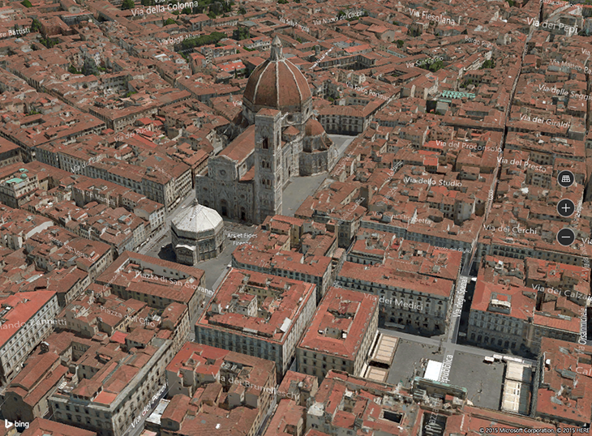

# <a name="display-maps-with-2d-3d-and-streetside-views"></a>Exibir mapas com modos de exibição 2D, 3D e Streetside

Você pode mostrar um mapa na janela descartável leve chamada de um *cartão de lugar* de mapa em um controle de mapa cheio de recursos.

Baixe o [exemplo de mapa](https://github.com/Microsoft/Windows-universal-samples/tree/master/Samples/MapControl) para experimentar alguns dos recursos descritos neste guia.

<a id="placecard" />

## <a name="display-map-in-a-placecard"></a>Exibir mapa em um cartão de lugar
Você pode mostrar aos usuários um mapa dentro de uma janela pop-up leve acima, abaixo ou ao lado de um elemento de interface de usuário ou em uma área de um aplicativo na qual o usuário toca. O mapa pode mostrar uma cidade ou endereço relacionado a informações em seu app.  

Esse cartão de lugar mostra a cidade de Seattle.


Aqui está o código que faz Seattle aparecer em um cartão de lugar abaixo de um botão.

```csharp
private void Seattle_Click(object sender, RoutedEventArgs e)
{
    Geopoint seattlePoint = new Geopoint
        (new BasicGeoposition { Latitude = 47.6062, Longitude = -122.3321 });

    PlaceInfo spaceNeedlePlace = PlaceInfo.Create(seattlePoint);

    FrameworkElement targetElement = (FrameworkElement)sender;

    GeneralTransform generalTransform =
        targetElement.TransformToVisual((FrameworkElement)targetElement.Parent);

    Rect rectangle = generalTransform.TransformBounds(new Rect(new Point
        (targetElement.Margin.Left, targetElement.Margin.Top), targetElement.RenderSize));

    spaceNeedlePlace.Show(rectangle, Windows.UI.Popups.Placement.Below);
}
```

Esse cartão de lugar mostra a localização da Space Needle em Seattle.


Aqui está o código que faz a Space Needle aparecer em um cartão de lugar abaixo de um botão.

```csharp
private void SpaceNeedle_Click(object sender, RoutedEventArgs e)
{
    Geopoint spaceNeedlePoint = new Geopoint
        (new BasicGeoposition { Latitude = 47.6205, Longitude = -122.3493 });

    PlaceInfoCreateOptions options = new PlaceInfoCreateOptions();

    options.DisplayAddress = "400 Broad St, Seattle, WA 98109";
    options.DisplayName = "Seattle Space Needle";

    PlaceInfo spaceNeedlePlace =  PlaceInfo.Create(spaceNeedlePoint, options);

    FrameworkElement targetElement = (FrameworkElement)sender;

    GeneralTransform generalTransform =
        targetElement.TransformToVisual((FrameworkElement)targetElement.Parent);

    Rect rectangle = generalTransform.TransformBounds(new Rect(new Point
        (targetElement.Margin.Left, targetElement.Margin.Top), targetElement.RenderSize));

    spaceNeedlePlace.Show(rectangle, Windows.UI.Popups.Placement.Below);
}
```

<a id="map-control" />

## <a name="display-map-in-a-control"></a>Exibir mapa em um controle

Use um controle de mapa para mostrar os dados de mapa avançado e personalizável em seu app. Um controle de mapa pode exibir mapas de rodovias, visualizações aéreas, 3D, trajetos, resultados de busca e informações sobre trânsito. Em um mapa, você pode exibir a localização, o trajeto e pontos de interesse para o usuário. Um mapa também pode exibir vistas aéreas em 3D, modos de exibição Streetside, tráfego, trânsito e empresas locais.

Use um controle de mapa quando quiser que um mapa em seu app permita aos usuários ver informações geográficas gerais ou específicas do app. Ter um controle de mapa no seu aplicativo significa que os usuários não têm que sair do seu aplicativo para obter informações.

> [!NOTE]
>Se você não se importar que os usuários saiam do seu aplicativo para obter essas informações, considere usar o aplicativo Mapas do Windows para fornecer essas informações. Seu app pode iniciar o app Mapas do Windows para exibir mapas específicos, trajetos e resultados de pesquisa. Para saber mais, veja [Iniciar o app Mapas do Windows](https://docs.microsoft.com/windows/uwp/launch-resume/launch-maps-app).

### <a name="add-a-map-control-to-your-app"></a>Adicionar um controle de mapa a seu app

Exiba um mapa em uma página XAML adicionando um [**MapControl**](https://docs.microsoft.com/uwp/api/Windows.UI.Xaml.Controls.Maps.MapControl). Para usar o **MapControl**, você deve declarar o namespace [**Windows.UI.Xaml.Controls.Maps**](https://docs.microsoft.com/uwp/api/Windows.UI.Xaml.Controls.Maps) na página XAML ou no seu código. Se você arrastar o controle da Caixa de Ferramentas, essa declaração de namespace será adicionada automaticamente. Se você adicionar o **MapControl** à página XAML manualmente, deverá adicionar a declaração de namespace manualmente na parte superior da página.

O exemplo a seguir exibe um controle de mapa básico e configura o mapa para exibir os controles de zoom e inclinação além de aceitar entradas de toque.

```xml
<Page
    x:Class="MapsAndLocation1.DisplayMaps"
    xmlns="http://schemas.microsoft.com/winfx/2006/xaml/presentation"
    xmlns:x="http://schemas.microsoft.com/winfx/2006/xaml"
    xmlns:local="using:MapsAndLocation1"
    xmlns:d="http://schemas.microsoft.com/expression/blend/2008"
    xmlns:mc="http://schemas.openxmlformats.org/markup-compatibility/2006"
    xmlns:Maps="using:Windows.UI.Xaml.Controls.Maps"
    mc:Ignorable="d">

 <Grid x:Name="pageGrid" Background="{ThemeResource ApplicationPageBackgroundThemeBrush}">

    <Maps:MapControl
       x:Name="MapControl1"            
       ZoomInteractionMode="GestureAndControl"
       TiltInteractionMode="GestureAndControl"   
       MapServiceToken="EnterYourAuthenticationKeyHere"/>

 </Grid>
</Page>
```

Se você adicionar o controle de mapa ao código, também deverá declarar o namespace manualmente na parte superior do arquivo de código.

```csharp
using Windows.UI.Xaml.Controls.Maps;
...

// Add the MapControl and the specify maps authentication key.
MapControl MapControl2 = new MapControl();
MapControl2.ZoomInteractionMode = MapInteractionMode.GestureAndControl;
MapControl2.TiltInteractionMode = MapInteractionMode.GestureAndControl;
MapControl2.MapServiceToken = "EnterYourAuthenticationKeyHere";
pageGrid.Children.Add(MapControl2);
```

### <a name="get-and-set-a-maps-authentication-key"></a>Obter e definir uma chave de autenticação de mapas

Para poder usar [**MapControl**](https://docs.microsoft.com/uwp/api/Windows.UI.Xaml.Controls.Maps.MapControl) e mapear serviços, você deve especificar uma chave de autenticação de mapas como o valor da propriedade [**MapServiceToken**](https://docs.microsoft.com/uwp/api/windows.ui.xaml.controls.maps.mapcontrol.mapservicetoken). Nos exemplos anteriores, substitua `EnterYourAuthenticationKeyHere` pela chave obtida na [Central de Desenvolvedores do Bing Mapas](https://www.bingmapsportal.com/). O texto **Aviso: MapServiceToken não especificado** continuará sendo exibido abaixo do controle até que você especifique a chave de autenticação de mapas. Para saber mais sobre como obter e definir uma chave de autenticação de mapas, consulte [Solicitar uma chave de autenticação de mapas](authentication-key.md).

## <a name="set-the-location-of-a-map"></a>Definir a localização de um mapa
Aponte o mapa para qualquer local que você queira ou use a localização atual do usuário.  

### <a name="set-a-starting-location-for-the-map"></a>Definir uma localização inicial para o mapa

Defina a localização a ser exibida no mapa especificando a propriedade [**Center**](https://docs.microsoft.com/uwp/api/windows.ui.xaml.controls.maps.mapcontrol.center) do [**MapControl**](https://docs.microsoft.com/uwp/api/Windows.UI.Xaml.Controls.Maps.MapControl) no código ou associando a propriedade na marcação XAML. O exemplo a seguir exibe um mapa com a cidade de Seattle no centro.

> [!NOTE]
> Como uma cadeia de caracteres não pode ser convertida em um [**Geopoint**](https://docs.microsoft.com/uwp/api/Windows.Devices.Geolocation.Geopoint), você não pode especificar um valor para a propriedade [**Center**](https://docs.microsoft.com/uwp/api/windows.ui.xaml.controls.maps.mapcontrol.center) na marcação XAML, a menos que use a vinculação de dados. (Essa limitação também se aplica à propriedade anexada [**MapControl.Location**](https://docs.microsoft.com/uwp/api/windows.ui.xaml.controls.maps.mapcontrol.setlocation)).

 
```csharp
protected override void OnNavigatedTo(NavigationEventArgs e)
{
   // Specify a known location.
   BasicGeoposition cityPosition = new BasicGeoposition() { Latitude = 47.604, Longitude = -122.329 };
   Geopoint cityCenter = new Geopoint(cityPosition);

   // Set the map location.
   MapControl1.Center = cityCenter;
   MapControl1.ZoomLevel = 12;
   MapControl1.LandmarksVisible = true;
}
```


### <a name="set-the-current-location-of-the-map"></a>Definir a localização atual do mapa

Para acessar a localização do usuário, o aplicativo deve chamar o método [**RequestAccessAsync**](https://docs.microsoft.com/uwp/api/windows.devices.geolocation.geolocator.requestaccessasync). Nesse momento, seu aplicativo deve estar em primeiro plano, e **RequestAccessAsync** deve ser chamado do thread da interface do usuário. Até que o usuário conceda permissão para a localização a seu aplicativo, o aplicativo não pode acessar os dados de localização.

Obtenha a localização atual do dispositivo (caso ela esteja disponível) usando o método [**GetGeopositionAsync**](https://docs.microsoft.com/uwp/api/windows.devices.geolocation.geolocator.getgeopositionasync) da classe [**Geolocator**](https://docs.microsoft.com/uwp/api/Windows.Devices.Geolocation.Geolocator). Para obter o [**Geopoint**](https://docs.microsoft.com/uwp/api/Windows.Devices.Geolocation.Geopoint) correspondente, use a propriedade [**Point**](https://docs.microsoft.com/uwp/api/windows.devices.geolocation.geocoordinate.point) da coordenada geográfica da posição geográfica. Para saber mais, consulte [Obter a localização atual](get-location.md).

```csharp
// Set your current location.
var accessStatus = await Geolocator.RequestAccessAsync();
switch (accessStatus)
{
   case GeolocationAccessStatus.Allowed:

      // Get the current location.
      Geolocator geolocator = new Geolocator();
      Geoposition pos = await geolocator.GetGeopositionAsync();
      Geopoint myLocation = pos.Coordinate.Point;

      // Set the map location.
      MapControl1.Center = myLocation;
      MapControl1.ZoomLevel = 12;
      MapControl1.LandmarksVisible = true;
      break;

   case GeolocationAccessStatus.Denied:
      // Handle the case  if access to location is denied.
      break;

   case GeolocationAccessStatus.Unspecified:
      // Handle the case if  an unspecified error occurs.
      break;
}
```

Ao exibir a localização do seu dispositivo em um mapa, leve em consideração a exibição de elementos gráficos e a definição do nível de zoom com base na precisão dos dados de localização. Para obter mais informações, consulte [Diretrizes para aplicativos com reconhecimento de local](https://docs.microsoft.com/windows/uwp/maps-and-location/guidelines-and-checklist-for-detecting-location).

### <a name="change-the-location-of-the-map"></a>Alterar a localização do mapa

Para alterar a localização exibida em um mapa 2D, chame um das sobrecargas do método [**TrySetViewAsync**](https://docs.microsoft.com/uwp/api/windows.ui.xaml.controls.maps.mapcontrol.trysetviewasync). Use esse método para especificar novos valores para [**Center**](https://docs.microsoft.com/uwp/api/windows.ui.xaml.controls.maps.mapcontrol.center), [**ZoomLevel**](https://docs.microsoft.com/uwp/api/windows.ui.xaml.controls.maps.mapcontrol.zoomlevel), [**Heading**](https://docs.microsoft.com/uwp/api/windows.ui.xaml.controls.maps.mapcontrol.heading) e [**Pitch**](https://docs.microsoft.com/uwp/api/windows.ui.xaml.controls.maps.mapcontrol.pitch). Você também pode especificar uma animação opcional para usar quando exibir alterações fornecendo uma constante da enumeração de [**MapAnimationKind**](https://docs.microsoft.com/uwp/api/Windows.UI.Xaml.Controls.Maps.MapAnimationKind).

Para alterar a localização de um mapa 3D, use em vez disso o método [**TrySetSceneAsync**](https://docs.microsoft.com/uwp/api/windows.ui.xaml.controls.maps.mapcontrol.trysetsceneasync). Para saber mais, consulte [Exibir modos de exibição 3D aéreos](#3Dviews).

Chame o método [**TrySetViewBoundsAsync**](https://docs.microsoft.com/uwp/api/windows.ui.xaml.controls.maps.mapcontrol.trysetviewboundsasync) para exibir o conteúdo de uma [**GeoboundingBox**](https://docs.microsoft.com/uwp/api/Windows.Devices.Geolocation.GeoboundingBox) no mapa. Use esse método, por exemplo, para exibir uma rota e uma parte de uma rota no mapa. Para saber mais, consulte [Exibir rotas e trajetos em um mapa](routes-and-directions.md).

## <a name="change-the-appearance-of-a-map"></a>Alterar a aparência de um mapa

Para personalizar a aparência do mapa, defina a propriedade [**StyleSheet**](https://docs.microsoft.com/uwp/api/windows.ui.xaml.controls.maps.mapcontrol.StyleSheet) do controle map para qualquer um dos objetos [**MapStyleSheet**](https://docs.microsoft.com/uwp/api/windows.ui.xaml.controls.maps.mapstylesheet) existentes.

```csharp
myMap.StyleSheet = MapStyleSheet.RoadDark();
```


Você pode também usar o JSON para definir estilos personalizados e então usar o JSON para criar um objeto [**MapStyleSheet**](https://docs.microsoft.com/uwp/api/windows.ui.xaml.controls.maps.mapstylesheet).

A folha de estilos JSON pode ser criada interativamente usando o aplicativo [Editor de folha de estilo de mapa](https://www.microsoft.com/p/map-style-sheet-editor/9nbhtcjt72ft) .

```csharp
myMap.StyleSheet = MapStyleSheet.ParseFromJson(@"
    {
        ""version"": ""1.0"",
        ""settings"": {
            ""landColor"": ""#FFFFFF"",
            ""spaceColor"": ""#000000""
        },
        ""elements"": {
            ""mapElement"": {
                ""labelColor"": ""#000000"",
                ""labelOutlineColor"": ""#FFFFFF""
            },
            ""water"": {
                ""fillColor"": ""#DDDDDD""
            },
            ""area"": {
                ""fillColor"": ""#EEEEEE""
            },
            ""political"": {
                ""borderStrokeColor"": ""#CCCCCC"",
                ""borderOutlineColor"": ""#00000000""
            }
        }
    }
");
```


Para obter a referência de entrada JSON completa, consulte [Mapear referência de folha de estilo](elements-of-map-style-sheet.md).

Você pode começar com uma planilha existente e então usar o JSON para substituir todos os elementos desejados. Este exemplo começa com um estilo existente e usa o JSON para alterar apenas a cor das áreas de água.

```csharp
 MapStyleSheet \customSheet = MapStyleSheet.ParseFromJson(@"
    {
        ""version"": ""1.0"",
        ""elements"": {
            ""water"": {
                ""fillColor"": ""#DDDDDD""
            }
        }
    }
");

MapStyleSheet builtInSheet = MapStyleSheet.RoadDark();

myMap.StyleSheet = MapStyleSheet.Combine(new List<MapStyleSheet> { builtInSheet, customSheet });
```


>[!NOTE]
>Os estilos que você define na segunda folha de estilos substituem os estilos da primeira.

## <a name="set-orientation-and-perspective"></a>Definir a orientação e a perspectiva

Aumente o zoom, reduza o zoom, gire e incline a câmera do mapa para obter apenas o ângulo certo para o efeito que você deseja. Experimente estas propriedades.

-   Defina o **centro** do mapa como um ponto geográfico configurando a propriedade [**Center**](https://docs.microsoft.com/uwp/api/windows.ui.xaml.controls.maps.mapcontrol.center).
-   Defina o **nível de zoom** do mapa configurando a propriedade [**ZoomLevel**](https://docs.microsoft.com/uwp/api/windows.ui.xaml.controls.maps.mapcontrol.zoomlevel) como um valor entre 1 e 20.
-   Defina a **rotação** do mapa configurando a propriedade [**Heading**](https://docs.microsoft.com/uwp/api/windows.ui.xaml.controls.maps.mapcontrol.heading), em que 0 ou 360 graus = Norte, 90 = Leste, 180 = Sul e 270 = Oeste.
-   Defina a **inclinação** do mapa configurando a propriedade [**DesiredPitch**](https://docs.microsoft.com/uwp/api/windows.ui.xaml.controls.maps.mapcontrol.desiredpitch) como um valor entre 0 e 65 graus.

## <a name="show-and-hide-map-features"></a>Mostrar e ocultar os recursos do mapa

Mostre ou oculte os recursos do mapa, como estradas e pontos de referência ao definir os valores das propriedades a seguir do [**MapControl**](https://docs.microsoft.com/uwp/api/Windows.UI.Xaml.Controls.Maps.MapControl).

* Mostre **edifícios e pontos de referência** no mapa habilitando ou desabilitando a propriedade [**LandmarksVisible**](https://docs.microsoft.com/uwp/api/windows.ui.xaml.controls.maps.mapcontrol.landmarksvisible).

  > [!NOTE]
  > Você pode mostrar ou ocultar edifícios, mas não pode impedir que eles apareçam em três dimensões.  

* Mostre **recursos para pedestres**, como escadas públicas, no mapa habilitando ou desabilitando a propriedade [**PedestrianFeaturesVisible**](https://docs.microsoft.com/uwp/api/windows.ui.xaml.controls.maps.mapcontrol.pedestrianfeaturesvisible).
* Mostre o **tráfego** no mapa habilitando ou desabilitando a propriedade [**TrafficFlowVisible**](https://docs.microsoft.com/uwp/api/windows.ui.xaml.controls.maps.mapcontrol.trafficflowvisible).
* Especifique se a **marca d'água** é exibida no mapa configurando a propriedade [**WatermarkMode**](https://docs.microsoft.com/uwp/api/windows.ui.xaml.controls.maps.mapcontrol.watermarkmode) como uma das constantes de [**MapWatermarkMode**](https://docs.microsoft.com/uwp/api/Windows.UI.Xaml.Controls.Maps.MapWatermarkMode).
* Mostre uma **rota de direção ou caminhada** no mapa adicionando uma [**MapRouteView**](https://docs.microsoft.com/uwp/api/Windows.UI.Xaml.Controls.Maps.MapRouteView) à coleção [**Routes**](https://docs.microsoft.com/uwp/api/windows.ui.xaml.controls.maps.mapcontrol.routes) do controle de Mapa. Para saber mais e conhecer um exemplo, consulte [Exibir rotas e trajetos em um mapa](routes-and-directions.md).

Para saber mais sobre como exibir pinos de pressão, formas e controles XAML no [**MapControl**](https://docs.microsoft.com/uwp/api/Windows.UI.Xaml.Controls.Maps.MapControl), consulte [Exibir ponto de interesse (POI) em um mapa](display-poi.md).

## <a name="display-streetside-views"></a>Mostrar modos de exibição Streetside


Um modo de exibição Streetside é uma perspectiva a nível da rua de uma localização que aparece sobre o controle de mapa.


Considere a experiência "dentro" do modo de exibição Streetside separada do mapa originalmente exibido no controle de mapa. Por exemplo, alterar o local no modo de exibição Streetside não altera o local ou a aparência do mapa "no" modo de exibição Streetside. Depois que você fecha o modo de exibição Streetside (clicando no **X** no canto superior direito do controle), o mapa original permanece inalterado.

Para mostrar um modo de exibição Streetside

1.  Determine se os modos de exibição Streetside são compatíveis com o dispositivo verificando [**IsStreetsideSupported**](https://docs.microsoft.com/uwp/api/windows.ui.xaml.controls.maps.mapcontrol.isstreetsidesupported).
2.  Caso não haja suporte para o modo de exibição Streetside, crie um [**StreetsidePanorama**](https://docs.microsoft.com/uwp/api/Windows.UI.Xaml.Controls.Maps.StreetsidePanorama) próximo à localização especificada chamando [**FindNearbyAsync**](https://docs.microsoft.com/uwp/api/windows.ui.xaml.controls.maps.streetsidepanorama.findnearbyasync).
3.  Determine se um panorama próximo foi encontrado verificando se o [**StreetsidePanorama**](https://docs.microsoft.com/uwp/api/Windows.UI.Xaml.Controls.Maps.StreetsidePanorama) não é nulo
4.  Caso um panorama próximo seja encontrado, crie um [**StreetsideExperience**](https://docs.microsoft.com/uwp/api/windows.ui.xaml.controls.maps.streetsideexperience) para a propriedade [**CustomExperience**](https://docs.microsoft.com/uwp/api/windows.ui.xaml.controls.maps.mapcontrol.customexperience) do controle de mapa.

Este exemplo mostra como apresentar um modo de exibição Streetside semelhante à imagem anterior.

**Observação**  o mapa de visão geral não será exibido se o controle de mapa for muito pequeno.

 

```csharp
private async void showStreetsideView()
{
   // Check if Streetside is supported.
   if (MapControl1.IsStreetsideSupported)
   {
      // Find a panorama near Avenue Gustave Eiffel.
      BasicGeoposition cityPosition = new BasicGeoposition() { Latitude = 48.858, Longitude = 2.295};
      Geopoint cityCenter = new Geopoint(cityPosition);
      StreetsidePanorama panoramaNearCity = await StreetsidePanorama.FindNearbyAsync(cityCenter);

      // Set the Streetside view if a panorama exists.
      if (panoramaNearCity != null)
      {
         // Create the Streetside view.
         StreetsideExperience ssView = new StreetsideExperience(panoramaNearCity);
         ssView.OverviewMapVisible = true;
         MapControl1.CustomExperience = ssView;
      }
   }
   else
   {
      // If Streetside is not supported
      ContentDialog viewNotSupportedDialog = new ContentDialog()
      {
         Title = "Streetside is not supported",
         Content ="\nStreetside views are not supported on this device.",
         PrimaryButtonText = "OK"
      };
      await viewNotSupportedDialog.ShowAsync();            
   }
}
```

<a id="3Dviews" />
## <a name="display-aerial-3d-views"></a>Mostrar modos de exibição aérea 3D


Especifique uma perspectiva 3D do mapa usando a classe [**MapScene**](https://docs.microsoft.com/uwp/api/Windows.UI.Xaml.Controls.Maps.MapScene). A cena de mapa representa o modo de exibição 3D mostrado no mapa. A classe [**MapCamera**](https://docs.microsoft.com/uwp/api/Windows.UI.Xaml.Controls.Maps.MapCamera) representa a posição da câmera que mostra o modo de exibição.


Para fazer com que edifícios e outros recursos na superfície do mapa apareçam em 3D, defina a propriedade [**Style**](https://docs.microsoft.com/uwp/api/windows.ui.xaml.controls.maps.mapcontrol.style) do controle de mapa como [**MapStyle.Aerial3DWithRoads**](https://docs.microsoft.com/uwp/api/Windows.UI.Xaml.Controls.Maps.MapStyle). Este é um exemplo de um modo de exibição 3D com o estilo **Aerial3DWithRoads**.



Para mostrar um modo de exibição 3D

1.  Determine se os modos de exibição 3D são compatíveis com o dispositivo verificando [**Is3DSupported**](https://docs.microsoft.com/uwp/api/windows.ui.xaml.controls.maps.mapcontrol.is3dsupported).
2.  Caso os modos de exibição 3D sejam compatíveis, defina a propriedade [**Style**](https://docs.microsoft.com/uwp/api/windows.ui.xaml.controls.maps.mapcontrol.style) do controle de mapa como [**MapStyle.Aerial3DWithRoads**](https://docs.microsoft.com/uwp/api/Windows.UI.Xaml.Controls.Maps.MapStyle).
3.  Crie um objeto [**MapScene**](https://docs.microsoft.com/uwp/api/Windows.UI.Xaml.Controls.Maps.MapScene) usando um dos vários métodos **CreateFrom**, como [**CreateFromLocationAndRadius**](https://docs.microsoft.com/uwp/api/windows.ui.xaml.controls.maps.mapscene.createfromlocationandradius) e [**CreateFromCamera**](https://docs.microsoft.com/uwp/api/windows.ui.xaml.controls.maps.mapscene.createfromcamera).
4.  Chame [**TrySetSceneAsync**](https://docs.microsoft.com/uwp/api/windows.ui.xaml.controls.maps.mapcontrol.trysetsceneasync) para mostrar o modo de exibição 3D. Você também pode especificar uma animação opcional para usar quando exibir alterações fornecendo uma constante da enumeração de [**MapAnimationKind**](https://docs.microsoft.com/uwp/api/Windows.UI.Xaml.Controls.Maps.MapAnimationKind).

Este exemplo mostra como apresentar um modo de exibição 3D.

```csharp
private async void display3DLocation()
{
   if (MapControl1.Is3DSupported)
   {
      // Set the aerial 3D view.
      MapControl1.Style = MapStyle.Aerial3DWithRoads;

      // Specify the location.
      BasicGeoposition hwGeoposition = new BasicGeoposition() { Latitude = 43.773251, Longitude = 11.255474};
      Geopoint hwPoint = new Geopoint(hwGeoposition);

      // Create the map scene.
      MapScene hwScene = MapScene.CreateFromLocationAndRadius(hwPoint,
                                                                           80, /* show this many meters around */
                                                                           0, /* looking at it to the North*/
                                                                           60 /* degrees pitch */);
      // Set the 3D view with animation.
      await MapControl1.TrySetSceneAsync(hwScene,MapAnimationKind.Bow);
   }
   else
   {
      // If 3D views are not supported, display dialog.
      ContentDialog viewNotSupportedDialog = new ContentDialog()
      {
         Title = "3D is not supported",
         Content = "\n3D views are not supported on this device.",
         PrimaryButtonText = "OK"
      };
      await viewNotSupportedDialog.ShowAsync();
   }
}
```

## <a name="get-info-about-locations"></a>Obter informações sobre localizações


Obtenha informações sobre localizações no mapa chamando os métodos a seguir do [**MapControl**](https://docs.microsoft.com/uwp/api/Windows.UI.Xaml.Controls.Maps.MapControl).

-   Método [**TryGetLocationFromOffset**](https://docs.microsoft.com/uwp/api/windows.ui.xaml.controls.maps.mapcontrol.getlocationfromoffset) – obtenha a localização geográfica que corresponde ao ponto especificado no visor do controle de mapa.
-   Método [**GetOffsetFromLocation**](https://docs.microsoft.com/uwp/api/windows.ui.xaml.controls.maps.mapcontrol.getoffsetfromlocation) – obtenha o ponto no visor do controle de mapa que corresponde à localização geográfica especificada.
-   Método [**IsLocationInView**](https://docs.microsoft.com/uwp/api/windows.ui.xaml.controls.maps.mapcontrol.islocationinview) – determine se a localização geográfica especificada está visível no momento no visor do controle de mapa.
-   Método [**FindMapElementsAtOffset**](https://docs.microsoft.com/uwp/api/windows.ui.xaml.controls.maps.mapcontrol.findmapelementsatoffset) – Obtém os elementos no mapa localizado no ponto especificado no visor do controle de mapa.

## <a name="handle-interaction-and-changes"></a>Tratar interação e alterações


Trate os gestos de entrada do usuário no mapa tratando os eventos a seguir do [**MapControl**](https://docs.microsoft.com/uwp/api/Windows.UI.Xaml.Controls.Maps.MapControl). Obtenha informações sobre a localização geográfica no mapa e a posição física no visor onde ocorreu o gesto verificando os valores das propriedades [**Location**](https://docs.microsoft.com/uwp/api/windows.ui.xaml.controls.maps.mapinputeventargs.location) e [**Position**](https://docs.microsoft.com/uwp/api/windows.ui.xaml.controls.maps.mapinputeventargs.position) do [**MapInputEventArgs**](https://docs.microsoft.com/uwp/api/Windows.UI.Xaml.Controls.Maps.MapInputEventArgs).

-   [**MapTapped**](https://docs.microsoft.com/uwp/api/windows.ui.xaml.controls.maps.mapcontrol.maptapped)
-   [**MapDoubleTapped**](https://docs.microsoft.com/uwp/api/windows.ui.xaml.controls.maps.mapcontrol.mapdoubletapped)
-   [**MapHolding**](https://docs.microsoft.com/uwp/api/windows.ui.xaml.controls.maps.mapcontrol.mapholding)

Determine se o mapa está carregando ou se está completamente carregado tratando o evento [**LoadingStatusChanged**](https://docs.microsoft.com/uwp/api/windows.ui.xaml.controls.maps.mapcontrol.loadingstatuschanged) do controle.

Trate mudanças que acontecem quando o usuário ou o aplicativo altera as configurações do mapa tratando os eventos a seguir do [**MapControl**](https://docs.microsoft.com/uwp/api/Windows.UI.Xaml.Controls.Maps.MapControl). [Diretrizes para mapas](https://docs.microsoft.com/windows/uwp/maps-and-location/controls-map)

-   [**Centerchanged**](https://docs.microsoft.com/uwp/api/windows.ui.xaml.controls.maps.mapcontrol.centerchanged)
-   [**Títulochanged**](https://docs.microsoft.com/uwp/api/windows.ui.xaml.controls.maps.mapcontrol.headingchanged)
-   [**Timbrechanged**](https://docs.microsoft.com/uwp/api/windows.ui.xaml.controls.maps.mapcontrol.pitchchanged)
-   [**ZoomLevelChanged**](https://docs.microsoft.com/uwp/api/windows.ui.xaml.controls.maps.mapcontrol.zoomlevelchanged)

## <a name="best-practice-recommendations"></a>Práticas recomendadas

-   Use espaço amplo na tela (ou a tela inteira) para exibir o mapa para que os usuários não precisem aplicar Panorâmica e zoom excessivamente para ver informações geográficas.

-   Se o mapa só é usado para apresentar uma exibição estática e informativa, convém usar um mapa menor. Se você optar por um mapa menor e estático, baseie suas dimensões na usabilidade - pequeno o suficiente para conservar espaço suficiente na tela, mas grande o suficiente para permanecer legível.

-   Insira os pontos de interesse na cena do mapa cena usando [**elementos de mapa**](https://docs.microsoft.com/uwp/api/windows.ui.xaml.controls.maps.mapcontrol.mapelementsproperty); informações adicionais podem ser exibidas como uma interface do usuário temporária que se sobreponha à a cena do mapa.

## <a name="related-topics"></a>Tópicos relacionados

* [Central de Desenvolvedores do Bing Mapas](https://www.bingmapsportal.com/)
* [Amostra de mapa UWP](https://github.com/Microsoft/Windows-universal-samples/tree/master/Samples/MapControl)
* [Obter a localização atual](get-location.md)
* [Diretrizes de design para aplicativos com detecção de localização](https://docs.microsoft.com/windows/uwp/maps-and-location/guidelines-and-checklist-for-detecting-location)
* [Diretrizes de design para mapas](https://docs.microsoft.com/windows/uwp/maps-and-location/controls-map)
* [Vídeo de Build 2015: aproveitando mapas e local em telefone, Tablet e PC em seus aplicativos do Windows](https://channel9.msdn.com/Events/Build/2015/2-757)
* [Exemplo de aplicativo de tráfego UWP](https://github.com/Microsoft/Windows-appsample-trafficapp)
* [**MapControl**](https://docs.microsoft.com/uwp/api/Windows.UI.Xaml.Controls.Maps.MapControl)
