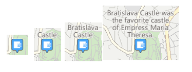

# Exibir pontos de interesse (POI) em um mapa


\[ Atualizado para aplicativos UWP no Windows 10. Para ler artigos sobre o Windows 8.x, consulte o [arquivo morto](http://go.microsoft.com/fwlink/p/?linkid=619132) \]


Adicione pontos de interesse (POI) a um mapa usando pinos, imagens, formas e elementos de interface do usuário XAML. Uma ponto de interesse é um ponto específico no mapa que representa algo de seu interesse. Por exemplo, o local de uma empresa, cidade ou amigo.

**Dica** Para saber mais sobre a exibição de pontos de interesse no seu aplicativo, baixe a amostra a seguir do [repositório de amostras universais do Windows](http://go.microsoft.com/fwlink/p/?LinkId=619979) no GitHub.

-   [Exemplo de mapa da Plataforma Universal do Windows (UWP)](http://go.microsoft.com/fwlink/p/?LinkId=619977)

Exiba pinos, imagens e formas no mapa adicionando objetos [**MapIcon**](https://msdn.microsoft.com/library/windows/apps/dn637077), [**MapPolygon**](https://msdn.microsoft.com/library/windows/apps/dn637103) e [**MapPolyline**](https://msdn.microsoft.com/library/windows/apps/dn637114) à coleção [**MapElements**](https://msdn.microsoft.com/library/windows/apps/dn637033) do controle de mapa. Use a vinculação de dados ou adicione itens programaticamente; não é possível associar a coleção **MapElements** declarativamente na marcação XAML.

Exiba elementos da interface do usuário XAML como um [**Button**](https://msdn.microsoft.com/library/windows/apps/br209265), um [**HyperlinkButton**](https://msdn.microsoft.com/library/windows/apps/br242739) ou um [**TextBlock**](https://msdn.microsoft.com/library/windows/apps/br209652) no mapa, adicionando-os como [**Children**](https://msdn.microsoft.com/library/windows/apps/dn637008) do [**MapControl**](https://msdn.microsoft.com/library/windows/apps/dn637004). Você também pode adicioná-los ao [**MapItemsControl**](https://msdn.microsoft.com/library/windows/apps/dn637094) ou vincular o **MapItemsControl** a uma coleção de itens.

Resumindo:

-   [Adicione um MapIcon ao mapa](#mapicon) para exibir uma imagem como um pino com texto opcional.
-   [Adicione um MapPolygon ao mapa de](#mappolygon) para exibir uma forma de vários pontos.
-   [Adicione um MapPolyline ao mapa](#mappolyline) para exibir linhas no mapa.
-   [Adicione XAML ao mapa](#mapxaml) para exibir elementos de interface do usuário personalizados.

Caso você tenha um grande número de elementos a serem colocados no mapa, leve em consideração [sobrepor imagens lado a lado no mapa](overlay-tiled-images.md). Para exibir rodovias no mapa, consulte [Exibir rotas e trajetos](routes-and-directions.md).

## Adicionar um MapIcon


Exiba uma imagem como um pino, com texto opcional, no mapa usando a classe [**MapIcon**](https://msdn.microsoft.com/library/windows/apps/dn637077). Você pode aceitar a imagem padrão ou fornecer uma imagem personalizada usando a propriedade [**Image**](https://msdn.microsoft.com/library/windows/apps/dn637078). A imagem a seguir exibe a imagem padrão para um **MapIcon** sem um valor especificado para a propriedade [**Title**](https://msdn.microsoft.com/library/windows/apps/dn637088), com um título curto, com um título longo e com um título muito longo.



O exemplo a seguir mostra um mapa da cidade de Seattle e adiciona um [**MapIcon**](https://msdn.microsoft.com/library/windows/apps/dn637077) com a imagem padrão e um título opcional para indicar a localização da Space Needle. Também centraliza o mapa sobre o ícone e aumenta. Para obter informações gerais sobre como usar o controle de mapa, consulte [Exiba mapas em modos de exibição 2D, 3D e Streetside](display-maps.md).

```csharp
      private void displayPOIButton_Click(object sender, RoutedEventArgs e)
      {
         // Specify a known location.
         BasicGeoposition snPosition = new BasicGeoposition() { Latitude = 47.620, Longitude = -122.349 };
         Geopoint snPoint = new Geopoint(snPosition);

         // Create a MapIcon.
         MapIcon mapIcon1 = new MapIcon();
         mapIcon1.Location = snPoint;
         mapIcon1.NormalizedAnchorPoint = new Point(0.5, 1.0);
         mapIcon1.Title = "Space Needle";
         mapIcon1.ZIndex = 0;

         // Add the MapIcon to the map.
         MapControl1.MapElements.Add(mapIcon1);

         // Center the map over the POI.
         MapControl1.Center = snPoint;
         MapControl1.ZoomLevel = 14;
      }
```

Este exemplo exibe no mapa o ponto de interesse a seguir (a imagem padrão no centro).


A linha de código a seguir exibe o [**MapIcon**](https://msdn.microsoft.com/library/windows/apps/dn637077) com uma imagem personalizada salva na pasta Ativos do projeto. A propriedade [**Image**](https://msdn.microsoft.com/library/windows/apps/dn637078) do **MapIcon** espera um valor do tipo [**RandomAccessStreamReference**](https://msdn.microsoft.com/library/windows/apps/hh701813). Esse tipo requer uma instrução **using** para o namespace [**Windows.Storage.Streams**](https://msdn.microsoft.com/library/windows/apps/br241791).

**Dica** Caso você use a mesma imagem para vários ícones de mapa, declare o [**RandomAccessStreamReference**](https://msdn.microsoft.com/library/windows/apps/hh701813) no nível da página ou do aplicativo tendo em vista o melhor desempenho.

```csharp
    MapIcon1.Image =
        RandomAccessStreamReference.CreateFromUri(new Uri("ms-appx:///Assets/customicon.png"));
```

Tenha estas considerações em mente ao trabalhar com a classe [**MapIcon**](https://msdn.microsoft.com/library/windows/apps/dn637077):

-   A propriedade [**Image**](https://msdn.microsoft.com/library/windows/apps/dn637078) dá suporte à imagem de tamanho máximo 2048×2048 pixels.
-   Por padrão, a exibição da imagem do ícone de mapa não é garantida. Ele pode ficar oculto quando obscurecer outros elementos ou rótulos no mapa. Para manter visível, defina a propriedade [**CollisionBehaviorDesired**](https://msdn.microsoft.com/library/windows/apps/dn974327) do ícone de mapa como [**MapElementCollisionBehavior.RemainVisible**](https://msdn.microsoft.com/library/windows/apps/dn974314).
-   Não há garantia de que o [**Title**](https://msdn.microsoft.com/library/windows/apps/dn637088) opcional do [**MapIcon**](https://msdn.microsoft.com/library/windows/apps/dn637077) seja mostrado. Se você não vir o texto, aplique zoom diminuindo o valor da propriedade [**ZoomLevel**](https://msdn.microsoft.com/library/windows/apps/dn637068) do [**MapControl**](https://msdn.microsoft.com/library/windows/apps/dn637004).
-   Quando exibir uma imagem [**MapIcon**](https://msdn.microsoft.com/library/windows/apps/dn637077) que aponta para um local específico no mapa - por exemplo, um botão de pressão ou uma seta - considere configurar o valor da propriedade [**NormalizedAnchorPoint**](https://msdn.microsoft.com/library/windows/apps/dn637082) para a localização aproximada do ponteiro na imagem. Caso você deixe o valor de **NormalizedAnchorPoint** no valor padrão (0, 0), o que representa o canto superior esquerdo da imagem, as mudanças em [**ZoomLevel**](https://msdn.microsoft.com/library/windows/apps/dn637068) do mapa podem deixar a imagem apontando para uma localização diferente.

## Adicionar um MapPolygon


Exiba uma forma de vários pontos no mapa usando a classe [**MapPolygon**](https://msdn.microsoft.com/library/windows/apps/dn637103). O exemplo a seguir, da [Amostra de mapa UWP](http://go.microsoft.com/fwlink/p/?LinkId=619977), mostra uma caixa vermelha com borda azul no mapa.

```csharp
private void mapPolygonAddButton_Click(object sender, Windows.UI.Xaml.RoutedEventArgs e)
{
   double centerLatitude = myMap.Center.Position.Latitude;
   double centerLongitude = myMap.Center.Position.Longitude;
   MapPolygon mapPolygon = new MapPolygon();
   mapPolygon.Path = new Geopath(new List<BasicGeoposition>() {
         new BasicGeoposition() {Latitude=centerLatitude+0.0005, Longitude=centerLongitude-0.001 },                
         new BasicGeoposition() {Latitude=centerLatitude-0.0005, Longitude=centerLongitude-0.001 },                
         new BasicGeoposition() {Latitude=centerLatitude-0.0005, Longitude=centerLongitude+0.001 },
         new BasicGeoposition() {Latitude=centerLatitude+0.0005, Longitude=centerLongitude+0.001 },

   });
           
   mapPolygon.ZIndex = 1;
   mapPolygon.FillColor = Colors.Red;
   mapPolygon.StrokeColor = Colors.Blue;
   mapPolygon.StrokeThickness = 3;
   mapPolygon.StrokeDashed = false;
   myMap.MapElements.Add(mapPolygon);
}
```

## Adicionar um MapPolyline


Exiba uma linha no mapa usando a classe [**MapPolyline**](https://msdn.microsoft.com/library/windows/apps/dn637114). O exemplo a seguir, da [Amostra de mapa UWP](http://go.microsoft.com/fwlink/p/?LinkId=619977), mostra uma linha tracejada no mapa.

```csharp
private void mapPolylineAddButton_Click(object sender, Windows.UI.Xaml.RoutedEventArgs e)
{
   double centerLatitude = myMap.Center.Position.Latitude;
   double centerLongitude = myMap.Center.Position.Longitude;
   MapPolyline mapPolyline = new MapPolyline();
   mapPolyline.Path = new Geopath(new List<BasicGeoposition>() {                
         new BasicGeoposition() {Latitude=centerLatitude-0.0005, Longitude=centerLongitude-0.001 },                
         new BasicGeoposition() {Latitude=centerLatitude+0.0005, Longitude=centerLongitude+0.001 },
   });
              
   mapPolyline.StrokeColor = Colors.Black;
   mapPolyline.StrokeThickness = 3;
   mapPolyline.StrokeDashed = true;
   myMap.MapElements.Add(mapPolyline);
}
```

## Adicionar XAML


Exiba elementos de interface do usuário personalizados no mapa usando XAML. Posicione o XAML no mapa especificando o local e o ponto de ancoragem normalizado do XAML.

-   Defina a localização no mapa em que a XAML é colocada chamando [**SetLocation**](https://msdn.microsoft.com/library/windows/desktop/ms704369).
-   Defina a localização relativa no XAML correspondente à localização especificada chamando [**SetNormalizedAnchorPoint**](https://msdn.microsoft.com/library/windows/apps/dn637050).

O exemplo a seguir mostra um mapa da cidade de Seattle e adiciona um controle [**Border**](https://msdn.microsoft.com/library/windows/apps/br209250) XAML para indicar o local da Space Needle. Também centraliza o mapa sobre a área e aumenta. Para obter informações gerais sobre como usar o controle de mapa, consulte [Exiba mapas em modos de exibição 2D, 3D e Streetside](display-maps.md).

```csharp
private void displayXAMLButton_Click(object sender, RoutedEventArgs e)
{
   // Specify a known location.
   BasicGeoposition snPosition = new BasicGeoposition() { Latitude = 47.620, Longitude = -122.349 };
   Geopoint snPoint = new Geopoint(snPosition);

   // Create a XAML border.
   Border border = new Border
   {
      Height = 100,
      Width = 100,
      BorderBrush = new SolidColorBrush(Windows.UI.Colors.Blue),
      BorderThickness = new Thickness(5),
   };

   // Center the map over the POI.
   MapControl1.Center = snPoint;
   MapControl1.ZoomLevel = 14;

   // Add XAML to the map.
   MapControl1.Children.Add(border);
   MapControl.SetLocation(border, snPoint);
   MapControl.SetNormalizedAnchorPoint(border, new Point(0.5, 0.5));
}
```

Este exemplo exibe uma borda azul no mapa.


Os exemplos a seguir mostram como adicionar elementos de interface do usuário XAML diretamente na marcação XAML da página usando vinculação de dados. Assim como acontecem com outros elementos XAML que exibem conteúdo, [**Children**](https://msdn.microsoft.com/library/windows/apps/dn637008) é a propriedade de conteúdo padrão do [**MapControl**](https://msdn.microsoft.com/library/windows/apps/dn637004) e não precisa ser especificada explicitamente na marcação XAML.

Este exemplo mostra como exibir dois controles XAML como filhos implícitos do [**MapControl**](https://msdn.microsoft.com/library/windows/apps/dn637004).

```xml
<maps:MapControl>
    <TextBox Text="Seattle" maps:MapControl.Location="{Binding SeattleLocation}"/>
    <TextBox Text="Bellevue" maps:MapControl.Location="{Binding BellevueLocation}"/>
</maps:MapControl>
```

Este exemplo mostra como exibir dois controles XAML contidos dentro de um [**MapItemsControl**](https://msdn.microsoft.com/library/windows/apps/dn637094).

```xml
<maps:MapControl>
  <maps:MapItemsControl>
    <TextBox Text="Seattle" maps:MapControl.Location="{Binding SeattleLocation}"/>
    <TextBox Text="Bellevue" maps:MapControl.Location="{Binding BellevueLocation}"/>
  </maps:MapItemsControl>
</maps:MapControl>
```

Este exemplo exibe uma coleção de elementos XAML vinculados a um [**MapItemsControl**](https://msdn.microsoft.com/library/windows/apps/dn637094).

```xml
<maps:MapControl x:Name="MapControl" MapTapped="MapTapped" MapDoubleTapped="MapTapped" MapHolding="MapTapped">
  <maps:MapItemsControl ItemsSource="{Binding StateOverlays}">
    <maps:MapItemsControl.ItemTemplate>
      <DataTemplate>
        <StackPanel Background="Black" Tapped="Overlay_Tapped">
          <TextBlock maps:MapControl.Location="{Binding Location}" Text="{Binding Name}" maps:MapControl.NormalizedAnchorPoint="0.5,0.5" FontSize="20" Margin="5"/>
        </StackPanel>
      </DataTemplate>
    </maps:MapItemsControl.ItemTemplate>
  </maps:MapItemsControl>
</maps:MapControl>
```

## Tópicos relacionados

* [Central de Desenvolvedores do Bing Mapas](https://www.bingmapsportal.com/)
* [Amostra de mapa UWP](http://go.microsoft.com/fwlink/p/?LinkId=619977)
* [Diretrizes de design para mapas](https://msdn.microsoft.com/library/windows/apps/dn596102)
* [Vídeo do build 2015: Aproveitando mapas e localização em telefones, tablets e computadores em seus aplicativos do Windows](https://channel9.msdn.com/Events/Build/2015/2-757)
* [Exemplo de aplicativo de tráfego UWP](http://go.microsoft.com/fwlink/p/?LinkId=619982)
* [**MapIcon**](https://msdn.microsoft.com/library/windows/apps/dn637077)
* [**MapPolygon**](https://msdn.microsoft.com/library/windows/apps/dn637103)
* [**MapPolyline**](https://msdn.microsoft.com/library/windows/apps/dn637114)


<!--HONumber=Jun16_HO5-->


