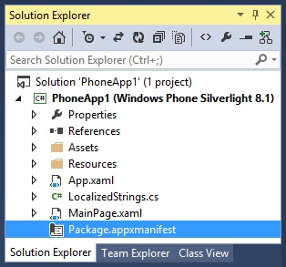

# AdControl no Windows Phone Silverlight


Este guia passo a passo mostra como usar a classe [AdControl](https://msdn.microsoft.com/library/windows/apps/hh524191.aspx) para exibir anúncios em faixa em um aplicativo Silverlight para Windows Phone 8.1 ou Windows Phone 8.0.

> **Observação para Windows Phone Silverlight 8.0**&nbsp;&nbsp;Os anúncios em faixa ainda são compatíveis com os aplicativos existentes do Windows Phone 8.0 Silverlight que usam um **AdControl** de uma versão anterior do SDK do Universal Ad Client ou do SDK do Microsoft Advertising e que já estão disponíveis na Loja. No entanto, anúncios em faixa não são mais compatíveis com os novos projetos do Windows Phone 8.0 Silverlight. Além disso, alguns cenários de depuração e testes são limitados nos projetos do Windows Phone 8.x Silverlight. Para obter mais informações, consulte [Exibir anúncios no seu aplicativo](display-ads-in-your-app.md#silverlight_support).


## Adicione os assemblies de publicidade ao seu projeto

Para começar, baixe e instale o pacote NuGet que contém os assemblies do Microsoft Advertising para Windows Phone Silverlight ao seu projeto.

1.  Abra seu projeto no Visual Studio.

2.  Clique em **Ferramentas**, aponte para **Gerenciador de Pacotes NuGet** e clique em **Console do Gerenciador de Pacote**.

3.  Na janela **Console do Gerenciador de Pacote**, insira um desses comandos.

  * Se seu projeto for direcionado para Windows Phone 8.0, digite este comando.

      ```
      Install-Package Microsoft.Advertising.WindowsPhone.SL80 -Version 6.2.40501.1
      ```

  * Se seu projeto for direcionado para Windows Phone 8.1, digite este comando.

      ```
      Install-Package Microsoft.Advertising.WindowsPhone.SL81 -Version 8.1.50112
      ```

    Depois de inserir o comando, todos os assemblies necessários do Microsoft Advertising para o Silverlight serão baixados para o seu projeto local por meio de pacotes NuGet, e as referências a esses assemblies serão adicionadas automaticamente ao seu projeto.

## Codificar seu aplicativo


1.  Adicione os seguintes recursos ao nó **Recursos** no arquivo WMAppManifest.xml.

    ``` syntax
    <Capability Name="ID_CAP_IDENTITY_USER"/>
    <Capability Name="ID_CAP_MEDIALIB_PHOTO"/>
    <Capability Name="ID_CAP_PHONEDIALER"/>
    ```

    Neste exemplo, seu nó **Recursos** se parece com:

    ``` syntax
        <Capabilities>
          <Capability Name="ID_CAP_NETWORKING"/>
          <Capability Name="ID_CAP_MEDIALIB_AUDIO"/>
          <Capability Name="ID_CAP_MEDIALIB_PLAYBACK"/>
          <Capability Name="ID_CAP_SENSORS"/>
          <Capability Name="ID_CAP_WEBBROWSERCOMPONENT"/>
          <Capability Name="ID_CAP_IDENTITY_USER"/>
          <Capability Name="ID_CAP_MEDIALIB_PHOTO"/>
          <Capability Name="ID_CAP_PHONEDIALER"/>
        </Capabilities>
    ```

2.  (Opcional) Salve seu projeto. Clique no ícone **Salvar Tudo** ou no menu **Arquivo**, clique em **Salvar Tudo**.

3.  Adicione a funcionalidade **Internet (Cliente e Servidor)** ao arquivo Package.appxmanifest em seu projeto. No **Gerenciador de Soluções**, clique duas vezes em **Package.appxmanifest**.

    

    No **Editor**, clique na guia **Recursos**. Marque a caixa **Internet (Cliente e Servidor)**.

4.  (Opcional) Salve seu projeto. Clique no ícone **Salvar Tudo** ou no menu **Arquivo**, clique em **Salvar Tudo**.

5.  Modifique a marcação Silverlight no arquivo MainPage.xaml para incluir o namespace **Microsoft.Advertising.Mobile.UI**.

    ``` syntax
    xmlns:UI="clr-namespace:Microsoft.Advertising.Mobile.UI;assembly=Microsoft.Advertising.Mobile.UI"
    ```

    O cabeçalho da sua página terá o código a seguir:

    ``` syntax
        xmlns:mc="http://schemas.openxmlformats.org/markup-compatibility/2006"
        xmlns:UI="clr-namespace:Microsoft.Advertising.Mobile.UI;assembly=Microsoft.Advertising.Mobile.UI"
        x:Class="PhoneApp1.MainPage"
    ```

6.  Na marca **Grade**, adicione o código a seguir do **AdControl**. Atribua as propriedades **ApplicationId** e **AdUnitId** aos valores de teste fornecidos em [Valores de modo de teste](test-mode-values.md), e ajuste as propriedades **Height** e **Width** para um dos [tamanhos de anúncio compatíveis com anúncios em faixa](supported-ad-sizes-for-banner-ads.md).

    > **Observação**&nbsp;&nbsp;Você substituirá os valores de teste **ApplicationId** e **AdUnitId** por valores dinâmicos antes de enviar seu aplicativo.

    ``` syntax
    <Grid x:Name="ContentPanel" Grid.Row="1">

      <UI:AdControl
             ApplicationId="3f83fe91-d6be-434d-a0ae-7351c5a997f1"
             AdUnitId="10865270"
             HorizontalAlignment="Left"
             Height="80"
             VerticalAlignment="Top"
             Width="480"/>

    </Grid>
    ```

7.  Compile e execute o seu projeto. Confirme que seu aplicativo exibe um anúncio, semelhante ao seguinte:

    

## Lançar seu aplicativo com anúncios dinâmicos usando o Centro de Desenvolvimento


1.  No painel do Centro de Desenvolvimento, vá para a página **Monetização** &gt; **Monetizar com anúncios** para seu aplicativo e [crie uma unidade autônoma do Microsoft Advertising](../publish/monetize-with-ads.md). Para obter o tipo de unidade de anúncio, especifique **Banner**. Anote o ID da unidade de anúncio e o ID do aplicativo.

2.  Em seu código, substitua os valores da unidade de anúncio de teste (**applicationId** e **adUnitId**) pelos valores dinâmicos gerados no Centro de Desenvolvimento.

3.  [Envie seu aplicativo](../publish/app-submissions.md) para a Loja usando o painel do Centro de Desenvolvimento.

4.  Analise seus [relatórios de desempenho de publicidade](../publish/advertising-performance-report.md) no painel do Centro de Desenvolvimento.


 


<!--HONumber=Sep16_HO2-->


