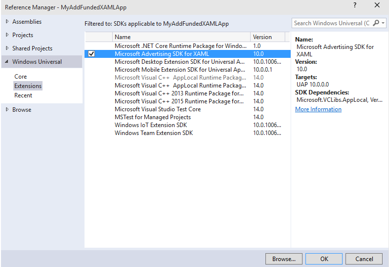

# AdControl em XAML e .NET


\[ Atualizado para aplicativos UWP no Windows 10. Para ler artigos sobre o Windows 8.x, consulte o [arquivo](http://go.microsoft.com/fwlink/p/?linkid=619132) \]

Este guia passo a passo mostra como usar a classe [AdControl](https://msdn.microsoft.com/library/windows/apps/microsoft.advertising.winrt.ui.adcontrol.aspx) para exibir anúncios em faixa em um aplicativo XAML para Windows 10 (UWP), Windows 8.1 ou Windows Phone 8.1. Este guia passo a passo não usa o **AdMediatorControl** nem a mediação de anúncios.

Para um projeto de exemplo completo que demonstra como adicionar anúncios em faixa a um aplicativo XAML em C# e C++, consulte os [Exemplos de publicidade no GitHub](http://aka.ms/githubads).

## Pré-requisitos

* Instale o [SDK do Microsoft Store Engagement and Monetization](http://aka.ms/store-em-sdk) com o Visual Studio 2015 ou o Visual Studio 2013.

## Desenvolvimento de código

1. No Visual Studio, abra o projeto ou crie um novo projeto.

2. Se o seu projeto tem direcionamento **Any CPU**, atualize-o para usar uma saída de compilação de arquitetura específica (por exemplo, **x86**). Se o seu projeto tem direcionamento **Any CPU**, você não conseguirá adicionar uma referência à biblioteca do Microsoft Advertising nas etapas a seguir. Para obter mais informações, consulte [Erros de referência causados pelo direcionamento Any CPU em seu projeto](known-issues-for-the-advertising-libraries.md#reference_errors).

1.  Na janela **Gerenciador de Soluções**, clique com o botão direito do mouse em **Referências** e selecione **Adicionar Referência...**

2.  Em **Gerenciador de Referências**, selecione uma das seguintes referências dependendo do tipo de projeto:

    -   Para um projeto da Plataforma Universal do Windows (UWP): expanda **Universal Windows**, clique em **Extensões**e marque a caixa de seleção ao lado de **SDK do Microsoft Advertising para XAML** (versão 10.0).

    -   Para um projeto do Windows 8.1: expanda **Windows 8.1**, clique em **Extensões**e, em seguida, marque a caixa de seleção ao lado de **SDK do Ad Mediator para Windows 8.1 XAML**. Essa opção adiciona as bibliotecas do Microsoft Advertising e do Ad Mediator ao seu projeto, mas você pode ignorar as bibliotecas do Ad Mediator.

    -   Para um projeto do Windows Phone 8.1: expanda **Windows Phone 8.1**, clique em **Extensões**e marque a caixa de seleção ao lado de **SDK do Ad Mediator para Windows Phone 8.1 XAML**. Essa opção adiciona as bibliotecas do Microsoft Advertising e do Ad Mediator ao seu projeto, mas você pode ignorar as bibliotecas do Ad Mediator.

  

    > **Observação**  Esta imagem é do Visual Studio 2015 compilando um projeto UWP para Windows 10. Se você estiver compilando um aplicativo do Windows 8.1 ou Windows Phone 8.1 ou usando o Visual Studio 2013, sua tela terá uma aparência diferente.

3.  No **Gerenciador de Referências**, clique em OK.
4.  Modifique o XAML da página em que você está inserindo anúncios para incluir o namespace **Microsoft.Advertising.WinRT.UI**. Por exemplo, no aplicativo de exemplo padrão gerado pelo Visual Studio (chamado, neste aplicativo, MyAdFundedWindows10AppXAML), a página XAML é **MainPage.XAML**.

    A seção **Página** do arquivo MainPage.xaml gerado pelo Visual Studio tem o código a seguir.

    ``` syntax
    <Page
        x:Class="MyAdFundedWindows10AppXAML.MainPage"
        xmlns="http://schemas.microsoft.com/winfx/2006/xaml/presentation"
        xmlns:x="http://schemas.microsoft.com/winfx/2006/xaml"
        xmlns:local="using:MyAdFundedWindows10AppXAML"
        xmlns:d="http://schemas.microsoft.com/expression/blend/2008"
        xmlns:mc="http://schemas.openxmlformats.org/markup-compatibility/2006"
        mc:Ignorable="d">

        <Grid Background="{ThemeResource ApplicationPageBackgroundThemeBrush}">

        </Grid>
    </Page>
    ```

    Adicione a referência ao namespace **Microsoft.Advertising.WinRT.UI** para que a seção **Página** do arquivo MainPage.xaml tenha o código a seguir.

    ``` syntax
    <Page
        x:Class="MyAdFundedWindows10AppXAML.MainPage"
        xmlns="http://schemas.microsoft.com/winfx/2006/xaml/presentation"
        xmlns:x="http://schemas.microsoft.com/winfx/2006/xaml"
        xmlns:local="using:MyAdFundedWindows10AppXAML"
        xmlns:d="http://schemas.microsoft.com/expression/blend/2008"
        xmlns:mc="http://schemas.openxmlformats.org/markup-compatibility/2006"
        xmlns:UI="using:Microsoft.Advertising.WinRT.UI"
        mc:Ignorable="d">

        <Grid Background="{ThemeResource ApplicationPageBackgroundThemeBrush}">

        </Grid>
    </Page>
    ```

5.  Na marca **Grade**, adicione o código do **AdControl**.

    1.  Atribua as propriedades [ApplicationId](https://msdn.microsoft.com/library/windows/apps/microsoft.advertising.winrt.ui.adcontrol.applicationid.aspx) e [AdUnitId](https://msdn.microsoft.com/library/windows/apps/microsoft.advertising.winrt.ui.adcontrol.adunitid.aspx) na **Página** aos valores de teste fornecidos em [Valores de modo de teste](test-mode-values.md).

        > **Observação**   Você substituirá os valores de teste por valores dinâmicos antes de enviar seu aplicativo.

    2.  Ajuste a altura e a largura do controle para que ele tenha um dos [tamanhos de anúncio compatíveis com anúncios em faixa](supported-ad-sizes-for-banner-ads.md).

    A marca **Grade** se parece com o código a seguir.

    ``` syntax
    <Grid Background="{StaticResource ApplicationPageBackgroundThemeBrush}">

            <UI:AdControl ApplicationId="3f83fe91-d6be-434d-a0ae-7351c5a997f1"
                          AdUnitId="10865270"
                          HorizontalAlignment="Left"
                          Height="250"
                          VerticalAlignment="Top"
                          Width="300"/>
    </Grid>
    ```

    O código completo do arquivo MainPage.xaml deve ter a aparência a seguir.

    ``` syntax
    <Page
        x:Class="MyAdFundedWindows10AppXAML.MainPage"
        xmlns="http://schemas.microsoft.com/winfx/2006/xaml/presentation"
        xmlns:x="http://schemas.microsoft.com/winfx/2006/xaml"
        xmlns:local="using:MyAdFundedWindows10AppXAML"
        xmlns:d="http://schemas.microsoft.com/expression/blend/2008"
        xmlns:mc="http://schemas.openxmlformats.org/markup-compatibility/2006"
        xmlns:UI="using:Microsoft.Advertising.WinRT.UI"
        mc:Ignorable="d">

        <Grid Background="{StaticResource ApplicationPageBackgroundThemeBrush}">

            <UI:AdControl ApplicationId="3f83fe91-d6be-434d-a0ae-7351c5a997f1"
                          AdUnitId="10865270"
                          HorizontalAlignment="Left"
                          Height="250"
                          VerticalAlignment="Top"
                          Width="300"/>
        </Grid>
    </Page>
    ```

6.  Compile e execute o aplicativo para vê-lo com um anúncio.

## Lançar seu aplicativo com anúncios dinâmicos usando o Centro de Desenvolvimento do Windows


1.  No painel do Centro de Desenvolvimento, vá para a página **Monetização**&gt;**Monetizar com anúncios** para seu aplicativo e [crie uma unidade autônoma do Microsoft Advertising](../publish/monetize-with-ads.md). Para obter o tipo de unidade de anúncio, especifique **Banner**. Anote o ID da unidade de anúncio e o ID do aplicativo.

2.  Em seu código, substitua os valores da unidade de anúncio de teste (**ApplicationId** e **AdUnitId**) pelos valores dinâmicos gerados no Centro de Desenvolvimento.

3.  [Envie seu aplicativo](../publish/app-submissions.md) para a Loja usando o painel do Centro de Desenvolvimento.

4.  Analise seus [relatórios de desempenho de publicidade](../publish/advertising-performance-report.md) no painel do Centro de Desenvolvimento.

## Observações

C#: veja [Exemplo de propriedades XAML](xaml-properties-example.md) para obter um exemplo de como atribuir manipuladores de eventos a eventos de **AdControl**. Em seguida, veja [Eventos de AdControl em C#](adcontrol-events-in-c.md) para obter o código de exemplo que mostra os manipuladores de eventos escritos em C#.

Visual Basic: veja [Exemplo de propriedades XAML](xaml-properties-example.md) para obter um exemplo de como atribuir manipuladores de eventos a eventos de **AdControl**.

C++: a versão atual das bibliotecas do Microsoft Advertising são compatíveis com C++. O **AdControl** carrega o CLR e usa C++ gerenciado.

Tratamento de erros: para saber mais sobre como tratar erros, consulte [Tratamento de erros de AdControl](adcontrol-error-handling.md).

## Tópicos relacionados

* [Exemplos de publicidade no GitHub](http://aka.ms/githubads)

 


<!--HONumber=Jun16_HO4-->


