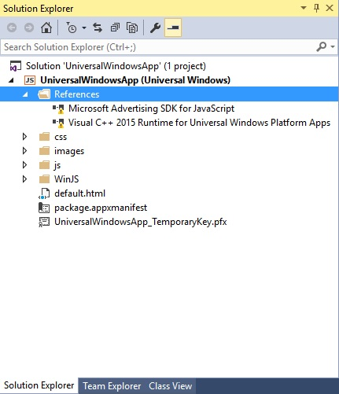
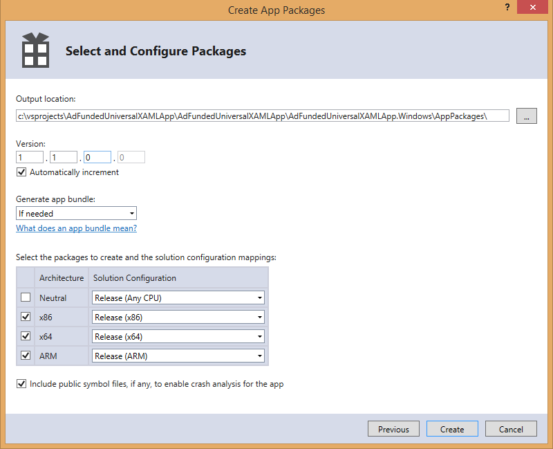

# Problemas conhecidos das bibliotecas de publicidade

Este tópico lista os problemas conhecidos com a versão atual das bibliotecas do Microsoft Advertising no Microsoft Store Services SDK (para aplicativos UWP) e o Microsoft Advertising SDK para Windows e Windows Phone 8.x (para aplicativos do Windows 8.1 e Windows Phone 8.x).

## A instalação do Microsoft Store Services SDK requer as Ferramentas do Visual Studio para aplicativos universais do Windows

Para instalar o [Microsoft Store Services SDK](http://aka.ms/store-em-sdk) com o Visual Studio 2015, você deve ter a versão 1.1 ou posterior das Ferramentas do Visual Studio para Aplicativos Universais do Windows instalada. Para obter mais informações, consulte as [notas de versão](http://go.microsoft.com/fwlink/?LinkID=624516) do o Visual Studio.

## Projetos do Windows Phone 8.x Silverlight

O SDK do Microsoft Advertising para Windows e Windows Phone 8.x tem suporte limitado para projetos do Windows Phone 8.x Silverlight. Para obter mais informações, consulte [Exibir anúncios no seu aplicativo](display-ads-in-your-app.md#silverlight_support).

Para obter os assemblies do Microsoft Advertising para projetos do Windows Phone 8.x Silverlight, instale o [SDK do Microsoft Advertising para Windows e Windows Phone 8.x](http://aka.ms/store-8-sdk), abra o projeto no Visual Studio e, em seguida, vá para **Projeto** > **Adicionar Serviço Conectado** > **Ad Mediator** para baixar automaticamente os assemblies. Depois de fazer isso, você pode remover as referências do Ad Mediator do seu projeto se não quiser usar a mediação de anúncios. Para saber mais, consulte [AdControl no Windows Phone Silverlight](adcontrol-in-windows-phone-silverlight.md).

## Interface AdControl desconhecida em XAML

A marcação de XAML para um [AdControl](https://msdn.microsoft.com/library/windows/apps/microsoft.advertising.winrt.ui.adcontrol.aspx) pode mostrar incorretamente uma linha curva azul indicando que a interface é desconhecida. Isso ocorre apenas no direcionamento x86 e pode ser ignorado.

## lastError da solicitação de anúncio anterior

Se houver um **lastError** restante da solicitação de anúncio anterior, o evento poderá ser disparado duas vezes durante a próxima chamada de anúncios. Embora a nova solicitação de anúncio ainda será feita e poderá render um anúncio válido, esse comportamento pode causar confusão.

## Anúncios intersticiais e botões de navegação em telefones

Em telefones (ou emuladores) que têm os botões **Voltar**, **Iniciar** e **Pesquisar** de software em vez de botões de hardware, o temporizador de contagem regressiva e botões de clique para anúncios intersticiais podem ficar obscuros.

## Anúncios criados recentemente não estão sendo fornecidos para seu aplicativo

Se você tiver criado um anúncio recentemente (menos de um dia), talvez ele não fique disponível imediatamente. Se o conteúdo editorial do anúncio for aprovado, ele será disponibilizado depois que o servidor de publicidade processá-lo e o anúncio estiver disponível como inventário.

## Nenhum anúncio é mostrado em seu aplicativo

Há muitos motivos para você não ver anúncios, incluindo erros de rede. Outros motivos podem incluir:

* Selecionar uma unidade de anúncios no Centro de Desenvolvimento do Windows com um tamanho maior ou menor do que o tamanho do **AdControl** no código do seu aplicativo.

* Os anúncios não aparecerão se você estiver usando um [valor de modo de teste](test-mode-values.md) para seu ID de unidade de anúncios ao executar um aplicativo dinâmico.

* Se você criou uma nova ID de unidade de anúncios na última meia hora, talvez você não a veja até que os servidores propaguem novos dados por meio do sistema. Os IDs existentes que tenham mostrado anúncios antes devem mostrar anúncios imediatamente.

Se você pode ver anúncios de teste no aplicativo, seu código está funcionando e é capaz de exibir anúncios. Se você tiver problemas, entre em contato com o [suporte do produto](https://go.microsoft.com/fwlink/p/?LinkId=331508). Nessa página, escolha **Publicidade no aplicativo**.

Você também pode postar uma pergunta no [fórum](http://go.microsoft.com/fwlink/p/?LinkId=401266).

## Anúncios de teste estão aparecendo em seu aplicativo em vez de anúncios ativos

Anúncios de teste podem ser mostrados, mesmo quando você está esperando anúncios ativos. Isso pode acontecer nos seguintes cenários:

* O Microsoft Advertising não consegue verificar ou localizar a ID do aplicativo ativo usado no repositório do aplicativo. Nesse caso, quando uma unidade de anúncios é criada por um usuário, seu status pode iniciar como dinâmico (não teste) mas passará para status de teste 6 horas após a primeira solicitação de anúncio. Ele mudará novamente para ativo se não houver nenhum solicitação dos aplicativos de teste por 10 dias.

* Aplicativos de sideload ou aplicativos que estão em execução no emulador não mostrarão anúncios ativos.

Quando uma unidade de anúncio dinâmico estiver fornecendo anúncios de teste, o status da unidade de anúncio mostra **Ativo e fornecendo anúncios de teste** no Centro de Desenvolvimento do Windows. Isso não se aplica atualmente aos aplicativos de telefone.

## Valores de teste obsoletos para a ID da unidade de anúncios e a ID do aplicativo não estão mais funcionando

Os seguintes valores de teste para aplicativos do Windows Phone Silverlight estão obsoletos e não funcionarão mais. Se você tiver um projeto existente que use esses valores de teste, atualize seu projeto para usar os valores fornecidos em[Valores do modo de teste](test-mode-values.md).

| ID do aplicativo  |  ID da unidade de anúncios    |
|-----------------|----------------|
| test_client     |  Image320_50   |
| test_client     |  Image300_50   |
| test_client     |  TextAd   |
| test_client     |  Image480_80   |

## Erros de referência causados pelo direcionamento de Nenhuma CPU em seu projeto

Ao usar as bibliotecas do Microsoft Advertising, você não pode direcionar para **Any CPU** em seu projeto. Se o seu projeto for direcionado para a plataforma **Any CPU**, você poderá ver um aviso depois de adicionar a referência semelhante a esta.

Para remover esse aviso, atualize seu projeto para usar uma saída de compilação específica da arquitetura (por exemplo, **x86**). Use o **Gerenciador de Configurações** para definir os destinos de plataforma para depuração e configurações de versão.

Quando você cria pacotes do aplicativo para envio de armazenamento (como mostrado nas imagens a seguir), certifique-se de incluir as arquiteturas para as quais você pretende direcionar. Você pode optar por ignorar x64 se pretende executar compilações x86 no sistema operacional x64.

## Ordem Z em aplicativos JavaScript/HTML

Os aplicativos JavaScript/HTML não devem colocar elementos no intervalo de 10 MAX reservado da ordem z. A única exceção é uma sobreposição de interrupção, como uma notificação de chamada de entrada para um aplicativo do Skype.

## Não use bordas

Definir propriedades relacionadas a borda herdada do **AdControl** da classe pai fará com que o posicionamento de anúncios fique incorreto.

## Mais informações

Para obter mais informações sobre os problemas conhecidos mais recentes e publicar perguntas relacionadas às bibliotecas do Microsoft Advertising, visite o [fórum](http://go.microsoft.com/fwlink/p/?LinkId=401266).

## Suporte

Para entrar em contato com o suporte em relação a problemas com as bibliotecas do Microsoft Advertising, visite a [página de suporte](https://go.microsoft.com/fwlink/p/?LinkId=331508) e escolha **Publicidade no Aplicativo**.

 

 
