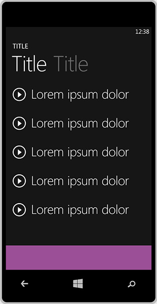
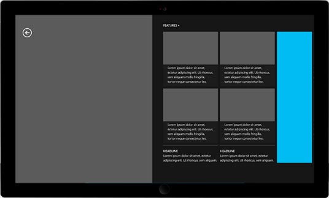

# Tamanhos aceitos de anúncios em banner

\[ Atualizado para aplicativos UWP no Windows 10. Para ler artigos sobre o Windows 8.x, consulte o [arquivo](http://go.microsoft.com/fwlink/p/?linkid=619132) \]

O Microsoft Advertising dá suporte a anúncios nos seguintes tamanhos.

## Windows 10 Mobile e Windows Phone 8.x

<table>
<colgroup>
<col width="50%" />
<col width="50%" />
</colgroup>
<thead>
<tr class="header">
<th align="left">Tamanho do anúncio</th>
<th align="left">Exemplo</th>
</tr>
</thead>
<tbody>
<tr class="odd">
<td align="left">
300 x 50
</td>
<td align="left"></td>
</tr>
<tr class="even">
<td align="left">
320 x 50
</td>
<td align="left"></td>
</tr>
<tr class="odd">
<td align="left">
480 x 80

**Observação** Esse tamanho só é aceito no Windows Phone Silverlight.
</td>
<td align="left"></td>
</tr>
<tr class="even">
<td align="left">
640 x 100
</td>
<td align="left"></td>
</tr>
</tbody>
</table>

 

## Windows 10 (UWP) e Windows 8.1

<table>
<colgroup>
<col width="50%" />
<col width="50%" />
</colgroup>
<thead>
<tr class="header">
<th align="left">Tamanho do anúncio</th>
<th align="left">Exemplo</th>
</tr>
</thead>
<tbody>
<tr class="even">
<td align="left">
300 x 250
</td>
<td align="left"></td>
</tr>
<tr class="odd">
<td align="left">
728 x 90
</td>
<td align="left"></td>
</tr>
<tr class="even">
<td align="left">
160 x 600
</td>
<td align="left"></td>
</tr>
<tr class="odd">
<td align="left">
300 x 600
</td>
<td align="left"></td>
</tr>
</tbody>
</table>

 

 

 

<!--HONumber=Jun16_HO4-->

