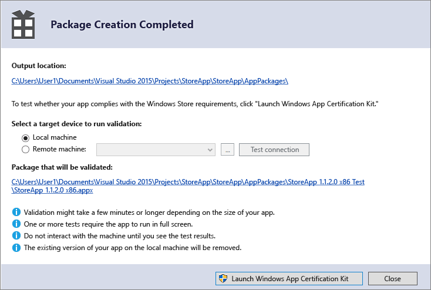

# União de um aplicativo UWP com o Visual Studio

Para vender seu aplicativo UWP (Plataforma Universal do Windows) ou distribuí-lo para outros usuários, você precisa empacotá-lo. Se você não quiser distribuir seu app por meio da Microsoft Store, poderá fazer o sideload do pacote do app diretamente para um dispositivo ou distribuí-lo através de [Instalação Web](installing-UWP-apps-web.md). Este artigo descreve o processo de configuração, criação e teste de um pacote do aplicativo UWP usando o Visual Studio. Para obter mais informações sobre como gerenciar e implantar aplicativos da linha de negócios (LOB), consulte [Gerenciamento de aplicativos corporativos](https://docs.microsoft.com/windows/client-management/mdm/enterprise-app-management).

No Windows 10, você pode enviar um pacote de aplicativo, lote de aplicativo ou um arquivo de upload de pacote do aplicativo completo para o Centro de desenvolvimento do Windows. Destas opções, enviar um arquivo de upload do pacote fornecerá a melhor experiência. 

## Tipos de pacotes de aplicativo

- **Pacote do aplicativo (. AppX ou .msix)**  
    Um arquivo que contém seu aplicativo em um formato que pode ser adicionado por sideload em um dispositivo. Qualquer arquivo do pacote de aplicativo único criado pelo Visual Studio é **não** se destina a ser enviado ao centro de desenvolvimento e deve ser usado para sideload e testes. Se você quiser enviar seu aplicativo no Centro de Desenvolvimento, use o arquivo de upload do pacote do aplicativo.  

- **Lote de aplicativo (. appxbundle ou .msixbundle)**  
    Um lote de aplicativo é um tipo de pacote que pode conter vários pacotes de aplicativos, cada um deles é criado para dar suporte a uma arquitetura de dispositivo específico. Por exemplo, um lote de aplicativo pode conter três pacotes de aplicativo separado para configurações x86, x64 e ARM. Lotes de aplicativo devem ser gerados sempre que possível, pois eles permitem que seu aplicativo esteja disponível na maior variedade possível de dispositivos.  

- **App Package Upload File (.appxupload)**  
    Um único arquivo que pode conter vários pacotes de aplicativos ou um lote de aplicativo para dar suporte a várias arquiteturas de processador. O arquivo de upload também contém um arquivo de símbolo para [Analisar o desempenho do aplicativo](https://docs.microsoft.com/windows/uwp/publish/analytics) depois que seu aplicativo for publicado na Microsoft Store. Este arquivo será automaticamente criado para você se você estiver empacotando seu aplicativo com o Visual Studio com a intenção de enviá-lo ao Centro de Desenvolvimento para publicação. É importante observar que esta é **o único** envio do pacote do aplicativo ao Centro de Desenvolvimento que pode ser criado usando o Visual Studio.

Aqui está uma visão geral das etapas de preparação e de criação de um pacote do app:

1.  [Antes de empacotar seu aplicativo](#before-packaging-your-app). Siga estas etapas para se certificar de que o app esteja pronto para ser empacotado para envio ao Centro de Desenvolvimento.
2.  [Configure um pacote do aplicativo](#configure-an-app-package). Use o designer de manifesto do Visual Studio para configurar o pacote. Por exemplo, adicione imagens de bloco e escolha as orientações compatíveis com o aplicativo.
3.  [Crie um arquivo de upload de pacote do aplicativo](#create-an-app-package-upload-file). Use o assistente de pacote de aplicativo do Visual Studio para criar um pacote do aplicativo e, em seguida, certificar o pacote com o Kit de Certificação de Aplicativos Windows.
4.  [Fazer o sideload do pacote do aplicativo](#sideload-your-app-package). Depois do sideload do aplicativo para um dispositivo, você poderá testar se ele funciona como esperado.

Depois de concluir as etapas acima, você estará pronto para distribuir seu aplicativo. Se você tiver um app de linha de negócios (LOB) que não pretende vender porque serve apenas para usuários internos, poderá fazer o sideload dele para instalá-lo em qualquer dispositivo Windows 10.

## Antes de empacotar o aplicativo

1.  **Teste o aplicativo.** Antes de empacotar o aplicativo para envio ao Centro de Desenvolvimento, certifique-se de que ele funcione conforme esperado em todas as famílias de dispositivos a que você pretende dar suporte. Essas famílias de dispositivos podem incluir desktop, celular, Surface Hub, Xbox, dispositivos IoT ou outros.
2.  **Otimize o aplicativo.** Você pode usar as ferramentas de criação de perfil e depuração do Visual Studio para otimizar o desempenho do aplicativo UWP. Por exemplo, a ferramenta de linha do tempo para capacidade de resposta da interface do usuário, a ferramenta de uso da memória, a ferramenta de uso da CPU e muito mais. Para obter mais informações sobre essas ferramentas, consulte o tópico [Tour sobre recurso de perfil](https://docs.microsoft.com/visualstudio/profiling/profiling-feature-tour).
3.  **Verifique a compatibilidade do .NET Native (para aplicativos VB e C#).** Na Plataforma Universal do Windows, existe um compilador nativo que melhorará o desempenho do tempo de execução do app. Com essa alteração, você deverá testar seu aplicativo nesse ambiente de compilação. Por padrão, a configuração de build **Release** habilita a cadeia de ferramentas .NET Native, então é importante testar seu aplicativo com essa configuração **Release** e verificar se seu aplicativo se comporta como o esperado. Alguns problemas de depuração comuns que podem acontecer com o .NET Native serão explicados mais detalhadamente em [Depuração de aplicativos universais do Windows do .NET Native](http://blogs.msdn.com/b/visualstudioalm/archive/2015/07/29/debugging-net-native-windows-universal-apps.aspx).

## Configurar um pacote do app

O arquivo de manifesto do app (Package.appxmanifest.xml) é um arquivo XML que contém as propriedades e as configurações necessárias para criar o pacote do app. Por exemplo, as propriedades no arquivo de manifesto do aplicativo descrevem a imagem a ser usada como o bloco do aplicativo e as orientações compatíveis com o aplicativo quando um usuário gira o dispositivo.

O designer de manifesto do Visual Studio permite a atualização do arquivo de manifesto sem a edição do XML bruto do arquivo.

**Configure um pacote com o designer de manifesto**

1.  Em **Gerenciador de soluções**, expanda o nó do projeto do seu aplicativo UWP.
2.  Clique duas vezes no arquivo **Package.appxmanifest**. Se o arquivo de manifesto já estiver aberto no modo de exibição de código XML, o Visual Studio solicitará que você feche o arquivo.
3.  Agora é possível decidir como configurar o aplicativo. Cada guia contém informações que você pode configurar sobre o aplicativo e links para obter mais informações, se necessário.  
    

    Verifique se você tem todas as imagens exigidas para um aplicativo UWP na guia **Ativos visuais**.

    Da guia **Empacotamento**, você pode inserir dados de publicação. É aqui que você pode escolher qual certificado usar para assinar seu aplicativo. Todos os aplicativos UWP devem ser assinados com um certificado. 
    
    >[!IMPORTANT]
    >Se você estiver publicando seu aplicativo na Microsoft Store, seu aplicativo será assinado com um certificado confiável para você. Isso permite que o usuário instale e execute seu aplicativo sem precisar instalar o certificado de autenticação do aplicativo associado. 
    
    Se você não estiver publicando seu aplicativo e deseja simplesmente carregar um pacote do aplicativo, você precisa confiar no pacote. Para confiar o pacote, o certificado deve estar instalado no dispositivo do usuário. Para obter mais informações sobre o sideload, consulte [Habilitar seu dispositivo para desenvolvimento](https://docs.microsoft.com/windows/uwp/get-started/enable-your-device-for-development).

4.  Salve seu arquivo **Package.appxmanifest** depois de fazer as edições necessárias para o aplicativo.

Se você está distribuindo seu aplicativo por meio da Microsoft Store, o Visual Studio pode associar seu pacote à Store. Quando você associa seu aplicativo, alguns dos campos na guia Empacotamento do designer de manifesto são atualizados automaticamente.

## Crie um arquivo de upload de pacote do aplicativo

Para distribuir um aplicativo por meio da Microsoft Store, você deve criar um pacote do aplicativo (. AppX ou .msix), lote de aplicativo (. appxbundle ou .msixbundle), ou um pacote de upload (. appxupload) e [enviar o aplicativo empacotado no Centro de desenvolvimento](https://docs.microsoft.com/windows/uwp/publish/app-submissions). Embora seja possível enviar um pacote do aplicativo ou lote de aplicativo para o Centro de Desenvolvimento sozinho, você é incentivado a enviar um pacote de upload.

>[!NOTE]
> O arquivo de upload do pacote do aplicativo (.appxupload) é o **único** tipo de pacote do aplicativo válido para o Centro de Desenvolvimento que pode ser criado usando o Visual Studio. Outros [pacotes do aplicativo válidos podem ser criados manualmente](https://docs.microsoft.com/windows/uwp/packaging/create-app-package-with-makeappx-tool), sem o Visual Studio. 

Você pode fazer isso usando o assistente **Criar pacotes do aplicativo**. Siga as próximas etapas para criar um pacote adequado para envio ao Centro de Desenvolvimento usando o Visual Studio.

**Para criar o seu arquivo de upload do pacote do aplicativo**

1.  Em **Gerenciador de soluções**, abra a solução para seu projeto de aplicativo UWP.
2.  Clique com botão direito no projeto e escolha **Loja**->**Criar pacotes de aplicativo**. Se essa opção estiver desabilitada ou não aparecer, verifique se o projeto é um projeto Universal do Windows.  
    

    O assistente **Criar pacotes de aplicativo** aparecerá.

3.  Selecione Sim na primeira caixa de diálogo perguntando se você deseja criar pacotes para carregar no Centro de Desenvolvimento. Depois, clique em Avançar.  
    

    Se você escolher Não, o Visual Studio não irá gerar o arquivo (.appxupload) para upload no pacote do aplicativo para envios ao Centro de Desenvolvimento. Caso queira apenas fazer o sideload do aplicativo para executá-lo em dispositivos internos ou para testes, você pode selecionar essa opção. Para obter mais informações sobre o sideload, consulte [Habilitar seu dispositivo para desenvolvimento](https://docs.microsoft.com/windows/uwp/get-started/enable-your-device-for-development).
4.  Entre usando a conta de desenvolvedor no Centro de Desenvolvimento do Windows. Se ainda não tiver uma conta de desenvolvedor, o assistente ajudará você a criar uma.
5.  Selecione o nome do aplicativo para o pacote ou reserve um novo caso você ainda não tenha reservado um com o portal do Centro de Desenvolvimento do Windows.  
    
6.  Certifique-se de que selecionou todas as três configurações de arquitetura (x86, x64 e ARM) na caixa de diálogo **Selecionar e Configurar Pacotes** para garantir que seu aplicativo possa ser implantado para a mais ampla variedade de dispositivos. Na caixa de listagem **Gerar lote de aplicativo**, selecione **Sempre**. Um lote de aplicativo (. appxbundle) tem preferência sobre um arquivo de pacote de aplicativo único, pois ele contém uma coleção de pacotes de aplicativos configurados para cada tipo de arquitetura do processador. Ao escolher gerar o lote de aplicativo, o lote de aplicativo será incluído no arquivo de upload (. appxupload) do pacote do aplicativo final junto com informações de depuração e análise de falha. Se você não tiver certeza de quais arquiteturas escolher ou deseja saber mais sobre quais arquiteturas são usadas por vários dispositivos, consulte [Arquiteturas de pacote do aplicativo](https://docs.microsoft.com/windows/uwp/packaging/device-architecture).  
    

7.  Incluir arquivos de símbolo PDB completos para [Analisar o desempenho do aplicativo](https://docs.microsoft.com/windows/uwp/publish/analytics) no Centro de Desenvolvimento do Windows depois que seu aplicativo for publicado. Configurar todos os detalhes adicionais, como a numeração de versão ou o local de saída do pacote.
9.  Clique em **Criar** para gerar o pacote do aplicativo. Se você selecionou **Sim** na etapa 3 e estiver criando um pacote de envio para o Centro de Desenvolvimento, o assistente criará um arquivo de upload (. appxupload) do pacote. Se você selecionou **não** na etapa 3, o assistente criará um único pacote do aplicativo ou um lote de aplicativo com base nas suas seleções na etapa 6.
10. Quando seu aplicativo for empacotado com êxito, você verá esta caixa de diálogo.  
    

    Valide o aplicativo antes de enviá-lo para o Centro de Desenvolvimento para certificação em uma máquina local ou remota. Você pode validar apenas compilações de lançamento para o pacote do app e não compilações de depuração.

11. Para validar seu aplicativo localmente, deixe a opção **Máquina local** selecionada e clique em **Iniciar o Kit de Certificação de Aplicativos Windows**. Para obter mais informações sobre como testar seu aplicativo com o Kit de Certificação de Aplicativos Windows, consulte [Kit de Certificação de Aplicativos Windows](https://msdn.microsoft.com/library/windows/apps/Mt186449).

    O Kit de Certificação de Aplicativos Windows realiza diversos testes e retorna os resultados. Consulte [Testes do Kit de Certificação de Aplicativos Windows](https://msdn.microsoft.com/library/windows/apps/mt186450) para obter informações mais específicas.

    Se você tiver um dispositivo Windows 10 remoto que gostaria de usar para testar, será preciso instalar manualmente o Kit de Certificação de Aplicativos Windows nesse dispositivo. A próxima seção o guiará pelas etapas. Depois de ter feito isso, você pode selecionar **Máquina remota** e clicar em **Iniciar o Kit de Certificação de Aplicativos Windows** para se conectar ao dispositivo remoto e executar os testes de validação.

12. Após a conclusão de WACK e a certificação do app, você estará pronto para enviar seu app para o Centro de Desenvolvimento. Certifique-se de carregar o arquivo correto. A localização padrão do arquivo pode ser encontrada na pasta raiz da sua solução `\[AppName]\AppPackages` e terminará com a extensão de arquivo .appxupload. O nome será do formulário `[AppName]_[AppVersion]_x86_x64_arm_bundle.appxupload` se você optar por um lote de aplicativo com todos pacotes de arquitetura selecionados.

Para obter mais informações sobre como enviar seu aplicativo para o Centro de Desenvolvimento, consulte [Envios de aplicativo](https://docs.microsoft.com/windows/uwp/publish/app-submissions).

**Valide seu pacote do aplicativo em um dispositivo Windows 10 remoto.**

1.  Habilite seu dispositivo Windows 10 para desenvolvimento seguindo as instruções de [Habilitar seu dispositivo para desenvolvimento](https://msdn.microsoft.com/library/windows/apps/Dn706236).
    **Importante**  Não é possível validar seu pacote de aplicativo em um dispositivo ARM remoto para Windows 10.
2.  Baixe e instale as ferramentas remotas para o Visual Studio. Essas ferramentas são usadas para executar o Kit de Certificação de Aplicativos Windows remotamente. Você pode obter mais informações sobre essas ferramentas, inclusive onde baixá-las visitando [Executar aplicativos UWP em uma máquina remota](https://msdn.microsoft.com/library/hh441469.aspx#BKMK_Starting_the_Remote_Debugger_Monitor).
3.  Baixe o [Kit de Certificação de Aplicativos Windows](http://go.microsoft.com/fwlink/p/?LinkID=309666) exigido e, depois, instale-o em seu dispositivo Windows 10 remoto.
4.  Na página **Criação de pacote concluída** do assistente, escolha o botão de opção **Máquina remota** e, em seguida, escolha o botão de reticências próximo ao botão **Conexão de teste**.
    **Observação**  O botão de opção **Máquina remota** ficará disponível apenas se você selecionar pelo menos uma configuração de solução que tenha suporte para validação. Para obter mais informações sobre como testar o aplicativo com o WACK, consulte [Kit de Certificação de Aplicativos Windows](https://msdn.microsoft.com/library/windows/apps/Mt186449).
5.  Especifique uma forma de dispositivo dentro de sua sub-rede, ou forneça o Servidor de Nomes de Domínios DNS ou o endereço IP de um dispositivo que esteja fora de sua sub-rede.
6.  Na lista **Modo de autenticação**, escolha **Nenhum**, se seu dispositivo não exigir que você se registre usando suas credenciais do Windows.
7.  Escolha o botão **Selecionar** e, em seguida, escolha o botão **Iniciar o Kit de Certificação de Aplicativos Windows**. Se as ferramentas remotas estiverem sendo executadas nesse dispositivo, o Visual Studio se conectará ao aplicativo e, então, realizará o testes de validação. Consulte [Testes do Kit de Certificação de Aplicativos Windows](https://msdn.microsoft.com/library/windows/apps/mt186450).

## Fazer o sideload do pacote do aplicativo

Introduzidos no Windows 10 Anniversary Update, os pacotes do app podem ser instalados simplesmente clicando duas vezes no arquivo de pacote do app. Para usá-la, navegue até o pacote do aplicativo ou o arquivo de lote de aplicativo e clique duas vezes nele. O Instalador de App é iniciado e fornece as informações básicas sobre o app, bem como um botão de instalação, a barra de progresso da instalação e as mensagens de erro relevantes. 

> [!NOTE]
> O Instalador de App presume que o app seja confiável para o dispositivo. Se você estiver fazendo sideload de um app de desenvolvedor ou corporativo, será necessário instalar o certificado de autenticação no repositório Autoridades Certificação de Fornecedores ou Pessoas Confiáveis no dispositivo. Se você não tiver certeza de como fazer isso, consulte [Instalação de certificados de teste](https://docs.microsoft.com/windows-hardware/drivers/install/installing-test-certificates).

### Sideload de seu app em versões anteriores do Windows
Com pacotes de aplicativos UWP, os apps não são instalados em um dispositivo como acontece nos apps para a área de trabalho. Normalmente, você baixa os aplicativos UWP da Microsoft Store, que também instala o app em seu dispositivo para você. Os apps podem ser instalados sem ser publicados à Store (sideload). Isso permite instalar e aplicativos de teste usando o pacote de aplicativo do arquivo que você criou. Caso tenha um aplicativo que não queira vender na Loja, como um aplicativo de linha de negócios (LOB), você pode fazer o sideload desse aplicativo de maneira que outros usuários na empresa possam usá-lo.

A lista a seguir apresenta requisitos para o sideload do aplicativo.

-   Você deve [habilitar o dispositivo para desenvolvimento](https://msdn.microsoft.com/library/windows/apps/Dn706236).
-   Para fazer o sideload de seu app em um dispositivo Windows 10 Mobile, use a ferramenta [WinAppDeployCmd.exe](install-universal-windows-apps-with-the-winappdeploycmd-tool.md).

**Fazer o sideload de um aplicativo para um desktop, laptop ou tablet**

1.  Copie as pastas da versão do app a ser instalado no dispositivo de destino.

    Se você tiver criado um lote de aplicativo, terá uma pasta baseada no número de versão e uma pasta `*_Test`. Por exemplo, estas duas pastas (em que a versão para instalar é 1.0.2.0):

    -   `C:\Projects\MyApp\MyApp\AppPackages\MyApp_1.0.2.0`
    -   `C:\Projects\MyApp\MyApp\AppPackages\MyApp_1.0.2.0_Test`

    Se você não tiver um lote de aplicativo, copie a pasta para a arquitetura correta e sua pasta `*_Test` correspondente. Estas duas pastas são um exemplo de um pacote do app com a arquitetura x64 e sua pasta `*_Test`:

    -   `C:\Projects\MyApp\MyApp\AppPackages\MyApp_1.0.2.0_x64`
    -   `C:\Projects\MyApp\MyApp\AppPackages\MyApp_1.0.2.0_x64_Test`

2.  No dispositivo de destino, abra a pasta `*_Test`.
3.  Clique com botão direito do mouse no arquivo **Add-AppDevPackage.ps1**. Escolha **Executar com PowerShell** e siga os prompts.  
    

    Quando o pacote do app tiver sido instalado, a janela do PowerShell exibirá esta mensagem: **Seu aplicativo foi instalado com êxito.**

    **Dica**: para abrir o menu de atalho em um tablet, toque a tela onde você gostaria de clicar com o botão direito do mouse, segure até um círculo completo aparecer e, então, levante o dedo. O menu de atalho será exibido depois que você levantar o dedo.
4.  Clique no botão Iniciar para procurar o app pelo nome e o inicie.
