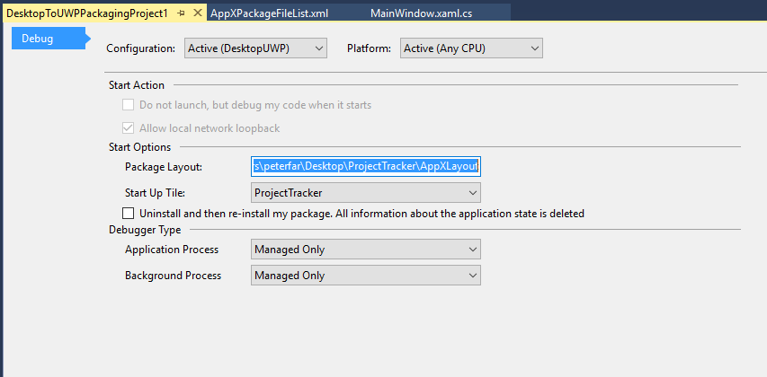
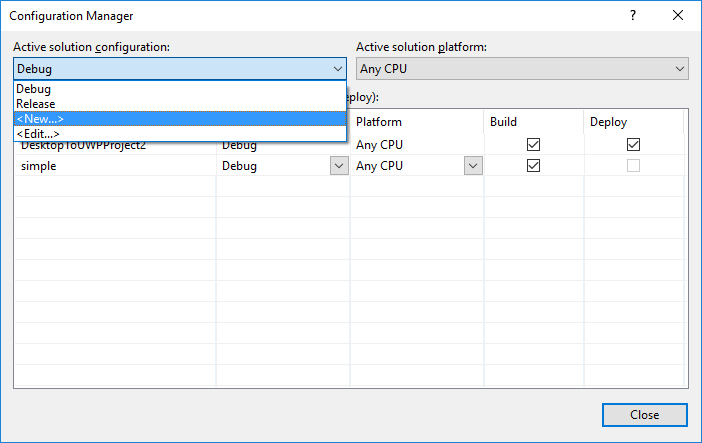
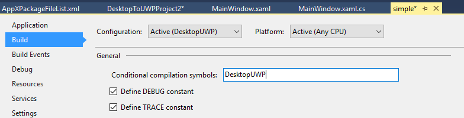

# <a name="desktop-to-uwp-bridge-debug"></a>Ponte de Desktop para UWP: depurar

Este tópico contém informações para ajudar você a depurar o app com êxito após convertê-lo usando a ponte de Desktop para UWP. Você tem algumas opções para depurar seu aplicativo convertido.

## <a name="attach-to-process"></a>Anexar ao processo

Quando o Microsoft Visual Studio está em execução "como administrador", os comandos *Iniciar Depuração* e *Iniciar sem * funcionarão no projeto de um aplicativo convertido, mas o aplicativo iniciado será executado com [nível de integridade médio](https://msdn.microsoft.com/library/bb625963) (ou seja, ele não terá privilégios elevados). Para conceder privilégios de administrador para o aplicativo iniciado, primeiro você precisa iniciar o aplicativo "administrador" por meio de um atalho ou um bloco. Quando o aplicativo estiver em execução, em uma instância do Microsoft Visual Studio executada "como administrador", invoque __Anexar ao Processo__ e selecione o processo do seu aplicativo na caixa de diálogo.

## <a name="f5-debug"></a>Depuração F5

O Visual Studio agora dá suporte a um novo projeto de empacotamento. O novo projeto permite copiar automaticamente todas as atualizações quando você compila o app no pacote de aplicativo do Windows criado a partir do conversor no instalador do aplicativo. Depois de configurar o projeto de empacotamento, você também já poderá usar F5 para depurar diretamente no pacote de aplicativo do Windows.

>Observação: você também pode usar a opção para depurar um pacote existente de aplicativo do Windows, usando a opção Depurar -> Outros Destinos de Depuração -> Depurar Pacote do App Instalado.

Veja como começar:

1. Primeiro, verifique se você fez a configuração para usar o Desktop App Converter. Para obter instruções, consulte [Desktop App Converter](desktop-to-uwp-run-desktop-app-converter.md).

2. Execute o conversor e o instalador do seu aplicativo Win32. O conversor captura o layout, e todas as alterações feitas no Registro, e gera um pacote de aplicativo do Windows com manifesto e registery.dat para virtualizar o Registro:


3. Instale e inicie o [Visual Studio 2017 RC](https://www.visualstudio.com/downloads/#visual-studio-community-2017-rc).

4. Instale o projeto VSIX de empacotamento de área de trabalho para UWP a partir da [Galeria do Visual Studio](http://go.microsoft.com/fwlink/?LinkId=797871).

5. Abra a solução Win32 correspondente que foi convertida no Visual Studio.

6. Adicione o novo projeto de empacotamento à sua solução, clicando com o botão direito do mouse na solução e escolhendo "Adicionar Novo Projeto". Em seguida, escolha o projeto de empacotamento de área de trabalho para UWP em Implantação e Instalação:

    

    O projeto resultante será adicionado à sua solução:

    

    No projeto empacotamento, o AppXFileList fornece um mapeamento de arquivos para o layout do pacote de aplicativo do Windows. As referências começam vazias, mas devem ser definidas manualmente no projeto .exe na ordem de compilação.

7. O projeto DesktopToUWPPackaging tem uma página de propriedade que permite que você configure a raiz do pacote de aplicativo do Windows e qual bloco executar:

    

    Defina o PackageLayout como o local raiz do pacote de aplicativo do Windows que foi criado pelo conversor (acima). Em seguida, escolha qual bloco executar.

8.    Abra e edite o AppXFileList.xml. Esse arquivo define como copiar a saída da compilação de depuração Win32 para o layout do pacote de aplicativo do Windows que o conversor criou. Por padrão, temos um espaço reservado no arquivo com uma marca de exemplo e comentário:

    ```XML
    <?xml version="1.0" encoding="utf-8"?>
    <Project ToolsVersion="4.0" xmlns="http://schemas.microsoft.com/developer/msbuild/2003">
      <ItemGroup>
    <!— Use the following syntax to copy debug output to the AppX layout
       <AppxPackagedFile Include="$(outdir)\App.exe">
          <PackagePath>App.exe</PackagePath>
        </AppxPackagedFile>
        See http://etc...
    -->
      </ItemGroup>
    </Project>
    ```

    A seguir está um exemplo de como criar o mapeamento. Nesse caso, copiamos o .exe e .dll do local da compilação Win32 para o local do layout do pacote.

    ```XML
    <?xml version="1.0" encoding=utf-8"?>
    <Project ToolsVersion=14.0" xmlns="http://scehmas.microsoft.com/developer/msbuild/2003">
        <PropertyGroup>
            <MyProjectOutputPath>{relativepath}</MyProjectOutputPath>
        </PropertyGroup>
        <ItemGroup>
            <LayoutFile Include="$(MyProjectOutputPath)\ProjectTracker.exe">
                <PackagePath>$(PackageLayout)\VFS\Program Files (x86)\Contoso Software\Project Tracker\ProjectTracker.exe</PackagePath>
            </LayoutFile>
            <LayoutFile Include="$(MyProjectOutputPath)\ProjectTracker.Models.dll">
                <PackagePath>$(PackageLayout)\VFS\Program Files (x86)\Contoso Software\Project Tracker\ProjectTracker.Models.dll</PackagePath>
            </LayoutFile>
        </ItemGroup>
    </Project>
    ```

    O arquivo é definido da seguinte maneira:

    Primeiro, definimos *MyProjectOutputPath* para apontar para o local em que o projeto Win32 está sendo compilado:

    ```XML
    <?xml version="1.0" encoding="utf-8"?>
    <Project ToolsVersion="14.0" xmlns="http://schemas.microsoft.com/developer/msbuild/2003">
        <PropertyGroup>
            <MyProjectOutputPath>..\ProjectTracker\bin\DesktopUWP</MyProjectOutputPath>
        </PropertyGroup>
    ```

    Em seguida, cada *LayoutFile* especifica um arquivo para copiar do local de compilação Win32 para o layout do pacote de aplicativo do Windows. Nesse caso, primeiro um .exe, depois um .dll são copiados.

    ```XML
        <ItemGroup>
            <LayoutFile Include="$(MyProjectOutputPath)\ProjectTracker.exe">
                <PackagePath>$(PackageLayout)\VFS\Program Files (x86)\Contoso Software\Project Tracker\ProjectTracker.exe</PackagePath>
            </LayoutFile>
            <LayoutFile Include="$(MyProjectOutputPath)\ProjectTracker.Models.dll">
                <PackagePath>$(PackageLayout)\VFS\Program Files (x86)\Contoso Software\Project Tracker\ProjectTracker.Models.dll</PackagePath>
            </LayoutFile>
        </ItemGroup>
    </Project>
    ```

9. Defina o projeto de empacotamento como o projeto de inicialização. Isso copiará os arquivos Win32 para o pacote de aplicativo do Windows e, em seguida, iniciará o depurador quando o projeto estiver compilado e em execução.  

    

10.    Por fim, você pode definir um ponto de interrupção no código Win32 e pressionar F5 para iniciar o depurador. Isso copiará as atualizações feitas em seu aplicativo Win32 para o pacote de aplicativo do Windows e permitirá que você depure diretamente no Visual Studio.

11.    Se você atualizar seu aplicativo, será preciso usar o MakeAppX para empacotar o aplicativo novamente. Para obter mais informações, consulte [Empacotador de aplicativo (MakeAppx.exe)](https://msdn.microsoft.com/library/windows/desktop/hh446767(v=vs.85).aspx).

Caso tenha várias configurações de compilação (por exemplo, para depurar e liberar), você poderá adicionar o seguinte ao arquivo AppXFileList.xml para copiar a compilação Win32 de locais diferentes:

```XML
<PropertyGroup>
    <MyProjectOutputPath Condition="$(Configuration) == 'DesktopUWP'">C:\Users\peterfar\Desktop\ProjectTracker\ProjectTracker\bin\DesktopUWP>
    </MyProjectOutputPath>
    <MyProjectOutputPath Condition="$(Configuration) == 'ReleaseDesktopUWP'"> C:\Users\peterfar\Desktop\ProjectTracker\ProjectTracker\bin\ReleaseDesktopUWP</MyProjectOutputPath>
</PropertyGroup>
```

Você também pode usar a compilação condicional para habilitar caminhos de código em particular, se você atualizar seu aplicativo para UWP, mas ainda deseja criá-lo para Win32.

1.    No exemplo a seguir, o código só será compilado para DesktopUWP e mostrará um bloco usando a API do WinRT.

    ```C#
    [Conditional("DesktopUWP")]
    private void showtile()
    {
        XmlDocument tileXml = TileUpdateManager.GetTemplateContent(TileTemplateType.TileSquare150x150Text01);
        XmlNodeList textNodes = tileXml.GetElementsByTagName("text");
        textNodes[0].InnerText = string.Format("Welcome to DesktopUWP!");
        TileNotification tileNotification = new TileNotification(tileXml);
        TileUpdateManager.CreateTileUpdaterForApplication().Update(tileNotification);
    }
    ```

2.    Você pode usar o Gerenciador de Configurações para adicionar a nova configuração de compilação:

    

    

3.    Em seguida, nas propriedades do projeto, adicione suporte para os símbolos de compilação condicional:

    

4.    Agora você pode alternar o destino de compilação para DesktopUWP, se quiser compilar no destino a API de UWP que você adicionou.

## <a name="plmdebug"></a>PLMDebug

O Visual Studio F5 e Anexar ao Processo são úteis para depurar seu aplicativo enquanto ele é executado. Em alguns casos, no entanto, você talvez queira fazer um controle mais refinado sobre o processo de depuração, incluindo a capacidade de depurar seu aplicativo antes de ser iniciado. Nesses cenários mais avançados, use [**PLMDebug**](https://msdn.microsoft.com/library/windows/hardware/jj680085(v=vs.85).aspx). Essa ferramenta permite que você depure seu aplicativo convertido usando o depurador do Windows e oferece o controle total sobre o ciclo de vida do aplicativo incluindo suspensão, retomada e encerramento.

O PLMDebug está incluído no SDK do Windows. Para obter mais informações, consulte [**PLMDebug**](https://msdn.microsoft.com/library/windows/hardware/jj680085(v=vs.85).aspx).

## <a name="run-another-process-inside-the-full-trust-container"></a>Executar outro processo dentro do contêiner de confiança total

Você pode chamar processos personalizados dentro do contêiner de um pacote do aplicativo especificado. Isso pode ser útil para testar os cenários (por exemplo, se você tiver um utilitário de teste personalizado e deseja testar a saída do aplicativo). Para fazer isso, use o cmdlet do PowerShell ```Invoke-CommandInDesktopPackage```:

```CMD
Invoke-CommandInDesktopPackage [-PackageFamilyName] <string> [-AppId] <string> [-Command] <string> [[-Args]
    <string>]  [<CommonParameters>]
```
