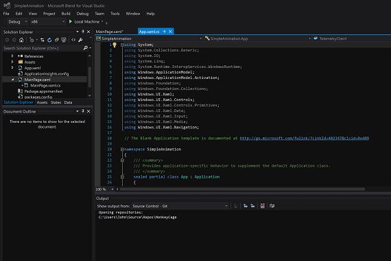

# <a name="getting-started-animation"></a>Introdução: animação


## <a name="adding-animations"></a>Adicionando animações

No iOS, a maioria dos efeitos de animação são criados de forma programática. Por exemplo, você pode usar as animações fornecidas pelos métodos baseados em blocos **animateWithDuration** da classe **UIView** ou os métodos mais antigos, não baseados em blocos. Você também pode usar explicitamente a classe **CALayer** para animar camadas. As animações nos aplicativos do Windows podem ser criadas de forma programática, mas elas também podem ser definidas declarativamente com Extensible Application Markup Language (XAML). Você pode usar o Microsoft Visual Studio para editar o código XAML diretamente, mas o Visual Studio também vem com uma ferramenta chamada **Blend**, que cria o código XAML para você enquanto você trabalha com animações em um designer. Na realidade, o Blend permite que você abra, crie, compile e execute projetos completos do Visual Studio, graficamente. O tutorial a seguir permite experimentar.

Crie um novo aplicativo da Plataforma Universal do Windows (UWP) e dê um nome como "SimpleAnimation". Neste projeto, vamos mover um retângulo, aplicar um efeito de esmaecimento e trazê-lo de volta à visualização. Animações em XAML são baseadas em conceito de *storyboards* (não para ser confundido com iOS storyboards). As storyboards usam *quadros-chave* para animar as alterações da propriedade.

Com seu projeto aberto, no **Gerenciador de Soluções**, clique com o botão direito do mouse sobre o nome do projeto e selecione **Abrir no Blend** ou **Abrir no Blend…**, como mostrado na imagem a seguir. O Visual Studio continuará a ser executado em segundo plano.


Depois que o Blend iniciar, você verá algo semelhante à seguinte imagem.



Clique duas vezes em **MainPage.xaml** no **Gerenciador de Soluções** no lado esquerdo. Em seguida, da faixa de vertical de ferramentas na borda no **modo de exibição de Design** central, selecione a ferramenta **Retângulo** e desenhe um retângulo no **modo de exibição de Design**, conforme mostrado na imagem a seguir.


Para colorir o retângulo de verde, na janela **Propriedades**, na área **Pincel**, clique no botão **Pincel de cor sólida** e clique no ícone de **Conta-gotas de cor**. Clique em algum lugar na faixa verde de matizes.

Para começar a animar o retângulo, na janela **Objetos e Linha do Tempo**, toque no botão com o símbolo de adição (**Novo**), como mostrado na imagem a seguir, e em seguida toque em **OK**.


Um storyboard aparece na janela **Objetos e Linha do Tempo** (talvez seja necessário redimensionar o modo de exibição para vê-lo corretamente). O **Design View** exibe mudanças para mostrar que a **gravação da linha do tempo Storyboard1 está ativa**. Para capturar o estado atual do retângulo, na janela **Objetos e Linha do Tempo**, toque no botão **Gravar Quadro-Chave**, acima da seta amarela, como mostrado na imagem a seguir.


Agora, vamos mover o retângulo e fazê-lo esmaecer. Para fazer isso, arraste a seta laranja/amarela até a posição de 2 segundos e, em seguida, mova seu retângulo verde um pouco para a direta. Em seguida, na janela **Propriedades**, na área **Aparência**, altere a propriedade **Opacidade** para **0**, como mostrado na imagem a seguir. Para visualizar a animação, toque no botão **Reproduzir** no painel Storyboard.


Agora, vamos reexibir o retângulo. Na janela **Objetos e Linha do Tempo**, clique duas vezes em **Storyboard1**. Em seguida, na janela **Propriedades**, na área **Comum**, selecione **AutoReverse**, como mostrado na imagem a seguir.


Finalmente, clique no botão **Reproduzir** para ver o que acontece.

Você pode compilar e executar o projeto, clicando no botão verde de execução na parte superior da janela (ou basta pressionar F5). Se você fizer isso, verá que seu projeto realmente será compilado e executado, mas o retângulo verde ainda ficará perfeita e teimosamente parado, como um bebê que não ganha doces em um corredor de supermercado. Para iniciar a animação, você precisará adicionar uma linha de código ao projeto. Este é o procedimento.

Salve o projeto, abrindo o menu **Arquivo** e selecionando **Salvar MainPage.xaml**. Retorne ao Visual Studio. Se o Visual Studio exibir uma caixa de diálogo perguntando se você quer recarregar o arquivo modificado, selecione **Yes**. Clique duas vezes sobre o arquivo **MainPage.xaml.cs**, que está oculto em **MainPage.xaml**, para abri-lo e adicione o seguinte código acima do método público MainPage():

```csharp
protected override void OnNavigatedTo(NavigationEventArgs e)
{
    // Add the following line of code.
    Storyboard1.Begin();
}
```

Execute o projeto novamente e observe a animação do retângulo. Viva!

Se você abrir o arquivo MainPage.xaml, no modo de exibição **XAML**, verá que código XAML adicionado pelo Blend funcionou no designer. Em particular, analise o código nos elementos `<Storyboard>` e `<Rectangle>`. O código a seguir mostra um exemplo. As reticências indicam código não relacionado omitido por questões de brevidade; as quebras de linha foram adicionadas para melhorar a legibilidade do código.

```xml
...
<Storyboard 
        x:Name="Storyboard1" 
        AutoReverse="True">
    <DoubleAnimationUsingKeyFrames 
            Storyboard.TargetProperty="(UIElement.RenderTransform).(CompositeTransform.TranslateX)"
            Storyboard.TargetName="rectangle">
        <EasingDoubleKeyFrame 
                KeyTime="0" 
                Value="0"/>
        <EasingDoubleKeyFrame 
                KeyTime="0:0:2" 
                Value="185.075"/>
    </DoubleAnimationUsingKeyFrames>
    <DoubleAnimationUsingKeyFrames 
            Storyboard.TargetProperty="(UIElement.RenderTransform).(CompositeTransform.TranslateY)" 
            Storyboard.TargetName="rectangle">
        <EasingDoubleKeyFrame 
                KeyTime="0" 
                Value="0"/>
        <EasingDoubleKeyFrame 
                KeyTime="0:0:2" 
                Value="2.985"/>
    </DoubleAnimationUsingKeyFrames>
    <DoubleAnimationUsingKeyFrames 
            Storyboard.TargetProperty="(UIElement.Opacity)" 
            Storyboard.TargetName="rectangle">
        <EasingDoubleKeyFrame 
                KeyTime="0" 
                Value="1"/>
        <EasingDoubleKeyFrame 
                KeyTime="0:0:2"
                Value="0"/>
    </DoubleAnimationUsingKeyFrames>
</Storyboard>
...
<Rectangle 
        x:Name="rectangle" 
        Fill="#FF00FF63" 
        HorizontalAlignment="Left" 
        Height="122" 
        Margin="151,312,0,0" 
        Stroke="Black" 
        VerticalAlignment="Top" 
        Width="239" 
        RenderTransformOrigin="0.5,0.5">
    <Rectangle.RenderTransform>
        <CompositeTransform/>
    </Rectangle.RenderTransform>
</Rectangle>
...
```

Você pode editar esse XAML manualmente ou retornar ao Blend para continuar a trabalhar com ele lá. O Blend torna divertida a criação de interfaces do usuário interessantes e permite animá-las usando uma ferramenta gráfica pode acelerar drasticamente o tempo de desenvolvimento. Para obter mais informações sobre animações, consulte [Visão geral de animações](https://msdn.microsoft.com/library/windows/apps/mt187350).

**Observação**para obter informações sobre animações para <span class="legacy-term">aplicativos UWP usando JavaScript e HTML</span>, consulte [animando sua interface do usuário (HTML)](https://msdn.microsoft.com/library/windows/apps/hh465165).

### <a name="next-step"></a>Próxima etapa

[Introdução: o que vem depois?](getting-started-what-next.md)
