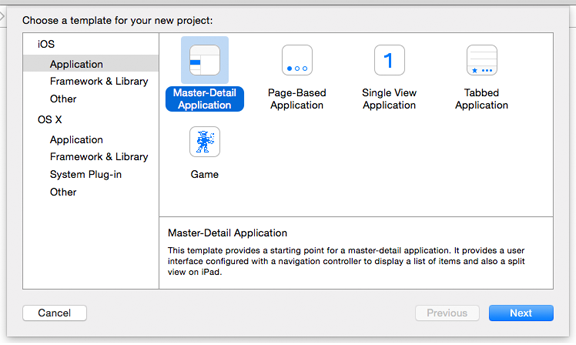

# Introdução: Criando um projeto

## Criando um projeto

O Microsoft Visual Studio está para o Windows assim como o Xcode está para o iOS e o Mac OS. Neste guia passo a passo, ajudaremos você a se familiarizar com o Visual Studio. Ele mostra as noções básicas absolutas que você precisa saber antes de começar. Sempre que for criar um aplicativo, você seguirá etapas semelhantes a estas.

O vídeo a seguir compara o Xcode e o Visual Studio.

> [!VIDEO https://channel9.msdn.com/Blogs/One-Dev-Minute/Comparing-Xcode-to-Visual-Studio/player]

Você também achará [Compilando aplicativos para postagem de blog do Windows](https://blogs.windows.com/buildingapps/2016/01/27/visual-studio-walkthrough-for-ios-developers/) muito útil.

Criando um aplicativo para Windows 10 (mais formalmente conhecido como um aplicativo da plataforma Universal do Windows (UWP)) é em vez disso, como a criação de um aplicativo iOS usando Storyboards. O aplicativo do Windows 10 com frequência é construído ao longo de várias páginas, cada página que contém uma parte diferente da interface do usuário, como um site da web. Cada página geralmente tem dois arquivos de origem associados: um para armazenar a interface do usuário em formato [XAML (visão geral)](https://docs.microsoft.com/windows/uwp/xaml-platform/xaml-overview) e um que contém o código-fonte, frequentemente em C#. Conforme seu usuário interage com seu aplicativo, ele navega entre essas páginas. Neste passo a passo, você criará um aplicativo com duas páginas.

**Observação**  um recurso importante dos aplicativos do Windows 10 é o fato do mesmo código-fonte e o mesmo conjunto de API, está disponível para você, independentemente da plataforma. Como você sabe, ao gravar um aplicativo iOS universal para iPhone e iPad, você pode determinar em tempo de execução em qual plataforma seu aplicativo está sendo executado e tomar a ação apropriada. De maneira semelhante, aplicativos do Windows 10 podem dizer, em tempo de execução, eles estão em execução no dispositivo. Com um aplicativo UWP, não é necessário usar \#ifdef no seu código-fonte para criar o telefone em comparação com a área de trabalho se baseia. Convenientemente, os aplicativos do Windows 10 também inteligentemente usam seus controles de interface do usuário, dependendo do dispositivo: por exemplo, seu aplicativo pode fazer referência a um controle de seletor de data e o controle de aparência e funcionam de forma diferente dependendo se ele tem o automaticamente em execução em uma área de trabalho ou uma tela do telefone. No entanto, seu código-fonte permanece o mesmo.

Vamos ver como podemos criar um aplicativo do Windows 10. Comece executando o Visual Studio. Ao ser executado pela primeira vez, o Visual Studio pedirá que você obtenha uma licença de desenvolvedor. Uma licença de desenvolvedor permite instalar e testar os aplicativos UWP em seu computador local antes de enviá-los à Microsoft Store. Para obter uma licença, siga as instruções na tela para entrar em uma conta da Microsoft. Se não tiver uma, clique no link **Inscrever-se** na caixa de diálogo **Licença de Desenvolvedor** e siga as instruções na tela.

Para fazer uma comparação, quando você inicia o Xcode, a primeira coisa que vê é a tela **Bem-vindo ao Xcode**, similar à imagem a seguir.

O Visual Studio é muito similar. Você verá a **Página inicial**, como mostrado na imagem a seguir

Para criar um novo aplicativo, comece fazendo um projeto de acordo com o seguinte:

-   Na área **Iniciar**, toque em **Novo Projeto**.
-   Toque no menu **Arquivo** e toque em **Novo Projeto**.

Em comparação, quando você cria um novo projeto no Xcode, você vê uma lista de modelos de projeto como os mostrados na imagem a seguir.

No Visual Studio, também há vários modelos de projeto para escolher, como mostrado na imagem a seguir.

 para este passo a passo, toque **Visual C#** e, em seguida, toque em **Windows**, **Windows Universal** e **(Windows Universal) do aplicativo em branco**. Na caixa **Nome**, digite "MyApp" e toque em **OK**. O Visual Studio cria e exibe seu primeiro projeto. Agora, você pode começar a criar seu aplicativo e adicionar código a ele.

## Próximas etapas

[Guia de Introdução: Escolhendo uma linguagem de programação](getting-started-choosing-a-programming-language.md)
