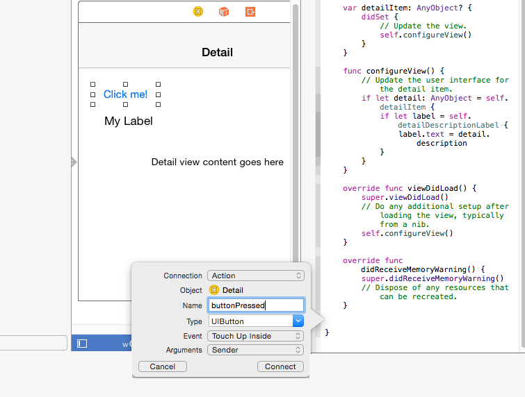

# <a name="getting-started-getting-around-in-visual-studio"></a>Introdução: conhecendo o Visual Studio


## <a name="getting-around-in-microsoft-visual-studio"></a>Noções básicas do Microsoft Visual Studio

Agora, vamos voltar ao projeto que criamos antes e ver como podemos lidar com o ambiente de desenvolvimento integrado do Microsoft Visual Studio (IDE).

Se você é um desenvolvedor de Xcode, deve estar familiarizado com a exibição padrão, com os arquivos de origem no painel esquerdo, o editor (IU ou código-fonte) no painel central e os controles e suas propriedades no painel direito.


O Microsoft Visual Studio é muito parecido, mas os controles da exibição padrão ficam no lado esquerdo da **Caixa de ferramentas**. Os arquivos de origem ficam no **Gerenciador de Soluções**, ao lado direito, e as propriedades ficam em **Propriedades** no painel **Gerenciador de Soluções**, desta forma:


Se isso for meio estranho para você, ficará aliviado em saber que pode reorganizar os painéis no Visual Studio para posicionar os arquivos de origem à esquerda da tela e a caixa de ferramentas à direita. Na verdade, você pode clicar e arrastar a barra de título de qualquer painel para reposicioná-lo, e o Visual Studio exibirá uma caixa sombreada informando onde ela será encaixada depois que você soltá-la. Muitos painéis também têm um pequeno ícone de desenho pino em sua barra de título. Isso permite que você fixe o painel como está, bloqueando no lugar. Desafixe o painel, e ele pode ser recolhido para economizar espaço: útil se o seu monitor for menor. Se você estragou tudo (não se preocupe, todos fazem isso), selecione **Redefinir Layout da Janela** no menu **Janela** para restaurar a ordem.

## <a name="adding-controls-setting-their-properties-and-responding-to-events"></a>Adicionando controles, configurando suas propriedades e respondendo a eventos

Vamos agora adicionar alguns controles ao seu projeto. Em seguida, alteraremos algumas das propriedades e escreveremos alguns códigos para responder a um dos eventos do controle.

Para adicionar controles em Xcode, abra o arquivo .xib desejado ou o Storyboard e, em seguida, arraste e solte os controles, como um**Botão retangular arredondado** ou um **Rótulo**, conforme mostrado abaixo:


Vamos fazer algo parecido no Visual Studio. A partir da **Caixa de ferramentas**, arraste o controle **Button** e, em seguida, solte-o na superfície de design do arquivo MainPage.xaml.

Faça o mesmo com o controle **TextBlock**, para que ele fique assim:


Ao contrário do Xcode, que oculta as informações de layout e associação dentro de um arquivo .xib ou de Storyboard, o Visual Studio incentiva a edição dos arquivos XAML usados para armazenar esses detalhes em sua linguagem em estilo XML avançada, editável e declarativa. Para saber mais sobre Linguagem XAML, consulte [Visão geral de XAML](https://msdn.microsoft.com/library/windows/apps/mt185595). Por enquanto, saiba que tudo o que é exibido no painel **Design** está definido no painel **XAML**. O painel **XAML** permite um controle específico onde necessário e, à medida que você aprender mais sobre ele, poderá desenvolver de forma rápida o código da interface do usuário manualmente. Mas por enquanto vamos nos concentrar apenas nos painéis **Design** e **Propriedades**.

Vamos alterar os detalhes do botão. Conforme você saberá, para alterar o nome do botão no Xcode, você pode alterar o valor do campo **Título** no painel Propriedades.

Ao usar o Visual Studio, é possível fazer algo bem semelhante. No painel **Design**, toque no botão para focalizar. Em seguida, no painel **Propriedades**, altere o valor **Content** de "Botão" para "Me pressione". Então, atualize o nome do controle de botão mudando o valor **Name** de "&lt;No Name&gt;" para "myButton", como mostrado aqui:


Agora, vamos escrever alguns códigos para alterar os conteúdos do controle **TextBlock** para "Hello, World!" depois que o usuário toca no botão.

Em Xcode, você pode associar um evento a um controle escrevendo códigos e associando-os a ele, muitas vezes, arrastando o botão pelo controle para o código-fonte, desta forma:



```swift
// Swift implementation.

@IBAction func buttonPressed(sender: UIButton) {
    
}
```

O Visual Studio é parecido. À direita de **Propriedades**, há um botão de raio. Esse é o local onde os possíveis eventos associados ao controle selecionado estão listados, assim:


Para adicionar códigos para o evento de clique do botão, selecione o botão no painel **Design**. A seguir, clique no botão de raio e clique duas vezes na caixa vazia próximo ao nome **Clique**. O Visual Studio, então, adiciona o evento "myButton\_Click" à caixa **Clique** e adiciona e exibe o manipulador de evento correspondente no arquivo MainPage.xaml.cs, desta forma.

```csharp
private void myButton_Click(object sender, RoutedEventArgs e)
{

}
```

Agora, vamos conectar o controle **TextBlock**. Em Xcode, você arrastaria o botão pelo controle até o arquivo do código-fonte para associá-lo à sua definição, desta forma.


```swift
// Swift implentation.

@IBOutlet weak var myLabel : UILabel
```

No Visual Studio, você não precisa associar o controle, já que isso é sempre feito por você. Porém, vamos alterar algumas das propriedades:

1.  Toque na guia de arquivo de MainPage.xaml.
2.  No painel **Design**, toque no controle **TextBlock**.
3.  No painel **Propriedades**, toque no botão de chave inglesa para exibir suas propriedades.
4.  Na caixa **Nome**, mude "&lt;Sem Nome&gt;" para "myLabel".


Agora, vamos adicionar alguns códigos ao evento de clique do botão. Para fazer isso, toque no arquivo MainPage.xaml.cs e adicione o seguinte código ao manipulador de evento myButton\_Click.

```csharp
private void myButton_Click(object sender, RoutedEventArgs e)
{
    // Add the following line of code.    
    myLabel.Text = "Hello, World!";
}
```

É parecido com o que você escreveria em Swift:

```swift
@IBAction func buttonPressed(sender: UIButton) {
    myLabel.text = "Hello, World!"
}
```

Por fim, para executar o aplicativo, selecione o menu **Depurar** e, em seguida, selecione **Iniciar Depuração** (ou basta pressionar F5). Depois que o aplicativo iniciar, clique no botão "Me pressione" e veja os conteúdos de rótulo mudarem de "TextBlock" para "Hello, World!", conforme a imagem a seguir.


Para encerrar o aplicativo, volte ao Visual Studio, toque no menu **Depurar** e, em seguida, em **Parar Depuração** (ou basta pressionar SHIFT + F5). Observe que o Visual Studio permite que você experimente o aplicativo em vários dispositivos diferentes, para verificar como ele será executado em cada um.

## <a name="next-step"></a>Próxima etapa

[Introdução: controles comuns](getting-started-common-controls.md)

