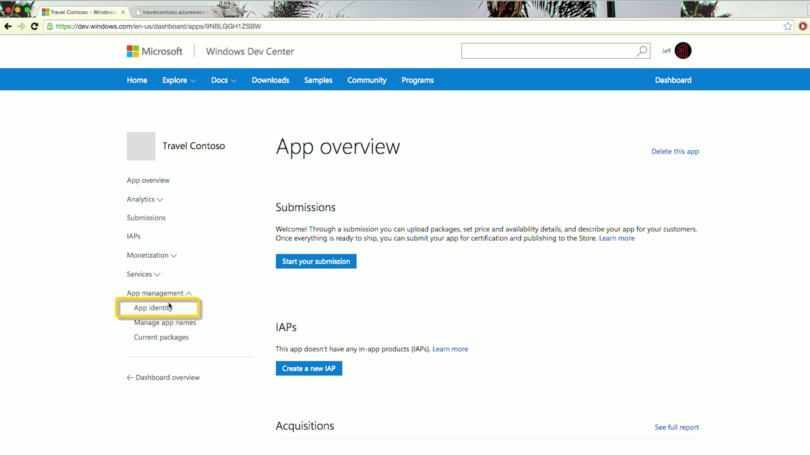

# Converter seu aplicativo Chrome existente em um aplicativo UWP

Facilitamos a conversão do seu aplicativo hospedado Chrome existente em um aplicativo em execução na Plataforma Universal do Windows (UWP). Há duas maneiras de converter seu aplicativo Chrome:

- Opção 1: [ManifoldJS](http://manifoldjs.com/) agora aceita manifestos do Chrome como uma forma de entrada. 

- Opção 2: Desenvolvemos uma [ferramenta CLI](https://github.com/MicrosoftEdge/hwa-cli) que gera um `.appx` pacote do seu `.zip` existente ou arquivos `.crx`.

## Converta seu aplicativo Chrome existente usando a Interface de linha de comando

1. Instale [NodeJS](https://nodejs.org/en/) e seu Gerenciador de pacotes, [npm](https://www.npmjs.com/). 

2. Abra uma janela do prompt de comando para o diretório de sua escolha

3. Instale as Interfaces de linha de comando CLI) dos Aplicativos Web hospedados (HWA)inserindo o seguinte na linha de comando: `npm i -g hwa-cli`

4. Converter seu pacote Chrome (`.crx` e `.zip` são os formatos de pacote com suporte), inserindo o seguinte na linha de comando: `hwa convert path/to/chrome/app.crx` ou `hwa convert path/to/chrome/app.zip`

    **Substitua `path/to/chrome/app` com as informações de caminho levando a seu aplicativo Chrome.*
    
5. O `.appx` gerado aparecerá na mesma pasta que o pacote Chrome. Agora você está pronto para carregar seu aplicativo na Windows Store. 

## Carregando seu aplicativo para a Windows Store

Para carregar seu aplicativo, visite o painel no [Centro de Desenvolvimento do Windows](https://developer.microsoft.com/windows). Clique em "[Criar um novo aplicativo](https://developer.microsoft.com/dashboard/Application/New)" e reserve o nome do aplicativo.

Carregue seu pacote `AppX` navegando até a página de "Pacotes" na seção Envios.

Preencha os avisos na Windows Store.

    During the conversion process, you will be prompted for an Identity Name, Publisher Identity, and Publisher Display Name. To retrieve these values, visit the Dashboard in the [Windows Dev Center](https://developer.microsoft.com/windows).
    - Click on "[Create a new app](https://developer.microsoft.com/dashboard/Application/New)" and reserve your app name.

    - Em seguida, clique em "Identidade de aplicativo" no menu à esquerda na seção "Gerenciamento de aplicativo".
    
    - Você deve ver os três valores para os quais você é solicitado listados na página: 
        1. Nome do identificador: `Package/Identity/Name`
        2. Identidade do editor: `Package/Identity/Publisher`
        3. Nome de exibição do editor: `Package/Properties/PublisherDisplayName`

## Guia para migrar seu Aplicativo Web hospedado

Depois de empacotar d]o aplicativo da web para a Windows Store, personalize para que ele funcione bem em todos os dispositivos Windows, incluindo computadores, tablets, telefones, HoloLens, Surface Hub, Xbox e Raspberry Pi.

### Regras de URI de conteúdo do aplicativo

[Regras de URI de conteúdo do aplicativo (ACURs)](./hwa-access-features.md) ou URIs de conteúdo definem o escopo do seu Aplicativo Web hospedado por meio de uma lista de permissão de URL no manifesto do pacote do aplicativo. Para controlar a comunicação para o/do conteúdo remoto, você deve definir quais URLs estão incluídas e/ou excluídas da lista. Se um usuário clicar em uma URL que não está incluída explicitamente, o Windows abrirá o caminho de destino no navegador padrão. Com ACURs, você também é capaz de conceder um acesso por URL às [APIs do universais do Windows](https://msdn.microsoft.com/library/windows/apps/br211377.aspx).

No mínimo, as regras devem incluir a página inicial do aplicativo. A ferramenta de conversão criará automaticamente um conjunto de ACURs para você, com base na sua página inicial e domínio. No entanto, se houver quaisquer redirecionamentos programáticos, seja no servidor ou no cliente, os destinos precisarão ser adicionados à lista de permissões.

*Observação: ACURs são aplicáveis somente a navegação de página. Imagens, bibliotecas JavaScript e outros ativos semelhantes não são afetados por essas restrições.*

Diversos aplicativos usam sites de terceiros para seus fluxos de logon, por exemplo, Facebook e Google. A ferramenta de conversão criará automaticamente um conjunto de ACURs para você, com base nos sites mais populares. Se seu método de autenticação não está incluído na lista, e é um fluxo de redirecionamento, você precisará adicionar seu(s) caminho(s) como um ACUR. Você também pode considerar o uso de um [agente de autenticação da web](./hwa-access-features.md).

### Flash

Flash não é permitido em aplicativos do Windows 10. Você precisará certificar-se de que sua experiência de aplicativo não é afetada por sua ausência.

Para anúncios, você precisará certificar-se de que seu provedor de anúncios possui uma opção de HTML5. Você pode conferir o [Bing Ads](https://bingads.microsoft.com/) e as [bibliotecas do Microsoft Advertising](../monetize/display-ads-in-your-app.md). 

Os vídeos do YouTube ainda devem funcionar, já que o padrão deles agora é [o HTML5 `<video>`,](http://youtube-eng.blogspot.com/2015/01/youtube-now-defaults-to-html5_27.html), desde que você esteja usando o [método de inserção `<iframe>`](https://developers.google.com/youtube/iframe_api_reference). Se seu aplicativo ainda usa a API Flash, você precisará alternar para o estilo de incorporar mencionado anteriormente.

### Ativos de imagem

Loja Web do Chrome já [requer uma imagem de ícone do aplicativo de 128 x 128](https://developer.chrome.com/webstore/images) no pacote do aplicativo. Para aplicativos do Windows 10, você deve fornecer imagens de ícone do aplicativo de 44 x 44, 50 x 50, 150 x 150 e 600 x 350, no mínimo. A ferramenta de conversão criará automaticamente essas imagens para você, com base na imagem 128 x 128. Para ter uma experiência de aplicativo mais rica e refinada, é altamente recomendável criar seus próprios arquivos de imagem. Aqui estão algumas [diretrizes para ativos de bloco e ícone](https://msdn.microsoft.com/library/windows/apps/mt412102.aspx).

### Recursos

As funcionalidades do aplicativo devem ser [declaradas](https://msdn.microsoft.com/windows/uwp/packaging/app-capability-declarations) em seu manifesto do pacote para acessar determinadas APIs e recursos. A ferramenta de conversão habilitará automaticamente três recursos de dispositivo populares para você: localização, microfone e webcam. Com o primeiro, o sistema ainda solicitará ao usuário permissão antes de conceder acesso.

*Observação: os usuários são notificados sobre todas as funcionalidades que um aplicativo declara. Recomendamos remover quaisquer recursos que seu aplicativo não precisa.*

### Downloads de arquivos

Downloads de arquivos tradicionais, como você vê no navegador, não são atualmente suportados.

### APIs da plataforma Chrome

O Chrome fornece aplicativos com [APIs de finalidade especial](https://developer.chrome.com/apps/api_index) que podem ser executadas como script em segundo plano. Estes não são permitidos. Você pode encontrar funcionalidade equivalente e muito mais com as [APIs do Windows Runtime](https://msdn.microsoft.com/library/windows/apps/br211377.aspx).

## Tópicos relacionados

- [Melhorar seu aplicativo Web ao acessar recursos da Plataforma Universal do Windows(UWP)](./hwa-access-features.md)
- [Guia para aplicativos UWP (Plataforma Universal do Windows)](http://go.microsoft.com/fwlink/p/?LinkID=397871)
- [Baixar ativos de design para aplicativos da Windows Store](https://msdn.microsoft.com/library/windows/apps/xaml/bg125377.aspx)
