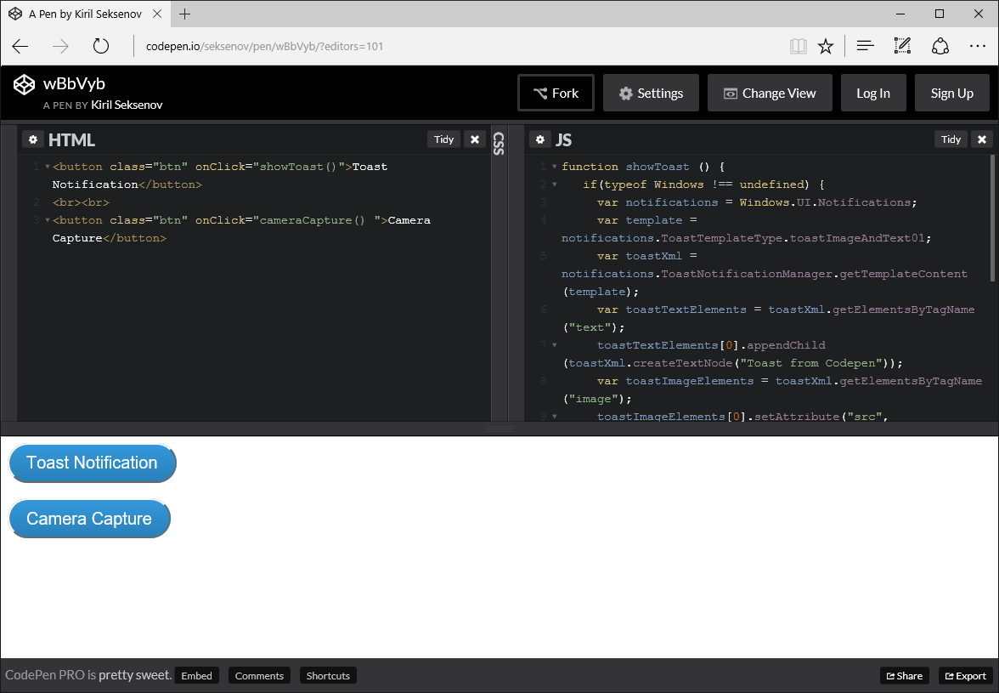
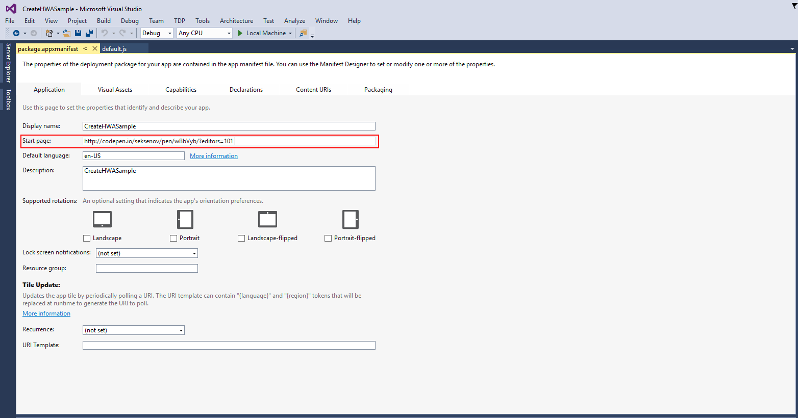

# <a name="convert-your-web-application-to-a-universal-windows-platform-uwp-app"></a>Converter o seu aplicativo Web em um aplicativo UWP (Plataforma Universal do Windows)

Aprenda a criar rapidamente um aplicativo da Plataforma Universal do Windows para Windows 10, começando com apenas uma URL do site. 

> [!NOTE]
> As instruções a seguir referem-se ao uso de uma plataforma de desenvolvimento do Windows. Usuários do Mac, acesse as [instruções sobre como usar uma plataforma de desenvolvimento do Mac](/hwa-create-mac.md).

## <a name="what-you-need-to-develop-on-windows"></a>O que você precisa para desenvolver no Windows

- [Visual Studio 2015.](https://www.visualstudio.com/) O Visual Studio Community 2015 gratuito e repleto de recursos inclui as ferramentas de desenvolvedor do Windows 10, modelos de aplicativos universais, um editor de códigos, um depurador eficiente, emuladores do Windows Mobile, suporte à linguagem complexa e muito mais, tudo pronto para ser usado na produção.
- (Opcional) [SDK do Windows autônomo para Windows 10.](https://dev.windows.com/downloads/windows-10-sdk) Se você estiver usando um ambiente de desenvolvimento diferente do Visual Studio 2015, poderá baixar um SDK do Windows autônomo para o instalador do Windows 10. Observe que você não precisará instalar esse SDK se estiver usando o Visual Studio 2015 – ele já está incluído.

## <a name="step-1-pick-a-website-url"></a>Etapa 1: selecionar uma URL do site
Escolha um site existente que funciona muito bem como um aplicativo de página única. É altamente recomendável que você seja o proprietário ou o desenvolvedor do site, dessa forma poderá fazer todas as alterações necessárias. Se você não tiver uma URL em mente, tente usar este [exemplo Codepen](http://codepen.io/seksenov/pen/wBbVyb/?editors=101) como site. Copie sua URL ou a URL de Codepen, para usar em todo o tutorial. 



## <a name="step-2-create-a-blank-javascript-app"></a>Etapa 2: criar um aplicativo em JavaScript em branco.

Inicie o Visual Studio.
1. Clique em **Arquivo**.
2. Clique em **Novo Projeto**.
3. Em **JavaScript** depois **Universal do Windows**, clique em **Aplicativo em branco (Universal do Windows)**.


## <a name="step-3-delete-any-packaged-code"></a>Etapa 3: excluir qualquer código empacotado

Como este é um aplicativo Web hospedado, onde o conteúdo é servido a partir de um servidor remoto, você não terá a maioria dos arquivos locais do aplicativo que vêm com o modelo JavaScript por padrão. Exclua quaisquer recursos locais de HTML, JavaScript ou CSS. Tudo o que deve permanecer é o arquivo `package.appxmanifest`, onde você configurar o aplicativo e os recursos de imagem.


## <a name="step-4-set-the-start-page-url"></a>Etapa 4: definir a URL da página inicial

1. Abra o arquivo `package.appxmanifest`.
2. Sob a aba **Aplicativo**, localize o campo de texto **Página inicial**.
3. Substitua `default.html` com a URL do seu site.



## <a name="step-5-define-the-boundaries-of-your-web-app"></a>Etapa 5: definir os limites do seu aplicativo Web

As Regras de URI de conteúdo do aplicativo (ACURs) especificam quais URLs remotas têm permissão de acesso ao seu aplicativo e às APIs universais do Windows. No mínimo, você precisará adicionar um ACUR para sua página inicial e todos os recursos da web utilizados por essa página. Para obter mais informações sobre ACURs, [clique aqui](./hwa-access-features.md).
1. Abra o arquivo `package.appxmanifest`.
2. Clique na aba **URIs de conteúdo**.
3. Adicione qualquer URIs necessárias para sua página inicial.

Por exemplo:
```
1. http://codepen.io/seksenov/pen/wBbVyb/?editors=101
2. http://*.codepen.io/
```
4. Defina o **Acesso ao WinRT** para **Todos** para cada URI que você adicionou.


## <a name="step-6-run-your-app"></a>Etapa 6: executar seu aplicativo

Neste ponto, você tem um aplicativo do Windows 10 totalmente funcional capaz de acessar as APIs universais do Windows!

Se você estiver acompanhando nosso exemplo de Codepen, clique no botão **Notificação do sistema** para chamar uma API do Windows a partir do script hospedado.


## <a name="bonus-add-camera-capture"></a>Bônus: adicionar a captura com câmera

Copie e cole o código JavaScript abaixo para habilitar a captura com câmera. Se você estiver acompanhando seu próprio site, crie um botão para invocar o `cameraCapture()` método. Se você estiver acompanhando nosso exemplo de Codepen, um botão já está presente no HTML. Clique no botão e tire uma foto.

```JavaScript
function cameraCapture() {
  if(typeof Windows != 'undefined') {
   var captureUI = new Windows.Media.Capture.CameraCaptureUI();
   //Set the format of the picture that's going to be captured (.png, .jpg, ...)
   captureUI.photoSettings.format = Windows.Media.Capture.CameraCaptureUIPhotoFormat.png;
   //Pop up the camera UI to take a picture
   captureUI.captureFileAsync(Windows.Media.Capture.CameraCaptureUIMode.photo).then(function (capturedItem) {
      // Do something with the picture
   });
  }
}
```

## <a name="related-topics"></a>Tópicos relacionados

- [Melhorar seu aplicativo Web ao acessar recursos da Plataforma Universal do Windows(UWP)](hwa-access-features.md)
- [Guia para aplicativos UWP (Plataforma Universal do Windows)](http://go.microsoft.com/fwlink/p/?LinkID=397871)
- [Baixar ativos de design para aplicativos da Windows Store](https://msdn.microsoft.com/library/windows/apps/xaml/bg125377.aspx)


<!--HONumber=Dec16_HO1-->


