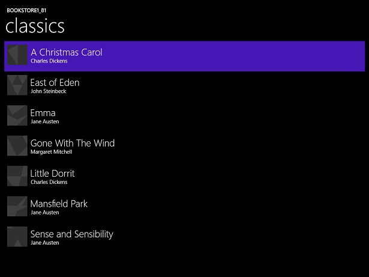

# Estudo de caso do Windows Runtime 8.x para UWP: Bookstore1

Este tópico apresenta um estudo de caso de portabilidade de um aplicativo universal 8,1 muito simples para um aplicativo UWP (Windows 10 Plataforma Universal do Windows). Um aplicativo universal 8,1 é aquele que cria um pacote de aplicativos para Windows 8.1 e um pacote de aplicativo diferente para Windows Phone 8,1. Com o Windows 10, você pode criar um único pacote de aplicativo que os clientes podem instalar em uma grande variedade de dispositivos, e é isso que faremos neste estudo de caso. Consulte [Guia para aplicativos UWP](https://docs.microsoft.com/windows/uwp/get-started/universal-application-platform-guide).

O aplicativo que portaremos consiste em uma **ListBox** associada a um modelo de exibição. O modelo de exibição tem uma lista de livros que mostra o título, o autor e a capa do livro. As imagens da capa do livro têm **Build Action** definida como **Content** e **Copy to Output Directory** definida como **Do not copy**.

Os tópicos anteriores desta seção descrevem as diferenças entre as plataformas, e eles fornecem detalhes e orientações sobre o processo de portabilidade de vários aspectos de um aplicativo de marcação XAML, através da associação a um modelo de exibição, para acessar dados. Um estudo de caso visa complementar essa orientação, mostrando-o em ação em um exemplo real. Os estudos de caso pressupõem que você tenha lido as orientações, já que elas não serão repetidas aqui.

**Observe**   ao abrir o Bookstore1Universal\_10 no Visual Studio, se você vir a mensagem "atualização necessária do Visual Studio", siga as etapas em [TargetPlatformVersion](w8x-to-uwp-troubleshooting.md).

## Downloads

[Baixe o aplicativo Bookstore1\_81 Universal 8,1](https://codeload.github.com/MicrosoftDocs/windows-topic-specific-samples/zip/Bookstore1_81).

[Baixe o aplicativo Bookstore1Universal\_10 Windows 10](https://codeload.github.com/MicrosoftDocs/windows-topic-specific-samples/zip/Bookstore1Universal_10).

## O aplicativo Universal 8.1

Aqui está o que Bookstore1\_81 — o aplicativo que vamos portar — é semelhante a. Trata-se apenas de uma caixa de listagem de livros com rolagem vertical abaixo do cabeçalho do nome do aplicativo e do título da página.

Bookstore1\_81 no Windows

Bookstore1\_81 no Windows Phone

##  Portando para um projeto do Windows 10

A solução Bookstore1\_81 é um projeto de aplicativo universal de 8,1 e contém esses projetos.

-   Bookstore1\_81. Windows. Este é o projeto que cria o pacote do aplicativo para Windows 8.1.
-   Bookstore1\_81. WindowsPhone. Este é o projeto que compila o pacote do aplicativo para o Windows Phone 8.1.
-   Bookstore1\_81. Shared. Este é o projeto que contém o código-fonte, os arquivos de marcação e outros ativos e recursos usados pelos outros dois projetos.

Para este estudo de caso, temos as opções usuais descritas em [Se você tiver um aplicativo Universal 8.1](w8x-to-uwp-root.md) em relação a quais dispositivos dar suporte. A decisão aqui é simples: esse aplicativo tem os mesmos recursos e faz isso principalmente com o mesmo código, em seus Windows 8.1 e Windows Phone formulários 8,1. Portanto, Portaremos o conteúdo do projeto compartilhado (e qualquer outra coisa que precisemos de outros projetos) para um Windows 10 que tenha como alvo a família de dispositivos universais (que você pode instalar na mais ampla variedade de dispositivos).

É uma tarefa muito rápida criar um novo projeto no Visual Studio, copiar arquivos para ele do Bookstore1\_81 e incluir os arquivos copiados no novo projeto. Comece criando um novo projeto Aplicativo em Branco (Universal do Windows). Nomeie-o Bookstore1Universal\_10. Esses são os arquivos a serem copiados de Bookstore1\_81 para Bookstore1Universal\_10.

**Do projeto compartilhado**

-   Copie a pasta que contém a imagem da capa do livro arquivos PNG (a pasta é \\ativos\\CoverImages). Depois de copiar a pasta, no **Gerenciador de Soluções**, verifique se **Mostrar Todos os Arquivos** está ativada. Clique com o botão direito do mouse na pasta que você copiou e clique em **Incluir no Projeto**. Esse comando é o que chamamos de "incluir" arquivos ou pastas em um projeto. Cada vez que você copiar um arquivo ou pasta, cada cópia, clique em **Atualizar** no **Gerenciador de Soluções** e, em seguida, inclua o arquivo ou pasta no projeto. Não é preciso fazer isso para os arquivos que você está substituindo no destino.
-   Copie a pasta que contém o arquivo de origem do modelo de exibição (a pasta é \\ViewModel).
-   Copie MainPage.xaml e substitua o arquivo no destino.

**Do projeto do Windows**

-   Copie BookstoreStyles.xaml. Usaremos este como um bom ponto de partida porque todas as chaves de recurso neste arquivo serão resolvidas em um aplicativo do Windows 10; alguns deles no arquivo WindowsPhone equivalente não serão.

Edite o código-fonte e os arquivos de marcação que você acabou de copiar e altere todas as referências para o namespace Bookstore1\_81 para Bookstore1Universal\_10. Uma maneira rápida de fazer isso é usar o recurso **Substituir nos Arquivos**. Não são necessárias alterações no código no modelo de exibição, nem em qualquer outro código imperativo. Mas, apenas para facilitar a visualização de qual versão do aplicativo está em execução, altere o valor retornado pela propriedade **Bookstore1Universal\_10. BookstoreViewModel. AppName** de "BOOKSTORE1\_81" para "Bookstore1Universal\_10".

Agora, é possível compilar e executar. Veja como nosso novo aplicativo UWP parece não ter feito nenhum trabalho explícito para portá-lo para o Windows 10.

O aplicativo do Windows 10 com alterações de código-fonte inicial em execução em um dispositivo de desktop

O aplicativo do Windows 10 com alterações de código-fonte inicial em execução em um dispositivo móvel

O modo de exibição e o modelo de exibição estão funcionando corretamente juntos, e **ListBox** está funcionando. Precisamos apenas corrigir o estilo. Em um dispositivo móvel, em um tema claro, podemos ver a borda da caixa de listagem, mas isso será fácil de ocultar. Além disso, a tipografia é muito grande, logo, alteraremos os estilos que estamos usando. Além disso, o aplicativo deve ter cores claras quando em execução em um dispositivo da área de trabalho caso queiramos que ele tenha uma aparência padrão. Portanto, alteraremos isso.

## Estilo universal

O aplicativo Bookstore1\_81 usou dois dicionários de recurso diferentes (BookstoreStyles. XAML) para personalizar seus estilos para os sistemas operacionais Windows 8.1 e Windows Phone 8,1. Nenhum desses dois arquivos BookstoreStyles. xaml contém exatamente os estilos de que precisamos para nosso aplicativo do Windows 10. Mas a boa notícia é que o que queremos realmente é muito mais simples do que ambos. Portanto, as próximas etapas envolverão principalmente remover e simplificar os arquivos de projeto e marcação. As etapas estão abaixo. E você pode usar os links do início deste tópico para baixar os projetos e ver os resultados de todas as alterações feitas aqui até o fim do estudo de caso.

-   Para restringir o espaçamento entre os itens, encontre o modelo de dados `BookTemplate` em MainPage. XAML e exclua `Margin="0,0,0,8"` da raiz **Grid**.
-   Além disso, em `BookTemplate`, há referências a `BookTemplateTitleTextBlockStyle` e `BookTemplateAuthorTextBlockStyle`. Bookstore1\_81 usou essas chaves como um indireção para que uma única chave tenha implementações diferentes nos dois aplicativos. Não precisamos mais dessa indireção; podemos apenas referenciar diretamente os estilos do sistema. Assim, substitua essas referências por `TitleTextBlockStyle` e `SubtitleTextBlockStyle`, respectivamente.
-   Agora precisamos definir o plano de fundo de `LayoutRoot` como o valor padrão correto de maneira que o aplicativo tenha a aparência apropriada quando for executado em todos os dispositivos, independentemente do tema. Altere-o de `"Transparent"` para `"{ThemeResource ApplicationPageBackgroundThemeBrush}"`.
-   Em `TitlePanel`, altere a referência a `TitleTextBlockStyle` (que agora está muito grande) para uma referência a `CaptionTextBlockStyle`. `PageTitleTextBlockStyle` é outro indireção de Bookstore1\_81 que não precisamos de mais. Altere-a para referenciar `HeaderTextBlockStyle` em vez disso.
-   Não precisamos mais definir qualquer Background, Style e ItemContainerStyle em especial em **ListBox**, portanto, basta excluir esse três atributos e seus valores da marcação. No entanto, queremos ocultar a borda de **ListBox**, sendo assim, adicione `BorderBrush="{x:Null}"` a ele.
-   Não estamos mais fazendo referência a nenhum dos recursos do arquivo BookstoreStyles.xaml **ResourceDictionary**. É possível excluir todos esses recursos. Mas não exclua o próprio arquivo BookstoreStyles.xaml: ainda precisamos usá-lo pela última vez, como você verá na próxima seção.

Essa última sequência de operações de estilo deixa o aplicativo com esta aparência.

O aplicativo de quase porta do Windows 10 em execução em um dispositivo de desktop

O aplicativo de quase porta do Windows 10 em execução em um dispositivo móvel

## Um ajuste opcional na caixa de listagem de dispositivos móveis

Quando o aplicativo é executado em um dispositivo móvel, o plano de fundo de uma caixa de listagem fica claro por padrão em ambos os temas. Esse pode ser o estilo de sua preferência e, caso seja, não há nada mais a fazer exceto organizar: exclua o arquivo de dicionário de recursos BookstoreStyles.xaml do projeto e remova a marcação que o mescla ao MainPage.xaml.

Porém, os controles são projetados de maneira que seja possível personalizar a aparência deles sem afetar o comportamento. Portanto, caso você queira que a caixa de listagem fique escura no tema escuro, a aparência que o aplicativo original tinha, esta seção descreve uma forma de fazê-lo.

A alteração que fizemos só precisa afetar o aplicativo quando ele está em execução em dispositivos móveis. Assim, usaremos um estilo de caixa de listagem ligeiramente personalizado quando estivermos executando na família de dispositivos móveis, e continuaremos usando o estilo padrão quando estivermos executando em qualquer outro local. Para isso, criaremos uma cópia de BookstoreStyles.xaml e daremos a ele um nome qualificado MRT especial que fará com que ele seja carregado apenas em dispositivos móveis.

Adicione um novo item de projeto **ResourceDictionary** e o nomeie como BookstoreStyles.DeviceFamily-Mobile.xaml. Agora você tem dois arquivos cujo nome lógico é BookstoreStyles.xaml (e esse é o nome que você usa em seu código e marcação). No entanto, os arquivos têm nomes físicos diferentes, sendo assim, eles podem conter marcação diferente. Você pode usar esse esquema de nomenclatura MRT qualificado com qualquer arquivo xaml, mas lembre-se de que todos os arquivos xaml com o mesmo nome lógico compartilham um arquivo code-behind xaml.cs único (onde houver necessidade de um).

Edite uma cópia do modelo de controle da caixa de listagem e a armazene com a chave de `BookstoreListBoxStyle` no novo dicionário de recursos, BookstoreStyles.DeviceFamily Mobile.xaml. Agora faremos alterações simples em três dos setters.

-   No setter Foreground, altere o valor para `"{x:Null}"`. A configuração de uma propriedade como `"{x:Null}"` diretamente em um elemento é o mesmo que defini-la como `null` no código. Porém, usar um valor `"{x:Null}"` em um setter tem um efeito único: ele substitui o setter no estilo padrão (da mesma propriedade) e restaura o valor padrão da propriedade no elemento de destino.
-   No setter de plano de fundo, altere o valor para `"Transparent"` a fim de remover esse plano de fundo claro.
-   No setter de modelo, encontre o estado visual denominado `Focused` e exclua seu storyboard, tornando-o uma marca vazia.
-   Exclua todos os outros setters de marcação.

Por fim, copie `BookstoreListBoxStyle` em BookstoreStyles.xaml e exclua seus três setters, tornando-o uma marca vazia. Fazemos isso para que em outros dispositivos que não sejam móveis, nossa referência a BookstoreStyles.xaml e a `BookstoreListBoxStyle` seja resolvida, mas não tenha efeito.

O aplicativo do Windows 10 portado em execução em um dispositivo móvel

## Conclusão

Este estudo de caso mostrou o processo de portabilidade de um app muito simples, sem dúvida nenhuma, um app inacreditavelmente simples. Por exemplo, uma caixa de listagem pode ser usada para seleção de ou para o estabelecimento de um contexto de navegação; o aplicativo navega até uma página com mais detalhes sobre o item que foi tocado. Este aplicativo específico não faz nada com a seleção do usuário, e ele não tem navegação. Mesmo assim, o estudo de caso serviu para quebrar o gelo, apresentar o processo de portabilidade e demonstrar técnicas importantes que podem ser usadas em aplicativos UWP reais.

Também observamos que a portabilidade de modelos de exibição é, em geral, um processo tranquilo. É mais provável que a interface do usuário e o suporte a fatores forma exijam nossa atenção durante a portabilidade.

O próximo estudo de caso é o [Bookstore2](w8x-to-uwp-case-study-bookstore2.md), no qual analisaremos o acesso e a exibição de dados agrupados.
