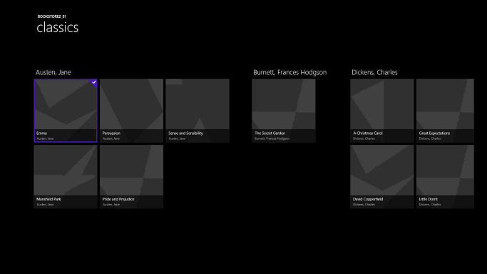
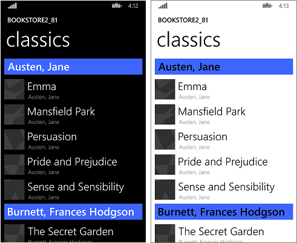

# <a name="windows-runtime-8x-to-uwp-case-study-bookstore2"></a>Tempo de execução do Windows 8.x para a UWP estudo de caso: Bookstore2


Este estudo de caso, que se baseia nas informações fornecidas no [Bookstore1](w8x-to-uwp-case-study-bookstore1.md), começa com um aplicativo Universal 8.1 que exibe dados agrupados em um controle [**SemanticZoom**](https://docs.microsoft.com/uwp/api/Windows.UI.Xaml.Controls.SemanticZoom). No modelo de exibição, cada instância da classe **Author** representa o grupo dos livros escritos por esse autor e, no **SemanticZoom**, podemos exibir a lista de livros agrupados por autor ou reduzir o zoom para ver uma lista de atalhos de autores. A lista de atalhos proporciona uma navegação mais rápida do que rolar pela lista de livros. Vamos percorrer as etapas de portabilidade do aplicativo para um aplicativo do Windows 10 Universal Windows Platform (UWP).

**Observação**    ao abrir Bookstore2Universal\_10 no Visual Studio, se você vir a mensagem "Atualização do Visual Studio necessária", em seguida, siga as etapas em [TargetPlatformVersion](w8x-to-uwp-troubleshooting.md).

## <a name="downloads"></a>Downloads

[Baixe o Bookstore2\_81 Universal 8.1 aplicativo](https://go.microsoft.com/fwlink/?linkid=532951).

[Baixe o Bookstore2Universal\_aplicativo do 10 Windows 10](https://go.microsoft.com/fwlink/?linkid=532952).

## <a name="the-universal-81-app"></a>O aplicativo Universal 8.1

Aqui está o que Bookstore2\_81 — o aplicativo que vamos para a porta — é semelhante. Trata-se de um [**SemanticZoom**](https://docs.microsoft.com/uwp/api/Windows.UI.Xaml.Controls.SemanticZoom) com rolagem horizontal (rolagem vertical no Windows Phone) que mostra os livros agrupados por autor. É possível reduzir o zoom para a lista de atalhos e, a partir daí, navegar de volta para qualquer grupo. Há duas partes principais para esse aplicativo: o modelo de exibição, que fornece a fonte de dados agrupados, e a interface do usuário, que se associa a esse modelo de exibição. Como veremos, ambos peças porta facilmente da tecnologia do WinRT 8.1 para Windows 10.



Bookstore2\_81 no Windows, a exibição ampliada
 


Bookstore2\_81 no Windows, exibição



Bookstore2\_81 no Windows Phone, ampliado em modo de exibição


Bookstore2\_81 no Windows Phone, exibição

##  <a name="porting-to-a-windows10-project"></a>Portabilidade para um projeto do Windows 10

O Bookstore2\_81 solução é um projeto de aplicativo Universal 8.1. O Bookstore2\_projeto de Windows 81. compila o pacote de aplicativo para Windows 8.1 e o Bookstore2\_81. WindowsPhone projeto compila o pacote de aplicativo para Windows Phone 8.1. Bookstore2\_81. compartilhado é o projeto que contém o código-fonte, arquivos de marcação e outros ativos e recursos, que são usados por ambos os dois projetos.

Assim como com o estudo de caso anterior, a opção, faremos (das descritas [se você tiver um aplicativo Universal 8.1](w8x-to-uwp-root.md)) é o conteúdo do projeto compartilhado para um Windows 10 que se destina a família do dispositivo Universal da porta.

Comece criando um novo projeto de Aplicativo em Branco (Windows Universal). Nomeie-o Bookstore2Universal\_10. Esses são os arquivos a serem copiadas por meio Bookstore2\_81 para Bookstore2Universal\_10.

**Do projeto compartilhado**

-   Copie a pasta que contém os arquivos do livro abrangem imagem PNG (é a pasta \\ativos\\CoverImages). Depois de copiar a pasta, no **Gerenciador de Soluções**, verifique se **Mostrar Todos os Arquivos** está ativada. Clique com o botão direito do mouse na pasta que você copiou e clique em **Incluir no Projeto**. Esse comando é o que chamamos de "incluir" arquivos ou pastas em um projeto. Cada vez que você copiar um arquivo ou pasta, cada cópia, clique em **Atualizar** no **Gerenciador de Soluções** e, em seguida, inclua o arquivo ou pasta no projeto. Não é preciso fazer isso para os arquivos que você está substituindo no destino.
-   Copie a pasta que contém o arquivo de origem do modelo de exibição (a pasta é \\ViewModel).
-   Copie MainPage.xaml e substitua o arquivo no destino.

**Do projeto do Windows**

-   Copie BookstoreStyles.xaml. Vamos usar esse um bom ponto inicial porque todas as chaves de recurso neste arquivo serão resolvidos em um aplicativo do Windows 10; Algumas no arquivo WindowsPhone equivalente não funcionará.
-   Copie SeZoUC.xaml e SeZoUC.xaml.cs. Vamos começar com a versão dessa exibição no Windows, adequada para o janelas largas. Depois, faremos ela se adaptar a janelas menores e, consequentemente, a dispositivos menores.

Edite os arquivos de código e marcação de origem que você acabou de copiar e altere todas as referências para o Bookstore2\_81 namespace para Bookstore2Universal\_10. Uma maneira rápida de fazer isso é usar o recurso **Substituir nos Arquivos**. Não são necessárias alterações no código no modelo de exibição, nem em qualquer outro código imperativo. Mas, apenas para tornar mais fácil ver qual versão do aplicativo está em execução, altere o valor retornado pela **Bookstore2Universal\_10.BookstoreViewModel.AppName** propriedade de "Bookstore2\_81" para " BOOKSTORE2UNIVERSAL\_10".

Agora, é possível compilar e executar. Aqui está a aparência do nosso novo aplicativo UWP depois de não ter feito nenhum trabalho ainda para a porta para o Windows 10.


O aplicativo do Windows 10 com as alterações de código de origem inicial em execução em um dispositivo de Desktop, a exibição ampliada


O aplicativo do Windows 10 com as alterações de código de origem inicial em execução em um dispositivo de Desktop, exibição

O modelo de exibição e as exibições ampliada e reduzida funcionam juntos corretamente, apesar de haver problemas que tornam a visualização um pouco difícil. Um problema é que o [**SemanticZoom**](https://docs.microsoft.com/uwp/api/Windows.UI.Xaml.Controls.SemanticZoom) não rola. Isso ocorre porque, no Windows 10, o estilo padrão de um [ **GridView** ](https://docs.microsoft.com/uwp/api/Windows.UI.Xaml.Controls.GridView) faz com que sejam dispostos verticalmente (e o design do Windows 10 diretrizes recomendam que podemos usá-lo dessa forma no novo e em aplicativos portados). Mas, as configurações no modelo de painel de itens personalizados que copiamos do Bookstore2 de rolagem horizontal\_81 projeto (que foi projetado para o 8.1 app) estão em conflito com as configurações de rolagem verticais no estilo de padrão do Windows 10 que está sendo aplicado como resultado de nós ter movido para um aplicativo do Windows 10. Em segundo lugar, o aplicativo ainda não adaptou sua interface do usuário para oferecer a melhor experiência em janelas de tamanhos diferentes e em dispositivos pequenos. E, em terceiro lugar, os estilos e pincéis corretos ainda não estão sendo usados. Por isso, uma grande parte do texto está invisível (inclusive os cabeçalhos dos grupos nos quais é possível clicar para reduzir o zoom). Então, nas próximas três seções ([Alterações de design de SemanticZoom e GridView](#semanticzoom-and-gridview-design-changes), [Interface do usuário adaptável](#adaptive-ui) e [Estilo universal](#universal-styling)), corrigiremos esses problemas.

## <a name="semanticzoom-and-gridview-design-changes"></a>Alterações de design de SemanticZoom e GridView

As alterações de design no Windows 10 para o [ **SemanticZoom** ](https://docs.microsoft.com/uwp/api/Windows.UI.Xaml.Controls.SemanticZoom) controle são descritos na seção [SemanticZoom alterações](w8x-to-uwp-porting-xaml-and-ui.md). Nesta seção, não precisamos fazer nada em relação a essas alterações.

As alterações do [**GridView**](https://docs.microsoft.com/uwp/api/Windows.UI.Xaml.Controls.GridView) estão descritas na seção [Alterações de GridView/ListView](w8x-to-uwp-porting-xaml-and-ui.md). Devemos fazer alguns ajustes mínimos para nos adaptar a essas alterações, conforme descrito a seguir.

-   Em SeZoUC.xaml, em `ZoomedInItemsPanelTemplate`, defina `Orientation="Horizontal"` e `GroupPadding="0,0,0,20"`.
-   Em SeZoUC.xaml, exclua `ZoomedOutItemsPanelTemplate` e remova o atributo `ItemsPanel` da exibição reduzida.

Pronto!

## <a name="adaptive-ui"></a>Interface do usuário adaptável

Após essa alteração, o layout da interface do usuário fornecido por SeZoUC.xaml é ótimo para a execução do aplicativo em uma janela larga (que só é possível em dispositivos com tela grande). Porém, quando a janela do aplicativo é estreita (o que acontece em dispositivos pequenos e também pode acontecer em dispositivos grandes), a interface do usuário que tínhamos no aplicativo da Loja do Windows Phone Store certamente é mais apropriada.

Para isso, podemos usar o recurso adaptável do Gerenciador de Estado Visual. Definiremos as propriedades em elementos visuais de maneira que, por padrão, a interface do usuário seja disposta no estado estreito usando os modelos menores que usávamos no aplicativo da Loja do Windows Phone. Depois, vamos detectar quando a janela do aplicativo for mais larga ou igual a um tamanho específico (medido em unidades de [pixels efetivos](w8x-to-uwp-porting-xaml-and-ui.md)), e alterar as propriedades dos elementos visuais de acordo para obter um layout mais largo e maior. Colocaremos essas alterações de propriedade em um estado visual e usaremos um acionador adaptável para monitorar e determinar continuamente se esse estado visual deve ou não ser aplicado, dependendo da largura da janela em pixels efetivos. Nesse caso, vamos acionar na largura da janela, mas também é possível acionar na altura da janela.

A largura mínima de janela de 548 epx é apropriada para este caso porque esse é o tamanho do menor dispositivo no qual queremos mostrar o layout largo. Normalmente, os telefones têm menos de 548 epx. Por isso, em dispositivos pequenos assim, preferimos continuar com o layout estreito padrão. Em um computador, por padrão, a janela será aberta com largura suficiente para disparar a troca para o estado largo. De lá, você poderá arrastar a janela até que fique estreita o suficiente para exibir duas colunas dos itens de 250x250. Se ela for um pouco mais estreita, o gatilho será desativado, o estado visual largo será removido e o layout estreito padrão entrará em vigor.

Assim, quais propriedades precisamos definir, e alterar, para obter esses dois layouts diferentes? Há duas alternativas e cada uma envolve uma abordagem diferente.

1.  Podemos colocar dois controles [**SemanticZoom**](https://docs.microsoft.com/uwp/api/Windows.UI.Xaml.Controls.SemanticZoom) em nossa marcação. Uma delas seria uma cópia da marcação que estávamos usando no aplicativo em tempo de execução do Windows 8. x (usando [ **GridView** ](https://docs.microsoft.com/uwp/api/Windows.UI.Xaml.Controls.GridView) controles dentro dele) e recolhida por padrão. O outro seria uma cópia da marcação que estávamos usando no aplicativo da Loja do Windows Phone (com controles [**ListView**](https://docs.microsoft.com/uwp/api/Windows.UI.Xaml.Controls.ListView) dentro dela), visível por padrão. O estado visual alternaria as propriedades de visibilidade dos dois controles **SemanticZoom**. Isso exigiria pouquíssimo trabalho mas, em geral, não é uma técnica de alto desempenho. Portanto, caso opte por usá-la, você deve criar o perfil do aplicativo e verificar se ele ainda atende às metas de desempenho.
2.  Podemos usar um único [**SemanticZoom**](https://docs.microsoft.com/uwp/api/Windows.UI.Xaml.Controls.SemanticZoom) contendo controles [**ListView**](https://docs.microsoft.com/uwp/api/Windows.UI.Xaml.Controls.ListView). Para conseguir os dois layouts, no estado visual largo, alteraríamos as propriedades dos controles **ListView**, inclusive os modelos aplicados a eles para que sejam dispostos da mesma forma que um [**GridView**](https://docs.microsoft.com/uwp/api/Windows.UI.Xaml.Controls.GridView). Isso pode ter um desempenho melhor, mas também há muitas pequenas diferenças entre os diversos estilos e modelos de **GridView** e **ListView**, e entre seus vários tipos de item. Por isso, essa pode ser uma solução mais difícil. Essa solução também está fortemente vinculada à forma como os estilos e modelos padrão são projetados no momento. Por isso, temos uma solução frágil e sensível a quaisquer alterações futuras nos padrões.

Neste estudo de caso, optaremos pela primeira alternativa. Porém, se quiser, você poderá tentar a segunda opção e ver se ela funciona melhor. Estas são as etapas a serem seguidas para implementar a primeira alternativa.

-   No [**SemanticZoom**](https://docs.microsoft.com/uwp/api/Windows.UI.Xaml.Controls.SemanticZoom), na marcação do seu novo projeto, defina `x:Name="wideSeZo"` e `Visibility="Collapsed"`.
-   Volte para o Bookstore2\_81. WindowsPhone do projeto e abra SeZoUC.xaml. Copie a marcação do elemento [**SemanticZoom**](https://docs.microsoft.com/uwp/api/Windows.UI.Xaml.Controls.SemanticZoom) desse arquivo e cole-a imediatamente depois de `wideSeZo` no novo projeto. Defina `x:Name="narrowSeZo"` no elemento que você acabou de colar.
-   Mas `narrowSeZo` precisa de alguns estilos que ainda não copiamos. Novamente em Bookstore2\_81.WindowsPhone, copie os dois estilos (`AuthorGroupHeaderContainerStyle` e `ZoomedOutAuthorItemContainerStyle`) fora da SeZoUC.xaml e colá-los em BookstoreStyles.xaml no novo projeto.
-   Agora, você tem dois elementos [**SemanticZoom**](https://docs.microsoft.com/uwp/api/Windows.UI.Xaml.Controls.SemanticZoom) no novo SeZoUC.xaml. Encapsule esses dois elementos em uma **Grid**.
-   Em BookstoreStyles.xaml no novo projeto, acrescente a palavra `Wide` a essas três chaves de recurso (e a suas referências em SeZoUC.xaml, mas somente para as referências dentro de `wideSeZo`): `AuthorGroupHeaderTemplate`, `ZoomedOutAuthorTemplate` e `BookTemplate`.
-   No Bookstore2\_81. WindowsPhone projeto, abra BookstoreStyles.xaml. Esse arquivo, copie esses três recursos mesmos (mencionados acima) e os dois entro conversores de item de lista, a declaração do prefixo do namespace Windows\_IU\_Xaml\_controles\_primitivos e cole-os todos os em BookstoreStyles.xaml no novo projeto.
-   Por fim, em SeZoUC.xaml no novo projeto, adicione a marcação apropriada do Gerenciador de Estado Visual à **Grid** que você adicionou acima.

```xml
    <Grid>
        <VisualStateManager.VisualStateGroups>
            <VisualStateGroup>
                <VisualState x:Name="WideState">
                    <VisualState.StateTriggers>
                        <AdaptiveTrigger MinWindowWidth="548"/>
                    </VisualState.StateTriggers>
                    <VisualState.Setters>
                        <Setter Target="wideSeZo.Visibility" Value="Visible"/>
                        <Setter Target="narrowSeZo.Visibility" Value="Collapsed"/>
                    </VisualState.Setters>
                </VisualState>
            </VisualStateGroup>
        </VisualStateManager.VisualStateGroups>

    ...

    </Grid>
```

## <a name="universal-styling"></a>Estilo universal

Agora corrijamos alguns problemas de estilo, inclusive o que introduzimos acima durante a cópia do projeto anterior.

-   Em MainPage.xaml, altere Background de `LayoutRoot` para `"{ThemeResource ApplicationPageBackgroundThemeBrush}"`.
-   Em BookstoreStyles.xaml, defina o valor do recurso `TitlePanelMargin` como `0` (ou qualquer valor que pareça bom para você).
-   Em SeZoUC.xaml, defina a Margem de `wideSeZo` como `0` (ou qualquer valor que pareça bom para você).
-   Em BookstoreStyles.xaml, remova o atributo Margin de `AuthorGroupHeaderTemplateWide`.
-   Remova o atributo FontFamily de `AuthorGroupHeaderTemplate` e de `ZoomedOutAuthorTemplate`.
-   Bookstore2\_81 usado o `BookTemplateTitleTextBlockStyle`, `BookTemplateAuthorTextBlockStyle`, e `PageTitleTextBlockStyle` chaves de recurso como uma indireção para que uma única chave tinha implementações diferentes em dois aplicativos. Não precisamos mais dessa indireção; podemos apenas referenciar diretamente os estilos do sistema. Assim, substitua essas referências em todo o aplicativo por `TitleTextBlockStyle`, `CaptionTextBlockStyle` e `HeaderTextBlockStyle`, respectivamente. Você pode usar o recurso **Substituir nos Arquivos** do Visual Studio para fazer isso com rapidez e precisão. Em seguida, pode excluir os três recursos não utilizados.
-   Em `AuthorGroupHeaderTemplate`, substitua `PhoneAccentBrush` por `SystemControlBackgroundAccentBrush` e defina `Foreground="White"` no **TextBlock** para que ele pareça correto ao ser executado na família de dispositivos móveis.
-   Em `BookTemplateWide`, copie o atributo Foreground do segundo **TextBlock** para o primeiro.
-   Em `ZoomedOutAuthorTemplateWide`, altere a referência a `SubheaderTextBlockStyle` (que agora está muito grande) para uma referência a `SubtitleTextBlockStyle`.
-   A exibição reduzida (a lista de atalhos) não se sobrepõe mais à exibição ampliada na nova plataforma. Assim, podemos remover o atributo `Background` da exibição reduzida de `narrowSeZo`.
-   Para que todos os estilos e modelos fiquem em um arquivo, mova `ZoomedInItemsPanelTemplate` de SeZoUC.xaml para BookstoreStyles.xaml.

Essa última sequência de operações de estilo deixa o aplicativo com esta aparência.


O aplicativo portado do Windows 10 em execução em um dispositivo de Desktop, a exibição ampliada, dois tamanhos de janela


O aplicativo portado do Windows 10 em execução em um dispositivo de Desktop, exibição, dois tamanhos de janela


O aplicativo portado do Windows 10 em execução em um dispositivo móvel, ampliado em modo de exibição


O aplicativo portado do Windows 10 em execução em um dispositivo móvel, exibição

## <a name="conclusion"></a>Conclusão

Este estudo de caso envolveu uma interface do usuário mais ambiciosa do que a anterior. Assim como no estudo de caso anterior, este modelo de exibição específico não exigiu qualquer trabalho, e nossos esforços foram principalmente para refatorar a interface do usuário. Algumas mudanças foram necessárias como resultado da combinação de dois projetos em um, com suporte a muitos fatores forma (na verdade, muito mais do que antes). Algumas mudanças estavam relacionadas com as alterações feitas na plataforma.

O próximo estudo de caso é o [QuizGame](w8x-to-uwp-case-study-quizgame.md), no qual analisaremos o acesso e a exibição de dados agrupados.
