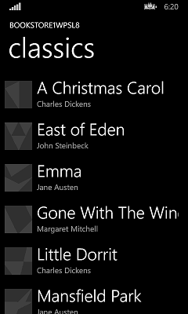
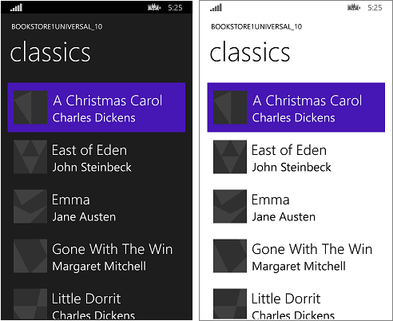

# <a name="windowsphone-silverlight-to-uwp-case-study-bookstore1"></a>WindowsPhone Silverlight para UWP estudo de caso: Bookstore1


Este tópico apresenta um estudo de caso de portabilidade de um aplicativo WindowsPhone Silverlight muito simples para um aplicativo de plataforma Windows10Universal do Windows (UWP). Com o Windows 10, você pode criar um único pacote de aplicativo que os clientes podem instalar em uma ampla variedade de dispositivos, e que é o que faremos neste estudo de caso. Consulte [Guia para aplicativos UWP](https://msdn.microsoft.com/library/windows/apps/dn894631).

O aplicativo que portaremos consiste em uma **ListBox** associada a um modelo de exibição. O modelo de exibição tem uma lista de livros que mostra o título, o autor e a capa do livro. As imagens da capa do livro têm **Build Action** definida como **Content** e **Copy to Output Directory** definida como **Do not copy**.

Os tópicos anteriores desta seção descrevem as diferenças entre as plataformas, e eles fornecem detalhes e orientações sobre o processo de portabilidade de vários aspectos de um aplicativo de marcação XAML, através da associação a um modelo de exibição, para acessar dados. Um estudo de caso visa complementar essa orientação, mostrando-o em ação em um exemplo real. Os estudos de caso pressupõem que você tenha lido as orientações, já que elas não serão repetidas aqui.

**Observação**  ao abrir Bookstore1Universal\_10 no Visual Studio, caso você veja a mensagem "Atualização do Visual Studio necessária", siga as etapas para selecionar um controle de versão de plataforma de destino em [TargetPlatformVersion](wpsl-to-uwp-troubleshooting.md).

## <a name="downloads"></a>Downloads

[Baixe o Bookstore1WPSL8 WindowsPhone Silverlight aplicativo](http://go.microsoft.com/fwlink/?linkid=517053).

[Baixe o Bookstore1Universal\_10 aplicativo do Windows 10](http://go.microsoft.com/fwlink/?linkid=532950).

## <a name="the-windowsphone-silverlight-app"></a>O aplicativo do WindowsPhone Silverlight

Aqui está a aparência do Bookstore1WPSL8, o aplicativo que vamos portar. Trata-se apenas de uma caixa de listagem de livros com rolagem vertical abaixo do cabeçalho do nome do aplicativo e do título da página.



## <a name="porting-to-a-windows10-project"></a>Portando para um projeto do Windows 10

É uma tarefa muito rápida criar um novo projeto no Visual Studio, copiar arquivos para ele a partir do Bookstore1WPSL8 e incluir os arquivos copiados no novo projeto. Comece criando um novo projeto Aplicativo em Branco (Universal do Windows). Dê a ele o nome de Bookstore1Universal\_10. Esses são os arquivos que devem ser copiados de Bookstore1WPSL8 para Bookstore1Universal\_10.

-   Copie a pasta que contém os arquivos PNG de imagem da capa do livro (a pasta é \\Assets\\CoverImages). Depois de copiar a pasta, no **Gerenciador de Soluções**, verifique se **Mostrar Todos os Arquivos** está ativada. Clique com o botão direito do mouse na pasta que você copiou e clique em **Incluir no Projeto**. Esse comando é o que chamamos de "incluir" arquivos ou pastas em um projeto. Sempre que você copia um arquivo ou uma pasta, clique em **Atualizar** no **Gerenciador de Soluções** e inclua o arquivo ou a pasta no projeto. Não é preciso fazer isso para os arquivos que você está substituindo no destino.
-   Copie a pasta que contém o arquivo de origem do modelo de exibição (a pasta é \\ViewModel).
-   Copie MainPage.xaml e substitua o arquivo no destino.

Podemos manter o App. XAML e App.xaml.cs que o Visual Studio gerou para nós no projeto do Windows 10.

Edite o código-fonte e os arquivos de marcação que você acabou de copiar e altere as referências ao namespace Bookstore1WPSL8 para Bookstore1Universal\_10. Uma maneira rápida de fazer isso é usar o recurso **Substituir nos Arquivos**. No código imperativo no arquivo de origem do modelo de exibição, são necessárias estas alterações de portabilidade:

-   Mude `System.ComponentModel.DesignerProperties` para `DesignMode` e, em seguida, use o comando **Resolver**. Exclua a propriedade `IsInDesignTool` e use o IntelliSense para adicionar o nome de propriedade correto: `DesignModeEnabled`.
-   Use o comando **Resolver** em `ImageSource`.
-   Use o comando **Resolver** em `BitmapImage`.
-   Exclua using `System.Windows.Media;` e `using System.Windows.Media.Imaging;`.
-   Mude o valor retornado pela propriedade **Bookstore1Universal\_10.BookstoreViewModel.AppName** de "BOOKSTORE1WPSL8" para "BOOKSTORE1UNIVERSAL".

No MainPage.xaml, são necessárias estas alterações de portabilidade:

-   Altere `phone:PhoneApplicationPage` para `Page` (não se esqueça das ocorrências na sintaxe do elemento de propriedade).
-   Exclua as declarações de prefixo de namespace `phone` e `shell`.
-   Mude "clr-namespace" para "using" na declaração de prefixo de namespace restante.

Podemos optar por corrigir erros de compilação de marcação de maneira bem barata caso queiramos ver os resultados o mais cedo possível, mesmo que isso signifique remover temporariamente a marcação. Porém, vamos manter um registro do débito que acumulamos fazendo isso. Aqui está ele neste caso.

1.  No elemento raiz **Página** em **MainPage.xaml**, exclua `SupportedOrientations="Portrait"`.
2.  No elemento raiz **Página** em **MainPage.xaml**, exclua `Orientation="Portrait"`.
3.  No elemento raiz **Página** em **MainPage.xaml**, exclua `shell:SystemTray.IsVisible="True"`.
4.  No modelo de dados `BookTemplate`, exclua as referências aos estilos  **TextBlock** `PhoneTextExtraLargeStyle` e `PhoneTextSubtleStyle`.
5.  No `TitlePanel` **StackPanel**, exclua as referências aos estilos  **TextBlock** `PhoneTextNormalStyle` e `PhoneTextTitle1Style`.

Vamos trabalhar na interface do usuário para a família de dispositivos móveis primeiro, depois podemos considerar outros fatores forma. Você pode compilar e executar o aplicativo agora. Veja como é a aparência no emulador do dispositivo móvel.


O modo de exibição e o modelo de exibição estão funcionando corretamente juntos, e **ListBox** está funcionando. Basicamente precisamos corrigir o estilo e fazer com que as imagens apareçam.

## <a name="paying-off-the-debt-items-and-some-initial-styling"></a>Saldando os itens de débito e alguns estilos iniciais

Por padrão, todas as orientações têm suporte. O aplicativo WindowsPhone Silverlight explicitamente restringe somente retrato, porém, portanto, débito itens \#1 e \#2 são pagos, acesse o manifesto do pacote do aplicativo no novo projeto e verificação **Retrato** em **Supported orientações**.

Para esse aplicativo, o item nº 3 não é um débito, pois a barra de status (anteriormente chamada de bandeja do sistema) é mostrada por padrão. Para itens \#4 e \#5, precisamos encontrar quatro estilos de plataforma Universal do Windows (UWP) **TextBlock** que correspondam aos estilos do WindowsPhone Silverlight que estávamos usando. Você pode executar o aplicativo WindowsPhone Silverlight no emulador e compará-lo lado a lado com a ilustração na seção de [texto](wpsl-to-uwp-porting-xaml-and-ui.md) . Ao fazer isso e examinar as propriedades dos estilos de sistema do WindowsPhone Silverlight, podemos criar esta tabela.

| Chave de estilo do Windows Phone Silverlight | Chave de estilo da UWP          |
|-------------------------------------|------------------------|
| PhoneTextExtraLargeStyle            | TitleTextBlockStyle    |
| PhoneTextSubtleStyle                | SubtitleTextBlockStyle |
| PhoneTextNormalStyle                | CaptionTextBlockStyle  |
| PhoneTextTitle1Style                | HeaderTextBlockStyle   |
 
Para definir esses estilos, basta digitá-los no editor de marcação ou usar as ferramentas de XAML do Visual Studio e defini-los sem digitar nada. Para fazer isso, clique com o botão direito do mouse em um **TextBlock** e clique em **Editar Estilo** &gt; **Aplicar Recurso**. Para fazer isso com os **TextBlock**s no modelo de item, clique com o botão direito do mouse em **ListBox**, depois clique em **Edit Additional Templates** &gt; **Edit Generated Items (ItemTemplate)**.

Existe uma tela de fundo branca 80% opaca atrás dos itens, pois o estilo padrão do controle **ListBox** define sua tela de fundo como o recurso do sistema `ListBoxBackgroundThemeBrush`. Defina `Background="Transparent"` na **ListBox** para limpar a tela de fundo. Para alinhar à esquerda os **TextBlock**s no modelo de item, edite-o novamente conforme descrito acima e defina uma **Margin** de `"9.6,0"` em ambos os **TextBlock**s.

Depois disso, como [muda em relação aos pixels de visualização](wpsl-to-uwp-porting-xaml-and-ui.md), precisamos avançar e multiplicar qualquer dimensão de tamanho fixo que ainda não tenha sido alterada (margens, largura, altura etc.) por 0,8. Assim, por exemplo, as imagens devem ser alteradas de 70x70 px para 56x56 px.

Porém, renderizemos essas imagens antes de mostrar os resultados do nosso estilo.

## <a name="binding-an-image-to-a-view-model"></a>Associando uma imagem a um modelo de exibição

Em Bookstore1WPSL8, fizemos isto:

```csharp
    // this.BookCoverImagePath contains a path of the form "/Assets/CoverImages/one.png".
    return new BitmapImage(new Uri(this.CoverImagePath, UriKind.Relative));
```

No Bookstore1Universal, usamos o [esquema de URI](https://msdn.microsoft.com/library/windows/apps/jj655406) ms-appx. Assim, podemos manter o restante do código, usar uma sobrecarga diferente do construtor **System.Uri** para colocar o esquema URI ms-appx em um URI base e acrescentar o restante do caminho a ele. Desta forma:

```csharp
    // this.BookCoverImagePath contains a path of the form "/Assets/CoverImages/one.png".
    return new BitmapImage(new Uri(new Uri("ms-appx://"), this.CoverImagePath));
```

## <a name="universal-styling"></a>Estilo universal

Agora só precisamos fazer alguns ajustes no estilo final e confirmar se a aparência do aplicativo está boa nos fatores forma do desktop e do dispositivo móvel (e outros). As etapas estão abaixo. E você pode usar os links do início deste tópico para baixar os projetos e ver os resultados de todas as alterações feitas aqui até o fim do estudo de caso.

-   Para restringir o espaçamento entre os itens, localize o modelo de dados `BookTemplate` em MainPage.xaml e exclua o atributo `Margin` da **Grid** raiz.
-   Caso queira dar ao título da página um pouco mais de espaço, você pode redefinir a margem inferior de `-5.6` para `0` no **TextBlock** do título da página.
-   Agora precisamos definir o plano de fundo de `LayoutRoot` como o valor padrão correto de maneira que o aplicativo tenha a aparência apropriada quando for executado em todos os dispositivos, independentemente do tema. Altere-o de `"Transparent"` para `"{ThemeResource ApplicationPageBackgroundThemeBrush}"`.

Com um aplicativo mais sofisticado, esse seria o momento em que usaríamos as orientações em [Portabilidade para o fator forma e a experiência do usuário](wpsl-to-uwp-form-factors-and-ux.md) e realmente usaríamos da maneira ideal o fator forma de cada um dos muitos dispositivos em que o aplicativo pode ser executado agora. Porém, para esse aplicativo simples, podemos parar aqui e ver a aparência dele após essa última sequência de operações de estilo. Na verdade, ele tem a mesma aparência em dispositivos móveis e de desktop, embora não esteja fazendo o melhor uso do espaço em fatores forma grandes (mas vamos investigar como fazer isso em um estudo de caso posterior).

Consulte [Alterações de tema](wpsl-to-uwp-porting-xaml-and-ui.md) para ver como controlar o tema do seu aplicativo.



O aplicativo Windows 10 portado em execução em um dispositivo móvel

## <a name="an-optional-adjustment-to-the-list-box-for-mobile-devices"></a>Um ajuste opcional na caixa de listagem de dispositivos móveis

Quando o aplicativo é executado em um dispositivo móvel, o plano de fundo de uma caixa de listagem fica claro por padrão em ambos os temas. Esse pode ser o estilo de sua preferência e, em caso positivo, não há mais nada a fazer. Porém, os controles são projetados de maneira que seja possível personalizar a aparência deles sem afetar o comportamento. Portanto, se você quiser que a caixa de listagem fique escura no tema escuro, a aparência que o app original tinha, siga [estas instruções](w8x-to-uwp-case-study-bookstore1.md) em "Um ajuste opcional".

## <a name="conclusion"></a>Conclusão

Este estudo de caso mostrou o processo de portabilidade de um app muito simples, sem dúvida nenhuma, um app inacreditavelmente simples. Por exemplo, controles de lista podem ser usados para a seleção ou para o estabelecimento de um contexto de navegação; o aplicativo navega até uma página com mais detalhes sobre o item que foi tocado. Este aplicativo específico não faz nada com a seleção do usuário, e ele não tem navegação. Mesmo assim, o estudo de caso serviu para quebrar o gelo, apresentar o processo de portabilidade e demonstrar técnicas importantes que podem ser usadas em aplicativos UWP reais.

O próximo estudo de caso é o [Bookstore2](wpsl-to-uwp-case-study-bookstore2.md), no qual analisaremos o acesso e a exibição de dados agrupados.
