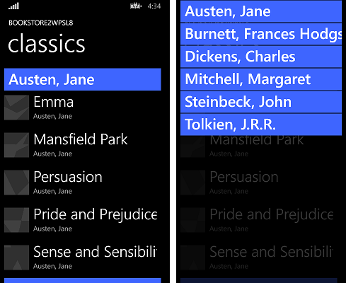

# Estudo de caso Windows Phone Silverlight para UWP: Bookstore2

\[ Atualizado para aplicativos UWP no Windows 10. Para ler artigos sobre o Windows 8.x, consulte o [arquivo](http://go.microsoft.com/fwlink/p/?linkid=619132) \]

Este estudo de caso, que se baseia nas informações fornecidas no [Bookstore1](wpsl-to-uwp-case-study-bookstore1.md), começa com um aplicativo do Windows Phone Silverlight que exibe dados agrupados em um **LongListSelector**. No modelo de exibição, cada instância da classe **Author** representa o grupo dos livros escritos por esse autor e, no **LongListSelector**, podemos exibir a lista de livros agrupados por autor ou reduzir o zoom para ver uma lista de atalhos de autores. A lista de atalhos proporciona uma navegação mais rápida do que rolar pela lista de livros. Veremos as etapas para a portabilidade do aplicativo para um aplicativo UWP (Plataforma Universal do Windows) do Windows 10.

**Observação** ao abrir Bookstore2Universal\_10 no Visual Studio, caso você veja a mensagem "Atualização do Visual Studio necessária", siga as etapas em [TargetPlatformVersion](w8x-to-uwp-troubleshooting.md#targetplatformversion).

## Downloads

[Baixe o aplicativo Windows Phone Silverlight Bookstore2WPSL8](http://go.microsoft.com/fwlink/p/?linkid=522601).

[Baixe o aplicativo do Windows 10 Bookstore2Universal\_10](http://go.microsoft.com/fwlink/?linkid=532952).

##  O aplicativo Windows Phone Silverlight

A ilustração abaixo mostra a aparência do Bookstore2WPSL8, o aplicativo que vamos portar. É um **LongListSelector** de rolagem vertical de livros agrupados por autor. É possível reduzir o zoom para a lista de atalhos e, a partir daí, navegar de volta para qualquer grupo. Há duas partes principais para esse aplicativo: o modelo de exibição, que fornece a fonte de dados agrupados, e a interface do usuário, que se associa a esse modelo de exibição. Como veremos, ambas as partes portam facilmente da tecnologia do Windows Phone Silverlight para a UWP (Plataforma Universal do Windows)



##  Portando para um projeto do Windows 10

É uma tarefa rápida criar um novo projeto no Visual Studio, copiar arquivos para ele do Bookstore2WPSL8 e incluir os arquivos copiados no novo projeto. Comece criando um novo projeto Aplicativo em Branco (Universal do Windows). Dê a ele o nome de Bookstore2Universal\_10. Esses são os arquivos que devem ser copiados de Bookstore2WPSL8 para Bookstore2Universal\_10.

-   Copie a pasta que contém os arquivos PNG de imagem da capa do livro (a pasta é \\Assets\\CoverImages). Depois de copiar a pasta, no **Gerenciador de Soluções**, verifique se **Mostrar Todos os Arquivos** está ativada. Clique com o botão direito do mouse na pasta que você copiou e clique em **Incluir no Projeto**. Esse comando é o que chamamos de "incluir" arquivos ou pastas em um projeto. Sempre que você copia um arquivo ou uma pasta, clique em **Atualizar** no **Gerenciador de Soluções** e inclua o arquivo ou a pasta no projeto. Não é preciso fazer isso para os arquivos que você está substituindo no destino.
-   Copie a pasta que contém o arquivo de origem do modelo de exibição (a pasta é \\ViewModel).
-   Copie MainPage.xaml e substitua o arquivo no destino.

Podemos manter os arquivos App.xaml e App.xaml.cs que o Visual Studio gerou para nós no projeto do Windows 10.

Edite o código-fonte e os arquivos de marcação que você acabou de copiar e altere as referências ao namespace Bookstore2WPSL8 para Bookstore2Universal\_10. Uma maneira rápida de fazer isso é usar o recurso **Substituir nos Arquivos**. No código imperativo no arquivo de origem do modelo de exibição, são necessárias estas alterações de portabilidade.

-   Mude `System.ComponentModel.DesignerProperties` para `DesignMode` e, em seguida, use o comando **Resolver**. Exclua a propriedade `IsInDesignTool` e use o IntelliSense para adicionar o nome de propriedade correto: `DesignModeEnabled`.
-   Use o comando **Resolver** em `ImageSource`.
-   Use o comando **Resolver** em `BitmapImage`.
-   Exclua `using System.Windows.Media;` e `using System.Windows.Media.Imaging;`.
-   Mude o valor retornado pela propriedade **Bookstore2Universal\_10.BookstoreViewModel.AppName** de "BOOKSTORE2WPSL8" para "BOOKSTORE2UNIVERSAL".
-   Assim como fizemos para o [Bookstore1](wpsl-to-uwp-case-study-bookstore1.md), atualize a implementação da propriedade **BookSku.CoverImage** (confira [Associando uma imagem a um modelo de modo de exibição](wpsl-to-uwp-case-study-bookstore1.md#binding-an-image)).

No MainPage.xaml, estas alterações iniciais de portabilidade são necessárias.

-   Altere `phone:PhoneApplicationPage` para `Page` (incluindo as ocorrências na sintaxe do elemento de propriedade).
-   Exclua as declarações de prefixo de namespace `phone` e `shell` .
-   Mude "clr-namespace" para "using" na declaração de prefixo de namespace restante.
-   Exclua `SupportedOrientations="Portrait"`e `Orientation="Portrait"`, e configure **Retrato** no manifesto do pacote do aplicativo no novo projeto.
-   Exclua `shell:SystemTray.IsVisible="True"`.
-   Os tipos dos conversores de itens da lista de atalhos (que estão presentes na marcação como recursos) foram movidos para o namespace [**Windows.UI.Xaml.Controls.Primitives**](https://msdn.microsoft.com/library/windows/apps/br209818). Portanto, adicione a declaração de prefixo de namespace Windows\_UI\_Xaml\_Controls\_Primitives e mapeie-a para **Windows.UI.Xaml.Controls.Primitives**. Nos recursos de conversores de item de lista de atalhos, mude o prefixo de `phone:` para `Windows_UI_Xaml_Controls_Primitives:`.
-   Assim como fizemos para o [Bookstore1](wpsl-to-uwp-case-study-bookstore1.md), substitua todas as referências ao estilo  `PhoneTextExtraLargeStyle` **TextBlock** por uma referência a `SubtitleTextBlockStyle`, substitua `PhoneTextSubtleStyle` por `SubtitleTextBlockStyle`, substitua `PhoneTextNormalStyle` por `CaptionTextBlockStyle` e substitua `PhoneTextTitle1Style` por `HeaderTextBlockStyle`.
-   Há uma exceção em `BookTemplate`. O estilo do segundo **TextBlock** deve fazer referência a `CaptionTextBlockStyle`.
-   Remova o atributo FontFamily do **TextBlock** dentro de `AuthorGroupHeaderTemplate` e defina o plano de fundo da **Border** para fazer referência a `SystemControlBackgroundAccentBrush`, em vez de `PhoneAccentBrush`.
-   Devido às [alterações relacionadas aos pixels de exibição](wpsl-to-uwp-porting-xaml-and-ui.md#effective-pixels), verifique a marcação e multiplique qualquer dimensão de tamanho fixo (margens, largura, altura etc.) por 0,8.

## Substituindo o LongListSelector


A substituição do **LongListSelector** por um controle [**SemanticZoom**](https://msdn.microsoft.com/library/windows/apps/hh702601) tem várias etapas, portanto, vamos começar. Um **LongListSelector** associa-se diretamente à fonte de dados agrupados, mas um **SemanticZoom** contém controles [**ListView**](https://msdn.microsoft.com/library/windows/apps/br242878) ou [**GridView**](https://msdn.microsoft.com/library/windows/apps/br242705), que associam-se indiretamente aos dados por meio de um adaptador [**CollectionViewSource**](https://msdn.microsoft.com/library/windows/apps/br209833). O **CollectionViewSource** precisa estar presente na marcação como um recurso, por isso vamos começar adicionando isso à marcação no MainPage.xaml dentro de `<Page.Resources>`.

```xml
    <CollectionViewSource
        x:Name="AuthorHasACollectionOfBookSku"
        Source="{Binding Authors}"
        IsSourceGrouped="true"/>
```

Observe que a associação no **LongListSelector.ItemsSource** torna-se o valor de **CollectionViewSource.Source**, e **LongListSelector.IsGroupingEnabled** torna-se **CollectionViewSource.IsSourceGrouped**. O **CollectionViewSource** tem um nome (observação: não é uma chave, como você esperava) de maneira que possamos nos associar a ele.

Em seguida, substitua o `phone:LongListSelector` por essa marcação, o que nos dará um **SemanticZoom** preliminar para trabalharmos.

```xml
    <SemanticZoom>
        <SemanticZoom.ZoomedInView>
            <ListView
                ItemsSource="{Binding Source={StaticResource AuthorHasACollectionOfBookSku}}"
                ItemTemplate="{StaticResource BookTemplate}">
                <ListView.GroupStyle>
                    <GroupStyle
                        HeaderTemplate="{StaticResource AuthorGroupHeaderTemplate}"
                        HidesIfEmpty="True"/>
                </ListView.GroupStyle>
            </ListView>
        </SemanticZoom.ZoomedInView>
        <SemanticZoom.ZoomedOutView>
            <ListView
                ItemsSource="{Binding CollectionGroups, Source={StaticResource AuthorHasACollectionOfBookSku}}"
                ItemTemplate="{StaticResource ZoomedOutAuthorTemplate}"/>
        </SemanticZoom.ZoomedOutView>
    </SemanticZoom>
```

A noção **LongListSelector** de modos de lista plana e de lista de atalhos é respondida na noção **SemanticZoom** de uma exibição ampliada e de uma exibição reduzida, respectivamente. A exibição ampliada é uma propriedade e você define essa propriedade como uma instância de uma **ListView**. Nesse caso, o modo de exibição reduzido também é definido com o uma **ListView** e ambos os controles **ListView** são vinculados a nossa **CollectionViewSource**. A exibição ampliada usa o mesmo modelo de item, modelo de cabeçalho de grupo, e configuração **HideEmptyGroups** (agora denominada **HidesIfEmpty**) como faz a lista plana do **LongListSelector**. E a exibição reduzida usa um modelo de item semelhante ao que está dentro do estilo da lista de atalhos do **LongListSelector** (`AuthorNameJumpListStyle`). Observe também que a exibição reduzida se associa a uma propriedade especial do **CollectionViewSource** denominada **CollectionGroups**, que é uma coleção que contém os grupos, em vez dos itens.

Não precisamos mais de `AuthorNameJumpListStyle`, pelo menos não inteiramente. Precisamos apenas do modelo de dados para os grupos (que são os autores neste aplicativo) no modo de exibição reduzida. Portanto, excluímos o estilo `AuthorNameJumpListStyle` e o substituímos por esse modelo de dados.

```xml
   <DataTemplate x:Key="ZoomedOutAuthorTemplate">
        <Border Margin="9.6,0.8" Background="{Binding Converter={StaticResource JumpListItemBackgroundConverter}}">
            <TextBlock Margin="9.6,0,9.6,4.8" Text="{Binding Group.Name}" Style="{StaticResource SubtitleTextBlockStyle}"
            Foreground="{Binding Converter={StaticResource JumpListItemForegroundConverter}}" VerticalAlignment="Bottom"/>
        </Border>
    </DataTemplate>
```

Como o contexto de dados desse modelo de dados é um grupo em vez de um item, nós o associamos a uma propriedade especial chamada **Group**.

Você pode compilar e executar o aplicativo agora. Veja como é a aparência no emulador do dispositivo móvel.


O modelo de exibição e as exibições ampliada e reduzida funcionam corretamente juntos, embora a necessidade de trabalhar um pouco mais o estilo e o modelo seja um problema. Por exemplo, os estilos e os pincéis corretos ainda não estão sendo usados, logo, o texto está invisível nos cabeçalhos de grupo em que é possível clicar para reduzir. Se executar o aplicativo em um dispositivo desktop, você terá um segundo problema, o aplicativo ainda não adapta a interface do usuário para oferecer a melhor experiência e usar melhor o espaço em dispositivos maiores, nos quais as janelas podem ser possivelmente muito maiores do que a tela de um dispositivo móvel. Portanto, nas próximas seções ([Estilos e modelos iniciais](#initial-styling-and-templating), [Interface do usuário adaptável](#adaptive-ui) e [Estilos finais](#final-styling)), corrigiremos esses problemas.

## Estilos e modelos iniciais

Para espaçar os cabeçalhos de grupo de forma ideal, edite `AuthorGroupHeaderTemplate` e defina uma **Margin** de `"0,0,0,9.6"` na **Border**.

Para espaçar os itens de livro de forma ideal, edite `BookTemplate` e defina a **Margin** como `"9.6,0"` nos dois **TextBlock**s.

Para dispor um pouco melhor o nome do aplicativo e o título da página, dentro de `TitlePanel`, remova a **Margin** superior no segundo **TextBlock** definindo o valor como `"7.2,0,0,0"`. E, no próprio `TitlePanel`, defina a margem como `0` (ou qualquer valor que seja bom para você)

Altere a tela de fundo de `LayoutRoot` para `"{ThemeResource ApplicationPageBackgroundThemeBrush}"`.

## Interface do usuário adaptável

Uma vez que começamos com um aplicativo de telefone, não é surpresa que o layout da interface do usuário do aplicativo portado faça sentido apenas para dispositivos pequenos e janelas estreitas neste estágio do processo. Porém, gostaríamos que o layout da interface do usuário se adaptasse e utilizasse melhor o espaço quando o aplicativo estivesse em execução em uma janela ampla (o que é possível somente em um dispositivo com uma tela grande), e que ele usasse apenas a interface do usuário que temos no momento quando a janela do aplicativo fosse estreita (o que acontece em um dispositivo pequeno, e também pode acontecer em um dispositivo grande).

Para isso, podemos usar o recurso adaptável do Gerenciador de Estado Visual. Vamos definir as propriedades nos elementos visuais de forma que, por padrão, as interfaces do usuário sejam dispostas no estado estreito com o modelo que estamos usando no momento. Depois, vamos detectar quando a janela do aplicativo for mais larga ou igual a um tamanho específico (medido em unidades de [pixels efetivos](wpsl-to-uwp-porting-xaml-and-ui.md#effective-pixels)), e alterar as propriedades dos elementos visuais de acordo para obter um layout mais largo e maior. Colocaremos essas alterações de propriedade em um estado visual e usaremos um acionador adaptável para monitorar e determinar continuamente se esse estado visual deve ou não ser aplicado, dependendo da largura da janela em pixels efetivos. Nesse caso, vamos acionar na largura da janela, mas também é possível acionar na altura da janela.

A largura mínima de janela de 548 epx é apropriada para este caso porque esse é o tamanho do menor dispositivo no qual queremos mostrar o layout largo. Normalmente, os telefones têm menos de 548 epx. Por isso, em dispositivos pequenos assim, preferimos continuar com o layout estreito padrão. Em um computador, por padrão, a janela será aberta com largura suficiente para acionar a troca para o estado largo, que exibirá itens com 250 x 250 de tamanho. Então, você poderá arrastar a janela para que fique estreita o suficiente para exibir, no mínimo, duas colunas dos itens de 250 x 250. Se ela for mais estreita, o acionador será desativado, o estado visual largo será removido e o layout estreito padrão será usado.

Antes de abordar a parte adaptável do Gerenciador de Estado Visual, precisamos primeiro criar o estado amplo, e isso significa a adição de novos elementos visuais e modelos à nossa marcação. Estas etapas descrevem como fazer isso. Por meio de convenções de nomenclatura para modelos e elementos visuais, incluiremos a palavra "wide" no nome de qualquer elemento ou modelo destinado ao estado largo. Se um elemento ou modelo não contiver a palavra "wide", você poderá assumir que ele se destina a um estado estreito, que é o estado padrão, e seus valores de propriedade serão definidos como valores locais em elementos visuais na página. Apenas os valores de propriedade para o estado largo serão definidos por meio de um Estado visual real na marcação.

-   Faça uma cópia do controle [**SemanticZoom**](https://msdn.microsoft.com/library/windows/apps/hh702601) na marcação e defina `x:Name="narrowSeZo"` na cópia. No original, defina `x:Name="wideSeZo"` e `Visibility="Collapsed"` para que o estado largo não fique visível por padrão.
-   Em `wideSeZo`, altere as **ListView**s para **GridView**s nas exibições ampliada e reduzida.
-   Faça uma cópia desses três recursos `AuthorGroupHeaderTemplate`, `ZoomedOutAuthorTemplate` e `BookTemplate` e acrescente a palavra `Wide` às chaves das cópias. Também atualize `wideSeZo` para que faça referência às chaves desses novos recursos.
-   Substitua o conteúdo de `AuthorGroupHeaderTemplateWide` por `<TextBlock Style="{StaticResource SubheaderTextBlockStyle}" Text="{Binding Name}"/>`.
-   Substitua o conteúdo de `ZoomedOutAuthorTemplateWide` por:

```xml
    <Grid HorizontalAlignment="Left" Width="250" Height="250" >
        <Border Background="{StaticResource ListViewItemPlaceholderBackgroundThemeBrush}"/>
        <StackPanel VerticalAlignment="Bottom" Background="{StaticResource ListViewItemOverlayBackgroundThemeBrush}">
          <TextBlock Foreground="{StaticResource ListViewItemOverlayForegroundThemeBrush}"
              Style="{StaticResource SubtitleTextBlockStyle}"
            Height="80" Margin="15,0" Text="{Binding Group.Name}"/>
        </StackPanel>
    </Grid>
```

-   Substitua o conteúdo de `BookTemplateWide` por:

```xml
    <Grid HorizontalAlignment="Left" Width="250" Height="250">
        <Border Background="{StaticResource ListViewItemPlaceholderBackgroundThemeBrush}"/>
        <Image Source="{Binding CoverImage}" Stretch="UniformToFill"/>
        <StackPanel VerticalAlignment="Bottom" Background="{StaticResource ListViewItemOverlayBackgroundThemeBrush}">
            <TextBlock Style="{StaticResource SubtitleTextBlockStyle}"
                Foreground="{StaticResource ListViewItemOverlaySecondaryForegroundThemeBrush}"
                TextWrapping="NoWrap" TextTrimming="CharacterEllipsis"
                Margin="12,0,24,0" Text="{Binding Title}"/>
            <TextBlock Style="{StaticResource CaptionTextBlockStyle}" Text="{Binding Author.Name}"
                Foreground="{StaticResource ListViewItemOverlaySecondaryForegroundThemeBrush}" TextWrapping="NoWrap"
                TextTrimming="CharacterEllipsis" Margin="12,0,12,12"/>
        </StackPanel>
    </Grid>
```

-   Para o estado largo, os grupos na exibição ampliada precisarão de mais espaço livre vertical ao redor deles. Criar e fazer referência ao modelo do painel de itens produzirá os resultados que queremos. É assim a aparência da marcação.

```xml
   <ItemsPanelTemplate x:Key="ZoomedInItemsPanelTemplate">
        <ItemsWrapGrid Orientation="Horizontal" GroupPadding="0,0,0,20"/>
    </ItemsPanelTemplate>
    ...

    <SemanticZoom x:Name="wideSeZo" ... >
        <SemanticZoom.ZoomedInView>
            <GridView
            ...
            ItemsPanel="{StaticResource ZoomedInItemsPanelTemplate}">
            ...
```

-   Por fim, adicione a marcação apropriada do Gerenciador de Estado Visual como o primeiro filho de `LayoutRoot`.

```xml
    <Grid x:Name="LayoutRoot" ... >
        <VisualStateManager.VisualStateGroups>
            <VisualStateGroup>
                <VisualState x:Name="WideState">
                    <VisualState.StateTriggers>
                        <AdaptiveTrigger MinWindowWidth="548"/>
                    </VisualState.StateTriggers>
                    <VisualState.Setters>
                        <Setter Target="wideSeZo.Visibility" Value="Visible"/>
                        <Setter Target="narrowSeZo.Visibility" Value="Collapsed"/>
                    </VisualState.Setters>
                </VisualState>
            </VisualStateGroup>
        </VisualStateManager.VisualStateGroups>

    ...
```

## Estilos finais

O que resta são alguns ajustes de estilo final.

-   Em `AuthorGroupHeaderTemplate`, defina `Foreground="White"` no **TextBlock** para que ele tenha a aparência correta quando for ser executado na família de dispositivos móveis.
-   Adicione `FontWeight="SemiBold"` ao **TextBlock** em `AuthorGroupHeaderTemplate` e `ZoomedOutAuthorTemplate`.
-   Em `narrowSeZo`, os cabeçalhos de grupo e os autores na exibição reduzida são alinhados à esquerda, em vez de alongados, portanto vamos trabalhar nisso. Criaremos um [**HeaderContainerStyle**](https://msdn.microsoft.com/library/windows/apps/dn251841) para a exibição ampliada com [**HorizontalContentAlignment**](https://msdn.microsoft.com/library/windows/apps/br209417) definido como `Stretch`. E criaremos um [**ItemContainerStyle**](https://msdn.microsoft.com/library/windows/apps/br242817) para a exibição reduzida contendo esse mesmo [**Setter**](https://msdn.microsoft.com/library/windows/apps/br208817). Veja aqui como ficou a aparência.

```xml
   <Style x:Key="AuthorGroupHeaderContainerStyle" TargetType="ListViewHeaderItem">
        <Setter Property="HorizontalContentAlignment" Value="Stretch"/>
    </Style>

    <Style x:Key="ZoomedOutAuthorItemContainerStyle" TargetType="ListViewItem">
        <Setter Property="HorizontalContentAlignment" Value="Stretch"/>
    </Style>

    ...

    <SemanticZoom x:Name="narrowSeZo" ... >
        <SemanticZoom.ZoomedInView>
            <ListView
            ...
                <ListView.GroupStyle>
                    <GroupStyle
                    ...
                    HeaderContainerStyle="{StaticResource AuthorGroupHeaderContainerStyle}"
                    ...
        <SemanticZoom.ZoomedOutView>
            <ListView
                ...
                ItemContainerStyle="{StaticResource ZoomedOutAuthorItemContainerStyle}"
                ...
```

Essa última sequência de operações de estilo deixa o aplicativo com esta aparência.


O aplicativo do Windows 10 portado em execução em um dispositivo de desktop, exibição ampliada, dois tamanhos de janela  


O aplicativo do Windows 10 portado em execução em um dispositivo de desktop, exibição reduzida, dois tamanhos de janela


O aplicativo do Windows 10 portado em execução em um dispositivo móvel, exibição ampliada


O aplicativo do Windows 10 portado em execução em um dispositivo móvel, exibição reduzida

## Tornando o modelo de exibição mais flexível

Esta seção contém um exemplo das facilidades criadas por termos mudado nosso aplicativo para usar a UWP. Explicamos a seguir etapas opcionais que você pode seguir para tornar seu modelo de exibição mais flexível quando acessado por meio de um **CollectionViewSource**. O modelo de exibição (o arquivo de origem está em ViewModel\\BookstoreViewModel.cs) que portamos do aplicativo do Windows Phone Silverlight Bookstore2WPSL8 contém uma classe denominada Author, que é derivada de **List&lt;T&gt;**, onde **T** é BookSku. Isso significa que a classe Author *é um* grupo de BookSku.

Quando associamos **CollectionViewSource.Source** a Authors, a única coisa que estamos comunicando é que cada Author em Authors é um grupo de *alguma coisa*. Deixamos que o **CollectionViewSource** determine que Author é, nesse caso, um grupo de BookSku. Isso funciona: mas não é flexível. E se quisermos que Author seja *tanto* um grupo de BookSku *quanto* um grupo dos endereços de onde o autor morou? Não é possível que Author *seja* esses dois grupos. Mas Author pode *ter* qualquer número de grupos. E esta é a solução: use o padrão *tem-um-grupo* em vez de, ou em conjunto com o padrão *é-um-grupo* que estamos usando no momento. Este é o procedimento:

-   Altere Author de forma que não derive mais de **List&lt;T&gt;**.
-   Adicione este campo a Author: `private ObservableCollection<BookSku> bookSkus = new ObservableCollection<BookSku>();`.
-   Adicione esta propriedade a Author: `public ObservableCollection<BookSku> BookSkus { get { return this.bookSkus; } }`.
-   E, é claro, podemos repetir as duas etapas acima para adicionar quantos grupos precisarmos a Author.
-   Mude a implementação do método AddBookSku para `this.BookSkus.Add(bookSku);`.
-   Agora que Author *tem* pelo menos um grupo, precisamos comunicar a **CollectionViewSource** qual desses grupos deve ser usado. Para fazer isso, adicione essa propriedade à **CollectionViewSource**: `ItemsPath="BookSkus"`

Essas alterações deixam o aplicativo funcionalmente inalterado, mas agora você sabe como pode estender Author e **CollectionViewSource**, caso seja necessário. Vamos fazer uma última alteração em Author de modo que, se o usarmos *sem* especificar o **CollectionViewSource.ItemsPath**, um grupo padrão de nossa escolha será usado:

```csharp
    public class Author : IEnumerable<BookSku>
    {
        ...

        public IEnumerator<BookSku> GetEnumerator()
        {
            return this.BookSkus.GetEnumerator();
        }
        System.Collections.IEnumerator System.Collections.IEnumerable.GetEnumerator()
        {
            return this.BookSkus.GetEnumerator();
        }
    }
```

E agora podemos optar por remover `ItemsPath="BookSkus"` se quisermos, e o aplicativo ainda se comportará da mesma maneira.

## Conclusão

Este estudo de caso envolveu uma interface do usuário mais ambiciosa do que a anterior. Todos os recursos e conceitos de  **LongListSelector** do Windows Phone Silverlight, e muito mais, estavam disponíveis para um aplicativo UWP na forma de **SemanticZoom**, **ListView**, **GridView** e **CollectionViewSource**. Mostramos como reutilizar ou copiar e editar o código imperativo e a marcação em um aplicativo UWP para obter funcionalidade, interface do usuário e interações personalizadas para adequação aos fatores forma de dispositivos Windows mais estreitos e largos, e todos os tamanhos intermediários.


<!--HONumber=May16_HO2-->


