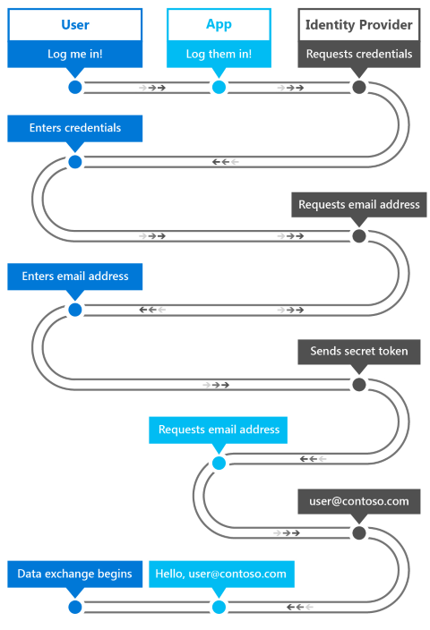

# <a name="intro-to-secure-windows-app-development"></a>Introdução ao desenvolvimento de apps seguros do Windows


Este artigo introdutório ajuda arquitetos e desenvolvedores de aplicativos a compreender melhor os vários recursos da plataforma Windows 10 que aceleram a criação de aplicativos UWP (Plataforma Universal do Windows) seguros. Ele fornece detalhes sobre como usar os recursos de segurança do Windows disponíveis em cada um dos seguintes estágios: autenticação, dados em voo (data-in-flight) e dados em repouso (data-at-rest). Você pode encontrar informações mais detalhadas sobre cada tópico revisando os recursos adicionais incluídos em cada capítulo.

## <a name="1-introduction"></a>1 Introdução


Desenvolver um aplicativo seguro pode ser um desafio. No mundo ágil atual de aplicativos móveis, sociais, em nuvem e empresariais complexos, os clientes esperam que os aplicativos sejam disponibilizados e atualizados mais rápido do que nunca. Eles também usam vários tipos de dispositivos, aumentando ainda mais a complexidade da criação de experiências com aplicativos. Se você desenvolve para a UWP (Plataforma Universal do Windows) do Windows 10, isso pode incluir a tradicional lista de desktops, notebooks, tablets e dispositivos móveis, além de uma lista cada vez maior de novos dispositivos, que abrangem a Internet das Coisas, o Xbox One, o Microsoft Surface Hub e o HoloLens. Como desenvolvedor, você deve garantir que seus aplicativos se comuniquem e armazenem dados com segurança, em todas as plataformas ou dispositivos envolvidos.

Aqui estão alguns dos benefícios da utilização de recursos de segurança do Windows 10.

-   Você tem uma segurança padronizada em todos os dispositivos que oferecem suporte ao Windows 10, usando APIs consistentes para tecnologias e componentes de segurança.
-   Você escreve, testa e mantém menos código do que faria se implementasse um código personalizado para cobrir esses cenários de segurança.
-   Os aplicativos se tornam mais estáveis e seguros porque você usa o sistema operacional para controlar o modo como o aplicativo acessa seus recursos e os recursos do sistema local ou remoto.

Durante a autenticação, a identidade de um usuário que solicita acesso a um determinado serviço é validada. O Windows Hello é o componente no Windows 10 que ajuda a criar um mecanismo de autenticação mais seguro em aplicativos do Windows. Com ele, você pode usar um PIN (número de identificação pessoal) ou biometria, como as impressões digitais, o rosto ou a íris do usuário para implementar autenticação multifator para seus apps.

Os dados em voo se referem à conexão e às mensagens transferidas nela. Um exemplo disso é a recuperação de dados de um servidor remoto usando serviços Web. O uso dos protocolos SSL (Secure Sockets Layer) e HTTPS (Secure Hypertext Transfer Protocol) garante a segurança da conexão. Impedir intermediários de acessar essas mensagens, ou aplicativos não autorizados de se comunicar com os serviços Web, é essencial para proteger dados em voo.

Por fim, o termo dados em repouso significa os dados que residem na memória ou na mídia de armazenamento. O Windows 10 tem um modelo de aplicativo que impede o acesso não autorizado de dados entre aplicativos e oferece APIs de criptografia para proteger ainda mais os dados no dispositivo. Um recurso chamado Cofre de Credenciais pode ser usado para armazenar com segurança as credenciais do usuário no dispositivo, com o sistema operacional impedindo que outros aplicativos acessem esses dados.

## <a name="2-authentication-factors"></a>2 Fatores de autenticação


Para proteger os dados, a pessoa que solicita acesso a eles deve ser identificada e autorizada a acessar os recursos de dados que solicita. O processo de identificação de um usuário é chamado autenticação, e o processo de determinação de privilégios de acesso a um recurso é denominado autorização. Essas são operações estreitamente relacionadas e, para o usuário, elas podem parecer iguais. Elas podem ser operações relativamente simples ou complexas, dependendo de muitos fatores: por exemplo, se os dados residem em um servidor ou se estão distribuídos em vários sistemas. O servidor que fornece os serviços de autenticação e autorização é conhecido como o provedor de identidade.

Para se autenticar usando um determinado serviço e/ou aplicativo, o usuário utiliza credenciais criadas com base em algo que conhece, algo que tem e/ou algo que é. Esses itens são denominados fatores de autenticação.

-   **Algo que o usuário saiba** costuma ser uma senha, mas também pode ser um número de identificação pessoal (PIN) ou um par pergunta/resposta "secreto".
-   **Algo que o usuário possui** normalmente é um dispositivo de memória de hardware, como um cartão inteligente ou um pen drive que contém os dados de autenticação exclusivos para o usuário.
-   **Algo que o usuário é** costuma incluir as impressões digitais, mas há fatores cada vez mais usados, como a fala, o rosto, as características oculares (olhos) ou os padrões de comportamento do usuário. Quando são armazenadas como dados, essas medidas são chamadas de biometria.

Uma senha criada pelo usuário é um fator de autenticação em si, mas normalmente não é suficiente; qualquer pessoa que saiba a senha pode representar o usuário que a possui. Um cartão inteligente pode oferecer um nível de segurança mais alto, mas pode ser roubado, perdido ou extraviado. Um sistema que possa autenticar um usuário pela impressão digital ou por uma varredura ocular pode oferecer o nível de segurança mais alto e prático, mas isso exige um hardware caro e especializado (por exemplo, uma câmera Intel RealSense para reconhecimento facial) que talvez não esteja disponível para todos os usuários.

Projetar o método de autenticação usado por um sistema é um aspecto complexo e importante da segurança de dados. Em geral, quanto mais fatores você usar na autenticação, mais seguro será o sistema. Ao mesmo tempo, a autenticação deve ser utilizável. Um usuário normalmente fará logon muitas vezes ao dia, logo, o processo deve ser rápido. A escolha do tipo de autenticação é um compromisso entre a segurança e a facilidade de uso; a autenticação de fator único é menos segura e mais fácil de usar, e a autenticação multifator é cada vez mais segura, porém mais complexa, à medida que mais fatores são adicionados.

## <a name="21-single-factor-authentication"></a>2.1 Autenticação de fator único


Essa forma de autenticação se baseia em uma credencial de usuário único. Isso costuma ser uma senha, mas também pode ser um PIN (número de identificação pessoal).

Aqui está o processo de autenticação de fator único.

-   O usuário fornece o nome de usuário e a senha para o provedor de identidade. O provedor de identidade é o processo de servidor que verifica a identidade do usuário.
-   O provedor de identidade verifica se o nome de usuário e a senha são iguais aos armazenados no sistema. Na maioria dos casos, a senha será criptografada, fornecendo segurança adicional para que outras pessoas não possam lê-la.
-   O provedor de identidade retorna um status de autenticação que indica se a autenticação foi bem-sucedida.
-   Caso seja bem-sucedida, a troca de dados começa. Caso malsucedida, o usuário deve ser reautenticado.


Hoje, esse método de autenticação é o mais usado em serviços. Ele também é a forma menos segura de autenticação quando usado como o único meio de autenticação. Os requisitos de complexidade de senha, as "perguntas secretas" e as alterações regulares de senha podem tornar o uso de senhas mais seguro, mas eles sobrecarregam mais os usuários e não são uma solução eficiente contra hackers.

O desafio com senhas é que é mais fácil adivinhá-las corretamente do que os sistemas que têm mais de um fator. Se eles roubarem um banco de dados com contas de usuário e senhas com hash de uma pequena loja na Web, poderão utilizar as senhas usadas em outros sites. Os usuários tendem a reutilizar contas o tempo todo, pois é difícil lembrar de senhas complexas. Para um departamento de TI, o gerenciamento de senhas também traz a complexidade de ter que oferecer mecanismos de restauração, que requerem atualizações frequentes de senhas e o armazenamento seguro delas.

Apesar de todas as desvantagens, a autenticação de fator único oferece ao usuário o controle da credencial. Ele cria e modifica a credencial, e somente um teclado é necessário para o processo de autenticação. Esse é o principal aspecto que diferencia as autenticações de fator único e multifator.

## <a name="211-web-authentication-broker"></a>2.1.1 Agente de autenticação na Web


Conforme discutido anteriormente, um dos desafios na autenticação de senhas para um departamento de TI é a sobrecarga adicional de gerenciar a base de nomes de usuários/senhas, mecanismos de redefinição etc. Uma opção cada vez mais procurada é o uso de provedores de identidade de terceiros que oferecem autenticação por meio do OAuth, um padrão aberto para autenticação.

Usando o OAuth, os departamentos de TI podem efetivamente "terceirizar" a complexidade de manter um banco de dados com nomes de usuário e senhas, redefinir a funcionalidade de senha etc. para um provedor de identidade de terceiros, como o Facebook, o Twitter ou a Microsoft.

Os usuários têm controle total sobre sua identidade nessas plataformas, mas os aplicativos podem solicitar um token do provedor, depois que o usuário for autenticado e com o seu consentimento, que pode ser usado para autorizar usuários autenticados.

O agente de autenticação Web no Windows 10 oferece um conjunto de APIs, e a infraestrutura para que os aplicativos usem protocolos de autenticação e autorização como OAuth e OpenID. Os aplicativos podem iniciar operações de autenticação por meio da API [**WebAuthenticationBroker**](https://msdn.microsoft.com/library/windows/apps/br227025), o que resulta no retorno de um [**WebAuthenticationResult**](https://msdn.microsoft.com/library/windows/apps/br227038). Uma visão geral do fluxo de comunicação é ilustrada na figura a seguir.



O aplicativo funciona como o agente, que inicia a autenticação com o provedor de identidade por meio de um [**WebView**](https://msdn.microsoft.com/library/windows/apps/br227702) no aplicativo. Quando tiver autenticado o usuário, o provedor de identidade retorna um token para o aplicativo que pode ser usado para solicitar informações sobre o usuário junto ao provedor de identidade. Como medida de segurança, o aplicativo deve ser registrado junto ao provedor de identidade para que ele possa corretar processos de autenticação com o provedor de identidade. Essas etapas de registro são diferentes para cada provedor.

Aqui está o fluxo de trabalho geral usado para chamar a API [**WebAuthenticationBroker**](https://msdn.microsoft.com/library/windows/apps/br227025) para se comunicar com o provedor.

-   Construa as cadeias de caracteres de solicitação a serem enviadas para o provedor de identidade. O número de cadeias de caracteres e as informações em cada cadeia de caracteres são diferentes para cada serviço Web, mas normalmente incluem duas cadeias de caracteres, cada uma contendo uma URL: uma para a qual a solicitação de autenticação é enviada, e uma para a qual o usuário será redirecionado após a conclusão da autorização.
-   Chame [**WebAuthenticationBroker.AuthenticateAsync**](https://msdn.microsoft.com/library/windows/apps/br212066), passando as cadeias de caracteres de solicitação e aguarde a resposta do provedor de identidade.
-   Chame [**WebAuthenticationResult.ResponseStatus**](https://msdn.microsoft.com/library/windows/apps/br227041) para obter o status quando a resposta for recebida.
-   Caso a comunicação seja bem-sucedida, processe a cadeia de caracteres de resposta retornada pelo provedor de identidade. Caso isso seja malsucedido, processe o erro.

Caso a comunicação seja bem-sucedida, processe a cadeia de caracteres de resposta retornada pelo provedor de identidade. Caso isso seja malsucedido, processe o erro.

O código de amostra em C# para esse processo está abaixo. Para obter informações e um passo a passo detalhado, consulte [WebAuthenticationBroker](web-authentication-broker.md). Para obter uma amostra de código completo, confira a [Amostra de WebAuthenticationBroker em GitHub](http://go.microsoft.com/fwlink/p/?LinkId=620622).

```cs
string startURL = "https://<providerendpoint>?client_id=<clientid>";
string endURL = "http://<AppEndPoint>";

var startURI = new System.Uri(startURL);
var endURI = new System.Uri(endURL);

try
{
    WebAuthenticationResult webAuthenticationResult = 
        await WebAuthenticationBroker.AuthenticateAsync( 
            WebAuthenticationOptions.None, startURI, endURI);

    switch (webAuthenticationResult.ResponseStatus)
    {
        case WebAuthenticationStatus.Success:
            // Successful authentication. 
            break;
        case WebAuthenticationStatus.ErrorHttp:
            // HTTP error. 
            break;
        default:
            // Other error.
        break;
    }
}
catch (Exception ex)
{
    // Authentication failed. Handle parameter, SSL/TLS, and
    // Network Unavailable errors here. 
}
```

## <a name="22-multi-factor-authentication"></a>2.2 Autenticação multifator


A autenticação multifator usa mais de um fator de autenticação. Geralmente, "algo que você sabe", como uma senha, é combinado com "algo que você tem", que pode ser um telefone celular ou um cartão inteligente. Mesmo que um invasor descubra a senha do usuário, a conta permanecerá inacessível sem o dispositivo ou o cartão. E se apenas o dispositivo ou o cartão for comprometido, ele não será útil para o invasor sem a senha. Por isso, a autenticação multifator é mais segura, e também mais complexa, do que a autenticação de fator único.

Serviços que usam autenticação multifator normalmente darão ao usuário uma opção de como ele recebe a segunda credencial. Um exemplo desse tipo de autenticação é um processo muito usado em que um código de verificação é enviado para o telefone celular do usuário usando SMS.

-   O usuário fornece o nome de usuário e a senha para o provedor de identidade.
-   O provedor de identidade verifica o nome de usuário e a senha na autorização de fator único e procura o número do telefone celular do usuário armazenado no sistema.
-   O servidor envia uma mensagem SMS que contém um código de verificação gerado para o telefone celular do usuário.
-   O usuário fornece o código de verificação para o provedor de identidade; isso por meio de um formulário apresentado ao usuário.
-   O provedor de identidade retorna um status de autenticação que indica se a autenticação de ambas as credenciais foi bem-sucedida.
-   Caso seja bem-sucedida, a troca de dados começa. Caso contrário, o usuário deverá ser autenticado novamente.


Como você pode ver, esse processo também difere da autenticação de fator único porque a credencial do segundo usuário é enviada para o usuário, em vez de ser criada ou fornecida por ele. Por isso, o usuário não está em controle completo das credenciais necessárias. Isso também se aplica quando um cartão inteligente é usado como a segunda credencial: a organização é responsável por criar e fornecê-la para o usuário.

## <a name="221-azure-active-directory"></a>2.2.1 Active Directory do Azure


Active Directory do Azure (Azure AD) é um serviço de gerenciamento de identidade e acesso com base em nuvem que pode funcionar como o provedor de identidade na autenticação de fator único ou de vários fatores. A autenticação do Azure AD pode ser usada com ou sem um código de verificação.

Embora o Azure AD também possa implementar a autenticação de fator único, as empresas geralmente exigem a maior segurança da autenticação multifator. Em uma configuração de autenticação multifator, um usuário autenticado com uma conta do Azure AD tem a opção de ter um código de verificação enviado como uma mensagem SMS para o telefone celular ou para o aplicativo Azure Authenticator no aplicativo de celular.

Além disso, o Azure AD pode ser usado como um provedor OAuth, fornecendo ao usuário padrão um mecanismo de autenticação e autorização para aplicativos em várias plataformas. Para saber mais, consulte [Active Directory do Microsoft Azure](https://azure.microsoft.com/services/active-directory/) e [Autenticação multifator no Azure](https://azure.microsoft.com/services/multi-factor-authentication/).

## <a name="24-windows-hello"></a>2.4 Windows Hello


No Windows 10, um mecanismo de autenticação multifator conveniente é integrado ao sistema operacional. Windows Hello é o nome do novo sistema biométrico de entrada interno no Windows 10. Como foi integrado diretamente no sistema operacional, o Windows Hello permite a identificação de face ou impressão digital para desbloquear os dispositivos dos usuários. O repositório seguro de credenciais do Windows protege os dados biométricos no dispositivo.

O Windows Hello oferece uma maneira robusta para um dispositivo reconhecer um usuário individual, o que resolve a primeira parte do caminho entre um usuário e um serviço solicitado ou item de dados. Porém, depois que o dispositivo tiver reconhecido o usuário, ele ainda precisará autenticá-lo para determinar se deve conceder acesso a um recurso solicitado. O Windows Hello também oferece 2FA (autenticação em dois fatores) forte, que está totalmente integrada ao Windows e substitui senhas reutilizáveis por uma combinação de um dispositivo específico e gestos biométricos ou um PIN. O PIN é especificado pelo usuário como parte da inscrição na conta da Microsoft.

No entanto, o Windows Hello não é apenas uma renovação dos sistemas de 2FA tradicionais. Conceitualmente, ele é semelhante aos cartões inteligentes: a autenticação usa primitivos criptográficos em vez de comparações de cadeias de caracteres, e o material da chave do usuário fica seguro em um hardware à prova de adulterações. O Windows Hello também não requer os componentes de infraestrutura extra necessários para a implantação de cartões inteligentes. Em particular, você não precisa de uma PKI (Infraestrutura de Chave Pública), caso não tenha uma no momento. O Windows Hello combina as principais vantagens da tecnologia de cartão inteligente (a flexibilidade de implantação para cartões inteligentes virtuais e a segurança robusta para cartões inteligentes físicos) sem qualquer uma das suas desvantagens.

Um dispositivo deve ser registrado junto ao Windows Hello para que os usuários possam se autenticar junto a ele. O Windows Hello usa a criptografia assimétrica (chave pública/privada) em que um participante usa uma chave pública para criptografar os dados que a outra parte pode descriptografar usando uma chave privada. No caso do Windows Hello, ele cria um conjunto de pares de chave pública/privada e grava as chaves privadas no chip Trusted Platform Module (TPM) do dispositivo. Após o registro de um dispositivo, os aplicativos UWP (Plataforma Universal do Windows) podem chamar APIs de sistema para recuperar a chave pública do usuário, que pode ser utilizada para registrar o usuário no servidor.

O fluxo de trabalho de registro de um app pode ter a seguinte aparência:


As informações de registro que você coleta podem incluir muito mais informações de identificação do que são utilizadas neste cenário simples. Por exemplo, se seu aplicativo acessa um serviço protegido, como para bancos, você precisará solicitar comprovação de identidade e outros itens como parte do processo de inscrição. Depois que todas as condições forem atendidas, a chave pública do usuário será armazenada no back-end e usada para validar na próxima vez em que o usuário utilizar o serviço.

Para obter mais informações sobre o Windows Hello, consulte o [Guia do Windows Hello](https://msdn.microsoft.com/library/mt589441) e o [Guia do desenvolvedor do Windows Hello](microsoft-passport.md).

## <a name="3-data-in-flight-security-methods"></a>3 Métodos de segurança de dados em voo


Os métodos de segurança de dados em voo se aplicam a dados em trânsito entre dispositivos conectados a uma rede. Os dados podem ser transferidos entre sistemas no ambiente de alta segurança de uma intranet corporativa privada, ou entre um cliente e um serviço Web no ambiente não seguro da Web. Os aplicativos do Windows 10 oferecem suporte a padrões como SSL por meio das APIs de rede e funcionam com tecnologias como o Gerenciamento de APIs do Azure, com o qual os desenvolvedores podem garantir o nível apropriado de segurança para os aplicativos.

## <a name="31-remote-system-authentication"></a>3.1 Autenticação do sistema remoto


Existem dois cenários gerais em que a comunicação ocorre com um sistema de computador remoto.

-   Um servidor local autentica um usuário por meio de uma conexão direta. Por exemplo, quando o servidor e o cliente estão em uma intranet corporativa.
-   O usuário se comunica com um serviço Web pela Internet.

Os requisitos de segurança para a comunicação do serviço Web são mais altos do que aqueles ligados diretamente a cenários, pois os dados não são apenas uma parte da rede se segurança e a probabilidade de invasores mal intencionados tentarem interceptar dados também é maior. Como vários tipos de dispositivos acessarão o serviço, eles provavelmente serão compilados como serviços RESTful, em vez de WCF, por exemplo, o que significa que a autenticação e a autorização para o serviço também introduzem novos desafios. Vamos discutir dois requisitos para a comunicação segura do sistema remoto.

O primeiro requisito é a confidencialidade da mensagem: as informações passadas entre o cliente e os serviços Web (por exemplo, a identidade do usuário e outras informações pessoais) não devem ser legíveis por terceiros em trânsito. Isso normalmente é realizado criptografando-se a conexão por meio da qual as mensagens são enviadas e criptografando-se a mensagem propriamente dita. Na criptografia de chaves pública/privada, a chave pública está disponível para qualquer pessoa e é usada para criptografar as mensagens a serem enviadas para um receptor específico. A chave privada só é mantida pelo receptor e é usada para descriptografar a mensagem.

O segundo requisito é a integridade da mensagem: o cliente e o serviço Web devem ser capazes de verificar se as mensagens que eles recebem são aquelas a serem enviadas pela outra parte e se a mensagem não foi alterada em trânsito. Isso é realizado assinando-se mensagens com assinaturas digitais e usando-se a autenticação de certificado.

## <a name="32-ssl-connections"></a>3.2 Conexões SSL


Para estabelecer e manter conexões seguras com clientes, os serviços Web podem usar o protocolo Secure Sockets Layer (SSL), que tem suporte do protocolo Secure Hypertext Transfer Protocol (HTTPS). O SSL oferece confidencialidade e integridade de mensagem, dando suporte à criptografia de chave pública, bem como aos certificados de servidor. O SSL foi substituído pelo Transport Layer Security (TLS), mas o TLS com frequência é conhecido como SSL.

Quando um cliente solicita acesso a um recurso em um servidor, SSL inicia um processo de negociação junto ao servidor. Isso é chamado handshake SSL. Um nível de criptografia, um conjunto de chaves de criptografia pública e privada e as informações de identidade nos certificados cliente e servidor são acordados como a base de toda a comunicação durante a conexão SSL. O servidor também pode exigir que o cliente seja autenticado nesse momento. Depois que a conexão é estabelecida, todas as mensagens são criptografadas com a chave pública negociada até a conexão ser fechada.

## <a name="321-ssl-pinning"></a>3.2.1 Anexação SSL


Embora possa oferecer confidencialidade de mensagem usando criptografia e certificados, o SSL não faz nada para verificar se o servidor com o qual o cliente está se comunicando é o correto. O comportamento do servidor pode ser imitado por um terceiro não autorizado, interceptando os dados confidenciais que o cliente transmite. Para evitar isso, uma técnica chamada anexação SSL é utilizada para verificar se o certificado no servidor é o certificado que o cliente espera e em que confia.

Existem algumas maneiras diferentes de implementar a anexação SSL em aplicativos, cada uma com prós e contras. A abordagem mais fácil é por meio da declaração de certificados no manifesto do pacote do aplicativo. Essa declaração permite que o pacote do aplicativo instale certificados digitais e especifique uma confiança exclusiva neles. Isso resulta em conexões SSL permitidas apenas entre o aplicativo e os servidores que têm os certificados correspondentes na cadeia de certificados. Esse mecanismo também permite o uso seguro de certificados autoassinados, pois nenhuma dependência de terceiros é necessária em autoridades de certificação pública confiável.


Para obter mais controle sobre a lógica de validação, há APIs disponíveis para validar os certificados retornados pelo servidor em resposta a uma solicitação HTTPS. Observe que esse método requer o envio de uma solicitação e a inspeção da resposta, logo, certifique-se de adicioná-lo como uma validação antes de enviar efetivamente informações confidenciais em uma solicitação.

O código em C# a seguir ilustra esse método de anexação SSL. O método **ValidateSSLRoot** usa a classe [**HttpClient**](https://msdn.microsoft.com/library/windows/apps/dn298639) para executar uma solicitação HTTP. Depois que o cliente envia a resposta, ele usa a coleção [**RequestMessage.TransportInformation.ServerIntermediateCertificates**](https://msdn.microsoft.com/library/windows/apps/dn279681) para inspecionar os certificados retornados pelo servidor. Assim, o cliente pode validar toda a cadeia de certificados com as impressões digitais que ele incluiu. Esse método requer que as impressões digitais de certificados sejam atualizadas no aplicativo quando o certificado do servidor expirar e for renovado.

```cs
private async Task ValidateSSLRoot()
{
    // Send a get request to Bing
    var httpClient = new HttpClient();
    var bingUri = new Uri("https://www.bing.com");
    HttpResponseMessage response = 
        await httpClient.GetAsync(bingUri);

    // Get the list of certificates that were used to
    // validate the server's identity
    IReadOnlyList<Certificate> serverCertificates = response.RequestMessage.TransportInformation.ServerIntermediateCertificates;
  
    // Perform validation
    if (!ValidateCertificates(serverCertificates))
    {
        // Close connection as chain is not valid
        return;
    }
    // Validation passed, continue with connection to service
}

private bool ValidateCertificates(IReadOnlyList<Certificate> certs)
{
    // In this example, we iterate through the certificates
    // and check that the chain contains
    // one specific certificate we are expecting
    foreach (var cert in certs)
    {
        byte[] thumbprint = cert.GetHashValue();

        // Check if the thumbprint matches whatever you 
        // are expecting
        var expected = new byte[] { 212, 222, 32, 208, 94, 102, 
            252, 83, 254, 26, 80, 136, 44, 120, 219, 40, 82, 202, 
            228, 116 };

        // ThumbprintMatches does the byte[] comparison 
        if (ThumbprintMatches(thumbprint, expected))
        {
            return true;
        }
    }
    return false;
}
```

## <a name="33-publishing-and-securing-access-to-rest-apis"></a>3.3 Publicação e proteção do acesso a APIs REST


Para garantir o acesso autorizado a serviços Web, eles devem exigir autenticação sempre que é feita uma chamada de API. A capacidade de controlar o desempenho e o dimensionamento também é algo a se considerar quando os serviços Web são expostos através da Web. O Gerenciamento de APIs do Azure é um serviço que pode ajudar a expor as APIs na Web, enquanto fornece recursos em três níveis.

Os **publicadores/administradores** da API podem facilmente configurar a API por meio do Portal do Fornecedor de Gerenciamento de APIs do Azure. Aqui, conjuntos de APIs podem ser criados, e o acesso a eles pode ser gerenciado para controlar quem tem acesso a quais APIs.

Os **desenvolvedores** que desejam acesso a essas APIs podem fazer solicitações por meio do Portal do Desenvolvedor, que podem fornecer acesso imediato ou exigir aprovação pelo fornecedor/administrador. Os desenvolvedores também podem ver a documentação da API e o código de amostra no Portal do Desenvolvedor, para adotar rapidamente as APIs oferecidas pelo serviço Web.

Os **apps** que esses desenvolvedores criam acessam a API por meio do proxy oferecido pelo Gerenciamento de APIs do Azure. O proxy fornece uma camada de obscuridade, ocultando o ponto de extremidade real da API no servidor do editor/administrador e também pode incluir lógica adicional, como conversão de API, para garantir que a API exposta seja mantida consistente quando uma chamada para uma API é redirecionada para outra. Ele também pode usar filtragem IP para bloquear chamadas à API provenientes de um domínio IP específico ou do conjunto de domínios. O Gerenciamento de APIs do Azure também mantém os serviços Web seguros usando um conjunto de chaves públicas, chamado de chaves API, para autenticar e autorizar cada chamada à API. Quando a autorização falha, o acesso à API e a funcionalidade a que ele dá suporte permanecem bloqueados.

O Serviço de Gerenciamento de APIs do Azure também pode reduzir o número de chamadas à API para um serviço (um procedimento chamado limitação) para otimizar o desempenho do serviço Web. Para saber mais, examine [Gerenciamento de APIs do Azure](https://azure.microsoft.com/services/api-management/) e [Gerenciamento de APIs do Azure na AzureCon 2015.](https://channel9.msdn.com/events/Microsoft-Azure/AzureCon-2015/ACON313)

## <a name="4-data-at-rest-security-methods"></a>4 Métodos de segurança de dados em repouso


Quando os dados chegam em um dispositivo, nos referimos a eles como "dados em repouso". Esses dados precisam ser armazenados no dispositivo de maneira segura, de maneira que ele não possa ser acessado por usuários ou aplicativos não autorizados. O modelo de aplicativo no Windows 10 faz muito para garantir que os dados armazenados por qualquer aplicativo só sejam acessíveis por esse aplicativo, ao mesmo tempo em que fornece APIs para compartilhar os dados quando necessário. As APIs adicionais também estão disponíveis para garantir que os dados possam ser criptografados e as credenciais possam ser armazenadas com segurança.

## <a name="41-windows-app-model"></a>4.1 Modelo de aplicativo do Windows


Tradicionalmente, o Windows jamais teve uma definição de um aplicativo. Ele era mais conhecido como um executável (.exe), e isso nunca incluiu a instalação, o armazenamento do estado, a duração da execução, o controle de versão, a integração com o SO ou a comunicação de aplicativo para aplicativo. O modelo Plataforma Universal do Windows define um modelo de aplicativo que abrange instalação, ambiente de tempo de execução, gerenciamento de recursos, atualizações, modelo de dados e desinstalação.

Os aplicativos do Windows 10 são executados em um contêiner, o que significa que eles têm privilégios limitados por padrão (privilégios adicionais podem ser solicitados e concedidos pelo usuário). Por exemplo, se um aplicativo quiser acessar arquivos no sistema, um seletor de arquivos do namespace [**Windows.Storage.Pickers**](https://msdn.microsoft.com/library/windows/apps/br207928) tem de ser usado para permitir que o usuário selecione um arquivo (sem acesso direto aos arquivos habilitado). Outro exemplo é que se um aplicativo quiser acessar os dados de local do usuário, ele terá que permitir a declaração da capacidade do dispositivo de local, solicitando ao usuário no momento do download que esse aplicativo solicite acesso ao local do usuário. Além disso, na primeira vez que o aplicativo quiser acessar o local do usuário, um prompt de consentimento adicional será mostrado ao usuário, solicitando permissão para acessar os dados.

Observe que esse modelo de aplicativo atua como uma "jaula" para aplicativos, o que significa que eles não podem sair, mas não e um “castelo” que não possa ser acessado do lado de fora (obviamente, os aplicativos com privilégios de administrador ainda podem acessá-los). O Device Guard no Windows 10, que permite que as organizações/TI especifiquem quais aplicativos (Win32) podem ser executados, podem ajudar a limitar esse acesso ainda mais.

O modelo de aplicativo também gerencia o ciclo de vida do aplicativo. Ele limita a execução em segundo plano de aplicativos por padrão, por exemplo; assim que um aplicativo entra em segundo plano, o processo é suspenso – depois de oferecer ao aplicativo um breve período para tratar da suspensão no código – e sua memória é congelada. O sistema operacional fornece mecanismos para os aplicativos solicitarem a execução de tarefas específicas em segundo plano (em um agendamento, disparadas por vários eventos, como conectividade de Internet/Bluetooth, alterações de energia etc., e em cenários específicos, como a execução de músicas ou o rastreamento por GPS).

Quando faltam recursos de memória no dispositivo, o Windows libera espaço na memória encerrando aplicativos. Esse modelo do ciclo de vida força aplicativos a fechar dados sempre que são suspensos, porque não há mais tempo disponível entre a suspensão e o encerramento.

Para obter mais informações, consulte [É universal: Noções básicas sobre o ciclo de vida de um aplicativo do Windows 10](https://visualstudiomagazine.com/articles/2015/09/01/its-universal.aspx).

## <a name="42-stored-credential-protection"></a>4.2 Proteção de credencial armazenada


Os aplicativos do Windows que acessam serviços autenticados normalmente dão aos usuários a opção de armazenar as credenciais no dispositivo local. Trata-se de uma comodidade para os usuários; quando eles fornecem o nome de usuário e a senha, o aplicativo automaticamente os usa em inicializações subsequentes do aplicativo. Como isso pode ser um problema de segurança caso um invasor consiga acesso aos dados armazenados, o Windows 10 oferece a possibilidade de aplicativos do Windows armazenarem as credenciais do usuário em um cofre de credenciais seguro. O aplicativo chama a API do Cofre de Credenciais para armazenar e recuperar as credenciais do cofre em vez de armazená-las no contêiner de armazenamento do aplicativo. O cofre de credenciais é gerenciado pelo sistema operacional, mas o acesso é limitado ao aplicativo que o armazena, proporcionando uma solução gerenciada de maneira segura para o armazenamento de credenciais.

Quando um usuário fornece as credenciais a serem armazenadas, o aplicativo obtém uma referência para o cofre de credenciais usando o objeto [**PasswordVault**](https://msdn.microsoft.com/library/windows/apps/br227081) no namespace [**Windows.Security.Credentials**](https://msdn.microsoft.com/library/windows/apps/br227089). Em seguida, ele cria um objeto [**PasswordCredential**](https://msdn.microsoft.com/library/windows/apps/br227061) que contém um identificador para o aplicativo do Windows, além do nome de usuário e da senha. Isso é passado ao método [**PasswordVault.Add**](https://msdn.microsoft.com/library/windows/apps/hh701231) para armazenar as credenciais no cofre. O código de exemplo em C# a seguir mostra como isso é feito.

```cs
var vault = new PasswordVault();
vault.Add(new PasswordCredential("My App", username, password));
```

No código de exemplo em C# a seguir, o aplicativo solicita todas as credenciais correspondentes ao aplicativo chamando o método [**FindAllByResource**](https://msdn.microsoft.com/library/windows/apps/br227083) do objeto [**PasswordVault**](https://msdn.microsoft.com/library/windows/apps/br227081). Caso mais de um seja retornado, ele solicita que o usuário insira o nome de usuário. Caso as credenciais não estejam no cofre, o aplicativo solicita ao usuário para eles. Assim, o usuário está conectado ao servidor usando as credenciais.

```cs
private string resourceName = "My App";
private string defaultUserName;

private void Login()
{
    PasswordCredential loginCredential = GetCredentialFromLocker();

    if (loginCredential != null)
    {
        // There is a credential stored in the locker.
        // Populate the Password property of the credential
        // for automatic login.
        loginCredential.RetrievePassword();
    }
    else
    {
        // There is no credential stored in the locker.
        // Display UI to get user credentials.
        loginCredential = GetLoginCredentialUI();
    }
    // Log the user in.
    ServerLogin(loginCredential.UserName, loginCredential.Password);
}

private PasswordCredential GetCredentialFromLocker()
{
    PasswordCredential credential = null;

    var vault = new PasswordVault();
    var credentialList = vault.FindAllByResource(resourceName);

    if (credentialList.Count == 1)
    {
        credential = credentialList[0];
    }
    else if (credentialList.Count > 0)
    {
        // When there are multiple usernames,
        // retrieve the default username. If one doesn't
        // exist, then display UI to have the user select
        // a default username.
        defaultUserName = GetDefaultUserNameUI();

        credential = vault.Retrieve(resourceName, defaultUserName);
    }
    return credential;
}
```

Para obter mais informações, consulte [Cofre de Credenciais](credential-locker.md).

## <a name="43-stored-data-protection"></a>4.3 Proteção de dados armazenados


Ao lidar com dados armazenados, normalmente conhecidos como dados em repouso, criptografá-los pode evitar que os usuários acessem os dados armazenados. Os dois mecanismos comuns para criptografar dados estão usando chaves simétricas ou assimétricas. No entanto, a criptografia de dados não pode garantir que os dados não sejam alterados entre o momento em que eles foram enviados e o momento em que ele foram armazenados. Em outras palavras, a integridade de dados não pode ser garantida. Usar códigos de autenticação de mensagem, hashes e assinaturas digitais são técnicas comuns para solucionar esse problema.

## <a name="431-data-encryption"></a>4.3.1 Criptografia de dados


Com a criptografia simétrica, o remetente e o destinatário têm a mesma chave e a usam para criptografar e descriptografar os dados. O desafio dessa abordagem é compartilhar a chave com segurança, de maneira que ambas as partes estejam atentas a ela.

Uma resposta para isso é a criptografia assimétrica, na qual um par de chaves pública/privada é usado. A chave pública é compartilhada livremente com qualquer pessoa que queira criptografar uma mensagem. A chave privada sempre é mantida em segredo, de maneira que apenas você possa usá-la para descriptografar os dados. Uma técnica comum para possibilitar a descoberta da chave pública é usar certificados digitais, também conhecidos simplesmente como certificados. O certificado mantém informações sobre a chave pública, além de informações sobre o usuário ou o servidor, como nome, emissor, endereço de email e país.

Os desenvolvedores de aplicativos do Windows podem usar as classes [**SymmetricKeyAlgorithmProvider**](https://msdn.microsoft.com/library/windows/apps/br241537) e [**AsymmetricKeyAlgorithmProvider**](https://msdn.microsoft.com/library/windows/apps/br241478) para implementar as criptografias simétrica e assimétrica nos aplicativos UWP. Além disso, a classe [**CryptographicEngine**](https://msdn.microsoft.com/library/windows/apps/br241490) pode ser usada para criptografar e descriptografar dados, assinar conteúdo e verificar assinaturas digitais. Os apps também podem usar a classe [**DataProtectionProvider**](https://msdn.microsoft.com/library/windows/apps/br241559) no namespace [**Windows.Security.Cryptography.DataProtection**](https://msdn.microsoft.com/library/windows/apps/br241585) para criptografar e descriptografar dados locais armazenados.

## <a name="432-detecting-message-tampering-macs-hashes-and-signatures"></a>4.3.2 Detecção da falsificação de mensagem (MACs, hashes e assinaturas)


MAC é um código (ou marca) resultante do uso de uma chave simétrica (chamada de chave secreta) ou de uma mensagem como entrada para um algoritmo de criptografia MAC. A chave secreta e o algoritmo são acordados pelo remetente e pelo receptor antes da transferência da mensagem.

MACs verificam mensagens desta forma.

-   O remetente deriva a marca MAC usando a chave secreta como a entrada para o algoritmo MAC.
-   O remetente envia a marca MAC e a mensagem para o receptor.
-   O receptor deriva a marca MAC usando a chave secreta e a mensagem como entradas para o algoritmo MAC.
-   O receptor compara a marca MAC com a marca MAC do remetente. Caso elas sejam iguais, sabemos que a mensagem não foi violada.


Os aplicativos do Windows podem implementar a verificação de mensagem MAC chamando a classe [**MacAlgorithmProvider**](https://msdn.microsoft.com/library/windows/apps/br241530) para gerar a chave e a classe [**CryptographicEngine**](https://msdn.microsoft.com/library/windows/apps/br241490) para executar o algoritmo de criptografia MAC.

## <a name="433-using-hashes"></a>4.3.3 Como usar hashes


Função de hash é um algoritmo criptográfico que utiliza um bloco de dados arbitrariamente longo e retorna uma sequência de caracteres de bit de tamanho fixo chamada de valor de hash. Existe uma família inteira de funções de hash que podem fazer isso.

Um valor de hash pode ser usado em lugar de um MAC no cenário de transferência de mensagem acima. O remetente envia um valor de hash e uma mensagem, e o receptor deriva o próprio valor de hash do valor de hash do remetente e a mensagem e compara os dois valores de hash. Aplicativos em execução no Windows 10 podem chamar a classe [**HashAlgorithmProvider**](https://msdn.microsoft.com/library/windows/apps/br241511) para enumerar os algoritmos de hash disponíveis e executar um deles. A classe [**CryptographicHash**](https://msdn.microsoft.com/library/windows/apps/br241498) representa o valor de hash. O método [**CryptographicHash.GetValueAndReset**](https://msdn.microsoft.com/library/windows/apps/hh701376) pode ser usado para fazer hash repetidamente de dados diferentes sem a necessidade de recriar o objeto para cada uso. O método Append da classe **CryptographicHash** adiciona dados novos a um buffer para hash. Todo esse processo é mostrado no exemplo de código em C# a seguir.

```cs
public void SampleReusableHash()
{
    // Create a string that contains the name of the
    // hashing algorithm to use.
    string strAlgName = HashAlgorithmNames.Sha512;

    // Create a HashAlgorithmProvider object.
    HashAlgorithmProvider objAlgProv = HashAlgorithmProvider.OpenAlgorithm(strAlgName);

    // Create a CryptographicHash object. This object can be reused to continually
    // hash new messages.
    CryptographicHash objHash = objAlgProv.CreateHash();

    // Hash message 1.
    string strMsg1 = "This is message 1";
    IBuffer buffMsg1 = CryptographicBuffer.ConvertStringToBinary(strMsg1, BinaryStringEncoding.Utf16BE);
    objHash.Append(buffMsg1);
    IBuffer buffHash1 = objHash.GetValueAndReset();

    // Hash message 2.
    string strMsg2 = "This is message 2";
    IBuffer buffMsg2 = CryptographicBuffer.ConvertStringToBinary(strMsg2, BinaryStringEncoding.Utf16BE);
    objHash.Append(buffMsg2);
    IBuffer buffHash2 = objHash.GetValueAndReset();

    // Convert the hashes to string values (for display);
    string strHash1 = CryptographicBuffer.EncodeToBase64String(buffHash1);
    string strHash2 = CryptographicBuffer.EncodeToBase64String(buffHash2);
}
```

## <a name="434-digital-signatures"></a>4.3.4 Assinaturas digitais


A integridade de dados de uma mensagem armazenada assinada digitalmente é verificada de maneira semelhante à autenticação MAC. Aqui está a maneira como o fluxo de trabalho da assinatura digital funciona.

-   O remetente deriva um valor de hash (também conhecido como um resumo) usando a mensagem como a entrada para um algoritmo de hash.
-   O remetente criptografa o resumo usando a chave privada.
-   O remetente envia a mensagem, o resumo criptografado e o nome do algoritmo de hash que foi usado.
-   O receptor usa a chave pública para descriptografar o resumo criptografado recebido. Em seguida, ele usa o algoritmo de hash na mensagem para criar um resumo dele mesmo. E, por fim, o receptor compara os dois resumos (aquele que ele recebeu e descriptografou e o que ele criou). Somente se os dois forem coincidentes é que o receptor pode ter certeza de que a mensagem foi enviada pelo detentor da chave privada e, portanto, eles são quem dizem ser, e que a mensagem não foi alterada em trânsito.


Os algoritmos de hash são muito rápidos, de maneira que os valores de hash podem ser derivados rapidamente até mesmo de mensagens grandes. O valor de hash resultante é um tamanho arbitrário e pode ser menor do que a mensagem inteira, logo, usar chaves pública e privada para criptografar e descriptografar apenas o resumo, em vez da mensagem inteira, é uma otimização.

Para obter mais informações, dê uma olhada nos artigos [Assinaturas digitais](https://msdn.microsoft.com/library/windows/desktop/aa381977), [MACs, hashes e assinaturas](macs-hashes-and-signatures.md) e [Criptografia.](cryptography.md)

## <a name="5-summary"></a>5 Resumo


A Plataforma Universal do Windows no Windows 10 oferece um número de formas de aproveitar recursos de sistema operacional para criar aplicativos mais seguros. Em cenários de autenticação diferentes, como fator único, multifator ou autenticação orientada com um provedor de identidade OAuth, há APIs para atenuar os desafios mais comuns com autenticação. O Windows Hello oferece um novo sistema de entrada biométrica que reconhece o usuário e combate ativamente iniciativas de contornar a identificação apropriada. Ele também oferece diversas camadas de chaves e certificados que nunca podem ser reveladas ou usadas fora de um módulo de plataforma confiável. Além disso, uma camada adicional de segurança está disponível por meio do uso opcional de chaves e certificados de identidade de atestado.

Para proteger dados em voo, há APIs existem para se comunicar com sistemas remotos com segurança sobre SSL, ao mesmo tempo em que é oferecida a possibilidade de validar a autenticidade do servidor com anexação SSL. A publicação segura de APIs de uma forma controlada é algo em que o Gerenciamento de APIs do Azure ajuda, fornecendo opções avançadas de configuração para expor APIs na Web com o uso de um proxy que fornece mais ofuscação do ponto de extremidade de API. O acesso a essas APIs é protegido com chaves de API, e as chamadas de API podem ser limitadas para controlar o desempenho.

Quando os dados chegam no dispositivo, o modelo de aplicativo do Windows fornece mais controle sobre o modo como o aplicativo é instalado, atualizado e acessa dados, impedindo- o de acessar dados de outros aplicativos de maneira não autorizada. O Cofre de Credenciais pode fornecer armazenamento seguro de credenciais do usuário gerenciado pelo sistema operacional e outros dados podem ser protegidos no dispositivo com a criptografia e APIs com hash oferecidas pela Plataforma Universal do Windows.

## <a name="6-resources"></a>6 Recursos


### <a name="61-how-to-articles"></a>6.1 Artigos de instruções

-   [Autenticação e identidade do usuário](authentication-and-user-identity.md)
-   [Windows Hello](microsoft-passport.md)
-   [Cofre de credenciais](credential-locker.md)
-   [Agente de autenticação Web](web-authentication-broker.md)
-   [Biometria por impressão digital](fingerprint-biometrics.md)
-   [Cartões inteligentes](smart-cards.md)
-   [Certificados compartilhados](share-certificates.md)
-   [Criptografia](cryptography.md)
-   [Certificados](certificates.md)
-   [Chaves criptográficas](cryptographic-keys.md)
-   [Proteção de dados](data-protection.md)
-   [MACs, hashes e assinaturas](macs-hashes-and-signatures.md)
-   [Restrições de exportação na criptografia](export-restrictions-on-cryptography.md)
-   [Tarefas comuns de criptografia](common-cryptography-tasks.md)

### <a name="62-code-samples"></a>6.2 Exemplos de código

-   [Cofre de credenciais](https://github.com/Microsoft/Windows-universal-samples/blob/master/Samples/PasswordVault)
-   [Seletor de credenciais](https://github.com/Microsoft/Windows-universal-samples/blob/master/Samples/CredentialPicker)
-   [Bloqueio de dispositivo com logon do Azure](https://github.com/Microsoft/Windows-universal-samples/blob/master/Samples/DeviceLockdownAzureLogin)
-   [Proteção de dados empresariais](https://github.com/Microsoft/Windows-universal-samples/blob/master/Samples/EnterpriseDataProtection)
-   [KeyCredentialManager](https://github.com/Microsoft/Windows-universal-samples/blob/master/Samples/KeyCredentialManager)
-   [Cartões inteligentes](https://github.com/Microsoft/Windows-universal-samples/blob/master/Samples/SmartCard)
-   [Gerenciamento de contas da Web](https://github.com/Microsoft/Windows-universal-samples/blob/master/Samples/WebAccountManagement)
-   [WebAuthenticationBroker](https://github.com/Microsoft/Windows-universal-samples/blob/master/Samples/WebAuthenticationBroker)

### <a name="63-api-reference"></a>6.3 Referência de API

-   [**Windows.Security.Authentication.OnlineId**](https://msdn.microsoft.com/library/windows/apps/hh701371)
-   [**Windows.Security.Authentication.Web**](https://msdn.microsoft.com/library/windows/apps/br227044)
-   [**Windows.Security.Authentication.Web.Core**](https://msdn.microsoft.com/library/windows/apps/dn921967)
-   [**Windows.Security.Authentication.Web.Provider**](https://msdn.microsoft.com/library/windows/apps/dn921965)
-   [**Windows.Security.Credentials**](https://msdn.microsoft.com/library/windows/apps/br227089)
-   [**Windows.Security.Credentials**](https://msdn.microsoft.com/library/windows/apps/br227089)
-   [**Windows.Security.Credentials.UI**](https://msdn.microsoft.com/library/windows/apps/hh701356)
-   [**Windows.Security.Cryptography**](https://msdn.microsoft.com/library/windows/apps/br241404)
-   [**Windows.Security.Cryptography.Certificates**](https://msdn.microsoft.com/library/windows/apps/br241476)
-   [**Windows.Security.Cryptography.Core**](https://msdn.microsoft.com/library/windows/apps/br241547)
-   [**Windows.Security.Cryptography.DataProtection**](https://msdn.microsoft.com/library/windows/apps/br241585)
-   [**Windows.Security.ExchangeActiveSyncProvisioning**](https://msdn.microsoft.com/library/windows/apps/hh701506)
-   [**Windows.Security.EnterpriseData**](https://msdn.microsoft.com/library/windows/apps/dn279153)
