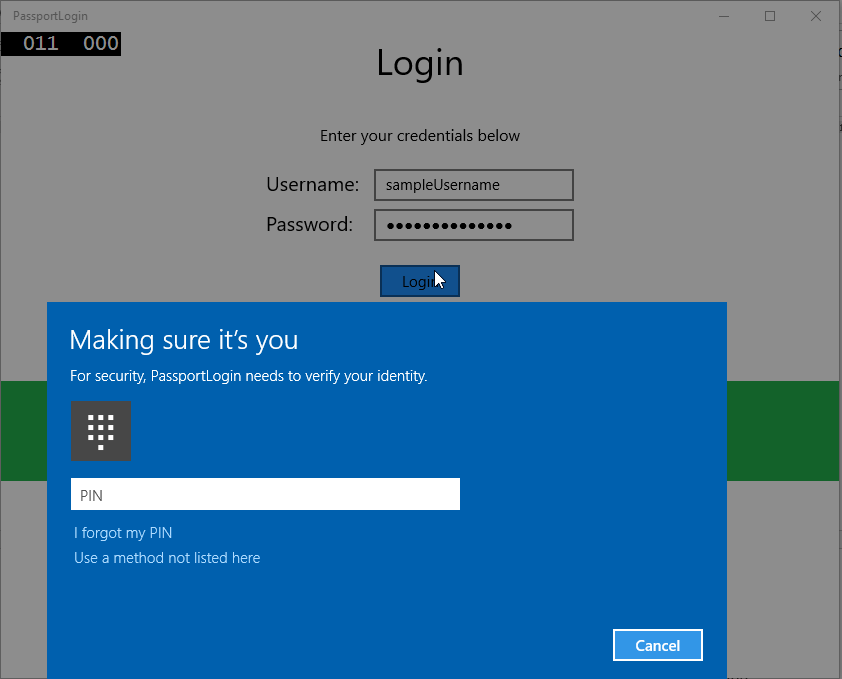
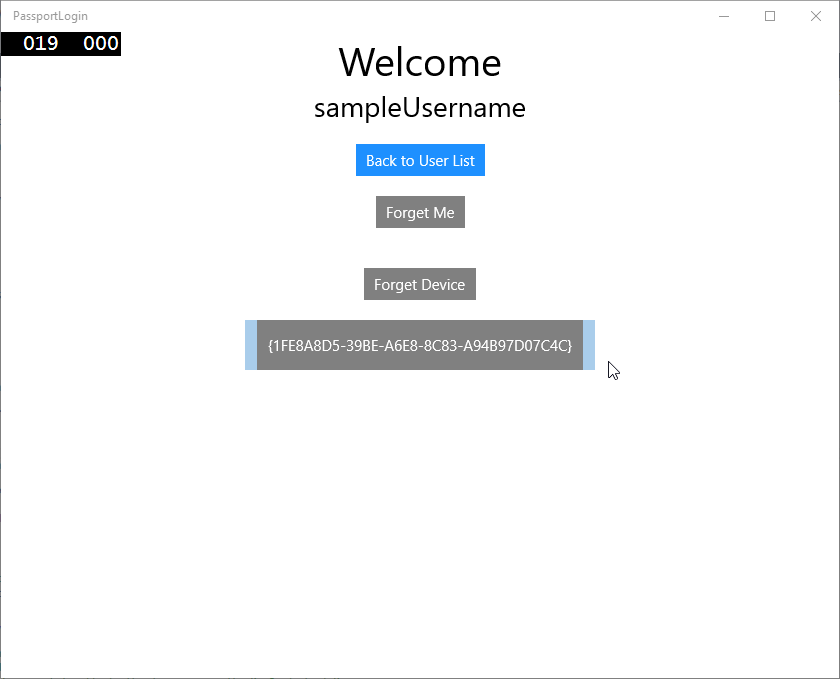

# <a name="create-a-windows-hello-login-service"></a>Criar um serviço de logon do Windows Hello


\[ Atualizado para apps UWP no Windows 10. Para ler artigos sobre o Windows 8.x, consulte o [arquivo](http://go.microsoft.com/fwlink/p/?linkid=619132) \]


\[Algumas informações dizem respeito a produtos de pré-lançamento que poderão ser substancialmente modificados antes do lançamento comercial. A Microsoft não fornece nenhuma garantia, expressa ou implícita, com relação às informações fornecidas aqui.\]

Esta é a Parte 2 de um guia passo a passo completo sobre como usar o Windows Hello como uma alternativa para sistemas tradicionais de autenticação de nome de usuário e senha em apps UWP (Plataforma Universal do Windows) do Windows 10. Este artigo continua de onde a Parte 1, [Aplicativo de logon do Windows Hello](microsoft-passport-login.md), parou e amplia a funcionalidade para demonstrar como você pode integrar o Windows Hello ao seu app atual.

Para criar esse projeto, você precisará de alguma experiência em C# e XAML. Você também precisa estar usando o Visual Studio 2015 (Community Edition ou superior) em um computador com Windows 10.

## <a name="exercise-1-server-side-logic"></a>Exercício 1: Lógica de servidor


Neste exercício, você começará com o app Windows Hello criado no primeiro laboratório, além da criação de um servidor e um banco de dados locais fictícios. Este laboratório prático foi projetado para ensinar como o Windows Hello poderia ser integrado a um sistema existente. Usando um servidor e um banco de dados fictícios, grande parte da configuração não relacionada é eliminada. Em seus próprios apps, você precisará substituir os objetos fictícios por serviços e bancos de dados reais.

-   Para começar, abra a solução PassportLogin do primeiro laboratório prático do Passport.
-   Você começará implementando o servidor e o banco de dados fictícios. Crie uma nova pasta chamada "AuthService". No gerenciador de soluções, clique com o botão direito do mouse na solução "PassportLogin (Universal do Windows)" e selecione Add > New Folder.
-   Crie as classes UserAccount e PassportDevices que agirão como modelos para que os dados sejam salvos no banco de dados fictício. A UserAccount será semelhante ao modelo de usuário implementado em um servidor de autenticação tradicional. Clique com o botão direito do mouse na pasta AuthService e adicione uma nova classe chamada "UserAccount.cs".

    

    

-   Altere a definição de classe para pública e, em seguida, adicione as propriedades públicas seguintes. Você precisará da referência seguinte.

    ```cs
    using System.ComponentModel.DataAnnotations;
     
    namespace PassportLogin.AuthService
    {
        public class UserAccount
        {
            [Key, Required]
            public Guid UserId { get; set; }
            [Required]
            public string Username { get; set; }
            public string Password { get; set; }
            // public List<PassportDevice> PassportDevices = new List<PassportDevice>();
        }
    }
    ```

    Você deve ter notado a lista comentada de PassportDevices. Esta é uma modificação que você precisará fazer em um modelo de usuário existente na sua implementação atual. A lista de PassportDevices conterá uma deviceID, a chave pública criada no Windows Hello e uma [**KeyCredentialAttestationResult**](https://msdn.microsoft.com/library/windows/apps/dn973034). Neste laboratório prático, você precisará implementar a keyAttestationResult, já que ele é fornecida pelo Windows Hello apenas em dispositivos que possuem um chip TPM (Trusted Platform Modules). A **KeyCredentialAttestationResult** é uma combinação de várias propriedades e precisa ser dividida para ser salva e carregada em um banco de dados.

-   Crie uma nova classe na pasta AuthService chamada "PassportDevice.cs". Este é o modelo para os dispositivos do Windows Hello conforme discutido acima. Altere a definição de classe para pública e adicione as propriedades seguintes.

    ```cs
    namespace PassportLogin.AuthService
    {
        public class PassportDevice
        {
            // These are the new variables that will need to be added to the existing UserAccount in the Database
            // The DeviceName is used to support multiple devices for the one user.
            // This way the correct public key is easier to find as a new public key is made for each device.
            // The KeyAttestationResult is only used if the User device has a TPM (Trusted Platform Module) chip, 
            // in most cases it will not. So will be left out for this hands on lab.
            public Guid DeviceId { get; set; }
            public byte[] PublicKey { get; set; }
            // public KeyCredentialAttestationResult KeyAttestationResult { get; set; }
        }
    }
    ```

-   Retorne para UserAccount.cs e remova o comentário da lista de dispositivos do Windows Hello.

    ```cs
    using System.Collections.Generic;
     
    namespace PassportLogin.AuthService
    {
        public class UserAccount
        {
            [Key, Required]
            public Guid UserId { get; set; }
            [Required]
            public string Username { get; set; }
            public string Password { get; set; }
            public List<PassportDevice> PassportDevices = new List<PassportDevice>();
        }
    }
    ```

-   Com o modelo para UserAccount e PassportDevice criado, você precisa criar outra nova classe na pasta AuthService que atuará como o banco de dados fictício. Já que este é um banco de dados fictício de onde você salvará e carregará uma lista de contas de usuário localmente. No mundo real, esta seria sua implementação de banco de dados. Crie uma nova classe na pasta AuthService chamada "MockStore.cs". Altere a definição de classe para pública.
-   Como o repositório fictício salvará e carregará uma lista de contas de usuário localmente, você poderá implementar a lógica para salvar e carregar essa lista usando um XmlSerializer. Você também precisa se lembrar do nome do arquivo e salvar o local. Em MockStore.cs, implemente o seguinte:

```cs
    using System.IO;
    using System.Linq;
    using System.Xml.Serialization;
    using Windows.Storage;

    namespace PassportLogin.AuthService
    {
        public class MockStore
        {
            private const string USER_ACCOUNT_LIST_FILE_NAME = "userAccountsList.txt";
            // This cannot be a const because the LocalFolder is accessed at runtime
            private string _userAccountListPath = Path.Combine(
                ApplicationData.Current.LocalFolder.Path, USER_ACCOUNT_LIST_FILE_NAME);
            private List<UserAccount> _mockDatabaseUserAccountsList;
     
    #region Save and Load Helpers
            /// <summary>
            /// Create and save a useraccount list file. (Replacing the old one)
            /// </summary>
            private async void SaveAccountListAsync()
            {
                string accountsXml = SerializeAccountListToXml();
     
                if (File.Exists(_userAccountListPath))
                {
                    StorageFile accountsFile = await StorageFile.GetFileFromPathAsync(_userAccountListPath);
                    await FileIO.WriteTextAsync(accountsFile, accountsXml);
                }
                else
                {
                    StorageFile accountsFile = await ApplicationData.Current.LocalFolder.CreateFileAsync(USER_ACCOUNT_LIST_FILE_NAME);
                    await FileIO.WriteTextAsync(accountsFile, accountsXml);
                }
            }
     
            /// <summary>
            /// Gets the useraccount list file and deserializes it from XML to a list of useraccount objects.
            /// </summary>
            /// <returns>List of useraccount objects</returns>
            private async void LoadAccountListAsync()
            {
                if (File.Exists(_userAccountListPath))
                {
                    StorageFile accountsFile = await StorageFile.GetFileFromPathAsync(_userAccountListPath);
     
                    string accountsXml = await FileIO.ReadTextAsync(accountsFile);
                    DeserializeXmlToAccountList(accountsXml);
                }
     
                // If the UserAccountList does not contain the sampleUser Initialize the sample users
                // This is only needed as it in a Hand on Lab to demonstrate a user migrating
                // In the real world user accounts would just be in a database
                if (!_mockDatabaseUserAccountsList.Any(f => f.Username.Equals("sampleUsername")))
                {
                    //If the list is empty InitializeSampleAccounts and return the list
                    //InitializeSampleUserAccounts();
                }
            }
     
            /// <summary>
            /// Uses the local list of accounts and returns an XML formatted string representing the list
            /// </summary>
            /// <returns>XML formatted list of accounts</returns>
            private string SerializeAccountListToXml()
            {
                XmlSerializer xmlizer = new XmlSerializer(typeof(List<UserAccount>));
                StringWriter writer = new StringWriter();
                xmlizer.Serialize(writer, _mockDatabaseUserAccountsList);
                return writer.ToString();
            }
     
            /// <summary>
            /// Takes an XML formatted string representing a list of accounts and returns a list object of accounts
            /// </summary>
            /// <param name="listAsXml">XML formatted list of accounts</param>
            /// <returns>List object of accounts</returns>
            private List<UserAccount> DeserializeXmlToAccountList(string listAsXml)
            {
                XmlSerializer xmlizer = new XmlSerializer(typeof(List<UserAccount>));
                TextReader textreader = new StreamReader(new MemoryStream(Encoding.UTF8.GetBytes(listAsXml)));
                return _mockDatabaseUserAccountsList = (xmlizer.Deserialize(textreader)) as List<UserAccount>;
            }
    #endregion
        }
    }
```

-   No método load, você deve ter notado que um método InitializeSampleUserAccounts foi comentado. Você precisará criar esse método no MockStore.cs. Esse método preencherá a lista de contas de usuário para que um logon possa ocorrer. No mundo real, o banco de dados de usuários já estaria preenchido. Nesta etapa você também criará um construtor que inicializará o carregamento de chamadas e da lista de usuários.

    ```cs
    namespace PassportLogin.AuthService
    {
        public class MockStore
        {
            private const string USER_ACCOUNT_LIST_FILE_NAME = "userAccountsList.txt";
            // This cannot be a const because the LocalFolder is accessed at runtime
            private string _userAccountListPath = Path.Combine(
                ApplicationData.Current.LocalFolder.Path, USER_ACCOUNT_LIST_FILE_NAME);
            private List<UserAccount> _mockDatabaseUserAccountsList;
     
            public MockStore()
            {
                _mockDatabaseUserAccountsList = new List& lt; UserAccount & gt; ();
                LoadAccountListAsync();
            }

            private void InitializeSampleUserAccounts()
            {
                // Create a sample Traditional User Account that only has a Username and Password
                // This will be used initially to demonstrate how to migrate to use Windows Hello

                UserAccount sampleUserAccount = new UserAccount()
                {
                    UserId = Guid.NewGuid(),
                    Username = "sampleUsername",
                    Password = "samplePassword",
                };

                // Add the sampleUserAccount to the _mockDatabase
                _mockDatabaseUserAccountsList.Add(sampleUserAccount);
                SaveAccountListAsync();
            }
        }
    }
    ```

-   Agora que o método InitalizeSampleUserAccounts existe, remova o comentário da chamada ao método no método LoadAccountListAsync.

    ```cs
    private async void LoadAccountListAsync()
    {
        if (File.Exists(_userAccountListPath))
        {
            StorageFile accountsFile = await StorageFile.GetFileFromPathAsync(_userAccountListPath);

            string accountsXml = await FileIO.ReadTextAsync(accountsFile);
            DeserializeXmlToAccountList(accountsXml);
        }

        // If the UserAccountList does not contain the sampleUser Initialize the sample users
        // This is only needed as it in a Hand on Lab to demonstrate a user migrating
        // In the real world user accounts would just be in a database
        if (!_mockDatabaseUserAccountsList.Any(f = > f.Username.Equals("sampleUsername")))
                {
            //If the list is empty InitializeSampleAccounts and return the list
            InitializeSampleUserAccounts();
        }
    }
    ```

-   A lista de contas de usuários no repositório fictício agora pode ser salva e carregada. Outras partes do app precisarão ter acesso a essa lista, portanto, será necessário haver alguns métodos para recuperar esses dados. Sob o método InitializeSampleUserAccounts, adicione os métodos get seguintes. Eles permitem que você obtenha uma ID de usuário, um usuário único, uma lista de usuários de um dispositivo específico do Windows Hello e também a chave pública do usuário em um dispositivo específico.

    ```cs
    public Guid GetUserId(string username)
    {
        if (_mockDatabaseUserAccountsList.Any())
        {
            UserAccount account = _mockDatabaseUserAccountsList.FirstOrDefault(f => f.Username.Equals(username));
            if (account != null)
            {
                return account.UserId;
            }
        }
        return Guid.Empty;
    }

    public UserAccount GetUserAccount(Guid userId)
    {
        return _mockDatabaseUserAccountsList.FirstOrDefault(f => f.UserId.Equals(userId));
    }

    public List<UserAccount> GetUserAccountsForDevice(Guid deviceId)
    {
        List<UserAccount> usersForDevice = new List<UserAccount>();

        foreach (UserAccount account in _mockDatabaseUserAccountsList)
        {
            if (account.PassportDevices.Any(f => f.DeviceId.Equals(deviceId)))
            {
                usersForDevice.Add(account);
            }
        }

        return usersForDevice;
    }

    public byte[] GetPublicKey(Guid userId, Guid deviceId)
    {
        UserAccount account = _mockDatabaseUserAccountsList.FirstOrDefault(f => f.UserId.Equals(userId));
        if (account != null)
        {
            if (account.PassportDevices.Any())
            {
                return account.PassportDevices.FirstOrDefault(p => p.DeviceId.Equals(deviceId)).PublicKey;
            }
        }
        return null;
    }
    ```

-   Os próximos métodos a serem implementados manipularão operações simples para adicionar conta, remover conta e remover dispositivo. É necessário remover o dispositivo, pois o Windows Hello é específico do dispositivo. Para cada dispositivo no qual você faz logon, o Windows Hello criará um novo par de chave pública e privada. É como ter uma senha diferente para cada dispositivo em que você entrar, a única diferença é que você não precisa se lembrar de todas essas senhas como o servidor faz. Adicione os métodos seguintes ao MockStore.cs

    ```cs
    public UserAccount AddAccount(string username)
    {
        UserAccount newAccount = null;
        try
        {
            newAccount = new UserAccount()
            {
                UserId = Guid.NewGuid(),
                Username = username,
            };

            _mockDatabaseUserAccountsList.Add(newAccount);
            SaveAccountListAsync();
        }
        catch (Exception)
        {
            throw;
        }
        return newAccount;
    }

    public bool RemoveAccount(Guid userId)
    {
        UserAccount userAccount = GetUserAccount(userId);
        if (userAccount != null)
        {
            _mockDatabaseUserAccountsList.Remove(userAccount);
            SaveAccountListAsync();
            return true;
        }
        return false;
    }

    public bool RemoveDevice(Guid userId, Guid deviceId)
    {
        UserAccount userAccount = GetUserAccount(userId);
        PassportDevice deviceToRemove = null;
        if (userAccount != null)
        {
            foreach (PassportDevice device in userAccount.PassportDevices)
            {
                if (device.DeviceId.Equals(deviceId))
                {
                    deviceToRemove = device;
                    break;
                }
            }
        }

        if (deviceToRemove != null)
        {
            //Remove the PassportDevice
            userAccount.PassportDevices.Remove(deviceToRemove);
            SaveAccountListAsync();
        }

        return true;
    }
    ```

-   Na classe MockStore, adicione um método que adicionará as informações relacionadas ao Windows Hello a uma UserAccount existente. Esse método se chamará PassportUpdateDetails e usará parâmetros para identificar o usuário e os detalhes do Windows Hello. A classe KeyAttestationResult foi comentada durante a criação da PassportDevice. Em um app do mundo real, isso seria obrigatório.

   ```cs
   using Windows.Security.Credentials;

    public void PassportUpdateDetails(Guid userId, Guid deviceId, byte[] publicKey, 
        KeyCredentialAttestationResult keyAttestationResult)
    {
        UserAccount existingUserAccount = GetUserAccount(userId);
        if (existingUserAccount != null)
        {
            if (!existingUserAccount.PassportDevices.Any(f => f.DeviceId.Equals(deviceId)))
            {
                existingUserAccount.PassportDevices.Add(new PassportDevice()
                {
                    DeviceId = deviceId,
                    PublicKey = publicKey,
                    // KeyAttestationResult = keyAttestationResult,
                });
            }
        }
        SaveAccountListAsync();
    }
    ```

-   A classe MockStore agora está concluída. Como representa o banco de dados, ela deve ser considerada privada. Para acessar a MockStore, é necessária uma classe AuthService para manipular os dados do banco de dados. Na pasta AuthService, crie uma nova classe chamada "AuthService.cs". Altere a definição de classe para pública e adicione um padrão de instância singleton para garantir que apenas uma instância seja criada.

    ```cs
    namespace PassportLogin.AuthService
    {
        public class AuthService
        {
            // Singleton instance of the AuthService
            // The AuthService is a mock of what a real world server and service implementation would be
            private static AuthService _instance;
            public static AuthService Instance
            {
                get
                {
                    if (null == _instance)
                    {
                        _instance = new AuthService();
                    }
                    return _instance;
                }
            }

            private AuthService()
            { }
        }
    }
    ```

-   A classe AuthService precisará criar uma instância da classe MockStore e fornecer acesso às propriedades do objeto MockStore.

    ```cs
    namespace PassportLogin.AuthService
    {
        public class AuthService
        {
            //Singleton instance of the AuthService
            //The AuthService is a mock of what a real world server and database implementation would be
            private static AuthService _instance;
            public static AuthService Instance
            {
                get
                {
                    if (null == _instance)
                    {
                        _instance = new AuthService();
                    }
                    return _instance;
                }
            }
     
            private MockStore _mockStore = new MockStore();
     
            public Guid GetUserId(string username)
            {
                return _mockStore.GetUserId(username);
            }
     
            public UserAccount GetUserAccount(Guid userId)
            {
                return _mockStore.GetUserAccount(userId);
            }
     
            public List<UserAccount> GetUserAccountsForDevice(Guid deviceId)
            {
                return _mockStore.GetUserAccountsForDevice(deviceId);
            }
        }
    }
    ```

-   Você precisa que os métodos na classe AuthService acessem, adicionem, removam e atualizem os métodos de detalhes do Passport no objeto MockStore. No final do arquivo da classe AuthService, adicione os métodos seguintes.

    ```cs
    using Windows.Security.Credentials;

    public void Register(string username)
    {
        _mockStore.AddAccount(username);
    }

    public bool PassportRemoveUser(Guid userId)
    {
        return _mockStore.RemoveAccount(userId);
    }

    public bool PassportRemoveDevice(Guid userId, Guid deviceId)
    {
        return _mockStore.RemoveDevice(userId, deviceId);
    }

    public void PassportUpdateDetails(Guid userId, Guid deviceId, byte[] publicKey, 
        KeyCredentialAttestationResult keyAttestationResult)
    {
        _mockStore.PassportUpdateDetails(userId, deviceId, publicKey, keyAttestationResult);
    }
    ```

-   A classe AuthService precisará fornecer um método para validar as credenciais. Esse método pegará um nome de usuário e senha, e garantirá que a conta existe e a senha é válida. Um sistema existente teria um método equivalente a este que verifica se que o usuário está autorizado. Adicione a seguinte ValidateCredentials ao arquivo AuthService.cs.

    ```cs
    public bool ValidateCredentials(string username, string password)
    {
        if (!string.IsNullOrEmpty(username) && !string.IsNullOrEmpty(password))
        {
            // This would be used for existing accounts migrating to use Passport
            Guid userId = GetUserId(username);
            if (userId != Guid.Empty)
            {
                UserAccount account = GetUserAccount(userId);
                if (account != null)
                {
                    if (string.Equals(password, account.Password))
                    {
                        return true;
                    }
                }
            }
        }
        return false;
    }
    ```

-   A classe AuthService precisa de um método de desafio de solicitação que retornará um desafio para o cliente a fim de validar se usuário é quem afirma ser. Em seguida, é necessário um método na classe AuthService para receber o desafio assinado de volta do cliente. Neste laboratório prático, o método de como você determina se o desafio assinado foi concluído ficou incompleto. Cada implementação do Windows Hello em um sistema de autenticação existente será um pouco diferente. A chave pública armazenada no servidor precisa corresponder ao resultado retornado pelo cliente para o servidor. Adicione esses dois métodos ao AuthService.cs.

    ```cs
    using Windows.Security.Cryptography;
    using Windows.Storage.Streams;

    public IBuffer PassportRequestChallenge()
    {
        return CryptographicBuffer.ConvertStringToBinary("ServerChallenge", BinaryStringEncoding.Utf8);
    }

    public bool SendServerSignedChallenge(Guid userId, Guid deviceId, byte[] signedChallenge)
    {
        // Depending on your company polices and procedures this step will be different
        // It is at this point you will need to validate the signedChallenge that is sent back from the client.
        // Validation is used to ensure the correct user is trying to access this account. 
        // The validation process will use the signedChallenge and the stored PublicKey 
        // for the username and the specific device signin is called from.
        // Based on the validation result you will return a bool value to allow access to continue or to block the account.

        // For this sample validation will not happen as a best practice solution does not apply and will need to 
           // be configured for each company.
        // Simply just return true.

        // You could get the User's Public Key with something similar to the following:
        byte[] userPublicKey = _mockStore.GetPublicKey(userId, deviceId);
        return true;
    }
    ```

## <a name="exercise-2-client-side-logic"></a>Exercício 2: Lógica do cliente


Neste exercício, você alterará os modos de exibição e as classes auxiliares do lado do cliente do primeiro laboratório para usar a classe AuthService. No mundo real, a classe AuthService seria o servidor de autenticação e você precisaria usar a API da Web para enviar e receber dados do servidor. Neste laboratório prático, o cliente e o servidor são locais para simplificar. O objetivo é aprender a usar as APIs do Windows Hello.

-   No MainPage.xaml.cs, você pode remover a chamada ao método AccountHelper.LoadAccountListAsync no método carregado, já que a classe AuthService cria uma instância da MockStore que carrega a lista de contas. O método carregado agora deve ter a aparência abaixo. Observe que a definição de método assíncrona é removida, já que nada está em espera.

    ```cs
    private void MainPage_Loaded(object sender, RoutedEventArgs e)
    {
        Frame.Navigate(typeof(UserSelection));
    }
    ```

-   Atualize a interface da página de logon para exigir que um passport seja inserido. Este laboratório prático demonstra como um sistema existente poderia ser migrado para usar o Windows Hello e as contas existentes terem um nome de usuário e uma senha. Atualize também a explicação na parte inferior do XAML para incluir a senha padrão. Atualizar o XAML seguinte no Login.xaml

    ```xml
    <Grid Background="{ThemeResource ApplicationPageBackgroundThemeBrush}">
      <StackPanel Orientation="Vertical">
        <TextBlock Text="Login" FontSize="36" Margin="4" TextAlignment="Center"/>

        <TextBlock x:Name="ErrorMessage" Text="" FontSize="20" Margin="4" Foreground="Red" TextAlignment="Center"/>

        <TextBlock Text="Enter your credentials below" Margin="0,0,0,20"
                   TextWrapping="Wrap" Width="300"
                   TextAlignment="Center" VerticalAlignment="Center" FontSize="16"/>

        <StackPanel Orientation="Horizontal" HorizontalAlignment="Center">
          <!-- Username Input -->
          <TextBlock x:Name="UserNameTextBlock" Text="Username: "
                 FontSize="20" Margin="4" Width="100"/>
          <TextBox x:Name="UsernameTextBox" PlaceholderText="sampleUsername" Width="200" Margin="4"/>
        </StackPanel>

        <StackPanel Orientation="Horizontal" HorizontalAlignment="Center">
          <!-- Password Input -->
          <TextBlock x:Name="PasswordTextBlock" Text="Password: "
                 FontSize="20" Margin="4" Width="100"/>
          <PasswordBox x:Name="PasswordBox" PlaceholderText="samplePassword" Width="200" Margin="4"/>
        </StackPanel>

        <Button x:Name="PassportSignInButton" Content="Login" Background="DodgerBlue" Foreground="White"
            Click="PassportSignInButton_Click" Width="80" HorizontalAlignment="Center" Margin="0,20"/>

        <TextBlock Text="Don't have an account?"
                    TextAlignment="Center" VerticalAlignment="Center" FontSize="16"/>
        <TextBlock x:Name="RegisterButtonTextBlock" Text="Register now"
                   PointerPressed="RegisterButtonTextBlock_OnPointerPressed"
                   Foreground="DodgerBlue"
                   TextAlignment="Center" VerticalAlignment="Center" FontSize="16"/>

        <Border x:Name="PassportStatus" Background="#22B14C"
                   Margin="0,20" Height="100">
          <TextBlock x:Name="PassportStatusText" Text="Windows Hello is ready to use!"
                 Margin="4" TextAlignment="Center" VerticalAlignment="Center" FontSize="20"/>
        </Border>

        <TextBlock x:Name="LoginExplaination" FontSize="24" TextAlignment="Center" TextWrapping="Wrap" 
            Text="Please Note: To demonstrate a login, validation will only occur using the default username 
            'sampleUsername' and default password 'samplePassword'"/>

      </StackPanel>
    </Grid>
    ```

-   No code-behind da classe Login, você precisará alterar a variável particular Account na parte superior da classe para UserAccount. Altere o evento OnNavigateTo para converter o tipo em UserAccount. Você precisará da referência seguinte.

    ```cs
    using PassportLogin.AuthService;

    namespace PassportLogin.Views
    {
        public sealed partial class Login : Page
        {
            private UserAccount _account;
            private bool _isExistingAccount;

            public Login()
            {
                this.InitializeComponent();
            }

            protected override async void OnNavigatedTo(NavigationEventArgs e)
            {
                //Check Windows Hello is setup and available on this machine
                if (await MicrosoftPassportHelper.MicrosoftPassportAvailableCheckAsync())
                {
                    if (e.Parameter != null)
                    {
                        _isExistingAccount = true;
                        //Set the account to the existing account being passed in
                        _account = (UserAccount)e.Parameter;
                        UsernameTextBox.Text = _account.Username;
                        SignInPassport();
                    }
                }
            }
        }
    }
    ```

-   Como a página de logon está usando um objeto UserAccount em vez do objeto Account anterior, o arquivo MicrosoftPassportHelper.cs precisará ser atualizado para usar UserAccount como um parâmetro para alguns métodos. Você precisará alterar os parâmetros seguintes dos métodos CreatePassportKeyAsync, RemovePassportAccountAsync e GetPassportAuthenticationMessageAsync. Como a classe UserAccount tem um Guid para uma ID de usuário, você começará a usar a ID em mais lugares para ser mais específico.

    ```cs
    public static async Task<bool> CreatePassportKeyAsync(Guid userId, string username)
    {
        KeyCredentialRetrievalResult keyCreationResult = await KeyCredentialManager.RequestCreateAsync(username, KeyCredentialCreationOption.ReplaceExisting);
    }

    public static async void RemovePassportAccountAsync(UserAccount account)
    {

    }
    public static async Task<bool> GetPassportAuthenticationMessageAsync(UserAccount account)
    {
        KeyCredentialRetrievalResult openKeyResult = await KeyCredentialManager.OpenAsync(account.Username);
        //Calling OpenAsync will allow the user access to what is available in the app and will not require user credentials again.
        //If you wanted to force the user to sign in again you can use the following:
        //var consentResult = await Windows.Security.Credentials.UI.UserConsentVerifier.RequestVerificationAsync(account.Username);
        //This will ask for the either the password of the currently signed in Microsoft Account or the PIN used for Windows Hello.

        if (openKeyResult.Status == KeyCredentialStatus.Success)
        {
            //If OpenAsync has succeeded, the next thing to think about is whether the client application requires access to backend services.
            //If it does here you would Request a challenge from the Server. The client would sign this challenge and the server
            //would check the signed challenge. If it is correct it would allow the user access to the backend.
            //You would likely make a new method called RequestSignAsync to handle all this
            //e.g. RequestSignAsync(openKeyResult);
            //Refer to the second Windows Hello sample for information on how to do this.

            //For this sample there is not concept of a server implemented so just return true.
            return true;
        }
        else if (openKeyResult.Status == KeyCredentialStatus.NotFound)
        {
            //If the _account is not found at this stage. It could be one of two errors. 
            //1. Windows Hello has been disabled
            //2. Windows Hello has been disabled and re-enabled cause the Windows Hello Key to change.
            //Calling CreatePassportKey and passing through the account will attempt to replace the existing Windows Hello Key for that account.
            //If the error really is that Windows Hello is disabled then the CreatePassportKey method will output that error.
            if (await CreatePassportKeyAsync(account.UserId, account.Username))
            {
                //If the Passport Key was again successfully created, Windows Hello has just been reset.
                //Now that the Passport Key has been reset for the _account retry sign in.
                return await GetPassportAuthenticationMessageAsync(account);
            }
        }

        // Can't use Passport right now, try again later
        return false;
    }
    ```

-   O método SignInPassport no arquivo Login.xaml.cs precisará ser atualizado para usar AuthService em vez de AccountHelper. A validação de credenciais acontecerá por meio da AuthService. Neste laboratório prático, a única conta configurada é "sampleUsername". Essa conta é criada no método InitializeSampleUserAccounts no MockStore.cs. Atualize o método SignInPassport no Login.xaml.cs agora para refletir o trecho de código abaixo.

    ```cs
    private async void SignInPassportAsync()
    {
        if (_isExistingLocalAccount)
        {
            if (await MicrosoftPassportHelper.GetPassportAuthenticationMessageAsync(_account))
            {
                Frame.Navigate(typeof(Welcome), _account);
            }
        }
        else if (AuthService.AuthService.Instance.ValidateCredentials(UsernameTextBox.Text, PasswordBox.Password))
        {
            Guid userId = AuthService.AuthService.Instance.GetUserId(UsernameTextBox.Text);

            if (userId != Guid.Empty)
            {
                //Now that the account exists on server try and create the necessary passport details and add them to the account
                bool isSuccessful = await MicrosoftPassportHelper.CreatePassportKeyAsync(userId, UsernameTextBox.Text);
                if (isSuccessful)
                {
                    Debug.WriteLine("Successfully signed in with Windows Hello!");
                    //Navigate to the Welcome Screen. 
                    _account = AuthService.AuthService.Instance.GetUserAccount(userId);
                    Frame.Navigate(typeof(Welcome), _account);
                }
                else
                {
                    //The passport account creation failed.
                    //Remove the account from the server as passport details were not configured
                    AuthService.AuthService.Instance.PassportRemoveUser(userId);

                    ErrorMessage.Text = "Account Creation Failed";
                }
            }
        }
        else
        {
            ErrorMessage.Text = "Invalid Credentials";
        }
    }
    ```

-   Como o Windows Hello criará um par de chave pública e privada diferente para cada conta em cada dispositivo, a página de boas-vindas precisará exibir uma lista de dispositivos registrados para a conta conectada, e permitir que cada um seja esquecido. Em Welcome.xaml, adicione o seguinte XAML sob ForgetButton. Isso implementará um botão forget device, uma área de texto de erro e uma lista para exibir todos os dispositivos.

    ```xml
    <Grid Background="{ThemeResource ApplicationPageBackgroundThemeBrush}">
      <StackPanel Orientation="Vertical">
        <TextBlock x:Name="Title" Text="Welcome" FontSize="40" TextAlignment="Center"/>
        <TextBlock x:Name="UserNameText" FontSize="28" TextAlignment="Center" Foreground="Black"/>

        <Button x:Name="BackToUserListButton" Content="Back to User List" Click="Button_Restart_Click"
               HorizontalAlignment="Center" Margin="0,20" Foreground="White" Background="DodgerBlue"/>

        <Button x:Name="ForgetButton" Content="Forget Me" Click="Button_Forget_User_Click"
               Foreground="White"
               Background="Gray"
               HorizontalAlignment="Center"/>

        <Button x:Name="ForgetDeviceButton" Content="Forget Device" Click="Button_Forget_Device_Click"
               Foreground="White"
               Background="Gray"
               Margin="0,40,0,20"
               HorizontalAlignment="Center"/>

        <TextBlock x:Name="ForgetDeviceErrorTextBlock" Text="Select a device first"
                  TextWrapping="Wrap" Width="300" Foreground="Red"
                  TextAlignment="Center" VerticalAlignment="Center" FontSize="16" Visibility="Collapsed"/>

        <ListView x:Name="UserListView" MaxHeight="500" MinWidth="350" Width="350" HorizontalAlignment="Center">
          <ListView.ItemTemplate>
            <DataTemplate>
              <Grid Background="Gray" Height="50" Width="350" HorizontalAlignment="Center" VerticalAlignment="Stretch" >
                <TextBlock Text="{Binding DeviceId}" HorizontalAlignment="Center" TextAlignment="Center" VerticalAlignment="Center"
                          Foreground="White"/>
              </Grid>
            </DataTemplate>
          </ListView.ItemTemplate>
        </ListView>
      </StackPanel>
    </Grid>
    ```

-   No arquivo Welcome.xaml.cs, você precisará alterar a variável particular Account na parte superior da classe para uma variável UserAccount particular. Em seguida, atualize o método OnNavigatedTo para usar AuthService e recuperar informações da conta atual. Quando tiver as informações da conta, você poderá definir o itemsource da lista para exibir os dispositivos. Você precisará adicionar uma referência ao namespace AuthService.

   ```cs
   using PassportLogin.AuthService;

    namespace PassportLogin.Views
    {
        public sealed partial class Welcome : Page
        {
            private UserAccount _activeAccount;

            public Welcome()
            {
                InitializeComponent();
            }

            protected override void OnNavigatedTo(NavigationEventArgs e)
            {
                _activeAccount = (UserAccount)e.Parameter;
                if (_activeAccount != null)
                {
                    UserAccount account = AuthService.AuthService.Instance.GetUserAccount(_activeAccount.UserId);
                    if (account != null)
                    {
                        UserListView.ItemsSource = account.PassportDevices;
                        UserNameText.Text = account.Username;
                    }
                }
            }
        }
    }
    ```

-   Como você usará AuthService ao remover uma conta, a referência a AccountHelper no método Button\_Forget\_User\_Click pode ser removida. O método agora deve ter a aparência abaixo.

    ```cs
    private void Button_Forget_User_Click(object sender, RoutedEventArgs e)
    {
        //Remove it from Windows Hello
        MicrosoftPassportHelper.RemovePassportAccountAsync(_activeAccount);

        Debug.WriteLine("User " + _activeAccount.Username + " deleted.");

        //Navigate back to UserSelection page.
        Frame.Navigate(typeof(UserSelection));
    }
    ```

-   O método MicrosoftPassportHelper não está usando AuthService para remover a conta. Você precisa fazer uma chamada para AuthService e passar a ID de usuário.

    ```cs
    public static async void RemovePassportAccountAsync(UserAccount account)
    {
        //Open the account with Windows Hello
        KeyCredentialRetrievalResult keyOpenResult = await KeyCredentialManager.OpenAsync(account.Username);

        if (keyOpenResult.Status == KeyCredentialStatus.Success)
        {
            // In the real world you would send key information to server to unregister
            AuthService.AuthService.Instance.PassportRemoveUser(account.UserId);
        }

        //Then delete the account from the machines list of Passport Accounts
        await KeyCredentialManager.DeleteAsync(account.Username);
    }
    ```

-   Antes de concluir a implementação da classe Welcome page, você precisa criar um método no arquivo MicrosoftPassportHelper.cs que permitirá que um dispositivo seja removido. Crie um novo método que chamará PassportRemoveDevice na AuthService.

   ```cs
   public static void RemovePassportDevice(UserAccount account, Guid deviceId)
    {
        AuthService.AuthService.Instance.PassportRemoveDevice(account.UserId, deviceId);
    }
    ```

-   No Welcome.xaml.cs, implemente o evento click Forget Device. Ele usará o dispositivo selecionado na lista de dispositivos e o auxiliar do passport para chamar remover dispositivo.

    ```cs
    private void Button_Forget_Device_Click(object sender, RoutedEventArgs e)
    {
        PassportDevice selectedDevice = UserListView.SelectedItem as PassportDevice;
        if (selectedDevice != null)
        {
            //Remove it from Windows Hello
            MicrosoftPassportHelper.RemovePassportDevice(_activeAccount, selectedDevice.DeviceId);

            Debug.WriteLine("User " + _activeAccount.Username + " deleted.");

            if (!UserListView.Items.Any())
            {
                //Navigate back to UserSelection page.
                Frame.Navigate(typeof(UserSelection));
            }
        }
        else
        {
            ForgetDeviceErrorTextBlock.Visibility = Visibility.Visible;
        }
    }
    ```

-   A próxima página que você atualizará é a UserSelection. A página UserSelection precisará usar AuthService para recuperar todas as contas de usuário do dispositivo atual. No momento, não é possível passar uma ID de dispositivo para AuthService de forma que as contas do usuário sejam retornadas para esse dispositivo. Na pasta Utils, crie uma nova classe chamada "Helpers.cs". Altere a definição de classe para estática pública e, em seguida, adicione o método seguinte que permitirá que você recupere a ID do dispositivo atual.

    ```cs
    using Windows.Security.ExchangeActiveSyncProvisioning;

    namespace PassportLogin.Utils
    {
        public static class Helpers
        {
            public static Guid GetDeviceId()
            {
                //Get the Device ID to pass to the server
                EasClientDeviceInformation deviceInformation = new EasClientDeviceInformation();
                return deviceInformation.Id;
            }
        }
    }
    ```

-   Na classe da página UserSelection, apenas o code-behind precisa ser alterado, não a interface do usuário. Em UserSelection.xaml.cs, atualize o método carregado e o método de seleção do usuário para usar a classe UserAccount em vez da classe Account. Você também precisará obter todos os usuários desse dispositivo via AuthService.

    ```cs
    using System.Linq;
    using PassportLogin.AuthService;

    namespace PassportLogin.Views
    {
        public sealed partial class UserSelection : Page
        {
            public UserSelection()
            {
                InitializeComponent();
                Loaded += UserSelection_Loaded;
            }

            private void UserSelection_Loaded(object sender, RoutedEventArgs e)
            {
                List<UserAccount> accounts = AuthService.AuthService.Instance.GetUserAccountsForDevice(Helpers.GetDeviceId());

                if (accounts.Any())
                {
                    UserListView.ItemsSource = accounts;
                    UserListView.SelectionChanged += UserSelectionChanged;
                }
                else
                {
                    //If there are no accounts navigate to the LoginPage
                    Frame.Navigate(typeof(Login));
                }
            }

            /// <summary>
            /// Function called when an account is selected in the list of accounts
            /// Navigates to the Login page and passes the chosen account
            /// </summary>
            private void UserSelectionChanged(object sender, RoutedEventArgs e)
            {
                if (((ListView)sender).SelectedValue != null)
                {
                    UserAccount account = (UserAccount)((ListView)sender).SelectedValue;
                    if (account != null)
                    {
                        Debug.WriteLine("Account " + account.Username + " selected!");
                    }
                    Frame.Navigate(typeof(Login), account);
                }
            }
        }
    }
    ```

-   A página PassportRegister precisa atualizar o code-behind; a interface do usuário não precisa mudar. Em PassportRegister.xaml.cs, remova a variável particular Account na parte superior da classe, já que ela não é mais necessária. Atualize o evento click RegisterButton para usar AuthService. Esse método criará uma nova UserAccount e, em seguida, atualizará os detalhes do passport. Se o passport não conseguir criar uma chave de passport, a conta será removida, já que o processo de registro falhou.

    ```cs
    private async void RegisterButton_Click_Async(object sender, RoutedEventArgs e)
    {
        ErrorMessage.Text = "";

        //Validate entered credentials are acceptable
        if (!string.IsNullOrEmpty(UsernameTextBox.Text))
        {
            //Register an Account on the AuthService so that we can get back a userId
            AuthService.AuthService.Instance.Register(UsernameTextBox.Text);
            Guid userId = AuthService.AuthService.Instance.GetUserId(UsernameTextBox.Text);

            if (userId != Guid.Empty)
            {
                //Now that the account exists on server try and create the necessary passport details and add them to the account
                bool isSuccessful = await MicrosoftPassportHelper.CreatePassportKeyAsync(userId, UsernameTextBox.Text);
                if (isSuccessful)
                {
                    //Navigate to the Welcome Screen. 
                    Frame.Navigate(typeof(Welcome), AuthService.AuthService.Instance.GetUserAccount(userId));
                }
                else
                {
                    //The passport account creation failed.
                    //Remove the account from the server as passport details were not configured
                    AuthService.AuthService.Instance.PassportRemoveUser(userId);

                    ErrorMessage.Text = "Account Creation Failed";
                }
            }
        }
        else
        {
            ErrorMessage.Text = "Please enter a username";
        }
    }
    ```

-   Compile e execute o app (F5). Entre na conta de usuário de exemplo, com as credenciais "sampleUsername" e "samplePassword". Na tela de boas-vindas, você pode observar que o botão Forget devices é exibido, mas não há dispositivos. Quando você está criando ou migrando um usuário para trabalhar com o Windows Hello, as informações do Passport não são enviadas para a AuthService.

    

    

-   Para obter as informações do passport para a AuthService, é necessário atualizar o MicrosoftPassportHelper.cs. No método CreatePassportKeyAsync, em vez de apenas retornar verdadeiro caso ele seja bem-sucedido, você precisará chamar um novo método que tentará obter o KeyAttestation. Embora este laboratório prático não esteja registrando essas informações na AuthService, você aprenderá como obter essas informações no lado do cliente. Atualize o método CreatePassportKeyAsync.

    ```cs
    public static async Task<bool> CreatePassportKeyAsync(Guid userId, string username)
    {
        KeyCredentialRetrievalResult keyCreationResult = await KeyCredentialManager.RequestCreateAsync(username, KeyCredentialCreationOption.ReplaceExisting);

        switch (keyCreationResult.Status)
        {
            case KeyCredentialStatus.Success:
                Debug.WriteLine("Successfully made key");
                await GetKeyAttestationAsync(userId, keyCreationResult);
                return true;
            case KeyCredentialStatus.UserCanceled:
                Debug.WriteLine("User cancelled sign-in process.");
                break;
            case KeyCredentialStatus.NotFound:
                // User needs to setup Windows Hello
                Debug.WriteLine("Windows Hello is not setup!\nPlease go to Windows Settings and set up a PIN to use it.");
                break;
            default:
                break;
        }

        return false;
    }
    ```

-   Crie o método GetKeyAttestationAsync em MicrosoftPassportHelper.cs. Esse método demonstrará como obter todas as informações necessárias que podem ser fornecidas pelo Windows Hello para cada conta em um dispositivo específico.

    ```cs
    using Windows.Storage.Streams;

    private static async Task GetKeyAttestationAsync(Guid userId, KeyCredentialRetrievalResult keyCreationResult)
    {
        KeyCredential userKey = keyCreationResult.Credential;
        IBuffer publicKey = userKey.RetrievePublicKey();
        KeyCredentialAttestationResult keyAttestationResult = await userKey.GetAttestationAsync();
        IBuffer keyAttestation = null;
        IBuffer certificateChain = null;
        bool keyAttestationIncluded = false;
        bool keyAttestationCanBeRetrievedLater = false;
        KeyCredentialAttestationStatus keyAttestationRetryType = 0;

        if (keyAttestationResult.Status == KeyCredentialAttestationStatus.Success)
        {
            keyAttestationIncluded = true;
            keyAttestation = keyAttestationResult.AttestationBuffer;
            certificateChain = keyAttestationResult.CertificateChainBuffer;
            Debug.WriteLine("Successfully made key and attestation");
        }
        else if (keyAttestationResult.Status == KeyCredentialAttestationStatus.TemporaryFailure)
        {
            keyAttestationRetryType = KeyCredentialAttestationStatus.TemporaryFailure;
            keyAttestationCanBeRetrievedLater = true;
            Debug.WriteLine("Successfully made key but not attestation");
        }
        else if (keyAttestationResult.Status == KeyCredentialAttestationStatus.NotSupported)
        {
            keyAttestationRetryType = KeyCredentialAttestationStatus.NotSupported;
            keyAttestationCanBeRetrievedLater = false;
            Debug.WriteLine("Key created, but key attestation not supported");
        }

        Guid deviceId = Helpers.GetDeviceId();
        //Update the Pasport details with the information we have just gotten above.
        //UpdatePassportDetails(userId, deviceId, publicKey.ToArray(), keyAttestationResult);
    }
    ```

-   Você deve ter notado no método GetKeyAttestationAsync que acabou de ser adicionado que a última linha foi comentada. Essa última linha será um novo método que você criará para enviar todas as informações do Windows Hello para a AuthService. No mundo real, você precisaria enviá-lo para um servidor real com uma API da Web.

    ```cs
    using System.Runtime.InteropServices.WindowsRuntime;

    public static bool UpdatePassportDetails(Guid userId, Guid deviceId, byte[] publicKey, KeyCredentialAttestationResult keyAttestationResult)
    {
        //In the real world you would use an API to add Passport signing info to server for the signed in _account.
        //For this tutorial we do not implement a WebAPI for our server and simply mock the server locally 
        //The CreatePassportKey method handles adding the Windows Hello account locally to the device using the KeyCredential Manager

        //Using the userId the existing account should be found and updated.
        AuthService.AuthService.Instance.PassportUpdateDetails(userId, deviceId, publicKey, keyAttestationResult);
        return true;
    }
    ```

-   Remova o comentário da última linha no método GetKeyAttestationAsync para que as informações do Windows Hello sejam enviadas para a AuthService.
-   Compile e execute o app e entre com as credenciais padrão como antes. Na tela de boas-vindas, agora você verá que a ID do dispositivo é exibida. Se você tiver se conectado em outro dispositivo, ele também apareceria aqui (se você tivesse um serviço de autenticação hospedado na nuvem). Neste laboratório prático, a ID do dispositivo real está sendo exibida. Em uma implementação real, você desejaria exibir um nome amigável que uma pessoa poderia entender e usar para determinar cada dispositivo.

    

-   21. Para concluir este laboratório prático, você precisa de uma solicitação e de um desafio para o usuário quando ele selecionar na página de seleção do usuário e entrar novamente. A AuthService tem dois métodos que você criou para solicitar um desafio, um deles usa um desafio assinado. No MicrosoftPassportHelper.cs, crie um novo método chamado "RequestSignAsync". Isso solicitará um desafio da AuthService. Assine localmente esse desfaio usando uma API do Passport e envie o desafio assinado para a AuthService. Neste laboratório prático, a AuthService receberá o desafio assinado e retornará verdadeiro. Em uma implementação real, você precisaria implementar um mecanismo de verificação para determinar se o desafio foi assinado pelo usuário certo no dispositivo correto. Adicione o método a seguir ao MicrosoftPassportHelper.cs

    ```cs
    private static async Task<bool> RequestSignAsync(Guid userId, KeyCredentialRetrievalResult openKeyResult)
    {
        // Calling userKey.RequestSignAsync() prompts the uses to enter the PIN or use Biometrics (Windows Hello).
        // The app would use the private key from the user account to sign the sign-in request (challenge)
        // The client would then send it back to the server and await the servers response.
        IBuffer challengeMessage = AuthService.AuthService.Instance.PassportRequestChallenge();
        KeyCredential userKey = openKeyResult.Credential;
        KeyCredentialOperationResult signResult = await userKey.RequestSignAsync(challengeMessage);

        if (signResult.Status == KeyCredentialStatus.Success)
        {
            // If the challenge from the server is signed successfully
            // send the signed challenge back to the server and await the servers response
            return AuthService.AuthService.Instance.SendServerSignedChallenge(
                userId, Helpers.GetDeviceId(), signResult.Result.ToArray());
        }
        else if (signResult.Status == KeyCredentialStatus.UserCanceled)
        {
            // User cancelled the Windows Hello PIN entry.
        }
        else if (signResult.Status == KeyCredentialStatus.NotFound)
        {
            // Must recreate Windows Hello key
        }
        else if (signResult.Status == KeyCredentialStatus.SecurityDeviceLocked)
        {
            // Can't use Windows Hello right now, remember that hardware failed and suggest restart
        }
        else if (signResult.Status == KeyCredentialStatus.UnknownError)
        {
            // Can't use Windows Hello right now, try again later
        }

        return false;
    }
    ```

-   22. Na classe MicrosoftPassportHelper, chame o método RequestSignAsync a partir do método GetPassportAuthenticationMessageAsync.

    ```cs
    public static async Task<bool> GetPassportAuthenticationMessageAsync(UserAccount account)
    {
        KeyCredentialRetrievalResult openKeyResult = await KeyCredentialManager.OpenAsync(account.Username);
        // Calling OpenAsync will allow the user access to what is available in the app and will not require user credentials again.
        // If you wanted to force the user to sign in again you can use the following:
        // var consentResult = await Windows.Security.Credentials.UI.UserConsentVerifier.RequestVerificationAsync(account.Username);
        // This will ask for the either the password of the currently signed in Microsoft Account or the PIN used for Windows Hello.

        if (openKeyResult.Status == KeyCredentialStatus.Success)
        {
            //If OpenAsync has succeeded, the next thing to think about is whether the client application requires access to backend services.
            //If it does here you would Request a challenge from the Server. The client would sign this challenge and the server
            //would check the signed challenge. If it is correct it would allow the user access to the backend.
            //You would likely make a new method called RequestSignAsync to handle all this
            //e.g. RequestSignAsync(openKeyResult);
            //Refer to the second Windows Hello sample for information on how to do this.

            return await RequestSignAsync(account.UserId, openKeyResult);
        }
        else if (openKeyResult.Status == KeyCredentialStatus.NotFound)
        {
            //If the _account is not found at this stage. It could be one of two errors. 
            //1. Windows Hello has been disabled
            //2. Windows Hello has been disabled and re-enabled cause the Windows Hello Key to change.
            //Calling CreatePassportKey and passing through the account will attempt to replace the existing Windows Hello Key for that account.
            //If the error really is that Windows Hello is disabled then the CreatePassportKey method will output that error.
            if (await CreatePassportKeyAsync(account.UserId, account.Username))
            {
                //If the Passport Key was again successfully created, Windows Hello has just been reset.
                //Now that the Passport Key has been reset for the _account retry sign in.
                return await GetPassportAuthenticationMessageAsync(account);
            }
        }

        // Can't use Windows Hello right now, try again later
        return false;
    }
    ```

-   Durante este exercício, você atualizou o app do lado do cliente para usar a AuthService. Ao fazer isso, você conseguiu eliminar a necessidade da classe Account e da classe AccountHelper. Exclua a classe Account, a pasta Models e a classe AccountHelper na pasta Utils. Você precisará remover todas as referências ao namespace Models em todo o app para que a solução seja compilada com êxito.
-   Compile e execute o app, e divirta-se usando o Windows Hello com o serviço e o banco de dados fictícios.

Neste laboratório prático, você aprendeu a usar as APIs do Windows Hello para substituir as senhas ao usar autenticação em um computador com Windows 10. Quando você pensa na quantidade de energia que as pessoas gastam mantendo senhas e dando suporte a senhas perdidas nos sistemas existentes, você deve ver a vantagem de mudar para esse novo sistema de autenticação chamado Windows Hello.

Deixamos para você como um exercício os detalhes de como implementar a autenticação no lado do serviço e no lado do servidor. Espera-se que a maioria de vocês tenha sistemas que devem ser migrados para começar a trabalhar com o Windows Hello e os detalhes de cada sistema serão diferentes.

## <a name="related-topics"></a>Tópicos relacionados

* [Windows Hello](microsoft-passport.md)
* [Aplicativo de logon do Windows Hello](microsoft-passport-login.md)
