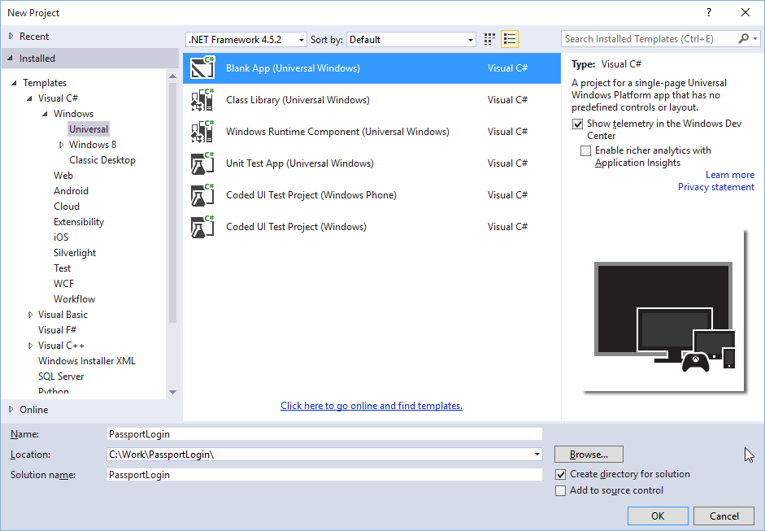
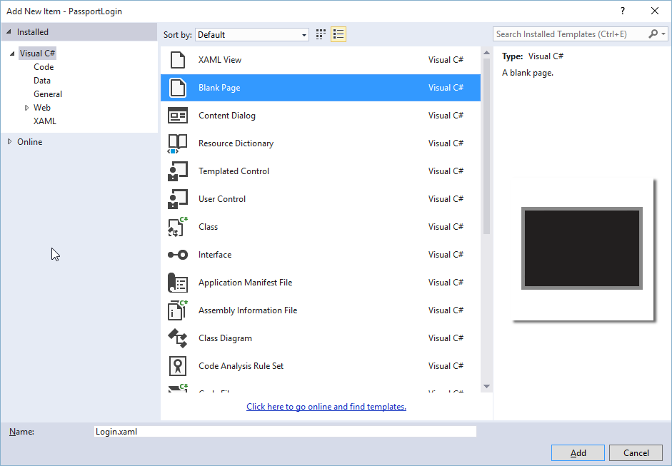
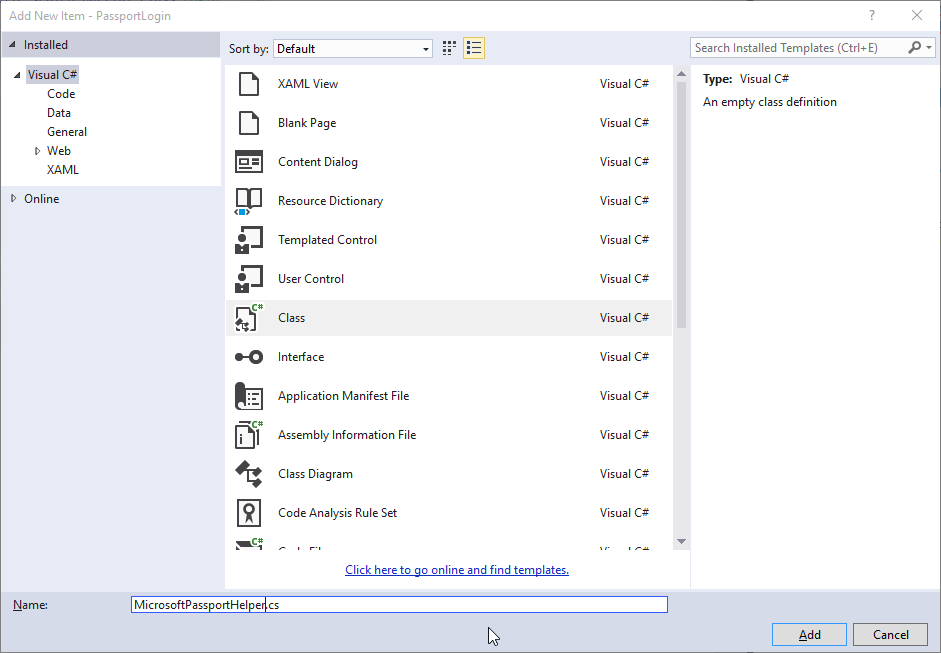

# <a name="create-a-windows-hello-login-app"></a>Criar um app de logon do Windows Hello

Esta é a Parte 1 de um guia passo a passo completo sobre como criar um app UWP (Plataforma Universal do Windows) do Windows 10 que usa o Windows Hello como uma alternativa para sistemas tradicionais de autenticação de nome de usuário e senha. O app usa um nome de usuário para entrar e criar uma Chave de Hello para cada conta. Essas contas serão protegidas pelo PIN definido nas Configurações do Windows na configuração do Windows Hello.

Este guia passo a passo é dividido em duas partes: a criação do app e a conexão ao serviço back-end. Quando você terminar este artigo, continue na Parte 2: [Serviço de logon do Windows Hello](microsoft-passport-login-auth-service.md).

Antes de começar, você deve ler a visão geral do [Windows Hello](microsoft-passport.md) para ter uma compreensão geral de como funciona o Windows Hello.

## <a name="get-started"></a>Introdução


Para criar esse projeto, você precisará de alguma experiência em C# e XAML. Você também precisará ser usando o Visual Studio 2015 (Community Edition ou superior), ou uma versão posterior do Visual Studio, em um computador Windows 10. Embora o Visual Studio 2015 é a versão mínima necessária, recomendamos que você use a versão mais recente do Visual Studio para as últimas atualizações de segurança e de desenvolvedor.

-   Abra o Visual Studio e selecione File > New > Project.
-   Isso abrirá uma janela "New Project". Navegação para Templates > Visual C#.
-   Escolha o aplicativo em branco (Windows Universal) e nomeie seu aplicativo "PassportLogin".
-   Compile e execute o novo aplicativo (F5); você deve ver uma janela em branco na tela. Feche o app.



## <a name="exercise-1-login-with-microsoft-passport"></a>Exercício 1: Logon com o Microsoft Passport


Neste exercício, você aprenderá como verificar se o Windows Hello está configurado no computador e como entrar em uma conta usando o Windows Hello.

-   No novo projeto, crie uma nova pasta na solução chamada "Views". Esta pasta conterá as páginas que serão navegadas neste exemplo. Clique com o botão direito do mouse no projeto no Gerenciador de Soluções, selecione Add > New Folder e, em seguida, renomeie a pasta para Views.

    

-   Clique com o botão direito do mouse na pasta Views, selecione Add > New Item e selecione Blank Page. Nomeie essa página "Login.xaml".

    

-   Para definir a interface do usuário para a nova página de logon, adicione o seguinte XAML. Este XAML define um StackPanel para alinhar os seguintes filhos:

    -   TextBlock que conterá um título.
    -   TextBlock para mensagens de erro.
    -   TextBox para o nome de usuário de entrada.
    -   Botão para navegar até uma página de registro.
    -   TextBlock para conter o status do Windows Hello.
    -   TextBlock para explicar a página de logon, já que não há back-end ou usuários configurados.

    ```xml
    <Grid Background="{ThemeResource ApplicationPageBackgroundThemeBrush}">
      <StackPanel Orientation="Vertical">
        <TextBlock Text="Login" FontSize="36" Margin="4" TextAlignment="Center"/>
        <TextBlock x:Name="ErrorMessage" Text="" FontSize="20" Margin="4" Foreground="Red" TextAlignment="Center"/>
        <TextBlock Text="Enter your username below" Margin="0,0,0,20"
                   TextWrapping="Wrap" Width="300"
                   TextAlignment="Center" VerticalAlignment="Center" FontSize="16"/>
        <TextBox x:Name="UsernameTextBox" Margin="4" Width="250"/>
        <Button x:Name="PassportSignInButton" Content="Login" Background="DodgerBlue" Foreground="White"
            Click="PassportSignInButton_Click" Width="80" HorizontalAlignment="Center" Margin="0,20"/>
        <TextBlock Text="Don't have an account?"
                    TextAlignment="Center" VerticalAlignment="Center" FontSize="16"/>
        <TextBlock x:Name="RegisterButtonTextBlock" Text="Register now"
                   PointerPressed="RegisterButtonTextBlock_OnPointerPressed"
                   Foreground="DodgerBlue"
                   TextAlignment="Center" VerticalAlignment="Center" FontSize="16"/>
        <Border x:Name="PassportStatus" Background="#22B14C"
                   Margin="0,20" Height="100" >
          <TextBlock x:Name="PassportStatusText" Text="Microsoft Passport is ready to use!"
                 Margin="4" TextAlignment="Center" VerticalAlignment="Center" FontSize="20"/>
        </Border>
        <TextBlock x:Name="LoginExplaination" FontSize="24" TextAlignment="Center" TextWrapping="Wrap" 
            Text="Please Note: To demonstrate a login, validation will only occur using the default username 'sampleUsername'"/>
      </StackPanel>
    </Grid>
    ```

-   Alguns métodos precisam ser adicionadas ao code-behind para que a solução seja criada. Pressione F7 ou use o Gerenciador de Soluções para acessar o Login.xaml.cs. Adicione os seguintes métodos de dois eventos para manipular os eventos de logon e registrar. Por enquanto, esses métodos definirão o ErrorMessage.Text como uma cadeia de caracteres vazia.

    ```cs
    namespace PassportLogin.Views
    {
        public sealed partial class Login : Page
        {
            public Login()
            {
                this.InitializeComponent();
            }
     
            private void PassportSignInButton_Click(object sender, RoutedEventArgs e)
            {
                ErrorMessage.Text = "";
            }
            private void RegisterButtonTextBlock_OnPointerPressed(object sender, PointerRoutedEventArgs e)
            {
                ErrorMessage.Text = "";
            }
        }
    }
    ```

-   Para renderizar a página de logon, edite o código de MainPage para navegar para a página de logon quando a MainPage é carregada. Abra o arquivo MainPage.xaml.cs. No Gerenciador de Soluções, clique duas vezes em MainPage.xaml.cs. Se você não conseguir encontrá-lo, clique na pequena seta ao lado de MainPage.xaml para mostrar o code-behind. Crie um método de manipulador de eventos carregado que navegará para a página de logon. Você precisará adicionar uma referência ao namespace Views.

    ```cs
    using PassportLogin.Views;
     
    namespace PassportLogin
    {
        public sealed partial class MainPage : Page
        {
            public MainPage()
            {
                this.InitializeComponent();
                Loaded += MainPage_Loaded;
            }
     
            private void MainPage_Loaded(object sender, RoutedEventArgs e)
            {
                Frame.Navigate(typeof(Login));
            }
        }
    }
    ```

-   Na página de logon, você precisa manipular o evento OnNavigatedTo para validar se o Windows Hello está disponível neste computador. Em Login.xaml.cs, implemente o seguinte. Você observará que o objeto MicrosoftPassportHelper sinaliza um erro. Isso é porque ainda não o implementamos.

    ```cs
    public sealed partial class Login : Page
    {
        public Login()
        {
            this.InitializeComponent();
        }
     
        protected override async void OnNavigatedTo(NavigationEventArgs e)
        {
            // Check Microsoft Passport is setup and available on this machine
            if (await MicrosoftPassportHelper.MicrosoftPassportAvailableCheckAsync())
            {
            }
            else
            {
                // Microsoft Passport is not setup so inform the user
                PassportStatus.Background = new SolidColorBrush(Windows.UI.Color.FromArgb(255, 50, 170, 207));
                PassportStatusText.Text = "Microsoft Passport is not setup!\n" + 
                    "Please go to Windows Settings and set up a PIN to use it.";
                PassportSignInButton.IsEnabled = false;
            }
        }
    }
    ```

-   Para criar a classe MicrosoftPassportHelper, clique com o botão direito do mouse na solução PassportLogin (Universal do Windows) e clique em Add > New Folder. Nomeie essa pasta Utils.

    

-   Clique com o botão direito na pasta Utils e clique em Add > Class. Nomeie essa classe "MicrosoftPassportHelper.cs".
-   Altere a definição de classe de MicrosoftPassportHelper para público estático, em seguida, adicione o método seguinte para informar ao usuário se o Windows Hello está pronto para ser usado ou não. Você precisará adicionar os namespaces necessários.

    ```cs
    using System;
    using System.Diagnostics;
    using System.Threading.Tasks;
    using Windows.Security.Credentials;
     
    namespace PassportLogin.Utils
    {
        public static class MicrosoftPassportHelper
        {
            /// <summary>
            /// Checks to see if Passport is ready to be used.
            /// 
            /// Passport has dependencies on:
            ///     1. Having a connected Microsoft Account
            ///     2. Having a Windows PIN set up for that _account on the local machine
            /// </summary>
            public static async Task<bool> MicrosoftPassportAvailableCheckAsync()
            {
                bool keyCredentialAvailable = await KeyCredentialManager.IsSupportedAsync();
                if (keyCredentialAvailable == false)
                {
                    // Key credential is not enabled yet as user 
                    // needs to connect to a Microsoft Account and select a PIN in the connecting flow.
                    Debug.WriteLine("Microsoft Passport is not setup!\nPlease go to Windows Settings and set up a PIN to use it.");
                    return false;
                }
     
                return true;
            }
        }
    }
    ```

-   No Login.xaml.cs, adicione uma referência ao namespace Utils. Isso resolver[a o erro no método OnNavigatedTo.

    ```cs
    using PassportLogin.Utils;
    ```

-   Compile e execute o app (F5). Você será direcionado para a página de logon e a faixa do Windows Hello indicará para você se o Hello está pronto para ser usado. Você deve ver a faixa verde ou azul que indica o status do Windows Hello no computador.

    

    

-   A próxima coisa que você precisa fazer é compilar a lógica para entrar. Crie uma nova pasta chamada "Models".
-   Na pasta Models, crie uma nova classe chamada "Account.cs". Essa classe vai atuar como seu modelo de conta. Como este é um exemplo, ele conterá apenas um nome de usuário. Altere a definição de classe para público e adicione a propriedade Username.
    
    ```cs
    namespace PassportLogin.Models
    {
        public class Account
        {
            public string Username { get; set; }
        }
    }
    ```

-   Você precisará de uma maneira de lidar com contas. Para este laboratório prático, como não há servidor ou um banco de dados, uma lista de usuários será salva e carregada localmente. Clique com o botão direito do mouse na pasta Utils e adicione uma nova classe chamada "AccountHelper.cs". Altere a definição de classe para estática pública. A AccountHelper é uma classe estática que conterá todos os métodos necessários para salvar e carregar a lista de contas localmente. Salvar e carregar funcionarão usando um XmlSerializer. Você também precisará se lembrar do arquivo salvo e onde você o salvou. Namespaces adicionais precisarão ser referenciados.
    
    ```cs
    using System.IO;
    using System.Xml.Serialization;
    using Windows.Storage;
    using PassportLogin.Models;

    namespace PassportLogin.Utils
    {
        public static class AccountHelper
        {
            // In the real world this would not be needed as there would be a server implemented that would host a user account database.
            // For this tutorial we will just be storing accounts locally.
            private const string USER_ACCOUNT_LIST_FILE_NAME = "accountlist.txt";
            private static string _accountListPath = Path.Combine(ApplicationData.Current.LocalFolder.Path, USER_ACCOUNT_LIST_FILE_NAME);
            public static List<Account> AccountList = new List<Account>();
     
            /// <summary>
            /// Create and save a useraccount list file. (Updating the old one)
            /// </summary>
            private static async void SaveAccountListAsync()
            {
                string accountsXml = SerializeAccountListToXml();
     
                if (File.Exists(_accountListPath))
                {
                    StorageFile accountsFile = await StorageFile.GetFileFromPathAsync(_accountListPath);
                    await FileIO.WriteTextAsync(accountsFile, accountsXml);
                }
                else
                {
                    StorageFile accountsFile = await ApplicationData.Current.LocalFolder.CreateFileAsync(USER_ACCOUNT_LIST_FILE_NAME);
                    await FileIO.WriteTextAsync(accountsFile, accountsXml);
                }
            }
     
            /// <summary>
            /// Gets the useraccount list file and deserializes it from XML to a list of useraccount objects.
            /// </summary>
            /// <returns>List of useraccount objects</returns>
            public static async Task<List<Account>> LoadAccountListAsync()
            {
                if (File.Exists(_accountListPath))
                {
                    StorageFile accountsFile = await StorageFile.GetFileFromPathAsync(_accountListPath);
     
                    string accountsXml = await FileIO.ReadTextAsync(accountsFile);
                    DeserializeXmlToAccountList(accountsXml);
                }
     
                return AccountList;
            }
     
            /// <summary>
            /// Uses the local list of accounts and returns an XML formatted string representing the list
            /// </summary>
            /// <returns>XML formatted list of accounts</returns>
            public static string SerializeAccountListToXml()
            {
                XmlSerializer xmlizer = new XmlSerializer(typeof(List<Account>));
                StringWriter writer = new StringWriter();
                xmlizer.Serialize(writer, AccountList);
     
                return writer.ToString();
            }
     
            /// <summary>
            /// Takes an XML formatted string representing a list of accounts and returns a list object of accounts
            /// </summary>
            /// <param name="listAsXml">XML formatted list of accounts</param>
            /// <returns>List object of accounts</returns>
            public static List<Account> DeserializeXmlToAccountList(string listAsXml)
            {
                XmlSerializer xmlizer = new XmlSerializer(typeof(List<Account>));
                TextReader textreader = new StreamReader(new MemoryStream(Encoding.UTF8.GetBytes(listAsXml)));
     
                return AccountList = (xmlizer.Deserialize(textreader)) as List<Account>;
            }
        }
    }
    ```

-   Em seguida, implemente uma maneira de adicionar e remover uma conta da lista de locais de contas. Cada uma dessas ações salvará a lista. O método final necessário para este laboratório prático é um método de validação. Como não há um servidor de autenticação ou banco de dados de usuários, a validação será de um único usuário que é embutido em código. Esses métodos devem ser adicionados à classe AccountHelper.
    
    ```cs
    public static Account AddAccount(string username)
            {
                // Create a new account with the username
                Account account = new Account() { Username = username };
                // Add it to the local list of accounts
                AccountList.Add(account);
                // SaveAccountList and return the account
                SaveAccountListAsync();
                return account;
            }
     
            public static void RemoveAccount(Account account)
            {
                // Remove the account from the accounts list
                AccountList.Remove(account);
                // Re save the updated list
                SaveAccountListAsync();
            }
     
            public static bool ValidateAccountCredentials(string username)
            {
                // In the real world, this method would call the server to authenticate that the account exists and is valid.
                // For this tutorial however we will just have a existing sample user that is just "sampleUsername"
                // If the username is null or does not match "sampleUsername" it will fail validation. In which case the user should register a new passport user
     
                if (string.IsNullOrEmpty(username))
                {
                    return false;
                }
     
                if (!string.Equals(username, "sampleUsername"))
                {
                    return false;
                }
     
                return true;
            }
    ```

-   A próxima coisa que você precisa fazer é manipular um sinal na solicitação do usuário. Em Login.xaml.cs, crie uma nova variável particular que conterá a conta atual que está fazendo logon. Em seguida, adicione uma nova chamada de método SignInPassport. Isso validará as credenciais da conta que usam o método AccountHelper.ValidateAccountCredentials. Esse método retornará um valor booliano se o nome de usuário inserido for o mesmo que o valor de cadeia de caracteres embutido em código definido na etapa anterior. O valor embutido em código para este exemplo é "sampleUsername".

    ```cs
    using PassportLogin.Models;
    using PassportLogin.Utils;
    using System.Diagnostics;
     
    namespace PassportLogin.Views
    {
        public sealed partial class Login : Page
        {
            private Account _account;
     
            public Login()
            {
                this.InitializeComponent();
            }
     
            protected override async void OnNavigatedTo(NavigationEventArgs e)
            {
                // Check Microsoft Passport is setup and available on this machine
                if (await MicrosoftPassportHelper.MicrosoftPassportAvailableCheckAsync())
                {
                }
                else
                {
                    // Microsoft Passport is not setup so inform the user
                    PassportStatus.Background = new SolidColorBrush(Windows.UI.Color.FromArgb(255, 50, 170, 207));
                    PassportStatusText.Text = "Microsoft Passport is not setup!\nPlease go to Windows Settings and set up a PIN to use it.";
                    PassportSignInButton.IsEnabled = false;
                }
            }
     
            private void PassportSignInButton_Click(object sender, RoutedEventArgs e)
            {
                ErrorMessage.Text = "";
                SignInPassport();
            }
     
            private void RegisterButtonTextBlock_OnPointerPressed(object sender, PointerRoutedEventArgs e)
            {
                ErrorMessage.Text = "";
            }
     
            private async void SignInPassport()
            {
                if (AccountHelper.ValidateAccountCredentials(UsernameTextBox.Text))
                {
                    // Create and add a new local account
                    _account = AccountHelper.AddAccount(UsernameTextBox.Text);
                    Debug.WriteLine("Successfully signed in with traditional credentials and created local account instance!");
     
                    //if (await MicrosoftPassportHelper.CreatePassportKeyAsync(UsernameTextBox.Text))
                    //{
                    //    Debug.WriteLine("Successfully signed in with Microsoft Passport!");
                    //}
                }
                else
                {
                    ErrorMessage.Text = "Invalid Credentials";
                }
            }
        }
    }
    ```

-   Você deve ter notado o código comentado que estava fazendo referência a um método no MicrosoftPassportHelper. No MicrosoftPassportHelper.cs, adicione em um novo método chamado CreatePassportKeyAsync. Esse método usa a API do Windows Hello API no [**KeyCredentialManager**](https://msdn.microsoft.com/library/windows/apps/dn973043). Chamar [**RequestCreateAsync**](https://msdn.microsoft.com/library/windows/apps/dn973048) criará uma chave do Passport que é específica para *accountId* e o computador local. Observe os comentários na instrução switch se você estiver interessado em implementar isso em um cenário do mundo real.

    ```cs
    /// <summary>
    /// Creates a Passport key on the machine using the _account id passed.
    /// </summary>
    /// <param name="accountId">The _account id associated with the _account that we are enrolling into Passport</param>
    /// <returns>Boolean representing if creating the Passport key succeeded</returns>
    public static async Task<bool> CreatePassportKeyAsync(string accountId)
    {
        KeyCredentialRetrievalResult keyCreationResult = await KeyCredentialManager.RequestCreateAsync(accountId, KeyCredentialCreationOption.ReplaceExisting);

        switch (keyCreationResult.Status)
        {
            case KeyCredentialStatus.Success:
                Debug.WriteLine("Successfully made key");

                // In the real world authentication would take place on a server.
                // So every time a user migrates or creates a new Microsoft Passport account Passport details should be pushed to the server.
                // The details that would be pushed to the server include:
                // The public key, keyAttesation if available, 
                // certificate chain for attestation endorsement key if available,  
                // status code of key attestation result: keyAttestationIncluded or 
                // keyAttestationCanBeRetrievedLater and keyAttestationRetryType
                // As this sample has no concept of a server it will be skipped for now
                // for information on how to do this refer to the second Passport sample

                //For this sample just return true
                return true;
            case KeyCredentialStatus.UserCanceled:
                Debug.WriteLine("User cancelled sign-in process.");
                break;
            case KeyCredentialStatus.NotFound:
                // User needs to setup Microsoft Passport
                Debug.WriteLine("Microsoft Passport is not setup!\nPlease go to Windows Settings and set up a PIN to use it.");
                break;
            default:
                break;
        }

        return false;
    }
    ```

-   Agora que você criou o método CreatePassportKeyAsync, retorne ao arquivo Login.xaml.cs e remova o comentário do código dentro do método SignInPassport.

    ```cs
    private async void SignInPassport()
    {
        if (AccountHelper.ValidateAccountCredentials(UsernameTextBox.Text))
        {
            //Create and add a new local account
            _account = AccountHelper.AddAccount(UsernameTextBox.Text);
            Debug.WriteLine("Successfully signed in with traditional credentials and created local account instance!");

            if (await MicrosoftPassportHelper.CreatePassportKeyAsync(UsernameTextBox.Text))
            {
                Debug.WriteLine("Successfully signed in with Microsoft Passport!");
            }
        }
        else
        {
            ErrorMessage.Text = "Invalid Credentials";
        }
    }
    ```

-   Compile e execute o aplicativo. Você será levado para a página de logon. Digite "sampleUsername" e clique em login. Será exibido um prompt do Windows Hello solicitando que você insira seu PIN. Quando seu PIN for inserido corretamente, o método CreatePassportKeyAsync será capaz de criar uma chave do Windows Hello. Monitore as janelas de saída para ver se as mensagens indicando êxito são mostradas.

    

## <a name="exercise-2-welcome-and-user-selection-pages"></a>Exercício 2: Boas-vindas e páginas da seleção do usuário


Neste exercício, você continuará do exercício anterior. Quando um usuário faz logon com êxito, ele é levado para uma página de boas-vindas, onde ele pode sair ou excluir a conta. Como o Windows Hello cria uma chave para cada computador, é possível criar uma tela de seleção do usuário, o que exibe todos os usuários que entraram nesse computador. Um usuário pode, em seguida, selecionar uma dessas contas e ir diretamente para a tela de boas-vindas sem precisar inserir uma senha novamente, já que ele já foi autenticado para acessar o computador.

-   Na pasta Views, adicione uma nova página em branco chamada "Welcome.xaml". Adicione o XAML seguinte para concluir a interface do usuário. Isso exibirá um título, o nome do usuário conectado e dois botões. Um dos botões navegará de volta para uma lista de usuários (que você criará mais tarde) e o outro botão tratará de esquecer esse usuário.

    ```xml
    <Grid Background="{ThemeResource ApplicationPageBackgroundThemeBrush}">
      <StackPanel Orientation="Vertical">
        <TextBlock x:Name="Title" Text="Welcome" FontSize="40" TextAlignment="Center"/>
        <TextBlock x:Name="UserNameText" FontSize="28" TextAlignment="Center" Foreground="Black"/>

        <Button x:Name="BackToUserListButton" Content="Back to User List" Click="Button_Restart_Click"
                HorizontalAlignment="Center" Margin="0,20" Foreground="White" Background="DodgerBlue"/>

        <Button x:Name="ForgetButton" Content="Forget Me" Click="Button_Forget_User_Click"
                Foreground="White"
                Background="Gray"
                HorizontalAlignment="Center"/>
      </StackPanel>
    </Grid>
    ```

-   No arquivo code-behind Welcome.xaml.cs, adicione uma nova variável particular que conterá a conta que está conectada. Você precisará implementar um método para substituir o evento OnNavigateTo, este armazenará a conta passada para a página de boas-vindas. Você também precisará implementar o evento click para os dois botões definidos no XAML. Você precisará de uma referência às pastas Models e Utils.

    ```cs
    using PassportLogin.Models;
    using PassportLogin.Utils;
    using System.Diagnostics;
     
    namespace PassportLogin.Views
    {
        public sealed partial class Welcome : Page
        {
            private Account _activeAccount;
     
            public Welcome()
            {
                InitializeComponent();
            }
     
            protected override void OnNavigatedTo(NavigationEventArgs e)
            {
                _activeAccount = (Account)e.Parameter;
                if (_activeAccount != null)
                {
                    UserNameText.Text = _activeAccount.Username;
                }
            }
     
            private void Button_Restart_Click(object sender, RoutedEventArgs e)
            {
            }
     
            private void Button_Forget_User_Click(object sender, RoutedEventArgs e)
            {
                // Remove it from Microsoft Passport
                // MicrosoftPassportHelper.RemovePassportAccountAsync(_activeAccount);
     
                // Remove it from the local accounts list and resave the updated list
                AccountHelper.RemoveAccount(_activeAccount);
     
                Debug.WriteLine("User " + _activeAccount.Username + " deleted.");
            }
        }
    }
    ```

-   Você deve ter notado uma linha comentada no evento click forget user. A conta está sendo removida da sua lista local, mas, no momento, não há como ser removido do Windows Hello. Você precisa implementar um novo método no MicrosoftPassportHelper.cs que manipulará a remoção de um usuário do Windows Hello. Esse método usará outras APIs do Windows Hello para abrir e excluir a conta. No mundo real, quando você exclui uma conta, o servidor ou banco de dados deve ser notificado para que o banco de dados do usuário permaneça válido. Você precisará de uma referência à pasta Models.

    ```cs
    using PassportLogin.Models;

    /// <summary>
    /// Function to be called when user requests deleting their account.
    /// Checks the KeyCredentialManager to see if there is a Passport for the current user
    /// Then deletes the local key associated with the Passport.
    /// </summary>
    public static async void RemovePassportAccountAsync(Account account)
    {
        // Open the account with Passport
        KeyCredentialRetrievalResult keyOpenResult = await KeyCredentialManager.OpenAsync(account.Username);

        if (keyOpenResult.Status == KeyCredentialStatus.Success)
        {
            // In the real world you would send key information to server to unregister
            //e.g. RemovePassportAccountOnServer(account);
        }

        // Then delete the account from the machines list of Passport Accounts
        await KeyCredentialManager.DeleteAsync(account.Username);
    }
    ```

-   No Welcome.xaml.cs, remova a linha que chama RemovePassportAccountAsync.

    ```cs
    private void Button_Forget_User_Click(object sender, RoutedEventArgs e)
    {
        // Remove it from Microsoft Passport
        MicrosoftPassportHelper.RemovePassportAccountAsync(_activeAccount);
     
        // Remove it from the local accounts list and resave the updated list
        AccountHelper.RemoveAccount(_activeAccount);
     
        Debug.WriteLine("User " + _activeAccount.Username + " deleted.");
    }
    ```

-   No método SignInPassport (do Login.xaml.cs), quando o CreatePassportKeyAsync for bem-sucedido, ele deverá navegar para a tela de boas-vindas e passar a conta.

    ```cs
    private async void SignInPassport()
    {
        if (AccountHelper.ValidateAccountCredentials(UsernameTextBox.Text))
        {
            // Create and add a new local account
            _account = AccountHelper.AddAccount(UsernameTextBox.Text);
            Debug.WriteLine("Successfully signed in with traditional credentials and created local account instance!");

            if (await MicrosoftPassportHelper.CreatePassportKeyAsync(UsernameTextBox.Text))
            {
                Debug.WriteLine("Successfully signed in with Microsoft Passport!");
                Frame.Navigate(typeof(Welcome), _account);
            }
        }
        else
        {
            ErrorMessage.Text = "Invalid Credentials";
        }
    }
    ```

-   Compile e execute o aplicativo. Faça logon com "sampleUsername" e clique em login. Insira seu PIN e, se bem-sucedido, você deverá ser direcionado para a tela de boas-vindas. Tente clicar em forget user e monitore a janela de saída para ver se o usuário foi excluído. Observe que, quando o usuário é excluído, você permanece na página de boas-vindas. Você precisará criar uma página de seleção do usuário para a qual app pode navegar.

    

-   Na pasta Views, crie uma nova página em branco chamada "UserSelection.xaml" e adicione o seguinte XAML para definir a interface do usuário. Esta página conterá uma [**ListView**](https://msdn.microsoft.com/library/windows/apps/br242878) que exibe todos os usuários na lista de contas locais e um botão que navegará para a página de logon para permitir que o usuário adicione outra conta.

    ```xml
    <Grid Background="{ThemeResource ApplicationPageBackgroundThemeBrush}">
      <StackPanel Orientation="Vertical">
        <TextBlock x:Name="Title" Text="Select a User" FontSize="36" Margin="4" TextAlignment="Center" HorizontalAlignment="Center"/>

        <ListView x:Name="UserListView" Margin="4" MaxHeight="200" MinWidth="250" Width="250" HorizontalAlignment="Center">
          <ListView.ItemTemplate>
            <DataTemplate>
              <Grid Background="DodgerBlue" Height="50" Width="250" HorizontalAlignment="Stretch" VerticalAlignment="Stretch">
                <TextBlock Text="{Binding Username}" HorizontalAlignment="Center" TextAlignment="Center" VerticalAlignment="Center" Foreground="White"/>
              </Grid>
            </DataTemplate>
          </ListView.ItemTemplate>
        </ListView>

        <Button x:Name="AddUserButton" Content="+" FontSize="36" Width="60" Click="AddUserButton_Click" HorizontalAlignment="Center"/>
      </StackPanel>
    </Grid>
    ```

-   Em UserSelection.xaml.cs, implemente o método carregado que navegará para a página de logon se não houver nenhuma conta na lista local. Implemente também o evento SelectionChanged do ListView e um evento de click para o botão.

    ```cs
    using System.Diagnostics;
    using PassportLogin.Models;
    using PassportLogin.Utils;

    namespace PassportLogin.Views
    {
        public sealed partial class UserSelection : Page
        {
            public UserSelection()
            {
                InitializeComponent();
                Loaded += UserSelection_Loaded;
            }

            private void UserSelection_Loaded(object sender, RoutedEventArgs e)
            {
                if (AccountHelper.AccountList.Count == 0)
                {
                    //If there are no accounts navigate to the LoginPage
                    Frame.Navigate(typeof(Login));
                }


                UserListView.ItemsSource = AccountHelper.AccountList;
                UserListView.SelectionChanged += UserSelectionChanged;
            }

            /// <summary>
            /// Function called when an account is selected in the list of accounts
            /// Navigates to the Login page and passes the chosen account
            /// </summary>
            private void UserSelectionChanged(object sender, RoutedEventArgs e)
            {
                if (((ListView)sender).SelectedValue != null)
                {
                    Account account = (Account)((ListView)sender).SelectedValue;
                    if (account != null)
                    {
                        Debug.WriteLine("Account " + account.Username + " selected!");
                    }
                    Frame.Navigate(typeof(Login), account);
                }
            }

            /// <summary>
            /// Function called when the "+" button is clicked to add a new user.
            /// Navigates to the Login page with nothing filled out
            /// </summary>
            private void AddUserButton_Click(object sender, RoutedEventArgs e)
            {
                Frame.Navigate(typeof(Login));
            }
        }
    }
    ```

<!-- -->

-   Há alguns lugares no aplicativo onde você quer navega para a página UserSelection. Em MainPage.xaml.cs, você deve navegar para a página UserSelection em vez da página de logon. Enquanto estiver no evento loaded na MainPage, você precisará carregar a lista de contas para que a página UserSelection possa verificar se existem contas. Isso exigirá mudar o método loaded para assíncrono e adicionar uma referência à pasta Utils.

    ```cs
    using PassportLogin.Utils;

    private async void MainPage_Loaded(object sender, RoutedEventArgs e)
    {
        // Load the local Accounts List before navigating to the UserSelection page
        await AccountHelper.LoadAccountListAsync();
        Frame.Navigate(typeof(UserSelection));
    }
    ```

-   Em seguida, você desejará navegar para a página de UserSelection da página de boas-vindas. Em ambos os eventos click, você deve navegar para a página UserSelection.

    ```cs
    private void Button_Restart_Click(object sender, RoutedEventArgs e)
    {
        Frame.Navigate(typeof(UserSelection));
    }

    private void Button_Forget_User_Click(object sender, RoutedEventArgs e)
    {
        // Remove it from Microsoft Passport
        MicrosoftPassportHelper.RemovePassportAccountAsync(_activeAccount);

        // Remove it from the local accounts list and resave the updated list
        AccountHelper.RemoveAccount(_activeAccount);

        Debug.WriteLine("User " + _activeAccount.Username + " deleted.");

        // Navigate back to UserSelection page.
        Frame.Navigate(typeof(UserSelection));
    }
    ```

-   Na página de logon, é necessário o código para fazer logon na conta selecionada na lista na página UserSelection. No evento OnNavigatedTo, armazene a conta passada para a navegação. Comece adicionando uma nova variável particular que identificará se a conta é uma conta existente. Em seguida, manipule o evento OnNavigatedTo.

    ```cs
    namespace PassportLogin.Views
    {
        public sealed partial class Login : Page
        {
            private Account _account;
            private bool _isExistingAccount;

            public Login()
            {
                InitializeComponent();
            }

            /// <summary>
            /// Function called when this frame is navigated to.
            /// Checks to see if Microsoft Passport is available and if an account was passed in.
            /// If an account was passed in set the "_isExistingAccount" flag to true and set the _account
            /// </summary>
            protected override async void OnNavigatedTo(NavigationEventArgs e)
            {
                // Check Microsoft Passport is setup and available on this machine
                if (await MicrosoftPassportHelper.MicrosoftPassportAvailableCheckAsync())
                {
                    if (e.Parameter != null)
                    {
                        _isExistingAccount = true;
                        // Set the account to the existing account being passed in
                        _account = (Account)e.Parameter;
                        UsernameTextBox.Text = _account.Username;
                        SignInPassport();
                    }
                }
                else
                {
                    // Microsoft Passport is not setup so inform the user
                    PassportStatus.Background = new SolidColorBrush(Windows.UI.Color.FromArgb(255, 50, 170, 207));
                    PassportStatusText.Text = "Microsoft Passport is not setup!\n" + 
                        "Please go to Windows Settings and set up a PIN to use it.";
                    PassportSignInButton.IsEnabled = false;
                }
            }
        }
    }
    ```

-   O método SignInPassport precisará ser atualizado para entrar na conta selecionada. O MicrosoftPassportHelper precisará de outro método para abrir a conta com o Passport, pois a conta já tem uma chave que o Passport criou para ela. Implemente o novo método no MicrosoftPassportHelper.cs para conectar um usuário existente com o Passport. Para obter informações sobre cada parte do código, leia os comentários do código.

    ```cs
    /// <summary>
    /// Attempts to sign a message using the Passport key on the system for the accountId passed.
    /// </summary>
    /// <returns>Boolean representing if creating the Passport authentication message succeeded</returns>
    public static async Task<bool> GetPassportAuthenticationMessageAsync(Account account)
    {
        KeyCredentialRetrievalResult openKeyResult = await KeyCredentialManager.OpenAsync(account.Username);
        // Calling OpenAsync will allow the user access to what is available in the app and will not require user credentials again.
        // If you wanted to force the user to sign in again you can use the following:
        // var consentResult = await Windows.Security.Credentials.UI.UserConsentVerifier.RequestVerificationAsync(account.Username);
        // This will ask for the either the password of the currently signed in Microsoft Account or the PIN used for Microsoft Passport.

        if (openKeyResult.Status == KeyCredentialStatus.Success)
        {
            // If OpenAsync has succeeded, the next thing to think about is whether the client application requires access to backend services.
            // If it does here you would Request a challenge from the Server. The client would sign this challenge and the server
            // would check the signed challenge. If it is correct it would allow the user access to the backend.
            // You would likely make a new method called RequestSignAsync to handle all this
            // e.g. RequestSignAsync(openKeyResult);
            // Refer to the second Microsoft Passport sample for information on how to do this.

            // For this sample there is not concept of a server implemented so just return true.
            return true;
        }
        else if (openKeyResult.Status == KeyCredentialStatus.NotFound)
        {
            // If the _account is not found at this stage. It could be one of two errors. 
            // 1. Microsoft Passport has been disabled
            // 2. Microsoft Passport has been disabled and re-enabled cause the Microsoft Passport Key to change.
            // Calling CreatePassportKey and passing through the account will attempt to replace the existing Microsoft Passport Key for that account.
            // If the error really is that Microsoft Passport is disabled then the CreatePassportKey method will output that error.
            if (await CreatePassportKeyAsync(account.Username))
            {
                // If the Passport Key was again successfully created, Microsoft Passport has just been reset.
                // Now that the Passport Key has been reset for the _account retry sign in.
                return await GetPassportAuthenticationMessageAsync(account);
            }
        }

        // Can't use Passport right now, try again later
        return false;
    }
    ```

-   Atualize o método SignInPassport no Login.xaml.cs para manipular a conta existente. Isso usará o novo método no MicrosoftPassportHelper.cs. Se bem-sucedida, a conta será conectada e o usuário direcionado para a tela de boas-vindas.

    ```cs
    private async void SignInPassport()
    {
        if (_isExistingAccount)
        {
            if (await MicrosoftPassportHelper.GetPassportAuthenticationMessageAsync(_account))
            {
                Frame.Navigate(typeof(Welcome), _account);
            }
        }
        else if (AccountHelper.ValidateAccountCredentials(UsernameTextBox.Text))
        {
            //Create and add a new local account
            _account = AccountHelper.AddAccount(UsernameTextBox.Text);
            Debug.WriteLine("Successfully signed in with traditional credentials and created local account instance!");

            if (await MicrosoftPassportHelper.CreatePassportKeyAsync(UsernameTextBox.Text))
            {
                Debug.WriteLine("Successfully signed in with Microsoft Passport!");
                Frame.Navigate(typeof(Welcome), _account);
            }
        }
        else
        {
            ErrorMessage.Text = "Invalid Credentials";
        }
    }
    ```

-   Compile e execute o aplicativo. Faça logon com "sampleUsername". Digite o PIN e, se bem-sucedido, você será direcionado para tela de boas-vindas. Clique em voltar para a lista de usuários. Agora você deve ver um usuário na lista. Clicar neste Passport permite que você se conecte novamente sem precisar digitar novamente quaisquer senhas.

    

## <a name="exercise-3-registering-a-new-windows-hello-user"></a>Exercício 3: registrar um novo usuário do Windows Hello


Neste exercício, você criará uma nova página que criará uma nova conta com o Windows Hello. Isso funciona da mesma forma que a página de logon. A página de logon é implementada para um usuário existente que está migrando para o Windows Hello. Uma página PassportRegister criará o registro do Windows Hello para um novo usuário.

-   Na pasta Views, crie uma nova página em branco chamada "PassportRegister.xaml". No XAML, adicione o seguinte para configurar a interface do usuário. A interface aqui é semelhante à página de logon.

    ```xml
    <Grid Background="{ThemeResource ApplicationPageBackgroundThemeBrush}">
      <StackPanel Orientation="Vertical">
        <TextBlock x:Name="Title" Text="Register New Passport User" FontSize="24" Margin="4" TextAlignment="Center"/>

        <TextBlock x:Name="ErrorMessage" Text="" FontSize="20" Margin="4" Foreground="Red" TextAlignment="Center"/>

        <TextBlock Text="Enter your new username below" Margin="0,0,0,20"
                   TextWrapping="Wrap" Width="300"
                   TextAlignment="Center" VerticalAlignment="Center" FontSize="16"/>

        <TextBox x:Name="UsernameTextBox" Margin="4" Width="250"/>

        <Button x:Name="PassportRegisterButton" Content="Register" Background="DodgerBlue" Foreground="White"
            Click="RegisterButton_Click_Async" Width="80" HorizontalAlignment="Center" Margin="0,20"/>

        <Border x:Name="PassportStatus" Background="#22B14C"
                   Margin="4" Height="100">
          <TextBlock x:Name="PassportStatusText" Text="Microsoft Passport is ready to use!" FontSize="20"
                 Margin="4" TextAlignment="Center" VerticalAlignment="Center"/>
        </Border>
      </StackPanel>
    </Grid>
    ```

-   No arquivo code-behind PassportRegister.xaml.cs, implemente uma variável Account particular e um evento click para o botão de registro. Isso adicionará uma nova conta local e criará uma chave do Passport.

    ```cs
    using PassportLogin.Models;
    using PassportLogin.Utils;

    namespace PassportLogin.Views
    {
        public sealed partial class PassportRegister : Page
        {
            private Account _account;

            public PassportRegister()
            {
                InitializeComponent();
            }

            private async void RegisterButton_Click_Async(object sender, RoutedEventArgs e)
            {
                ErrorMessage.Text = "";

                //In the real world you would normally validate the entered credentials and information before 
                //allowing a user to register a new account. 
                //For this sample though we will skip that step and just register an account if username is not null.

                if (!string.IsNullOrEmpty(UsernameTextBox.Text))
                {
                    //Register a new account
                    _account = AccountHelper.AddAccount(UsernameTextBox.Text);
                    //Register new account with Microsoft Passport
                    await MicrosoftPassportHelper.CreatePassportKeyAsync(_account.Username);
                    //Navigate to the Welcome Screen. 
                    Frame.Navigate(typeof(Welcome), _account);
                }
                else
                {
                    ErrorMessage.Text = "Please enter a username";
                }
            }
        }
    }
    ```

-   Você precisa navegar para essa página da página de logon quando register for clicado.

    ```cs
    private void RegisterButtonTextBlock_OnPointerPressed(object sender, PointerRoutedEventArgs e)
    {
        ErrorMessage.Text = "";
        Frame.Navigate(typeof(PassportRegister));
    }
    ```

-   Compile e execute o aplicativo. Tente registrar um novo usuário. Em seguida, retorne à lista de usuários e valide que você pode selecionar esse usuário e logon.

    

Neste laboratório, você aprendeu as habilidades essenciais de que precisa para usar a nova API do Windows Hello para autenticar usuários existentes e criar contas para novos usuários. Com esse conhecimento novo, você pode começar a eliminar a necessidade de os usuários se lembrarem de senhas para seu aplicativo, permanecendo confiante de que seus aplicativos continuam protegidos pela autenticação do usuário. O Windows 10 usa a nova tecnologia de autenticação do Windows Hello para oferecer suporte às opções de logon por biometria.

## <a name="related-topics"></a>Tópicos relacionados

* [Windows Hello](microsoft-passport.md)
* [Serviço de logon do Windows Hello](microsoft-passport-login-auth-service.md)
