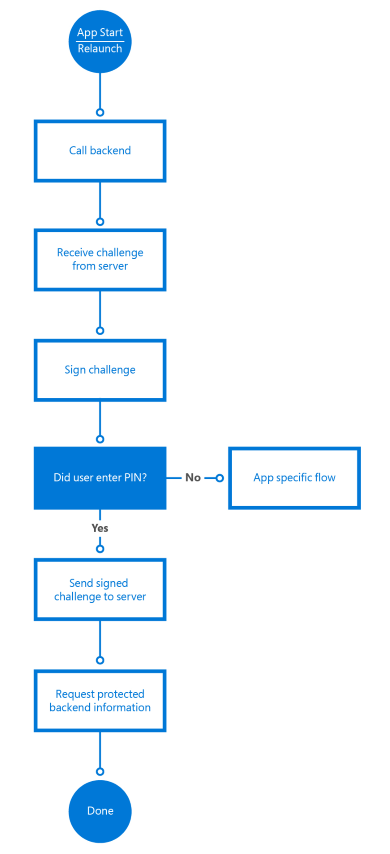
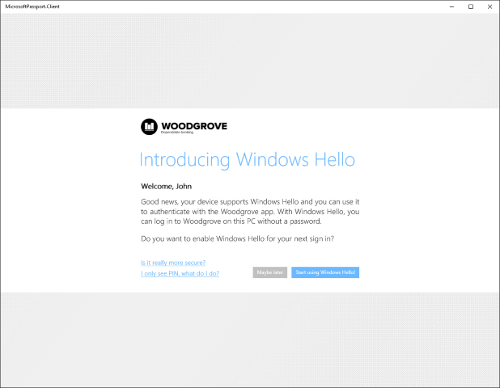

# <a name="windows-hello"></a>Windows Hello


Este artigo descreve a nova tecnologia Windows Hello que faz parte do sistema operacional Windows 10 e aborda como os desenvolvedores podem implementar essa tecnologia para proteger os apps da Plataforma Universal do Windows (UWP) e os serviços back-end. Ele destaca os recursos específicos dessas tecnologias que ajudam a mitigar os riscos decorrentes das credenciais convencionais e orienta sobre como projetar e implantar essas tecnologias como parte de sua distribuição do Windows 10.

Observe que este artigo se concentra no desenvolvimento de apps. Para obter informações sobre os detalhes da arquitetura e da implementação do Windows Hello, consulte o [Guia do Windows Hello no TechNet](https://technet.microsoft.com/library/mt589441.aspx).

Para obter um exemplo de código completo, consulte [Exemplo de código do Windows Hello no GitHub](http://go.microsoft.com/fwlink/?LinkID=717812).

Para obter um tutorial passo a passo sobre como criar um app UWP usando o Windows Hello e o serviço de autenticação de backup, consulte os artigos [Aplicativo de logon do Windows Hello](microsoft-passport-login.md) e [Serviço de logon do Windows Hello](microsoft-passport-login-auth-service.md).

## <a name="1-introduction"></a>1 Introdução


Uma pressuposição fundamental sobre a segurança das informações é que um sistema pode identificar quem o está usando. Identificar um usuário permite que o sistema decida se o usuário está identificado corretamente (um processo conhecido como autenticação) e, em seguida, determine o que um usuário devidamente autenticado deve ser capaz de fazer (autorização). A esmagadora maioria dos sistemas de computador implantados em todo o mundo depende de credenciais de usuário para tomar decisões sobre autenticação e autorização, o que significa que esses sistemas dependem de senhas reutilizáveis criadas pelo usuário como base da segurança. A máxima bastante citada de que a autenticação pode envolver "algo que você conhece, algo que você tem ou algo que você é" destaca o problema com precisão: uma senha reutilizável é um fator de autenticação por si, logo, quem sabe a senha pode representar o usuário que a possui.

## <a name="11-problems-with-traditional-credentials"></a>1.1 Problemas com as credenciais tradicionais


Desde meados dos anos 1960, quando Fernando Corbató e sua equipe do Massachusetts Institute of Technology defenderam a introdução da senha, os usuários e administradores precisam lidar com o uso de senhas para a autenticação e autorização de usuários. Com o tempo, as melhores opções para armazenamento e uso de senhas progrediram um pouco (com hash seguro e salting, por exemplo), mas ainda há dois problemas. As senhas são fáceis de clonar e fáceis de roubar. Além disso, falhas de implementação podem torná-las inseguras, e os usuários têm dificuldades para equilibrar conveniência e segurança.

## <a name="111-credential-theft"></a>1.1.1 Roubo de credenciais


O maior risco das senhas é simples: um invasor pode roubá-las facilmente. Todos os locais em que uma senha é inserida, processada ou armazenada são vulneráveis. Por exemplo, um invasor pode roubar uma coleção de senhas ou hashes de um servidor de autenticação espiando o tráfego de rede para um servidor de aplicativos, implantando malware em um aplicativo ou em um dispositivo, registrando em log pressionamentos de teclas do usuário em um dispositivo ou observando quais caracteres um usuário digita. Esses são apenas os métodos de ataque mais comuns.

Outro risco relacionado é o de repetição da credencial, em que um invasor captura uma credencial válida espiando uma rede insegura e a reproduz posteriormente para representar um usuário válido. A maioria dos protocolos de autenticação (inclusive Kerberos e OAuth) protege contra ataques de reprodução incluindo um carimbo de data/hora no processo de troca de credenciais, mas essa tática só protege o token que o sistema de autenticação emitiu, e não a senha que o usuário fornece para receber o tíquete inicialmente.

## <a name="112-credential-reuse"></a>1.1.2 Reutilização de credenciais


A abordagem comum para o uso de um endereço de email como nome de usuário piora um problema ruim. Um invasor que recupera com êxito o par nome de usuário/senha de um sistema comprometido pode acabar tentando usar esse mesmo par em outros sistemas. Essa tática funciona surpreendentemente com frequência para permitir que invasores passem de um sistema comprometido para outros sistemas. O uso de endereços de email como nomes de usuário leva a mais problemas, os quais exploraremos posteriormente neste guia.

## <a name="12-solving-credential-problems"></a>1.2 Solucionando problemas com credenciais


Resolver os problemas que as senhas trazem é complicado. Apenas apertar políticas de senha não será suficiente: os usuários podem simplesmente reciclar, compartilhar ou anotar as senhas. Embora a educação do usuário seja crítica para a segurança da autenticação, ela sozinha não elimina o problema.

O Windows Hello substitui senhas com forte autenticação por dois fatores (2FA) ao verificar credenciais existentes e criar uma credencial específica para o dispositivo, protegida por PIN ou liberação biométrica. 


## <a name="2-what-is-windows-hello"></a>2 O que é o Windows Hello?


Windows Hello é o nome que Microsoft deu ao novo sistema biométrico de entrada inserido no Windows 10. Como foi integrado diretamente no sistema operacional, o Windows Hello permite a identificação de face ou impressão digital para desbloquear os dispositivos dos usuários. A autenticação acontece quando o usuário fornece seu identificador biométrico exclusivo para acessar as credenciais específicas do dispositivo. Dessa maneira, alguém que roubar o dispositivo não conseguirá fazer logon, a menos que tenha o PIN. O repositório seguro de credenciais do Windows protege os dados biométricos no dispositivo. Ao usar o Windows Hello para desbloquear um dispositivo, o usuário autorizado tem acesso à experiência do Windows e a todos os aplicativos, dados, sites e serviços.

O autenticador Windows Hello é conhecido como Hello. O Hello é exclusivo para a combinação de um dispositivo separado e um usuário específico. Ele não usa perfil móvel entre dispositivos, não é compartilhado com um servidor ou aplicativo de chamada e não pode ser facilmente extraído de um dispositivo. Se vários usuários compartilharem um dispositivo, cada um deles precisará configurar a própria conta. Cada conta recebe um Hello exclusivo para esse dispositivo. Você pode pensar em um Hello como um token que pode usar para desbloquear (ou liberar) uma credencial armazenada. O Hello em si não autentica você para um app ou serviço, mas libera credenciais que podem fazer isso. Em outras palavras, o Hello não é uma credencial de usuário, e sim um segundo fator do processo de autenticação.

## <a name="21-windows-hello-authentication"></a>2.1 Autenticação do Windows Hello


O Windows Hello oferece uma maneira robusta para um dispositivo reconhecer um usuário individual, o que resolve a primeira parte do caminho entre um usuário e um serviço solicitado ou item de dados. Porém, depois que o dispositivo tiver reconhecido o usuário, ele ainda precisará autenticá-lo para determinar se deve conceder acesso a um recurso solicitado. O Windows Hello oferece 2FA forte, que está totalmente integrada ao Windows e substitui senhas reutilizáveis por uma combinação de um dispositivo específico e um gesto biométrico ou um PIN.

No entanto, o Windows Hello não é apenas uma renovação dos sistemas de 2FA tradicionais. Conceitualmente, ele é semelhante a cartões inteligentes: a autenticação é realizada usando-se primitivos criptográficos em vez de comparações de cadeias de caracteres, e o material da chave do usuário permanece seguro em um hardware à prova de adulterações. O Windows Hello não exige componentes de infraestrutura extras necessários para a implantação do cartão inteligente. Em particular, você não precisa de uma PKI (Infraestrutura de Chave Pública), caso não tenha uma no momento. O Windows Hello combina as principais vantagens da tecnologia de cartão inteligente (a flexibilidade de implantação para cartões inteligentes virtuais e a segurança robusta para cartões inteligentes físicos) sem qualquer uma das suas desvantagens.

## <a name="22-how-windows-hello-works"></a>2.2 Como funciona o Windows Hello


Quando o usuário configura o Windows Hello na máquina, é gerado um novo par de chaves pública/privada no dispositivo. O [Trusted Platform Module](https://technet.microsoft.com/itpro/windows/keep-secure/trusted-platform-module-overview) (TPM) gera e protege essa chave privada. Se o dispositivo não tiver um chip TPM, a chave privada será criptografada e protegida por software. Além disso, os dispositivos habilitados para TPM geram um bloco de dados que pode ser usado para atestar que uma chave está associada ao TPM. Essas informações de atestado podem ser usadas na solução para decidir se o usuário recebeu um nível de autorização diferente, por exemplo.

Para habilitar o Windows Hello em um dispositivo, o usuário deve ter sua conta do Azure Active Directory ou da Microsoft conectada nas configurações do Windows.

## <a name="221-how-keys-are-protected"></a>2.2.1 Como as chaves são protegidas


Sempre que o material de chave é gerado, ele deve ser protegido contra ataques. A maneira mais robusta de fazer isso é por meio de hardware especializado. Há um longo histórico de uso de módulos de segurança de hardware (HSMs) para gerar, armazenar e processar chaves para aplicativos críticos de segurança. Os cartões inteligentes são um tipo especial de HSM, da mesma forma que os dispositivos compatíveis com o padrão TPM do Trusted Computing Group. Sempre que possível, a implementação do Windows Hello aproveita o hardware do TPM onboard para gerar, armazenar e processar chaves. No entanto, o Windows Hello e o Windows Hello for Work não exigem TPM onboard.

Sempre que possível, a Microsoft recomenda o uso de hardware do TPM. O TPM protege contra diversos ataques conhecidos e possíveis, incluindo ataques de força bruta ao PIN. O TPM também fornece uma camada adicional de proteção após o bloqueio de uma conta. Quando o TPM tiver bloqueado o material da chave, o usuário precisará redefinir o PIN. A redefinição do PIN significa que todas as chaves e certificados criptografados com o material de chave antigo serão removidos.

## <a name="222-authentication"></a>2.2.2 Autenticação


Quando um usuário deseja acessar o material da chave protegido, o processo de autenticação começa com o usuário inserindo um PIN ou um gesto biométrico para desbloquear o dispositivo, um processo às vezes chamado de "liberação da chave".

Um aplicativo jamais pode usar as chaves de outro aplicativo, e ninguém nunca pode usar as chaves de outro usuário. Essas chaves são usadas para assinar solicitações enviadas para o provedor de identidade ou o IDP, em busca do acesso a recursos especificados. Os aplicativos podem usar APIs específicas para solicitar operações que exijam material da chave para determinadas ações. O acesso por meio dessas APIs não requer uma validação explícita por meio de um gesto do usuário, e o material da chave não é exposto ao app solicitante. Em vez disso, o app solicita uma ação específica, como assinar uma parte de dados, e a camada do Windows Hello lida com o trabalho real e retorna os resultados.

## <a name="23-getting-ready-to-implement-windows-hello"></a>2.3 Preparar para implementar o Windows Hello


Agora que temos uma compreensão básica de como o Windows Hello funciona, vamos dar uma olhada em como implementá-lo nos próprios apps.

Existem cenários diferentes que podemos implementar usando o Windows Hello. Por exemplo, basta fazer logon no app em um dispositivo. O outro cenário comum seria autenticar usando um serviço. Em vez de usar um nome de logon e uma senha, você usará o Windows Hello. Nos capítulos a seguir, abordaremos a implementação de alguns cenários diferentes, inclusive como autenticar usando os serviços com o Windows Hello e como fazer a conversão de um sistema de nome de usuário e senha de logon existente em um sistema do Windows Hello.

Por fim, lembre-se de que as APIs do Windows Hello exigem o uso do SDK do Windows 10, que corresponde ao sistema operacional em que o app será usado. Em outras palavras, o SDK do Windows 10.0.10240 deve ser usado para aplicativos que serão implantados no Windows 10, e o 10.0.10586 deve ser usado para aplicativos que serão implantados no Windows 10, versão 1511.

## <a name="3-implementing-windows-hello"></a>3 Implementar o Windows Hello


Neste capítulo, começamos com um cenário de ambiente intacto, sem nenhum sistema de autenticação existente, e explicamos como implementar o Windows Hello.

A próxima seção aborda como migrar de um sistema de nome de usuário/senha existente. No entanto, mesmo que esse capítulo seja o mais interessante para você, convém procurá-lo para obter uma compreensão básica do processo e do código necessário.

## <a name="31-enrolling-new-users"></a>3.1 Registro de novos usuários


Começamos com um serviço totalmente novo que usará o Windows Hello e um novo usuário hipotético que está pronto para se inscrever em um novo dispositivo.

A primeira etapa é verificar se o usuário pode usar o Windows Hello. O app verifica as configurações do usuário e os recursos de máquina para assegurar que pode criar chaves de ID de usuário. Se o app determinar que o usuário ainda não habilitou o Windows Hello, ele pede para o usuário configurá-lo antes de usar o app.

Para habilitar o Windows Hello, o usuário precisa configurar somente um PIN nas configurações do Windows, a menos que o configure durante a experiência imediata (OOBE).

As linhas de código a seguir mostram uma maneira simples de verificar se o usuário está configurado para o Windows Hello.

```cs
var keyCredentialAvailable = await KeyCredentialManager.IsSupportedAsync();
if (!keyCredentialAvailable)
{
   // User didn't set up PIN yet
   return;
}
```

A próxima etapa é solicitar ao usuário as informações para se inscrever no serviço. Você pode optar por solicitar ao usuário o nome, o sobrenome e o endereço de email e um nome de usuário exclusivo. Também é possível usar o endereço de email como o identificador exclusivo, como você quiser.

Neste cenário, usamos o endereço de email como o identificador exclusivo do usuário. Depois que o usuário se inscrever, você deverá considerar o envio de um email de validação para garantir que o endereço seja válido. Isso proporciona um mecanismo para redefinir a conta, se necessário.

Caso o usuário tenha configurado o PIN, o aplicativo criará a [**KeyCredential**](https://msdn.microsoft.com/library/windows/apps/dn973029) do usuário. O aplicativo também obtém as informações de atestado da chave opcionais para adquirir uma prova criptográfica de que a chave foi gerada do TPM. A chave pública gerada e, como opção, o atestado são enviados ao servidor back-end para registrar o dispositivo que está sendo usado. Cada par de chaves geradas em cada dispositivo será exclusivo.

O código para criar a [**KeyCredential**](https://msdn.microsoft.com/library/windows/apps/dn973029) é semelhante a este:

```cs
var keyCreationResult = await KeyCredentialManager
    .RequestCreateAsync(AccountId, KeyCredentialCreationOption.ReplaceExisting);
```

O [**RequestCreateAsync**](https://msdn.microsoft.com/library/windows/apps/dn973048) é a parte que cria as chaves pública e privada. Se o dispositivo tiver o chip TPM certo, as APIs solicitarão o chip TPM para criar as chaves pública e privada e armazenar o resultado; se não houver chip TPM disponível, o SO criará o par de chaves no código. Não existe uma maneira do aplicativo acessar as chaves privadas criadas diretamente. Parte da criação dos pares de chaves também são as informações de atestado resultantes. (Consulte a próximo seção para obter mais informações sobre o atestado.)

Depois que as informações do par de chaves e de atestado forem criadas no dispositivo, a chave pública, as informações de atestado opcional e o identificador exclusivo (como o endereço de email) precisam ser enviados para o serviço de registro back-end e armazenadas no back-end.

Para permitir que o usuário acesse o aplicativo em vários dispositivos, o serviço back-end precisa ser capaz de armazenar diversas chaves para o mesmo usuário. Como cada chave é exclusiva para cada dispositivo, armazenaremos todas essas chaves conectadas ao mesmo usuário. Um identificador de dispositivo é usado para ajudar a otimizar a parte do servidor durante a autenticação de usuários. Falaremos sobre isso mais detalhadamente no próximo capítulo.

Um esquema de banco de dados de amostra para armazenar essas informações no back-end pode ter esta aparência:


A lógica do registro pode ter esta aparência:


As informações de registro que você coleta podem incluir muito mais informações de identificação do que incluímos neste cenário simples. Por exemplo, se seu aplicativo acessa um serviço protegido, como para bancos, você precisará solicitar comprovação de identidade e outros itens como parte do processo de inscrição. Depois que todas as condições forem atendidas, a chave pública do usuário será armazenada no back-end e usada para validar na próxima vez em que o usuário utilizar o serviço.

```cs
using System;
using System.Runtime;
using System.Threading.Tasks;
using Windows.Storage.Streams;
using Windows.Security.Credentials;

static async void RegisterUser(string AccountId)
{
    var keyCredentialAvailable = await KeyCredentialManager.IsSupportedAsync();
    if (!keyCredentialAvailable)
    {
        // The user didn't set up a PIN yet
        return;
    }

    var keyCreationResult = await KeyCredentialManager.RequestCreateAsync(AccountId, KeyCredentialCreationOption.ReplaceExisting);
    if (keyCreationResult.Status == KeyCredentialStatus.Success)
    {
        var userKey = keyCreationResult.Credential;
        var publicKey = userKey.RetrievePublicKey();
        var keyAttestationResult = await userKey.GetAttestationAsync();
        IBuffer keyAttestation = null;
        IBuffer certificateChain = null;
        bool keyAttestationIncluded = false;
        bool keyAttestationCanBeRetrievedLater = false;

        keyAttestationResult = await userKey.GetAttestationAsync();
        KeyCredentialAttestationStatus keyAttestationRetryType = 0;

        if (keyAttestationResult.Status == KeyCredentialAttestationStatus.Success)
        {
            keyAttestationIncluded = true;
            keyAttestation = keyAttestationResult.AttestationBuffer;
            certificateChain = keyAttestationResult.CertificateChainBuffer;
        }
        else if (keyAttestationResult.Status == KeyCredentialAttestationStatus.TemporaryFailure)
        {
            keyAttestationRetryType = KeyCredentialAttestationStatus.TemporaryFailure;
            keyAttestationCanBeRetrievedLater = true;
        }
        else if (keyAttestationResult.Status == KeyCredentialAttestationStatus.NotSupported)
        {
            keyAttestationRetryType = KeyCredentialAttestationStatus.NotSupported;
            keyAttestationCanBeRetrievedLater = true;
        }
    }
    else if (keyCreationResult.Status == KeyCredentialStatus.UserCanceled ||
        keyCreationResult.Status == KeyCredentialStatus.UserPrefersPassword)
    {
        // Show error message to the user to get confirmation that user
        // does not want to enroll.
    }
}
```

## <a name="311-attestation"></a>3.1.1 Atestado


Durante a criação do par de chaves, também existe uma opção para solicitar as informações de atestado, que são geradas pelo chip do TPM. Essas informações opcionais podem ser enviadas para o servidor como parte do processo de inscrição. O atestado da chave TPM é um protocolo que prova criptograficamente que uma chave está associada ao TPM. Esse tipo de atestado pode ser usado para garantir que uma determinada operação criptográfica ocorreu no TPM de um computador específico.

Ao receber a chave RSA gerada, a instrução de atestado e o certificado AIK, o servidor verifica as seguintes condições:

-   A assinatura do certificado AIK é válida.
-   O certificado AIK está encadeado até uma raiz confiável.
-   O certificado AIK e a cadeia está habilitada para EKU OID "2.23.133.8.3" (o nome amigável é "Certificado de chave de identidade de atestado").
-   A hora do certificado AIK é válida.
-   Todos os certificados CA de emissão na cadeia têm hora válida e não são revogados.
-   A instrução de atestado está formada corretamente.
-   A assinatura no blob [**KeyAttestation**](https://msdn.microsoft.com/library/windows/apps/dn298288) usa uma chave pública AIK.
-   A chave pública incluída no blob [**KeyAttestation**](https://msdn.microsoft.com/library/windows/apps/dn298288) corresponde à chave RSA pública que o cliente enviou com a instrução de atestado.

Seu aplicativo pode atribuir ao usuário um nível de autorização diferente, dependendo dessas condições. Por exemplo, se uma dessas verificações falhar, talvez o usuário não seja registrado ou poderá haver um limite para o que o usuário pode fazer.

## <a name="32-logging-on-with-windows-hello"></a>3.2 Logon com o Windows Hello


Depois de ser registrado no sistema, o usuário poderá usar o app. Dependendo do cenário, você pode pedir para os usuários se autenticarem antes que possam começar a usar o aplicativo ou apenas pedir para que eles se autentiquem assim que começarem a usar os serviços back-end.

## <a name="33-force-the-user-to-sign-in-again"></a>3.3 Forçar o usuário a fazer logon novamente


Para alguns cenários, talvez você queira que o usuário comprove que ele é a pessoa que está atualmente conectada, antes de acessar o aplicativo ou, às vezes, antes de executar uma determinada ação dentro do aplicativo. Por exemplo, antes de um aplicativo bancário envie o comando para transferir dinheiro ao servidor, você deseja assegurar que o usuário, e não alguém que encontrou um dispositivo conectado, está tentando executar uma transação. Você pode forçar o usuário a entrar novamente no aplicativo usando a classe [**UserConsentVerifier**](https://msdn.microsoft.com/library/windows/apps/dn279134). A linha de código a seguir forçará o usuário a inserir as credenciais.

A linha de código a seguir forçará o usuário a inserir as credenciais.

```cs
UserConsentVerificationResult consentResult = await UserConsentVerifier.RequestVerificationAsync("userMessage");
if (consentResult.Equals(UserConsentVerificationResult.Verified))
{
   // continue
}
```

Obviamente, você também pode usar o mecanismo de resposta de desafio do servidor, descrito no próximo capítulo, com o servidor que exige que o usuário insira o próprio código PIN ou as credenciais biométricas. Isso depende do cenário que você como desenvolvedor precisa implementar. Esse mecanismo é descrito na seção a seguir.

## <a name="34-authentication-at-the-backend"></a>3.4 Autenticação no back-end


Quando o aplicativo tenta acessar serviços no back-end protegido, o serviço envia um desafio para o aplicativo. O aplicativo usa a chave privada do usuário para assinar o desafio e o reenvia para o servidor. Como o servidor armazenou a chave pública para esse usuário, ele usa APIs criptográficas padrão para se assegurar de que a mensagem tenha sido assinada mesmo com a chave privada correta. No cliente, a entrada é feita pelas APIs do Windows Hello: o desenvolvedor jamais terá acesso à chave privada de nenhum usuário.

Além de verificar as chaves, o serviço também pode verificar o atestado de chave e definir se existe alguma limitação invocada em relação à maneira como as chaves são armazenadas no dispositivo. Por exemplo, quando o dispositivo usa o TPM para proteger as chaves, isso é mais seguro do que dispositivos armazenando as chaves sem o TPM. A lógica do back-end pode decidir, por exemplo, que o usuário só tem permissão para transferir uma determinada quantidade de dinheiro quando nenhum TPM for usado para reduzir os riscos.

O atestado só está disponível para dispositivos com um chip do TPM versão 2.0 ou superior. Assim, você precisa levar em conta que essas informações nem sempre podem estar disponíveis em todos os dispositivos.

O fluxo de trabalho do cliente pode parecer com o seguinte gráfico:



Quando o app chama o serviço no back-end, o servidor envia um desafio. O desafio é assinado com o seguinte código:

```cs
var openKeyResult = await KeyCredentialManager.OpenAsync(AccountId);

if (openKeyResult.Status == KeyCredentialStatus.Success)
{
    var userKey = openKeyResult.Credential;
    var publicKey = userKey.RetrievePublicKey();
    var signResult = await userKey.RequestSignAsync(message);
    
    if (signResult.Status == KeyCredentialStatus.Success)
    {
        return signResult.Result;
    }
    else if (signResult.Status == KeyCredentialStatus.UserPrefersPassword)
    {
        
    }
}
```

A primeira linha, [**KeyCredentialManager.OpenAsync**](https://msdn.microsoft.com/library/windows/apps/dn973046), pedirá para o SO abrir o identificador de chave. Caso isso seja feito com êxito, você pode assinar a mensagem de desafio usando o método [**KeyCredential.RequestSignAsync**](https://msdn.microsoft.com/library/windows/apps/dn973058) que levará o SO a solicitar ao usuário o PIN ou a biometria por meio do Windows Hello. Em nenhum momento o desenvolvedor tem acesso à chave privada do usuário. Isso tudo é mantido seguro por meio das APIs WinRT.

As APIs solicitam que o SO assine o desafio com a chave privada. Em seguida, o sistema solicita ao usuário um código PIN ou um logon biométrico configurado. Quando as informações corretas são inseridas, o sistema pode pedir ao chip do TPM para executar as funções de criptografia e assinar o desafio. (Ou use a solução de software de fallback, se nenhum TPM estiver disponível). O cliente precisa enviar o desafio assinado de volta ao servidor.

Um fluxo de desafio – resposta básico é mostrado neste diagrama de sequência:


Em seguida, o servidor precisa validar a assinatura. Quando você solicita a chave pública e a envia ao servidor para ser usada em uma validação futura, ela está em um blob publicKeyInfo codificado por ASN.1. Se você examinar o [exemplo de código do Windows Hello no GitHub](http://go.microsoft.com/fwlink/?LinkID=717812), é possível ver que há classes auxiliares para encapsular funções Crypt32 a fim de converter o blob codificado por ASN.1 em um blob CNG usado com mais frequência. O blob contém o algoritmo de chave pública, que é o RSA, e a chave pública RSA.

Depois que tiver o blob CNG, você precisará validar o desafio assinado em relação à chave pública do usuário. Como todos usam o próprio sistema ou tecnologia back-end, não existe maneira genérica de implementar essa lógica. Sempre usamos SHA256 como o algoritmo de hash e Pkcs1 para SignaturePadding, logo, certifique-se de que seja o que você usa ao validar a resposta assinada do cliente. Mais uma vez, refira-se ao exemplo como uma maneira de fazer isso em .NET 4.6 no servidor, mas em geral será algo parecido com isto:

```cs
using (RSACng pubKey = new RSACng(publicKey))
{
   retval = pubKey.VerifyData(originalChallenge, responseSignature,  HashAlgorithmName.SHA256, RSASignaturePadding.Pkcs1); 
}
```

Lemos a chave pública armazenada, que é uma chave RSA. Validamos a mensagem de desafio assinada com a chave pública e, em caso de check-out, autorizamos o usuário. Caso o usuário seja autenticado, o aplicativo pode chamar os serviços back-end como normais.

O código completo pode parecer algo como o seguinte:

```cs
using System;
using System.Runtime;
using System.Threading.Tasks;
using Windows.Storage.Streams;
using Windows.Security.Cryptography;
using Windows.Security.Cryptography.Core;
using Windows.Security.Credentials;

static async Task<IBuffer> GetAuthenticationMessageAsync(IBuffer message, String AccountId)
{
    var openKeyResult = await KeyCredentialManager.OpenAsync(AccountId);

    if (openKeyResult.Status == KeyCredentialStatus.Success)
    {
        var userKey = openKeyResult.Credential;
        var publicKey = userKey.RetrievePublicKey();
        var signResult = await userKey.RequestSignAsync(message);
        if (signResult.Status == KeyCredentialStatus.Success)
        {
            return signResult.Result;
        }
        else if (signResult.Status == KeyCredentialStatus.UserCanceled)
        {
            // Launch app-specific flow to handle the scenario 
            return null;
        }
    }
    else if (openKeyResult.Status == KeyCredentialStatus.NotFound)
    {
        // PIN reset has occurred somewhere else and key is lost.
        // Repeat key registration
        return null;
    }
    else
    {
        // Show custom UI because unknown error has happened.
        return null;
    }
}
```

Implementar o mecanismo de resposta de desafio correto está fora do escopo deste documento, mas esse tópico é algo que precisa de muita consideração para criar um mecanismo seguro que impeça coisas como ataques de reprodução ou man-in-the-middle.

## <a name="35-enrolling-another-device"></a>3.5 Registro de outro dispositivo


Hoje em dia, é bastante comum que os usuários tenham vários dispositivos com os mesmos apps instalados. Como isso funciona quando se usa o Windows Hello com vários dispositivos?

Ao usar o Windows Hello, cada dispositivo criará um conjunto de chaves pública e privada exclusivo. Isso significa que, caso você queira que um usuário possa usar vários dispositivos, o back-end deve ser capaz de armazenar várias chaves públicas desse usuário. Consulte o diagrama de banco de dados na seção 2.1 para obter um exemplo da estrutura da tabela.

Registrar outro dispositivo é praticamente o mesmo que registrar um usuário pela primeira vez. Você ainda precisa ter certeza de que o usuário que se registra para esse novo dispositivo é realmente o usuário que diz ser. É possível fazer isso com qualquer mecanismo de autenticação de dois fatores usado atualmente. Existem várias maneiras de fazer isso de maneira segura. Tudo isso depende do cenário.

Por exemplo, caso ainda use o nome de logon e a senha, você pode usar isso para autenticar o usuário e solicitar o uso de um dos métodos de verificação, como SMS ou email. Caso não tenha um nome de logon e uma senha, você também pode usar um dos dispositivos já registrados e enviar uma notificação para o aplicativo nesse dispositivo. O aplicativo autenticador MSA é um exemplo disso. Em resumo, você deve usar um mecanismo 2FA comum para registrar dispositivos extras para o usuário.

O código para registrar o novo dispositivo é exatamente o mesmo do registro do usuário pela primeira vez (dentro do aplicativo).

```cs
var keyCreationResult = await KeyCredentialManager.RequestCreateAsync(
    AccountId, KeyCredentialCreationOption.ReplaceExisting);
```

Para facilitar ainda mais para o usuário reconhecer quais dispositivos estão registrados, você pode optar por enviar o nome do dispositivo ou outro identificador como parte do registro. Isso também é útil, por exemplo, caso você queira implementar um serviço no back-end onde os usuários possam cancelar o registro de dispositivos quando um dispositivo é perdido.

## <a name="36-using-multiple-accounts-in-your-app"></a>3.6 Como usar várias contas no aplicativo


Além de oferecer suporte a vários dispositivos para uma única conta, também é comum dar suporte a várias contas em um único aplicativo. Por exemplo, talvez você esteja se conectando a várias contas do Twitter de dentro de seu app. Com o Windows Hello, é possível criar vários pares de chaves e oferecer suporte a várias contas dentro do app.

Uma maneira de fazer isso é armazenar o nome do usuário ou o identificador exclusivo descrito no capítulo anterior e colocá-lo no armazenamento isolado. Assim, sempre que você criar uma nova conta, coloque a ID da conta no armazenamento isolado.

Na interface do usuário do aplicativo, você dá ao usuário a opção de escolher uma das contas criadas antes ou se inscrever usando uma nova. O fluxo de criação de uma nova conta é o mesmo, conforme descrito antes. Escolher uma conta é uma questão de listar as contas armazenadas na tela. Depois que o usuário seleciona uma conta, use a ID da conta para fazer logon do usuário no aplicativo:

```cs
var openKeyResult = await KeyCredentialManager.OpenAsync(AccountId);
```

O restante do fluxo é o mesmo, conforme descrito antes. Para ser claro, todas essas contas são protegidas pelo mesmo PIN ou gesto biométrico, já que neste cenário, todas são usadas em um único dispositivo com a mesma conta do Windows.

## <a name="4-migrating-an-existing-system-to-windows-hello"></a>4 Migrar de um sistema atual para o Windows Hello


Nesta seção, vamos abordar um aplicativo Plataforma Universal do Windows existente e um sistema back-end que usa um banco de dados que armazena o nome de usuário e a senha com hash. Esses apps coletam credenciais do usuário quando o app é iniciado e fornecem as credenciais quando o sistema back-end retorna o desafio de autenticação.

Aqui, descreveremos quais partes precisam ser alteradas ou substituídas para que o Windows Hello funcione.

Já descrevemos a maioria das técnicas nos capítulos anteriores. Adicionar o Windows Hello ao seu sistema atual envolve a adição de alguns fluxos diferentes na parte de registro e autenticação do código.

Uma abordagem é permitir que o usuário escolher quando atualizar. Depois que o usuário faz logon no app e você detecta que o app e o sistema operacional são capazes de oferecer suporte ao Windows Hello, é possível perguntar ao usuário se ele deseja atualizar credenciais para usar esse sistema mais moderno e seguro. É possível usar o código a seguir para verificar se o usuário é capaz de usar o Windows Hello.

```cs
var keyCredentialAvailable = await KeyCredentialManager.IsSupportedAsync();
```

A interface do usuário pode ter esta aparência:



Caso o usuário decida começar a usar o Windows Hello, crie a [**KeyCredential**](https://msdn.microsoft.com/library/windows/apps/dn973029) conforme descrito antes. O servidor de registro back-end adiciona a chave pública e a instrução de atestado opcional ao banco de dados. Como o usuário já está autenticado com nome de usuário e senha, o servidor pode vincular as novas credenciais às informações do usuário atual no banco de dados. O modelo de banco de dados pode ser igual ao exemplo descrito anteriormente.

Caso o aplicativo consiga criar a [**KeyCredential**](https://msdn.microsoft.com/library/windows/apps/dn973029) dos usuários, ele colocará a ID de usuário no armazenamento isolado de maneira que o usuário possa escolher essa conta na lista depois que o aplicativo for reiniciado. Desse ponto em diante, o fluxo segue exatamente os exemplos descritos nos capítulos anteriores.

A etapa final na migração para um cenário do Windows Hello completo é desabilitar a opção de nome de logon e senha no app e remover as senhas com hash armazenadas no banco de dados.

## <a name="5-summary"></a>5 Resumo


O Windows 10 apresenta um nível mais alto de segurança que também é simples de colocar em prática. O Windows Hello oferece um novo sistema de entrada biométrica que reconhece o usuário e combate ativamente iniciativas de contornar a identificação apropriada. Assim, ele pode oferecer diversas camadas de chaves e certificados que nunca podem ser reveladas ou usadas fora de um módulo de plataforma confiável. Além disso, uma camada adicional de segurança está disponível por meio do uso opcional de chaves e certificados de identidade de atestado.

Como um desenvolvedor, você pode usar essas orientações sobre design e implantação dessas tecnologias para adicionar facilmente uma autenticação segura às implementações do Windows 10 para proteger aplicativos e serviços back-end. O código necessário é mínimo e fácil de entender. O Windows 10 faz o trabalho pesado.

As opções de implementação flexível permitem que o Windows Hello substitua ou funcione com o sistema de autenticação atual. A experiência de implantação é suave e econômica. Nenhuma infraestrutura adicional é necessária para implantar a segurança do Windows 10. Com o Windows Hello integrado ao sistema operacional, o Windows 10 oferece a solução mais segura para os problemas de autenticação dos desenvolvedores modernos.

Missão cumprida! Você acabou de tornar a Internet um lugar seguro!

## <a name="6-resources"></a>6 Recursos


### <a name="61-articles-and-sample-code"></a>6.1 Artigos e código de exemplo

-   [Visão geral do Windows Hello](http://windows.microsoft.com/windows-10/getstarted-what-is-hello)
-   [Detalhes da implementação do Windows Hello](https://msdn.microsoft.com/library/mt589441)
-   [Amostra de código do Windows Hello no GitHub](http://go.microsoft.com/fwlink/?LinkID=717812)

### <a name="62-terminology"></a>6.2 Terminologia

|                     |                                                                                                                                                                                                                                                                                                                                                                                                                                                                                                                               |
|---------------------|-------------------------------------------------------------------------------------------------------------------------------------------------------------------------------------------------------------------------------------------------------------------------------------------------------------------------------------------------------------------------------------------------------------------------------------------------------------------------------------------------------------------------------|
| AIK                 | Uma chave de identidade de atestado é usada para fornecer essa prova criptográfica (atestado de chave do TPM) assinando as propriedades da chave não migrável e fornecendo as propriedades e a assinatura à parte confiável para verificação. A assinatura resultante é chamada de "instrução de atestado". Como a assinatura é criada usando-se a chave privada do AIK – que só pode ser usada no TPM que a criou – a parte confiável pode confiar que a chave atestada é realmente não migrável e não pode ser usada fora desse TPM. |
| Certificado AIK     | Um certificado AIK é usado para atestar a presença de um AIK dentro de um TPM. Ele também é usado para atestar que outras chaves certificadas pelo AIK têm origem nesse TPM específico.                                                                                                                                                                                                                                                                                                                                              |
| IDP                 | IDP é um provedor de identidade. Um exemplo é a compilação IDP da Microsoft para contas da Microsoft. Sempre que precisa se autenticar usando um MSA, um aplicativo pode chamar o IDP MSA.                                                                                                                                                                                                                                                                                                                                        |
| PKI                 | A infraestrutura de chave pública é usada geralmente para apontar para um ambiente hospedado pela própria organização e responsável pela criação de chaves, revogação de chaves etc.                                                                                                                                                                                                                                                                                                                                                           |
| TPM                 | O trusted platform module (TPM) pode ser usado para criar pares de chaves pública/privada criptográficas de maneira que a chave privada jamais possa ser revelada ou usada fora do TPM (ou seja, a chave é não migrável).                                                                                                                                                                                                                                                                                                               |
| Atestado de chave do TPM | Um protocolo que prova criptograficamente que uma tecla está associada ao TPM. Esse tipo de atestado pode ser usado para garantir que uma determinada operação criptográfica ocorreu no TPM de um computador específico.                                                                                                                                                                                                                                                                                                                       |

 

## <a name="related-topics"></a>Tópicos relacionados

* [Aplicativo de logon do Windows Hello](microsoft-passport-login.md)
* [Serviço de logon do Windows Hello](microsoft-passport-login-auth-service.md)