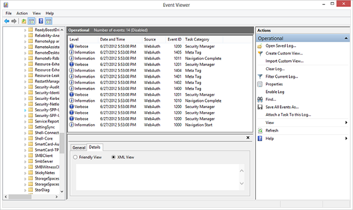

# Agente de autenticação da Web


\[ Atualizado para aplicativos UWP no Windows 10. Para ler artigos sobre o Windows 8.x, consulte o [arquivo](http://go.microsoft.com/fwlink/p/?linkid=619132) \]


Este artigo explica como conectar seu aplicativo da Plataforma Universal do Windows (UWP) a um provedor de identidade online que use protocolos de autenticação como OpenID ou OAuth, como Facebook, Twitter, Flickr, Instagram e assim por diante. O método [**AuthenticateAsync**](https://msdn.microsoft.com/library/windows/apps/br212066) envia uma solicitação ao provedor de identidade online e obtém um token de acesso que descreve os recursos do provedor aos quais o aplicativo tem acesso.

**Observação** para obter uma amostra de código funcional completa, clone o [WebAuthenticationBroker repo on GitHub](http://go.microsoft.com/fwlink/p/?LinkId=620622).

 

## Registrar o aplicativo junto ao provedor online


Você deve registrar o aplicativo junto ao provedor de identidade online ao qual deseja se conectar. Consulte o provedor de identidade para saber como registrar seu aplicativo. Após o registro, o provedor online costuma fornecer uma Id ou uma chave secreta para o seu aplicativo.

## Criar o URI de solicitação de autenticação


O URI de solicitação é composto pelo endereço para onde você envia a solicitação de autenticação para o seu provedor de identidade online junto com outras informações necessárias, como ID ou chave secreta do aplicativo, um URI de redirecionamento para o qual o usuário é enviado após concluir a autenticação e o tipo de resposta esperado. Seu provedor deverá informar quais são os parâmetros necessários.

O URI de solicitação é enviado como o parâmetro *requestUri* do método [**AuthenticateAsync**](https://msdn.microsoft.com/library/windows/apps/br212066). Ele deve ser um endereço seguro (deve começar com https://)

O exemplo a seguir mostra como criar o URI de solicitação.

```cs
string startURL = "https://<providerendpoint>?client_id=<clientid>&scope=<scopes>&response_type=token";
string endURL = "http://<appendpoint>";

System.Uri startURI = new System.Uri(startURL);
System.Uri endURI = new System.Uri(endURL);
```

## Conectar ao provedor online


Chame o método [**AuthenticateAsync**](https://msdn.microsoft.com/library/windows/apps/br212066) para se conectar ao provedor de identidade online e obter um token de acesso. O método transmite o URI construído na etapa anterior como o parâmetro *requestUri* e um URI ao qual você deseja que o usuário seja redirecionado como o parâmetro *callbackUri*.

```cs
string result;

try
{
    var webAuthenticationResult = 
        await Windows.Security.Authentication.Web.WebAuthenticationBroker.AuthenticateAsync( 
        Windows.Security.Authentication.Web.WebAuthenticationOptions.None, 
        startURI, 
        endURI);

    switch (webAuthenticationResult.ResponseStatus)
    {
        case Windows.Security.Authentication.Web.WebAuthenticationStatus.Success:
            // Successful authentication. 
            result = webAuthenticationResult.ResponseData.ToString(); 
            break;
        case Windows.Security.Authentication.Web.WebAuthenticationStatus.ErrorHttp:
            // HTTP error. 
            result = webAuthenticationResult.ResponseErrorDetail.ToString(); 
            break;
        default:
            // Other error.
            result = webAuthenticationResult.ResponseData.ToString(); 
            break;
    } 
}
catch (Exception ex)
{
    // Authentication failed. Handle parameter, SSL/TLS, and Network Unavailable errors here. 
    result = ex.Message;
}
```

Além do [**AuthenticateAsync**](https://msdn.microsoft.com/library/windows/apps/br212066), o namespace [**Windows.Security.Authentication.Web**](https://msdn.microsoft.com/library/windows/apps/br227044) contém um método [**AuthenticateAndContinue**](https://msdn.microsoft.com/library/windows/apps/dn632425). Não chame esse método. Ele foi projetado para aplicativos direcionados apenas ao Windows Phone 8.1 e foi preterido a partir do Windows 10.

## Conectando-se com logon único (SSO)


Por padrão, o agente de autenticação da Web não permite cookies persistentes. Por isso, mesmo se o usuário do aplicativo indicar que deseja permanecer conectado (por exemplo, marcando uma caixa de seleção na caixa de diálogo de login do provedor), ele terá que efetuar login cada vez que quiser acessar os recursos desse provedor. Para efetuar login com SSO, o provedor de identidade online deve ter o modo SSO habilitado para o agente de autenticação da Web e seu aplicativo deve chamar a sobrecarga de [**AuthenticateAsync**](https://msdn.microsoft.com/library/windows/apps/br212068) que não transmite um parâmetro *callbackUri*.

Para dar suporte ao modo SSO, o provedor online deve permitir que você registre um URI de redirecionamento na forma `ms-app://`*appSID*, onde *appSID* é o SID do seu aplicativo. Você pode localizar o SID do seu aplicativo na página do desenvolvedor de aplicativo para seu aplicativo ou chamando o método [**GetCurrentApplicationCallbackUri**](https://msdn.microsoft.com/library/windows/apps/br212069).

```cs
string result;

try
{
    var webAuthenticationResult = 
        await Windows.Security.Authentication.Web.WebAuthenticationBroker.AuthenticateAsync( 
        Windows.Security.Authentication.Web.WebAuthenticationOptions.None, 
        startURI);

    switch (webAuthenticationResult.ResponseStatus)
    {
        case Windows.Security.Authentication.Web.WebAuthenticationStatus.Success:
            // Successful authentication. 
            result = webAuthenticationResult.ResponseData.ToString(); 
            break;
        case Windows.Security.Authentication.Web.WebAuthenticationStatus.ErrorHttp:
            // HTTP error. 
            result = webAuthenticationResult.ResponseErrorDetail.ToString(); 
            break;
        default:
            // Other error.
            result = webAuthenticationResult.ResponseData.ToString(); 
            break;
    } 
}
catch (Exception ex)
{
    // Authentication failed. Handle parameter, SSL/TLS, and Network Unavailable errors here. 
    result = ex.Message;
}
```

## Depuração


Existem várias maneiras de solucionar problemas com APIs de agente de autenticação da Web, incluindo a revisão de logs operacionais e a revisão de respostas e solicitações da Web usando o Fiddler.

### Logs operacionais

Geralmente é possível determinar o que não está funcionando usando logs operacionais. Há um canal de log de eventos dedicado, a saber, Microsoft-Windows-WebAuth\\Operational, que permite aos desenvolvedores de sites entender como suas páginas da Web estão sendo processadas pelo agente de autenticação da Web. Para habilitá-lo, execute o arquivo eventvwr.exe e habilite Log operacional em Application and Services\\Microsoft\\Windows\\WebAuth. Além disso, o agente de autenticação da Web acrescenta uma cadeia de caracteres exclusiva à cadeia de caracteres do agente do usuário para se identificar no servidor Web. A cadeia de caracteres é "MSAuthHost/1.0". Observe que o número da versão pode mudar no futuro, portanto você não deve depender do número daquela versão no seu código. Um exemplo de cadeia de caracteres de agente de usuário, seguida pelas etapas de depuração completa, é o seguinte.

`User-Agent: Mozilla/5.0 (compatible; MSIE 10.0; Windows NT 6.2; Win64; x64; Trident/6.0; MSAuthHost/1.0)`

1.  Habilitar logs operacionais.
2.  Executar aplicativo social da Contoso. 
3.  As entradas dos logs geradas podem ser usadas para entender o comportamento do agente de autenticação da Web em maiores detalhes. Nesse caso, elas podem ser:
    -   Início da Navegação: registra quando o AuthHost é iniciado e contém informações sobre as URLs de início e término.
    -   
    -   Navegação Completa: registra a conclusão do carregamento de uma página da Web.
    -   Marca meta: registra quando uma marca meta é encontrada, incluindo os detalhes.
    -   Término da Navegação: navegação encerrada pelo usuário.
    -   Erro de Navegação: o AuthHost encontra um erro de navegação em uma URL, incluindo HttpStatusCode.
    -   Final da Navegação: a URL de término é encontrada.

### Fiddler

O depurador da Web Fiddler pode ser usado com aplicativos.

1.  Por o AuthHost executar no seu próprio contêiner de aplicativo para dar maior capacidade de rede privada, você deve definir uma chave de registro: Windows Registry Editor Version 5.00

    **HKEY\_LOCAL\_MACHINE**
            \\
            **SOFTWARE**
            \\
            **Microsoft**
            \\
            **Windows NT**
            \\
            **CurrentVersion**
            \\
            **Image File Execution Options**
            \\
            **authhost.exe**
            \\
            **EnablePrivateNetwork** = 00000001

                         Data type  
                         DWORD

2.  Adicione uma regra para o AuthHost, uma vez que é ele quem gera o tráfego de saída.
    ```syntax
    CheckNetIsolation.exe LoopbackExempt -a -n=microsoft.windows.authhost.a.p_8wekyb3d8bbwe
    CheckNetIsolation.exe LoopbackExempt -a -n=microsoft.windows.authhost.sso.p_8wekyb3d8bbwe
    CheckNetIsolation.exe LoopbackExempt -a -n=microsoft.windows.authhost.sso.c_8wekyb3d8bbwe
    D:\Windows\System32>CheckNetIsolation.exe LoopbackExempt -s
    List Loopback Exempted AppContainers
    [1] -----------------------------------------------------------------
        Name: microsoft.windows.authhost.sso.c_8wekyb3d8bbwe
        SID:  S-1-15-2-1973105767-3975693666-32999980-3747492175-1074076486-3102532000-500629349
    [2] -----------------------------------------------------------------
        Name: microsoft.windows.authhost.sso.p_8wekyb3d8bbwe
        SID:  S-1-15-2-166260-4150837609-3669066492-3071230600-3743290616-3683681078-2492089544
    [3] -----------------------------------------------------------------
        Name: microsoft.windows.authhost.a.p_8wekyb3d8bbwe
        SID:  S-1-15-2-3506084497-1208594716-3384433646-2514033508-1838198150-1980605558-3480344935
    ```

3.  Adicione uma regra de firewall para o tráfego de entrada ao Fiddler.


<!--HONumber=Jun16_HO4-->


