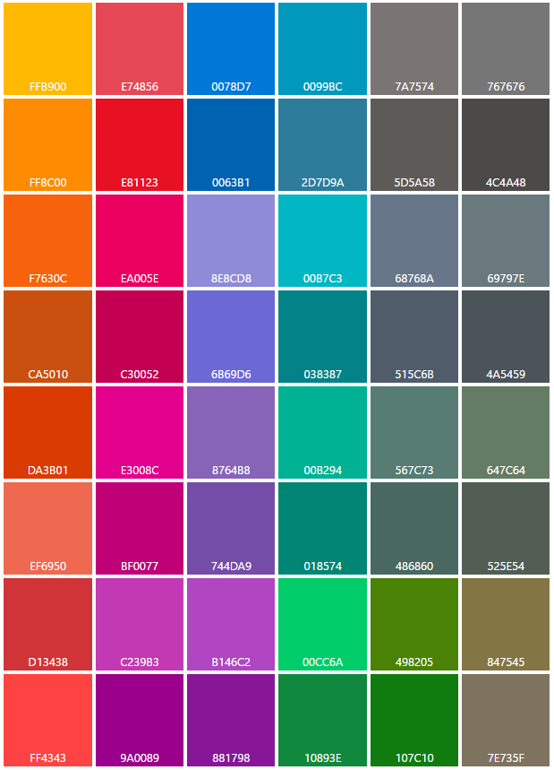

# Cor

As cores tornam a orientação intuitiva por meio de vários níveis de informações de um aplicativo e são uma ferramenta essencial para reforçar o modelo de interação.

No Windows, a cor também é pessoal. Os usuários podem escolher uma cor e um tema claro ou escuro para serem refletidos em toda a sua experiência.

## Cor de destaque

O usuário pode selecionar uma única cor chamada de destaque em *Configurações > Personalização > Cores*. Eles têm a opção de um conjunto administrado de 48 amostras de cores, exceto no Xbox, que tem uma paleta de 21 cores seguras para a TV.

<!-- Alternate version for the dev center. Need to add hex values. -->
 Cores de destaque padrão

 Cores de destaque do Xbox


Quando os usuários escolhem uma cor de destaque, ela aparece como parte do seu tema do sistema. As áreas afetadas são a tela inicial, a barra de tarefas, o cromado de janela, estados de interação selecionados e hiperlinks dentro de [controles comuns](https://dev.windows.com/design/controls-patterns). Cada aplicativo pode incorporar ainda mais a cor de destaque em suas tipografias, planos de fundo e interações, ou ainda anulá-la para preservar sua identidade visual específica.

## Blocos de construção da paleta de cores

Depois que uma cor de destaque é selecionada, tonalidades claras e escuras dessa cor são criadas com base nos valores HSB de luminosidade de cor. Aplicativos podem usar variações de tonalidades para criar uma hierarquia visual e fornecer uma indicação de interação.

Por padrão, os hiperlinks usarão a cor de destaque do usuário. Se o plano de fundo de página tiver uma cor semelhante, você poderá optar por atribuir um tom de destaque mais claro (ou mais escuro) para os hiperlinks terem um contraste melhor.

 Os diversos tons claros/escuros da cor de destaque padrão.

 Um exemplo de como a lógica de cores é aplicada a uma especificação de design.

**Observação**&nbsp;&nbsp;Em XAML, a cor de destaque principal é exposta como um [recurso de tema](https://msdn.microsoft.com/library/windows/apps/Mt187274.aspx) denominado `SystemAccentColor`. Os tons estão disponíveis como `SystemAccentColorLight3`, `SystemAccentColorLight2`, `SystemAccentColorLight1`, `SystemAccentColorDark1`, `SystemAccentColorDark2` e `SystemAccentColorDark3`. Também disponível por meio de programação via [UISettings.GetColorValue](https://msdn.microsoft.com/library/windows/apps/windows.ui.viewmanagement.uisettings.getcolorvalue.aspx) e a enumeração [UIColorType](https://msdn.microsoft.com/library/windows/apps/windows.ui.viewmanagement.uicolortype.aspx).

## Temas de cores

O usuário também pode escolher entre um tema claro ou escuro para o sistema. Alguns aplicativos optam por modificar seus temas com base na preferência do usuário, enquanto outros se recusam a fazer isso.

Aplicativos que usam o tema claro são para cenários que envolvem aplicativos de produtividade. Exemplos seriam o pacote de aplicativos disponíveis com o Microsoft Office. O tema claro facilita a leitura de textos longos em conjunto com longos períodos de tempo em uma determinada tarefa.

O tema escuro permite um contraste mais visível de conteúdo para aplicativos centrados em mídia ou cenários em que os usuários uma grande variedade de vídeos ou imagens é apresentada ao usuário. Nesses cenários, a leitura não é necessariamente a principal tarefa, embora a experiência de assistir a um filme possa ser, e o conteúdo é mostrado em condições de pouca luz ambiente.

Se o seu aplicativo não se enquadra exatamente em nenhuma dessas descrições, considere seguir o tema do sistema para permitir que o usuário decida qual é a opção ideal para ele.

Para facilitar o design de temas, o Windows fornece uma paleta de cores adicional que se adapta automaticamente ao tema.

<!-- OP version -->
### Tema claro
#### Base

#### Alt

#### Lista

#### Cromado

### Tema escuro
#### Base

#### Alt

#### Lista

#### Cromado


## Alterando o tema

Você pode alterar temas facilmente alterando a propriedade **RequestedTheme** em seu App.xaml:

```XAML
<Application
    x:Class="App9.App"
    xmlns="http://schemas.microsoft.com/winfx/2006/xaml/presentation"
    xmlns:x="http://schemas.microsoft.com/winfx/2006/xaml"
    xmlns:local="using:App9"
    RequestedTheme="Dark">

</Application>
```

Remover **RequestedTheme** significa que seu aplicativo manterá as configurações de modo de aplicativo do usuário, e eles poderão optar por exibir seu aplicativo no tema escuro ou claro. 

Certifique-se de levar o tema em consideração ao criar seu aplicativo, uma vez que o tema tem um grande impacto sobre a aparência do seu aplicativo.

## Acessibilidade

Nossa paleta é otimizada para uso na tela. Convém manter uma proporção de contraste para o texto de 4.5: 1 contra o plano de fundo para permitir uma leitura ideal. Existem muitas ferramentas gratuitas disponíveis para testar se as suas cores são aprovadas ou não, tais como [Índice de Contraste](http://leaverou.github.io/contrast-ratio/).

## Artigos relacionados

* [Estilos de XAML](https://msdn.microsoft.com/windows/uwp/controls-and-patterns/xaml-theme-resources)
* [Recursos de temas XAML](https://msdn.microsoft.com/windows/uwp/controls-and-patterns/xaml-theme-resources)


<!--HONumber=Aug16_HO3-->


