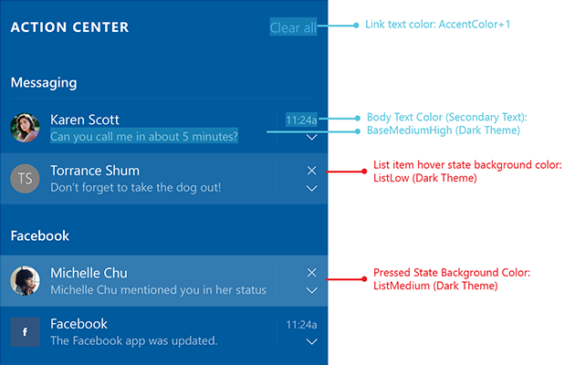
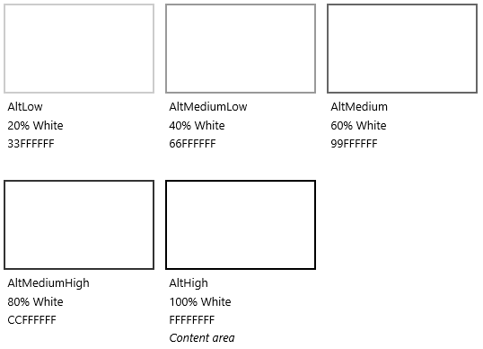
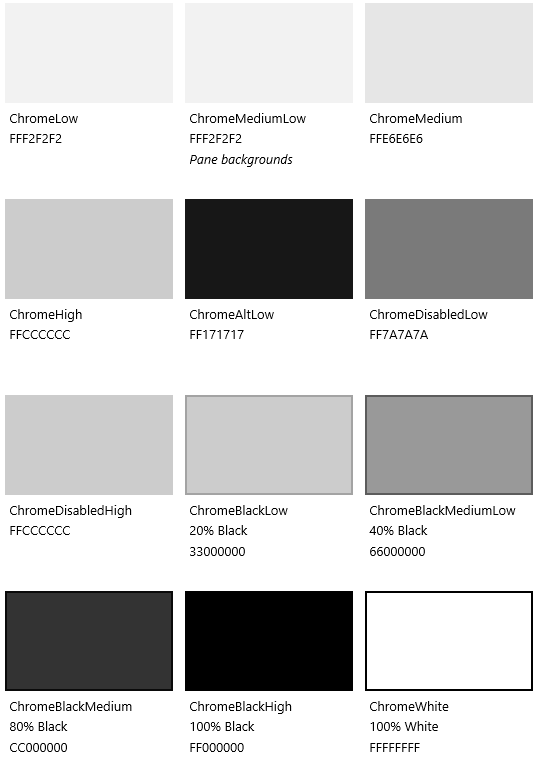

# <a name="color"></a>Cor

<link rel="stylesheet" href="https://az835927.vo.msecnd.net/sites/uwp/Resources/css/custom.css">

As cores tornam a orientação intuitiva por meio de vários níveis de informações de um app e são uma ferramenta essencial para reforçar o modelo de interação.

No Windows, a cor também é pessoal. Os usuários podem escolher uma cor e um tema claro ou escuro para serem refletidos em toda a sua experiência.

## <a name="accent-color"></a>Cor de destaque

O usuário pode selecionar uma única cor chamada de destaque em *Configurações > Personalização > Cores*. Eles têm a opção de um conjunto administrado de 48 amostras de cores, exceto no Xbox, que tem uma paleta de 21 cores seguras para a TV.

### <a name="default-accent-colors"></a>Cores de destaque padrão
<table class="uwpd-color-table" style="border: solid 4px white;">
        <tr >
            <td class="uwpd-color-table" style="background-color: #FFB900">FFB900</td>
            <td class="uwpd-color-table" style=" background-color: #E74856">E74856</td>
            <td class="uwpd-color-table" style=" background-color: #0078D7">0078D7</td>
            <td class="uwpd-color-table" style=" background-color: #0099BC">0099BC</td>
            <td class="uwpd-color-table" style=" background-color: #7A7574">7A7574</td>
            <td class="uwpd-color-table" style=" background-color: #767676">767676</td>
        </tr>
        <tr >
            <td class="uwpd-color-table" style=" background-color: #FF8C00">FF8C00</td>
            <td class="uwpd-color-table" style=" background-color: #E81123">E81123</td>
            <td class="uwpd-color-table" style=" background-color: #0063B1">0063B1</td>
            <td class="uwpd-color-table" style=" background-color: #2D7D9A">2D7D9A</td>
            <td class="uwpd-color-table" style=" background-color: #5D5A58">5D5A58</td>
            <td class="uwpd-color-table" style=" background-color: #4C4A48" >4C4A48</td>
        </tr>
        <tr >
            <td class="uwpd-color-table" style=" background-color: #F7630C" >F7630C</td>
            <td class="uwpd-color-table" style=" background-color: #EA005E" >EA005E</td>
            <td class="uwpd-color-table" style=" background-color: #8E8CD8" >8E8CD8</td>
            <td class="uwpd-color-table" style=" background-color: #00B7C3" >00B7C3</td>
            <td class="uwpd-color-table" style=" background-color: #68768A" >68768A</td>
            <td class="uwpd-color-table" style=" background-color: #69797E" >69797E</td>
        </tr>
        <tr >
            <td class="uwpd-color-table" style=" background-color: #CA5010" >CA5010</td>
            <td class="uwpd-color-table" style=" background-color: #C30052" >C30052</td>
            <td class="uwpd-color-table" style=" background-color: #6B69D6" >6B69D6</td>
            <td class="uwpd-color-table" style=" background-color: #038387" >038387</td>
            <td class="uwpd-color-table" style=" background-color: #515C6B" >515C6B</td>
            <td class="uwpd-color-table" style=" background-color: #4A5459" >4A5459</td>
        </tr>
        <tr >
            <td class="uwpd-color-table" style=" background-color: #DA3B01" >DA3B01</td>
            <td class="uwpd-color-table" style=" background-color: #E3008C" >E3008C</td>
            <td class="uwpd-color-table" style=" background-color: #8764B8" >8764B8</td>
            <td class="uwpd-color-table" style=" background-color: #00B294" >00B294</td>
            <td class="uwpd-color-table" style=" background-color: #567C73" >567C73</td>
            <td class="uwpd-color-table" style=" background-color: #647C64" >647C64</td>
        </tr>
        <tr >
            <td class="uwpd-color-table" style=" background-color: #EF6950" >EF6950</td>
            <td class="uwpd-color-table" style=" background-color: #BF0077" >BF0077</td>
            <td class="uwpd-color-table" style=" background-color: #744DA9" >744DA9</td>
            <td class="uwpd-color-table" style=" background-color: #018574" >018574</td>
            <td class="uwpd-color-table" style=" background-color: #486860" >486860</td>
            <td class="uwpd-color-table" style=" background-color: #525E54" >525E54</td>
        </tr>
        <tr >
            <td class="uwpd-color-table" style=" background-color: #D13438" >D13438</td>
            <td class="uwpd-color-table" style=" background-color: #C239B3" >C239B3</td>
            <td class="uwpd-color-table" style=" background-color: #B146C2" >B146C2</td>
            <td class="uwpd-color-table" style=" background-color: #00CC6A" >00CC6A</td>
            <td class="uwpd-color-table" style=" background-color: #498205" >498205</td>
            <td class="uwpd-color-table" style=" background-color: #847545" >847545</td>
        </tr>
        <tr >
            <td class="uwpd-color-table" style=" background-color: #FF4343" >FF4343</td>
            <td class="uwpd-color-table" style=" background-color: #9A0089" >9A0089</td>
            <td class="uwpd-color-table" style=" background-color: #881798" >881798</td>
            <td class="uwpd-color-table" style=" background-color: #10893E" >10893E</td>
            <td class="uwpd-color-table" style=" background-color: #107C10" >107C10</td>
            <td class="uwpd-color-table" style=" background-color: #7E735F" >7E735F</td>
        </tr>

</table>

### <a name="xbox-accent-colors"></a>Cores de destaque do Xbox
  <table class="uwpd-color-table" style="border: solid 4px white;">
      <tr >
          <td class="uwpd-color-table" style="background-color: #EB8C10" >EB8C10</td>
          <td class="uwpd-color-table" style="background-color: #ED5588" >ED5588</td>
          <td class="uwpd-color-table" style="background-color: #1073D6" >1073D6</td>
          <td class="uwpd-color-table" style="background-color: #148282" >148282</td>
          <td class="uwpd-color-table" style="background-color: #107C10" >107C10</td>
          <td class="uwpd-color-table" style="background-color: #4C4A4B" >4C4A4B</td>
      </tr>
      <tr >
          <td class="uwpd-color-table" style="background-color: #EB4910" >EB4910</td>
          <td class="uwpd-color-table" style="background-color: #BF1077" >BF1077</td>
          <td class="uwpd-color-table" style="background-color: #193E91" >193E91</td>
          <td class="uwpd-color-table" style="background-color: #54A81B" >54A81B</td>
          <td class="uwpd-color-table" style="background-color: #737373" >737373</td>
          <td class="uwpd-color-table" style="background-color: #7E715C" >7E715C</td>
      </tr>
      <tr >
          <td class="uwpd-color-table" style="background-color: #E31123" >E31123</td>
          <td class="uwpd-color-table" style="background-color: #B144C0" >B144C0</td>
          <td class="uwpd-color-table" style="background-color: #1081CA" >1081CA</td>
          <td class="uwpd-color-table" style="background-color: #547A72" >547A72</td>
          <td class="uwpd-color-table" style="background-color: #677488" >677488</td>
          <td class="uwpd-color-table" style="background-color: #724F2F" >724F2F</td>
      </tr>
      <tr >
          <td class="uwpd-color-table" style="background-color: #A21025" >A21025</td>
          <td class="uwpd-color-table" style="background-color: #744DA9" >744DA9</td>
          <td class="uwpd-color-table" style="background-color: #108272" >108272</td>
          <td class="uwpd-color-table"></td>
          <td class="uwpd-color-table"></td>
          <td class="uwpd-color-table"></td>
      </tr>
  </table>


<div class="microsoft-internal-note">
Como regra geral, quando a cor de destaque é usada como plano de fundo, sempre use texto branco sobre ela. A cor de destaque padrão que é fornecida com o Windows oferece excelente contraste com texto branco. Um usuário pode selecionar uma cor de destaque que tenha um contraste ruim com o branco de acordo com suas preferências, e isso é normal. Se tiver problema para ler, ele poderá selecionar uma cor de destaque mais escura.
</div>


Quando os usuários escolhem uma cor de destaque, ela aparece como parte do tema do sistema. As áreas afetadas são a tela inicial, a barra de tarefas, o cromado de janela, estados de interação selecionados e hiperlinks dentro de [controles comuns](../controls-and-patterns/index.md). Cada app pode incorporar ainda mais a cor de destaque em suas tipografias, planos de fundo e interações, ou ainda anulá-la para preservar sua identidade visual específica.

## <a name="color-palette-building-blocks"></a>Blocos de construção da paleta de cores

Depois que uma cor de destaque é selecionada, tonalidades claras e escuras dessa cor são criadas com base nos valores HSB de luminosidade de cor. Aplicativos podem usar variações de tonalidades para criar uma hierarquia visual e fornecer uma indicação de interação.

Por padrão, os hiperlinks usarão a cor de destaque do usuário. Se o plano de fundo de página tiver uma cor semelhante, você poderá optar por atribuir um tom de destaque mais claro (ou mais escuro) para os hiperlinks terem um contraste melhor.


<div class="uwpd-image-with-caption">
    
    <div>Os diversos tons de claro/escuro da cor de destaque padrão.</div>
</div>

<div class="uwpd-image-with-caption">
    
    <div>Um exemplo de como a lógica de cor é aplicada a uma especificação de design.</div>
</div>

>[!NOTE]
>Em XAML, a cor de destaque principal é exposta como um [recurso de tema](https://msdn.microsoft.com/library/windows/apps/Mt187274.aspx) denominado `SystemAccentColor`. Os tons estão disponíveis como `SystemAccentColorLight3`, `SystemAccentColorLight2`, `SystemAccentColorLight1`, `SystemAccentColorDark1`, `SystemAccentColorDark2` e `SystemAccentColorDark3`. Também disponível por meio de programação via [UISettings.GetColorValue](https://msdn.microsoft.com/library/windows/apps/windows.ui.viewmanagement.uisettings.getcolorvalue.aspx) e a enumeração [UIColorType](https://msdn.microsoft.com/library/windows/apps/windows.ui.viewmanagement.uicolortype.aspx).


## <a name="color-theming"></a>Temas de cores

O usuário também pode escolher entre um tema claro ou escuro para o sistema. Alguns apps optam por modificar seus temas com base na preferência do usuário, enquanto outros se recusam a fazer isso.

Aplicativos que usam o tema claro são para cenários que envolvem apps de produtividade. Exemplos seriam o pacote de apps disponíveis com o Microsoft Office. O tema claro facilita a leitura de textos longos em conjunto com longos períodos de tempo em uma determinada tarefa.

O tema escuro permite um contraste mais visível de conteúdo para apps centrados em mídia ou cenários em que os usuários uma grande variedade de vídeos ou imagens é apresentada ao usuário. Nesses cenários, a leitura não é necessariamente a principal tarefa, embora a experiência de assistir a um filme possa ser, e o conteúdo é mostrado em condições de pouca luz ambiente.

Se o seu app não se enquadra exatamente em nenhuma dessas descrições, considere seguir o tema do sistema para permitir que o usuário decida qual é a opção ideal para ele.

Para facilitar o design de temas, o Windows fornece uma paleta de cores adicional que se adapta automaticamente ao tema.

### <a name="light-theme"></a>Tema claro
#### <a name="base"></a>Base

#### <a name="alt"></a>Alt

#### <a name="list"></a>Lista

#### <a name="chrome"></a>Cromado

### <a name="dark-theme"></a>Tema escuro
#### <a name="base"></a>Base

#### <a name="alt"></a>Alt

#### <a name="list"></a>Lista

#### <a name="chrome"></a>Cromado


## <a name="changing-the-theme"></a>Alterando o tema

Você pode alterar temas facilmente alterando a propriedade **RequestedTheme** em seu App.xaml:

```XAML
<Application
    x:Class="App9.App"
    xmlns="http://schemas.microsoft.com/winfx/2006/xaml/presentation"
    xmlns:x="http://schemas.microsoft.com/winfx/2006/xaml"
    xmlns:local="using:App9"
    RequestedTheme="Dark">

</Application>
```

Remover **RequestedTheme** significa que seu app manterá as configurações de modo de app do usuário, e eles poderão optar por exibir seu app no tema escuro ou claro. 

Certifique-se de levar o tema em consideração ao criar seu app, uma vez que o tema tem um grande impacto sobre a aparência do seu app.

## <a name="accessibility"></a>Acessibilidade

Nossa paleta é otimizada para uso na tela. Convém manter uma proporção de contraste para o texto de 4.5: 1 contra o plano de fundo para permitir uma leitura ideal. Existem muitas ferramentas gratuitas disponíveis para testar se as suas cores são aprovadas ou não, tais como [Índice de Contraste](http://leaverou.github.io/contrast-ratio/).

## <a name="related-articles"></a>Artigos relacionados

* [Estilos de XAML](https://msdn.microsoft.com/windows/uwp/controls-and-patterns/xaml-theme-resources)
* [Recursos de temas XAML](https://msdn.microsoft.com/windows/uwp/controls-and-patterns/xaml-theme-resources)

