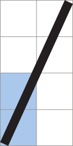
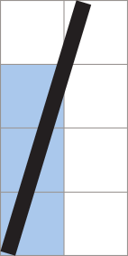
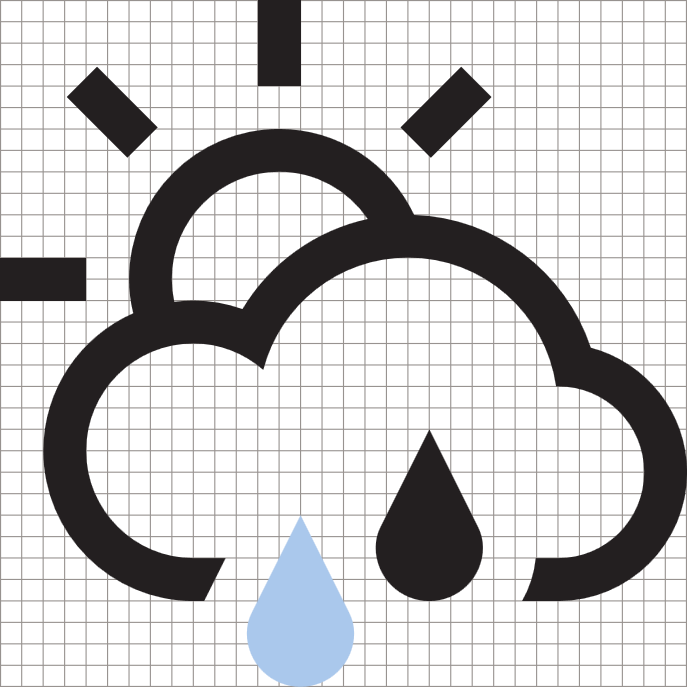
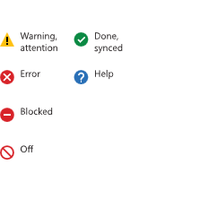
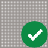

# Ícones para aplicativos UWP

Ícones bons se harmonizam com a tipografia e com o restante da linguagem do design. Eles não misturam metáforas e comunicam apenas o que é necessário, com a máxima rapidez e simplicidade possível. 

## Rampas de tamanho de dimensionamento linear 

<table>
    <tr> 
        <td>16px x 16px</td>
        <td>24px x 24px</td>
        <td>32px x 32px</td>
        <td>48px x 48px</td>
    </tr>
    <tr> 
        <td></td>
        <td></td>
        <td></td>
        <td></td>
    </tr>
</table>

## Formas comuns

Os ícones geralmente devem maximizar o espaço fornecido com pouco preenchimento. Essas formas fornecem pontos de partida para dimensionamento de formas básicas. 

Use a forma que corresponda à orientação do ícone e componha ao redor desses parâmetros básicos. Os ícones não necessariamente precisam preencher ou se encaixar completamente dentro da forma e podem ser ajustados conforme necessário para garantir um equilíbrio ideal. 

<table>
    <tr>
        <td>Círculo<td>
        <td>Quadrado</td>
        <td>Triângulo</td>
    </tr>
    <tr>
        <td><td>
        <td></td>
        <td></td>
    </tr>
        <tr>
        <td>Retângulo horizontal<td>
        <td colspan="2">Retângulo vertical</td>        
        </tr>
    <tr>
        <td><td>
        <td colspan="2"></td>
         
    </tr>

</table>

## Ângulos

Além de usar a mesma grade e peso da linha, os ícones são construídos com elementos comuns. 

Usar somente esses ângulos na criação de formas cria consistência entre todos os nossos ícones e garante que os ícones sejam renderizados corretamente. 

Essas linhas podem ser combinadas, unidas, giradas e refletidas para criar ícones. 

<table>
    <tr>
        <td>**1:1** 45 °</td>
        <td>**1:2** 26,57 ° (vertical) 63,43 ° (horizontal)</td>
        <td>**1:3** 18,43 ° (vertical) 71,57 ° (horizontal)</td>
        <td>**1:4** 14,04 ° (vertical) 75,96 ° (horizontal)</td>
    </tr>
    <tr>
        
        <td></td>
        <td></td>
        <td></td>
        <td></td>
    </tr>  
</table>

Veja alguns exemplos:

<table>
    <tr>
        <td></td>
        <td></td>
        <td></td>
        <td></td>
    </tr>
</table>

## Curvas

Linhas curvas são construídas a partir das seções de um círculo completo e não devem ser inclinadas, a menos que necessário para o ajuste na grade de pixels. 

<table>
    <tr>
        <td>1/4 de círculo</td>
        <td>1/8 de círculo</td>
    </tr>
    <tr>
        <td></td>
        <td></td>
    </tr>
    <tr>
        <td></td>
        <td></td>
    </tr>    
</table>

## Construção geométrica

É recomendável usar somente formas geométricas puras ao construir ícones.

## Formas preenchidas 

Os ícones podem conter formas preenchidas quando necessário, mas eles não devem ser maiores que 4px em 32px × 32px. Os círculos preenchidos não devem ser maiores que 6px × 6px. 

## Selos

Um "selo" é um termo genérico usado para descrever um elemento adicionado a um ícone que não deve ser integrado com o elemento de ícone base. Elas geralmente transmitem outras partes de informações sobre o ícone como o status ou a ação. Outros termos comuns incluem: sobreposição, anotação ou modificador. 

Os selos de status utilizam um objeto preenchido colorido que está sobre o ícone, enquanto os selos de ação são integrados ao ícone no mesmo estilo monocromático e peso de linha.

<table>
<tr>
    <td>Selos de status comuns</td>
    <td>Selos de ações comuns</td>
</tr>
<tr>
    <td></td>
    <td></td>
</tr>
</table>

### Cor do selo 

Os selos coloridos devem ser usados apenas para transmitir o estado de um ícone. As cores usadas nos selos de status transmitem mensagens emocionais específicas para o usuário. 

<table>
<tr><td>Verde - #128B44</td><td>Azul - #2C71B9</td><td>Amarelo - #FDC214</td></tr>
<tr><td>Positivo: feito, concluído </td><td>Neutro: ajuda, notificação </td><td>Advertência: alerta, aviso </td></tr>
<tr><td></td><td></td>
<td></td></tr>
</table>

### Posição do selo

O padrão de posição de qualquer status ou ação é o canto inferior direito. Use as outras posições apenas quando o design não permitir isso. 

### Dimensionamento do selo

Os selos devem ser dimensionados com 10 a 18 px em uma grade de 32px x 32px. 

## Artigos relacionados

* [Diretrizes de ativos de bloco e ícone](../controls-and-patterns/tiles-and-notifications-app-assets.md)

<!--HONumber=Jun16_HO4-->

