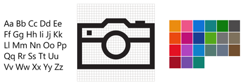

<link rel="stylesheet" href="https://az835927.vo.msecnd.net/sites/uwp/Resources/css/custom.css"> 

<h1 class="uwpd-ruledheader">Guia de estilo da UWP</h1>

  

  
Diretrizes de design e exemplos de código que ensinam como definir a personalidade de seu aplicativo UWP por meio de cores, tipografia e movimento.

  

  

    
  

  

   
<b>[Cor](color.md)</b> 
As cores tornam a orientação intuitiva por meio de vários níveis de informações de um aplicativo e são uma ferramenta essencial para reforçar o modelo de interação.

  

  

   
<b>[Ícones](icons.md)</b> 
Ícones bons se harmonizam com a tipografia e com o restante da linguagem do design. Eles não misturam metáforas e comunicam apenas o que é necessário, com a máxima rapidez e simplicidade possível.

  

  

   
<b>[Movimento](motion.md)</b> 
Animações significativas e bem desenvolvidas dão vida aos aplicativos e tornam a experiência avançada e refinada. Ajude os usuários a entenderem as alterações de contexto e vincule experiências com transições visuais.

  

  

   
<b>[Som](sound.md)</b> 
O som ajuda a completar a experiência do usuário do aplicativo e dá a eles aquele toque extra de áudio para combinar com a personalidade do Windows em todas as plataformas.

  

  

   
<b>[Tipografia](typography.md)</b> 
Como a representação visual da linguagem, a tarefa principal da tipografia é ser clara. Seu estilo nunca deve atrapalhar essa meta. Porém, a tipografia também tem um papel importante como componente de layout, pois afeta consideravelmente a densidade e a complexidade do design, além de exercer forte influência na experiência do usuário desse design.

   

   <ul>
    <li>[Fontes](fonts.md)</li>
    <li>[Ícones Segoe MDL2](segoe-ui-symbol-font.md)</li>
   </ul>
   

  

  
  
  

   
<b>[Aplicando estilos a controles](../controls-and-patterns/styling-controls.md)</b> 
É possível personalizar a aparência de seus aplicativos de muitas formas usando a estrutura XAML. Os estilos permitem definir propriedades de controle e reutilizar essas configurações para criar uma aparência consistente em vários controles.

  

<!--HONumber=Jul16_HO2-->

