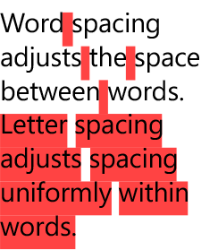
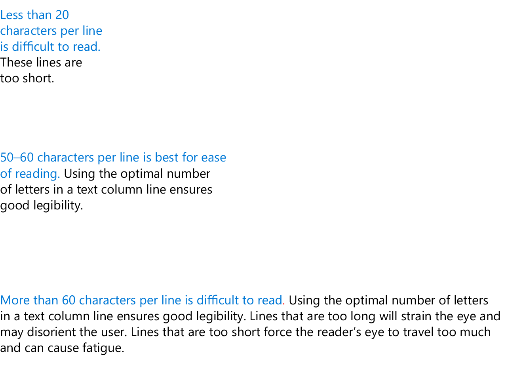

# <a name="typography"></a>Typography

<link rel="stylesheet" href="https://az835927.vo.msecnd.net/sites/uwp/Resources/css/custom.css"> 

Como a representação visual da linguagem, a tarefa principal da tipografia é ser clara. Seu estilo nunca deve atrapalhar essa meta. Porém, a tipografia também tem um papel importante como componente de layout, pois afeta consideravelmente a densidade e a complexidade do design, além de exercer forte influência na experiência do usuário desse design.

## <a name="typeface"></a>Face de tipos

Selecionamos Segoe UI para uso em todos os designs digitais da Microsoft. A Segoe UI fornece uma ampla variedade de caracteres e é projetada para manter a legibilidade ideal em todos os tamanhos e densidades de pixel. Ela oferece uma estética limpa, leve e aberta que complementa o conteúdo do sistema.


## <a name="weights"></a>Espessuras

Abordamos a tipografia em busca de simplicidade e eficiência. Podemos optar por usar uma face de tipos, um mínimo de espessuras e tamanhos e uma hierarquia clara. O posicionamento e o alinhamento seguem o estilo padrão do idioma específico. Em inglês, a sequência é executada da esquerda para a direita, de cima para baixo. As relações entre texto e imagens são claras e simples.


## <a name="line-spacing"></a>Espaçamento entre linhas


O espaçamento entre linhas deve ser calculado em 125% do tamanho da fonte, arredondando para o múltiplo mais próximo de quatro, quando necessário. Por exemplo, com Segoe UI 15 px, 125% de 15 px é 18,75 px. Recomendamos o arredondamento e a definição da altura da linha como 20 px para permanecer na grade 4 px. Isso garante uma experiência de leitura boa e espaço adequado para as marcas diacríticas. Veja a seção Rampa de tipos abaixo para obter exemplos específicos.

Ao empilhar um tipo maior sobre um tipo menor, a distância da última linha de base do tipo maior para a primeira linha de base do tipo menor deve ser igual à altura da linha do tipo maior.


Em XAML, isso é feito empilhando dois [TextBlocks](https://msdn.microsoft.com/en-us/library/windows/apps/windows.ui.xaml.controls.textblock.aspx) e definindo a margem apropriada.

```xaml
<StackPanel Width="200">
    <!-- Setting a bottom margin of 3px on the header
         puts the baseline of the body text exactly 24px
         below the baseline of the header. 24px is the
         recommended line height for a 20px font size,
         which is what’s set in SubtitleTextBlockStyle.
         The bottom margin will be different for
         different font size pairings. -->
    <TextBlock
        Style="{StaticResource SubtitleTextBlockStyle}"
        Margin="0,0,0,3"
        Text="Header text" />
    <TextBlock
        Style="{StaticResource BodyTextBlockStyle}"
        TextWrapping="Wrap"
        Text="This line of text should be positioned where the above header would have wrapped." />
</StackPanel>
```


<div class="side-by-side">
<div class="side-by-side-content">
  <div class="side-by-side-content-left">
<h2>Kerning e tracking</h2>

Segoe é uma face de tipos humanista, com uma aparência suave e amigável, ela tem formatos orgânicos e abertos com base em texto manuscrito. Para garantir legibilidade ótima e manter a integridade humanista, as configurações de kerning e rastreamento devem ter valores específicos.

Kerning deve ser definido como "métricas" e tracking deve ser definido como "0".
  </div>
  <div class="side-by-side-content-right">
<h2>Espaçamento entre letras e palavras</h2>

Semelhante ao kerning e tracking, o espaçamento entre letras e o espaçamento entre palavras usam configurações específicas para garantir a legibilidade ideal e a integridade humanista.

O espaçamento entre palavras por padrão sempre é 100% e o espaçamento entre letras deve ser definido como "0".
  </div>
</div>
</div>
<div class="side-by-side">
<div class="side-by-side-content">
  <div class="side-by-side-content-left">
  
  </div>
  <div class="side-by-side-content-right">
 
  </div>
</div>
</div>


>[!NOTE]
>Em um controle de texto XAML use [Typogrphy.Kerning](https://msdn.microsoft.com/library/windows/apps/windows.ui.xaml.documents.typography.kerning.aspx) para controlar kerning e [FontStretch](https://docs.microsoft.com/uwp/api/Windows.UI.Xaml.Controls.Control#Windows_UI_Xaml_Controls_Control_FontStretch) para controlar o rastreamento. Por padrão Typography.Kerning é definido como "true" e FontStretch é definido como "Normal", que são os valores recomendados.

<div class="side-by-side">
<div class="side-by-side-content">
  <div class="side-by-side-content-left">
<h2>Alinhamento</h2>

Em geral, recomendamos que os elementos visuais e as colunas de tipo sejam alinhados à esquerda. Na maioria dos casos, essa abordagem flush à esquerda e irregular à direita fornece ancoragem consistente do conteúdo e um layout uniforme. 
  </div>
  <div class="side-by-side-content-right">
<h2>Terminações de linha</h2>

Quando a tipografia não está posicionada como flush à esquerda e irregular à direita, tente garantir terminações de linha pares e evitar a hifenização.
  </div>
</div>
</div>

<div class="side-by-side">
<div class="side-by-side-content">
  <div class="side-by-side-content-left">
  
  </div>
  <div class="side-by-side-content-right">
 
  </div>
</div>
</div>


## <a name="paragraphs"></a>Parágrafos

Para fornecer bordas de coluna alinhada, os parágrafos devem ser indicados, ignorando uma linha sem recuo.


## <a name="character-count"></a>Contagem de caracteres

Se uma linha for muito curta, o olho terá que se deslocar muito frequentemente à esquerda e à direita, quebrando o ritmo do leitor. Se possível, de 50 a 60 letras por linha é melhor para facilitar a leitura.

Segoe fornece uma ampla variedade de caracteres e é projetada para manter a legibilidade ideal em tamanhos pequenos e grandes, bem como densidades de pixel altas e baixas. Usar o número ideal de letras em uma linha de coluna de texto garante uma legibilidade boa em um aplicativo.

Linhas muito longas afetam a atenção e podem confundir o usuário. Linhas muito curtas forçam o olho do leitor a se deslocar muito e podem causar fadiga.



## <a name="hanging-text-alignment"></a>Alinhamento de texto deslocado

O alinhamento horizontal dos ícones com texto pode ser manipulado de diversas maneiras, dependendo do tamanho do ícone e da quantidade de texto. Quando o texto, uma ou várias linhas, se encaixa dentro da altura do ícone, o texto deve ser centralizado verticalmente.

Depois que a altura do texto se estende além da altura do ícone, a primeira linha de texto deve se alinhar verticalmente e o texto adicional deve fluir naturalmente para baixo. Ao usar caracteres com limite maior, aumentar e diminuir alturas, tome cuidado para observar as mesmas diretrizes de alinhamento.


>[!NOTE]
>A propriedade [TextBlock.TextLineBounds](https://msdn.microsoft.com/en-us/library/windows/apps/windows.ui.xaml.controls.textblock.textlinebounds.aspx) de XAML fornece acesso às medidas de fonte iniciais e de limite de altura. Ela pode ser usada para o tipo de alinhamento superior, central ou vertical.

## <a name="clipping-and-ellipses"></a>Recorte e elipses

Recorte por padrão: pressuponha que o texto será ajustado, a menos que a linha vermelha especifique o contrário. Ao usar texto sem disposição, recomendamos o recorte em vez do uso de elipses. O recorte pode ocorrer na borda do contêiner, na borda do dispositivo, na borda de uma barra de rolagem, etc.

Exceções: para contêineres que não são bem definidos (por exemplo, nenhuma cor da tela de fundo diferente), o texto sem disposição pode ter uma linha vermelha para uso da elipse "…".


## <a name="type-ramp"></a>Rampa de tipos
A rampa de tipos estabelece uma relação de design fundamental dos títulos ao texto do corpo e garante uma hierarquia clara e compreensível entre os diferentes níveis. Essa hierarquia cria uma estrutura que permite aos usuários navegar facilmente por meio de comunicação escrita.

<div class="uwpd-image-with-caption">
    
    <div>Todos os tamanhos estão em pixels efetivos. Para obter mais detalhes, consulte [Introdução ao design de aplicativos UWP](../layout/design-and-ui-intro.md).</div>
</div>

>[!NOTE]
>A maioria dos níveis de rampa está disponível como [recursos estáticos](https://msdn.microsoft.com/en-us/library/windows/apps/Mt187274.aspx#the_xaml_type_ramp) XAML que seguem a convenção de nomenclatura `*TextBlockStyle` (por ex.: `HeaderTextBlockStyle`).


<!--
<div class="microsoft-internal-note">
SubtitleAlt, BaseAlt, and CaptionAlt are not currently included. You can create the styles in your own app following the code snippets in the above link. Also note that XAML does not currently match the line height exactly.
</div>
-->


## <a name="primary-and-secondary-text"></a>Texto principal e secundário

Para criar hierarquia adicional além da rampa de tipos, defina o texto secundário com opacidade de 60%. Na [paleta de cores de temas](color.md#color-theming), você usaria BaseMedium. O texto principal deve ter sempre 100% de opacidade ou BaseHigh.

<!-- Need new images

Recommended use of SubtitleAlt. Also note the primary and secondary text usage in list items.


Recommended use of CaptionAlt.
-->

## <a name="all-caps-titles"></a>Títulos em maiúsculas

Determinados títulos de página devem ser em maiúsculas para adicionar outra dimensão de hierarquia. Esses títulos devem usar BaseAlt com o espaçamento entre caracteres definido como 75 milésimos de um eme. Esse tratamento também pode ser usado para ajudar na navegação do aplicativo.

No entanto, nomes próprios mudam seu significado quando estão em maiúsculas em certos idiomas; portanto, títulos de página com base em nomes ou entradas do usuário *não* devem ser convertidos em maiúsculas.


<!-- Need new images

Green shows where all caps should be used. Red shows where it should not.
-->

## <a name="dos-and-donts"></a>O que fazer e o que não fazer
* Usar Corpo para a maioria dos textos
* Usar Base para títulos quando o espaço é limitado
* Incorporar SubtitleAlt para criar contraste e hierarquia, enfatizando o conteúdo de nível superior
* Não usar Legenda para cadeias de caracteres longas ou qualquer ação principal
* Não usar Cabeçalho ou Subcabeçalho se for preciso quebra automática de linha
* Não combinar Subtitle e SubtitleAlt na mesma página


## <a name="related-articles"></a>Artigos relacionados

* [Controles de texto](../controls-and-patterns/text-controls.md)
* [Fontes](fonts.md)
* [Ícones Segoe MDL2](segoe-ui-symbol-font.md)
