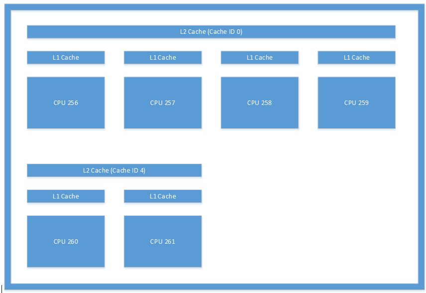

# <a name="cpusets-for-game-development"></a>CPUSets para desenvolvimento de jogos

## <a name="introduction"></a>Introdução

A Plataforma Universal do Windows (UWP) é o núcleo de uma ampla variedade de dispositivos eletrônicos. Dessa forma, ela requer uma API de finalidade geral para atender às necessidades de todos os tipos de aplicativos, desde jogos e aplicativos incorporados a software corporativo executado em servidores. Aproveitando as informações certas fornecidas pela API, você pode garantir que seu jogo seja executado com o melhor desempenho em qualquer hardware.

## <a name="cpusets-api"></a>API CPUSets

A API CPUSets proporciona controle de quais conjuntos de CPU estão disponíveis para agendamento de threads. Duas funções estão disponíveis para controlar onde os threads são agendados:
- **SetProcessDefaultCpuSets** – essa função pode ser usada para especificar em quais conjuntos de CPU novos threads poderão ser executados se não forem atribuídos a conjuntos de CPU específicos.
- **SetThreadSelectedCpuSets** – essa função permite que você limite os conjuntos de CPU nos quais um thread específico pode ser executado.

Se a função **SetProcessDefaultCpuSets** nunca for usada, os threads recém-criados poderão ser agendados em qualquer conjunto de CPU que esteja disponível para seu processo. Esta seção aborda as noções básicas sobre a API CPUSets.

### <a name="getsystemcpusetinformation"></a>GetSystemCpuSetInformation

A primeira API usada para coletar informações é a função **GetSystemCpuSetInformation**. Essa função preenche informações em uma matriz de objetos **SYSTEM_CPU_SET_INFORMATION** fornecidos pelo código de título. A memória para o destino deve ser alocada pelo código do jogo, cujo tamanho é determinado chamando a própria **GetSystemCpuSetInformation**. Isso exige duas chamadas para **GetSystemCpuSetInformation** conforme demonstrado no exemplo a seguir.

```
unsigned long size;
HANDLE curProc = GetCurrentProcess();
GetSystemCpuSetInformation(nullptr, 0, &size, curProc, 0);

std::unique_ptr<uint8_t[]> buffer(new uint8_t[size]);

PSYSTEM_CPU_SET_INFORMATION cpuSets = reinterpret_cast<PSYSTEM_CPU_SET_INFORMATION>(buffer.get());
  
GetSystemCpuSetInformation(cpuSets, size, &size, curProc, 0);
```

Cada instância do **SYSTEM_CPU_SET_INFORMATION** retornado contém informações sobre uma unidade de processamento exclusiva, também conhecida como um conjunto de CPU. Isso não significa necessariamente que ela represente um pedaço físico exclusivo de hardware. As CPUs que usam hyperthreading terão vários núcleos lógicos em execução em um único núcleo de processamento físico. O agendamento de vários threads em diferentes núcleos lógicos que residem no mesmo núcleo físico permite a otimização de recursos no nível de hardware o que, de outra forma, exigiria trabalho extra no nível do kernel. Dois threads agendados em núcleos lógicos separados no mesmo núcleo físico devem compartilhar o tempo de CPU, mas seriam executados com mais eficiência do que se eles fossem agendados para o mesmo núcleo lógico.

### <a name="systemcpusetinformation"></a>SYSTEM_CPU_SET_INFORMATION

As informações em cada instância dessa estrutura de dados retornados do **GetSystemCpuSetInformation** contêm informações sobre uma unidade de processamento exclusiva na qual os threads podem ser agendados. Devido à possível variedade de dispositivos de destino, muitas informações na estrutura de dados **SYSTEM_CPU_SET_INFORMATION** podem não ser aplicáveis ao desenvolvimento de jogos. A Tabela 1 fornece uma explicação sobre os membros de dados que são úteis para o desenvolvimento de jogos.

 **Tabela 1. Membros de dados úteis para o desenvolvimento de jogos.**

| Nome do membro  | Tipo de dados | Descrição |
| ------------- | ------------- | ------------- |
| Tipo  | CPU_SET_INFORMATION_TYPE  | O tipo de informação na estrutura. Se o valor disso não for **CpuSetInformation**, deverá ser ignorado.  |
| Id  | longo não atribuído  | A ID do conjunto de CPU especificado. Essa é a ID que deve ser usada com funções de conjunto de CPU como **SetThreadSelectedCpuSets**.  |
| Grupo  | curto não assinado  | Especifica o "grupo de processador" do conjunto de CPU. Grupos de processador permitem que um computador tenha mais de 64 núcleos lógicos e permitem o intercâmbio de CPUs enquanto o sistema está em execução. É incomum ver um computador que não seja um servidor com mais de um grupo. A menos que você esteja criando aplicativos para execução em servidores grandes ou farms de servidor, é melhor usar conjuntos de CPU em um único grupo porque a maioria dos computadores dos clientes só terá um grupo de processador. Todos os outros valores nessa estrutura são relativos do grupo.  |
| LogicalProcessorIndex  | caractere sem sinal  | Índice relativo ao grupo do conjunto de CPU  |
| CoreIndex  | caractere sem sinal  | Índice relativo ao grupo do núcleo de CPU físico em que o conjunto de CPU está localizado  |
| LastLevelCacheIndex  | caractere sem sinal  | Índice relativo ao grupo do último cache associado a esse conjunto de CPU. Isso é o cache mais lento, a menos que o sistema utilize nós NUMA, geralmente, o cache L2 ou L3.  |

<br />

Os outros membros de dados fornecem informações que é improvável que descrevam CPUs em computadores de clientes ou outros dispositivos de clientes e dificilmente serão úteis. As informações fornecidas pelos dados retornados, em seguida, podem ser usadas para organizar threads de várias maneiras. A seção [Considerações sobre o desenvolvimento de jogos](#considerations-for-game-development) deste white paper detalha algumas formas de aproveitar esses dados para otimizar a alocação de threads.

Veja a seguir alguns exemplos do tipo de informações coletadas dos aplicativos UWP em execução em vários tipos de hardware.

**Tabela 2. Informações retornadas de um aplicativo UWP em execução em um Microsoft Lumia 950. Este é um exemplo de um sistema que tem vários caches de último nível. O Lumia 950 apresenta um processo do Qualcomm 808 Snapdragon que contém uma CPU ARM Cortex A57 dual core e CPUs ARM Cortex A53 quad core.**

  

**Tabela 3. Informações retornadas de um aplicativo UWP em execução em um computador típico. Este é um exemplo de um sistema que usa hyperthreading; cada núcleo físico tem dois núcleos lógicos no qual os threads podem ser agendados. Nesse caso, o sistema continha uma CPU Intel Xenon E5-2620.**

  

**Tabela 4. Informações retornadas de um aplicativo UWP em execução em um Microsoft Surface Pro 4 quad core. Esse sistema tinha uma CPU Intel Core i5-6300.**

  

### <a name="setthreadselectedcpusets"></a>SetThreadSelectedCpuSets

Agora que as informações sobre os conjuntos de CPU estão disponíveis, elas podem ser usadas para organizar threads. O identificador de um thread criado com **CreateThread** é transmitido para essa função com uma matriz de IDs dos conjuntos de CPU nos quais o thread pode ser agendado. Um exemplo de seu uso é demonstrado no código a seguir.

```
HANDLE audioHandle = CreateThread(nullptr, 0, AudioThread, nullptr, 0, nullptr);
unsigned long cores [] = { cpuSets[0].CpuSet.Id, cpuSets[1].CpuSet.Id };
SetThreadSelectedCpuSets(audioHandle, cores, 2);
```
Neste exemplo, um thread é criado com base em uma função declarada como **AudioThread**. Esse thread, em seguida, pode ser agendado em um dos dois conjuntos de CPU. A propriedade do thread do conjunto de CPU não é exclusiva. Threads que são criados sem serem bloqueados para um determinado conjunto de CPU podem consumir tempo do **AudioThread**. Da mesma forma, outros threads criados também podem ser bloqueados para um ou dois desses conjuntos de CPU posteriormente.

### <a name="setprocessdefaultcpusets"></a>SetProcessDefaultCpuSets

O inverso de **SetThreadSelectedCpuSets** é **SetProcessDefaultCpuSets**. Quando os threads são criados, eles não precisam ser bloqueados em determinados conjuntos de CPU. Se você não quiser que esses threads sejam executados em determinados conjuntos de CPU (os usados por seu thread de renderização ou de áudio, por exemplo), poderá usar essa função para especificar em quais núcleos esses threads podem ser agendados.

## <a name="considerations-for-game-development"></a>Considerações sobre o desenvolvimento de jogos

Como vimos, a API CPUSets fornece muitas informações e flexibilidade quando se trata de agendamento de threads. Em vez de usar a abordagem de baixo para cima de tentar encontrar usos para esses dados, é mais eficaz usar a abordagem de cima para baixo de descobrir como os dados podem ser usados para acomodar cenários comuns.

### <a name="working-with-time-critical-threads-and-hyperthreading"></a>Trabalhando com e threads críticos em termos de tempo e hyperthreading

Este método será eficaz se seu jogo tiver alguns threads que devem ser executados em tempo real com outros threads de trabalho que exigem relativamente pouco tempo de CPU. Algumas tarefas, como música contínua em segundo plano, devem ser executadas sem interrupção a fim de proporcionar uma experiência de jogo ideal. Até mesmo um único quadro da privação para um thread de áudio pode causar falhas ou exibir pop-ups, portanto, é fundamental que ele receba a quantidade necessária de tempo de CPU em cada quadro.

O uso de **SetThreadSelectedCpuSets** com **SetProcessDefaultCpuSets** pode garantir que os threads de trabalho não interrompam seus threads pesados. **SetThreadSelectedCpuSets** pode ser usado para atribuir seus threads pesados a conjuntos de CPU específicos. **SetProcessDefaultCpuSets**, em seguida, pode ser usado para garantir que todos os threads não atribuídos criados sejam colocados em outro conjunto de CPU. No caso de CPUs que usem hyperthreading, também é importante levar em conta os núcleos lógicos no mesmo núcleo físico. Threads de trabalho não devem ser executados em núcleos lógicos que compartilham o mesmo núcleo físico que um thread que você deseja executar com capacidade de resposta em tempo real. O código a seguir demonstra como determinar se um computador usa hyperthreading.

```
unsigned long retsize = 0;
(void)GetSystemCpuSetInformation( nullptr, 0, &retsize,
    GetCurrentProcess(), 0);
 
std::unique_ptr<uint8_t[]> data( new uint8_t[retsize] );
if ( !GetSystemCpuSetInformation(
    reinterpret_cast<PSYSTEM_CPU_SET_INFORMATION>( data.get() ),
    retsize, &retsize, GetCurrentProcess(), 0) )
{
    // Error!
}
 
std::set<DWORD> cores;
std::vector<DWORD> processors;
uint8_t const * ptr = data.get();
for( DWORD size = 0; size < retsize; ) {
    auto info = reinterpret_cast<const SYSTEM_CPU_SET_INFORMATION*>( ptr );
    if ( info->Type == CpuSetInformation ) {
         processors.push_back( info->CpuSet.Id );
         cores.insert( info->CpuSet.CoreIndex );
    }
    ptr += info->Size;
    size += info->Size;
}
 
bool hyperthreaded = processors.size() != cores.size();
```

Se o sistema usa hyperthreading, é importante que o conjunto de CPU padrão não inclua núcleos lógicos no mesmo núcleo físico que threads de tempo real. Se o sistema não usar hyperthreading, só será necessário garantir que os conjuntos de CPU padrão não incluam o mesmo núcleo que o conjunto de CPU que executa seu thread de áudio.

Um exemplo de organização de threads com base em núcleos físicos pode ser encontrado no exemplo de CPUSets disponível no repositório GitHub vinculado na seção [Recursos adicionais](#additional-resources).

### <a name="reducing-the-cost-of-cache-coherence-with-last-level-cache"></a>Reduzir o custo de coerência do cache com o cache de último nível

A coerência de cache é o conceito de que a memória em cache é o mesma em vários recursos de hardware que atuam nos mesmos dados. Se threads forem agendados em núcleos diferentes, mas trabalharem nos mesmos dados, talvez eles trabalhem em cópias separadas desses dados em caches diferentes. Para obter resultados corretos, esses caches devem ser mantidos coerentes uns com os outros. A manutenção da coerência entre vários caches é relativamente cara, mas é necessária para qualquer sistema de vários núcleo operar. Além disso, fica totalmente fora do controle do código de cliente; o sistema subjacente funciona de forma independente para manter caches atualizados acessando recursos de memória compartilhados entre núcleos.

Se seu jogo tiver vários threads que compartilham uma quantidade de dados particularmente grande, você poderá minimizar o custo de coerência de cache garantindo que eles sejam agendados em conjuntos de CPU que compartilham um cache de último nível. O cache de último nível é o cache mais lento disponível para um núcleo em sistemas que não usam nós NUMA. É extremamente raro um computador de jogos utilizar nós NUMA. Se os núcleos não compartilharem um cache de último nível, a manutenção da coerência exigirá o acesso a recursos de memória de nível mais alto, portanto, mais lentos. O bloqueio de dois threads para conjuntos de CPU separados que compartilham um cache e um núcleo físico poderá proporcionar um desempenho ainda melhor do que o agendamento deles em núcleos físicos separados se eles não exigirem mais de 50% do tempo em um determinado quadro. 

Este exemplo de código mostra como determinar se os threads que se comunicam com frequência podem compartilhar um cache de último nível.

```
unsigned long retsize = 0;
(void)GetSystemCpuSetInformation(nullptr, 0, &retsize,
    GetCurrentProcess(), 0);
 
std::unique_ptr<uint8_t[]> data(new uint8_t[retsize]);
if (!GetSystemCpuSetInformation(
    reinterpret_cast<PSYSTEM_CPU_SET_INFORMATION>(data.get()),
    retsize, &retsize, GetCurrentProcess(), 0))
{
    // Error!
}
 
unsigned long count = retsize / sizeof(SYSTEM_CPU_SET_INFORMATION);
bool sharedcache = false;
 
std::map<unsigned char, std::vector<SYSTEM_CPU_SET_INFORMATION>> cachemap;
for (size_t i = 0; i < count; ++i)
{
    auto cpuset = reinterpret_cast<PSYSTEM_CPU_SET_INFORMATION>(data.get())[i];
    if (cpuset.Type == CPU_SET_INFORMATION_TYPE::CpuSetInformation)
    {
        if (cachemap.find(cpuset.CpuSet.LastLevelCacheIndex) == cachemap.end())
        {
            std::pair<unsigned char, std::vector<SYSTEM_CPU_SET_INFORMATION>> newvalue;
            newvalue.first = cpuset.CpuSet.LastLevelCacheIndex;
            newvalue.second.push_back(cpuset);
            cachemap.insert(newvalue);
        }
        else
        {
            sharedcache = true;
            cachemap[cpuset.CpuSet.LastLevelCacheIndex].push_back(cpuset);
        }
    }
}
```

O layout do cache ilustrado na Figura 1 é um exemplo do tipo de layout que você pode ver em um sistema. Esta figura é uma ilustração dos caches encontrados em um Microsoft Lumia 950. A comunicação entre threads que ocorre entre a CPU 256 e a CPU 260 geraria uma sobrecarga significativa porque exigiria que o sistema mantivesse seus caches L2 coerentes.

**Figura 1. Arquitetura de cache encontrada em um dispositivo Microsoft Lumia 950.**



## <a name="summary"></a>Resumo

A API CPUSets disponível para desenvolvimento de UWP fornece uma quantidade considerável de informações e controle sobre as opções de multithreading. As complexidades adicionadas comparadas às APIs de multithread anteriores para desenvolvimento do Windows oferecem uma certa curva de aprendizado, mas, em última análise, a maior flexibilidade permite um melhor desempenho em uma ampla variedade de computadores de clientes e outros destinos de hardware.

## <a name="additional-resources"></a>Recursos adicionais
- [Conjuntos de CPU (MSDN)](https://msdn.microsoft.com/library/windows/desktop/mt186420(v=vs.85).aspx)
- [Exemplo de CPUSets fornecido pelo ATG](https://github.com/Microsoft/Xbox-ATG-Samples/tree/master/Samples/System/CPUSets)
- [UWP no Xbox One](index.md)

