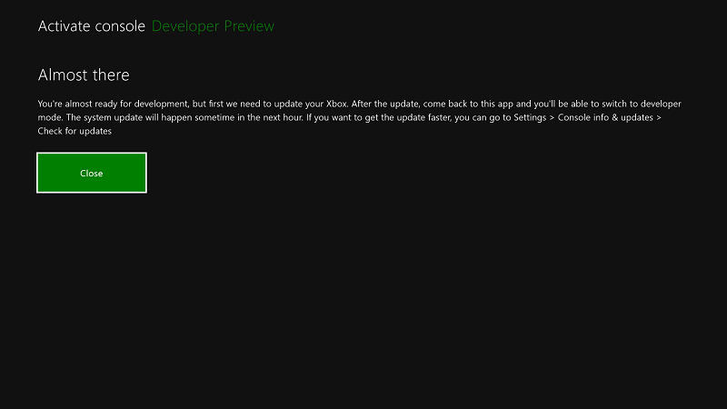
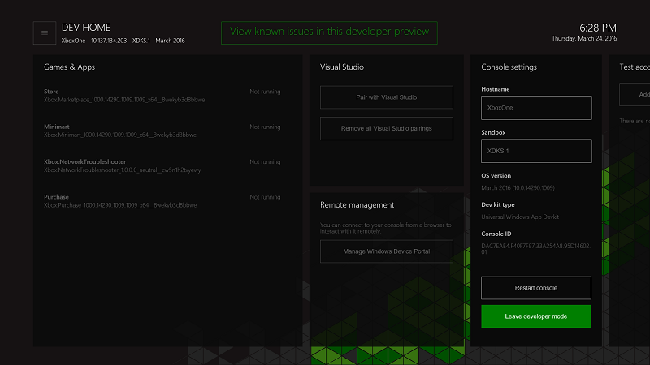

# Ativação do Modo de Desenvolvedor do Xbox One

* [Como o Modo de Desenvolvedor funciona](#how-developer-mode-works)
* [Ativar o Modo de Desenvolvedor no seu console Xbox One de varejo](#activate-developer-mode-on-your-retail-xbox-one-console)  
* [Alternar entre o Modo de Varejo e o Modo de Desenvolvedor](#switch-between-retail-and-developer-mode)

## Como o Modo de Desenvolvedor funciona
O Xbox One tem dois modos: o Modo de *Varejo* (1) e o Modo de *Desenvolvedor* (2). No Modo de Varejo, o console está no estado usado por qualquer cliente ou usuário de um console Xbox One: você pode jogar jogos e executar aplicativos como usuário. No Modo de Desenvolvedor, você pode desenvolver softwares para o console, mas não pode jogar jogos de varejo ou executar aplicativos de varejo.
O Modo de Desenvolvedor pode ser habilitado em qualquer console Xbox One de varejo. Depois que ele é habilitado, você pode alternar livremente entre os Modos de Varejo e (2a) e de Desenvolvedor (2b).

> **Importante**
            &nbsp;&nbsp;Ao ativar o Modo de Desenvolvedor no Xbox One, você consente em receber atualizações do sistema Xbox para uma versão developer preview que inclui softwares experimentais e de pré-lançamento. Isso significa que alguns aplicativos e jogos populares não funcionarão conforme o esperado, e você poderá experimentar falhas ocasionais e perda de dados. Se você sair da developer preview, o console será restaurado para as configurações de fábrica e você precisará reinstalar seus jogos, aplicativos e conteúdo. 

> **Observação**
            &nbsp;&nbsp;Não será possível ativar o Modo de Desenvolvedor no Xbox One se você fizer parte de um programa preview existente, como o programa Xbox One Beta. Para sair de um programa preview existente, use o aplicativo Painel do Xbox Preview. 

## Ativar o Modo de Desenvolvedor no seu console Xbox One de varejo

1.  Inicie seu console do Xbox One.

2.  Procure e instale o aplicativo Ativação do Modo de Desenvolvedor na loja do Xbox One.  
    

3.  Navegue para **Meus jogos e aplicativos** > **Aplicativos**.

    
4. Abra o aplicativo Ativação do Modo de Desenvolvedor.    
    
    > **Observação**
            &nbsp;&nbsp;Certifique-se de ler os avisos de isenção com atenção. Como parte da ativação do Xbox para desenvolvimento, você receberá compilações de pré-lançamento antecipadas. Para jogar jogos e executar aplicativos, você precisará alternar para o Modo de Varejo. Aplicativos de sideload apenas funcionarão no Modo de Desenvolvedor.

5.  Observe o código exibido no aplicativo Ativação do Modo de Desenvolvedor.  

      
    
6.  Acesse o endereço [developer.microsoft.com/xboxactivate](https://developer.microsoft.com/xboxactivate).
7.  Entre no Centro de Desenvolvimento com a sua conta do Centro de Desenvolvimento.  
8.  Insira o código de ativação exibido no aplicativo Ativação do Modo de Desenvolvedor.   
   
     > **Observação**
            &nbsp;&nbsp;Você tem um número limitado de ativações associadas à sua conta. Após a ativação do Modo de Desenvolvedor, o Centro de Desenvolvimento indicará que você usou uma das ativações associadas à sua conta. 
    
        
    
9.  Clique em **Concordar e ativar**. Isso fará com que a página seja recarregada, e você verá seu dispositivo preenchido na tabela.
    
    > **Observação**
            &nbsp;&nbsp;Os termos do contrato do Programa de Ativação do Modo de Desenvolvedor de Xbox One podem ser encontrados [aqui](http://go.microsoft.com/fwlink/?LinkId=760399).

10. Após a inserção do código de ativação, seu console exibirá uma tela de andamento referente ao processo de ativação.  
11. Concluída a ativação, você precisará aguardar até que o seu console seja atualizado para a compilação preview necessária. Tenha paciência, pois isso pode demorar várias horas.  

        
    
12. Concluída a ativação, abra o aplicativo Ativação do Modo de Desenvolvedor e clique em **Alternar e iniciar** para acessar o Modo de Desenvolvedor. Observe que essa etapa demorará mais do que o esperado.  

       
    

    
## Alternar entre o Modo de Varejo e o Modo de Desenvolvedor
Quando o Modo de Desenvolvedor tiver sido habilitado no seu console, use **Dev Home** para alternar entre ele e o Modo de Varejo. Para saber mais sobre como iniciar e usar a **Dev Home**, consulte [Introdução às ferramentas do Xbox One](introduction-to-xbox-tools.md).

* Para alternar para o Modo de Varejo, use **Dev Home** e clique em **Sair do modo de desenvolvedor**. Isso reiniciará o seu console no Modo de Varejo.    

    
  
* Para alternar para o Modo de Desenvolvedor, use o aplicativo Ativação do Modo de Desenvolvedor. Abra o aplicativo e clique em **Alternar e reiniciar**. Isso reiniciará o seu console no Modo de Desenvolvedor.  

    

## Veja também
- [Desativação do Modo de Desenvolvedor do Xbox One](devkit-deactivation.md)
- [UWP no Xbox One](index.md)

<!--HONumber=May16_HO2-->

