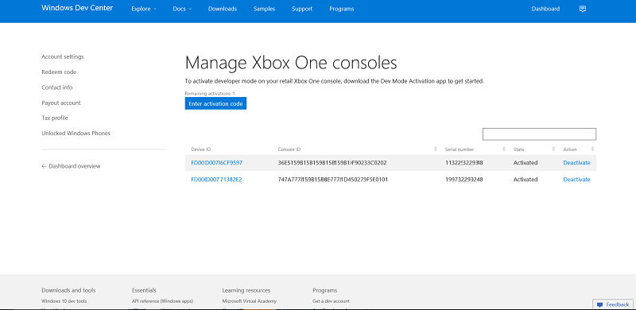

# Desativação do Modo de Desenvolvedor do Xbox One

* [Alternar para o Modo de Varejo](#switch-to-retail-mode)
* [Desativar seu console usando o aplicativo Ativação do Modo de Desenvolvedor](#deactivate-your-console-using-the-dev-mode-activation-app)  
* [Redefinir seu console](#reset-your-console)
* [Desativar seu console usando o Centro de Desenvolvimento do Windows](#deactivate-your-console-using-windows-dev-center)

Se você decidir que não deseja mais usar seu console para desenvolvimento, use as etapas a seguir para desativar o Modo de Desenvolvedor.

## Alternar para o Modo de Varejo
Em primeiro lugar, retorne o console Xbox One para o Modo de Varejo.

1. Abra **Dev Home**.
2. Clique em **Sair do modo de desenvolvedor**.  Seu console será reiniciado no Modo de Varejo.  

   

Agora, desative seu console usando um dos métodos a seguir.

## Desativar seu console usando o aplicativo Ativação do Modo de Desenvolvedor

O método preferencial de desativação do Modo de Desenvolvedor no seu console é usar o aplicativo Ativação do Modo de Desenvolvedor. 

1. Navegue para **Meus jogos e aplicativos** > **Aplicativos**.
  
       
   
2.  Abra o aplicativo Ativação do Modo de Desenvolvedor.    
3.  Clique em **Desativar**.
  

## Redefinir seu console

Você também pode desativar o Modo de Desenvolvedor redefinindo seu console.  

> **Observação**
            &nbsp;&nbsp;Quando o console for redefinido, todos os dados de jogos salvos localmente serão perdidos.

Para redefinir o console, siga estas etapas:

1.  Acesse **Meus jogos e aplicativos**.  
2.  Selecione **Aplicativos** e depois **Configurações**.  
3.  Acesse **Sistema** no painel esquerdo e depois selecione **Informações do console e atualizações** no painel direito.  
4.  Acesse **Informações do console e atualizações**.  
   
      
    
5.  Clique em **Redefinir console**.
    
    
    
6.  Em seguida, clique em **Redefinir e remover tudo**. Essa opção redefine o console para o seu estado de varejo original.  Todos os seus aplicativos, jogos e dados salvos localmente serão excluídos. Observe que, se você escolher a outra opção, **Redefinir e manter meus jogos e aplicativos**, seu console não será removido do programa de desenvolvedores.  
   
    

## Desativar seu console usando o Centro de Desenvolvimento do Windows

Se você não conseguir acessar seu console por qualquer motivo, também poderá desativar o Modo de Desenvolvedor nesse console usando o Centro de Desenvolvimento do Windows.

1. Acesse [developer.microsoft.com/xboxdevices](https://developer.microsoft.com/xboxdevices).    
2. Entre no Centro de Desenvolvimento com a sua conta do Centro de Desenvolvimento.    
3. Localize o console que você deseja desativar na lista de consoles, correspondendo o número de série, a ID de console ou a ID de dispositivo.  
4. Clique em **Desativar**.  
  

Se você ainda não retornou o console Xbox One para o Modo de Varejo, faça isso agora.

1. Inicie **Dev Home**.
2. Clique em **Sair do modo de desenvolvedor**.  Seu console será reiniciado no Modo de Varejo.

## Consulte também
- [Ativação do Modo de Desenvolvedor do Xbox One](devkit-activation.md)
- [UWP no Xbox One](index.md)

<!--HONumber=Jun16_HO4-->

